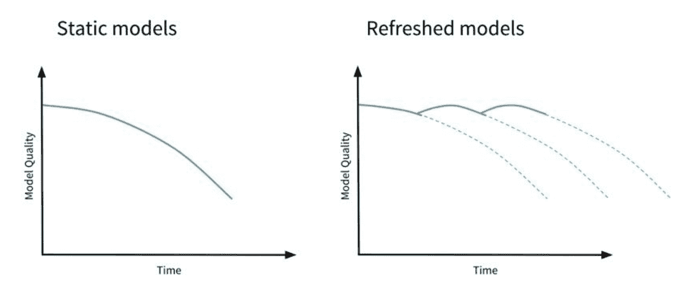

# 部署计算机视觉模型:工具和最佳实践

> 原文：<https://web.archive.org/web/https://neptune.ai/blog/deploying-computer-vision-models>

计算机视觉模型已经变得异常复杂，有各种各样的用例来提高业务效率、自动化关键决策系统等等。但是，如果一个有前途的模型在生产中表现不尽如人意，它可能会成为一个代价高昂的负担。话虽如此，我们如何开发和部署计算机视觉模型事关重大！

机器学习工程师正在他们的模型部署系统中慢慢接受 DevOps 实践，但这并没有结束！我们还需要考虑几个方面，比如代码版本、部署环境、持续培训/再培训、生产模型监控、数据漂移和质量、模型特性和超参数等等。但其中一些实践是特定于机器学习系统的。

在本文中，我们将了解如何在牢记上述方面的同时部署计算机视觉模型。

## 计算机视觉模型生命周期

考虑到只有少数开发的模型进入连续生产环境，部署计算机视觉模型或任何机器学习模型本身就是一个挑战。

CV 模型生命周期从收集质量数据开始，到准备数据、训练和评估模型、部署模型、监控和重新训练模型。可以通过下图直观地看到这一点:


*Computer vision model lifecycle | Source: Author*

在本文中，我们将关注计算机视觉模型的部署阶段。您将学习模型部署的关键方面，包括[工具](/web/20221201165600/https://neptune.ai/blog/best-mlops-tools-for-computer-vision-project)，最佳实践，以及部署计算机视觉模型时需要考虑的事项。

## CV 模型部署模式、平台和 UI

在这一节中，我们将深入探讨部署和服务计算机视觉模型的不同方式。这里需要考虑的关键因素是:

*   部署模式(REST/RPC 端点、边缘、混合)
*   如何提供给最终用户
*   易于访问硬件和部署平台的可扩展性

### 部署模式(REST/RPC 端点、边缘、混合)

托管在内部/云平台上的机器学习模型通常通过 API 端点来部署或访问。像 [REST](https://web.archive.org/web/20221201165600/https://restfulapi.net/) / [RPC](https://web.archive.org/web/20221201165600/https://en.wikipedia.org/wiki/Remote_procedure_call) 这样的 API 本质上为两个系统如何交互提供了语言和契约。

另一种模式是在边缘设备上部署模型，其中通过 CV/认知应用的数据消费发生在起始点。通常，部署也可以是混合的，即 API 端点和边缘设备的组合。

### 它们如何提供给最终用户

根据最终用户使用模型的方式，界面会有所不同。模型可以通过简单的 bash 命令行界面提供给一些用户，而其他用户可以通过基于 web 或基于应用程序的交互式 UI 来使用它。在大多数情况下，模型可以通过 API 提供，下游应用程序使用结果。

### 易于访问硬件和部署平台的可扩展性

就像在 UI/UX 方面可用的选项一样，我们可以在平台或硬件上部署生产模型的大量选项也是可用的。这包括开发人员经常进行代码开发的笔记本电脑、远程机器、远程虚拟机、托管 jupyter 笔记本电脑的远程服务器、部署在云环境中的带有编排器的容器，等等。

以上提到的每一点都将在下面的章节中详细阐述。

## 通过 API (REST/RPC)端点的 CV 部署

REST 代表“代表性状态转移”(作者[罗伊·菲尔丁](https://web.archive.org/web/20221201165600/https://www.ics.uci.edu/~fielding/pubs/dissertation/top.htm))。简而言之，REST 是一种客户机-服务器关系，其中数据通过简单的格式可用/传输，比如 JSON/XML。“RPC”部分代表“远程过程调用”，它通常类似于在 JavaScript、Python 等中调用函数。请阅读这篇文章以获得对 [REST/RPC](https://web.archive.org/web/20221201165600/https://www.smashingmagazine.com/2016/09/understanding-rest-and-rpc-for-http-apis/) 协议的详细理解。

当 ML 部署 API 与另一个系统交互时，这种通信的接触点是通过 REST/RPC 端点发生的。对于 API，端点通常由服务器或服务的 URL 组成。它就像一个软件中介，允许两个应用程序相互交换数据。它也是一组用于构建软件应用程序的例程、协议和工具。一些流行的预训练 CV 云服务完全在 API 端点上提供服务，例如，Google Vision API。

REST 只是决定了 API 架构的外观。简单地说，这是开发人员在创建 API 时遵循的一组规则。

通常，每个 URL 被称为一个请求(API 请求),而发送回您的数据(主要作为 JSON)被称为一个响应。

一个 [API 请求](https://web.archive.org/web/20221201165600/https://israelaminu.medium.com/deploying-ml-models-using-django-rest-api-part-1-da0370a07b90)主要由四个部分组成:

*   端点:端点有一个叫做 URL 的东西，它决定了你请求的资源或数据。在 API 的上下文中，这些 URL 或路径被称为端点。

*   **方法:**方法是你发送给服务器的请求，比如 GET、POST PUT、DELETE 等。

*   **头:**头携带请求和响应体、授权、缓存 cookies 等信息。

*   **数据:**通常以 JSON 字符串和数据 URL 的形式出现。

下面提到了一些我们可以用来创建 Pythonic REST APIs 的工具(假设我们使用 Python 作为 ML 后端代码)。本文的范围不是深入研究这些框架，而是给出它们的一个高层次的概述。

[Flask](https://web.archive.org/web/20221201165600/https://flask.palletsprojects.com/en/2.1.x/) 是用于构建 web 应用和 REST APIs 的 Python 微框架。Flask 的主要工作是处理 HTTP 请求，并将它们路由到后端应用程序中的适当函数。

构建 REST APIs 的另一个流行选项是 Django REST 框架。构建 API 的模式通常被添加到 Django web UI 项目之上。

FastAPI 是一个 Python web 框架，专门用于构建高效的 API。它使用 Python 类型的提示，并内置了对异步操作的支持。FastAPI 框架由于其易用性和多功能性，最近变得越来越流行。

通过 python APIs 部署计算机视觉应用就像部署任何机器学习模型一样。对于面向计算机视觉部署的 API，重要的是您需要传递图像/视频进行处理，并作为后端部署的响应。可以通过下面讨论的一些方法发送图像/视频或其他数据文件

#### 分析器

REST 框架通常有内置的解析器，用来检测请求中的数据类型。其中有 JSONParser、FormParser、MultiPartParser、FileUploadParser 等等。在计算机视觉部署中，FileUploadParsers 将在处理从后端到前端的数据传输中发挥主要作用。

下面显示了一个带有 Flask 框架的文件上传解析器(在我们的例子中，是一个图像/视频等)的样本片段。当然，代码结构随着 Django 和 FastAPI 框架的不同而不同。

```py
from flask import Flask, render_template, request, redirect, url_for

app = Flask(__name__)

@app.route('/')
def index():
    return render_template('index.html')

@app.route('/', methods=['POST'])
def upload_file():
    uploaded_file = request.files['file']
    if uploaded_file.filename != '':
        uploaded_file.save(uploaded_file.filename)
    return redirect(url_for('index'))
```

*代码片段| [来源](https://web.archive.org/web/20221201165600/https://blog.miguelgrinberg.com/post/handling-file-uploads-with-flask)*

对于 python API 创建的详细指南，这将是一篇很好的[文章](https://web.archive.org/web/20221201165600/https://realpython.com/api-integration-in-python/)来通读。

在已部署的机器学习模型的上下文中，用户可以利用 API 端点和相关联的 URL 路径来与底层推理引擎传输数据、流程和事务，这意味着它可以来回传输图像、视频数据和命令。随着时间的推移，使用 API 端点来消费计算机视觉模型的情况必然会增加。

### 计算机视觉 API 提供者

有许多服务提供商提供可以直接与您的应用程序集成的计算机视觉 API。下面将详细讨论其中的一些。有趣的是，您可以选择构建自己的用户界面，或者在这些 API 上使用默认的服务提供商用户界面。

#### 妮克丝

Nyckel 正在提供计算机视觉 API 以及其他可以通过 RESTful HTTPS 请求访问的 API。它们提供了许多预训练的 CV 专用用例，如无条形码扫描仪、质量检测系统、人类情感分析等。

*Nyckel 认知解决方案| [来源](https://web.archive.org/web/20221201165600/https://www.nyckel.com/)*

Nyckel 通过 https 请求支持三种输入数据类型:文本、图像和表格。

**1。Text** :传递文本数据的请求和响应将作为 JSON 字符串处理。

**2。Image** :可以通过以下方式提供传递图像数据的请求:

*   Raw image bytes
*   作为 JSON 请求中的数据 URI

传递图像数据的响应将以 JSON 字符串的形式提供，如下所示:

*   指向图像的 url
*   包含图像的数据 URI。

**3。表格**:它们作为 [JSON 键值对](https://web.archive.org/web/20221201165600/https://www.w3schools.com/js/js_json_syntax.asp)来处理。即请求和响应。它允许用户构建自定义 ui，或者作为更大的应用程序管道中的中间 API。

关于访问 Nyckel API 的完整文档可以通过 web 文档共享[这里](https://web.archive.org/web/20221201165600/https://www.nyckel.com/docs)阅读。

#### aws 识别

它是更广泛的 [AWS 云解决方案套件](https://web.archive.org/web/20221201165600/https://aws.amazon.com/)的一部分。该工具提供了预先训练和可定制的计算机视觉功能，可以从图片、视频等中提取信息。“Rekognition”非常适合初学者，因为它不需要深入了解与计算机视觉相关的理论。Rekognition 的现成解决方案包括内容审核、面部识别、视频分析、文本识别、[等](https://web.archive.org/web/20221201165600/https://docs.aws.amazon.com/rekognition/latest/dg/what-is.html)。

Amazon Rekognition 提供了两个 API 集。*亚马逊 Rekognition Image* 用于分析图片，亚马逊 Rekognition Video 用于分析视频。需要分析的数据将被上传到 [S3 桶](https://web.archive.org/web/20221201165600/https://aws.amazon.com/s3/)中，可以通过[AWS CLI&SDK](https://web.archive.org/web/20221201165600/https://docs.aws.amazon.com/rekognition/latest/dg/setup-awscli-sdk.html)调用。

这两种 API 都可以分析图像和视频，为您的应用提供洞察。或者如前所述，您可以将其用作内部 API，通过 REST/RPC 端点进行访问。

谷歌云视觉 API

#### [Vision API](https://web.archive.org/web/20221201165600/https://cloud.google.com/vision/?utm_source=google&utm_medium=cpc&utm_campaign=japac-IN-all-en-dr-bkwsrmkt-all-super-trial-e-dr-1009882&utm_content=text-ad-none-none-DEV_c-CRE_529584280042-ADGP_Hybrid%20%7C%20BKWS%20-%20EXA%20%7C%20Txt%20~%20AI%20%26%20ML%20~%20Vision%20AI_Vision-google%20cloud%20vision%20api-KWID_43700037527390326-aud-1644542956068%3Akwd-203288731207&userloc_9040215-network_g&utm_term=KW_google%20cloud%20vision%20api&gclid=CjwKCAjw9-KTBhBcEiwAr19ig9cg52OrDA0cT8PZTIfl2twWFZr69nZaEwqZrej5OQ5gKz-whOq4QhoCv5AQAvD_BwE&gclsrc=aw.ds) 通过 REST/RPC API 提供强大的预训练机器学习模型。与亚马逊的 Rekognition 类似，它可以为图像分配标签，并快速将其归类到预定义的类别中。它可以检测物体和人脸，阅读印刷和手写文本。

下面显示的部署架构是针对利用 Google Cloud Vision API 的 OCR 应用程序的。

使用 Vision API 的 OCR(光学字符识别)应用程序中的数据流包括以下步骤:


*Google Cloud Vision API | [Source](https://web.archive.org/web/20221201165600/https://cloud.google.com/functions/docs/tutorials/ocr#functions_ocr_setup-python)*

The flow of data in the OCR (optical character recognition) application using Vision API involves steps shown below:

## 1 上传了包含任何语言文本的图像

*   2 触发视觉 API 提取文本并检测源语言
*   如果目标语言与源语言不同，翻译会排队等候
*   4 翻译 API 被触发，翻译翻译队列中的文本
*   5 将翻译后的文本从结果队列保存到云存储中，供以后访问
*   更多信息，请浏览谷歌云 [OCR 教程](https://web.archive.org/web/20221201165600/https://cloud.google.com/functions/docs/tutorials/ocr#functions_ocr_setup-python)。

Kairos 人脸识别 API

#### Kairos 人脸识别 API 使用计算机视觉算法来分析在图像和视频中发现的类似人类的人脸，并返回有关检测到的人脸的数据。这些数据可用于图像搜索、匹配和比较人脸，或者检测性别或年龄等特征。

Kairos 是一个相当容易实现的计算机视觉 API，为定制业务用例提供基于云的面部识别服务。


*Kairos face recognition API | [Source](https://web.archive.org/web/20221201165600/https://viso.ai/deep-learning/face-detection-overview/)*

CV 模型的边缘部署

## 在深入了解边缘部署的概念之前，了解什么是[边缘计算](https://web.archive.org/web/20221201165600/https://www.ibm.com/in-en/cloud/edge-computing?utm_content=SRCWW&p1=Search&p4=43700055271017258&p5=e&gclid=CjwKCAjw9-KTBhBcEiwAr19ig_iJROYXYPGBKOS8DKib7i6Ds6juKgEZg5geQ9o9rxDWQyZ00kuBwhoCMxcQAvD_BwE&gclsrc=aw.ds)非常重要。

简而言之，边缘计算是一个在相同位置或靠近数据来源的位置进行计算的过程。

如今，企业被大量数据淹没，他们真的不知道如何处理这些数据。传统的分析方法是通过互联网传输生成的数据，用于其他地方的计算工作。但是，由于生成的数据量巨大，并且存在相关的延迟，这种模型已经变得不够用了。这些问题现在通过边缘计算系统来解决。下图显示了云与边缘云与边缘计算的直接对比。

在 CV edge 部署的上下文中，它指的是在云或内部基础架构中创建和训练并部署在边缘设备上的计算机视觉模型。最先进的基于计算机视觉的系统，如自主车辆、制造业中使用的工业机器人、自主无人机等。利用高级别的边缘计算/部署功能。


*Compare edge cloud vs cloud computing vs edge computing | [Source](https://web.archive.org/web/20221201165600/https://www.techtarget.com/searchdatacenter/definition/edge-computing#:~:text=Edge%20computing%20is%20the%20deployment,source%20at%20the%20network%20edge.)*

让我们来看看计算机视觉算法在边缘部署的一些经典用例。下面的示例简要介绍了边缘计算机视觉系统如何帮助零售商(如杂货店)监控现场活动，并及时采取措施优化销量。

现场安装的摄像机可以捕捉顾客在收银台排队、在特定区域拥挤、识别空货架、一段时间内顾客的购买模式、自助收银台发生的盗窃/欺诈等活动的实时视频。

下图显示了在超市环境中被识别和跟踪的对象。完整的论文可以通过这个[链接](https://web.archive.org/web/20221201165600/https://www.researchgate.net/figure/Object-detection-in-a-supermarket-setting_fig3_358501610/download)访问。

CV 模型的另一个应用领域是工业自动化。下图显示了一个在工业环境中对焊缝进行实时质量检测的例子。所示的机器人臂安装有照相机，该照相机识别焊接池中哪里出现问题，以便可以采取纠正措施。捕获的输入流被摄取到基于英特尔 Edge AI 处理器的系统中。该解决方案建立在基于计算机视觉的人工智能推理引擎上，可以检测焊接缺陷，并发送命令立即暂停机械臂，以便及时采取纠正措施。


*Object detection in a supermarket setting | [Source](https://web.archive.org/web/20221201165600/https://www.researchgate.net/figure/Object-detection-in-a-supermarket-setting_fig3_358501610/download)*


*Object tracking in a supermarket setting | [Source](https://web.archive.org/web/20221201165600/https://www.researchgate.net/figure/Object-tracking-in-a-supermarket-setting_fig6_358501610/download)*

几乎所有流行的云服务提供商都提供边缘部署服务。下面讨论了其中的一些问题。


*Weld porosity detection system | [Source](https://web.archive.org/web/20221201165600/https://www.manufacturingtomorrow.com/article/2021/10/ai-machine-vision-based-automated-weld-defect-detection-for-manufacturing-industry/17816)*

[***IBM Edge 应用管理器***](https://web.archive.org/web/20221201165600/https://www.ibm.com/cloud/edge-application-manager)***(IEAM)***是一个模型管理系统，可以在边缘设备上创建、部署和更新机器学习模型。这种特定的解决方案可以管理元数据，并跨多个边缘设备同步部署。在高层次上，该应用程序将有两个组件，一个在云中，另一个托管在边缘设备上，它们将在 HTTPS 连接的帮助下同步。 [IEAM](https://web.archive.org/web/20221201165600/https://www.ibm.com/cloud/edge-application-manager) 模型管理系统的代表图像如下图所示。

Azure 的边缘部署解决方案

### 使用 [Azure stack edge](https://web.archive.org/web/20221201165600/https://www.google.com/search?q=Azure+stack+edge&oq=Azure+stack+edge&aqs=chrome..69i57j0i22i30l9.413j0j4&sourceid=chrome&ie=UTF-8) ，可以将所有 Azure 功能(如计算、存储、网络和 GPU 加速的机器学习)带入任何边缘位置。

边缘设备上的视频分析器的部署架构可能使用以下 Azure 服务:(仅列出了相关的少数服务，实际列表可能会因应用程序而异。)

**[Azure 机器学习](https://web.archive.org/web/20221201165600/https://azure.microsoft.com/en-us/services/machine-learning/) :** 在基于云的环境中构建、训练、部署和管理 ML 模型。

*   **[Azure 视频分析器](https://web.archive.org/web/20221201165600/https://azure.microsoft.com/en-us/products/video-analyzer/) :** 使用您选择的 AI 构建智能视频应用。
*   Azure container registry:构建、存储和管理容器化的(Docker)计算机视觉/ML 模型。
*   Azure stack edge:设计用于边缘的机器学习推理。数据在传输到 Azure 之前在边缘进行预处理，Azure 是一种加速器硬件，可以提高边缘人工智能推理的性能。
*   **[Azure 物联网中心](https://web.archive.org/web/20221201165600/https://azure.microsoft.com/en-us/services/iot-hub/) :** 一种基于云的托管服务，用于物联网设备和 Azure 之间的双向通信。
*   **[媒体服务存储](https://web.archive.org/web/20221201165600/https://azure.microsoft.com/en-us/blog/storage-for-media-services/) :** 使用 [Azure 存储](https://web.archive.org/web/20221201165600/https://azure.microsoft.com/en-us/product-categories/storage/)存储大型媒体文件。
*   **本地数据:**存储并用于机器学习模型的训练。
*   下面的示例图简要介绍了 Azure 如何帮助杂货店等零售商监控实时事件并采取及时行动。现场安装的摄像机可以捕捉顾客在收银台排队、顾客在特定区域拥挤、识别空货架、顾客在一段时间内的购买模式、自助收银台发生的盗窃或欺诈等活动的实时视频。

下图是 Azure edge 部署为视频分析系统使用的代表性架构。您可以通过相同的链接详细了解部署架构。

AWS 全景

[AWS Panorama](https://web.archive.org/web/20221201165600/https://aws.amazon.com/panorama/) 是亚马逊的一款机器学习(ML)设备和软件开发套件(SDK ),可将 CV 引入内部/边缘设备，尤其是 IP 摄像机。企业可以从他们现有的摄像机中访问许多视频资产，但这些数据仍然没有得到利用，主要是因为没有获得洞察力的正确工具。


*Edge deployment solutions by Azure | [Source](https://web.archive.org/web/20221201165600/https://docs.microsoft.com/en-us/azure/architecture/solution-ideas/media/video-analytics-architecture.png)*

### 通过 AWS Panorama，您可以将计算机视觉引入本地设备，同时降低延迟影响。它适用于边缘设备；因此，默认情况下，互联网带宽有限的情况可以顺利管理。此外，用户可以轻松地将定制的训练模型带到边缘，并构建与定制业务逻辑集成的应用程序

这里是使用 AWS Panorama 的停车场汽车计数器应用程序的实现的链接。

类似于上面引用的例子，可能有过多的类似应用，例如计算购物中心的访客数量、计算任何给定时间的交通密度、改善餐馆运营等。

CV 模型部署 UI


*Parking lot car counter using AWS Panorama | [Source](https://web.archive.org/web/20221201165600/https://d2908q01vomqb2.cloudfront.net/f1f836cb4ea6efb2a0b1b99f41ad8b103eff4b59/2020/12/18/19-Parking-Lot.jpg)*

在讨论了 API 端点之后，我们讨论 CV 部署可用的流行 UI 选项的时机已经成熟。让我们探索一些流行且方便的 UI 选项。

## 命令行界面

命令行界面(CLI)是一种基于文本的用户界面(UI)，用于运行程序、管理计算机文件以及与计算机进行交互。CLI 接受通过键盘输入的输入命令；在命令提示符下调用的命令然后由计算机运行。

### [Bash](https://web.archive.org/web/20221201165600/https://en.wikipedia.org/wiki/Bash_(Unix_shell)) 是 Linux、Mac OS 最常用的 CLI，[PowerShell](https://web.archive.org/web/20221201165600/https://docs.microsoft.com/en-us/powershell/scripting/overview)/Windows 的命令提示符。

这里的要求是 CLI 识别 python 文件，该文件包含 CV 代码和输入数据。结果会生成并存储在您以后可以访问的位置。但是如前所述，由于显而易见的原因，这种模型服务的方式通常对潜在用户不是很有吸引力。

带有 Flask-REST API、HTML 和 CSS 的 Web 应用程序

Flask 是一个小型轻量级的 Python web 框架，它提供了有价值的工具和特性，使得用 Python 创建 web 应用程序和 API 变得更加容易。它允许我们创建轻量级的 web 应用程序，您可以用相当低的代码在本地机器、云环境或容器中运行。它还可以在浏览器上呈现 HTML 文本，允许您定制用于模型服务的 UI。因此，如果我们能在使用 HTML 的同时使用 CSS，这将变得更具视觉吸引力，与我们在网上冲浪时看到的网络应用程序相一致。

### 下面显示了 python 使用 Flask 的代码片段:

通过执行上面显示的代码片段，会发生以下情况:

导入 Flask 模块并创建 Flask web 服务器

```py
from flask import Flask, render_template

app = Flask(__name__)

@app.route("/")
def home():
    return render_template("homePage.html")

@app.route("/new_address")
def salvador():
    return "Hello, new_address!"

if __name__ == "__main__":
    app.run()
```

__name__ 表示当前文件

*   app . route(“/”)表示默认页面。当我们将浏览器连接到本地主机端口时，会弹出此消息
*   render_template 呈现代码提供的 HTML & CSS 文件；这使得用户界面更好！
*   来自浏览器的 app.route("/new_address ")路由到代码片段中显示的下一个方法，该方法又打印出" Hello，new_address！"
*   有关更多信息和实际实施，请参考此[文章](https://web.archive.org/web/20221201165600/https://www.freecodecamp.org/news/how-to-build-a-web-application-using-flask-and-deploy-it-to-the-cloud-3551c985e492/)。
*   下面显示了一个使用基于 Flask 的 web 应用程序的例子，该应用程序是为多类[图像分类](/web/20221201165600/https://neptune.ai/blog/image-classification-tips-and-tricks-from-13-kaggle-competitions)定制的。

如果你想开发一个类似的应用并进一步阅读，请点击这个[链接](https://web.archive.org/web/20221201165600/https://www.youtube.com/redirect?event=video_description&redir_token=QUFFLUhqbEtlSjQwVjVCcENXRjhjTm9jTWhBYWtYSzNFQXxBQ3Jtc0ttQ1ZCcndTblpZY1hoWVFOSGdUVVFzOG9ZZGZTRGxrMDBoZjYwNmg2OXBHc2gtanRvMjBralF1bEhlNWVJX2NBZ3RtOHlNdTVheUhfc1c5XzFMOGM1UFhrd0ZEZDQ5eUdwRUJHcS1oaklQc3lKSktxTQ&q=https%3A%2F%2Fbuffml.com%2Fmulti-class-image-classification-flask-app-complete-project%2F)。

使用 Flask 的模型部署非常适合本地部署，甚至是在有许多用户使用 API 的云服务器上。你可以使用` [docker-compose](https://web.archive.org/web/20221201165600/https://docs.docker.com/compose/) 和 [Nginx 负载均衡器](https://web.archive.org/web/20221201165600/https://docs.nginx.com/nginx/admin-guide/load-balancer/http-load-balancer/)构建一个可伸缩的 Flask 应用程序，其中 Nginx 是一个开源的 HTTP web 服务器，也可以充当反向代理服务器。


*Example of using Flask based web application tailored for multiclass image classification | [Source](https://web.archive.org/web/20221201165600/https://www.youtube.com/watch?v=T8k8TOO4-xc)*

使用 Docker-compose，您可以创建由 Nginx 负载平衡器提供服务的 Flask 应用程序的多个实例。您可以在这篇[文章](https://web.archive.org/web/20221201165600/https://www.linkedin.com/pulse/building-python-scalable-flask-application-using-nginx-itay-melamed/)中浏览相同的详细实现。

带有 Flask API(或任何 Python API)和 React FE、CSS 的 Web 应用程序


*Building a Python scalable Flask application using docker-compose and Nginx load balancer | [Source](https://web.archive.org/web/20221201165600/https://www.linkedin.com/pulse/building-python-scalable-flask-application-using-nginx-itay-melamed/)*

香草烧瓶并不总是用户友好的。自动用户界面更新、动态查询等并不总是有用的。

### 此外，我们不能指望它能创造出像 React 或 Angular 那样酷的 ui，除非你已经在其中嵌入了一些高级的 JQuery 表单提交技术。React Native 是目前最流行(也是最强大)的 web UI 工具之一。它支持一些最广泛使用的网络/移动应用程序和界面。

作为一名熟悉 Python 的经验丰富的数据科学家，使用基于 JavaScript 的工具对您来说可能很困难。但是通过将 React 与 Flask API & python 耦合用于后端，这就成为了为 CV 模型创建 UI 的最酷的方式之一。下面是使用 React 原生 UI 进行图像分类的截图。

这里有一个使用 React 和 Tensorflow 创建图像分类 app 的[链接](https://web.archive.org/web/20221201165600/https://www.youtube.com/watch?v=S_Lg1bVbqY4)。部署到 Heroku 的 React 和 Flask 的另一个实现在这里显示为。

决定使用 React for UI 意味着雇佣一个专门的 UI 开发人员或者学习一个新的 UI 工具和脚本语言！。


*React Native UI for image classification | [Source](https://web.archive.org/web/20221201165600/https://www.youtube.com/watch?v=S_Lg1bVbqY4)*

使用细流服务 web ui 的模型

在我看来， [Streamlit](https://web.archive.org/web/20221201165600/https://streamlit.io/) 可能是一位经验丰富的数据科学家创建 web 应用程序的最快方式，他对 Python 比对 Javascript 更熟悉(React 主要基于 Javascript)。开发人员可以创建一个 web 应用程序以及后端 ML 算法。所以与基于 Flask/React 的系统不同，它不需要单独的 http/s 路由来发送 JSON 数据。最好的部分是，它有内置的功能来呈现表格，图像，gif 数据等。，放到网络屏幕上，而且也是开源的！你还需要什么？

### 出于同样的原因，它正在成为服务于计算机视觉模型或者任何机器学习模型的最流行的方式之一。

下面展示了一个 Streamlit web UI 有多酷的例子:(所有这些都使用了最少的 python 风格代码！)

CV 模型服务平台

上面讨论的所有事情，不管是 ML 生命周期操作还是 UI，都需要某种平台来操作。这些平台之间的选择通常主要基于:


*Model serving web UI with Streamlit | [Source](https://web.archive.org/web/20221201165600/https://www.youtube.com/watch?v=1y1o4XoFIuA)*

## CV model serving platforms

1 涉及的费用

## 2 组织对云提供商的选择

*   3 可用的内部基础设施
*   4 目标用户角色的技术成熟度
*   5 目标用户量等。
*   例如，用户通常希望在使用解决方案时，人工智能是不可见的。这意味着用户通常不想纠结于基于人工智能的复杂决策。
*   对他们来说，部署在任何云平台上的 web 应用程序形式的 UI 就足够了。但是在某些情况下，用户需要足够的灵活性来修改算法&需要定制的用户界面。你如何为你的模型服务将取决于上面提到的因素。

许多云服务提供商都有完全集成的机器学习平台。让我们来看看其中的几个。

aws pagemaker

[SageMaker](https://web.archive.org/web/20221201165600/https://aws.amazon.com/sagemaker/) 是 AWS 完全集成的机器学习平台。它具有图像注释平台、嵌入式 Jupyter 笔记本环境、实验跟踪、模型监控等功能。与 Rekognition 中给出的点击式解决方案相比，它还是一个开发需要仔细裁剪和定制的机器学习算法的优秀工具。

### 该生态系统与所有其他 AWS 相关工具配合得非常好。因此，如果您的组织是 AWS 的客户，并计划构建复杂的计算机视觉或任何机器学习模型，Sagemaker 将是现有套件的一个很好的补充。

在[中给出了端到端多类图像分类的示例。该示例](https://web.archive.org/web/20221201165600/https://sagemaker-examples.readthedocs.io/en/latest/introduction_to_amazon_algorithms/imageclassification_caltech/Image-classification-fulltraining-highlevel.html)具有通常的机器学习项目步骤:

The ecosystem works very well with all other AWS-related tools. Hence, if your organization is an AWS customer and plans to dive into building complex computer vision or any machine learning models, Sagemaker would be a great addition to the existing suite.

1 预处理

## 2 数据准备

*   3 模特培训
*   4 超参数调谐
*   5 训练&推论
*   以上分享的文章里都有提到。
*   除了图像分类，Sagemaker 还提供了内置的注释工具，用于语义分割、实例分割、对象检测等。但是一些独立工具(本文前面已经讨论过)所提供的复杂程度可能会比这些通用注释服务更好。

下图显示了 Sagemaker 提供的一些注释选项。

下图显示了一个使用 Sagemaker 进行语义分段的例子。

Azure 机器学习


*Image annotation options using Sagemaker | [Source](https://web.archive.org/web/20221201165600/https://www.youtube.com/watch?v=_FPI6KjDlCI)*

Azure ML 是另一个基于云的环境，你可以用它来训练、自动化、部署和监控机器学习模型。


*Semantic segmentation annotation using Sagemaker | [Source](https://web.archive.org/web/20221201165600/http://www.youtube.com/watch?v=z1g6m3AqNYM)*

### Azure 中的自动化 ML 支持计算机视觉任务的模型训练，如图像分类、对象检测和实例分割。目前通过 Azure 机器学习 Python SDK 支持为计算机视觉任务创作 AutoML 模型。由此产生的实验运行、模型和输出可以从[Azure Machine Learning studio UI](https://web.archive.org/web/20221201165600/https://studio.azureml.net/)访问。

它内置了与流行的机器学习和深度学习库的集成，如 [Pytorch](https://web.archive.org/web/20221201165600/https://pytorch.org/) 、 [TensorFlow](https://web.archive.org/web/20221201165600/https://www.tensorflow.org/) 、 [MLflow](https://web.archive.org/web/20221201165600/https://mlflow.org/) 等。有趣的是，它有自己的开源 MLOps 环境。下面显示了使用 Azure ML 的 ML 管道的步骤，这对于使用计算机视觉的管道也是常见的:

Automated ML in Azure supports model training for computer vision tasks like image classification, object detection, and instance segmentation. Authoring AutoML models for computer vision tasks are currently supported via the Azure Machine Learning Python SDK. The resulting experimentation runs, models, and outputs are accessible from the [Azure Machine Learning studio UI](https://web.archive.org/web/20221201165600/https://studio.azureml.net/).

1 任务类型选择

## 2 数据消耗

*   3 数据增强
*   4 配置和运行实验
*   5 评估指标的选择
*   6 超参数优化
*   7 注册和模型部署
*   与 AWS 环境提供的功能类似，Azure AutoML 支持图像分类、图像分类多标签、图像对象检测、图像实例分割等任务。
*   右侧还显示了不同的内置注释工具。因此，带有相当简单注释的 CV 项目可以在 Azure ML 中轻松处理。

下面的架构展示了如何在支持 GPU 的机器集群之间进行 CV 模型的分布式训练。该场景是图像分类，但是该解决方案可以推广到其他 CV 用例

例如语义分割、对象检测等。

使用 Azure Kubernetes web 服务可以轻松部署在 Azure 中端到端开发的 CV 模型。

这里有一个[链接](https://web.archive.org/web/20221201165600/https://docs.microsoft.com/en-us/azure/machine-learning/how-to-auto-train-image-models)设置 AutoML 用 Python 训练计算机视觉模型。如果您想进一步探索 Azure ML 的功能，请仔细阅读。

谷歌云人工智能平台

这个平台是谷歌的另一个相当先进的平台，具有许多支持机器学习生命周期管理的功能。谷歌在计算机视觉方面提供的旗舰产品有:

### **[Vertex AI](https://web.archive.org/web/20221201165600/https://cloud.google.com/vertex-ai?utm_source=google&utm_medium=cpc&utm_campaign=japac-IN-all-en-dr-bkws-all-all-trial-e-dr-1009882&utm_content=text-ad-none-none-DEV_c-CRE_424314640471-ADGP_Hybrid%20%7C%20BKWS%20-%20EXA%20%7C%20Txt%20~%20AI%20%26%20ML%20~%20AI%20Platform_AI%20Platform-KWID_43700042852054351-aud-1589252136686%3Akwd-462879816162&userloc_9040215-network_g&utm_term=KW_google%20cloud%20ai%20platform&gclid=CjwKCAjw9-KTBhBcEiwAr19ig273ax5Mx7h7j-NGJHBltXp0qrOeE8Kc2kYt035gbBgrc_KTn0Zn-hoCmOEQAvD_BwE&gclsrc=aw.ds) :** 将所有的谷歌云服务，连同一个 UI 和一个 API，集合在一个平台下。在 Vertex AI 中，您可以使用 AutoML 或自定义代码训练来训练和比较模型，并且您的所有模型都存储在一个中央模型库中。Google 提供的所有 MLOps 工具都可以在一个平台上使用。

**[AutoML Vision](https://web.archive.org/web/20221201165600/https://cloud.google.com/vision/automl/docs) :** 提供了一个易于使用的 GUI 来训练您自己的定制 CV 模型。AutoML Vision 优化了模型的准确性、延迟和大小，并将它们导出到云或任何边缘设备。

1.  谷歌公司的另一个强大的解决方案是[视觉检测 AI](https://web.archive.org/web/20221201165600/https://cloud.google.com/solutions/visual-inspection-ai) 。这直接应用于检测制造业中的产品缺陷。

2.  一些应用包括机器人焊缝的视觉检查、PCB 检查等。

*目测 AI | [来源](https://web.archive.org/web/20221201165600/https://cloud.google.com/solutions/visual-inspection-ai)*

您将发现来自同一来源的易于学习的用例，以帮助您开始使用任何 google cloud vision 工具。无论需求是什么，谷歌云工具都有适合你的价格。它可以是按使用付费、按比例按月收费、按节点小时固定费率等。

Kubeflow

[Kubeflow](https://web.archive.org/web/20221201165600/https://www.kubeflow.org/) 是另一个开源的机器学习平台，与各大云平台无缝集成。

### Kubeflow 旨在让机器学习(ML)工程师和数据科学家轻松利用云资产(公共或内部)来处理 ML 工作负载。通过 Kubeflow，Jupyter 笔记本电脑可以开发 ML 模型并创建 Kubernetes 资源，以便在任何平台(即内部、远程或云环境)上培训、封装和部署其模型。由于 Kubeflow 开发的初始阶段发生在谷歌，它已经具有与谷歌云平台(GKE-谷歌 Kubernetes 引擎)的出色集成能力。

运行在 Kubernetes 之上的 Kubeflow 可以在云和内部平台上运行，但部署 Kubernetes 优化的机器学习模型是一项艰巨的工作。然而，开发人员一直在努力简化它的采用。

无论是哪种情况，Kubeflow 都是部署计算机视觉模型以及云服务提供商甚至内部安装的绝佳平台。

从计算机视觉模型部署的角度来看，当提供充足的资源(如 RAM、存储空间和处理能力)时，Kubeflow 可以创建可伸缩的 CV 部署。MLOps 工程师在使用它时面临的一个问题是学习和掌握 Kubeflow 提供的功能的内在复杂性。


*A diagrammatic workflow for deploying deep learning models using Kubeflow in Azure | [Source](https://web.archive.org/web/20221201165600/https://medium.com/microsoftazure/deploying-deep-learning-models-using-kubeflow-on-azure-d303c904c6db)*

Neptune.ai

Neptune 是 MLOps 的元数据存储，为运行大量实验的团队而构建。它为您提供了一个单一的位置来记录、存储、显示、组织、比较和查询所有的模型构建元数据。

### 海王星是一个理想的工具:

说到数据版本控制，Neptune 是一个可靠的轻量级解决方案。

从 CV 模型部署的角度来看，Neptune 为每次实验运行中的每个模型性能参数提供了大量的见解。这为试验更多的超参数(如学习率、优化算法等)提供了足够的空间。因此，通过这些功能，为 AI 开发人员简化了生产部署的模型选择。

下图显示了与 CV 模型实验相关的跟踪仪表板。这是一个[定制仪表板](https://web.archive.org/web/20221201165600/https://docs.neptune.ai/you-should-know/displaying-metadata#how-to-create-a-custom-dashboard)，任何人都可以在 Neptune 为 ML 项目创建它。

工具[将](/web/20221201165600/https://neptune.ai/integrations)与众多流行的机器学习库很好地集成在一起，如 [Scikit learn](https://web.archive.org/web/20221201165600/https://docs.neptune.ai/integrations-and-supported-tools/model-training/sklearn) 、 [TensorFlow](https://web.archive.org/web/20221201165600/https://docs.neptune.ai/integrations-and-supported-tools/model-training/tensorflow-keras) 、 [Pytorch](https://web.archive.org/web/20221201165600/https://docs.neptune.ai/integrations-and-supported-tools/model-training/pytorch) 、 [XGBoost](https://web.archive.org/web/20221201165600/https://docs.neptune.ai/integrations-and-supported-tools/model-training/xgboost) 、 [LightGBM](https://web.archive.org/web/20221201165600/https://docs.neptune.ai/integrations-and-supported-tools/model-training/lightgbm) 等等。

随着计算机视觉中使用的 PyTorch 和 TensorFlow 等流行库的集成，Neptune 将非常有能力处理基于这些库的 CV 模型。

[](https://web.archive.org/web/20221201165600/https://neptune.ai/deploying-computer-vision-models28)

*Custom dashboard created for a Computer Vision project in Neptune | [Source](https://web.archive.org/web/20221201165600/https://app.neptune.ai/common/project-cv/e/PROJCV-103/dashboard/model-a72c0f5f-76e0-4386-b960-b186427a8b91)*

MLflow

MLflow 是一个管理 ML 生命周期的开源平台，包括实验、可复制性、部署和中央模型注册。MLflow 提供了诸如实验跟踪、模型打包、模型注册等功能。MLflow 集成了大多数流行的机器学习工具/库，如 Scikit learn、Tensorflow、Pytorch、Spark 等。此外，Docker & Kubernetes 等容器化工具以及与最流行的云平台的内置集成也是可用的。

### 和其他 ML 项目一样，MLflow 也可以支持计算机视觉相关的项目。这包括为实验模型、在每个实验中产生的工件等创建模型注册。下图显示了 MLflow 可以集成的一些流行库。实际列表比图表中显示的要大。Databricks 内置了与 MLflow 的集成。

MLflow 易于与 docker-compose 代码集成，这也使它成为开源代码用户中一种流行的部署替代方案，用于快速的容器化部署。作为一个开源工具，MLflow 在处理模型注册和元数据方面非常通用。因此，如果您的 CV 模型部署预算有限，这将是一个理想的平台。

使用 MLflow & Redis AI 制作计算机视觉模型的例子可以在这个[链接](https://web.archive.org/web/20221201165600/https://www.youtube.com/watch?v=ZIqHGjiSff4)上看到。

阿帕奇气流

这是一个主要用于数据工程管道的工作流管理平台。[气流](https://web.archive.org/web/20221201165600/https://airflow.apache.org/)是用 Python 写的。因此，Airflow 的一个关键优势是，您可以通过 python 脚本编排工作流。工作流被设计成大部分是静态的或缓慢变化的。预计气流工作流程在后续运行中看起来相似；这使得工作单元和连续性更加清晰。

从计算机视觉的角度来看，气流可以用于对图像数据集、它们的版本化等执行某种流水线操作。一个有趣的用例是流入训练自动驾驶算法的图像/视频数据。新的数据集需要通过转换管道进行传递，以便持续进行模型再训练和数据漂移监控。

DVC

[DVC](https://web.archive.org/web/20221201165600/http://dvc.org/) 的建立是为了让 ML 模型可以共享和复制。它是专门为处理大型数据集、文件、ML 模型、元数据以及代码而设计的。它是所有类型的 ML 部署的通用工具，而不仅仅是专门针对计算机视觉的。


*Object detection for self-driving cars | [Source](https://web.archive.org/web/20221201165600/https://www.hackerearth.com/blog/developers/object-detection-for-self-driving-cars/)*

DVC 提供以下功能:


*DVC matches the right versions of data, code, and models | [Source](https://web.archive.org/web/20221201165600/https://dvc.org/doc/use-cases/versioning-data-and-model-files)*

**[数据版本控制](https://web.archive.org/web/20221201165600/https://dvc.org/) :** 允许您在 Git 提交中捕获数据和模型的版本，同时根据选择的存储硬件将它们存储在本地或云存储中。

**ML 项目版本控制:**即通过连接 google 云存储、Amazon s3 buckets 等云存储，对 ML 模型和数据集&元数据进行版本控制。

1.  ML 实验跟踪:使用 Git 版本控制来跟踪实验。DVC 在 Git 中做实验和关联分支一样快。
2.  部署和协作:由于其固有的类似 git 的功能，生产部署也更加直观。此外，不同团队之间的强大协作是可能的，并且引入了高度的灵活性。
3.  CV 模型部署成熟度级别
4.  ML 部署的成功很大程度上取决于自动化水平。因此，这意味着在生产中维护模型所需的人工干预越少，它就变得越成熟。

成熟度级别可以归因于下面显示的当前部署实践。你可以在[谷歌云文档](https://web.archive.org/web/20221201165600/https://cloud.google.com/architecture/mlops-continuous-delivery-and-automation-pipelines-in-machine-learning#devops_versus_mlops)页面阅读详细文章。本节不是专门针对计算机视觉的，而是针对所有 ML 模型部署的通用指南。

手动过程

顾名思义，ML 模型开发周期的每一步都是手工完成的。这个过程更具实验性和反复性。模型开发、验证等。，发生在 iPython 笔记本或类似的快速开发环境中。通常，每一个步骤都是相互分离的。然而， [CI/CD 操作](/web/20221201165600/https://neptune.ai/blog/ways-ml-teams-use-ci-cd-in-production)在这一级不存在。当数据科学家/团队只处理很少的模型和数据集时，它特别适合，这些模型和数据集通常不会随时间而改变。

### 与计算机视觉模型相关的典型步骤包括:

通过网络搜集或开放数据集收集训练数据

使用注释工具

*   使用笔记本进行代码/模型开发
*   模型训练和验证的迭代步骤
*   将模型交给工程团队进行 API 配置、测试和部署。
*   对于刚刚开始在用例中应用机器学习的企业来说，这种成熟度是常见的。但它也带来了各种挑战，例如模型无法适应输入数据的变化，或者在最坏的情况下，模型可能在生产中失败。CI/CD/CT 等 MLOps 实践有助于应对这些挑战。
*   ML 流水线自动化

在这个自动化水平上，再培训和交付是自动进行的。这意味着，当大量新数据到达时，或者随着时间的推移，或者当观察到模型性能漂移时，就会触发重新训练。在参数空间中运行实验、记录生产模型、模型验证和生产模型的重新部署预计会在这个成熟度级别自动发生。

### 这一级别的 ML 管道的一些特征是:

快速实验

持续培训

*   组件和管道的模块化和可重用代码。
*   连续发货等等。
*   在此阶段可以预期的一些附加组件有:
*   数据有效性

在这一级，需要通过预先构建的数据管道来验证数据。这包括对数据质量、漂移、偏斜、稳健性等的检查。如果较新的数据不符合遗留模式，则应停止培训管道，并提醒数据科学团队缓解这些问题。

#### 模型验证

自动化管道预计将针对较新的训练数据，针对现有的生产模型来评估新训练的模型的性能。例如，在计算机视觉对象检测模型的情况下，必须确保新训练的模型的所有对象类(或至少三分之二的对象类)的平均 IoU ( [交集/并集](https://web.archive.org/web/20221201165600/https://medium.com/analytics-vidhya/iou-intersection-over-union-705a39e7acef#:~:text=IOU(Intersection%20over%20Union)%20is,fits%20perfectly%20around%20an%20object.))的平均精度优于现有的生产模型。

#### CI/CD/CT

在这一级，模型部署升级到完全可扩展的架构。最常见的是具有健壮的 web 用户界面、负载平衡器、可伸缩数据库等的云部署。随着可训练数据的不断增加，基于并行和 GPU 的计算在这一阶段变得更加重要。模型性能参数被更详细地审查。

### 它可以包括:

源代码控制:跟踪和管理代码变更的实践

测试服务:评估和验证一个产品做了它应该做的事情的过程

*   **[模型注册中心](/web/20221201165600/https://neptune.ai/blog/ml-model-registry) :** 一个中央存储库，允许模型开发人员发布生产就绪的模型以便于访问
*   **特征库:**一个集中的存储库，在这里可以标准化对用于训练&服务的特征的访问。
*   元数据管理:关于实验、模型参数、时间戳、模型性能度量、模型工件等等的信息。
*   **可扩展的集装箱化部署**
*   **网络流量负载平衡器，数据库扩展**等。
*   可扩展的 MLOps 设置保证了如下所示的几个组件:

令人惊讶的是，只有一小部分机器学习系统是由 ML 相关代码组成的。周围的组件使它变得复杂。

因此，我们在 DevOps(开发和操作大规模软件系统的流行实践)中遵循的一些步骤也经常在 MLOps 中使用。比如:

Surprisingly only a small fraction of Machine learning systems are composed of ML-related code. The surrounding components make it complex.

1 持续集成

## 2 连续交货

*   3 持续培训(MLOps 独有)
*   但是在 MLOps 的上下文中，CI 不仅仅是关于代码测试和验证，还包括验证数据质量和模型特性。在 CD 环境中，还有额外的交付培训渠道和预测服务。
*   计算机视觉模型部署的最佳实践

测试驱动的机器学习开发

## 这是从传统的[测试驱动软件开发](https://web.archive.org/web/20221201165600/https://en.wikipedia.org/wiki/Test-driven_development)中借鉴来的另一种实践。

### *“测试驱动开发(Test-driven development，TDD)是一种软件开发过程，它依赖于在软件完全开发之前将软件需求转换为测试用例，并通过针对所有测试用例重复测试软件来跟踪所有软件开发。这与先开发软件，后创建测试用例的情况相反"*

因此，测试和代码不是一开始就开发一个成熟的解决方案，而是在以后的阶段进行测试，而是一次一个功能地迭代构建在一起。

> 自动化测试和 TDD 在几个方面帮助了人工智能工程师。其中一些是:
> 
> [*Source*](https://web.archive.org/web/20221201165600/https://en.wikipedia.org/wiki/Test-driven_development)

**提供及时反馈**:即时了解代码是否符合规范，及早发现问题，进行增量调试。

迭代地解决挑战:就像通过小增量开发软件一样，类似的方法也可以在人工智能系统开发中使用。

*   花费很少或没有浪费精力:只写实现需求所需的代码。
*   TDD 使得组织代码和有效解决问题变得容易。这篇[文章](https://web.archive.org/web/20221201165600/https://www.ibm.com/garage/method/practices/reason/tdd-and-machine-learning/)展示了一个*计算机视觉*网络应用的一步一步的测试驱动开发。你可以在[这篇文章](https://web.archive.org/web/20221201165600/https://www.ibm.com/garage/method/practices/code/practice_test_driven_development/)中了解到一个更通用的适用于所有人工智能系统的 TDD 方法。

测试驱动开发的另一个很好的解释在这篇[文章](https://web.archive.org/web/20221201165600/https://www.xenonstack.com/blog/machine-learning-unit-testing)中给出。ATDD 代表验收测试驱动的开发。在开始开发之前，这项技术在循环中涉及到客户、测试人员和开发人员。验收标准是根据所有相关利益方的共识决定的。ATDD 确保所有利益相关者与团队努力的目标一致。

计算机视觉模型的单元测试


*Test-driven machine learning procedures to reduce risks | [Source](https://web.archive.org/web/20221201165600/https://www.xenonstack.com/hubfs/test-driven-development-machine-learning-xenonstack.png)*

单元测试是测试驱动软件开发必不可少的便捷技术。单元测试包括测试源代码的各个部分，主要是函数和方法，以确定它们满足预期的行为/输出。

### 单元测试通常是轻量级的，不需要太多的计算工作。特定的 python 库可以帮助您设置这些框架。CV 模型管道中单元测试的一个例子是断言由数据加载器函数返回的图像或张量的大小。

模型监控:确保 CV 模型部署保持相关性的方法！

在生产中，计算机视觉模型可能比生产中的 NLP 相关模型退化得更快。这完全是因为我们看到的事物变化的速度比我们使用语言的速度快得多。

那么，我们需要监控哪些参数呢？嗯，它们就是我们首先用来测试模型性能的那些！。要监控的参数因型号而异。除了统计指标，我还建议在你考虑任何再培训之前进行人工干预。有时，性能衰减可能不会在指标中显示出来，但它在视觉上是可以辨别的。



*Model monitoring: the way you ensure the CV model deployment stays relevant | [Source](https://web.archive.org/web/20221201165600/https://deepchecks.com/wp-content/uploads/2021/03/2-1.png)*

在我们监控生产机器学习模型之前，我们需要有基础事实(标签)。这意味着目标标签是模型监控的黄金标准。嗯，这在很多情况下可能不可行。本节稍后将讨论如何在标签不可用的情况下进行监控。

下面讨论的指标主要基于这样的假设:对于较新的数据集，标签**是可用的**。

目标检测

在计算机视觉中，目标检测是帮助从图像中分类和定位目标的强大算法之一。

#### 您需要监控的主要对象检测指标有:

**并集上的平均交集(IOU):** 它被定义为检测边界框和地面真实边界框的并集上高于评估阈值(比如 0.5)的平均交集。IoU 可以确定检测到的真阳性和假阳性的数量。其他相关参数有精度，回忆一下& F1 的成绩。想了解更多，请参考[这里的](https://web.archive.org/web/20221201165600/https://www.kdnuggets.com/2020/08/metrics-evaluate-deep-learning-object-detectors.html)。

1.  **平均精度(AP):** 平均精度可以定义为在各种 IoU 阈值下，单个对象类的精度/召回曲线下的面积。如果您的对象检测模型被分配为只查找一种特定的对象类型，那么跟踪此指标可能是有意义的。

**平均精度(mAP):** 使用平均精度总体类(如上所述)和总体 IoU 阈值来计算 mAP 分数。


*Average intersection over union (IOU) | Source: Author*

2.  有了上面提到的指标，我们可以在更新的数据集上跟踪模型性能。可以用现有的模型性能值作为基准来决定是否需要重新训练。

3.  语义分割


*The precision-recall curve for SSD model for four object classes,*
*where IoU threshold is 0.5 | [Source](https://web.archive.org/web/20221201165600/https://www.groundai.com/project/satellite-imagery-multiscale-rapid-detection-with-windowed-networks/1)*

语义分割中使用的主要监控指标是 IoU。这与训练模型时用作损失函数的 dice 系数相同。与对象检测相比，语义分割中的 IoU 变得更加精细，即它是在像素级计算的。

#### 就像对象检测一样，IoU 度量是为每个类计算的，以获得平均 IoU 分数，并且可以进行监控。

另一个监控指标可以是**像素精度**，它计算正确分类的像素与图像总像素的比率。


*Ground truth vs predicted pixels | [Source](https://web.archive.org/web/20221201165600/https://www.jeremyjordan.me/content/images/2018/05/intersection_union.png)*

**准确度= TP + TNTP + FP + TN + FN**

在监控过程中，这一指标有时会产生误导，因为随着时间的推移，输入数据会出现类别不平衡。

实例分割

实例分段的监控度量与对象检测非常相似。但在这里，我们寻找的是遮罩的 IoU，而不是边界框。与物体检测不同，在这种情况下，IoU 是按像素计算的。

好了，我们讨论了标签可用于监控模型的情况，如果标签不可用呢？

是的，你没听错！有时标签不可用，也不能完全依赖。但是为什么呢？


*Instance segmentation | [Source](https://web.archive.org/web/20221201165600/https://miro.medium.com/max/1400/1*-zw_Mh1e-8YncnokbAFWxg.png)*

**预测和基础事实标签数据之间的长等待时间:**在要预测的输入数据和它们的基础事实标签可用之间存在长滞后的可能性很大。一个例子可能是:今天生产的故障电路不会被标记，直到生产批次被检查，然后数据被传递给图像标记团队。这可能需要几天甚至几周的时间。

**人工标注**:在大多数情况下，计算机视觉数据标注是一项耗费时间和资源的人工活动

1.  **模型干预:**部署模型时，您可能会根据模型的预测采取行动，这可能会改变传入系统的数据。

2.  在这些场景中，通过捕获不断变化的数据模式及其统计特征，在数据接收阶段进行监控和干预。关于数据漂移，下面将详细讨论这个概念。一个额外的阅读将是文章分享[在这里](https://web.archive.org/web/20221201165600/https://towardsdatascience.com/monitoring-machine-learning-models-62d5833c7ecc)。

3.  一些有用的工具有 [Prometheus](https://web.archive.org/web/20221201165600/https://prometheus.io/) ，它可以帮助存储时间序列，比如指标。Grafana 帮助将存储在普罗米修斯中的数据可视化。两者都是开源工具，可用于模型参数监控/跟踪。

计算机视觉应用中的数据漂移

在生产中，很可能会发生数据漂移，进而影响模型性能。一个典型的例子是，在室外背景上训练的对象检测模型突然被输入来自室内背景的数据。在这种情况下，模型性能可能会下降。

*计算机视觉应用中的数据漂移| [来源](https://web.archive.org/web/20221201165600/https://storage.googleapis.com/openimages/web/visualizer/index.html?set=train&type=detection&c=%2Fm%2F01940j&id=b8c81a2e12abf68b)*

在另一个例子中，仅在来自独特设备的图像上训练的模型暴露于来自不同环境的图像。一种典型的情况是来自不同设备的医学成像数据。在这些场景中，用更新的数据量化模型性能的变化。

解决这些类型的数据漂移的机制将有助于延长部署的计算机视觉模型的寿命。有一些工具可以用来监控这类问题。 [Arthur](https://web.archive.org/web/20221201165600/https://www.arthur.ai/blog/introducing-monitoring-for-computer-vision-models) 是一个漂移检测工具，它可以识别模型是否无法泛化，并提示您采取纠正措施。它们确保进入部署模型的数据看起来像预期的那样。在基于 CV 的系统中，这意味着输入的数据看起来类似于模型被训练的数据。他们的算法是基于这篇[论文](https://web.archive.org/web/20221201165600/https://arxiv.org/abs/2012.07421)中使用的 ***非分布异常*** 算法。

下图显示了输入数据在不同地区以及随时间的变化情况。

监控 CV 模型的算法偏差

就像任何机器学习模型一样，偏见也可能蔓延到计算机视觉系统中。


*How the input data can vary across regions as well as with time | [Source](https://web.archive.org/web/20221201165600/https://arxiv.org/pdf/2012.07421)*

### 根据[技术指标](https://web.archive.org/web/20221201165600/https://www.techtarget.com/searchenterpriseai/definition/machine-learning-bias-algorithm-bias-or-AI-bias#:~:text=Machine%20learning%20bias%2C%20also%20sometimes,in%20the%20machine%20learning%20process.) *:*

*“算法偏差(Algorithm bias)或 AI 偏差(AI bias)是一种现象，当一种算法产生的结果由于机器学习过程中的错误假设而具有系统性偏见*。

例如，人们发现，与白人相比，一些面部识别系统更偏向于有颜色的脸。这可能是由于缺乏对平衡数据集的接触。这些偏见通常是无意的，但它们会造成严重的后果，甚至是法律后果。为了避免这种情况，数据科学家应该充分了解数据集、它们的来源、多样性等。数据应该代表可能受到不利影响的不同种族、性别和文化。

> 谷歌搜索“护士”显示大多是女护士。

谷歌搜索医生显示大多是男医生。


*Google search for “nurse” | [Source](https://web.archive.org/web/20221201165600/https://www.google.com/search?q=nurse&source=lnms&tbm=isch&sa=X&ved=2ahUKEwjXqYqRj-T3AhWZPewKHbWVClMQ_AUoAXoECAIQAw&biw=1440&bih=705&dpr=2)*

这种偏差可能来自以下任何一种情况:


*Google search for “doctor” | [Source](https://web.archive.org/web/20221201165600/https://www.google.com/search?q=doctor&tbm=isch&ved=2ahUKEwim6YWSj-T3AhUIZhoKHYvJCiEQ2-cCegQIABAA&oq=doctor&gs_lcp=CgNpbWcQAzIECAAQQzIECAAQQzIECAAQQzIFCAAQgAQyBAgAEEMyBQgAEIAEMgUIABCABDIFCAAQgAQyBAgAEEMyBAgAEENQpQdYmBBgoRRoAHAAeACAAZ4BiAGhBZIBAzYuMZgBAKABAaoBC2d3cy13aXotaW1nwAEB&sclient=img&ei=l1CCYubBNYjMaYuTq4gC&bih=705&biw=1440)*

**算法偏差**:顾名思义，问题出在机器学习算法上。

**样本偏差**:在这种情况下，训练数据集可能不够有代表性，或者不够大，不能给真实样本空间足够的表示。

1.  **偏见偏见**:在这种情况下，制度反映了社会上现存的偏见/成见。一个例子是上面说明的现有性别刻板印象，例如训练数据集中出现的女护士和男医生。

2.  **测量偏差**:这种偏差是由数据的准确性以及如何测量或评估数据的潜在问题引起的。

3.  **不平衡的类别**:典型的场景可能包括面部特征识别算法，这些算法主要建立在西方白人努力理解典型亚洲面部特征的基础上。

4.  虽然我们知道偏见可以通过许多方式蔓延到最先进的计算机视觉系统中，但意识和良好的治理可以防止这种情况。

5.  这里可以采取一些步骤来解决这些问题:

While we know there are many ways bias can creep even into the state of the art computer vision systems, awareness, and good governance can prevent this.

1 选择具有充分代表性的训练数据

## 2 在模型部署前进行单独的算法偏差测试

*   3 随着输入数据的变化，积极监控偏差
*   IBM 的 [AI fairness 360](https://web.archive.org/web/20221201165600/https://aif360.mybluemix.net/) 是一个开源工具包，可以帮助你在整个 AI 应用生命周期中检查、报告和减轻机器学习模型中的歧视和偏见。
*   CV 模型开发和部署需要考虑的事项

计算机视觉和数据质量

## 训练数据的质量是制造健壮和高效的计算机视觉模型的关键因素。您可以考虑糟糕的数据质量可能导致不想要的结果的场景，例如在制造过程中犯下代价高昂的错误、自动驾驶系统造成的错误等。

人工智能开发人员面临的另一个挑战是转换海量数据，例如，通过创建视频注释。取决于帧速率，注释可能是高度劳动密集型的。典型的自动驾驶系统可能需要带注释的图像、视频、GPS 数据、物联网传感器数据等。此外，生成和存储这些不同的数据点可能会很棘手。

那么我们如何解决这些问题呢？

这是通过人员、流程和技术/工具的组合来实现的。

#### 人

根据组织的规模和预算，注释工作人员可能是雇员、承包商、外包团队、众包人员等的混合。为了生成高质量的数据集，对所使用的工具和有针对性的 CV 应用的基本知识是必要的。令人惊讶的是，该项目的很大一部分成本可能仅仅在于数据准备方面。

#### 过程

当你训练、验证和测试计算机视觉模型时，数据注释过程甚至可以发展。因此，这里重要的是团队应该是敏捷的。它们应该能够根据数据类型、注释类型、使用的工具等进行调整。

#### 技术/工具

这些解决方案可以是基于云的、内部部署的，甚至是内部开发的。如果您的模型需要定制注释类型，开发内部注释工具将是一个好主意。由于大多数商业注释工具提供的功能比开源工具多得多，这里最重要的决定可能是内部构建还是购买。其他需要考虑的因素是集成平台的使用、数据安全性等。

#### 部署硬件

有效的计算机视觉部署融合了硬件和底层软件。我们通常只考虑托管部署的本地硬件系统或云环境。但是大量其他应用包括在边缘设备上进行的部署。即使我们能够开发有效的算法，一些部署也可能是在边缘设备上，在那里您无法访问快速处理器，更不用说 GPU 了！。一些系统还与其他物联网设备集成，增加了更多复杂性。

### 自主无人机是在这种情况下讨论的完美候选，即边缘设备的硬件要求。一些行业现在依靠自主无人机在短时间内完成更多工作。

下图展示了世界各地的军队如何使用自主无人机进行主动监视。如今，许多无人驾驶侦察机都是自动化的、嵌入计算机视觉的边缘机器。

像 [UAV](https://web.archive.org/web/20221201165600/https://www.britannica.com/technology/unmanned-aerial-vehicle) (无人机)这样的设备需要以合理的帧速率处理从摄像机流出的视频。作为一个处理工具， [OpenCV](https://web.archive.org/web/20221201165600/https://opencv.org/) 或者 [Tensorflow Lite](https://web.archive.org/web/20221201165600/https://www.tensorflow.org/lite/guide) 会是不错的选择。另一个突出的例子可能是送货的自动化无人机。他们使用嵌入式视觉来帮助无人机识别他们“看到”的东西，就像无人机可以分辨物体是静止的还是移动的。

这篇[论文](https://web.archive.org/web/20221201165600/https://www.researchgate.net/publication/325201355_Deep_learning_for_vision-based_micro_aerial_vehicle_autonomous_landing)很好地解释了基于视觉的自主无人机的硬件/部署架构。


Autonomous drones used to carry out active surveillance | *[S](https://web.archive.org/web/20221201165600/https://keymakr.com/blog/computer-vision-in-drone-technology/)[o](https://web.archive.org/web/20221201165600/https://keymakr.com/blog/computer-vision-in-drone-technology/)[urce](https://web.archive.org/web/20221201165600/https://keymakr.com/blog/computer-vision-in-drone-technology/)*

其他流行的 edge 设备都是基于 Raspberry Pi 的。Raspberry Pi 4，2GB RAM 型号的起价仅为 35 美元，Raspberry Pi 4 可以作为物联网设备的媒体中心、网络服务器或推理引擎。

来自 Charmed Labs 的 Vizy 配备了一个 Raspberry Pi 4，这是一个嵌入了高分辨率摄像头的智能设备，适用于那些开始使用基于计算机视觉的应用程序的人。Vizy 利用 Raspberry Pi 4 的强大功能和一个高质量的摄像头，让学生或更高级的用户可以轻松构建计算机视觉项目或解决方案。


*Sample hardware architecture of the vision-based autonomous drone navigation | [Source](https://web.archive.org/web/20221201165600/https://www.researchgate.net/publication/325201355_Deep_learning_for_vision-based_micro_aerial_vehicle_autonomous_landing)*


*An autonomous drone: representative | [Source](https://web.archive.org/web/20221201165600/https://www.researchgate.net/publication/325201355_Deep_learning_for_vision-based_micro_aerial_vehicle_autonomous_landing)*

Vizy 是通过网络界面控制的，而不是通过浏览器的 HTTPS 界面的桌面应用程序。在线编辑器和 Charmed Labs 的大量文档和 [API 参考](https://web.archive.org/web/20221201165600/https://docs.vizycam.com/doku.php)使得入门相对容易。电源板，一个 GPIO 附加板，有它的 [API 控制](https://web.archive.org/web/20221201165600/https://docs.vizycam.com/doku.php?id=wiki:api_vizypowerboard)，比如板载 led，风扇控制器，IR 遥控器等。

其他有趣的部署应用包括主要用于仓库/物流应用的 AGV(自动导引车)。最近被称为 vgv(视觉制导车辆)，它们是从 AGV 发展而来的。与 AGV 不同，它们不需要任何磁条或反射器。由于它们是基于地面的，不像无人机，它们可以负担更重的内置硬件。


*Vizy hardware specifications | [Source](https://web.archive.org/web/20221201165600/https://www.tomshardware.com/reviews/vizy-raspberry-pi-ai-camera)*


*Vizy- a raspberry pi-powered AI camera | [Source](https://web.archive.org/web/20221201165600/https://cdn.mos.cms.futurecdn.net/BBuMTwYcEWZTQptrJ6GgXK-970-80.jpg.webp)*

在[亚马逊机器人履行](https://web.archive.org/web/20221201165600/https://www.waredock.com/magazine/what-is-amazon-robotic-fulfillment-center/)中心使用的机器人是另一个具有边缘设备计算能力的计算机视觉模型部署的经典例子。但是，他们再次使用计算机视觉、物联网和传感器数据的组合来导航和执行他们的预期职责。

CV 模型开发和部署的经济性和可行性

明确的业务目标对于部署成功的计算机视觉模型至关重要。比如:


*Robots carrying inventory pods to warehouse I [Source](https://web.archive.org/web/20221201165600/https://www.waredock.com/wp-content/uploads/2019/08/Screenshot-2019-08-01-at-22.50.57.png)*

### 是提高生产效率或盈利能力还是提高销量？

它是否最大化/最小化了与业务目标相关的 KPI？

*   模型部署能够为您的组织带来什么样的货币价值？
*   从长远来看，收益是否大于成本？
*   在组建团队或选择部署工具时，成本效益分析非常有意义。每种工具都有各自的优缺点。一个昂贵的云原生集成平台可以节省大量的培训时间和资源以及数据 ETL 成本，但与此同时，订阅可能会很昂贵。与 NLP 或经典机器学习模型开发相比，计算机视觉模型开发可能会开发额外的工具开销，如专门的注释工具。
*   值得注意的是，近 90%的 ML 模型从未投入生产；计算机视觉模型也是如此。在许多公司中，这背后的一些原因包括我们无法确保在小环境中工作的模型在其他地方也能工作，障碍可能来自数据不可用、云存储不足等形式。

估算计算资源的数量和成本

对于熟练的人工智能开发人员来说，想出一个可行的算法不再是问题。他们已经存在了！挑战通常在于计算资源的可用性。领导者经常低估硬件需求，以及使用云服务时产生的成本。这通常导致他们将大部分预算花费在算法开发上，但是由于其估计成本(通常发生在后期阶段),因此无法进行充分的培训和测试。

### 训练一个 ML 模型要多少钱？

下面是 AI21 研究人员训练不同大小的 BERT NLP 模型的一些大概的标价成本。

两个数字被并列提及-一次训练运行的成本和典型的满载成本。

**$ 2.5k-$ 5 万**(1.1 亿参数模型)

**$ 10k-$ 20 万**(3.4 亿参数模型)

*   **$ 80k-$ 160 万**(15 亿参数模型)
*   好吧，你可能认为这只是 NLP 模型？。那么，看看最新的 CNN 建筑尺寸吧！
*   那里也一样！因此，为了了解所产生的成本，重要的是要知道深度学习模型的大小、训练批量大小、训练次数以及获得令人满意的训练模型所需进行的实验的预期数量。

跨语言和工具支持问题

许多旧的计算机视觉模型都是用 open CV 构建的(主要是用 C++构建的)。后来 Python 脚本的兴起，导致 Pytorch、Caffe、Tensorflow 等工具的广泛使用。最近，随着 Tensorflow JS(基于 Javascript)的到来，CV 也嵌入到网络应用和边缘/移动设备中。这意味着您也可以将您的 ML 模型带入前端！。现在是[朱丽亚](https://web.archive.org/web/20221201165600/https://towardsdatascience.com/machine-learning-in-julia-5bca700e0348)的黎明！

由于每种语言都有独特的库和依赖集(甚至是硬件)，ML 项目很快变得难以构建和维护，更不用说我们专门的计算机视觉模型了！一些管道使用 Docker 和 Kubernetes 的集装箱化，而其他管道可能不使用。一些管道需要使用专门的 API，而另一些则不需要。

如前所述，一些部署工具能够解决这些不断发展的问题，但与传统软件行业相比，它仍然需要成熟。这就产生了一个独特的问题，对全栈、多语言人工智能工程师的需求。拥有这种技能的人很难找到，雇佣起来甚至更贵。

摘要

在本文中，我们涉及了各种主题，从注释、实验、UI、部署平台、监控、数据/模型验证、最佳实践等等。如果每个人都给予适当的关注，那么所有这些都是 ML 模型成功部署的秘诀。

## MLOps 是 ML 世界中一个著名的术语。但是，如果我们能够开始使用术语 CVOps 来表示与计算机视觉模型相关的部署活动，那就太好了。谁知道呢，这可能会成为一个常见的术语！

如果你没有遵循这些步骤，我会说尝试一下！。即使是小型(概念验证)PoC 或可扩展的高性能部署，上面提到的实践也是有价值的。

这篇文章不是路的尽头，所以继续学习吧！

参考

[使用 AWS Panorama 在边缘构建和部署对象检测计算机视觉应用](https://web.archive.org/web/20221201165600/https://aws.amazon.com/blogs/machine-learning/building-and-deploying-an-object-detection-computer-vision-application-at-the-edge-with-aws-panorama/)

### [谷歌云视觉 AI](https://web.archive.org/web/20221201165600/https://cloud.google.com/vision/?utm_source=google&utm_medium=cpc&utm_campaign=japac-IN-all-en-dr-bkws-all-all-trial-b-dr-1009882&utm_content=text-ad-none-none-DEV_c-CRE_529635525014-ADGP_Hybrid%20%7C%20BKWS%20-%20PHR%20%7C%20Txt%20~%20AI%20%26%20ML%20~%20Vision%20AI_Vision-General-KWID_43700065772057548-aud-1596662389094%3Akwd-1225059926329&userloc_9040215-network_g&utm_term=KW_gcp%20vision&gclid=Cj0KCQjw_4-SBhCgARIsAAlegrVd1A92QzwZl06SaBqaGTUa6-aejg3wQrMO9naYfEtT4C_WZOXExBEaArjsEALw_wcB&gclsrc=aw.ds)

1.  [适合您的计算机视觉项目管道的最佳 MLOps 工具](/web/20221201165600/https://neptune.ai/blog/best-mlops-tools-for-computer-vision-project)
2.  [https://cloud . Google . com/architecture/mlops-continuous-delivery-and-automation-pipeline-in-machine-learning](https://web.archive.org/web/20221201165600/https://cloud.google.com/architecture/mlops-continuous-delivery-and-automation-pipelines-in-machine-learning)
3.  [野生:野生分布变化的基准](https://web.archive.org/web/20221201165600/https://arxiv.org/abs/2012.07421)
4.  [在 Azure 上使用 Kubeflow 部署深度学习模型](https://web.archive.org/web/20221201165600/https://medium.com/microsoftazure/deploying-deep-learning-models-using-kubeflow-on-azure-d303c904c6db)
5.  [2022 年计算机视觉数据收集指南](https://web.archive.org/web/20221201165600/https://viso.ai/computer-vision/data-collection/)
6.  [使用 docker-compose 和 Nginx 负载平衡器构建 Python 可扩展 Flask 应用](https://web.archive.org/web/20221201165600/https://www.linkedin.com/pulse/building-python-scalable-flask-application-using-nginx-itay-melamed/)
7.  [亚瑟。艾〔t1〕](https://web.archive.org/web/20221201165600/https://arthur.ai/)
8.  [机器学习偏差(AI 偏差)](https://web.archive.org/web/20221201165600/https://www.techtarget.com/searchenterpriseai/definition/machine-learning-bias-algorithm-bias-or-AI-bias#:~:text=Machine%20learning%20bias%2C%20also%20sometimes,in%20the%20machine%20learning%20process.)
9.  [当人工智能遇到商店布局设计:回顾](https://web.archive.org/web/20221201165600/https://www.researchgate.net/publication/358515919_When_AI_meets_store_layout_design_a_review)
10.  [AI &基于机器视觉的制造业焊缝缺陷自动检测](https://web.archive.org/web/20221201165600/https://www.manufacturingtomorrow.com/article/2021/10/ai-machine-vision-based-automated-weld-defect-detection-for-manufacturing-industry/17816)
11.  [Python 和 REST APIs:与 web 服务交互](https://web.archive.org/web/20221201165600/https://realpython.com/api-integration-in-python/)
12.  [AI & machine vision based automated weld defect detection for manufacturing industry](https://web.archive.org/web/20221201165600/https://www.manufacturingtomorrow.com/article/2021/10/ai-machine-vision-based-automated-weld-defect-detection-for-manufacturing-industry/17816)
13.  [Python and REST APIs: interacting with web services](https://web.archive.org/web/20221201165600/https://realpython.com/api-integration-in-python/)