# 在无服务器上部署下一个图像分类(AWS Lambda、GCP 云功能、Azure Automation)

> 原文：<https://web.archive.org/web/https://neptune.ai/blog/deploying-image-classification-on-serverless>

可以说，部署 ML 应用程序从根本上来说是一个基础设施问题，这个问题在很大程度上减缓了 ML 模型进入生产的速度。配置您的基础设施的想法、您的应用程序在生产中的长期维护、可伸缩性和节约成本都是阻碍许多 ML 模型进入生产的挑战。

作为 ML 工程师，我们的首要任务应该是专注于我们的 ML 应用，而不是担心如何灭火。事实证明，有一种技术可以为我们做到这一点。输入…无服务器！无服务器使您可以专注于构建您的应用程序，而不必担心底层基础设施，从而提高您构建模型并将其部署到生产环境中的速度。

在本指南中，您将了解与您作为 ML 工程师相关的无服务器的核心概念，并且您还将在无服务器平台上部署一个影像分类应用程序，这样您就可以看到它是多么简单和快速。

## 什么是无服务器？

在我们继续定义无服务器的含义之前，让我们了解一下我们是如何做到这一点的:

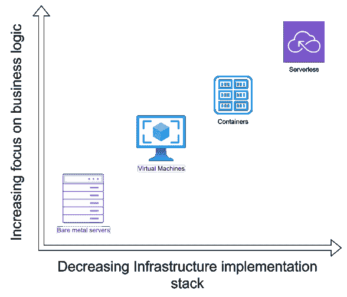

*Serverless definition | Source: modified and adapted from [Youtube](https://web.archive.org/web/20221206031244/https://www.youtube.com/watch?v=vxJobGtqKVM&t=77s)*

我们首先在托管服务器和数据中心上构建和部署应用程序，并负责配置和管理这些服务器。随着云和其他远程计算平台的出现，出现了虚拟机，你可以按需租用和使用服务器。当容器成为主流时，Kubernetes 等应用基础设施的容器编排平台也成为主流。我们现在正在迈向无服务器时代，在这一时代，我们在基础设施的定制化与开发和部署速度之间进行权衡。

那么什么是无服务器呢？无服务器是构建、部署和管理技术基础设施的全面管理方法。

为了完全掌握这个定义，让我们来理解当您部署您的机器学习应用程序时，无服务器为您提供了什么。使用无服务器，您可以:

*   为您的应用进行计算，无需拥有、维护甚至调配底层服务器。
*   复杂的网络和企业级后端集成工具和服务，可根据您的应用程序工作负载自动扩展。
*   无需管理备份即可实现持久存储的持久性。
*   数据库的托管版本，可以根据应用程序的需求进行扩展。

无服务器是如何工作的？

无服务器平台允许您构建和运行您的应用程序和服务，而无需考虑服务器。这是一种新的范式，有两个方面:

## 带着你的代码去执行

将您的应用程序代码与其他托管后端服务集成在一起。

*   对于代码执行，大多数无服务器平台都有一个“功能即服务”( FaaS)产品，它将为您提供在无服务器平台上执行代码的功能。这样，您就可以开发、运行和管理您的应用程序，而不必担心底层的基础设施。您是在功能级别工作，而不是在容器、服务器或虚拟机级别工作。
*   在无服务器上运行您的 ML 应用程序还需要您集成其他后端即服务产品，如数据库、存储、消息传递和 API 管理服务。

无服务器模式变化包括:

**无需管理基础设施**:您只需对您的应用负责。基础设施完全由服务提供商管理。

**事件驱动的应用**:你的架构依赖于事件和无状态计算。

*   **为你使用的东西付费**:当什么都没发生的时候，你什么也不用付。当事情发生时，您可以获得细粒度的计费可见性。
*   在您开始计划在任何无服务器计算平台上构建和部署您的 ML 应用程序之前，让我们先理清一些事情。
*   你在“无服务器”里做什么？

构建无服务器应用程序时，您有责任:

### **编写代码，指导您的应用程序如何运行**(服务交互、认证管理、输出转储位置等等)。在大多数情况下，您应该保持代码最少，以避免应用程序中的漏洞。

**定义触发器一旦有事件**(活动的发生)就立即发挥作用。例如，如果存储服务接收到一个文件，那么它应该启动无服务器服务，该服务将依次获取该文件，在其上运行程序，并将输出转储到另一个存储桶中。

*   在“无服务器”中你不做什么？
*   构建无服务器应用程序时，您**而不是**负责:

### **为您的应用运行预配置基础设施**,因为这种麻烦应该由服务提供商来处理。

**修补和管理基础设施**在基于容器的基础设施管理中很常见。管理由服务提供商负责，您只需要维护您的代码。

*   **定义扩展策略**，因为服务应该根据您的应用程序的使用情况自动扩展。您也可以决定设置一些计算设置来启用缩放，但在大多数情况下，这是由服务提供商处理的。
*   在无服务器环境中构建或部署任何应用程序时，另一个需要注意的要点是，您不要将状态与计算一起存储，因为无服务器环境中的计算是短暂的——您的服务器在事件期间会启动。它们并不总是运行，等待请求。这意味着它的状态存储在其他地方，通常在另一个托管服务中。这也是无服务器应用可以轻松扩展的原因之一——计算是无状态的，允许在引擎盖下添加更多服务器以实现水平可扩展性。
*   总结这一节，使用无服务器，您将获得一个环境，在这个环境中，您只需要部署您的代码，将您的应用程序连接到其他后端托管服务，其他一切都由提供商负责。

什么时候应该考虑在无服务器平台上部署 ML 模型？

根据您试图解决的问题，大多数 ML 应用程序都是动态的，当您了解您的模型哪些做得好，哪些做得不好时，需要不断的更新和改进。这非常适合无服务器的使用情形，因为此类平台:

## **能够处理大量活动**。例如，您的模型可以处理来自客户端的预测请求，并根据请求的数量自动伸缩，因此无论处理的请求数量有多少，周转时间都可以保持较低水平。

**适合动态工作负载**。您可以将新模型快速部署到平台，而无需配置基础架构或担心扩展问题。这就像是把旧型号拿出来，换上新型号。

*   **按需提供**相比之下，虚拟机或容器服务即使在没有活动的情况下也始终保持运行。从长远来看，这可以节省你的钱，因为你的 ML 服务可能不像你的其他服务那样受欢迎。
*   **非常适合预定任务**。对于您的生产用例，您可能会在特定的时间间隔运行计划的任务，比如模型再训练。借助无服务器工作流，您可以根据时间表自动执行重新培训和数据处理步骤。
*   在无服务器上部署 ML 应用程序的挑战
*   在尝试将 ML 应用程序部署到无服务器环境时，您可能会遇到一些挑战。

## 功能是短暂的

**挑战:**部署到无服务器环境意味着您的应用程序将经历冷启动，尤其是当事件被触发时底层服务器还没有托管某个功能时。当您的应用程序想要处理新的预测请求时，这可能会导致延迟问题，尤其是对于在线模型。如果您也想离线运行您的模型，这也可能是一个问题，因为您的离线评分必须在实例仍在运行的时间窗口内结束。

### **潜在解决方案:**您可能希望确保 FaaS 满足您所需的 SLA(服务水平协议)。尽管值得注意的是，您的模型总是能够以比服务器冷启动后的启动延迟更低的延迟实时返回预测。在选择无服务器之前，试着理解你在优化什么。你在为实时评分做优化吗？如果是，请尝试理解什么是可接受的延迟。

对远程存储的依赖

**挑战:**由于计算是[无状态的](https://web.archive.org/web/20221206031244/https://en.wikipedia.org/wiki/Stateless_protocol)，先前客户端请求的[会话](https://web.archive.org/web/20221206031244/https://en.wikipedia.org/wiki/Session_(computer_science))不会被保留，因此需要在 blob 存储、缓存、数据库或事件拦截器中远程存储会话。这可能会导致性能问题，因为该函数需要在每个实例中写入慢速存储并读回。如果您正在运行高性能的机器学习模型，这可能是一个需要注意的问题。

### **潜在的解决方案:**您的函数使用的任何状态都需要存储在外部，最好存储在读写性能相当高的存储器中。

输入/输出性能

**挑战:**功能密集打包并共享网络 I/O，因此涉及高吞吐量计算的进程可能不适合 it。

### **潜在解决方案:**如果您正在运行高性能的 ML 应用程序，您可能需要考虑使用另一个计算平台，如虚拟机或容器服务。

通用硬件

**挑战:**在大多数无服务器平台中，您可以使用的是驱动底层服务器的基本 CPU 和计算硬件。你可能找不到通过他们的无服务器平台提供 GPU 或 TPU 的提供商。尽管随着 AWS [最近宣布](https://web.archive.org/web/20221206031244/https://aws.amazon.com/blogs/aws/aws-lambda-functions-powered-by-aws-graviton2-processor-run-your-functions-on-arm-and-get-up-to-34-better-price-performance/)Lambda 函数现在由它们的 [Graviton2 处理器](https://web.archive.org/web/20221206031244/https://aws.amazon.com/ec2/graviton/)支持，这种情况开始改变。无论如何，内存大小和处理器类型仍然存在限制。例如，在编写本文时，您可以为一个 Lambda 函数分配高达 10 GB 的内存，并访问 6 个 CPU 进行计算。

### **潜在解决方案:**如果您的 ML 模型需要运行 GPU 或 TPU 等硬件加速器，您可能需要考虑使用虚拟机来代替。

供应商锁定

挑战:虽然你可以移植你的代码，但你不能总是移植你的架构。对于无服务器，迁移成为一个挑战，尤其是当您的应用程序与供应商提供的其他服务集成时。在大多数情况下，您可能会发现迁移的唯一方法是重新构建您的生产系统。此外，无服务器是一个新兴领域，过早选择赢家存在风险。

### **潜在解决方案:**在选择供应商之前，请确保您考虑了他们提供的服务、他们服务的[SLA](https://web.archive.org/web/20221206031244/https://searchitchannel.techtarget.com/definition/service-level-agreement)，以及他们是否是您组织的主要供应商，是否也很容易转移您的工作负载。

安全风险

**挑战:**虽然无服务器平台是完全托管的，但是将应用程序部署为功能仍然存在安全风险。其中之一就是不安全的配置。让您的服务和外部连接之间的 API 交互变得脆弱可能会有问题，这可能会导致严重的安全威胁，如数据泄漏、分布式拒绝服务(DDoS)攻击等。

### 在其他情况下，给予服务和用户比他们需要的更多的访问权限也会带来威胁。虽然在学习过程中这样做可能没问题，但是要确保清理您的架构，并且只给服务或用户提供完成功能应用程序所需的最少特权。对安全和恶意攻击的风险保持敏感的另一个原因是，它们也可能导致高额费用。

**潜在解决方案:**确保您遵循云安全的最佳实践，来自 [AWS](https://web.archive.org/web/20221206031244/https://aws.amazon.com/) 的行业标准可在本[文档](https://web.archive.org/web/20221206031244/https://docs.aws.amazon.com/wellarchitected/latest/security-pillar/welcome.html)中找到。请确保在您的无服务器平台提供商本机提供的凭据管理服务(推荐)中保护您的凭据。对你的服务和用户来说，始终遵循最小特权原则。

较少的监控和可观察性

**挑战:**应用程序、模型的可观察性，以及它们对业务目标的贡献至关重要。这对于无服务器应用程序来说是很难做到的，因为为您提供的日志和跟踪工具可能不足以让您对应用程序有一个完整的监督。

### **潜在解决方案:**您可能希望与第三方 [ML 监控工具](/web/20221206031244/https://neptune.ai/blog/ml-model-monitoring-best-tools)集成，以便更有效地监督您的生产应用。

其他风险

**挑战:**这里也有 ML 应用固有的风险，如[对抗性攻击](/web/20221206031244/https://neptune.ai/blog/adversarial-attacks-on-neural-networks-exploring-the-fast-gradient-sign-method?utm_source=medium&utm_medium=crosspost&utm_campaign=blog-adversarial-attacks-on-neural-networks-exploring-the-fast-gradient-sign-method)，尤其是计算机视觉应用。虽然这不是无服务器 ML 应用程序所特有的，但保护模型免受恶意攻击对于无服务器来说是非常困难的，因为你不能控制模型运行的基础设施。例如，攻击可能来自于将恶意输入作为对模型的请求。

### **潜在解决方案:**您可能想要尝试使用现有的最佳[学术](https://web.archive.org/web/20221206031244/https://linkinghub.elsevier.com/retrieve/pii/S0031320318302565)或[行业](https://web.archive.org/web/20221206031244/https://arxiv.org/pdf/2002.05646)方法构建一个更健壮的模型，因为您的安全基础架构应该只是保护您模型的第二层。

无服务器平台提供商

目前市场上有几家[无服务器平台提供商。在本指南中，您将了解如何使用](https://web.archive.org/web/20221206031244/https://www.techmagic.co/blog/top-5-serverless-platforms-in-2020/)[亚马逊网络服务](https://web.archive.org/web/20221206031244/https://aws.amazon.com/)无服务器平台和服务部署您的应用程序。您还将简要了解其他流行的公共云解决方案，如[谷歌云平台](https://web.archive.org/web/20221206031244/https://cloud.google.com/)无服务器 FaaS 产品和[微软 Azure](https://web.archive.org/web/20221206031244/https://azure.microsoft.com/en-us/) 。目前，这是市场上的三个主要参与者。

## 谷歌云托管的 FaaS 产品叫做云功能。撰写本文时支持的语言包括 Node.js、Python、PHP、.NET，Java，Ruby，还有 Go。云功能的可用触发器是 HTTP 请求、通过发布/订阅的消息传递、存储、Firestore、Firebase、调度程序和现代数据服务。

一些功能包括:

带有[“max”选项](https://web.archive.org/web/20221206031244/https://cloud.google.com/functions/docs/configuring/max-instances)的自动扩展功能，如果您不想运行太多实例来自动扩展到您的工作负载，您可以选择一个 max 选项。

您可以在[唯一身份](https://web.archive.org/web/20221206031244/https://cloud.google.com/functions/docs/securing/function-identity)下运行您的每一项功能，帮助您进行更精细的控制。

*   [Cloud Run 可用](https://web.archive.org/web/20221206031244/https://cloud.google.com/blog/products/serverless/cloud-run-bringing-serverless-to-containers)让你在 Google Cloud 的无服务器平台上运行任何无状态的请求驱动容器。
*   Azure Functions 是 Azure 面向无服务器应用的功能即服务平台。它支持多种语言，包括 C#、F#、Java 和 Node。Azure 函数的可用触发器包括 Blob 存储、Cosmos DB、事件网格、事件中心 HTTP 请求、服务总线(消息传递系统)、计时器(基于事件时间的系统)。
*   一些功能包括:

AWS Lambda 是亚马逊网络服务的托管功能即服务(FaaS)平台。可以用 Node、Java、C#和 Python 等多种语言编写函数。Lambda 的可用触发器包括 Kinesis、DynamoDB、SQS、S3、CloudWatch、Codecommit、Cognito、Lex 和 API Gateway。

在本指南中，您将学习如何在 AWS 上将图像分类模型部署到无服务器环境中，以构建无服务器 ML 应用程序。

在无服务器上部署图像分类模型[演示]

了解要部署的模型

## 我们将使用一个预先训练的模型，该模型将主要困扰非洲玉米作物的蛾类物种分为 3 类:[非洲粘虫](https://web.archive.org/web/20221206031244/https://en.wikipedia.org/wiki/African_armyworm)(AAW)[秋粘虫](https://web.archive.org/web/20221206031244/https://entnemdept.ufl.edu/creatures/field/fall_armyworm.htm)(一汽)和[埃及棉叶蝉](https://web.archive.org/web/20221206031244/https://www.andermattbiocontrol.com/sites/pests/egyptian-cotton-leafworm.html) (ECLW)。

### 要求

这里，我们希望构建一个移动应用程序，它可以查询一个 ML 模型，并根据上传到外部存储(可能来自其他外部应用程序，如农场中的摄像机)的蛾类物种的新图像返回结果。ML 模型需要不断改进，因为这只是收集更多蛾图像数据的第一个版本。后端的 ML 应用程序应该能够处理非结构化的数据(图像),这些数据可能以批处理和流的形式出现，偶尔也会以突发的形式出现，同时保持尽可能低的成本。

### 你可能已经猜到了，这听起来像是无服务器的工作！

模型细节

该模型使用 [Tensorflow 2.4.0](https://web.archive.org/web/20221206031244/https://www.tensorflow.org/install) 进行训练，它使用 ResNet-50 模型权重，并添加一些自定义层作为微调的最终层。该模型期望输入图像为 **224×224 大小**，输出层根据我们正在解决的问题只返回 3 个类。

### 这个模型已经被压缩成一个[tar.gz](https://web.archive.org/web/20221206031244/https://www.howtogeek.com/248780/how-to-compress-and-extract-files-using-the-tar-command-on-linux/)档案文件，并上传到 S3 存储桶中的一个文件夹。为了确保文件可读，对象被授予了[公共读取权限](https://web.archive.org/web/20221206031244/https://aws.amazon.com/premiumsupport/knowledge-center/read-access-objects-s3-bucket/)。

如果您遵循您的模型，您可以在这里学习如何授予公共读取权限[。此外，确保您的模型得到正确保存。这个模型是用**`**](https://web.archive.org/web/20221206031244/https://aws.amazon.com/premiumsupport/knowledge-center/read-access-objects-s3-bucket/)**[TF . saved _ model . save()](https://web.archive.org/web/20221206031244/https://www.tensorflow.org/guide/saved_model)`**格式保存的，并压缩成 **`.tar`** 文件(最好)。

先决条件

在开始之前，您需要具备几件重要的事情——

### 一个[自由层 AWS 帐户](https://web.archive.org/web/20221206031244/https://aws.amazon.com/free/)或一个最多有 3 美元的活动帐户。截至本指南发布时，跟随它的成本应该不到 3 美元。

使用 AWS 云的基本经验。

*   一个[完全配置好的](https://web.archive.org/web/20221206031244/https://docs.aws.amazon.com/cli/latest/userguide/install-cliv2.html) [命令行界面工具](https://web.archive.org/web/20221206031244/https://aws.amazon.com/cli/)与你的 IDE 一起工作。你可以在这里安装完整的 vs code[AWS 工具包。](https://web.archive.org/web/20221206031244/https://aws.amazon.com/visualstudiocode/)
*   稍微熟悉一下 [Docker](https://web.archive.org/web/20221206031244/https://docs.docker.com/get-docker/) CLI。
*   一个活跃的 IAM 用户(用于最佳安全实践)。我建议您不要使用 root 用户来阅读本技术指南。您可以为用户提供对下列服务的访问权限:
*   下面是我为该角色创建的附加到用户的策略示例(不包括对 DynamoDB 的完全访问权限):
*   第二个弹性容器注册(ECR)策略是公共策略。如果您希望能够与世界上的任何人共享您的容器软件，您可能希望包含此策略。此外，为了使本指南易于理解，我已经允许该用户拥有所有资源和完全访问权限–如果您要将此应用到您的项目中，您可能只想授予完成项目所需的最低权限，以避免安全问题。

解决方案概述

[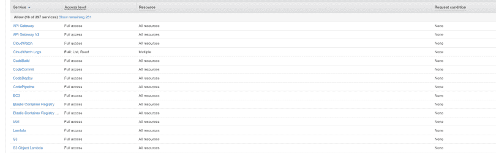](https://web.archive.org/web/20221206031244/https://neptune.ai/deploying-your-next-image-classification-on-serverless-aws-lambda-gcp-cloud-function-azure-automation_59)

*List of attached policies to the user | Source: Author*

对于本技术指南，我们将构建的解决方案将使用两个工作流:[持续集成/交付(CI/CD)](/web/20221206031244/https://neptune.ai/blog/continuous-integration-and-continuous-deployment-in-machine-learning-projects) 工作流和主部署工作流。这是我们的整个工作流程:

### 我们将使用 CI/CD 管道在云上构建和打包我们的应用程序。

然后，我们将把打包的应用程序部署到一个无服务器的功能中，该功能与其他服务集成在一起，以提供一个完全托管的后端生产系统。

*   持续集成/持续交付工作流
*   以下是我们的 CI/CD 架构的外观:

#### 以下是我们将在此工作流程中采取的步骤:

[IAM](https://web.archive.org/web/20221206031244/https://aws.amazon.com/iam/) 用户将使用 [AWS CLI](https://web.archive.org/web/20221206031244/https://aws.amazon.com/cli/) 和 git 客户端将我们的应用程序代码和一些配置文件推送到私有的 [CodeCommit](https://web.archive.org/web/20221206031244/https://aws.amazon.com/codecommit/) 存储库。

[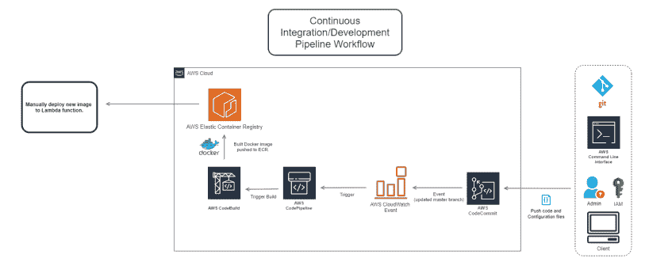](https://web.archive.org/web/20221206031244/https://neptune.ai/deploying-your-next-image-classification-on-serverless-aws-lambda-gcp-cloud-function-azure-automation_15)

*Continuous integration/ delivery workflow | Source: Author*

这个新的提交将触发[代码管道](https://web.archive.org/web/20221206031244/https://aws.amazon.com/codepipeline/)从我们的[Docker 文件](https://web.archive.org/web/20221206031244/https://docs.docker.com/engine/reference/builder/)为 [Docker](https://web.archive.org/web/20221206031244/https://www.docker.com/) 映像创建一个新的构建，并使用[代码构建](https://web.archive.org/web/20221206031244/https://aws.amazon.com/codebuild/)创建一个指定的构建配置。

1.  一旦构建完成并成功，Docker 映像将被推送到 [AWS ECR](https://web.archive.org/web/20221206031244/https://aws.amazon.com/ecr/) 中的私有注册表中。
2.  现在，您可以使用 Docker 映像来创建 [Lambda 函数](https://web.archive.org/web/20221206031244/https://docs.aws.amazon.com/lambda/latest/dg/welcome.html)，它将在生产中充当推理端点。
3.  虽然在这个管道中运行您的模型测试和验证是很重要的，但是本指南并不包括测试过程。
4.  部署工作流程

这是我们的部署架构的样子:

#### 以下是此工作流程中的步骤:

客户端通过 REST API 端点或管理控制台将映像上传到 S3 存储桶。

[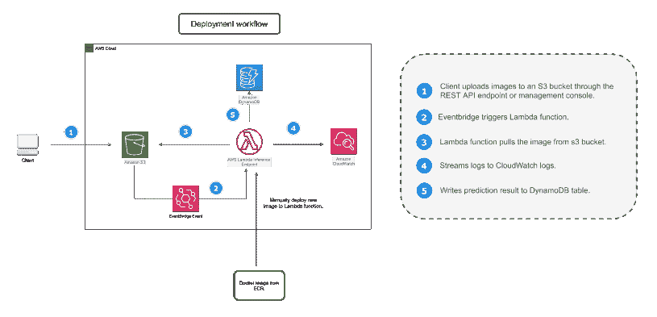](https://web.archive.org/web/20221206031244/https://neptune.ai/deploying-your-next-image-classification-on-serverless-aws-lambda-gcp-cloud-function-azure-automation_20)

*Serverless backend deployment workflow | Source: Author*

[Eventbridge](https://web.archive.org/web/20221206031244/https://aws.amazon.com/eventbridge/) 触发托管我们模型的 Lambda 函数。

1.  该函数将日志流式传输到 Amazon Cloudwatch 日志。
2.  该函数还将结果写入 DynamoDB。
3.  您将使用从 ECR 存储库中构建的 Docker 映像创建一个 Lambda 函数推断端点。此时，您将在部署之前测试该功能。部署完成后，您现在可以通过向您将创建的 [S3](https://web.archive.org/web/20221206031244/https://aws.amazon.com/s3/) 存储桶上传新映像来执行端到端测试，以确保一切按预期运行。
4.  这是您将在本指南中构建的解决方案的概述。说够了，我们来解决一些问题吧！

构建解决方案

为了实现这个解决方案，克隆本指南的[库](https://web.archive.org/web/20221206031244/https://github.com/NonMundaneDev/image-classification-app)。在我们查看应用程序代码和配置文件之前，让我们设置一些将用于该解决方案的 AWS 服务。确保您的用户拥有这些服务的必要权限，并且位于正确的区域。

### 创建一个 S3 桶来保存推理图像

要使用管理控制台，请前往[https://s3.console.aws.amazon.com/s3/](https://web.archive.org/web/20221206031244/https://s3.console.aws.amazon.com/s3/)。要使用 CLI，请查看[文档](https://web.archive.org/web/20221206031244/https://awscli.amazonaws.com/v2/documentation/api/latest/reference/s3api/create-bucket.html)并跟随操作。

#### 点击屏幕右侧的**创建存储桶**。

1.  为您的时段输入描述性名称，并选择适当的区域:
2.  4.在**阻止该存储桶**的公共访问设置下，取消选中**阻止所有公共访问**并选中复选框以同意以下条款:
3.  5.接下来，**启用 Bucket Versioning** ，这样同名的新图像就不会被覆盖(尤其是如果你的应用开发者没有考虑到这一点的话):

[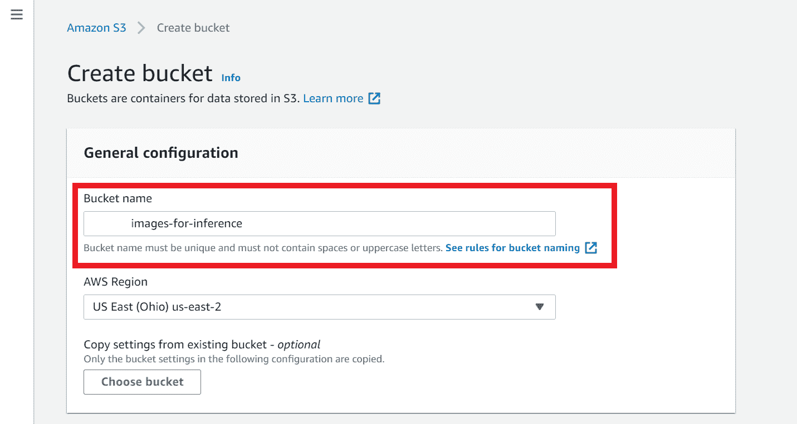](https://web.archive.org/web/20221206031244/https://neptune.ai/deploying-your-next-image-classification-on-serverless-aws-lambda-gcp-cloud-function-azure-automation_7)

*Create the S3 bucket to hold inference images | Source: Author*

5.保留其他默认设置，点击**创建存储桶**:

[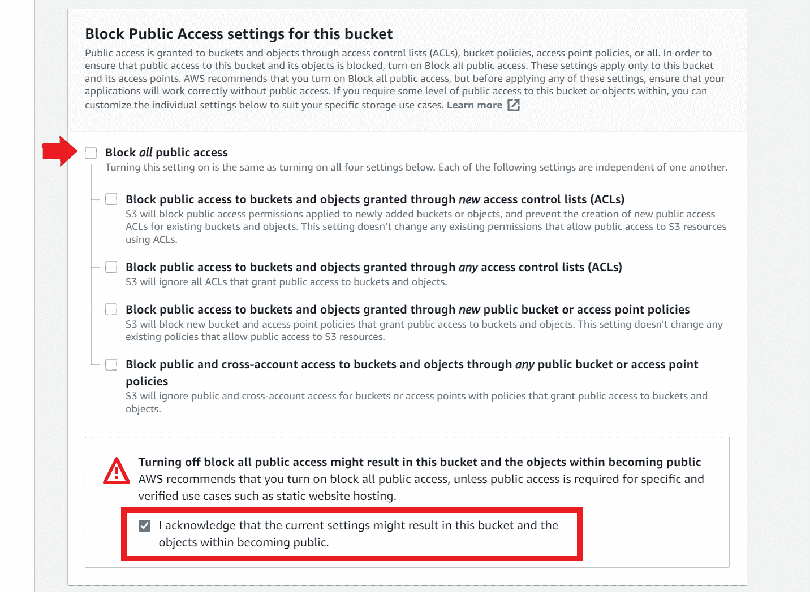](https://web.archive.org/web/20221206031244/https://neptune.ai/deploying-your-next-image-classification-on-serverless-aws-lambda-gcp-cloud-function-azure-automation_33)

*Block public access settings for the bucket | Source: Author*

对于本指南，我们将授予**公共读取权限**，以防您希望您的应用程序返回由您的模型预测的图像。由于数据不是敏感的，我们可以不考虑它，但是您可能希望添加经过身份验证的用户或服务来查看数据(出于安全原因)。对于写访问，这取决于您希望哪个设备或用户上传图像以进行推断。如果您有特定的设备，则只授予对它们的访问权限。

[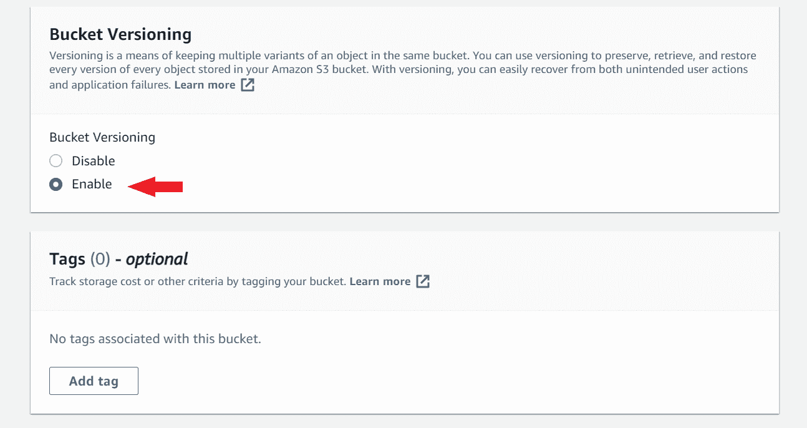](https://web.archive.org/web/20221206031244/https://neptune.ai/deploying-your-next-image-classification-on-serverless-aws-lambda-gcp-cloud-function-azure-automation_37)

*Enable bucket versioning | Source: Author*

6.点击**权限**标签:

[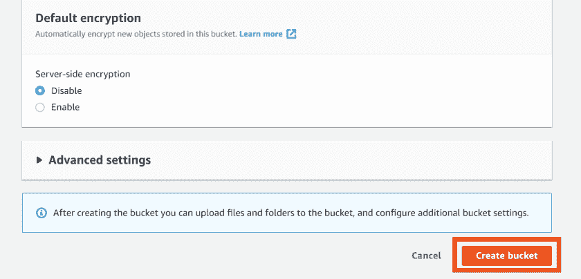](https://web.archive.org/web/20221206031244/https://neptune.ai/deploying-your-next-image-classification-on-serverless-aws-lambda-gcp-cloud-function-azure-automation_36)

*Create bucket | Source: Author*

7.在权限选项卡下，转到**存储桶策略**并点击**编辑**:

8.输入以下策略，并将 **` <替换为您的存储桶的名称> `** 更改为您的存储桶的名称:

[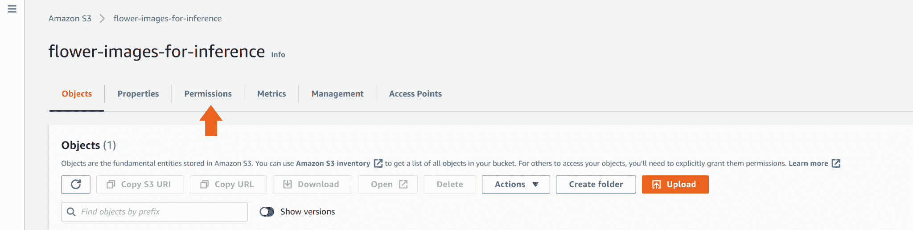](https://web.archive.org/web/20221206031244/https://neptune.ai/deploying-your-next-image-classification-on-serverless-aws-lambda-gcp-cloud-function-azure-automation_6)

*Go to permissions tab | Source: Author*

您的策略编辑器现在应该如下所示:

[](https://web.archive.org/web/20221206031244/https://neptune.ai/deploying-your-next-image-classification-on-serverless-aws-lambda-gcp-cloud-function-azure-automation_3)

*Go to bucket policy to edit | Source: Author*

9.向下滚动并点击**保存更改**:

```py
{
    "Version": "2012-10-17",
    "Statement": [
        {
            "Sid": "PublicRead",
            "Effect": "Allow",
            "Principal": "*",
            "Action": [
                "s3:GetObject",
                "s3:GetObjectVersion"
            ],
            "Resource": "arn:aws:s3:::<REPLACE WITH THE NAME OF YOUR BUCKET>/*"
        }
    ]
}
```

就是这样！bucket 中的对象现在应该可以公开访问(读取)了。这对于我们返回图像 URL 至关重要。

[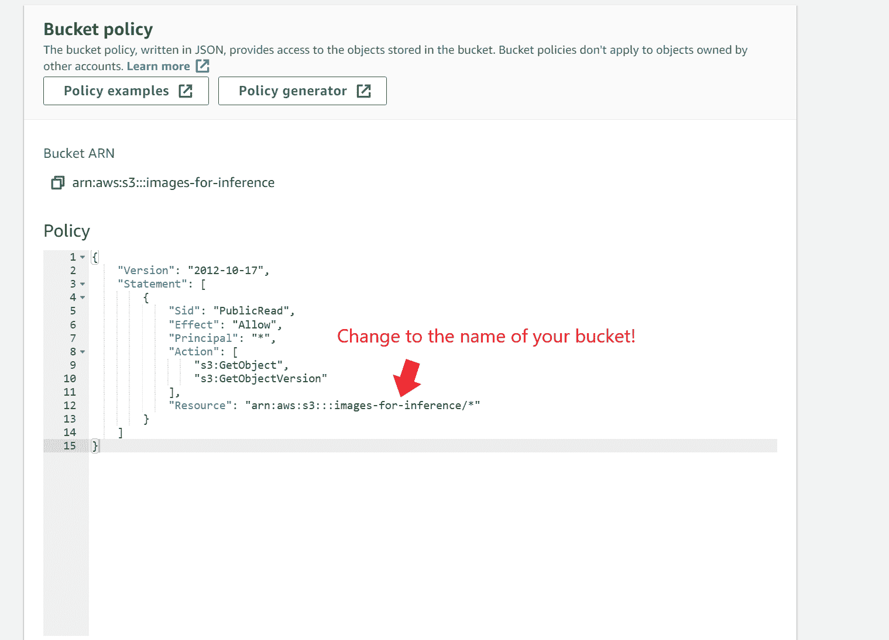](https://web.archive.org/web/20221206031244/https://neptune.ai/deploying-your-next-image-classification-on-serverless-aws-lambda-gcp-cloud-function-azure-automation_43)

*Policy editor | Source: Author*

创建一个 DynamoDB 表来存储预测

[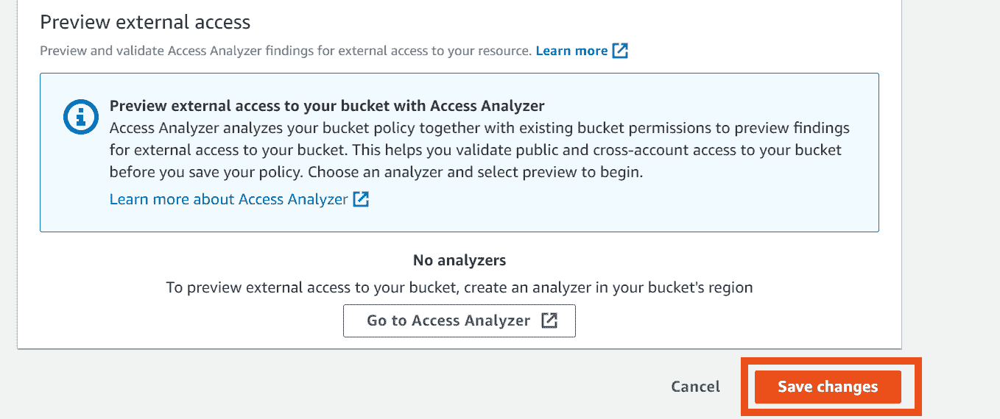](https://web.archive.org/web/20221206031244/https://neptune.ai/deploying-your-next-image-classification-on-serverless-aws-lambda-gcp-cloud-function-azure-automation_2)

*Save the changes | Source: Author*

在本指南的前面，我们了解到无服务器功能是无状态的。我们需要将我们的预测存储在某个地方，以便更容易与我们的应用程序进行通信。我们将为此使用亚马逊的 NoSQL 无服务器数据库 [DynamoDB](https://web.archive.org/web/20221206031244/https://aws.amazon.com/dynamodb/) ,因为它伸缩性很好，并且很容易与无服务器功能集成。

#### 与您选择的任何托管服务一样，您必须确保它符合您的应用程序要求。在我们的例子中，我们需要存储以下字段:

菲尔茨

描述

|  | 

模型做出预测的日期

 |
| --- | --- |
| 模型做出预测的日期 |  |
| 模型预测的蛾的名字 |  |
| 当我们在生产中监控和管理我们的模型时，由模型做出的预测的唯一 ID 将会有所帮助 |  |
| 做出预测的时间 |  |
| 被预测的图像的公共 URL |  |
| 模型的概率得分 |  |
| 在给定预测日期预测的同一类别的数量 |  |

要创建一个 DynamoDB 表，只需要两个字段:主键**(分区键)和辅键**(排序键)。测试应用程序时，可以将其他键添加到表中。****

 ****要通过 CLI 创建表[，请确保 CLI 配置了正确的帐户详细信息，并使用:](https://web.archive.org/web/20221206031244/https://docs.aws.amazon.com/amazondynamodb/latest/developerguide/getting-started-step-1.html)

你也可以使用[管理控制台](https://web.archive.org/web/20221206031244/https://docs.aws.amazon.com/amazondynamodb/latest/developerguide/getting-started-step-1.html)或者通过 [Python SDK](https://web.archive.org/web/20221206031244/https://docs.aws.amazon.com/amazondynamodb/latest/developerguide/GettingStarted.Python.01.html) 以编程方式完成。要检查该表是否处于活动状态，请运行:

前往[https://console.aws.amazon.com/dynamodb/](https://web.archive.org/web/20221206031244/https://console.aws.amazon.com/dynamodb/)并检查可用的桌子。如果表创建成功，您应该会看到:

```py
aws dynamodb create-table
    --table-name PredictionsTable
    --attribute-definitions
        AttributeName=PredictionDate,AttributeType=S
        AttributeName=ClassPredictionID,AttributeType=S
    --key-schema
        AttributeName=PredictionDate,KeyType=HASH
        AttributeName=ClassPredictionID,KeyType=RANGE
    --provisioned-throughput
        ReadCapacityUnits=50,WriteCapacityUnits=50
```

创建一个弹性容器注册库

```py
aws dynamodb describe-table --table-name PredictionsTable | grep TableStatus
```

要使用 CLI 创建一个 [ECR 私有存储库](https://web.archive.org/web/20221206031244/https://docs.aws.amazon.com/AmazonECR/latest/userguide/Repositories.html)，请在 AWS 配置的命令行中输入以下内容，用您项目的区域替换 **` <区域> `** :

[](https://web.archive.org/web/20221206031244/https://neptune.ai/deploying-your-next-image-classification-on-serverless-aws-lambda-gcp-cloud-function-azure-automation_14)

*Successful operation view | Source: Author*

#### 您也可以从[管理控制台](https://web.archive.org/web/20221206031244/https://docs.aws.amazon.com/AmazonECR/latest/userguide/getting-started-console.html)创建私有回购。您应该会看到类似下面的输出:

检查控制台以确认您新创建的 ECR 存储库。您应该会看到类似的视图:

```py
aws ecr create-repository
    --repository-name image-app-repo
    --image-scanning-configuration scanOnPush=true
    --region <REGION>
```

复制您的库 URI，并将其保存在某个地方，因为您将在下一节中需要它。

[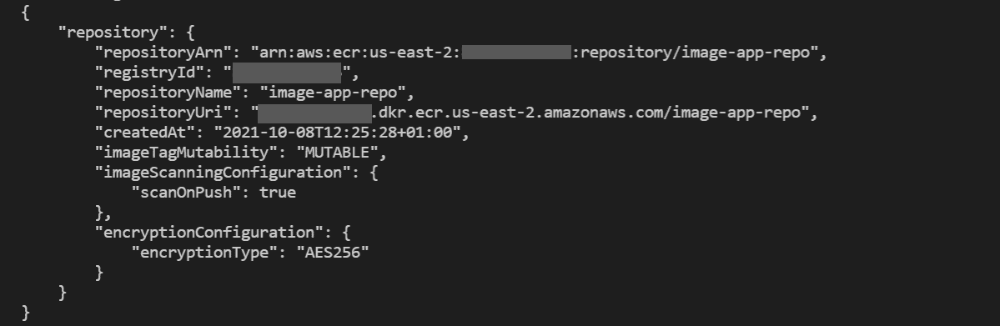](https://web.archive.org/web/20221206031244/https://neptune.ai/deploying-your-next-image-classification-on-serverless-aws-lambda-gcp-cloud-function-azure-automation_11)

*Output | Source: Author*

检查应用程序代码和配置文件

[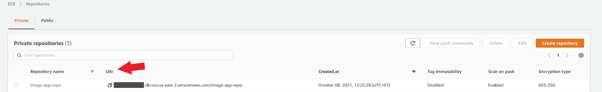](https://web.archive.org/web/20221206031244/https://neptune.ai/deploying-your-next-image-classification-on-serverless-aws-lambda-gcp-cloud-function-azure-automation_29)

*Confirm the newly created ECR repository | Source: Author*

要继续操作，请确保您处于 AWS CLI 环境中(您也可以选择创建一个虚拟环境)。完成以下步骤:

#### 在你的本地电脑上，新建一个文件夹，命名为**` image-classification-app `**。

在文件夹中，在该目录下创建一个新的 **`requirements.txt`** 文件。您将添加一些您的应用程序使用的外部库，这些库不是 [Lambda Python 运行时](https://web.archive.org/web/20221206031244/https://docs.aws.amazon.com/lambda/latest/dg/lambda-python.html)的本地库。这个函数将使用 **`python3.8`** 运行时。

1.  创建一个 **`app.py`** 脚本，其中包含 Lambda 函数的代码以及将您的函数与其他服务集成的粘合代码。
2.  在同一个目录下创建一个 **`Dockerfile`** 。
3.  另外，创建一个 **`buildspec.yml`** 配置文件，CodeBuild 将使用它来构建 Docker 映像。
4.  下面是 **`requirements.txt`** 的样子:
5.  在本应用中，我们将使用 [TensorFlow 2.4](https://web.archive.org/web/20221206031244/https://blog.tensorflow.org/2020/12/whats-new-in-tensorflow-24.html) ，因为我们的模型是用 TensorFlow 2 版本构建的。我们还将使用 [pytz](https://web.archive.org/web/20221206031244/https://pypi.org/project/pytz/) 来确保我们的申请时间格式正确。

接下来，我们将看看 Lambda 函数的代码。完整的代码可以在这个[库](https://web.archive.org/web/20221206031244/https://github.com/NonMundaneDev/image-classification-app/blob/master/app.py)中找到。从 lambda 函数开始，一旦事件触发了该函数，它就运行这个脚本，从包含用于推理的图像的 S3 桶中收集事件细节(**`用于推理的图像`**)。此外，如果客户端上传同名图像，对象将使用 **`versionId`** 进行版本控制，而不是被覆盖。

```py
tensorflow==2.4.0
pytz>=2013b
```

将类名存储在一个变量中，并编写代码在将图像提供给模型之前对其进行预处理。模型的输入层期望一个大小为 **224×224** 的图像:

使用模型和概率得分进行预测。也获取预测的类名:

```py
def lambda_handler(event, context):

  bucket_name = event['Records'][0]['s3']['bucket']['name']
  key = unquote(event['Records'][0]['s3']['object']['key'])

  versionId = unquote(event['Records'][0]['s3']['object']['versionId'])
```

做出预测后，代码检查 DynamoDB 表，查看当天是否已经做出了相同的预测。如果有，应用程序将更新当天预测类的计数，并用更新后的计数创建一个新条目。请注意，如果您计划在这个数据库中存储大量项目，那么使用 **` [table.scan](https://web.archive.org/web/20221206031244/https://boto3.amazonaws.com/v1/documentation/api/latest/reference/services/dynamodb.html#DynamoDB.Client.scan) `** 可能会成为[的低效和高成本](https://web.archive.org/web/20221206031244/https://docs.aws.amazon.com/amazondynamodb/latest/developerguide/bp-query-scan.html)。您可能需要找到一种方法来用 **` [table.query](https://web.archive.org/web/20221206031244/https://boto3.amazonaws.com/v1/documentation/api/latest/reference/services/dynamodb.html#DynamoDB.Client.query) `** 或其他方式编写您的逻辑，例如` **[GetItem](https://web.archive.org/web/20221206031244/https://boto3.amazonaws.com/v1/documentation/api/latest/reference/services/dynamodb.html#DynamoDB.Client.get_item) `** 和**`[batch GetItem](https://web.archive.org/web/20221206031244/https://boto3.amazonaws.com/v1/documentation/api/latest/reference/services/dynamodb.html#DynamoDB.Client.batch_get_item)`**API。

```py
  class_names = ['AAW', 'ECLW', 'FAW']
  image = readImageFromBucket(key, bucket_name).resize((224, 224))
  image = image.convert('RGB')
  image = np.asarray(image)
  image = image.flatten()
  image = image.reshape(1, 224, 224, 3)
```

如果这是当天的第一个预测，代码会将其作为新项添加到表中。

```py
  prediction = model.predict(image)
  pred_probability = "{:2.0f}%".format(100*np.max(prediction))
  index = np.argmax(prediction[0], axis=-1)
  predicted_class = class_names[index]
```

这段代码从桶中读取图像，并将其作为将由 Lambda 函数使用的[枕头图像](https://web.archive.org/web/20221206031244/https://pillow.readthedocs.io/en/stable/reference/Image.html)返回:

```py
  for i in class_names:

    if predicted_class == i:

      details = table.scan(
          FilterExpression=Key('PredictionDate').eq(date)
          & Attr("ClassName").eq(predicted_class),
          Limit=123,
      )

      if details['Count'] > 0 and details['Items'][0]['ClassName'] == predicted_class:

        event = max(details['Items'], key=lambda ev: ev['Count_ClassName'])

        current_count = event['Count_ClassName']

        updated_count = current_count + 1

        table_items = table.put_item(
              Item={
              'PredictionDate': date,
              'ClassPredictionID': predicted_class + "-" + str(uuid.uuid4()), 
              'ClassName': predicted_class,
              'Count_ClassName': updated_count,
              'CaptureTime': time,
              'ImageURL_ClassName': img_url,
              'ConfidenceScore': pred_probability
            }
          )
        print("Updated existing object...")
        return table_items
```

完整文件

```py
      elif details['Count'] == 0:
        new_count = 1
        table_items = table.put_item(
              Item={
                'PredictionDate': date,
                'ClassPredictionID': predicted_class + "-" + str(uuid.uuid4()), 
                'ClassName': predicted_class,
                'Count_ClassName': new_count,
                'CaptureTime': time,
                'ImageURL_ClassName': img_url,
                'ConfidenceScore': pred_probability
              }
            )
        print("Added new object!")
        return table_items

  print("Updated model predictions successfully!")
```

您完成的代码(也在这个[存储库](https://web.archive.org/web/20221206031244/https://github.com/NonMundaneDev/image-classification-app/blob/master/app.py)中)应该类似于下面的代码，确保您将 **` <替换为您的表名> `** 替换为您的 DynamoDB 表名，将 **` <替换为您的推理映像桶> `** 替换为您之前创建的 S3 桶:

```py
def readImageFromBucket(key, bucket_name):
  """
  Read the image from the triggering bucket.
  :param key: object key
  :param bucket_name: Name of the triggering bucket.
  :return: Pillow image of the object.

  """

  bucket = s3.Bucket(bucket_name)

  object = bucket.Object(key)
  response = object.get()
  return Image.open(response['Body'])
```

#### 检查 **`Dockerfile`** ，用你的名字替换 **` <你的名字> `** ，用你的邮箱替换 **` <你的邮箱> `** 。

检查 **`buildspec.yml`** 文件，将 **` <替换为您的 ECR REPO URI > `** **替换为您在上一节中创建的 ECR 库的 URI**:

```py
import json
import boto3
import datetime
import numpy as np
import PIL.Image as Image
import uuid
import pytz
import tensorflow as tf

from urllib.parse import unquote
from pathlib import Path
from decimal import Decimal
from botocore.exceptions import ClientError
from boto3.dynamodb.conditions import Key, Attr
from datetime import datetime as dt

tz = pytz.timezone('Africa/Lagos') 
date_time = str(dt.now(tz).strftime('%Y-%m-%d %H:%M:%S'))

date = date_time.split(" ")[0]
time = date_time.split(" ")[1]

timestamp = Decimal(str(dt.timestamp(dt.now())))

import_path = "model/"

model = tf.keras.models.load_model(import_path)

IMAGE_WIDTH = 224
IMAGE_HEIGHT = 224

IMAGE_SHAPE = (IMAGE_WIDTH, IMAGE_HEIGHT)

s3 = boto3.resource('s3')
dynamodb = boto3.resource('dynamodb')

table = dynamodb.Table('<REPLACE WITH YOUR TABLE NAME>')

def lambda_handler(event, context):

  bucket_name = event['Records'][0]['s3']['bucket']['name']
  key = unquote(event['Records'][0]['s3']['object']['key'])

  versionId = unquote(event['Records'][0]['s3']['object']['versionId'])

  class_names = ['AAW', 'ECLW', 'FAW']

  print(key)

  image = readImageFromBucket(key, bucket_name).resize((224, 224))
  image = image.convert('RGB')
  image = np.asarray(image)
  image = image.flatten()
  image = image.reshape(1, 224, 224, 3)

  prediction = model.predict(image)
  print(prediction) 
  pred_probability = "{:2.0f}%".format(100*np.max(prediction))
  index = np.argmax(prediction[0], axis=-1)
  print(index) 
  predicted_class = class_names[index]

  print('ImageName: {0}, Model Prediction: {1}'.format(key, predicted_class))

  img_url = f"https://<REPLACE WITH YOUR BUCKET FOR INFERENCE IMAGES>.s3.<REGION>.amazonaws.com/{key}?versionId={versionId}"

  for i in class_names:

    if predicted_class == i:

      details = table.scan(
          FilterExpression=Key('PredictionDate').eq(date)
          & Attr("ClassName").eq(predicted_class),
          Limit=123,
      )

      if details['Count'] > 0 and details['Items'][0]['ClassName'] == predicted_class:

        event = max(details['Items'], key=lambda ev: ev['Count_ClassName'])

        current_count = event['Count_ClassName']

        print(current_count) 

        updated_count = current_count + 1

        table_items = table.put_item(
              Item={
              'PredictionDate': date,
              'ClassPredictionID': predicted_class + "-" + str(uuid.uuid4()), 
              'ClassName': predicted_class,
              'Count_ClassName': updated_count,
              'CaptureTime': time,
              'ImageURL_ClassName': img_url,
              'ConfidenceScore': pred_probability
            }
          )
        print("Updated existing object...")
        return table_items

      elif details['Count'] == 0:
        new_count = 1
        table_items = table.put_item(
              Item={
                'PredictionDate': date,
                'ClassPredictionID': predicted_class + "-" + str(uuid.uuid4()), 
                'ClassName': predicted_class,
                'Count_ClassName': new_count,
                'CaptureTime': time,
                'ImageURL_ClassName': img_url,
                'ConfidenceScore': pred_probability
              }
            )
        print("Added new object!")
        return table_items

  print("Updated model predictions successfully!")

def readImageFromBucket(key, bucket_name):
  """
  Read the image from the triggering bucket.
  :param key: object key
  :param bucket_name: Name of the triggering bucket.
  :return: Pillow image of the object.

  """

  bucket = s3.Bucket(bucket_name)
  object = bucket.Object(key)
  response = object.get()
  return Image.open(response['Body'])
```

就是这样！确保将您的代码与本指南的[库](https://web.archive.org/web/20221206031244/https://github.com/NonMundaneDev/image-classification-app)中的代码进行比较。我们现在将设置 CI/CD 管道来推送我们的应用程序代码和配置文件。

```py
FROM public.ecr.aws/lambda/python:3.8

LABEL maintainer="<YOUR NAME> <YOUR EMAIL>"
LABEL version="1.0"
LABEL description="Demo moth classification application for serverless deployment for Neptune.ai technical guide."

RUN yum -y install tar gzip zlib freetype-devel
    gcc
    ghostscript
    lcms2-devel
    libffi-devel
    libimagequant-devel
    libjpeg-devel
    libraqm-devel
    libtiff-devel
    libwebp-devel
    make
    openjpeg2-devel
    rh-python36
    rh-python36-python-virtualenv
    sudo
    tcl-devel
    tk-devel
    tkinter
    which
    xorg-x11-server-Xvfb
    zlib-devel
    && yum clean all

COPY requirements.txt ./

RUN python3.8 -m pip install -r requirements.txt

RUN pip uninstall -y pillow && CC="cc -mavx2" pip install -U --force-reinstall pillow-simd

COPY app.py ./

RUN mkdir model
RUN curl -L https://sagemaker-mothmodel-artifact.s3.us-east-2.amazonaws.com/models/resnet_model.tar -o ./model/resnet.tar.gz
RUN tar -xf model/resnet.tar.gz -C model/
RUN rm -r model/resnet.tar.gz

CMD ["app.lambda_handler"]
```

创建代码提交 Git 存储库

```py
version: 0.2

phases:
  install:
    runtime-versions:
      python: 3.8
  pre_build:
    commands:
      - echo Logging in to Amazon ECR...
      - pip install --upgrade awscli==1.18.17
      - aws --version
      - $(aws ecr get-login --region $AWS_DEFAULT_REGION --no-include-email)
      - REPOSITORY_URI=<REPLACE WITH YOUR ECR REPO URI>
      - COMMIT_HASH=$(echo $CODEBUILD_RESOLVED_SOURCE_VERSION | cut -c 1-7)
      - IMAGE_TAG=build-$(echo $CODEBUILD_BUILD_ID | awk -F":" '{print $2}')
  build:
    commands:
      - echo Build started on `date`
      - echo Building the Docker image...
      - docker build -t $REPOSITORY_URI:latest .
      - docker tag $REPOSITORY_URI:latest $REPOSITORY_URI:$IMAGE_TAG
  post_build:
    commands:
      - echo Build completed on `date`
      - echo Pushing the Docker images...
      - docker push $REPOSITORY_URI:latest
      - docker push $REPOSITORY_URI:$IMAGE_TAG
```

1.按照页面上的说明[为 CodeCommit 创建您的 git 凭证。](https://web.archive.org/web/20221206031244/https://docs.aws.amazon.com/codecommit/latest/userguide/setting-up-gc.html)

#### 2.一旦你创建了你的 git 证书，在[https://console.aws.amazon.com/codesuite/codecommit/home](https://web.archive.org/web/20221206031244/https://console.aws.amazon.com/codesuite/codecommit/home)打开 CodeCommit 控制台

3.点击**创建存储库**:

4.输入一个**存储库名称**，一个描述，将其余选项保留为默认，然后单击**创建**:

在显示的页面上确认您新创建的 repo，并查看如何用 git 克隆您的 repo 的信息。您应该看到以下内容:

[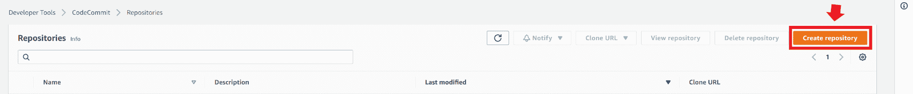](https://web.archive.org/web/20221206031244/https://neptune.ai/deploying-your-next-image-classification-on-serverless-aws-lambda-gcp-cloud-function-azure-automation_21)

*Create repository | Source: Author*

5.要进行第一次提交，请确保您位于正确的文件夹中，即您之前在指南**` image-class ification-app`**中创建的文件夹，并输入以下内容(假设您遵循了本指南中的命名约定并使用了相同的区域):

[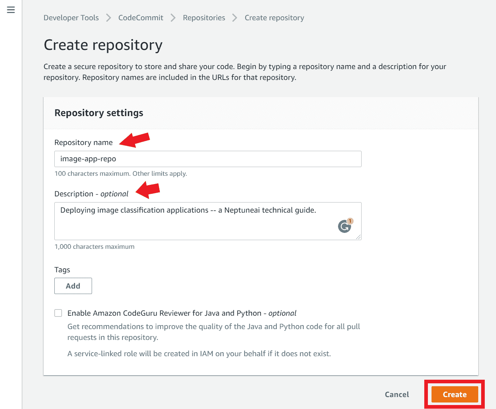](https://web.archive.org/web/20221206031244/https://neptune.ai/deploying-your-next-image-classification-on-serverless-aws-lambda-gcp-cloud-function-azure-automation_41)

*Add repository details | Source: Author*

如果成功克隆，您现在应该已经准备好提交代码并将其推送到 CI/CD 管道。

[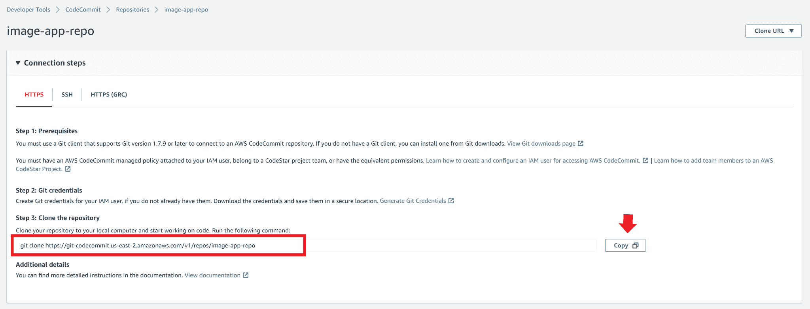](https://web.archive.org/web/20221206031244/https://neptune.ai/deploying-your-next-image-classification-on-serverless-aws-lambda-gcp-cloud-function-azure-automation_46)

*Clone your repo with git | Source: Author*

6.在**` image-class ification-app`**文件夹中，使用以下命令查看哪些文件尚未提交:

```py
git clone
https://git-codecommit.us-east-2.amazonaws.com/v1/repos/image-app-repo ../image-classification-app/
```

7.将所有要提交的文件存放在文件夹中:

8.检查文件是否准备好提交:

```py
git status
```

您应该会看到类似的输出:

```py
git add *
```

9.或者，您可能需要为此提交配置您的姓名，您可以用您的详细信息替换下面的标签:

```py
git status
```

10.提交文件并包含一条消息。

[](https://web.archive.org/web/20221206031244/https://neptune.ai/deploying-your-next-image-classification-on-serverless-aws-lambda-gcp-cloud-function-azure-automation_57)

*Output | Source: Author*

您应该会看到类似的输出:

```py
git config user.email "<YOUR EMAIL ADDRESS>"
git config user.name  "<YOUR NAME>"
```

现在，您的代码和配置文件已经准备好被推送到您之前创建的 CodeCommit 存储库中。要将它们推送到存储库，请遵循以下说明:

```py
git commit -m "Initial commit to CodeCommit."
```

11.使用以下命令将您的提交推送到主分支上游:

您的命令行或 IDE 可能会要求您输入之前创建的 git 凭据。确保您输入了正确的详细信息。如果提交成功，您应该会看到类似的输出:

使用 CodeBuild 构建容器映像

```py
git push -u origin master
```

为了构建我们的容器映像，我们必须用 CodeBuild 创建一个项目。

#### 1.前往 https://console.aws.amazon.com/codesuite/codebuild/home

2.选择**构建项目**，点击**创建构建项目**:

3.在**项目配置**下，输入您的项目名称和项目描述:

4.在 **Source** 下，确认选择了 AWS CodeCommit，并选择您的源库( **`image-app-repo`** )。在**参照类型**下，选择**分支**，选择主分支。

[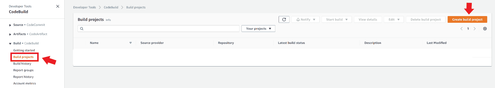](https://web.archive.org/web/20221206031244/https://neptune.ai/deploying-your-next-image-classification-on-serverless-aws-lambda-gcp-cloud-function-azure-automation_5)

*Create build project | Source: Author*

5.在**环境**下，确保**管理镜像**被选中。在**操作系统**下，选择 **Ubuntu。**选择**标准**运行时，选择**标准:5.0** 图像。在**镜像版本**下，确保**始终使用该运行时版本的最新镜像**被选中。在**环境类型**下，选择 **Linux** 并点击**特权**下的复选框，因为您正在构建 Docker 映像:

[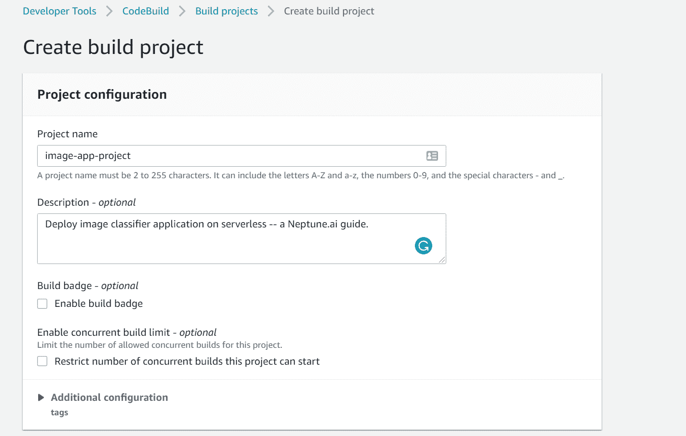](https://web.archive.org/web/20221206031244/https://neptune.ai/deploying-your-next-image-classification-on-serverless-aws-lambda-gcp-cloud-function-azure-automation_54)

*Add project details | Source: Author*

6.如果您没有现有的服务角色，请确保选择了**新服务角色**,并将其他角色保留为默认角色，除非您需要其他配置:

[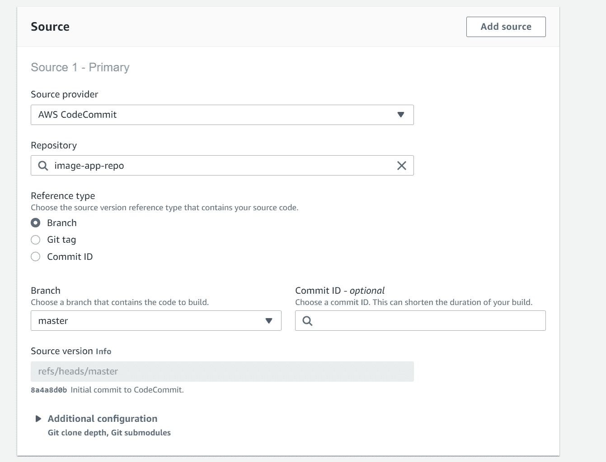](https://web.archive.org/web/20221206031244/https://neptune.ai/deploying-your-next-image-classification-on-serverless-aws-lambda-gcp-cloud-function-azure-automation_35)

*Add source details | Source: Author*

7.在 **Buildspec** 下，确保**使用一个 Buildspec 文件**被选中。其他默认，包括**批量配置**下的选项:

[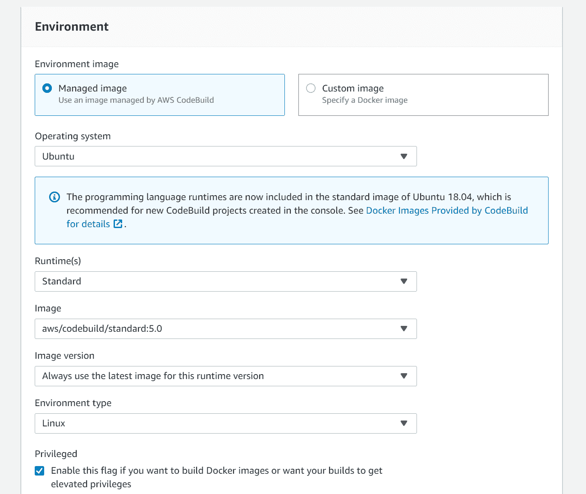](https://web.archive.org/web/20221206031244/https://neptune.ai/deploying-your-next-image-classification-on-serverless-aws-lambda-gcp-cloud-function-azure-automation_24)

*Add environment details | Source: Author*

8.您的应用程序中没有包含任何工件，因此您可以将**工件**下的选项保留为默认值。在**日志**下，确保**云观察日志**被勾选。输入一个描述性的**组名**和**流名**。确认所有选项并选择**创建构建项目**:

[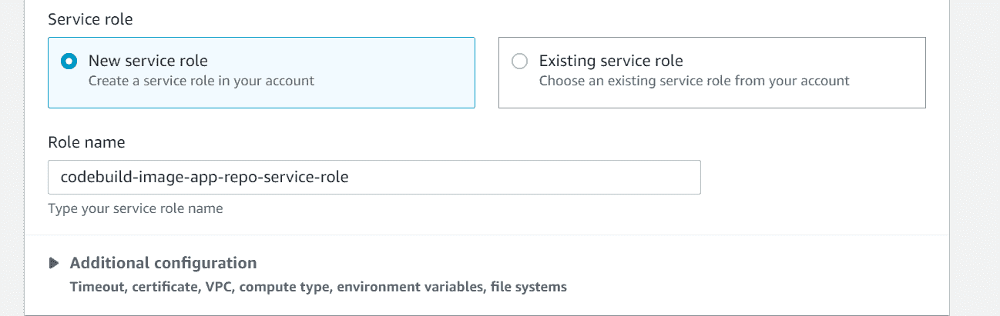](https://web.archive.org/web/20221206031244/https://neptune.ai/deploying-your-next-image-classification-on-serverless-aws-lambda-gcp-cloud-function-azure-automation_44)

*Select new service role | Source: Author*

如果您的项目创建成功，您应该会看到类似如下的页面:

[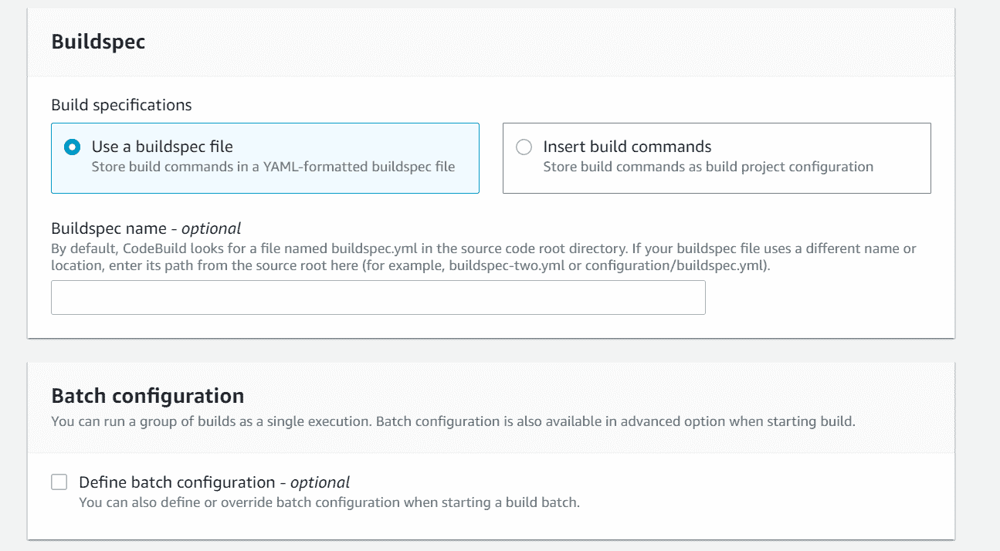](https://web.archive.org/web/20221206031244/https://neptune.ai/deploying-your-next-image-classification-on-serverless-aws-lambda-gcp-cloud-function-azure-automation_8)

*Ensure use a buildspec file is selected | Source: Author*

如果您想在构建完成时得到通知，您可以点击**为这个项目**创建一个通知规则。

[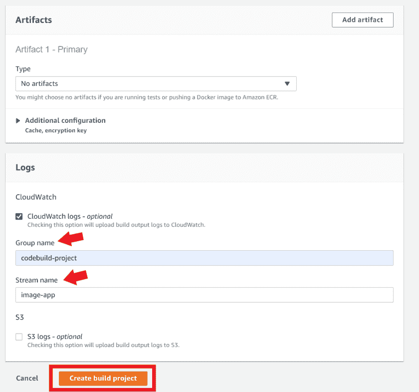](https://web.archive.org/web/20221206031244/https://neptune.ai/deploying-your-next-image-classification-on-serverless-aws-lambda-gcp-cloud-function-azure-automation_1)

*Create build project | Source: Author*

9.在开始项目的构建之前，您需要向您创建的 CodeBuild 角色附加一个新策略。进入你的 [**IAM** 页面](https://web.archive.org/web/20221206031244/https://console.aws.amazon.com/iam/home)，点击**角色**，搜索你创建的代码构建角色:

[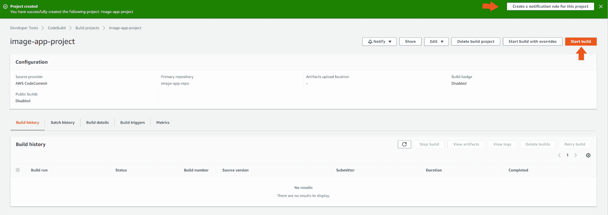](https://web.archive.org/web/20221206031244/https://neptune.ai/deploying-your-next-image-classification-on-serverless-aws-lambda-gcp-cloud-function-azure-automation_42)

*Successful new project view | Source: Author*

10.点击**附加策略**:

11.搜索 amazone C2 containerregistrypoweruser 策略。点击旁边的复选标记，并在页面末尾点击**附加策略**:

[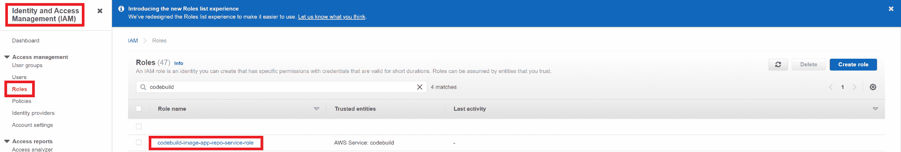](https://web.archive.org/web/20221206031244/https://neptune.ai/deploying-your-next-image-classification-on-serverless-aws-lambda-gcp-cloud-function-azure-automation_27)

*Attach new policy | Source: Author*

12.在下一页上，确认策略确实已添加:

[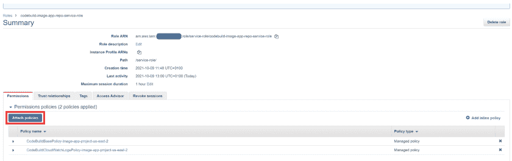](https://web.archive.org/web/20221206031244/https://neptune.ai/deploying-your-next-image-classification-on-serverless-aws-lambda-gcp-cloud-function-azure-automation_32)

*Select attached policies | Source: Author*

13.返回到您创建的项目的 CodeBuild 页面，点击 **Start build** 来测试您的应用程序构建。如果您的应用程序构建是**成功的**，您应该会看到如下页面:

[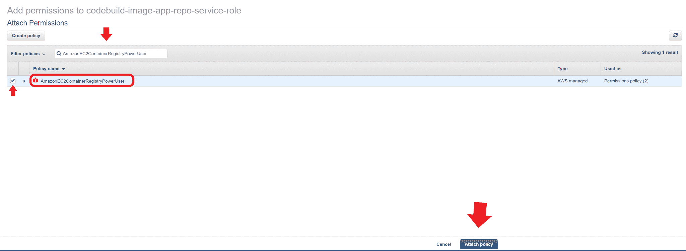](https://web.archive.org/web/20221206031244/https://neptune.ai/deploying-your-next-image-classification-on-serverless-aws-lambda-gcp-cloud-function-azure-automation_25)

*Attach AmazonEC2ContainerRegistryPowerUser policy | Source: Author*

如果您的构建失败了，日志对于故障排除非常有帮助。如果您正确地遵循了本指南中的步骤，您应该能够成功地构建应用程序。您可以返回到 **`image-app-repo`** (或您创建的 ECR repo)的**Elastics Container Registry**页面，以确认 Docker 映像确实已创建。

[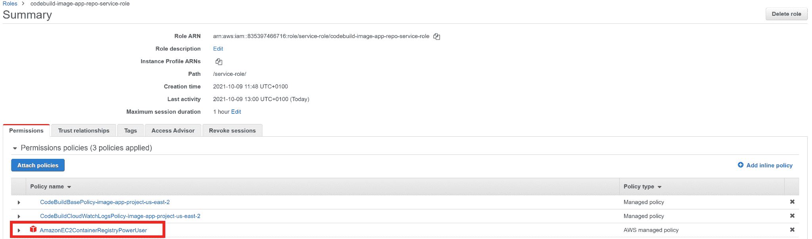](https://web.archive.org/web/20221206031244/https://neptune.ai/deploying-your-next-image-classification-on-serverless-aws-lambda-gcp-cloud-function-azure-automation_48)

*Confirm attached policies | Source: Author*

使用代码管道自动构建应用程序

[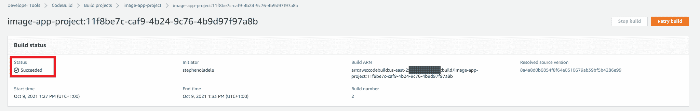](https://web.archive.org/web/20221206031244/https://neptune.ai/deploying-your-next-image-classification-on-serverless-aws-lambda-gcp-cloud-function-azure-automation_45)

*Successful build status view | Source: Author*

您不希望依靠手动步骤来部署无服务器组件。要在将新的提交推送到 CodeCommit 时自动化构建过程，可以使用 CodePipeline。

#### 1.转到代码管道管理控制台[http://console.aws.amazon.com/codesuite/codepipeline/home](https://web.archive.org/web/20221206031244/http://console.aws.amazon.com/codesuite/codepipeline/home)

2.确保**管道**被选中，点击**创建管道**:

3.输入您的**管道名称**。如果您没有现有的服务角色，选择**新服务角色**并输入**角色名称**。保留其他默认设置，点击**下一个**:

4.在下一步中，选择 **AWS CodeCommit** ，输入**存储库名称**，选择**主**分支，并将其他选项保留为默认:

[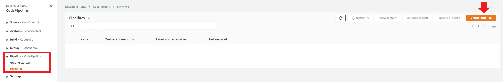](https://web.archive.org/web/20221206031244/https://neptune.ai/deploying-your-next-image-classification-on-serverless-aws-lambda-gcp-cloud-function-azure-automation_28)

*Create pipeline | Source: Author*

5.在**添加构建阶段**步骤下，选择 **AWS CodeBuild** 作为构建提供者。确保选择了项目区域和在上一节中创建的 CodeBuild 项目。其他选项保持默认，点击**下一步**:

[](https://web.archive.org/web/20221206031244/https://neptune.ai/deploying-your-next-image-classification-on-serverless-aws-lambda-gcp-cloud-function-azure-automation_39)

*Choose pipeline settings | Source: Author*

6.因为我们将手动部署我们的映像，我们将不得不**跳过管道中的连续部署步骤**。点击**跳过展开阶段**，当弹出**跳过展开阶段**对话框时，点击**跳过**:

[](https://web.archive.org/web/20221206031244/https://neptune.ai/deploying-your-next-image-classification-on-serverless-aws-lambda-gcp-cloud-function-azure-automation_50)

*Add source stage | Source: Author*

7.最后，检查您的设置并点击**创建管道**:

[](https://web.archive.org/web/20221206031244/https://neptune.ai/deploying-your-next-image-classification-on-serverless-aws-lambda-gcp-cloud-function-azure-automation_10)

*Add build stage | Source: Author*

8.现在，您应该位于应用程序构建过程已经自动开始的页面上:

[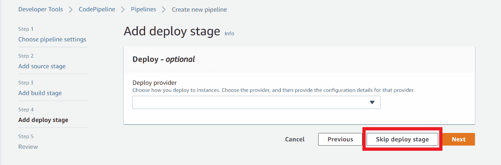](https://web.archive.org/web/20221206031244/https://neptune.ai/deploying-your-next-image-classification-on-serverless-aws-lambda-gcp-cloud-function-azure-automation_18)

*Add deploy stage | Source: Author*

5 分钟后检查，如果构建成功，您应该会看到一个**成功**的通知。

[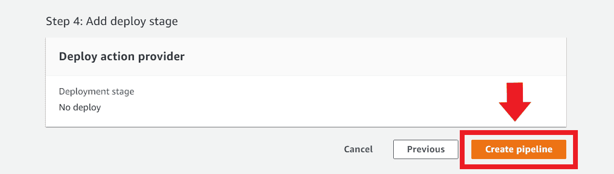](https://web.archive.org/web/20221206031244/https://neptune.ai/deploying-your-next-image-classification-on-serverless-aws-lambda-gcp-cloud-function-azure-automation_19)

*Create pipeline | Source: Author*

现在，您的持续集成和交付管道已经完成。现在，您可以对您的应用程序源代码进行最终提交，以确保您的管道按预期工作。

[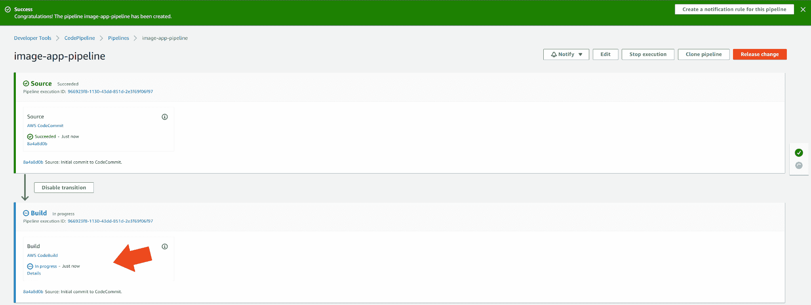](https://web.archive.org/web/20221206031244/https://neptune.ai/deploying-your-next-image-classification-on-serverless-aws-lambda-gcp-cloud-function-azure-automation_12)

*Successful new pipeline view | Source: Author*

确保您仍在项目文件夹中，如果您没有更改代码中的任何内容，请再次暂存代码并添加新的提交消息:

使用以下方式将您的提交推至代码提交:

您可能需要输入 CodeCommit git 凭据。确保您输入了正确的详细信息。

```py
git add *
git commit -m "Final commit"
```

主分支的推送成功后，返回到 CodePipeline 页面，确认您的推送已经触发了管道中的新构建:

```py
git push
```

构建完成后，进入 Elastics 容器注册表中的 **`image-app-repo`** (您的 repo)查看新的映像构建:

太好了！您现在可以开始部署了。由于这是一个教程，我们将跳过大部分安全和其他漏洞的测试阶段。如果这是您组织的生产应用程序，您肯定应该考虑进行安全检查。您不希望在 CI/CD 管道中硬编码您的凭证或 API 密钥。您可以使用凭证管理工具，如 [AWS 参数存储库](https://web.archive.org/web/20221206031244/https://docs.aws.amazon.com/systems-manager/latest/userguide/systems-manager-parameter-store.html)。

[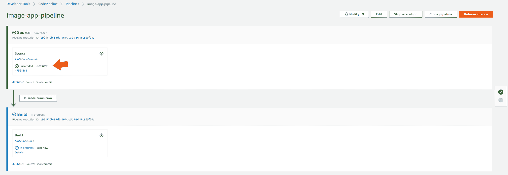](https://web.archive.org/web/20221206031244/https://neptune.ai/deploying-your-next-image-classification-on-serverless-aws-lambda-gcp-cloud-function-azure-automation_23)

*Confirm your push has triggered a new build in the pipeline | Source: Author*

将影像分类应用程序部署到 AWS Lambda

[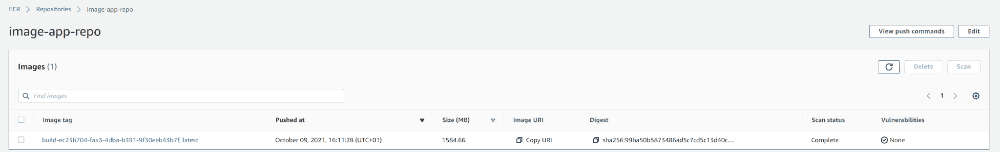](https://web.archive.org/web/20221206031244/https://neptune.ai/deploying-your-next-image-classification-on-serverless-aws-lambda-gcp-cloud-function-azure-automation_55)

*Open image-app-repo | Source: Author*

现在，您的应用程序构建已经准备好部署到无服务器功能。要部署它，我们必须设置 AWS Lambda，以便在有新事件时运行应用程序构建。在我们的例子中，每当一个新的图像上传到我们的 S3 桶，它应该触发 Lambda 函数来运行图像上的应用程序，并将预测和其他细节返回到 DynamoDB。

#### 使用 AWS Lambda 创建无服务器功能

1.打开 Lambda 控制台上的[功能页面](https://web.archive.org/web/20221206031244/https://console.aws.amazon.com/lambda/home#/functions)。

#### 2.选择**创建功能**。

3.在**创建功能**下，选择**容器图像**。在**基本信息**下，输入您的函数名，选择您创建的 ECR 库中的镜像，确保选择 x86 作为微处理器。其他选项保持默认，点击**创建功能**:

4.一旦你的图像被创建，在**功能概述下，**点击**添加触发器**:

[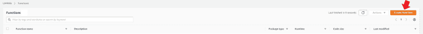](https://web.archive.org/web/20221206031244/https://neptune.ai/deploying-your-next-image-classification-on-serverless-aws-lambda-gcp-cloud-function-azure-automation_9)

*Create function | Source: Author*

5.在**触发配置**下，选择 **S3** 和您想要触发该功能的铲斗。将其他选项保留为默认选项(假设您没有任何文件夹或需要包含特定的扩展名)。勾选**递归调用**下的复选框，确认信息:

[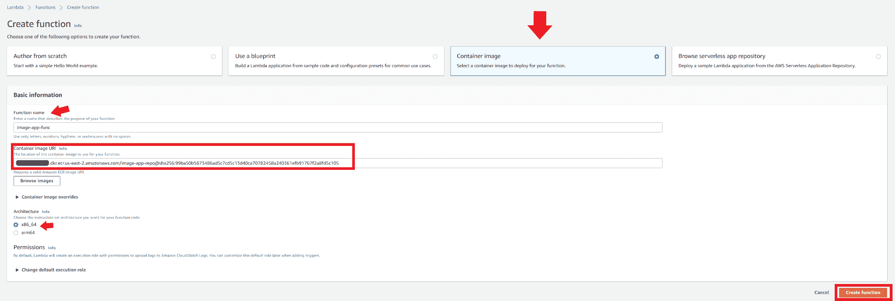](https://web.archive.org/web/20221206031244/https://neptune.ai/deploying-your-next-image-classification-on-serverless-aws-lambda-gcp-cloud-function-azure-automation_13)

*Add function details | Source: Author*

添加触发器后，您需要通过为 Lambda 函数的执行角色设置适当的 [AWS 身份和访问管理(IAM)](https://web.archive.org/web/20221206031244/https://aws.amazon.com/iam/) 权限，来允许 Lambda 函数连接到 S3 存储桶。

[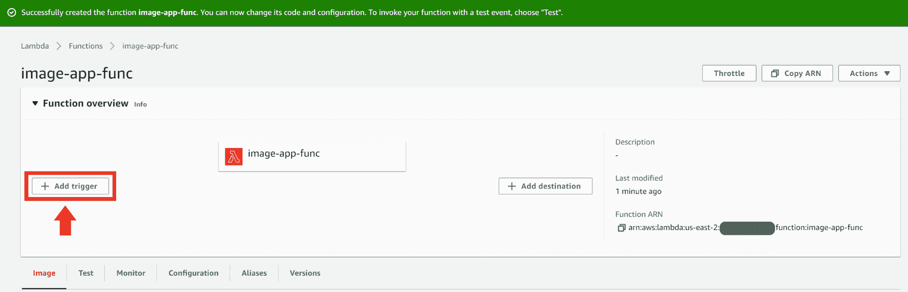](https://web.archive.org/web/20221206031244/https://neptune.ai/deploying-your-next-image-classification-on-serverless-aws-lambda-gcp-cloud-function-azure-automation_16)

*Open add trigger view | Source: Author*

6.在您的功能的**权限**选项卡上，选择 **IAM 角色**:

[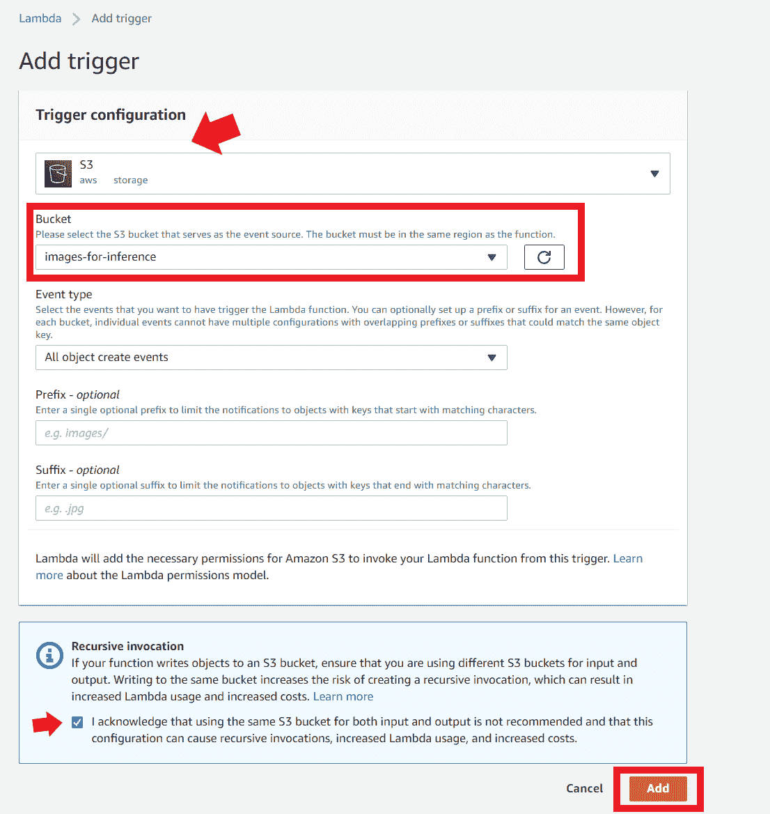](https://web.archive.org/web/20221206031244/https://neptune.ai/deploying-your-next-image-classification-on-serverless-aws-lambda-gcp-cloud-function-azure-automation_40)

*Add trigger | Source: Author*

7.选择**附加策略**:

8.搜索**亚马逊 3ReadOnlyAccess** 和**亚马逊 DynamoDBFullAccess** 。将**两个策略**附加到 **IAM** 角色:

[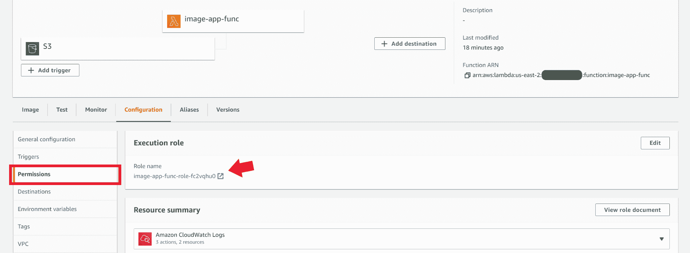](https://web.archive.org/web/20221206031244/https://neptune.ai/deploying-your-next-image-classification-on-serverless-aws-lambda-gcp-cloud-function-azure-automation_58)

*Select IAM role | Source: Author*

9.返回到您的**功能页面**。在**配置**选项卡下，确保选择**通用配置**，点击**编辑**:

[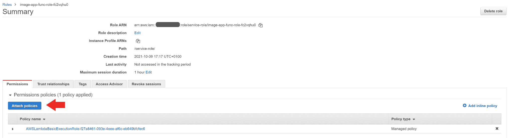](https://web.archive.org/web/20221206031244/https://neptune.ai/deploying-your-next-image-classification-on-serverless-aws-lambda-gcp-cloud-function-azure-automation_38)

*Select attached policies | Source: Author*

10.将内存大小升级到 7000 MB (7 GB ),以确保应用程序运行时有足够的内存可用。另外，将**超时**增加到大约 5 分钟。其他选项保持默认，点击**保存**:

[](https://web.archive.org/web/20221206031244/https://neptune.ai/deploying-your-next-image-classification-on-serverless-aws-lambda-gcp-cloud-function-azure-automation_4)

*Attach AmazonS3ReadOnlyAccess and AmazonDynamoDBFullAccess policies | Source: Author*

就是这样！您现在已经准备好测试您的应用程序了。

[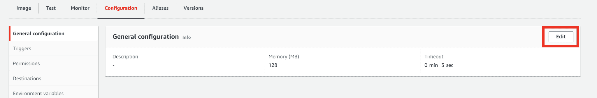](https://web.archive.org/web/20221206031244/https://neptune.ai/deploying-your-next-image-classification-on-serverless-aws-lambda-gcp-cloud-function-azure-automation_52)

*Edit general configuration | Source: Author*

测试应用程序

[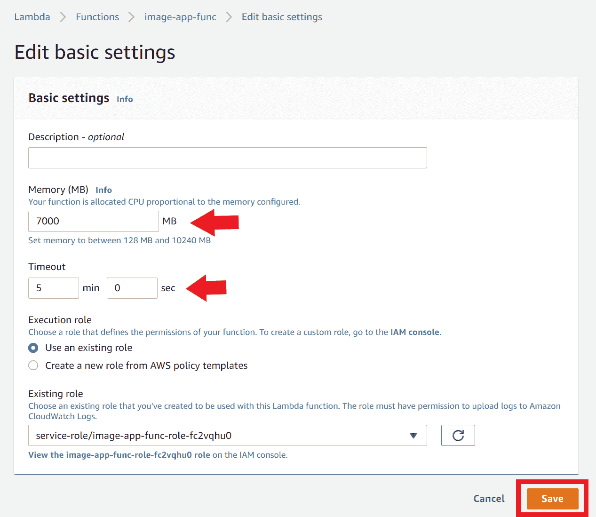](https://web.archive.org/web/20221206031244/https://neptune.ai/deploying-your-next-image-classification-on-serverless-aws-lambda-gcp-cloud-function-azure-automation_53)

*Edit basic settings | Source: Author*

为了测试您的应用程序，上传一个测试图像到您的推理桶。在我们的例子中，它是**`用于推理的图像`**。这里有一个秋天粘虫(FAW)图像的例子，如果您正在跟踪，您可以使用它来测试这个应用程序:

#### 当您将图像上传到 bucket 时，等待几分钟让您的应用程序启动(我们前面讨论过的冷启动问题)。转到 Lambda 函数的页面。在我们的例子中，它是 **`image-app-func`** 。在**监视器**选项卡下，点击**查看 CloudWatch** 中的日志。检查最新的日志流并查看您的应用程序日志:

您可以看到，应用程序返回了正确的预测，它还通知我们，由于没有现有的对象，它已经向数据库添加了一个新对象。周转时间为 48705 毫秒(或 48.75 秒)。如果您计划运行实时应用程序，这可能是不可接受的。一旦您在前一次预测的 5 分钟内运行了其他预测，延迟应该会显著减少，并且更适合于实时任务。


*Image of Fall armyworm (FAW) | Source: Author* 

转到您之前创建的 **DynamoDB 表**,检查并确认是否有新项目添加到表中:

[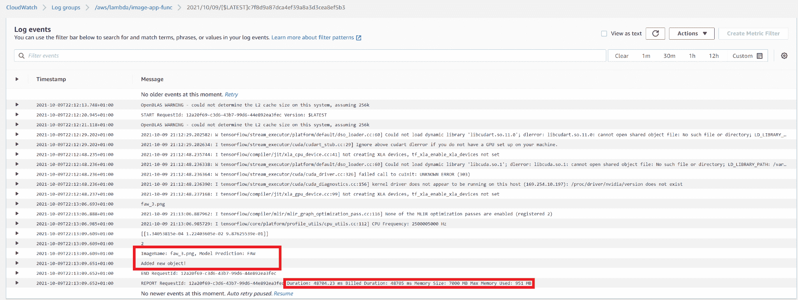](https://web.archive.org/web/20221206031244/https://neptune.ai/deploying-your-next-image-classification-on-serverless-aws-lambda-gcp-cloud-function-azure-automation_26)

*Check the latest log stream and see your application logs | Source: Author*

干得好！你的应用现在正常工作。您可以检查这个[存储库](https://web.archive.org/web/20221206031244/https://github.com/NonMundaneDev/image-classification-app/tree/master/test_images)以获得更多的测试图像。

如果您打算就此打住，请确保删除 ECR 中以前的映像构建，以避免为此付费。您不需要为其他服务付费，因为它们是按使用付费的。

[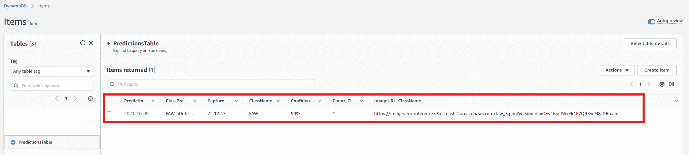](https://web.archive.org/web/20221206031244/https://neptune.ai/deploying-your-next-image-classification-on-serverless-aws-lambda-gcp-cloud-function-azure-automation_31)

*Open DynamoDB table | Source: Author*

后续步骤

祝贺您阅读完本指南！下一步，您可能希望将无服务器 API 管理服务 [API Gateway](https://web.archive.org/web/20221206031244/https://aws.amazon.com/api-gateway/) 连接到您的表，这样您的应用程序就可以从表中获得结果，甚至删除不相关的结果。类似于下图的架构模式:

## 如果您对此感兴趣，您可以找到 Lambda 函数的示例代码，该代码将 API Gateway 与 GET 和 DELETE 方法连接到这个[存储库](https://web.archive.org/web/20221206031244/https://github.com/NonMundaneDev/image-classification-app/blob/master/lambda_function.py)中的 DynamoDB 表。

对 Google Cloud serverless 应用相同的架构模式

[](https://web.archive.org/web/20221206031244/https://neptune.ai/deploying-your-next-image-classification-on-serverless-aws-lambda-gcp-cloud-function-azure-automation_49)

*Deployment workflow for serverless ML application | Source: Author*

如果您选择将您的图像分类应用程序部署到 [Google Cloud 无服务器](https://web.archive.org/web/20221206031244/https://cloud.google.com/serverless)而不是 AWS，好消息是这种架构模式可以应用到 GCP 的大多数无服务器服务，使用以下工具:

所有这些服务很好地集成在一起，使用本指南中的架构模式，您可以在 Google Cloud 上构建一个类似的应用程序。

对 Azure serverless 应用相同的架构模式

如果您选择将您的图像分类应用程序部署到 [Azure 无服务器](https://web.archive.org/web/20221206031244/https://azure.microsoft.com/en-us/solutions/serverless/)，那么在以下服务的帮助下，这种架构模式也可以在这里复制:

### 结论

这是一篇冗长的技术指南，重点介绍部署影像分类应用程序的最佳无服务器模式。不用说，这种架构也适用于涉及非结构化数据的其他类型的 ML 应用程序——当然，需要做一些调整。

总结一下，以下是你在使用无服务器 ML 应用时应该遵循的一些最佳实践:

限制对包的依赖因为在大多数情况下，一个函数的依赖越多，启动时间就越慢，除了管理应用程序的复杂性。

## **尽量避免你的应用程序长时间运行的函数**。如果你的应用很复杂，把它分解成不同的功能，然后松散地耦合它们。

**批量发送和接收数据可能会有所帮助**。使用无服务器函数，当用批处理数据实例化一个函数时，可以获得更好的性能。例如，您可能希望将图像存储在 S3 桶中，而不是在图像来自客户端时将其发送到您的应用程序，并且只在特定的时间间隔或当一组新的图像上传到桶中时才触发该函数

**考虑您选择的平台中可用的工具生态系统**对无服务器环境中的应用进行可靠的跟踪、监控、审计和故障排除。

*   [**负载测试**](https://web.archive.org/web/20221206031244/https://en.wikipedia.org/wiki/Load_testing) **您的应用程序在部署到实际环境之前。**这对于无服务器的 ML 应用尤为重要。
*   考虑用于选择[部署策略](https://web.archive.org/web/20221206031244/https://thenewstack.io/deployment-strategies/)的特性，例如[蓝绿色部署](https://web.archive.org/web/20221206031244/https://en.wikipedia.org/wiki/Blue-green_deployment)、 [A/B 测试](https://web.archive.org/web/20221206031244/https://en.wikipedia.org/wiki/A/B_testing)和[金丝雀部署](https://web.archive.org/web/20221206031244/https://docs.gitlab.com/ee/user/project/canary_deployments.html)是否在您选择的平台中可用，并在您的部署工作流中使用它们。
*   参考资料和资源
*   **Consider the ecosystem of tools available in your platform of choice** for robust tracing, monitoring, auditing, and troubleshooting your applications sitting in serverless environments.
*   [**Load test**](https://web.archive.org/web/20221206031244/https://en.wikipedia.org/wiki/Load_testing) **your application before deploying it to a live environment.** This is especially crucial for serverless ML applications.
*   Consider if features for selecting [deployment strategies](https://web.archive.org/web/20221206031244/https://thenewstack.io/deployment-strategies/) such as [blue-green deployment](https://web.archive.org/web/20221206031244/https://en.wikipedia.org/wiki/Blue-green_deployment), [A/B testing](https://web.archive.org/web/20221206031244/https://en.wikipedia.org/wiki/A/B_testing), and [canary deployment](https://web.archive.org/web/20221206031244/https://docs.gitlab.com/ee/user/project/canary_deployments.html) are available in your platform of choice and use them in your deployment workflow.

### References and resources****