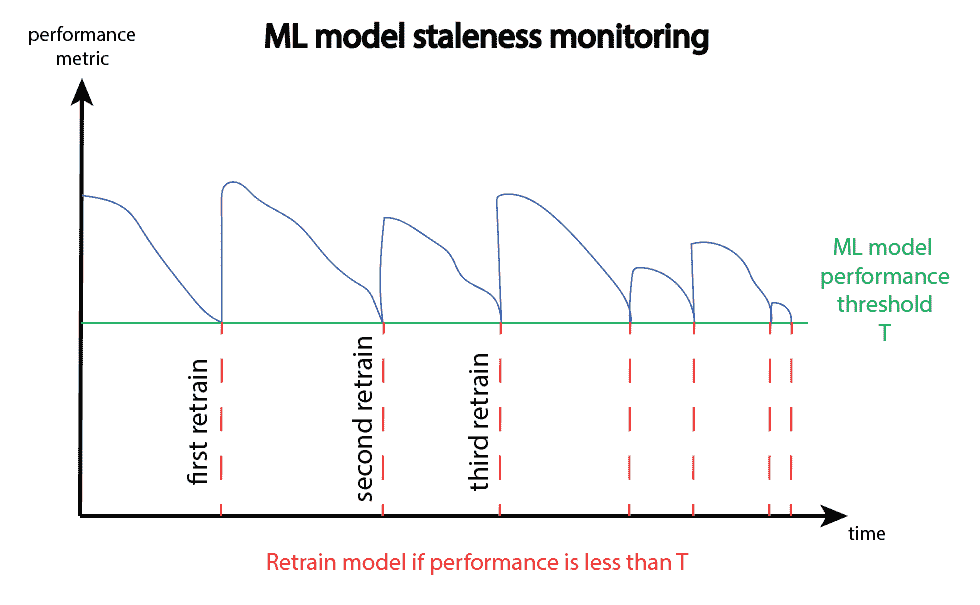
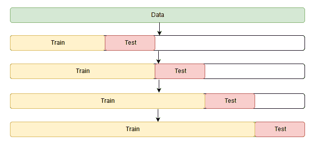
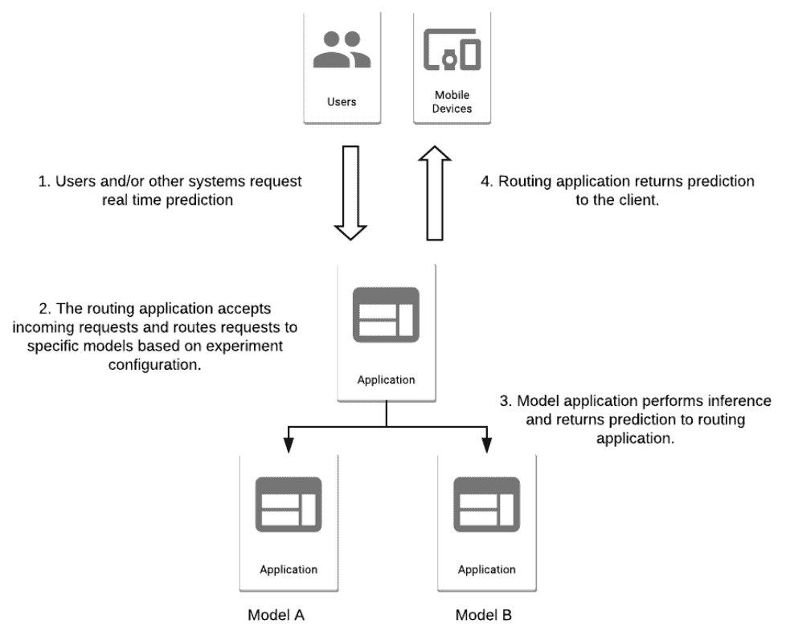
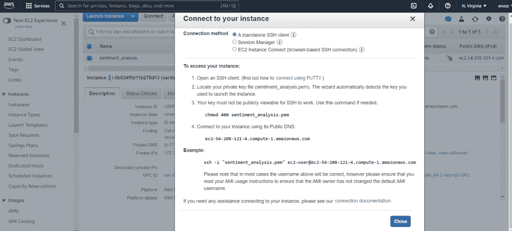
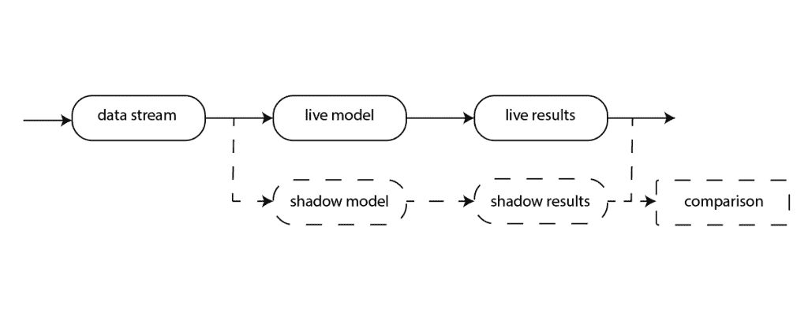

# 部署 ML 模型:如何确保新模型比生产中的模型更好？[实用指南]

> 原文：<https://web.archive.org/web/https://neptune.ai/blog/deploying-ml-models-make-sure-new-model-is-better>

让我们假设我们正在进行一个与 ML 相关的项目，并且第一个 ML 模型已经成功地部署到生产中，遵循了大多数 MLOps 实践。好吧，但是现在怎么办？我们完成工作了吗？

我假设你们大多数人都知道答案是什么，当然，答案是否定的。我们预计，由于模型陈旧或数据漂移，该模型不会永远正常工作。而且，模型不需要自己变坏，说不定还能产生新的更好的模型！

等等，但是更好的模型是什么意思呢？在测试集上准确率更高的模型？还是嵌套，分层，k 折，什么交叉验证后精度更高的模型？

嗯，可能不会。答案要复杂得多，尤其是对于生产中的更好的模型。

在本文中，我们将解释如何确保您的新模型比生产中的模型更好。我们将尝试提及所有可能影响决定更好模型的因素。除此之外，重点将放在模型的生产上，还将介绍一些部署新模型的技术。

## 为什么以及何时需要在生产中部署新的 ML 模型？

ML 项目是高度依赖于输入数据的动态系统。与传统软件相比，大多数软件会随着时间的推移而退化，或者变得越来越不相关。这个问题也被称为模型过时。ML 模型在生产中部署后可能发生的一些问题是:

*   **数据漂移**–当输入特征(即独立变量)的分布与模型在训练中观察到的情况发生剧烈变化时。
*   **模型或[概念漂移](/web/20221002071951/https://neptune.ai/blog/concept-drift-best-practices)**——当目标变量即因变量的性质发生变化而不改变输入特性时。
*   **培训-服务偏差**-生产中的模型，与培训的性能不同。
*   **技术 bug**等类似的东西。

为了及时发现这些问题并采取行动，我们需要实施相关的监控策略。



*Model monitoring and retraining | Source: Author*

除了监控之外，解决模型陈旧的方法是实施再培训策略。模型再训练的时间取决于业务用例，但是通常有四种不同的方法:

*   **基于时间间隔**–每天、每周、每月或类似时间重新训练模型。
*   **基于性能的**–当模型的性能低于预定义的阈值时，重新训练模型。
*   **基于数据变化**–在重大数据变化或引入新功能后触发培训。
*   **按需重新培训**–出于其他原因手动重新培训模型。

但再训练毕竟只是作为数据和概念漂移问题的急救手段。很可能在几次重新训练迭代之后，模型将不会达到它以前拥有的最大性能。此外，如果重新训练逻辑基于模型性能，则模型重新训练之间的时间间隔可能会变得更短。

当再培训变得越来越低效时，这是一个信号，表明我们需要考虑一种新的模式。而且新的模型需要按时准备，因为我们不想等到最后一分钟，模型才完全停止良好的表现。

一般来说，当开发团队确信一个新的生产模型满足了所有被推向生产的需求时，可以在任何时候部署这个新的生产模型。我们不一定需要等到生产中的旧模式变得无用。

但是在部署新模型之前，我们需要确保它确实比旧模型更好。**即使从各个角度来看，开发中的新模型似乎比旧模型更好，直接部署它们也是不安全的**。

在下面的小节中，我们将讨论一些部署新模型的技术和最佳实践。

## 如何比较 ML 车型？

要知道哪种模式“更好”是一项非常具有挑战性的任务。立即出现的一个大挑战是过度拟合。当最大似然模型过于接近训练数据时，就会出现问题，这会导致在新数据上表现不佳。这甚至可能发生在有经验的机器学习实践者身上，因为过度拟合和良好拟合之间没有明确的界限。


*Overfitting challenge | [Source](https://web.archive.org/web/20221002071951/https://memegenerator.net/instance/74939662/futurama-fry-not-sure-if-good-model-or-just-overfitting)*

另一个挑战是为模型评估选择正确的指标，这将考虑所有的业务需求。例如，[网飞在 2009 年给一个开发团队颁发了 100 万美元的奖金](https://web.archive.org/web/20221002071951/https://www.wired.com/2012/04/netflix-prize-costs/)，奖励他将网飞的推荐算法提高了 10%。最终，他们从未使用过这种解决方案，因为这种解决方案太复杂，无法部署到生产中，而且工程成本不值得。

### 模型评估指标

在生产中部署新模型之前，我们需要确保开发中的新模型比旧模型更好。有许多不同的评估指标可用于比较模型，选择正确的指标至关重要。这里就讨论几个比较流行的。

#### 分类指标

说到分类指标，选择指标时要考虑的主要因素是:

*   类别数量——二元或多元分类。
*   每堂课的样本数量——我们有一个平衡的数据集吗？
*   业务用例——例如，根据业务用例平衡精确度和召回率。

最常用的分类标准是准确性。对于更不平衡的数据集，使用 F1、精度和召回率等指标。所有这些以及更多都可以从混乱矩阵中计算出来。对于多类分类，使用相似的度量标准，但公式略有不同。为了利用预测类别的概率，使用诸如 ROC 和 AUC 的度量。

#### 回归度量

回归度量通常会计算出预测值和地面真实值之间的某种距离，用误差来表示。最常用的回归指标是:

*   均方误差
*   平均绝对误差
*   均方根误差(RMSE)
*   平均绝对百分比误差(MAPE)
*   r 平方

#### 推荐系统指标

另一方面，推荐系统和搜索引擎中使用的排名算法有自己的一套衡量标准。其中一些是:

*   平均倒数排名(MRR)
*   命中率(小时)
*   标准化贴现累积收益(NDCG)
*   平均精度

#### 相似性度量

最后，当涉及到无人监督的问题时，相似性度量总是有用的。最常见的有:

*   欧几里得距离
*   余弦相似性
*   莱文斯坦距离
*   雅克卡相似性

还有一些其他指标与**计算机视觉**项目更相关，如交集超过联合(IoU)和结构相似性(SSIM)，其中一些与 **NLP** 相关，如双语评估替角(BLEU)和困惑(PP)。

### 操作指标

除了性能指标之外，还有一些其他指标在模型比较过程中也很重要。这方面的一个例子是我们前面提到的网飞 100 万美元奖金。

许多技术人员忘记了一件事，那就是他们正在构建的产品的商业价值。如果一个简单的线性回归模型或几个决策树就可以很好地解决问题，为什么要开发一些繁重的神经网络模型并花费大量资源呢？此外，像我们是否有预算在云 GPU 机器上维护和运行沉重的模型，以及是否值得比更简单的模型高 0.5%的准确性这样的问题的答案也很重要。

因此，我们需要注意一些流行的业务指标:

## 

*   1 点击率

*   2 转换率

*   3 上市时间

*   4 软硬件成本

*   5 用户行为和参与度

在开发和部署 ML 模型之前，我们需要记住一些技术需求，比如计算时间和基础设施支持。例如，一些 ML 模型可能需要比生产中可行的更多的时间来训练。或者，使用 R 开发模型并不是集成到现有 MLOps 管道中的最佳选择。

最后，我们必须指出在部署 ML 模型之前进行测试的重要性。这是捕捉生产中可能发生的错误的好方法。最常用的测试包括:

*   **冒烟测试**–运行整个管道，确保一切正常。
*   **单元测试**–测试项目的独立组件。
*   **集成测试**–确保项目的组件在组合时能够正确交互。

### ML 验证技术

为了实现一般化并且不过度拟合数据，应用兼容的验证策略是很重要的。这对于防止新数据输入的性能下降是必要的。

为了实现欠拟合和过拟合之间的平衡，我们使用不同的**交叉验证**策略。交叉验证是一种统计方法，用于在 ML 算法投入生产之前对其进行性能评估。一些最受欢迎的是:

## 

*   1 坚持(列车试运行)

*   2 K 倍

*   3 留一手

*   4 分层 K 折

*   5 嵌套 K 折

*   6 时间序列 CV



*Time series cross-validation | [Source](https://web.archive.org/web/20221002071951/https://stats.stackexchange.com/questions/14099/using-k-fold-cross-validation-for-time-series-model-selection)*

有时候，正确地实现一份简历是很棘手的。我们需要避免的常见错误有:

*   对于 [k 倍 CV](https://web.archive.org/web/20221002071951/https://www.baeldung.com/cs/k-fold-cross-validation) ，使用不同的 k 值进行灵敏度分析，以观察结果在不同验证中的表现。
*   倾向于分层验证，以便在每个文件夹中有平衡的类。
*   注意数据泄露。
*   对于时间序列，不要验证过去的数据。

## 如何在生产中部署新的 ML 模型？

ML 模型部署是将模型集成到现有生产环境中以做出实际业务决策的过程。ML 模型几乎总是需要部署来提供商业价值，但是不幸的是，大多数模型从来没有投入生产。部署和维护任何软件都不是一项简单的任务，部署 ML 解决方案会带来更多的复杂性。正因为如此，MLOps 的重要性上升了。

我们使用的模型部署策略有可能将我们从昂贵的和不想要的错误中拯救出来。这对于 ML 系统尤其重要，在这种系统中，检测生产中的数据或模型错误可能非常困难，并且可能需要大量的“挖掘”。此外，在许多情况下，精确复制生产数据输入可能很困难。

为了缓解这些问题，并确保新模型在各个方面都优于旧模型，创建了一些部署策略。它们中的大部分来自一般的软件行业，但是为了 ML 的目的稍微修改了一下。在本教程中，我们将解释 ML 中一些最常用的部署方法。

### 影子部署

影子部署是一个概念，不仅在 ML 中使用，而且在一般的软件开发行业中使用。这是一种部署策略，我们在实时部署之前将应用程序部署到单独的环境中。影子部署通常被公司用来在向公众发布应用程序之前测试它们的性能。这种类型的部署可以在小规模和大规模上进行，但在部署大型应用程序时尤其有用，因为它们有很多依赖项，容易出现人为错误。

#### 影子部署的优势

随着影子部署，我们将能够测试一些事情，如:

*   整个管道的功能——模型收到预期的输入了吗？模型输出结果的格式是否正确？整个过程的延迟是多少？
*   模型的行为，以防止在实际生产中出现意外和昂贵的决策。
*   与实时模型相比，阴影模型的性能。

即使从一般的角度来看，在生产环境中进行测试也比在 ML 中使用沙盒或登台环境有很多好处。例如:

*   在非生产环境中创建真实的数据是一项非常复杂的任务。对于更复杂的输入数据，如图像、流数据和医疗记录，为非生产环境创建包括所有可能的边缘情况的测试数据几乎是不可能的。
*   对于具有许多节点和集群机器的复杂设置，在非生产环境中测试相同的基础设施将是昂贵的，并且可能不值得。
*   维护非生产环境需要额外的资源。
*   对于实时 ML 系统，逼真地复制数据流量和模拟模型的频繁更新是一个挑战。
*   最后，如果 ML 模型在非生产环境中的行为和预期的一样，这并不意味着它在生产环境中的行为也一样。

#### 影子部署怎么做？

在应用程序级别，影子部署可能以简单明了的方式非常简单地实现。基本上，这是一个代码修改，将输入数据发送到 ML 模型的当前版本和新版本，保存两个版本的输出，但只返回当前版本的输出。在性能很重要的情况下，比如实时预测系统，最佳实践是异步传递输入和保存输出，首先是生产中的模型，然后是新模型。

与应用程序级别相反，在基础架构级别，影子部署可能有一些复杂的元素。例如，如果一些服务进行外部 API 调用，那么我们需要确保它们不会在两个模型中重复，以避免速度变慢和额外的开销。基本上，我们需要确保所有应该只发生一次的操作不会触发两次或更多次。如果我们影子部署不止一个新模型，这一点尤其重要，这也是可能的。

在保存了所有的模型输出和日志之后，我们使用一些度量来查看新模型是否更好。如果新型号证明更好，我们就安全地更换旧型号。

### A/B 测试

A/B 测试是一种基于统计数据做出业务决策的技术，它被广泛用于测试给定特性相对于旧特性的转换率。在部署策略的情况下，想法是有两个独立的模型，即 A 和 B，它们有两个我们想要测试的不同的特性或功能。当部署具有新特性或功能的模型时，用户流量的子集在特定条件下被重定向以测试该模型。

除了转换率，公司还使用 A/B 测试来衡量其他业务目标，例如:

*   总收入
*   用户参与度
*   每次安装的成本
*   流失率和其他。

为了对这两个模型进行无偏见的测试，应该谨慎地在它们之间分配流量。这意味着两个样本应该具有相同的统计特征，这样我们才能做出正确的决定。这些特征可能基于:

*   人口属性，如性别、年龄、国家等
*   地理定位
*   浏览器 cookies
*   技术类型，如设备类型、屏幕大小、操作系统等。

与影子部署相反，A/B 测试通常只用于测试一个单独的功能，以了解其真正的贡献。例如，模型中新特征的存在。它不适合一个有多种变化的新模型，因为我们无法确切知道哪个功能正在影响性能，以及它的贡献有多大。

#### A/B 测试的好处

对于模型中的简单更改，A/B 测试比影子部署要方便得多。此外，A/B 测试和影子部署之间的主要区别在于，A/B 测试中的流量在两个模型之间分配，而在影子部署中，两个模型使用相同的事件进行操作。这样，A/B 测试消耗的资源至少减少了两倍。

#### 如何对 ML 车型进行 A/B 测试？

第一步是确定我们希望实现的业务目标。这可能是我们上面提到的指标之一。

下一步是定义测试的参数:

*   样本大小——用户流量如何在 A 和 B 模型之间分配？比如 50/50，60/40 等。
*   测试持续时间——定义达到测试预期显著性水平的截止日期。

之后，我们需要做一些架构上的改变。一个好的方法是在用户请求和模型之间增加一个额外的抽象层。这一路由层负责将流量定向到托管在不同环境中的两个模型。基本上，路由层接受传入的请求，然后根据我们定义的实验设置将它们定向到我们的一个模型。所选模型将输出返回给路由层，路由层将输出返回给客户端。



*One good A/B architecture |* [*Source*](https://web.archive.org/web/20221002071951/https://mlinproduction.com/ab-test-ml-models-deployment-series-08/)

### 金丝雀部署

canary 部署的思想是向新模型发送一小部分请求，以验证它是否如预期的那样运行。仅使用一小部分流量，我们就能够验证新模型，检测潜在的错误和问题，而不会对大多数用户造成伤害。一旦我们确定新模型按预期工作，我们就可以逐渐增加流量，直到整个流量不切换到新模型。

总之，canary 部署可以分为三个步骤:

1.  将流量的一个小的子样本导向一个新的模型。
2.  验证模型是否按预期工作。如果没有，请执行回滚。
3.  在将所有流量释放到新模型之前，重复前面的两个步骤，直到所有错误都得到解决并且验证完成。

通常，当测试没有很好地实现或者对新模型没有信心时，使用这种技术。

#### 金丝雀部署的优势

Canary deployment 提供了一种根据生产中的真实数据测试新模型的简单方法。与影子部署相比，canary 部署不要求所有流量都流向两个模型，正因为如此，它在模型推理资源方面便宜两倍。在失败的情况下，它只影响一小部分流量，如果实施得当，不会造成重大伤害。

#### 金丝雀部署怎么做？

首先，我们需要定义 canary 部署将选择多少用户，在多少个阶段，以及 canary 部署的持续时间。与此同时，我们必须计划如何挑选用户的策略。一些可能的选项包括:

*   随机用户选择
*   按地区-将金丝雀部署到一个地理区域。
*   早期采用者计划——让用户有机会作为测试者参与金丝雀测试。
*   dog fooding——首先向内部用户和员工发布 canary 模型。

之后，我们需要指定我们将要使用的度量标准以及成功的评估标准。最佳选择标准可以结合几种不同的策略。例如，[脸书首先向员工部署](https://web.archive.org/web/20221002071951/https://www.infoq.com/presentations/Facebook-Release-Process/)金丝雀，然后向一小部分用户部署。架构部分非常类似于 A/B 测试。我们需要一个路由层来控制模型之间的流量。此外，当第一只金丝雀的输出被分析时，我们将决定我们是否应该增加流量的百分比或放弃新的模型。

### 功能标志

特性标志，也称为特性切换，是快速安全地发布新特性的强大技术。特性标志的主要目的是打开或关闭功能，以便通过将代码部署与特性发布分开，在生产中进行安全测试。

其思想是将新模型或功能的代码集成到生产代码中，并使用功能标志来控制模型的流量，而不是花费资源来构建新的独立基础设施或额外的路由层。功能标志可分为不同类别的切换，其中主要类别有:

*   **Release toggles**–开发人员在主分支中生成一个 Release toggles，让他们的代码在工作时保持非活动状态，而不是创建一个具有新特性的分支。
*   **实验切换**–用于简化 A/B 测试。基本上，是集成到产品中的代码的一部分，用于划分模型之间的流量。
*   **操作开关**–用于关闭功能。例如，如果不满足某些条件，操作开关会关闭我们之前部署的新功能。
*   **权限切换**-旨在使某些功能对特定用户子集可用，如高级用户等。

#### 功能标志的好处

由于它们的简单性，当我们需要快速部署新的变化到我们的系统时，特性标志是有用的。在大多数情况下，它们是临时的解决方案，应该在变更测试完成后删除。

一旦实现，特性标志不仅可以由工程师和开发人员控制，也可以由产品经理、销售团队和市场团队控制。有了特性标志，就有可能在不回滚代码的情况下关闭在生产中意外执行的特性。

#### 如何实现特征标志？

功能标志的范围从简单的 if 语句到更复杂的决策树。通常，它们直接在项目的主分支中实现。部署后，可以使用配置文件控制功能标志。例如，可以通过修改配置文件中的特定变量来关闭或打开操作标志。此外，许多公司使用 CI/CD 管道来逐步推出新功能。

## 示例:影子部署

作为一个例子，我们将展示如何影子部署一个简单的 ML 应用程序。首先，让我们在 [AWS EC2](https://web.archive.org/web/20221002071951/https://aws.amazon.com/ec2/) 上部署一个简单的基于情感分析转换器的模型。该模型将从 IMDB [拥抱面部数据集](https://web.archive.org/web/20221002071951/https://huggingface.co/datasets/imdb)中随机接收文本段落，并将它们分类为积极情绪和消极情绪。情绪的结果将保存在 [AWS S3](https://web.archive.org/web/20221002071951/https://aws.amazon.com/s3/) 桶中。

创建 EC2 实例的步骤:

1.  转到 AWS -> EC2 ->启动实例
2.  选择名称、实例类型，并为登录创建新的密钥对。
3.  单击启动实例

创建 S3 时段的步骤:

1.  转到 AWS ->亚马逊 S3 ->桶->创建桶
2.  写入存储桶名称，并可选地启用存储桶版本控制。单击创建一个存储桶。

为 S3 访问创建 IAM 用户的步骤:

1.  转到 AWS -> IAM ->用户->添加用户
2.  填写用户名，并在 AWS 访问类型下，选择“访问键-编程访问”,然后单击权限选项卡旁边的。
3.  选择以下策略“AmazonS3FullAccess”
4.  单击“下一步”按钮两次，然后单击“创建用户”。现在，将出现用户凭证，请确保下载并保存它们，因为您将无法再次看到它们。

为了连接到创建的实例，请转到 EC2，单击 Instances，然后单击 connect。



*Instructions on how to connect to the instance | Source: Author*

将出现如何连接到实例的说明。可以通过浏览器连接 EC2 实例，但是通常我们使用 SSH 连接从本地机器进行连接。在这种情况下，它是

```py
ssh -i "sentiment_analysis.pem" ec2-user@ec2-54-208-121-4.compute-1.amazonaws.com

```

其中“情绪分析. pem”是我们之前创建的登录密钥对的路径。

在这个例子中，我们使用一个 EC2 Red Hat Linux 实例，在连接到该实例后，我们需要更新包并安装 python 和 git。

```py
sudo yum update -y
sudo yum install python3 -y
sudo yum install git -y

```

此外，我们将使用 python 环境直接在机器上运行我们的项目。为此，我们需要安装 virtualenv 并创建一个环境。

```py
pip3 install --user virtualenv
virtualenv venv

```

为了从 EC2 机器访问 S3 存储区，我们需要使用命令[安装 AWS CLI](https://web.archive.org/web/20221002071951/https://docs.aws.amazon.com/cli/latest/userguide/getting-started-install.html)

```py
curl "https://awscli.amazonaws.com/awscli-exe-linux-x86_64.zip" -o "awscliv2.zip"
unzip awscliv2.zip
sudo ./aws/install

```

并使用配置凭据

```py
aws configure

```

在这里，我们需要输入在创建 IAM 用户步骤中下载的凭证中的访问密钥 ID 和秘密访问密钥。要测试 S3 访问，请使用命令

```py
aws s3 ls
```

之后，我们需要克隆[项目](https://web.archive.org/web/20221002071951/https://github.com/eneszv/sentiment_analysis_neptune)，安装需求并运行我们的主脚本。可以使用 cron 作业将脚本部署到生产环境中，方法是设置它将被执行的确切时间，或者如果它是一个正在进行的进程，则使用“nohup”命令。

要设置 cron 作业，请使用命令

```py
crontab -e
```

按“I”进入插入模式并写入

```py
* * * * * cd ~/sentiment_analysis_neptunel/src; ~/venv/bin/python ~/sentiment_analysis_neptune/src/main.py
```

其中“* * * * *”是一个 cron 模式，可以从[https://crontab.guru/.](https://web.archive.org/web/20221002071951/https://crontab.guru/.)中定义，路径“~/情操 _ 分析 _neptunel/src”是我们需要运行主脚本的地方，“venv/bin/python”是我们使用的 python 环境。之后，按 ESC，然后按:wq，然后按 ENTER。要仔细检查创建的 cron 作业，请使用命令–

```py
crontab -l

```

要使用“nohup”运行 python 脚本，请使用命令激活您的 python 环境“venv”

```py
source venv/bin/activate

```

然后跑

```py
nohup python main.py > logs.out &

```

我们的主脚本看起来像

```py
if __name__ == '__main__':
	data_sample = get_data()
	run_model(data_sample)

```

其中“get_data”函数准备数据样本，围绕模型和预测的整个逻辑由“run_model”函数完成。现在，如果我们想要影子部署另一个模型，可能只需在主脚本中添加一行代码即可:

```py
if __name__ == '__main__':
	data_sample = get_data()
	run_model(data_sample)
	run_shadow_model(data_sample)

```

其中函数“运行影子模型”运行新影子模型的所有逻辑。模型异步运行，首先是生产中的旧模型，然后是新的影子模型。此外，函数“get_data”只被调用一次。如果在“运行”函数中没有外部 API 调用，这种架构可能会工作得很好，这样我们就不会重复它们。



*App architecture | Source: Author*

在我们确保影子模型顺利运行，没有任何错误和预期的延迟之后，我们需要比较实时和影子结果。这种比较基于我们在开始时提到的一些指标。如果两个模型都有监控系统，可以使用现有的监控系统在线进行比较，也可以离线进行比较，离线时可以对结果或附加日志进行更深入的分析。如果阴影结果更好，我们用阴影模型替换真实模型。

这个项目的全部代码可以在这个库中找到。

## 结论

在本文中，我们讨论了在生产中确保新模型优于旧模型的所有步骤。我们已经描述了从开发到部署的所有阶段，其中我们将新模型与生产中的模型进行比较。这是必要的，因为只在一个阶段比较模型会留下一些错误和问题的可能性。除此之外，我们提到了几个可用于比较的指标。

主要的一点是，仅仅比较开发中的模型是不够的，还必须有一个可靠的部署策略，以确保从业务/用户的角度来看，新模型确实比生产中的模型更好。

### 参考

### enes zvornianin

Enes 是一名拥有三年多经验的数据科学家。Enes 在数学、计算机科学和机器学习方面有很强的背景，并且热衷于学习和探索与机器学习相关的任何领域。你可以在 Linkedin 上和他联系。

* * *

**阅读下一篇**

## Continuum Industries 案例研究:如何跟踪、监控和可视化 CI/CD 管道

7 分钟阅读| 2021 年 8 月 9 日更新

[Continuum Industries](https://web.archive.org/web/20221002071951/https://www.continuum.industries/) 是一家基础设施行业的公司，希望自动化和优化线性基础设施资产的设计，如水管、架空传输线、海底电力线或电信电缆。

其核心产品 Optioneer 允许客户输入工程设计假设和地理空间数据，并且**使用进化优化算法来寻找可能的解决方案，以在给定约束的情况下连接 A 点到 B 点。**

首席科学家安德烈亚斯·马莱科斯(Andreas Malekos)致力于研究人工智能发动机，他解释道:

“建造像电力线这样的东西是一个巨大的项目，所以你必须在开始之前获得正确的设计。你看到的设计越合理，你就能做出更好的决定。Optioneer 可以在几分钟内为您提供设计资产，而成本只是传统设计方法的一小部分。”

但是，创建和操作 Optioneer 引擎比看起来更具挑战性:

*   目标函数不代表现实
*   有很多土木工程师事先不知道的假设
*   不同的客户给它提出完全不同的问题，算法需要足够健壮来处理这些问题

与其构建完美的解决方案，不如向他们展示一系列有趣的设计选项，以便他们做出明智的决策。

引擎团队利用来自机械工程、电子工程、计算物理、应用数学和软件工程的各种技能来实现这一目标。

## 问题

无论是否使用人工智能，构建一个成功的软件产品的一个副作用是，人们依赖它工作。当人们依赖您的优化引擎做出价值百万美元的基础设施设计决策时，您需要有一个强大的质量保证(QA)。

正如 Andreas 所指出的，他们必须能够说，他们返回给用户的解决方案是:

*   **好**，意思是这是一个土木工程师可以看到并同意的结果
*   **更正**，这意味着计算并返回给最终用户的所有不同工程数量都尽可能准确

除此之外，该团队还在不断改进优化引擎。但要做到这一点，您必须确保这些变化:

*   不要以这样或那样的方式破坏算法
*   实际上，它们不仅改善了一个基础设施问题的结果，还改善了所有问题的结果

基本上，您需要**建立适当的验证和测试，**但是团队试图解决的问题的性质带来了额外的挑战:

*   您无法自动判断算法输出是否正确。**这不像在 ML 中，你已经标记了数据**来计算你的评估集的准确度或召回率。
*   您**需要一组示例问题，代表算法在生产中需要解决的那类问题的**。此外，这些问题需要被版本化，以便尽可能容易地实现可重复性。

[Continue reading ->](/web/20221002071951/https://neptune.ai/customers/continuum-industries)

* * *