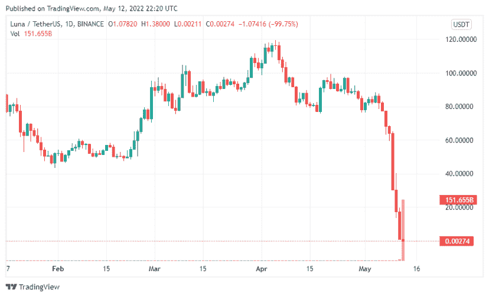
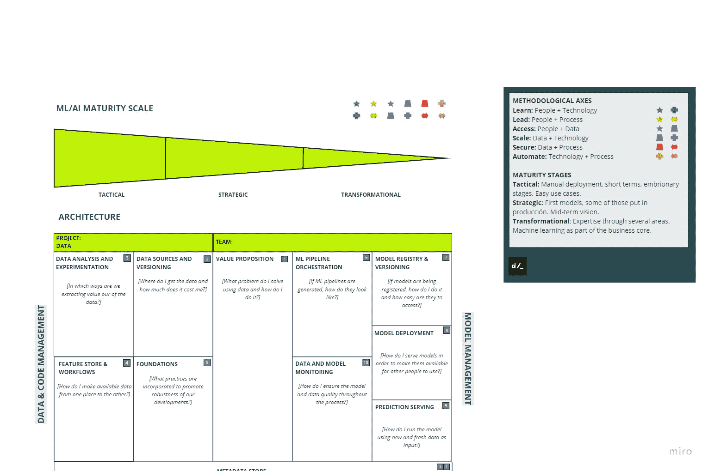
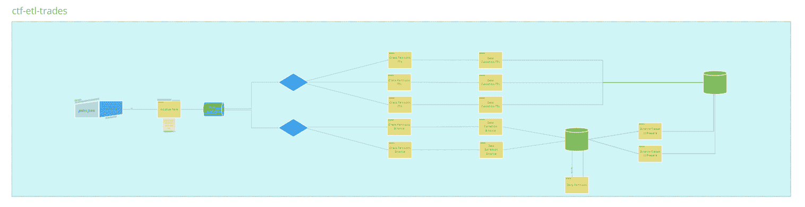
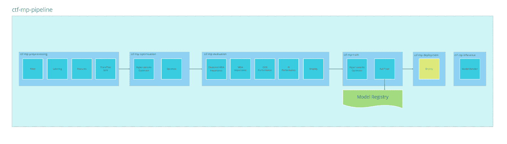
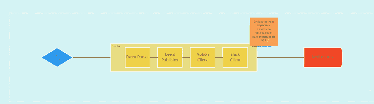
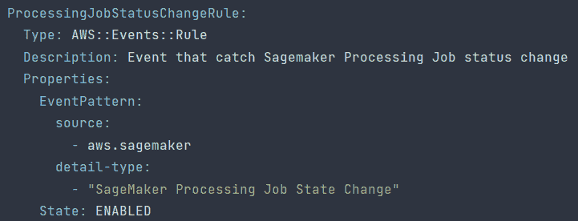
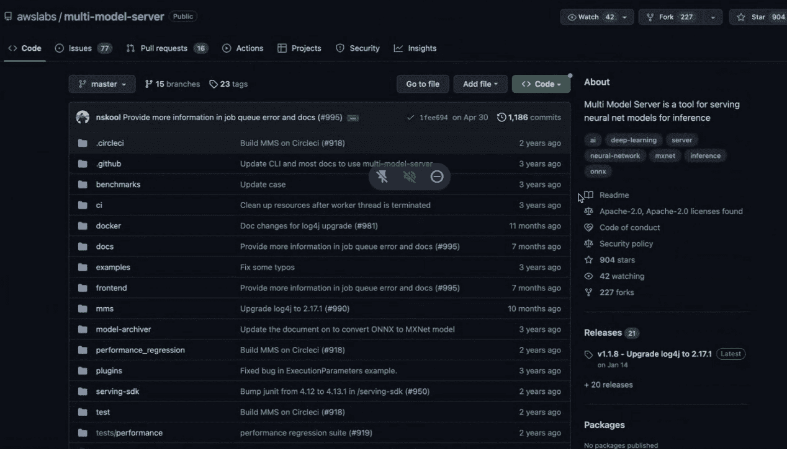

# 为最混乱的行业部署数据和 ML 管道:加密的搅动河流

> 原文：<https://web.archive.org/web/https://neptune.ai/blog/deployment-of-data-and-ml-pipelines-crypto-industry>

在阿根廷有一句老话是这样说的:“A río revuelto，ganancia de pescadores”。这翻译过来就是“**当河水被搅动时，渔民获利**”。

2022 年将作为加密生态系统的决定性一年而被铭记。这是出于好的还是坏的原因还不得而知，但毫无疑问，生态系统的波动性引起的巨大波动(包括整个加密货币和可以说是第二重要的交易所的崩溃和毁灭)影响了它们触及的一切。

这包括数据。

鉴于机器学习的整个理论假设今天的行为至少*有点像昨天*，**在这样一个混乱的环境中，算法和模型能为你做什么**？甚至更多:**你如何利用 crypto** 固有的海量数据的力量，跟踪这些极端的变化，并真正从中提取价值？

这些是 CTF 资本(一家交易基金)的家伙们的疑问。我们在 [deployr](https://web.archive.org/web/20230106143836/https://www.deployr.ai/home-en/) ，与他们一起工作，为每个参与的人找到最好的答案，并建立他们的数据和 ML 管道。

我们希望我们应对这些挑战的经验能够帮助您理解加密世界的复杂性，并可能在如何处理您自己的数据问题和团队管理方面给予您冷静的见解。

简要说明:本文的重点不是讨论加密交易本身的复杂性(可以说是经济角度)，而是讨论**我们如何使用 MLOps 方法的最佳实践来领导一家在技术和计算要求最高的领域之一工作的公司的转型过程**。

解决了这个问题，让我们开始吧！

## 构建数据和 ML 管道:从地面到云端

这是 2022 年初，封锁结束后，事情看起来很光明。当时，我们收到了一条来自一位在加密交易基金工作的朋友和同事的消息:“**我设法组建了一个令人惊叹的数据团队，但我们缺乏方向和重点**”。

为了让你对我们这边的世界有所了解(我们来自阿根廷，你想要一个配偶吗？)，在拉丁美洲，我们面临着实现顶级绩效的独特挑战，同时要解决三个主要问题:

1.  **缺乏西班牙语的形成性资源**:虽然幸运的是两个团队都能够流利地使用英语，但残酷的现实是大多数技术框架都是用英语设计和编码的，并且大多数时候试图在网上找到西班牙语的示例和指南会导致低质量的资源，甚至根本没有结果。

2.  **云计算的固有成本**:为了说明这一点，阿根廷的最低工资目前是每月 200 美元左右。这看起来可能不是一个真正的问题，但是当你不得不花钱在云中实现一些东西时，花一两美元就可以让失败的成本(这是开发这些解决方案的自然部分，失败并快速迭代以获得最佳结果)非常高。

3.  **高级人才流失:**主要是由于比索和美元之间巨大的汇率差距造成的。

### 最高价和最低价

CTF 资本公司的人正在开发一个可以整合到更大的决策系统中的模型。这个想法是为了帮助交易者(真实的人)对特定的加密货币对(大多数情况下，与稳定的货币相比，如 USDC 或 USDT)进行卖出或买入。

说到加密，管道的每一个部分都可能很快变成极端和危险的东西。虽然几乎每个行业的每个项目都是如此，但请记住，密码世界的变化可能会突然发生**。**

 **作为一家处理数百万美元(转化为多种加密货币)的交易基金，**决策过程必须尽可能清晰**，为此，跟踪和问责至关重要。

*“In crypto, we call this a Wednesday”*

考虑到这种情况，在我们开始动手编写一行代码之前，我们必须**为我们将要构建的一切建立最坚实的基础**。

## 构建数据和 ML 管道图

如果你曾经是这种转型过程的一部分，我肯定你已经知道这是一个**所有人都在甲板上的时刻**。

达到这种卓越和绩效水平要求每个人都必须清楚地了解情况。要做到这一点，**你必须从技术、业务和人员层面**对组织*和*进行诚实的诊断。以此为起点，设计并引导你的客户到达他们希望*到达的地方*就成了问题。

我们也相信沟通很重要，对每一步会发生什么保持神秘是没有意义的。如果你想让数据科学家、工程师、架构师、利益相关者、第三方顾问和无数其他参与者参与进来，你必须做好两件事:

## 

*   1 在利益相关者和来自整个组织的成员(从营销到销售再到工程)之间搭建桥梁，在不同的理论和实践层面处理数据。
*   对最终目标的兴奋感:更好地做我们所做的事情，使用最佳软件实践来充分利用我们所做的事情，并使用最合适的技术来做这件事。

你处理这些问题的方式完全不同，而且**它需要在最先进的技术方面**(“我们能建立、维护和部署它吗？”、[合理规模](/web/20230106143836/https://neptune.ai/blog/mlops-reasonable-scale-jacopo-tagliabue)对我们意味着什么？”)和业务的**人性一面**(“从现在开始到接下来的几个月，会有多少职位轮换？”“我和我的团队需要什么，我们将如何成长？”)来设计一条清晰一致的路径，把你从现在的位置带到你想去的地方。

这就是为什么我们利用我们作为开发和管理团队一部分的多年经验以及几种方法中的最佳方法，开发了 **[架构画布](https://web.archive.org/web/20230106143836/https://www.deployr.ai/acf-download/):一个帮助组织推进其数据项目的框架。**

A*rchitecture canvas* | Source: Author

### 空谈是廉价的(也是有用的)

无需深入细节，架构画布由两大阶段组成:

#### 第一阶段:建筑

在这里，我们试图**清楚地了解给定组织在数据和 ML 采用方面的技术、文化、**和人员能力，善意地指出最薄弱的地方**，诚实地提供合适的改进方案**。

这是上图的下半部分，旨在从以下方面深入了解公司的状况:

## 

*   1 价值主张
*   2 数据来源和版本控制
*   3 数据分析和实验
*   4 功能商店和工作流程
*   5 基础
*   6 ML 管道编排
*   7 模型注册和版本控制
*   8 车型部署
*   9 预测发球
*   10 数据和模型监控
*   11 元数据存储

#### 阶段 2: ML 和 IA 成熟度量表

这种方法始于这样的假设:每个团队都可以在四个维度上进行分析:人员、技术、数据和流程。根据每一种可能的组合，你会得到六个方法轴:

## 

*   1 学习:人+技术
*   2 领导:人员+流程
*   3 访问:人员+数据
*   4 规模:数据+技术
*   5 安全:数据+流程
*   自动化:技术+流程

这一阶段的目标是**根据这六个轴在三个不同成熟度级别上的表现给团队打分:战术、战略和转型**。

您可以看一下上图的上半部分，看看这些交叉点是如何在从 1(在数据采用方面完全不成熟的组织)到 5(在数据采用方面完全成熟、专业和先进的组织)的**级别上结束的。**

#### 我们为人类同胞编码(并与之合作)

这个框架需要完全的诚实、透明和协作。为了获得所有这些信息，我们需要与团队的不同领域(科学家、工程师、QA、经理、高管，如果需要的话)进行会谈，以便**充分了解每个人对项目的期望，并达成共识**。

幸运的是，会议富有成效且充满乐趣:我们能够深入底层，设计出一个新的计划，使我们能够快速发展，并以季度的方式衡量它，为业务的每个领域提供价值和安心。

为了促进上述透明度和协作，在会议结束并制定计划后，**我们的第一步是重新安排管理和跟进工具，使其适应我们的需求**。

严肃地说:**保持和维护一个严肃的跟踪工具**，我们怎么强调都不为过。使用 Trello，Asana，或者你选择的任何方法，但是如果你想让每个人都在同一页上，保持每个人都在做的事情的完全可见性是至关重要的。

在这一点上，我们使用[概念](https://web.archive.org/web/20230106143836/https://www.notion.so/)，我们认为它本身就是一个令人惊叹的工具，但我们的王牌是[这个由 Thomas Frank](https://web.archive.org/web/20230106143836/https://thomasjfrank.com/templates/task-and-project-notion-template/) 制作的令人惊叹的免费模板:开始使用它可能有点复杂和吓人，但一旦你掌握了窍门，它是一种非常直观的方式，通过看板和日历方法的最佳效果来组织工作。

我们还定义了**新的 Slack 通道来加速一些事情**，它们最终将成为自动通知中心的一个组成部分，用于监控整个系统(稍后将详细介绍！).

**知道需要做什么和以什么顺序做(整个*过程和管理【数据的 方面)经常被忽视***，我们知道有时让每个人都了解最新情况以其自己的方式可能有点乏味，但是如果你能在睡梦中编排几十个步骤的管道，你肯定能花点时间写下你在做什么，对吗？

## 阶段 1—数据管道:让房子井然有序

一旦尘埃落定，我们就完成了架构画布，并且计划对参与的每个人都很清楚，下一步就是仔细看看架构。这就是通常发生的事情:

我们为 ML 模型而来，我们为 ETL 留下。

过去，主要的棘手问题是:

## 

*   架构部署没有明确标记，有些部分严重依赖手动执行。
*   整个系统的入口点依赖于多个 web 套接字，这使得它很难扩展。
*   SQS 的队伍很难维持。

### 盒子里有什么？

首先，**数据的来源来自两个最大的交易所**。但是，即使 ETL 是经过深思熟虑的，它们的方法也有点“过时”。由于他们主要是为了测试而进行概念验证，**大部分架构是面向计算的**:通过 ssh 在 EC2 中设置东西，没有 CI/CD，几乎没有使用 rds，一些丢失数据的问题，几乎没有容器化，等等。

我们很快意识到，虽然开发团队在 ML 的*数据科学和工程*方面(算法、ETL 以及如何使用它们来推动业务发展)非常出色，但他们缺乏关于如何从云服务和该领域新的最佳实践中获取最大价值的**知识**。

在这种情况下，我们在三件事上达成了一致:

## 

*   1 慢慢转向更“过时”的架构(深入研究无服务器)。
*   2 教他们如何使用最适合他们的堆栈(主要关注 MLOps 和 AWS Sagemaker / Sagemaker Studio 的基础知识)。
*   3 重新设计和重写架构作为基础设施作为代码(使用 AWS Cloudformation)。

幸运的是，我们能够快速交付，并且在一个月内我们已经建立了一个全新的系统。

#### ETL 管道

ETL Pipeline | Source: Author

*   流水线由 Eventbridge 触发**，可以手动完成，也可以由 cron 完成。**
*   这触发了一系列初始化配对的 **Lambda 函数:也就是说，一种加密货币与另一种加密货币(BTC/USDC、ETH/BTC 等)相比如何。).向 CTF 资本令人惊叹的数据工程团队大声欢呼吧，他们真的倾注了他们的心血和智慧！**
*   我们决定一次做**一个交换**:首先，最大的一个，一旦一切正常，我们整合第二个。
*   **这里的关键是做好数据的分区**。在每个触发器上，我们检查每个触发器，看是否有新的数据，如果有，它就把数据转储到 S3。

## 阶段 2—ML 管道:现在，模型

最后，是时候开始研究 ML 管道了。耶！

我们注意到的第一件事是它不是“框架兼容的”:换句话说，每一个模型(一个. gz 文件)在执行一个手工过程之后都被存储在 S3。该模型没有在生产环境中使用，只在一些测试批次预测中使用。

**我们推广了 Sagemaker Pipelines** 的使用:在整洁的 UI 背景下，服务运行步骤功能，这些功能**更容易与某些关键步骤所需的 Docker 映像和 AWS Lambdas** 集成。此外，它使跟踪工件变得更简单，因为它为你处理了 S3 的许多来回。

CI/CD 对于防止意外事件如不必要的管道执行是至关重要的，我们实现了使用 **GitHub 动作来触发一些任务**，如数据管道部署。

当这方面的问题解决后，我们开始**构建模型注册表**。我们开始时的情况是，一些模型存储在 S3，用于做一些小批量预测，但因为他们想实时使用它，我们需要使用一个端点和一个模型注册表。

### ML 培训渠道

考虑到我们将此框定为一个时间序列，下面是数据管道功能的简要概述:

ML t*raining pipeline* | Source: Author

*   第一阶段**处理过滤、标记和特征生成**，然后被分成训练集和测试集。
*   接下来是模型的 **[超参数调整](/web/20230106143836/https://neptune.ai/blog/hyperparameter-tuning-in-python-complete-guide)** 阶段。
*   接下来是**非常详尽的[评估阶段](/web/20230106143836/https://neptune.ai/blog/the-ultimate-guide-to-evaluation-and-selection-of-models-in-machine-learning)T3。我们在这一点上特别小心，因为我们需要对模型进行全面测试。我们将它们提交给五种不同的方法和一些特征重要性提取过程。**
*   有了所有这些，**模型用所有的数据重新训练，并存储在 Sagemaker 模型注册中心**。
*   之后，**一个选择的模型被部署并在模型管道**中使用。

这是一个相对简单的过程，通过交叉验证、优化以及随后的完整数据集训练来处理训练。

### ML 模型管道

模型管道也具有挑战性，因为我们正在从批量预测推理**转变为事件驱动推理**，这将允许我们达到实时。由于公开的原因，我们不能展示架构图，但是这条管道的作用是:

*   **获取原始数据并执行一些特征工程**，以获得一个被称为 [OHLC](https://web.archive.org/web/20230106143836/https://www.investopedia.com/terms/o/ohlcchart.asp) (开盘-盘高-盘低-收盘)的通用指标。
*   值得一提的是，**数据在整个过程**中持续存储在分层指定的存储桶中(原始、青铜、白银和黄金)。
*   以此为输入，有一个建立特征的步骤**，然后是另一个过滤数据的步骤**，只有当数据从我们的科学和方法角度看起来有希望时，才允许该过程继续。
*   接下来，它建立了一个通用模型，该模型结合了一些算法的输出结果、业务规则以及一段时间内数据变化的程度，以便估计应该投入多少资金以及是做多还是做空。
*   该预测被提供给 **BI 仪表板，交易员**用它来决定在任何给定时间做什么。

最终，我们厌倦了看着控制台，等待任务结束。所以我们决定做一个小小的附带项目，编写一些“有趣但有用”的代码，然后**我们为自己建了一个自动通知中心**。

*Notification center* | Source: Author

这是一个非常简单但优雅的过程，它使用 Eventbridge 来监视给定作业何时失败，并触发一个带有概念和 Slack 客户端的 lambda 函数。

Event trigger

此时，我们正在实现它来通知处理作业的变化。从 Cloudformation 模板的这段摘录中，您可以看出**我们正在寻找由 AWS Sagemaker 自动生成的事件，特别是处理作业状态变化**。在 lambda 函数的上下文中，它执行以下操作之一:

*   **在一个成功的作业中，一些关键参数被记录在一个概念表**中(为了做到这一点，我们从概念 API 中榨取了最多的东西)。
*   如果出现问题，我们使用 Webhooks 向 Slack 通道发送通知，这样我们的工程师和科学家就可以查看。

## 好的和坏的

经过几个月的开发，**我们终于开始生产了**！

我们愿意分享我们喜欢的和不喜欢的东西，给你一些我们的看法，也许会有用。

### 坏事

*   让我们先从不太酷的开始。**虽然 [AWS Sagemaker](https://web.archive.org/web/20230106143836/https://aws.amazon.com/pm/sagemaker/?trk=dbee2005-cb7c-4fe1-b762-da3a9de0ac64&sc_channel=ps&s_kwcid=AL!4422!3!532493333026!e!!g!!aws%20sagemaker&ef_id=Cj0KCQiA7bucBhCeARIsAIOwr-88S0QG60D95MSpM63DRPkkPan0ZjdrQNBMIyHcQII9HLNHiS3JCJsaAsdLEALw_wcB:G:s&s_kwcid=AL!4422!3!532493333026!e!!g!!aws%20sagemaker) 让事情变得简单了很多，但众所周知，并不是所有事情都像文档上看起来的那样**。这方面的一个例子是多模型服务器库，这是 AWS 推荐团队在处理某些 DL 模型时使用的，但它已经多年没有维护了。

*“On a fun note, you can easily tell the last update was forced due to the infamous log4j vulnerability in January 2022.”* | Source: Author

正因为如此，**我们不得不使用一些过时的 Python 和 Ubuntu 版本，这迫使我们做一些不必要的重构**，以便使我们的工作流适应工具和 AWS 标准的需要(而实际上应该反过来)。

*   我们遇到了**无服务器范例**中的一些限制，主要归结为一些内存问题。我们知道 Pandas 不是性能最好的库，它可能会占用大量内存。尽管如此，我们真的不想切换到一些其他框架，除非它是必要的，以便使事情对数据科学家来说更容易一些。

*   幸运的是，我们能够解决这些问题，由于 Lambda 的限制最近已经扩大了(更多的正常运行时间和功率)，这很可能只是一个时间问题，直到它变得更加完美。

*   **使用定制库构建定制容器来执行推理并不像文档看起来那么简单**。我们与它进行了艰苦的斗争(并取得了胜利)，主要是在规模方面。

### 好人

*   毫无疑问，即使有我们发现的限制，**如果你想尽可能提高效率，无服务器是一条可行之路**。一开始，设置和技术上的领先总是有点颠簸，但是**我们通过从基于资源的架构转移到事件驱动的架构，成功地将成本降低到三分之一**。

*   路线图对参与的每个人来说都很清楚，职责定义得很好，任务也及时得到了正确的安排。正如我们之前提到的，**我们再怎么强调让所有相关人员全面了解整个项目的重要性也不为过**。

*   出于多种原因，转向基础设施即代码的方法被证明是最佳选择，但并非所有这些都是经济上的。这里有一个有趣的，非常典型的行业:逃避某些规定。

*   为了操作这些交换机，您必须非常小心，并仔细选择您尝试 ping 它们的位置，因为有几个国家的法规禁止一定级别的访问(我们被源 IP 地址明确标记)。这仅仅是一个改变 AWS 区域和去其他地方的问题，因为我们已经有了基础设施的模板，要改变它，我们只需要修改一行代码。越简单越好！

*   一起工作帮助团队真正提升了他们的编码水平。我们开始推广代码审查和 linters(在我们的例子中是 Pylint)的使用，我们做到了，所以首席数据科学家必须批准每一个 pull 请求。

*   **CTF 资本** **的人学到了很多关于云和基础设施**的知识，并有机会以更加独立和一致的方式部署他们的许多开发成果，而**我们在 deployr 学到了很多(我们非常重视)关于加密生态系统**以及如何解决行业中某些特定问题的知识。

## 下一步是什么？

当然，我们还有很长的路要走(一如既往)。接下来最重要的步骤是:

*   我们以一种有点“土气和手工”的方式跟踪和监控实验。因为我们想让它更上一层楼，我们不想更多地依赖于一些 AWS 解决方案，下一个季度我们将深入研究像 [neptune.ai](/web/20230106143836/https://neptune.ai/) 这样的工具，用它来跟踪我们的实验和元数据。
*   我们正在设置深入实时的东西:最终目的是自动化一些交易操作，为此，我们必须致力于预测管道。
*   我们正在为预测端点开发一个监控和记录系统，控制性能预测和基础设施。这包括模型质量漂移、特征重要性漂移和模型偏差漂移。
*   此外，我们正在研究自动通知中心的进一步开发，在此基础上，它可以在表现不佳或服务中断的情况下发出通知，并在需要时重新运行培训管道。

查看 neptune.ai 提供的[实验跟踪功能](/web/20230106143836/https://neptune.ai/product/experiment-tracking)。

如果你已经读到这里，谢谢你一直读到最后！如果您有任何疑问、问题或意见，请随时写信给我。**