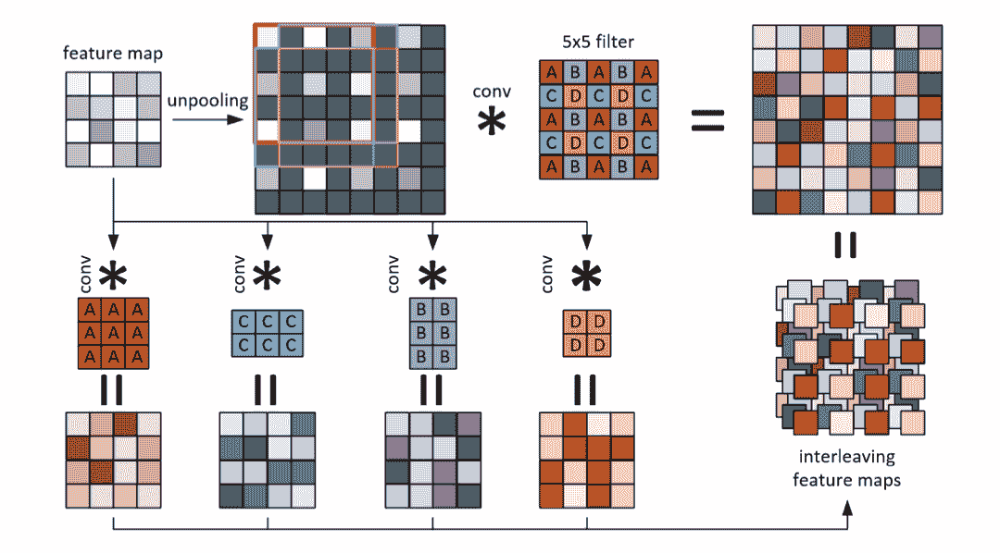
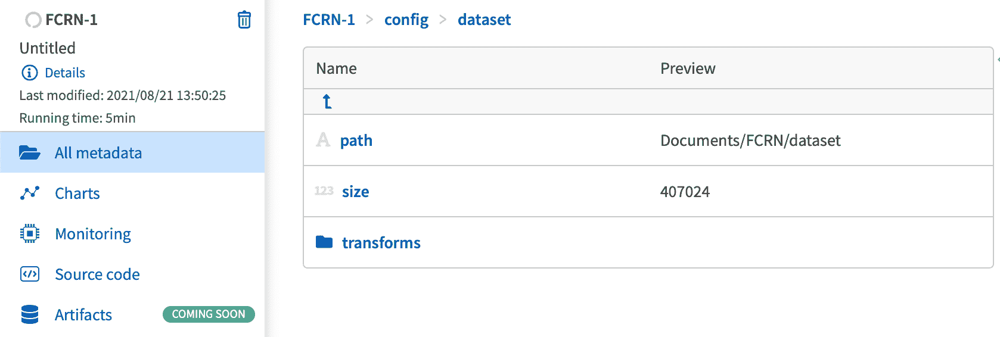
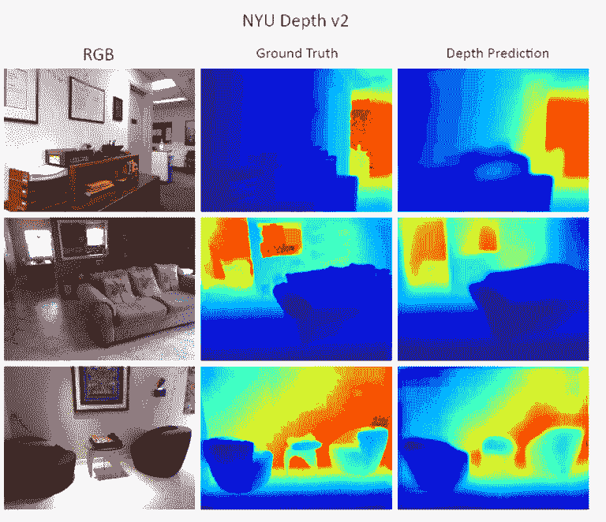

# 具有全卷积残差网络的深度估计模型(FCRN)

> 原文：<https://web.archive.org/web/https://neptune.ai/blog/depth-estimation-models-with-fully-convolutional-residual-networks-fcrn>

估计和评估 2D 场景的深度是一项困难的计算机视觉任务。首先，你需要昂贵的设备来绘制深度图。像用于视觉、运动和光投影的 3D 立体传感器这样的庞大系统是当今使用的最可靠的技术，它们依赖于需要额外评估以产生精确渲染的外部因素。

如果你不想为这一项任务携带和操作一大套设备，还有另一个解决方案。大量的工作已经投入到构建紧凑的系统中，这些系统统一并处理由设备的每一部分单独提供的所有相关功能。一个很好的例子是 [*考虑全光成像失真的光场相机*](https://web.archive.org/web/20221206054745/https://www.osapublishing.org/oe/fulltext.cfm?uri=oe-28-3-4156&id=426432) 。

深度估计具有广泛的用途，这就是在该领域进行大量研究的原因。深度估计的一些最公知的用途是:

*   3D 渲染和 3D 运动捕捉，
*   自动驾驶汽车，
*   机器人技术(包括机器人辅助手术)，
*   2D 和 3D 电影转换，
*   计算机图形和游戏产业中的 3D 渲染和阴影映射。

<https://web.archive.org/web/20221206054745im_/https://neptune.ai/wp-content/uploads/2022/11/Depth-estimation-rendering-video.gif.mp4>

**Depth estimation rendering for a video | Source: [Deep Learning approach to Depth prediction, Google AI](https://web.archive.org/web/20221206054745/https://ai.googleblog.com/2019/05/moving-camera-moving-people-deep.html)** 

## 同一目标的不同方法

最近，为深度估计设计了几种方法。深度学习再次证明了它解决问题和应对各种挑战的能力。该方法集中于单个视点(2D 图像),并优化参考深度图上的回归。

已经测试了多种神经架构，一些主要的实现为未来的研究铺平了道路，这使它们成为该领域中最先进的技术。让我们来看看其中的一些。

### 利用全卷积残差网络进行更深的深度预测

这种方法通过利用从 RGB 图像返回 2D 场景的深度图的完全卷积架构来解决这个问题。

所提出的架构包括全卷积层、转置卷积和有效的残差上采样块，有助于跟踪高维回归问题。

揭露该模型的研究论文解释了这种原始架构如何使用残差学习来处理[](https://web.archive.org/web/20221206054745/https://en.wikipedia.org/wiki/Monocular_vision)*单目视觉和深度图之间的模糊映射。Huber 损失函数用于优化，并且该模型可以以 30 FPS 的稳定帧速率在图像和视频上运行。*

 *该网络由具有初始化的预训练权重的第一 ResNet50 块组成，并通过一系列卷积层和非卷积层前进，使网络学习其升级。然后，脱落图层被放置在生成预测结果的最终卷积图层旁边的末端。

关于整体架构的更多细节可以在官方研究论文中找到: [*使用全卷积残差网络的更深深度预测*](https://web.archive.org/web/20221206054745/https://arxiv.org/pdf/1606.00373v2.pdf) *。*

### 来自视频的深度和自我运动的无监督学习

这种特定的方法完全基于无监督的学习策略，将单视图深度 CNN(如之前所示)与在无标签视频序列上训练的相机姿势估计 CNN 相结合。

这种方法是独一无二的，也是同类方法中的首创。作者解释说，训练的整个监督管道是基于视图合成的。粗略地解释，网络被馈送以目标视图，并输出每像素深度图。给定每像素深度图以及来自原始图像的姿态和可见性附近视图，相应地合成目标视图。

因此，网络正确地管理使用 CNN 的图像合成和姿态估计模块之间的平衡。

*注:对于这种特定架构背后的理论的详细解释可以在 2017 年发表的原始研究论文中查阅到:* [*来自视频的深度和自我运动的无监督学习*](https://web.archive.org/web/20221206054745/https://arxiv.org/pdf/1704.07813v2.pdf) *。*

### 具有左右一致性的无监督单目深度估计

这种特定的架构是端到端的，并且在没有地面实况数据的情况下执行无监督的单目深度估计。如标题所示，该网络的训练损失加强了左右深度一致性，这意味着网络通过推断包裹左图像以匹配右图像的差异和差异来估计深度。

为网络提供动力的整个机制依赖于产生差异并在培训过程中不断纠正它们。通常，左输入图像用于推断从左到右和从右到左的差异。然后，网络使用双线性采样器通过反向映射生成预测的结果图像。

作者使用了与 [DispNet 非常相似的卷积架构。](https://web.archive.org/web/20221206054745/https://arxiv.org/pdf/1512.02134.pdf)它建立在编码器和解码器模式的基础上。解码器使用来自编码器激活模块的跳过连接来解析更高分辨率的细节。

最后，网络预测两个视差图:从左到右和从右到左。

## FCRN:完全卷积剩余网络

**FCRN** 是设备上深度预测最常用的模型之一。当苹果公司为其 iPhone 系列的前置摄像头实现并集成深度传感器时，这种架构变得很有名。由于该模型基于 CNN (ResNet-50)，移动部署的压缩和量化过程相对简单明了。

我们将讨论 **FCRN** 架构的一些重要组件和构建模块，并一瞥 Pytorch 中的实际实现。

### 实施和构建模块

有趣的是，整个 **FCRN** 架构受到了 U-Net 方案的高度启发。两者都使用固定滤波器 3×3 的三个下采样和三个上采样卷积块。最初，U-Net 在每个块中有两个卷积层，所有卷积层的滤波器数量保持不变。

相反，在 FCRN 实现中，作者增加了后续层的数量，以补偿由池化引起的高分辨率信息的损失。



*Faster up-Convolutions. Illustration of what we’ve explained above. The common up-convolutional steps: unpooling doubles a fea- ture map’s size, filling the holes with zeros, and a 5 × 5 convolution filters this map | Source: [official research paper](https://web.archive.org/web/20221206054745/https://arxiv.org/pdf/1606.00373.pdf)*

首先，让我们看一下 **FRCN** 网络的基本部分，即卷积块，由卷积层、批量归一化和激活函数组成。

```py
def conv_block(channels: Tuple[int, int],
               size: Tuple[int, int],
               stride: Tuple[int, int]=(1, 1),
               N: int=1):
    """
    Create a block with N convolutional layers with ReLU activation function.
    The first layer is IN x OUT, and all others - OUT x OUT.
    Args:
        channels: (IN, OUT) - no. of input and output channels
        size: kernel size (fixed for all convolution in a block)
        stride: stride (fixed for all convolution in a block)
        N: no. of convolutional layers
    Returns:
        A sequential container of N convolutional layers.
    """

    block = lambda in_channels: nn.Sequential(
        nn.Conv2d(in_channels=in_channels,
                  out_channels=channels[1],
                  kernel_size=size,
                  stride=stride,
                  bias=False,
                  padding=(size[0] // 2, size[1] // 2)),
        nn.BatchNorm2d(num_features=channels[1]),
        nn.ReLU()
    )

    return nn.Sequential(*[block(channels[bool(i)]) for i in range(N)])
```

conv _ 块函数具有***【N】***个卷积层，具有 ***个*** 个滤波器，遵循 ReLU 激活和批量归一化。

整个 FCRN 架构可以通过将专门定义的块堆叠在一起而获得，例如上采样块、解转换块、上转换解码器和 FasterUpConv 解码器，这些是 pixelshuffle 的特定技术。

我不能详细说明每个模块实际上是如何实现的，因为它的理论和实用性是如此的密集，以至于仅仅介绍和解释它们的功能就需要一整篇文章。但是，总体框架可以描述如下:

```py
self.model = nn.Sequential(

    conv_block(channels=(input_filters, 32), size=(3, 3), N=N),
    nn.MaxPool2d(2),

    conv_block(channels=(32, 64), size=(3, 3), N=N),
    nn.MaxPool2d(2),

    conv_block(channels=(64, 128), size=(3, 3), N=N),
    nn.MaxPool2d(2),

    DeConv(channels=(128, 512), size=(3, 3), N=N),

    nn.Upsample(scale_factor=2),
    UpConv(channels=(512, 128), size=(3, 3), N=N),

    nn.Upsample(scale_factor=2),
    FasterUpConv(channels=(128, 64), size=(3, 3), N=N),

    nn.Upsample(scale_factor=2),
    conv_block(channels=(64, 1), size=(3, 3), N=N),
)
```

DeConv 和 UpConv 由 4 个卷积块模块组成，通道数量逐渐减少，特征映射尺寸逐渐增大。它们在 Pytorch 中的实现如下所示:

```py
def convt(in_channels):
            stride = 2
            padding = (kernel_size - 1) // 2
            output_padding = kernel_size % 2
            assert -2 - 2 * padding + kernel_size + output_padding == 0, "deconv parameters incorrect"

            module_name = "deconv{}".format(kernel_size)
            return nn.Sequential(collections.OrderedDict([
                (module_name, nn.ConvTranspose2d(in_channels, in_channels // 2, kernel_size,
                                                 stride, padding, output_padding, bias=False)),
                ('batchnorm', nn.BatchNorm2d(in_channels // 2)),
                ('relu', nn.ReLU(inplace=True)),
            ]))

        self.layer1 = convt(in_channels)
        self.layer2 = convt(in_channels // 2)
        self.layer3 = convt(in_channels // (2 ** 2))
        self.layer4 = convt(in_channels // (2 ** 3))
```

```py
class UpConv(Decoder):
    def upconv_module(self, in_channels):

        upconv = nn.Sequential(collections.OrderedDict([
            ('unpool', Unpool(in_channels)),
            ('conv', nn.Conv2d(in_channels, in_channels // 2, kernel_size=5, stride=1, padding=2, bias=False)),
            ('batchnorm', nn.BatchNorm2d(in_channels // 2)),
            ('relu', nn.ReLU()),
        ]))
        return upconv

    def __init__(self, in_channels):
        super(UpConv, self).__init__()
        self.layer1 = self.upconv_module(in_channels)
        self.layer2 = self.upconv_module(in_channels // 2)
        self.layer3 = self.upconv_module(in_channels // 4)
        self.layer4 = self.upconv_module(in_channels // 8)
```

如果你对整个基础设施感兴趣和好奇，有一个很好的 Github repo，它用 ResNet-50 实现了 FCRN 架构，并且完全遵循了研究论文的指示: [FCRN Pytorch 实现](https://web.archive.org/web/20221206054745/https://github.com/dontLoveBugs/FCRN_pytorch)。

### NYU 深度 V2 数据集上的训练

该数据集由来自分割的元素组成，并支持来自 RGBD ( ***、RGB 和深度*** )图像的推断。它包含来自 Microsoft Kinect 的 RGB 和深度相机记录的各种 3D 场景的视频序列。

链接: [NYU 深度数据集 V2](https://web.archive.org/web/20221206054745/https://cs.nyu.edu/~silberman/datasets/nyu_depth_v2.html)

基本上，它的特点是:

*   1449 个密集标记的对齐 RGB 和深度图像对
*   来自 3 个城市的 464 个新场景
*   407024 新的无标签帧

数据集包含多种类型的数据:

*   用伴随着密集多类标签的视频数据子集来标记。
*   由微软 kinect 摄像头提供的原始 RGB、深度和加速度计数据。

为了开始调试模型，我们将依赖一个使用 Pytorch 的开源 Github 实现。实施是由[王鸽翔](https://web.archive.org/web/20221206054745/https://github.com/dontLoveBugs)(大喊着他出来的！)，他提供了一个完全用 Pytorch 制作的替代版本，仔细遵循了关于模型架构和训练过程的官方文件指示。

**用谢恩自己的话说** : *这是 PyTorch 利用全卷积残差网络实现的更深深度预测。它可以使用全卷积残差网络来实现单目深度预测。目前，我们可以使用 NYUDepthv2 和 Kitti 里程计数据集训练 FCRN。*

#### 安装指南

*   克隆 repo: git 克隆 git @ github . com:dontLoveBugs/FCRN _ pyo trch . git
*   安装所需的依赖项:pip 安装 matplotlib pillow tensorboard x torch torch vision

#### 在 dataloaders 文件夹中配置数据集路径

下载 NYU 深度 V2 数据集，标注版本约为 2.8GB】此处下载。

让我们定义 nyu_dataloader 类，它从根目录加载数据集，并执行数据转换和数据扩充。

```py
height, width = 480, 640
class NYUDataset(Dataloader):
    def __init__(self, root, type, sparsifier=None, modality='rgb'):
        super(NYUDataset, self).__init__(root, type, sparsifier, modality)
        self.output_size = (228, 304)

    def train_transform(self, rgb, depth):
        s = np.random.uniform(1.0, 1.5)  
        depth_np = depth / s
        angle = np.random.uniform(-5.0, 5.0)  
        do_flip = np.random.uniform(0.0, 1.0) < 0.5  

        transform = transforms.Compose([
            transforms.Resize(250.0 / height),  
            transforms.Rotate(angle),
            transforms.Resize(s),
            transforms.CenterCrop(self.output_size),
            transforms.HorizontalFlip(do_flip)
        ])
        rgb_np = transform(rgb)
        rgb_np = self.color_jitter(rgb_np)  
        rgb_np = np.asfarray(rgb_np, dtype='float') / 255
        depth_np = transform(depth_np)

        return rgb_np, depth_np
```

我们还在 Neptune 实验中记录了所有这些信息，以便跟踪数据集目录和应用的转换。

开始你的实验:

```py
run = neptune.init(project='aymane.hachcham/FCRN, api_token='ANONYMOUS') # your credentials
```

```py
run['config/dataset/path'] = 'Documents/FCRN/dataset'
run['config/dataset/size'] = 407024
run['config/dataset/transforms'] = {
    'train': transforms.Compose([
            transforms.Rotate(angle),
            transforms.Resize(int(250 / height)),
            transforms.CenterCrop((228, 304)),
            transforms.RandomHorizontalFlip(p=0.5)
        ])
}
```



*Neptune dataset configurations*

在开始培训之前，让我们记录我们想要使用的模型的超参数。

```py
hparams = {
    'batch_size': 128,
    'decoder':'upproj',
    'epochs':10,
    'lr':0.01,
    'lr_patience':2,
    'manual_seed':1,
    'momentum':0.9,
    'print_freq':10,
    'resume':None,
    'weight_decay':0.0005,
    'workers':0
}
run["params"] = hparams
```

在记录了所有需要的超参数后，我们将启动 epochs 的培训课程。我们将把损失和所有指标记录到 Neptune，以跟踪进度。

```py
def train(train_loader, model, criterion, optimizer, epoch, logger):
    average_meter = AverageMeter()
    model.train()  
    end = time.time()

    batch_num = len(train_loader)

    for i, (input, target) in enumerate(train_loader):

        input, target = input.cuda(), target.cuda()
        torch.cuda.synchronize()
        data_time = time.time() - end

        end = time.time()

        pred = model(input)
        loss = criterion(pred, target)
        optimizer.zero_grad()
        loss.backward()  
        optimizer.step()
        torch.cuda.synchronize()
        gpu_time = time.time() - end

        result = Result()
        result.evaluate(pred.data, target.data)
        acc = result.evaluate(pred.data/target.data)
        average_meter.update(result, gpu_time, data_time, input.size(0))
        end = time.time()

        run["training/batch/accuracy"].log(acc)
        run["training/batch/loss"].log(loss)

        if (i + 1) % args.print_freq == 0:
            current_step = epoch * batch_num + i
            logger.add_scalar('Train/RMSE', result.rmse, current_step)
            logger.add_scalar('Train/rml', result.absrel, current_step)
            logger.add_scalar('Train/Log10', result.lg10, current_step)
            logger.add_scalar('Train/Delta1', result.delta1, current_step)
            logger.add_scalar('Train/Delta2', result.delta2, current_step)
            logger.add_scalar('Train/Delta3', result.delta3, current_step)
```

### Neptune 中的精度和损耗设置

对于训练会话，我们清楚地观察到这两个指标运行良好，除了由数据插值引起的精度曲线的线性下降，其中上卷积层丢失深度信息，并被连续实时呈现的索引矩阵的比例淹没。

即使我们执行新的训练课程，改变历元数或稍微调整训练数据，变化也不会很大。

通过增加历元的数量和减少数据转换的数量，我们在准确度分数上获得了轻微的提高，并且还消除了由数据插值引起的差异。

一个很酷的提示 Shan 建议在训练时使用较低的历元数(< 100) is to decrease the ***学习率*** 并增加 ***速率 _ 优化器*** )。这样，梯度计算得更慢，反向计算更同步，从而为模型留出相应的适应空间。

因此，新运行的新超参数如下所示:

```py
hparams = {
    'batch_size': 128,
    'decoder':'upproj',
    'epochs':10,
    'lr':0.002,
    'lr_patience': 2.5,
    'manual_seed':1,
    'momentum':0.9,
    'print_freq':10,
    'resume':None,
    'weight_decay':0.0005,
    'workers':0
}
```

这是两次运行之间的比较:

[](https://web.archive.org/web/20221206054745/https://app.neptune.ai/aymane.hachcham/FCRN/experiments?compare=EwGgjEA&split=cmp&dash=charts&viewId=standard-view)

*Blue chart: previous accuracy, Red chart: the improved one | [See in the app](https://web.archive.org/web/20221206054745/https://app.neptune.ai/aymane.hachcham/FCRN/experiments?compare=EwGgjEA&split=cmp&dash=charts&viewId=standard-view)*

我们清楚地注意到，超参数调整和选择 30 个周期的长时间训练极大地提高了准确度标准。

我会把海王星项目的链接留给你。快来看看吧: [*FCRN 实验*](https://web.archive.org/web/20221206054745/https://app.neptune.ai/aymane.hachcham/FCRN/experiments?split=tbl&dash=charts&viewId=standard-view)

## 最终输出

一旦执行了训练，我们可以看看由模型基于来自验证集的看不见的室内图像生成的结果深度图。

为了加强和断言关于模型结果的确定性，Github repo 展示了我们在这里使用的相同模型的预训练版本，其中包含一系列令人满意的断言模型推理质量的指标。

### 结果

在成功完成训练后，作者给出了一些与错误相关的度量，以便评估他的实现与以前的实现相比的性能。

显然，他用 Pytorch 的实现通过略微改进定义为基于地面真实深度图值归一化的绝对误差的***【rel】***(相对绝对误差)，以及***log10***(ABS(log10(gt)–log10(pred))(其中 gt 是地面真实深度图，pred 是预测深度图)，击败了先前的尝试。

### 定性结果



*RGB images from validation set, their ground truth and final results generated by the model *

正如在官方论文中所解释的那样，全卷积残差网络提高了精度，这要归功于其使用增强型上投影模块和上采样技术的特定架构，上采样技术涉及使用连续 2×2 内核的去卷积。定性地说，与相同数据集上的其他不同的完全卷积变体相比，这种方法在输出中保留了更多的结构。

## 结论和展望

我们浏览了深度估计领域中使用的各种技术和架构。我们实践和训练了 FCRN 的一个现有实现，以展示和观察这种方法在定性结果方面的能力。

您可能想尝试的一个有趣的项目是实现 FCRN 模型的设备版本，并创建一个实时执行深度估计的小型 IOS 应用程序。MLCore 和 Apple Vision 已经提出了预训练 FCRN 模型的不同变体，这些模型可以快速用于涉及前置摄像头和深度传感器的任务。也许我可以在下一篇关于这个主题的文章中考虑这个问题。敬请期待！

一如既往，我将为您留下一些有用的资源，您可以查找关于该主题的深入知识:*