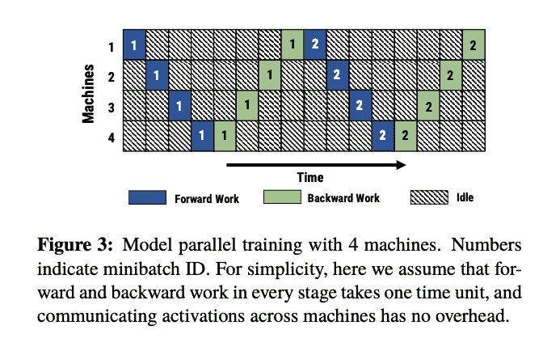
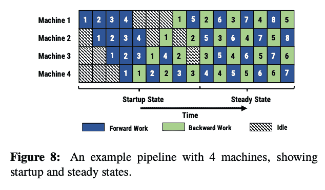

# 分布式培训:要避免的错误

> 原文：<https://web.archive.org/web/https://neptune.ai/blog/distributed-training-errors>

在这个大型语言模型(LLM)、整体基础模型和日益庞大的数据集的时代，[分布式训练](/web/20230307202531/https://neptune.ai/blog/distributed-training)是必须的，因为数据和模型权重很少适合单台机器。然而，ML 中的分布式训练是复杂且容易出错的，有许多隐藏的陷阱，会在模型训练过程中引起巨大的问题。幸运的是，机器学习框架，如 PyTorch 分布式数据并行和 Ray，已经抽象出了许多混乱的细节，但分布式训练仍然很有可能出错。

本文将触及**分布式模型训练中十个最常见的错误**，并对每个错误提出解决方案。

## 不是流水线

**问题**

在模型并行分布式训练设置中，每个阶段(除了正向训练中的第一阶段)都依赖于位于单独机器上的层的输出，反向训练也是如此，只是顺序相反。这可能不是最有效的方法。PipeDream 论文中的下图说明了这一点。该示意图中的所有灰色方框代表机器处于闲置状态且不执行任何有用功的时间单位。

*Model parallel distributed training setup with 4 machines | [Source](https://web.archive.org/web/20230307202531/https://arxiv.org/abs/1806.03377)*

**解决方案**

流水线背后的思想是通过让每台机器在将输出发送到下一台机器后立即在一个新的迷你批处理上开始计算来减少浪费的工作量。这意味着，在更新权重之前，将并行训练多个小批量，这可能会影响算法的收敛性，但正如第一节中所讨论的，权重堆叠等技术可以减少这种影响。

在一定数量的小批量进入流水线进行训练后，流水线将达到所谓的*稳定状态*，在该状态下，所有机器在每个时间单位内都在工作。下图显示了流水线如何显著提高计算资源的利用率。显然，不流水线化会导致利用不足和更长的分布式训练时间。

*An example distributed* *pipeline with 4 machines | [Source](https://web.archive.org/web/20230307202531/https://arxiv.org/abs/1806.03377)*

## 不平衡的管道阶段

**问题**

基于对流水线的讨论，确保你的流水线是*平衡的*很重要。这些图表是在作出天真的假设之前显示的，假设每台机器在完全相同的时间内对一批数据执行其模型分区的向前/向后传递。实际上，这种情况从来不会发生，因此会有一段短暂的时间，要么一台机器处于空闲状态，等待来自前一台机器的下一个微批处理，要么比其他机器花费更长的时间来执行其计算，从而降低流水线的速度。

**解决方案**

理想情况下，您应该构建您的管道，使每台机器尽可能执行相同的计算量。这意味着确定数据通过模型中不同层所需的时间，确定每个模型分区向前和向后传播所需的时间，并确保小批量数据的大小大致相等。这对于优化管道效率至关重要。

## 重量陈旧

**问题**

*权重陈旧*用于描述深度学习模型流水线训练中出现的一种现象。当模型训练在多台机器上流水线化时，在对数据进行正向计算的时间和基于该计算的梯度被反向传播以更新模型权重的时间之间会发生延迟。实际上，在一些训练步骤之后，使用比通过管道向后传递的梯度老一定数量周期的权重来计算模型正向预测。这种延迟被称为“重量老化”。。

**解决方案**

有几种方法可以解决体重老化的问题。第一种是通过在每一定数量的步骤后相互传递梯度来简单地同步机器。这限制了权重变得陈旧的程度。然而，它降低了硬件效率，因为同步机器导致某些机器必须等待其他机器到达相同的状态。所以对于减少训练时间并不理想。

或者，在一个名为*[*Pipe*Dream](https://web.archive.org/web/20230307202531/https://arxiv.org/pdf/1806.03377.pdf)的方法中，研究人员引入了一种称为重量存储的技术，其中一个系统“维护模型重量的多个版本，每个迷你批次一个”。？每次向前传递完成后，系统可以将模型的重量存储为与该微型批次相关的状态的一部分。当到了反向传播的时候，与该小批相关联的权重被从存储中检索并用于梯度计算。这确保了在流水线级内的单个数据小批上的前向和后向传递使用相同版本的权重，并且改善了统计收敛。*

 *## 需要数据并行时使用模型并行(反之亦然)

**问题**

分布式训练的两种主要范式是*模型并行*和*数据并行*。在模型并行中，大型模型分布在多台机器上。例如，您可以将模型的第 1-4 层放在机器 1 上，第 5-8 层放在机器 2 上，第 9-12 层放在机器 3 上，依此类推。这种训练模式正变得越来越普遍，因为大型语言模型，如具有数十亿模型参数的 GPT-3，开始超过可以在商用硬件上存储完整模型的大小。在训练期间，数据和梯度在机器之间进行通信。

相反，在数据并行范例中，完整的模型存储在每台机器上，但是每台机器被分配来仅在完整数据集的子集上训练该模型。当您的完整数据集不适合一台机器时，或者如果您有多台机器都适合您的单一模型并希望减少您的训练时间，这将非常有用。模型权重和梯度在训练期间被传达。还存在混合模式类型的训练，其中数据和模型并行被串联使用以获得两个世界的最佳效果。

**解决方案**

显然，选择模型或数据并行对于使正确的培训方法适合您的环境是很重要的。如果您正在训练一个无法在单台机器上安装的非常大的模型，您将需要选择一个并行模型。如果您有一个非常大的训练集，可以很容易地跨计算机进行分区，请选择数据并行。最后，如果您的模型和数据集都太大而无法在一台机器上运行，您应该考虑使用混合模式的训练范例。

## 机器之间的驱动程序和库不一致

**问题**

在理想情况下，分布式训练脚本可以在同类机器上完美运行，但现实并非如此。当机器被设置为使用不兼容版本的硬件、驱动程序和库时，经常会出现意外错误。例如，如果您的分布式训练机器学习脚本是使用 PyTorch 实现的，那么您应该确保每台机器都安装了相同版本的 PyTorch。类似地，您可能希望每台机器都使用 CUDA 的兼容版本，尽管这并不是一个严格的要求，因为大多数分布式培训库都能够与不同的 CUDA 版本进行接口。

**解决方案**

在所有机器上标准化您的培训环境的一个简单方法是使用一个[容器化解决方案，例如 Docker](/web/20230307202531/https://neptune.ai/blog/best-practices-docker-for-machine-learning) 。Docker 将您的分布式培训脚本与运行它所需的所有操作系统定义、库、工具和文件打包在一起。容器也是轻量级的，这意味着一旦构建了容器映像，运行它们就不需要太多的开销。使用容器或类似的虚拟化解决方案，您可以确保您的运行时环境在不同的机器上是一致的，并避免许多可能来自软件设置不兼容的麻烦和摩擦。

## 使用错误类型的 SGD

大多数机器学习模型使用优化算法进行训练，通常是随机梯度下降的某种变体。在分布式设置中，有两种主要的方法来制定 SGD，*同步*或*异步*。

**问题**

在同步 SGD 中，每台机器一前一后地执行其权重更新。这意味着每台机器计算其数据部分的梯度，将它们传输到其他机器，然后等待所有其他机器发送它们的梯度。只有在从所有其他机器接收到梯度之后，每台机器才执行其反向传播并更新其权重。这样，每台机器上的重量保持同步，防止重量过时。然而，这样做需要在每个小批量训练结束时强加一个硬屏障，这会导致速度变慢，特别是如果有一些落后的机器比其他机器花费更长的时间来执行它们的计算。

**解决方案**

实际上，异步 SGD 对于分布式培训来说是一个非常好的选择。也许最著名的异步 SGD 是 [HogWild](https://web.archive.org/web/20230307202531/https://people.eecs.berkeley.edu/~brecht/papers/hogwildTR.pdf) ，它表明 SGD 可以并行运行，没有锁，并且对算法收敛没有太大影响。异步 SGD 允许重量更新继续进行，而无需每台机器等待另一台机器发送梯度。实际上，这意味着仅使用部分信息进行权重更新，因为每台机器只能访问从其训练数据子集导出的梯度。然而，在实践中，可以使用简单的策略来确保算法仍然收敛。

## **网络问题、防火墙、端口和通信错误**

**问题#1**

计算机之间的通信，尤其是通过网络的*通信，是分布式训练的核心。当然，网络通信也带来了许多潜在的问题，如丢包、网络攻击等。*

分布式训练脚本的核心是被称为*等级*的机器的枚举。机器的等级是它在模型训练过程中涉及的所有机器的序列中的编号。通常，一台机器被分配等级 0，并负责处理其他机器之间的通信协调、发送数据和梯度的聚合等。其他机器通过网络将数据和梯度传递给等级不同的所有其他机器。如果某些事情没有处理好，这很容易出错。

**解决方案**

当向不同级别的机器发送数据时，一个进程必须指定 IP 地址和端口号，通过这些地址和端口号来传输该信息。本规范中的任何错误都将明显导致培训过程中的失败。类似地，如果防火墙或其他网络配置设置阻止指定端口上的通信，那么接收机器将永远无法获得必要的数据。因此，确保网络被正确配置并且在训练脚本中被正确指定是运行分布式训练机器学习设置的先决条件。

**问题二**

NCCL 和 Gloo 是 PyTorch 分布式包使用的两个库，用于在分布式训练期间在机器之间传递数据和模型参数。机器之间定期共享重量和数据对于完全训练功能模型至关重要。不幸的是，当在分布式环境中工作时，单机故障是常见的，并且经常在没有任何明显原因的情况下发生。例如，一台(或多台)机器可能会耗尽 RAM，其硬盘可能会自动出现故障，或者可能会受到网络或电源中断的影响。

在这些情况下，当另一台机器试图从故障机器接收数据时，NCCL 或 GLOO 可能会显示神秘的错误消息。这些错误是如此普遍和令人困惑，以至于 Github 的整个问题都致力于解决它们。

**解决方案**

有一些参数设置可以帮助提高错误的可读性(例如，设置 NCCL _ 调试=警告)，但无论如何，这并不能完全解决问题。

不幸的是，这类问题是分布式系统编程的一部分。用于解决这类错误的分布式培训最佳实践包括在培训期间进行频繁备份(定期保存模型权重的快照)、编写可用于追踪错误来源的详细日志，以及确保硬件得到良好维护(在当前的云计算时代，这不是什么问题)。

## 慢速数据传输

**问题**

RPC 或远程过程调用是跨网络通信的基本元素。在分布式训练 ML 设置中，当在网络上运行[强化学习](/web/20230307202531/https://neptune.ai/blog/category/reinforcement-learning)代理时，可能会产生[RPC。类似地，当在机器之间发送梯度和层输出时，进行网络传输。一般来说，您希望尽可能避免创建 RPC 或通过网络发送它们，因为网络通信可能会很慢且成本很高，尤其是在您有大量数据要传输的情况下。许多分布式训练错误也源于网络问题，因此减少对网络的依赖也可以减少遇到的错误数量。当然，你不能完全避免使用网络，但要注意不要轻率地使用网络。](https://web.archive.org/web/20230307202531/https://pytorch.org/tutorials/intermediate/rpc_tutorial.html)

**解决方案**

在您绝对需要在机器之间传输数据的情况下，您可以做许多事情来加速这个过程。首先，您可以使用专用硬件来促进网络传输。这可以包括使用通过高速互连连接的工作机，以及使用 Nvlink 在 Nvidia GPUs 之间传输数据。

您还可以降低传输的渐变的浮点精度，以减少传输的数据量。从 fp32 到 fp16 甚至 fp8 会对速度产生重大影响。但是要小心，它也会影响算法的收敛，所以要明智地使用它！

最后，一旦计算出梯度的子集(即发送单个层的梯度),就可以传输它们，同时在后续层上执行反向传播。将数据传输与反向传播重叠是另一种形式的流水线操作，可以确保网络得到更有效的利用。这可以加快整体梯度传输时间，并防止网络饱和。

## 日志记录不足

**问题**

当在分布式设置中训练时，记录数据对于调试尤其重要。因为在分布式训练设置中有如此多的潜在故障点，所以在训练过程中的多个阶段应该小心地写详细的日志，以便当错误确实发生时，它们可以被定位并容易地追溯到源头。特别是，应该记录所有主要的分布式操作，例如当数据在机器之间通信时，当执行重量更新时，等等。最后，日志应该是可搜索的和容易访问的。做所有这些确保了当分布式训练错误发生时，可以容易地追溯到源头，并且可以最小化系统的停机时间。

**解决方案**

MLOps 工具，比如 [neptune.ai](https://web.archive.org/web/20230307202531/https://docs.neptune.ai/usage/distributed_computing/) ，可以让你自动记录所有相关的元数据，比如指标、参数、学习率和分布式训练设置中的变量。由于灵活的元数据结构，您可以登录到四个不同的对象:运行、模型、模型版本和项目，并根据需要组织元数据。

你可以稍后查看你在 [Neptune web 应用](https://web.archive.org/web/20230307202531/https://docs.neptune.ai/about/app/)中记录的所有内容，例如，在仪表板中，如下图所示。

查看本教程，了解如何使用 Neptune 跟踪[分布式培训工作。它包括:](https://web.archive.org/web/20230307202531/https://docs.neptune.ai/tutorials/running_distributed_training/)

*   跟踪单节点多 GPU 作业
*   跟踪多节点 DDP 作业

您还可以查看关于使用带有流水线库的 Neptune 的[文档。](https://web.archive.org/web/20230307202531/https://docs.neptune.ai/usage/pipelines/)

云计算超支

## **问题**

分布式培训通常涉及使用云提供商，如 AWS 或 GCP。如果你不小心，使用这些云服务很容易每月产生数百甚至数千美元的账单。

**解决方案**

为了降低成本，你可以做的第一件事就是使用 *spot* 或*可抢占*实例。简而言之，这些例子通常要便宜得多，因为你考虑到了你的工作在培训期间被抢占或中断的可能性。如果您确实使用了 spot 实例，那么定期检查您的训练或者使用诸如 Elastic Horovod 之类的容错解决方案以防您的实例在训练过程中关闭是非常重要的。

同样重要的是，不要选择超出您需要的计算资源。例如，如果您为每个实例分配一个 64GB 的 GPU，这可能是多余的，因为您已经在分布式设置中工作了。使用更少的资源使用更多的实例可能比使用两到三个使用非常昂贵的 GPU 的大型实例更便宜。事先执行这种成本效益分析可以缩短您的培训时间，并降低与您想要的云提供商一起完成培训所需的成本。

结论和要点

## 分布式模型训练具有挑战性，并且涉及到管理各种各样的错误。虽然有些错误是不可避免的，但最好避免在分布式环境中训练时出现的陷阱和常见的机器学习陷阱。

与流水线相关的问题，例如不平衡的阶段或模型或数据并行的不正确选择，或者根本没有流水线，可以否定分布式训练的优势。类似地，网络相关的问题也会出现，当生成太多的 RPC，以及不正确地配置防火墙或 IP 地址时，培训会大大减慢速度。同时，其他问题，如权重过时或选择错误类型的分布式 SGD 会对算法收敛性产生负面影响。

通过避免这些常见的分布式训练错误，您可以确保通过利用分布式训练的力量，朝着训练非常大和复杂的机器学习模型的正确方向开始。

参考

### [https://arxiv.org/pdf/1806.03377.pdf](https://web.archive.org/web/20230307202531/https://arxiv.org/pdf/1806.03377.pdf)

1.  [https://towards data science . com/a-guide-to-highly-distributed-dnn-training-9e 4814 FB 8 BD 3](https://web.archive.org/web/20230307202531/https://towardsdatascience.com/a-guide-to-highly-distributed-dnn-training-9e4814fb8bd3)
2.  [https://towardsdatascience.com/a-guide-to-highly-distributed-dnn-training-9e4814fb8bd3](https://web.archive.org/web/20230307202531/https://towardsdatascience.com/a-guide-to-highly-distributed-dnn-training-9e4814fb8bd3)*