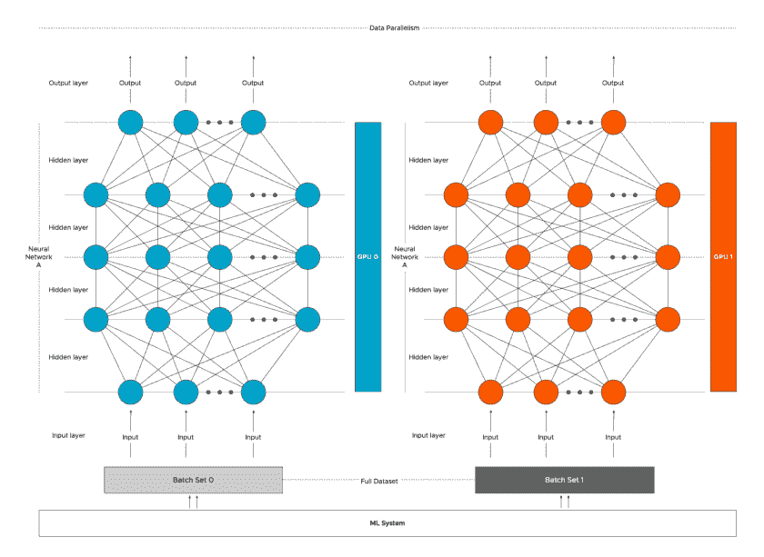
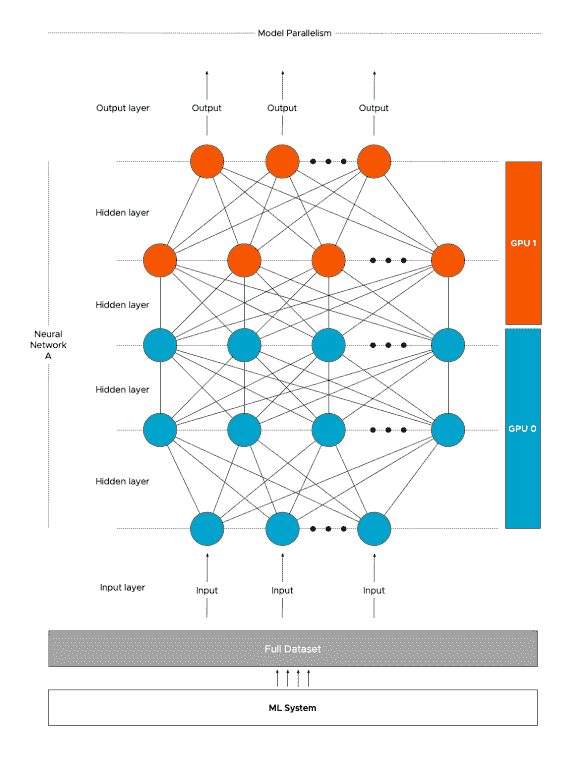
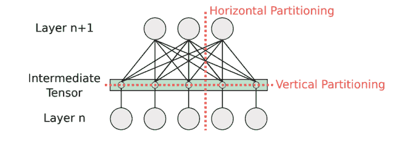
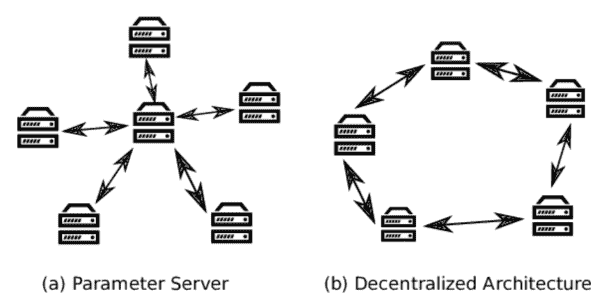

# 分布式培训:数据科学家指南

> 原文：<https://web.archive.org/web/https://neptune.ai/blog/distributed-training>

你有没有想过，拥有数百万到数十亿参数的复杂模型是如何在万亿字节的数据上训练出来的？事实上，这种模型的大小可以变得如此之大，以至于它们甚至不适合单个处理器的存储器。因此，通过传统方式训练这样的模型变得不可能，我们需要其他东西来支持这样的内存密集型任务。**分布式培训**是这个问题的解决方案之一，让我们来看看它到底是什么，以及如何用它来解决这些问题。

## 什么是分布式培训？

通常，当面对任何领域的巨大任务时，我们会尝试将它分成子任务并并行运行。这节省了我们的时间，并使这样一个复杂的任务成为可能。当我们在[深度学习](/web/20230307085656/https://neptune.ai/blog/debugging-deep-learning-model-training)中做同样的事情时，我们称之为[分布式训练](https://web.archive.org/web/20230307085656/https://towardsdatascience.com/how-to-train-your-deep-learning-models-in-a-distributed-fashion-43a6f53f0484)。

准确地说，在分布式训练中，我们在训练一个巨大的深度学习模型的同时，将训练工作量划分到多个处理器上。这些处理器被称为工作者节点或简称为工作者。这些工人同时接受培训，以加快培训过程。原则上，有两种实现并行的方法——数据并行和模型并行。

## 数据并行性

顾名思义，在这种方法中:

1.  我们将数据分成 n 个分区，其中 n 是计算集群中可用工作线程的总数。
2.  我们在每个工作者节点中都有一个模型的副本，并且每个工作者节点都在自己的数据子集上执行训练。
3.  训练循环同步或异步进行。

**Distributed training explanation:* data parallelism | [Sou](https://web.archive.org/web/20230307085656/https://frankdenneman.nl/2020/02/19/multi-gpu-and-distributed-deep-learning/)[rce](https://web.archive.org/web/20230307085656/https://frankdenneman.nl/2020/02/19/multi-gpu-and-distributed-deep-learning/)*

让我们看看执行分布式训练循环的两种方式以及它们之间的区别。

### 同步训练

正如我们已经知道的，在数据并行中，我们将数据划分为多个分区，并将每个部分发送给一个工作器。每个工人都有一个完整的模型副本，并且只对部分数据进行训练。

1.  在同步训练中，所有工人同时开始向前传球，他们计算不同的输出和梯度。在这里，每个工人等待所有其他工人完成他们的训练循环，并计算他们各自的梯度。

2.  现在，在所有工作人员完成梯度计算后，他们开始相互通信，并使用 all-reduce 算法聚合梯度，我们将在前面讨论。

3.  在所有梯度被组合之后，这些更新的梯度的副本被发送给所有工人。

4.  现在，在使用 all-reduce 算法获得更新的梯度后，每个工人继续向后传递，并正常更新权重的本地副本。除非所有工人都不更新他们的重量，否则下一次向前传球不会开始，这就是为什么它被称为同步。

值得注意的是，所有工人都产生不同的梯度，因为他们在不同的数据子集上接受训练，然而在任何时间点，所有工人都具有完全相同的权重。

#### 全归约算法

使用所有的 reduce 算法，所有的工人都必须分担存储和维护全局参数的负载。在该算法中，每个工作者与所有其他工作者共享其梯度，并应用归约操作。简而言之，all reduce 算法将所有工作线程中的目标数组缩减为一个数组，并将结果数组返回给所有工作线程。

all-reduce 算法有不同的实现，这些实现规定了如何计算和共享这些参数。

1.  在一个实施方式中，所有工作者将其梯度发送给被称为驱动工作者的单个工作者，该驱动工作者负责梯度的减少并将更新的梯度发送给所有工作者。但是这种方法的问题是，驱动程序成为瓶颈，因为它的通信和归约操作的应用随着进程数量的增加而增加，因此它不能很好地伸缩。

2.  因此，我们可以使用一种不太简单的方法，称为 [ring-all reduce](https://web.archive.org/web/20230307085656/https://towardsdatascience.com/visual-intuition-on-ring-allreduce-for-distributed-deep-learning-d1f34b4911da) ，其中工人被设置在一个环中。每个工作者负责某个参数子集，该子集只与环中的下一个工作者共享。该算法是一个有价值的工具，可以显著减少同步开销。

### 异步训练

正如您可能已经猜到的，在同步方法中，我们不能够有效地使用所有资源，因为一个工人必须等待其他工人才能前进。当所有工作机之间的计算能力存在显著差异时，这尤其是一个问题，在这种情况下，整个进程的速度仅与集群中最慢的工作机一样快。

因此，在异步培训中，我们希望工人以这样的方式独立工作，即工人不需要等待集群中的任何其他工人。实现这一点的一种方法是使用参数服务器。

#### 参数服务器

在分布式培训中，我们有一群工作人员，到目前为止，我们已经看到所有工作人员只执行一项任务，即培训。但是我们可以为每个工作者分配不同的角色，这样一些工作者充当参数服务器，其余的充当培训工作者。

参数服务器负责保存模型的参数，并负责更新模型的全局状态。而训练工人运行实际的训练循环，并从分配给他们的数据中产生梯度和损失。

我们可以将该过程总结为:

*   在我们所有的工人身上复制这个模型，每个工人使用一个子集的数据进行训练。
*   每个培训工作者从参数服务器获取参数。
*   每个训练工作者执行训练循环，并将梯度发送回所有参数服务器，然后这些服务器更新模型参数。

这允许我们独立地运行训练，但是仍然有一些缺点。

1.  一个缺点是，在任何特定的时间，只有一个工人在使用模型的更新版本，而其他人都在使用模型的旧版本。

2.  如果我们只是使用一个工作器作为参数服务器，这可能会成为大型集群的瓶颈，可能会成为单点故障。但是当然，通过引入多个并行服务器可以在一定程度上减少瓶颈问题。

## 模型并行性

到目前为止，我们已经了解了如何在具有不同数据块的多个设备中分发数据和训练模型，这种方法在大多数情况下都有效，并且易于实现。但是如前所述，在一些罕见的情况下，模型的大小对于任何单个工作者来说都可能太大，这就是为什么我们需要模型并行性。

*Distributed training explanation: model parallelism | [Source](https://web.archive.org/web/20230307085656/https://frankdenneman.nl/2020/02/19/multi-gpu-and-distributed-deep-learning/)*

在模型并行性(也称为网络并行性)中，模型被水平或垂直划分为不同的部分，这些部分可以在不同的工作器中并发运行，每个工作器运行相同的数据。在这里，工作人员只需要同步共享参数，通常每个向前或向后传播步骤同步一次。

*Distributed training explained: model parallelism is (network parallelism) is divided either horizontally or*
*vertically into different parts |* [*Source*](https://web.archive.org/web/20230307085656/https://arxiv.org/pdf/2007.03970.pdf)

在垂直划分中，层不受影响，因此，它可以应用于任何深度学习模型。因此，我们通常使用垂直分区方法，而水平分区只是在没有其他方法将一个层放入任何单个机器的内存中时才被认为是最后的手段。

可能有更简单的情况，我们可以使用模型并行，例如在编码器-解码器架构中，我们可以在不同的工人中训练编码器和解码器。模型并行最常见的用例可以在 [N](https://web.archive.org/web/20230307085656/https://neptune.ai/blog/natural-language-processing-with-hugging-face-and-transformers) [LP(自然语言处理)](/web/20230307085656/https://neptune.ai/blog/category/natural-language-processing)模型中找到，如[变形金刚](/web/20230307085656/https://neptune.ai/blog/comprehensive-guide-to-transformers)、【GPT-3】、[伯特](/web/20230307085656/https://neptune.ai/blog/bert-and-the-transformer-architecture-reshaping-the-ai-landscape)等。

## 集中和分散培训

在模型并行性和数据并行性方面，我们发现工作节点之间的通信非常重要，这样它们就可以共享模型参数。有两种交流方式，即集中培训和分散培训。在前面的章节中，我们实际上已经使用了这两种方法，但是现在让我们正式地了解它们。

在集中训练中，存在负责更新和存储模型参数的节点或节点组；这个节点称为参数服务器。我们已经看到了这种方法是如何在异步训练中使用的。我们也可以将这种方法用于同步培训，如[集中式同步系统](https://web.archive.org/web/20230307085656/https://arxiv.org/pdf/2007.03970.pdf)。在这些系统中，参数服务器依赖于来自所有工人的梯度输入来更新模型，并且训练不能进行，除非所有工人将梯度传递给参数服务器。此外，工人依赖参数服务器来获得更新的权重。如前所述，这种方法的缺点是参数服务器本身会成为大型集群的瓶颈。

在分散式通信模式中，每个节点与所有其他节点通信以更新参数。我们已经看到了这种方法如何适用于同步系统。这种方法的优点是没有单点故障，对等更新更快，并且可以通过仅交换已更改的内容来进行稀疏更新。我们也可以将这种方法用于被称为[分散异步系统的异步训练。](https://web.archive.org/web/20230307085656/https://arxiv.org/pdf/2007.03970.pdf)

*Distributed training explained: centralized synchronous systems | Source: Author*

## 为什么我们需要分布式培训？

当谈到深度学习时，它主要是关于优化线性代数，我们都知道它在计算上是昂贵的。当我们拥有大量训练数据时，问题就出现了，这些数据在深度学习中非常常见，在这种情况下，即使是在一台拥有强大加速器的机器上，训练也可能需要数月甚至数年的时间。

当我们试图解决涉及图像、音频或文本的复杂问题时，我们使用具有复杂架构的模型来获得更好的结果。在训练期间，这些模型可能会计算和存储数百万或数十亿个更新的体重参数，这可能会导致存储问题。此外，有时你的机器可能会在训练中崩溃，这将导致失去所有的进展，这是一个相当常见的问题，当训练期非常长，如前所述。

但是当我们转移到多台机器上时，我们可以利用线性代数是可并行化的这一事实，这使我们能够在多台机器上分割大型模型。我们还可以引入容错，这样即使我们的一台机器崩溃，训练过程也不会完全丢失，我们可以继续训练而不会有任何重大损失。

但是分布式训练在每种情况下都更好吗，即使我们有更简单的模型和更小的训练数据？不，由于并行化的开销，在分布式系统上训练它实际上可能比在单台机器上训练它花费更多的时间。

## 分布式培训的优势

基本上，在分布式训练中，我们在分布式系统上训练我们的模型，并且在分布式系统上训练模型具有如下所列的几个好处:

1.  **容错和可靠性**

从本质上讲，分布式系统比单机更能容忍故障。如果一家公司有一个跨两个数据中心的 8 机集群，即使其中一个数据中心出现故障，它也可以继续工作，不会出现任何问题。这相当于增加了可靠性，因为当一台计算机出现故障时，其他所有计算机都会随之出现故障。但是，即使一个或多个节点或数据中心出现故障，分布式系统也能保持运行。

2.  **效率**

分布式系统允许将复杂的问题分解成较小的块，并在许多计算机上并行处理，从而减少了解决这些问题所需的时间。

3.  **可扩展性**

分布式系统自然是可伸缩的，因为它们运行在几台机器上。因此，用户可以安装另一台机器来处理不断增加的负载，而不是重复更新单个系统。当一个系统承受很大的压力时，每台机器都能以最大能力运行，当负担较轻时，可以关闭一些机器。我们可以说用户的扩展能力实际上是无限的。

4.  **成本效益**

与一些大型的集中式系统相比，分布式系统更具成本效益。它们的初始成本高于独立系统，但是在某个点之后，它们变得更经济。

## 分布式培训框架

这里有一些 Python 框架，允许我们分发和并行化深度学习模型。

### 1.霍罗沃德

[Horovod](https://web.archive.org/web/20230307085656/https://horovod.readthedocs.io/en/stable/) 是一个面向 TensorFlow、Keras、PyTorch 的分布式深度学习训练框架。它是由优步开发的，Horovod 的目标是让分布式深度学习变得快速而简单。使用 Horovod 为 scale 开发的训练脚本可以在单个 GPU 或多个 GPU 上运行，而无需进一步更改代码。

您可以使用 Azure ML 轻松地为 Horovod 设置环境，Azure ML 为使用各种框架设置培训提供了精选的培训环境。

### 2.他们是

[Elephas](https://web.archive.org/web/20230307085656/https://github.com/maxpumperla/elephas) 是一个 Keras 插件，允许你使用 Spark 大规模执行分布式深度学习模型。Elephas 的目标是保持 Keras 的简单性和易用性，实现可以在大型数据集上操作的分布式模型的快速原型制作。

### 3.亚马逊 Sagemaker

数据并行和模型并行都得到[亚马逊 SageMaker 的](https://web.archive.org/web/20230307085656/https://docs.aws.amazon.com/sagemaker/latest/dg/distributed-training.html)分布式训练库的支持。这些库是为 SageMaker 培训环境量身定制的，帮助您将分布式培训作业适应 SageMaker，并提高培训速度和吞吐量。

SageMaker 中有 18 个流行的机器学习算法库。它们中的许多都是从底层完全重写的，以便可扩展和开箱即用。

### 4\. Tensorflow

TensorFlow 为分布式培训提供内置支持。通过[TF . distribute . strategy](https://web.archive.org/web/20230307085656/https://www.tensorflow.org/guide/distributed_training)API，只需很少的代码修改，就可以将训练分散到许多 GPU 上。这个 API 还能够通过 Azure ML 启动分布式作业。它易于使用，开箱即可提供良好的性能。因为它易于使用，所以吸引了各种各样的用户群，包括研究人员、机器学习工程师等等。

### 5\. PyTorch

Azure ML 支持使用 PyTorch 的原生分布式训练功能运行分布式作业。PyTorch 中的 [torch.distributed 包](https://web.archive.org/web/20230307085656/https://pytorch.org/tutorials/beginner/dist_overview.html)提供了分布式培训功能。该软件包中的功能分为三个主要部分:

*   [**分布式数据并行训练**](https://web.archive.org/web/20230307085656/https://pytorch.org/docs/stable/generated/torch.nn.parallel.DistributedDataParallel.html) : DDP 是单程序多数据训练范式。通过 DDP 在每个流程上复制模型，每个模型副本接收一组新的输入数据样本。为了保持模型副本同步，DDP 处理梯度通信，并将其与梯度计算重叠，以加速训练。
*   [**基于 RPC 的分布式训练**](https://web.archive.org/web/20230307085656/https://pytorch.org/docs/stable/rpc.html) : RPC 允许不适合数据并行训练的通用训练拓扑，如分布式管道并行、参数服务器范式、基于 DDP 的混合训练等。它有助于管理远程对象的生命周期，并将自动签名引擎扩展到机器范围之外。
*   [**集体通信**](https://web.archive.org/web/20230307085656/https://pytorch.org/docs/stable/distributed.html) :支持集团内跨进程发送张量，提供集体通信 API 和 P2P 通信 API。DDP 和 RPC APIs 可以处理许多分散的训练场景，所以开发人员不需要直接使用这个原始的通信 API。但是，在某些情况下，这个 API 仍然有用。一个例子是分布参数平均，应用程序不使用 DDP 来传输梯度，而是在反向传递后计算所有模型参数的平均值。

从本文中了解更多关于分布式培训的工具:[分布式培训:框架和工具](/web/20230307085656/https://neptune.ai/blog/distributed-training-frameworks-and-tools)。

在 Neptune 中，你可以[跟踪来自许多进程](https://web.archive.org/web/20230307085656/https://docs.neptune.ai/how-to-guides/neptune-api/distributed-computing)的数据，特别是在不同机器上运行的数据。

## 结论

在本文中，我们讨论了什么是分布式训练，以及它如何解决我们在大型数据集上训练复杂机器学习模型的问题。我确信现在您能够区分模型并行和数据并行，并且能够决定哪种方法可能更适合您的用例。要进一步阅读，你可以参考以下材料: