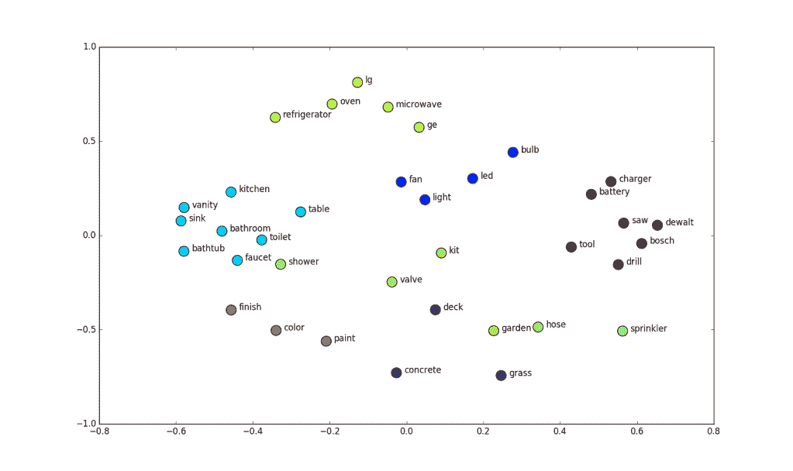
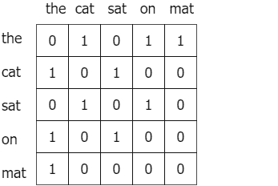

# 文档分类:小数据集的 7 种实用方法

> 原文：<https://web.archive.org/web/https://neptune.ai/blog/document-classification-small-datasets>

文档或文本分类是自然语言处理的主要任务之一。它有许多应用，包括新闻类型分类、垃圾邮件过滤、有毒评论识别等。

在大型组织中，数据集很大，从头开始训练深度学习文本分类模型是一个可行的解决方案，但对于大多数现实生活中的问题来说，你的数据集很小，如果你想建立你的机器学习模型，你需要变得聪明。

在本文中，我将讨论面向文本表示的实用方法，这些方法使小数据集上的文档分类成为可能。

## 文本分类 101

文本分类工作流程从清理和准备数据集中的语料库开始。然后，通过任何不同的文本表示方法来表示该语料库，随后进行建模。

在本文中，**我们将关注这个管道的“文本表示”**步骤。

## 示例文本分类数据集

我们将使用来自[的数据真实与否？NLP 与灾难推文](https://web.archive.org/web/20221206095902/https://www.kaggle.com/c/nlp-getting-started) kaggle 比赛。在这里，**的任务是预测哪些推文是关于真实灾难的，哪些不是。**

如果您想一步一步地学习这篇文章，您可能需要安装我用于分析的所有库。

让我们看看我们的数据，

```py
import pandas as pd

tweet= pd.read_csv('../input/nlp-getting-started/train.csv')
test=pd.read_csv('../input/nlp-getting-started/test.csv')

tweet.head(3)

```

数据包含 id、关键字、位置、文本和二进制目标。我们只会考虑推文来预测目标。

```py
print('There are {} rows and {} columns in train'.format(tweet.shape[0],tweet.shape[1]))
print('There are {} rows and {} columns in test'.format(test.shape[0],test.shape[1]))
```

训练数据集只有不到 8000 条推文。再加上 tweets 最多 280 个字符的事实，使得它成为一个棘手的小数据集。

## 文本数据准备

在开始任何 NLP 任务之前，我们需要做一些数据预处理和基本的清理工作。这不是本文的重点，但是如果你想阅读更多关于这一步的内容，请查看这篇文章。

简而言之，我们将:

*   **记号化**:将句子转换成记号或单词列表的过程。
*   **删除停用词**:删除单词“a”或“the”
*   **:将每个单词的屈折形式化为一个共同的基或根(*“学”，“学”——>“学”)*)。**

```py
def preprocess_news(df):
	'''Function to preprocess and create corpus'''
	new_corpus=[]

	lem=WordNetLemmatizer()
	for text in df["question_text"]:
    	words=[w for w in word_tokenize(text) if (w not in stop)]

    	words=[lem.lemmatize(w) for w in words]

    	new_corpus.append(words)
	return new_corpus

corpus=preprocess_news(df)
```

现在，让我们看看如何表示这个语料库，以便我们可以将它输入任何机器学习算法。

## 文本表示

文本不能直接用作机器学习模型的输入，而是需要首先以数字格式表示。这就是所谓的文本表示。

### 计价器

Countvectorizer 提供了一种简单的方法来矢量化并表示一组文本文档。它对输入文本进行标记，构建一个已知单词的词汇表，然后用这个词汇表表示文档。

让我们用一个例子来理解它，

```py
text = ["She sells seashells in the seashore"]

vectorizer = CountVectorizer()

vectorizer.fit(text)

print(vectorizer.vocabulary_)

vector = vectorizer.transform(text)

print(vector.shape)
print(type(vector))
print(vector.toarray())
```

您可以看到，Coutvectorizer 已经从给定的文本中构建了一个词汇表，然后使用一个 [numpy 稀疏矩阵](https://web.archive.org/web/20221206095902/https://machinelearningmastery.com/sparse-matrices-for-machine-learning/)来表示单词。我们可以试着用这个词汇翻译另一篇文章，并观察输出结果以获得更好的理解。

```py
vector=vectorizer.transform(["I sell seashells in the seashore"])
vector.toarray()
```

你可以看到:

*   索引位置 3 和 4 具有零，意味着这两个单词不存在于我们的词汇表中，而所有其他位置具有 1，意味着这些单词存在于我们的词汇表中。词汇表中缺少的相应单词是“sells”和“she”。

现在您已经了解了 Coutvectorizer 的工作原理，我们可以使用它来调整和转换我们的语料库。

```py
vec=CountVectorizer(max_df=10,max_features=10000)
vec.fit(df.question_text.values)
vector=vec.transform(df.question_text.values)
```

您应该知道 Countvectorizer 有几个重要的参数，您应该针对您的问题进行调整:

*   **max_features** :构建一个词汇表，该词汇表只考虑在整个语料库中按词频排序的前 n 个标记。
*   **min_df** :在构建词汇表时，忽略那些标记频率严格低于给定阈值的术语
*   **max_df** :在构建词汇表时，忽略令牌频率严格高于给定阈值的术语。

通常有助于选择合理值(或[超参数优化](/web/20221206095902/https://neptune.ai/blog/hyperparameter-tuning-in-python-a-complete-guide-2020)方法的范围)的是良好的探索性数据分析。看看我的另一篇文章。

### **tfidf 矢量器**

Countvectorizer 的一个问题是，像“the”这样的常见单词会出现很多次(除非在预处理阶段将其删除)，而这些单词实际上并不重要。一个流行的选择是 Tfidfvectorizer。是**词频的首字母缩写——逆文档频率。**

*   **词频**:总结给定单词在文档中出现的频率。
*   **逆文档频率**:这将缩小文档中大量出现的单词。

让我们看一个例子:

```py
from sklearn.feature_extraction.text import TfidfVectorizer

text = ["She sells seashells by the seashore","The sea.","The seashore"]

vectorizer = TfidfVectorizer()

vectorizer.fit(text)

print(vectorizer.vocabulary_)
print(vectorizer.idf_)

vector = vectorizer.transform([text[0]])

print(vector.shape)
print(vector.toarray())
```

词汇表再次由 6 个单词组成，并且为每个单词计算逆文档频率，将最低分数分配给出现 4 次的“The”。

然后，分数在 0 和 1 之间被归一化，并且该文本表示可以用作任何机器学习模型的输入。

### **Word2vec**

上述方法的一个大问题是，在表示单词时，会丢失单词的上下文。单词嵌入通过编码一些上下文信息来提供 NLP 中单词的更好的表示。它提供了从单词到相应的 n 维向量的**映射。**



*Blog “Dynamic Meta-Embedding: An approach to select the correct embedding”* | [Source](https://web.archive.org/web/20221206095902/https://medium.datadriveninvestor.com/)

Word2Vec 是由 Tomas Mikolov 等人在谷歌开发的，它使用一个**浅层神经网络**来学习单词嵌入。通过理解单词出现的上下文来学习向量。具体来说，它着眼于共现词。

下面给出的是句子“猫坐在垫子上”的共现矩阵。



*Thushan Ganegedara Blog “Intuitive Guide to Understanding GloVe Embeddings” | [Source](https://web.archive.org/web/20221206095902/https://towardsdatascience.com/light-on-math-ml-intuitive-guide-to-understanding-glove-embeddings-b13b4f19c010)*

Word2vec 由两种不同的模型组成:

*   **连续单词包** (CBOW)模型可以被认为是通过训练一个模型来学习单词嵌入，以**预测给定上下文的单词。**
*   **Skip-Gram** 模型则相反，通过训练模型来学习单词嵌入，以**预测给定单词的上下文。**

单词嵌入的基本思想是在相似上下文中出现的单词在向量空间中倾向于彼此更接近。我们来看看如何用 python 实现 word2vec。

```py
import gensim
from gensim.models import Word2Vec

model = gensim.models.Word2Vec(corpus,
                               min_count = 1, size = 100, window = 5)
```

现在您已经创建了您的 word2vec 模型，您可以实际更改并观察差异的一些重要参数是，

*   **size** :表示每个单词的结果向量的嵌入大小。
*   **min_count** :在构建词汇表时，忽略文档频率严格低于给定阈值的术语
*   **window** :构建表示时考虑单词周围的单词数。也称为窗口大小。

在本文中，我们将重点放在小数据集的实用方法上，我们将使用预训练的词向量，而不是来自我们语料库的训练向量。这种方法保证会产生更好的性能。

首先，你必须从[这里](https://web.archive.org/web/20221206095902/https://github.com/mmihaltz/word2vec-GoogleNews-vectors)下载训练好的向量。然后，您可以使用 gensim 加载向量。

```py
from  gensim.models.KeyedVectors import load_word2vec_format

def load_word2vec():
    word2vecDict = load_word2vec_format(
        '../input/word2vec-google/GoogleNews-vectors-negative300.bin',
        binary=True, unicode_errors='ignore')
    embeddings_index = dict()
    for word in word2vecDict.wv.vocab:
        embeddings_index[word] = word2vecDict.word_vec(word)

    return embeddings_index

```

让我们检查一下嵌入，

```py
w2v_model=load_word2vec()
w2v_model['London'].shape
```

你可以看到这个单词是用一个 300 维的向量来表示的。因此，你的语料库中的每个单词都可以这样表示，这个嵌入矩阵用于训练你的模型。

### **FastText**

现在，让我们了解一下 fastText，这是 [gensim](https://web.archive.org/web/20221206095902/https://radimrehurek.com/gensim/) 中一个非常有用的模块。FastText 是由脸书开发的，在文本分类任务中具有很高的性能和速度。

它支持连续的单词包和跳格模型。以前的模型和 **FastText 的主要区别在于，它将单词分解成几个 n-gram。**

让我们以橙色这个词为例。

单词 orange 的三元组是，org，ran，ang，nge(忽略单词的起始和结束边界)。

orange 的单词**嵌入向量(文本表示)将是这些 n 元文法的总和。**罕见单词或错别字现在可以正确表示，因为它们的一些 n-grams 很可能也出现在其他单词中。

例如，对于像 stupedofantabulouslyfantastic 这样的词，它可能从未出现在任何语料库中，gensim 可能会返回以下任意两种解决方案:零向量或低幅度的随机向量。

然而，**可以通过将单词分成组块并使用这些组块的向量来创建单词**的最终向量，从而产生更好的向量。在这种特殊的情况下，最终的向量可能更接近于奇妙的向量。

同样，我们将使用预先训练的模型，而不是训练我们自己的单词嵌入。

为此，你可以从[这里](https://web.archive.org/web/20221206095902/https://fasttext.cc/docs/en/english-vectors.html)下载预先训练好的向量。

这个文件的每一行都包含一个单词，它是一个对应的 n 维向量。我们将使用这个文件创建一个字典，将每个单词映射到它的向量表示。

```py
from gensim.models import FastText

def load_fasttext():

	print('loading word embeddings...')
	embeddings_index = {}
	f = open('../input/fasttext/wiki.simple.vec',encoding='utf-8')
	for line in tqdm(f):
    	values = line.strip().rsplit(' ')
    	word = values[0]
    	coefs = np.asarray(values[1:], dtype='float32')
    	embeddings_index[word] = coefs
	f.close()
	print('found %s word vectors' % len(embeddings_index))

	return embeddings_index

embeddings_index=load_fastext()

```

让我们检查一个单词的嵌入，

```py
embeddings_index['london'].shape

```

### **GloVe(单词表示的全局向量)**

GloVe 代表单词表示的全局向量。它是由斯坦福大学开发的无监督学习算法。GloVe 的基本思想是使用共现矩阵导出单词之间的语义关系。这个想法与 word2vec 非常相似，但是有细微的区别。[去这里阅读更多。](https://web.archive.org/web/20221206095902/https://towardsdatascience.com/light-on-math-ml-intuitive-guide-to-understanding-glove-embeddings-b13b4f19c010)

为此，我们将使用在大型语料库上训练的**预训练手套向量**。这保证在几乎任何情况下都有更好的表现。你可以从[这里](https://web.archive.org/web/20221206095902/https://nlp.stanford.edu/projects/glove/)下载。

下载后，我们可以加载我们预先训练的单词模型。在此之前，您应该了解它可用的格式。每行包含一个单词及其对应的 n 维向量表示。像这样，

因此，要使用它，你应该首先准备一个包含单词和相应向量之间映射的字典。这可以称为嵌入字典。

让我们为我们的目的创建一个。

```py
def load_glove():
    embedding_dict = {}
    path = '../input/glove-global-vectors-for-word-representation/glove.6B.100d.txt'
    with open(path, 'r') as f:
        for line in f:
            values = line.split()
            word = values[0]
            vectors = np.asarray(values[1:], 'float32')
            embedding_dict[word] = vectors
    f.close()

    return embedding_dict
embeddings_index = load_glove()

```

现在，我们有一个字典，其中包含手套中的每个单词、预训练向量以及它们在字典中的对应向量。让我们检查一个单词的嵌入。

```py
embeddings_index['london'].shape

```

### **通用语句编码**

到目前为止，我们一直在处理单词的表示，这些技术对于单词级的操作非常有用。有时候我们需要探索**句级**运算。这些编码器被称为句子编码器。

一个好的句子编码器应该以这样一种方式对句子进行编码，使得**个相似句子的向量在向量空间中具有最小的距离。**

举个例子，

*   今天天气晴朗
*   今天下雨了
*   今天多云。

这些句子将被编码和表示，使得它们在向量空间中彼此接近。

让我们继续检查如何实现通用句子编码器，并使用它找到相似的句子。

你可以从[这里](https://web.archive.org/web/20221206095902/https://tfhub.dev/google/universal-sentence-encoder/)下载相关向量。

我们将使用 TensorFlow hub 加载模块。

```py
module_url = "../input/universalsentenceencoderlarge4"

embed = hub.load(module_url)
```

接下来，我们将为列表中的每个句子创建嵌入。

```py
sentence_list=df.question_text.values.tolist()
sentence_emb=embed(sentence_list)['outputs'].numpy()
```

这里有一篇关于通用句子编码器的文章。

### 埃尔莫、伯特和其他人

当使用上述任何一种嵌入方法时，我们忘记的一件事是单词的上下文。这是这种单词表示模型的主要缺点之一。

例如，单词“stick”将使用与上下文无关的相同向量来表示，这没有多大意义。随着 NLP 领域和 BERT(变压器的双向编码器表示)等模型的最新发展，这已经成为可能。这里有一篇文章可以多看。

## 文本分类

在本节中，我们将准备嵌入矩阵，该矩阵被传递到 Keras 嵌入层以学习文本表示。您可以使用相同的步骤为任何单词级嵌入方法准备语料库。

让我们创建一个单词索引并确定一个最大句子长度，使用 **Keras Tokenizer** 和 *pad_sequences* 填充我们语料库中的每个句子。

```py
MAX_LEN=50
tokenizer_obj=Tokenizer()
tokenizer_obj.fit_on_texts(corpus)
sequences=tokenizer_obj.texts_to_sequences(corpus)

tweet_pad=pad_sequences(sequences,
                        maxlen=MAX_LEN,
                        truncating='post',
                        padding='post')
```

让我们检查一下语料库中独特单词的数量，

```py
word_index=tokenizer_obj.word_index
print('Number of unique words:',len(word_index))
```

使用这个单词索引字典和嵌入字典，您可以为我们的语料库创建一个**嵌入矩阵**。这个嵌入矩阵被传递到神经网络的**嵌入层**以学习单词表示。

```py
def prepare_matrix(embedding_dict, emb_size=300):
    num_words = len(word_index)
    embedding_matrix = np.zeros((num_words, emb_size))

    for word, i in tqdm(word_index.items()):
        if i > num_words:
            continue

    emb_vec = embedding_dict.get(word)
    if emb_vec is not None:
        embedding_matrix[i] = emb_vec

    return embedding_matrix
```

我们可以定义我们的神经网络，并将这个嵌入索引传递给网络的嵌入层。我们将向量传递到嵌入层，并设置***trainible = False***以防止权重被更新。

```py
def new_model(embedding_matrix):
    inp = Input(shape=(MAX_LEN,))

    x = Embedding(num_words, embedding_matrix.shape[1], weights=[embedding_matrix],
                  trainable=False)(inp)

    x = Bidirectional(
        LSTM(60, return_sequences=True, name='lstm_layer',
             dropout=0.1, recurrent_dropout=0.1))(x)

    x = GlobalAveragePool1D()(x)
    x = Dense(1, activation="sigmoid")(x)
    model = Model(inputs=inp, outputs=x)

    model.compile(loss='binary_crossentropy',
                  optimizer='adam',
                  metrics=['accuracy'])

    return model

```

例如，要使用 word2vec 嵌入来运行模型，

```py
embeddings_index=load_word2vec()
embedding_matrix=prepare_matrix(embeddings_index)
model=new_model(embedding_matrix)

history=model.fit(X_train,y_train,
                  batch_size=8,
                  epochs=5,
                  validation_data=(X_test,y_test),
                  verbose=2)
```

您可以调用您想要的嵌入类型，并遵循相同的步骤来实现它们中的任何一个。

## 比较

那么，在我们的示例问题中，哪种文本分类方法效果最好呢？

您可以使用 [Neptune](/web/20221206095902/https://neptune.ai/product) 通过简单地设置一个实验来比较使用不同嵌入的模型的性能。

与其他两种嵌入相比，手套嵌入在测试集中表现稍好。通过对数据进行大规模清理并调整模型，您可能会获得更好的结果。

如果你愿意，你可以在这里探索实验。

## 最后的想法

在本文中，我们讨论并实现了不同的文本分类特征表示方法，您可以将这些方法用于较小的数据集。

希望你会发现它们对你的项目有用。**