# 海王星提前停止

> 原文：<https://web.archive.org/web/https://neptune.ai/blog/early-stopping-with-neptune>

最近对 20，036 名担任数据科学家的 Kaggle 成员进行的调查(发表在 2020 年机器学习和数据科学报告中)显示，大多数现实世界的问题都可以使用流行的机器学习算法轻松解决，如线性或逻辑回归，决策树或随机森林。但是，数据科学界发展最快的研究领域是深度学习——主要是神经网络[1]。

深度学习是机器学习的一个新兴领域。最近，它在研究人员和工程师中很受欢迎。深度学习在许多工业应用中表现出了一流的性能——自动驾驶、航空航天和国防、医学研究、工业自动化和电子。

深度学习实际上是人工智能子集的子集。

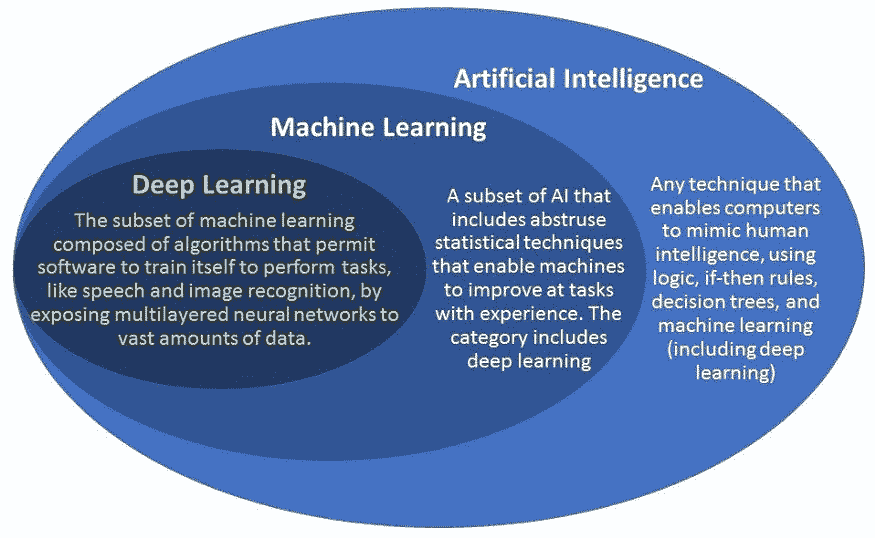

*Figure 1: AI, machine learning, and deep learning*

在过去的几年里，深度神经网络已经在计算机视觉、语音识别、自然语言处理、图像分类和对象检测等广泛的领域中显示出巨大的成功。

研究表明，在 2006 年之前，深度神经网络没有被成功训练。从那以后，已经实现了几种算法来提高神经网络的性能。

与浅层网络相比，深层神经网络更难训练。在本文中，我们的主要目标是强调训练神经网络中一个价值百万美元的问题:**训练一个神经网络需要多长时间**？

神经网络训练时间会导致训练和测试数据的欠拟合(过短)或过拟合(过长)。过度拟合是监督机器学习中的一个非常基本的问题，它阻止我们概括模型的性能，因为模型在训练集的观察数据上拟合得很好，但在测试集上表现很差。

## 欠拟合与过拟合

一般来说，欠拟合和过拟合只不过是方差和偏差之间的权衡。

在统计学和机器学习中，偏差-方差权衡是模型的一个非常重要的性质。偏差是模型的平均预测值和我们试图预测的真实值之间的误差。高偏差会导致模型错过数据中的重要信息，并使模型过于简化(拟合不足)。

方差是对训练集的小波动的敏感性的误差。在具有高方差的模型中，训练集中的微小变化会导致精确度发生非常大的变化。该模型可以在观察到的数据上表现良好，而在以前没有观察到的数据上表现不佳(过拟合)。


*Figure 2: Bias – Variance Tradeoff [2]*

### 欠拟合

无法捕捉数据潜在趋势的机器学习模型通常被定义为拟合不足。当模型拟合不足时，它不能很好地拟合数据，因此它可能会错过数据中的重要信息。

当模型与可用数据相比非常简单时，通常会出现拟合不足。可用数据较少，数据中有噪声，或者当我们试图用非线性数据建立线性模型时[3]。在欠拟合期间，模型不仅在测试数据上表现不佳，甚至在对训练数据集进行训练期间也表现不佳。

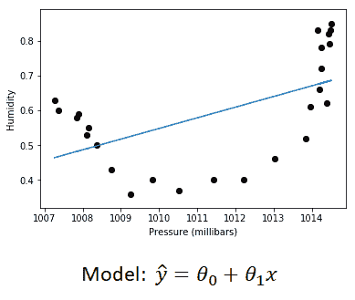

*Figure 3: Underfitting [3]*

欠拟合数据的模型往往具有:

1.  低方差和高偏差，
2.  更少的特征(例如 x)。

减少欠拟合的技术:

1.  使模型更加复杂，
2.  执行特征工程，
3.  增加训练时间或历元数。

### 过度拟合

当 ML 模型被允许训练更长的时间时，它将不仅从可用数据开始学习，而且从数据中的噪声开始学习，那么机器学习模型是过度拟合的。因此，由于存在噪声、训练集的有限大小以及分类器的复杂性，会发生过拟合[2]。

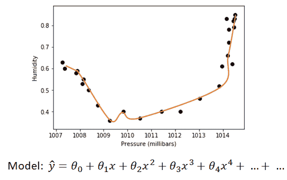

*Figure 4: Overfitting [3]*

过度拟合的模型往往具有:

1.  高方差和低偏差。
2.  高特征(例如 x，x ² ，x ³ ，x ⁴ ，…)

减少过度拟合的技术:

1.  增加训练集上的观察数据，
2.  让模型更简单，
3.  提前停车，
4.  使用“网络缩减”策略减少训练集中的噪声，
5.  数据增强，
6.  正规化-L1，L2，辍学。

捕捉数据总体趋势的模型不会趋向于欠拟合或过拟合。

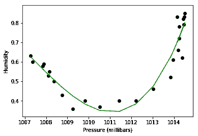

*Figure 5: Perfect fit [3]*

非常符合数据的模型往往具有:

1.  低方差和低偏差，
2.  合理数量的特征，
3.  即使在未观察到的数据上也表现很好。

## 神经网络中的早期停止

训练神经网络的主要挑战之一是训练神经网络的时间长度。为有限数量的时期训练模型会导致拟合不足，而为大量时期训练模型会导致拟合过度。监控训练过程，在适当的时候停止训练是非常重要的。

在本文中，我们将发现在神经网络过度拟合之前尽早停止神经网络的训练，实际上可以减少过度拟合，并导致更好的模型性能——在训练和测试数据集上都是如此。

在训练神经网络时，在某个点上，模型将停止归纳并开始学习数据中的噪声，这使得模型在未观察到的数据上表现不佳。为了克服这个问题，我们将使用历元数作为超参数之一，并监控训练和测试损失。

训练神经网络时，我们将在每个时期后输入测试数据集，并监控测试损失。如果模型性能下降(测试损失开始增加)，或者测试精度降低，训练过程将停止。

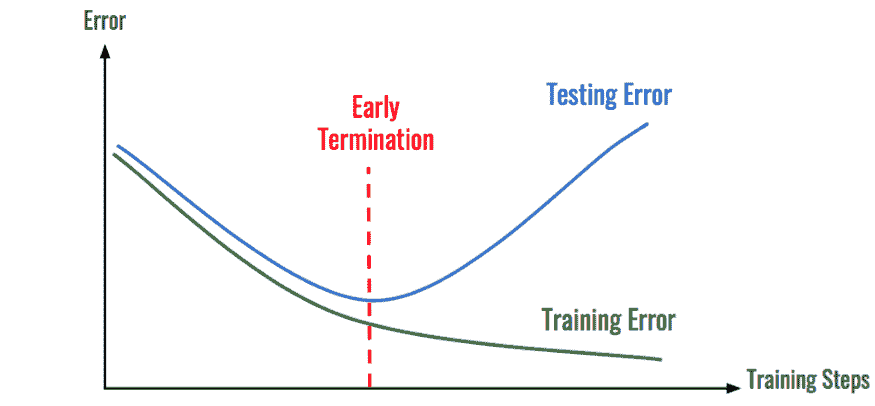

*Figure 6: Early stopping [4]*

## 用海王星来监控实验

使用 Neptune 可以轻松地监控训练过程和其他实验。这是一个非常棒的工具，可以帮助研究人员和机器学习工程师监控和组织他们的项目，与队友分享结果，并通过使用单一平台来改善团队合作。

* * *

请注意，由于最近的 [API 更新](/web/20221207132254/https://neptune.ai/blog/neptune-new)，这篇文章也需要一些改变——我们正在努力！与此同时，请检查[海王星文档](https://web.archive.org/web/20221207132254/https://docs.neptune.ai/)，那里的一切都是最新的！

* * *

在海王星设置实验的过程非常简单。第一步是注册一个帐户，这将为您的实验创建一个唯一的 id 和一个仪表板。

您将使用唯一的令牌 ID 将任何深度学习框架(如 TensorFlow 或 PyTorch)链接到 Neptune。在我们的实验中，我们将使用 **PyTorch** 。注册并按照以下步骤创建一个唯一的 id。

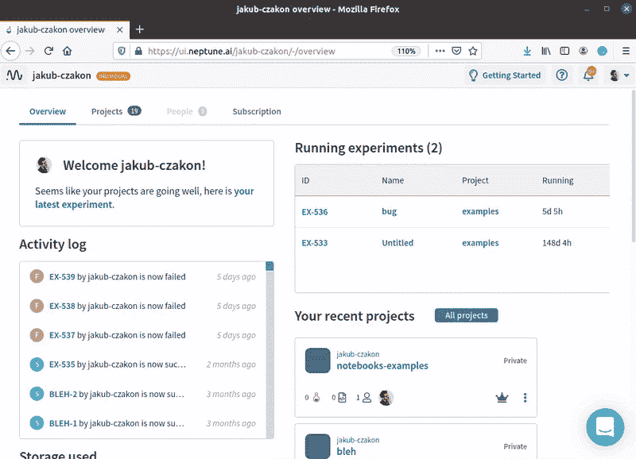

*Figure 7: Neptune unique id [5]*

为了使用 Python 直接从 Pytorch 访问 Neptune 仪表板，Neptune.ai 的开发人员开发了一个易于访问的工具箱，可以使用 pip 安装:

```py
pip install neptune-client

```

安装完成后，可以通过将 Neptune 导入到主 Python 脚本来轻松完成实验初始化:

```py
import neptune

NEPTUNE_API_TOKEN="<api-token-here>"
neptune.init('<username>/sandbox',api_token=NEPTUNE_API_TOKEN)
neptune.create_experiment('Pytorch-Neptune-Example')

```

海王星与 [PyTorch](https://web.archive.org/web/20221207132254/https://docs.neptune.ai/essentials/integrations/deep-learning-frameworks/pytorch) 的融合

### 实验装置

在我们的实验中，我们将使用 CIFAR10 影像分类数据集。CIFAR-10 数据集由 10 类 60000 幅 32×32 彩色图像组成，每类 6000 幅图像。有 50，000 个训练图像和 10，000 个测试图像。

以下是数据集中的类，以及每个类中的 10 幅随机图像:


*Figure 8: CIFAR10 Dataset [6]*

数据集可以在 PyTorch 中轻松下载。导入 Torchvision 并使用以下命令:

```py
import torchvision.datasets as datasets

cifar_trainset = datasets.CIFAR10(root='./data', train=True, download=True, transform=transform)

cifar_testset = datasets.CIFAR10(root='./data', train=False, download=True, transform=transform)

```

为了解释早期停止的重要性，我们将使用一个简单复杂的(例如，没有 BatchNorm，或任何正则化技术，如 dropout)卷积神经网络(CNN)架构来训练训练数据集上的模型，并故意过度拟合数据。

本实验使用的 CNN 架构如下:

```py
class CNN(nn.Module):
    def __init__(self):
        super(CNN, self).__init__()
        self.conv1 = nn.Conv2d(3, 32, kernel_size=3, padding=(1, 1))
        self.conv2 = nn.Conv2d(32, 32, kernel_size=3, padding=(1, 1))
        self.conv3 = nn.Conv2d(32, 64, kernel_size=3, padding=(1, 1))
        self.conv4 = nn.Conv2d(64, 64, kernel_size=3, padding=(1, 1))
        self.conv5 = nn.Conv2d(64, 128, kernel_size=3, padding=(1, 1))
        self.conv6 = nn.Conv2d(128, 128, kernel_size=3, padding=(1, 1))
        self.maxpool = nn.MaxPool2d(2, stride=2)
        self.fc1 = nn.Linear(128 * 4 * 4, 1024)
        self.fc2 = nn.Linear(1024, 512)
        self.fc3 = nn.Linear(512, 10)

    def forward(self, x):
        x = F.relu(self.conv1(x))
        x = self.maxpool(F.relu(self.conv2(x)))
        x = F.relu(self.conv3(x))
        x = self.maxpool(F.relu(self.conv4(x)))
        x = F.relu(self.conv5(x))
        x = self.maxpool(F.relu(self.conv6(x)))
        x = x.view(-1, 128 * 4 * 4)
        x = F.relu(self.fc1(x))
        x = F.relu(self.fc2(x))
        x = F.log_softmax(self.fc3(x), dim=1)
        return x

```

### 将 Python 脚本集成到 Neptune

在训练过程中，将监控训练/测试损失和训练/测试准确度，可以使用 **Neptune.log_metric()** 函数轻松调用。

PyTorch python 脚本与 Neptune 的集成在 fit()函数中类似如下:

```py
def fit(model, train_loader, test_loader, epochs, optimizer, loss):
    model.train()
    import neptune
    neptune.init(project_qualified_name='sanghvirajit/sandbox',    api_token='eyJhcGlfYWRkcmVzcyI6Imh0dHBzOi8vdWkubmVwdHVuZS5haSIsImFwaV91cmwiOiJodHRwczovL3VpLm5lcHR1bmUuYWkiLCJhcGlfa2V5IjoiN2Y4MzU5YTctZmJjZS00MmU5LTg4YmYtNDUwZWI5ZTQ3ZmJmIn0=',)

    PARAMS = {'train_batch_size': 5000,
    'test_batch_size': 1000,
    'optimizer': 'Adam'}

    neptune.create_experiment('Pytorch-Neptune-CIFAR10-Early     Stopping',params=PARAMS,tags=['classification','pytorch','neptune'])

    if optimizer == 'Adam':

    optimizer = torch.optim.Adam(model.parameters())

    if loss == 'CrossEntropy':

    error = nn.CrossEntropyLoss()

    for epoch in range(epochs):

        correct = 0
        for batch_idx, (X_batch, y_batch) in enumerate(train_loader):

        var_X_batch = Variable(X_batch).float()
        var_y_batch = Variable(y_batch)

        optimizer.zero_grad()

        output = model.forward(var_X_batch)

        loss = error(output, var_y_batch)
        train_cost = loss.data

        loss.backward()

        optimizer.step()

        predicted = torch.max(output.data, 1)[1]
        correct += (predicted == var_y_batch).sum()
        Train_accuracy = float(correct*100) / float(train_batch_size*(batch_idx+1))

        test_accuracy, test_cost = evaluate(model, test_loader)

    print('Epoch : {} [{}/{} ({:.0f}%)]tLoss: {:.6f}t Accuracy:{:.3f}%'.format(
    epoch+1,
    (batch_idx+1)*(len(X_batch)),
    len(train_loader.dataset),
    100.*(batch_idx+1) / len(train_loader),
    train_cost,
    train_accuracy))

    neptune.log_metric('training loss', train_cost)
    neptune.log_metric('training accuracy', train_accuracy)

    neptune.log_metric('testing loss', test_cost)
    neptune.log_metric('testing accuracy', test_accuracy)

neptune.stop()

```

可以很容易地调用 fit()函数，这将生成一个链接，该链接将我们重定向到 Neptune 仪表板:

```py
fit(cnn, train_loader, test_loader, epochs=100, optimizer='Adam', loss='CrossEntropy')

```

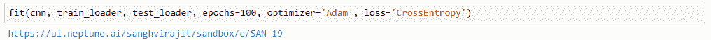

**现在可以使用 Neptune 中的图表轻松监控测试损失:**

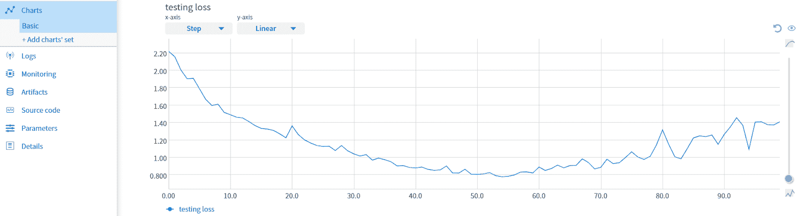

*Figure 9: Monitoring testing loss in Neptune*

日志指标可在日志下访问，通道数据可轻松下载。csv 文件格式，用于结果的进一步后处理。

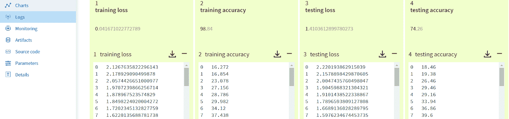

*Figure 10: Log metric in Neptune*

让我们看看我们得到的结果:

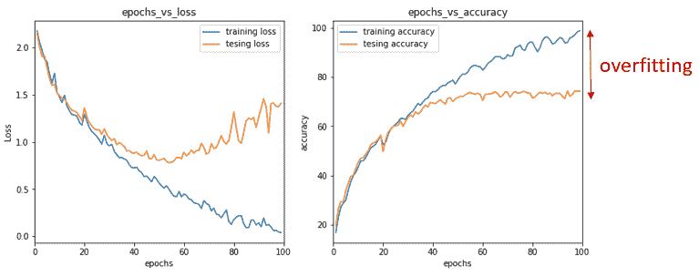

*Figure 11: Results*

图 11 显示了训练和测试数据集的分类结果。训练准确率达到 98.84%，而测试准确率只能达到 74.26%。

正如我们所看到的，测试损失在第 55 纪元左右开始分散。该模型已经学会对训练集进行很好的分类，以至于它失去了有效概括的能力，即正确分类测试集上未观察到的数据的能力。因此，该模型开始在测试数据集上表现不佳——它**过度拟合**。

在这种情况下，最好在第 55 世左右停止训练。

**现在，让我们在代码中引入提前停止:**

```py
valid_loss_array = np.array(valid_losses)
min_valid_loss = np.min(valid_loss_array)

if(test_cost > min_valid_loss):
patience_counter += 1
else:

patience_counter = 0

if(patience_counter > patience):
        print("Early stopping called at {} epochs".format(epoch+1))
        break

```

我们将使用耐心作为超参数之一来触发训练期间的提前停止。耐心是测试损失没有改善的次数，在此之后训练过程将停止。

让我们调用耐心值为 10 的 fit()函数，并监控训练过程:

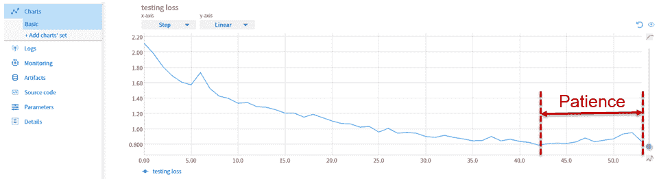

*Figure 12: Monitoring testing loss in Neptune*

**让我们再来看看我们得到的结果:**

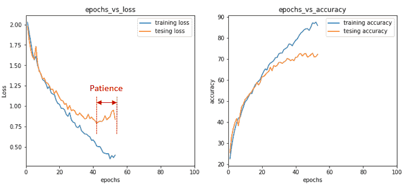

*Figure 13: Results*

从结果中我们可以注意到，在第 44 个时期之后，测试损失没有进一步的改善，因此在第 54 个时期触发了早期停止，并且训练过程如我们所预期的那样停止了。

这消除了训练过程中过拟合的可能性，也有助于节省我们的计算资源和时间。

## 摘要

在本文中，我们发现了早期停止在深度神经网络模型中的重要性。

具体来说，我们已经看到:

*   早期停止减少了训练过程中的过度配合，
*   我们可以使用 Neptune 监控机器学习项目，以及如何将 PyTorch python 脚本集成到 Neptune。

如果你对实验的详细代码感兴趣，可以在 [my Github](https://web.archive.org/web/20221207132254/https://github.com/sanghvirajit/Early_Stopping_using_Neptune.ai) 上找到。

### 参考

[1] [数据科学与机器学习 2020 年状态](https://web.archive.org/web/20221207132254/https://www.kaggle.com/kaggle-survey-2020)。

[2]了解偏差-方差权衡-[https://towards data science . com/Understanding-the-Bias-Variance-trade-165 e 6942 b229](https://web.archive.org/web/20221207132254/https://towardsdatascience.com/understanding-the-bias-variance-tradeoff-165e6942b229)

[3]解决欠拟合和过拟合-[https://morioh.com/p/ebe9597eae3a](https://web.archive.org/web/20221207132254/https://morioh.com/p/ebe9597eae3a)

[4]使用 PyTorch 提前停止以防止模型过度拟合–[https://medium . com/analytics-vid hya/Early-Stopping-with-py torch-to-inhibit-your-Model-from-over fitting-dce6de 4081 C5](https://web.archive.org/web/20221207132254/https://medium.com/analytics-vidhya/early-stopping-with-pytorch-to-restrain-your-model-from-overfitting-dce6de4081c5)

[5] Neptune.ai 文档—[设置 Neptune API 令牌](https://web.archive.org/web/20221207132254/https://docs.neptune.ai/getting-started/installation#authentication-neptune-api-token)

[6]CIFS ar 10 和 CIFAR100 数据集—[https://www.cs.toronto.edu/~kriz/cifar.html](https://web.archive.org/web/20221207132254/https://www.cs.toronto.edu/~kriz/cifar.html)

[7]薛瑛。CISAT 2018。过度拟合及其解决方案概述-[https://IOP science . IOP . org/article/10.1088/1742-6596/1168/2/022022/pdf](https://web.archive.org/web/20221207132254/https://iopscience.iop.org/article/10.1088/1742-6596/1168/2/022022/pdf)

[8]Lutz pre helt。“早停——但是什么时候？."《神经网络:交易的诀窍》，第 55-69 页。施普林格，柏林，海德堡，1998—[https://docs.google.com/viewer?URL = https % 3A % 2F % 2f page . mi . fu-Berlin . de % 2f pre chelt % 2f iblio % 2f stop _ tricks 1997 . pdf](https://web.archive.org/web/20221207132254/https://docs.google.com/viewer?url=https%3A%2F%2Fpage.mi.fu-berlin.de%2Fprechelt%2FBiblio%2Fstop_tricks1997.pdf)