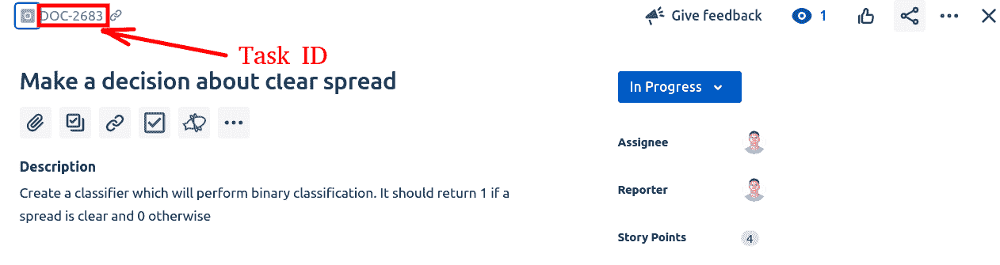
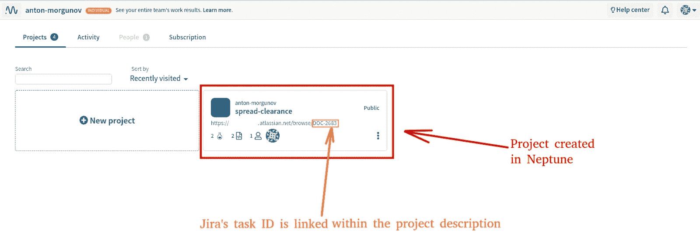
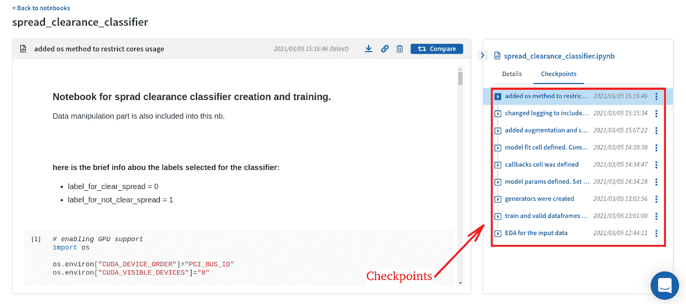
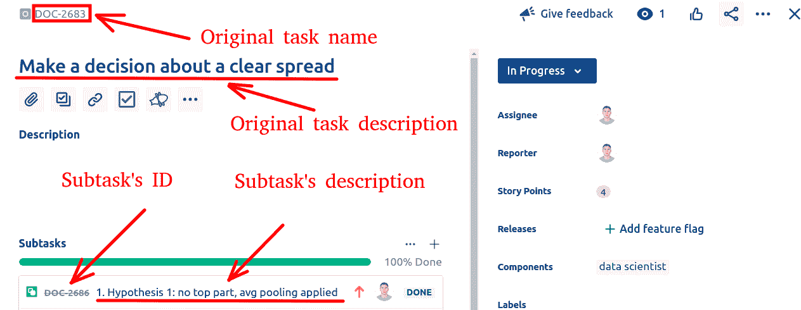
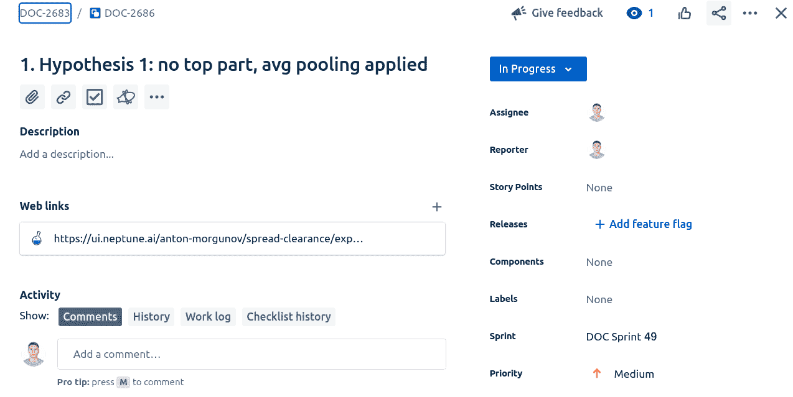
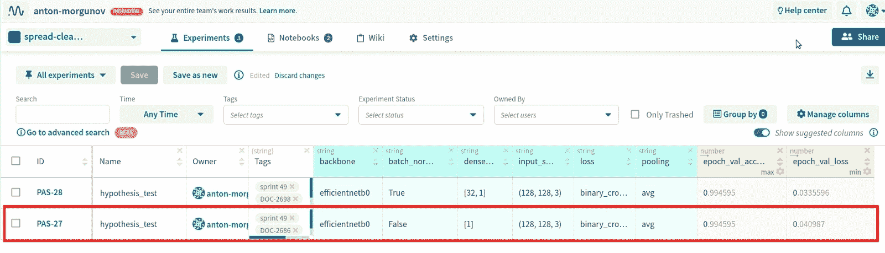
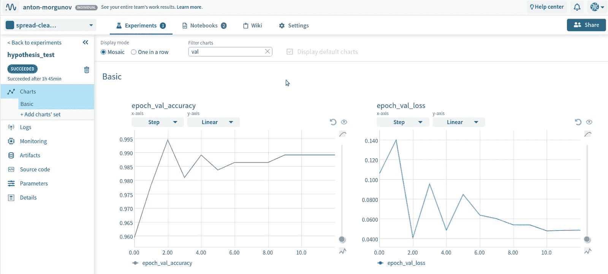
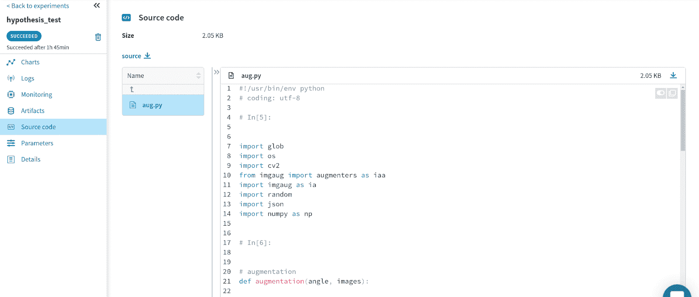

# 如何让实验跟踪工具适合你的项目管理设置

> 原文：<https://web.archive.org/web/https://neptune.ai/blog/experiment-tracking-tools-in-project-management-setup>

在机器学习中，工程师倾向于做大量的实验(至少可以这么说)。正因为如此，[实验跟踪](/web/20221206024115/https://neptune.ai/experiment-tracking)是每个 [ML 项目](https://web.archive.org/web/20221206024115/https://www.jeremyjordan.me/ml-projects-guide/)必不可少的一部分。我们需要一个工具，它不仅可以为我们做跟踪，还可以轻松地集成到我们现有的项目管理设置中，这样其他团队成员就可以跟踪工作流。

海王星已经提出了一个[实验跟踪](/web/20221206024115/https://neptune.ai/experiment-tracking)的解决方案，我们的团队已经对其进行了相当广泛的开发。我们最近决定将 Neptune 更多地整合到我们的工作流程中，并将其扩展到日常活动，如日常会议和每周冲刺。

这使得我们的整个项目流程对整个团队来说更加透明和易于理解，而我们，ML 工程师，继续享受 Neptune 的跟踪能力。

双赢的解决方案？对我来说，绝对是！我会告诉你我们到底做了什么，有什么好处。

每个冲刺都有一个目标。我们的团队每两周召开一次会议，会上我们设定了 sprint 时间段要实现的目标。

这些目标在[吉拉](https://web.archive.org/web/20221206024115/https://www.atlassian.com/software/jira?&aceid=&adposition=&adgroup=95003649329&campaign=9124878840&creative=415542753493&device=c&keyword=what%20is%20jira&matchtype=e&network=g&placement=&ds_kids=p51241553142&ds_e=GOOGLE&ds_eid=700000001558501&ds_e1=GOOGLE&gclid=Cj0KCQiA1pyCBhCtARIsAHaY_5dfSVs-KGzTQ0A7BT7kFgMDxW7QIYblkMQW6lAzH3Lr_o0FjpNKnxUaAktOEALw_wcB&gclsrc=aw.ds)中成为高级任务——我们管理软件开发的工具。每个任务都有一个唯一的 ID 与之相关联，所以我们可以使用这个 ID 来引用一个特定的任务。

让我们考虑一个我最近参与的真实 ML 项目的例子。下面是在吉拉新建任务的页面外观:



*Unique task ID is shown for a newly created sprint task*

当我们决定一个任务并在吉拉创建它时，我们接着在 [Neptune](https://web.archive.org/web/20221206024115/https://neptune.ai/) 中设置一个新项目，并通过 ID 将它链接到最初的吉拉任务。我在 Neptune 中创建的项目是这样的:



*Project created in Neptune and linked to Jira via the unique project ID*

现在，吉拉和海王星是连在一起的。我们在海王星分配了一个特定的项目，旨在解决吉拉的任务中描述的一个发展问题。

### 项目的开发阶段

对于开发环境，我们的 ML 团队倾向于在 Jupyter 笔记本上工作。为了跟踪整个项目工作流程，在这些笔记本中跟踪进度是非常重要的。

当 Neptune 链接到 Jupyter 时，它让我们对笔记本进行检查点操作。这些检查点被上传到 Neptune 中的项目页面，在 Neptune 的 UI 中如下所示:



*Checkpoints logged and listed for a jupyter notebook. 
Screenshot from Neptune’s UI.*

在每天的会议上，我们看着这些检查站。它使开发过程变得可理解和透明。查看上面的截图，了解我的模型开发工作流程是如何进行的，从针对输入数据的[探索性数据分析](https://web.archive.org/web/20221206024115/https://neptune.ai/blog/exploratory-data-analysis-natural-language-processing-tools) (EDA)开始，继续创建数据生成器，以日志包含结束。

另外，请注意日期和时间信息是如何显示在检查点旁边的。这使得时间线清晰可循。必要时，如果需要详细的进度信息，我们可以比较两个检查点(两个笔记本)。使用 Neptune 的跟踪能力使项目易于管理和预测。

如果您喜欢在 IDE 中开发，也可以完成相同的跟踪过程。您的脚本可以像我们在 Jupyter 笔记本上看到的那样进行存储和比较。

### 项目的假设测试阶段

当 ML 项目的开发阶段完成时，我们通常会得到一个基线模型，它显示了一些性能，但很少是最好的性能。现在是时候测试假设，并检查是否有任何其他模型配置可能会导致我们更好的性能，或更优的解决方案。

[假设检验](https://web.archive.org/web/20221206024115/https://www.managementstudyguide.com/what-is-hypothesis-testing.htm)是每个 ML 项目必不可少的一部分，Neptune 以一种简单方便的方式追踪实验结果。跟踪记录可以用作日志来建立对 ML 项目的管理。让我向您展示我们如何将 Neptune 整合到我们的整体管理工作流程中。

吉拉让我们做子任务，所以每个假设检验都从为它创建的子任务开始。子任务位于原来的高级任务之下，并属于它。我的项目看起来是这样的:



*Subtask creation for a hypothesis testing.
Example from Jira.*

**如果子任务作为一个单独的页面打开，它在吉拉的样子如下:**



*Subtask page within Jira*

请注意，一个假设(上面显示为吉拉的一个子任务)通过一个链接与海王星所创建的一个独特的实验相联系。我们这样做是为了方便，因为它可以帮助我们在吉拉和海王星之间导航。

另一方面，如果我们去海王星，看看实验页面，这是我们会看到的:



*Experiments page in Neptune*

看一下红色矩形中的记录。这是我们之前看到的子任务的实验。注意，这个实验有一些与之相关的标签。如果我们阅读这些，我们会注意到一些有趣的信息:

*   吉拉的子任务标识号
*   冲刺数

子任务 ID 帮助我们保持特定实验和吉拉任务之间的联系，而 sprint 数字提醒我们处理这个特定假设时的 sprint 是什么。

您可能会想到对您的特定情况有用的任何其他标记。关键的一点是你可以把它放在海王星的实验旁边，它真的简化了整个跟踪过程。

顺便说一句，如果你想知道如何给实验添加标签，这是我的 jupyter 笔记本中的一个单元格，我在这里添加标签:

```py
create_experiment = True
log_aug_script = False

launch_name = 'hypothesis_test' 
tags = ['sprint 49', 'DOC-2698']

params = {
    'backbone': backbone.name,
    'loss': loss_name,
    'pooling': pooling_name,
    'dense_layer': dense_count,
    'input_shape': input_shape,
    'batch_norm_usage_in_top_part': batch_norm_usage_in_top_part
}

if create_experiment:
    neptune.create_experiment(name=launch_name,
                              params=params,
                              upload_source_files=['aug.py'] if log_aug_script else [])
    if tags:
        neptune.append_tags(tags)
```

## CI/CD 和再现能力

[CI/CD 应用于机器学习越来越受到关注](https://web.archive.org/web/20221206024115/https://www.atlassian.com/continuous-delivery/principles/continuous-integration-vs-delivery-vs-deployment)。我们需要一套实践和工具，可以用来增强项目开发和简化未来的部署。

由于它的记录能力，海王星也覆盖了我们感兴趣的这个区域。Neptune 可以记录和存储一些最重要的工件，这些工件不仅是部署阶段所需要的，也是复制我们所做的事情所需要的。此外，所有这些工件和日志都可以附加到一个特定的实验中，为它提供所需的核心信息。

让我们看一个我们团队广泛使用这些能力的例子。首先，由 Neptune 跟踪并显示为图表的损失和指标值。



*Metrics and loss plots displayed in Neptune for a particular experiment.
Can be tracked for both training and validation sets*.

**接下来，我们可以随时提醒自己，我们使用了哪些模型参数和架构**来获得这样的模型性能。Neptune 在 parameters 选项卡下为我们存储了这些信息。


*Model architecture and parameters stored in Neptune for a particular experiment*

**每个机器学习工程师**可能遇到的问题就是数据集版本控制。Neptune 允许我们上传特定实验的数据集信息。


*Dataset information stored in Neptune*

我个人主要处理图像数据，更喜欢记录的不是图像本身，而是包含我需要的所有必要信息的数据框(比如图像的路径和标签)。这些数据帧可以通过编程方式从 Neptune 获取，供以后使用。

作为一名计算机视觉工程师，我也喜欢尝试图像增强。我尝试了多种增强方法，并且需要跟踪我当前的增强设置。Neptune 允许我将增强信息(作为代码脚本)附加到特定的实验中，因此它不会丢失，并且可以恢复。



*Augmentation information attached to the experiment*

**模型检查点也可以上传和存储**。我通常会上传某个特定实验的最佳检查点，这样我就可以在以后需要的时候获取它。


*Best checkpoint for an experiment is stored*

**如果我们想提醒自己模型性能能力**，我们不仅可以查看损失和度量值，还可以查看我通常构建的性能图，这些图也附在实验运行中。Neptune 允许我上传这些图，并将它们保存在实验页面中。


*Model performance information stored for a particular experiment.
Loss value, metrics value and performance plots are included*.

在上面截图的最底部，你可能会注意到我附上的两张图:roc-auc 曲线和混淆矩阵图。图表、指标和损失值将为我提供关于特定实验运行所实现的模型的全面信息。

最后但同样重要的是，我倾向于包含完整推理调用的代码，并将其附加到最佳实验运行中。稍后，当模型部署的时候，我的队友可以获取最佳的检查点和推理代码，并使用它来设计可以部署的服务。很漂亮，对吧？

## 结论

如果您的项目中有机器学习部分，您已经看到了您的项目管理设置如何受益于 Neptune 集成。

它提供了跟踪功能，不仅可以帮助您的 ML 团队进行开发，还可以帮助您进行整体项目管理，让您可以看到每天或冲刺阶段的进度。

您还看到了一个广为接受的软件开发工具吉拉是如何以一种简单方便的方式与 Nepune 连接起来的。

最后，海王星可以为你储存大量的艺术品。所有这些结合起来将使你的项目具备 CI/CD 能力，并使你的项目具有完全的可复制性。

### 可以帮助您进行项目管理的其他工具:

1.[https://www.ganttproject.biz/](https://web.archive.org/web/20221206024115/https://www.ganttproject.biz/)

我们这里有什么:

*   甘特图
*   里程碑跟踪
*   完成百分比跟踪
*   计划图编制
*   资源管理
*   任务管理

2.[https://www.meisterlabs.com/](https://web.archive.org/web/20221206024115/https://www.meisterlabs.com/)

我们这里有什么:

*   任务跟踪
*   任务规划
*   任务调度
*   思维导图
*   计划图编制
*   项目时间跟踪
*   按项目跟踪时间
*   工作流程管理
*   实时报告
*   活动仪表板
*   标签和关键词
*   状态跟踪
*   项目跟踪
*   项目工作流程
*   协作工作空间
*   实时通知

3.[https://www.wrike.com/vj/](https://web.archive.org/web/20221206024115/https://www.wrike.com/vj/)

我们这里有什么:

*   文件共享
*   子任务
*   进度报告
*   品牌工作空间
*   电子邮件到任务同步
*   为假期、病假等定制日历。
*   工作负载视图和调度
*   日历与 Google 和 iCalendar 的集成
*   android 和 iphone 应用程序 api
*   用户组
*   共享工作区
*   任务规划
*   任务调度
*   任务管理
*   活动仪表板
*   文件管理
*   文件传输
*   实时活动流
*   报告和统计
*   与任务相关的讨论
*   自动化周期性任务和项目
*   第三方集成
*   时间线管理
*   日历管理
*   项目时间跟踪
*   按项目跟踪时间
*   到期日跟踪
*   资源管理
*   预算跟踪
*   活动跟踪
*   活动管理
*   电子邮件和日历同步
*   同步管理
*   项目跟踪
*   可配置工作流
*   工作流程管理
*   仪表板创建
*   用户访问控制
*   权限管理
*   数据备份
*   基于角色的权限
*   密码管理
*   数据加密
*   安全数据存储
*   自动备份
*   实时报告
*   4.[https://www.orangescrum.com/](https://web.archive.org/web/20221206024115/https://www.orangescrum.com/)

我们这里有什么:

包括托管

*   基于网络
*   仪表盘
*   每日追赶
*   任务模板
*   电子邮件和实时支持
*   Google Drive 和 Dropbox
*   免费试用
*   开源版本
*   多用户
*   通过电子邮件回复
*   桌面通知
*   无限项目
*   日历
*   看板视图
*   对话线索
*   票务/工作流程
*   时间跟踪
*   活动
*   电子邮件通知
*   5.[https://freedcamp.com/](https://web.archive.org/web/20221206024115/https://freedcamp.com/)

我们这里有什么:

错误跟踪

*   合作
*   文件共享
*   问题管理
*   里程碑跟踪
*   计划图编制
*   状态跟踪
*   任务管理
*   时间和费用跟踪
*   Time & Expense Tracking