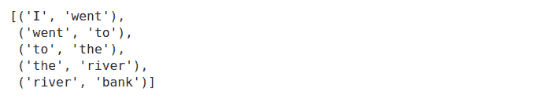
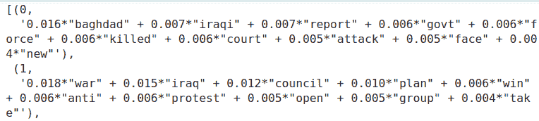
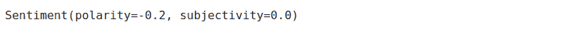
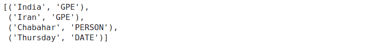
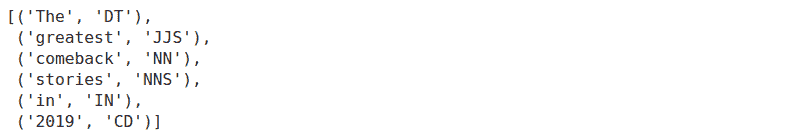
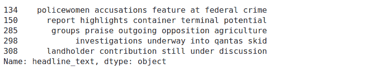

# 自然语言处理的探索性数据分析:Python 工具完全指南

> 原文：<https://web.archive.org/web/https://neptune.ai/blog/exploratory-data-analysis-natural-language-processing-tools>

探索性数据分析是任何机器学习工作流中最重要的部分之一，自然语言处理也不例外。但是**你应该选择哪些工具**来高效地探索和可视化文本数据呢？

在这篇文章中，我们将**讨论和实现几乎所有的主要技术**，你可以用它们来理解你的文本数据，并给你一个完成工作的 Python 工具的完整之旅。

## 开始之前:数据集和依赖项

在本文中，我们将使用来自 Kaggle 的百万新闻标题数据集。如果您想一步一步地进行分析，您可能需要安装以下库:

```py
pip install \
   pandas matplotlib numpy \
   nltk seaborn sklearn gensim pyldavis \
   wordcloud textblob spacy textstat
```

现在，我们可以看看数据。

```py
news= pd.read_csv('data/abcnews-date-text.csv',nrows=10000)
news.head(3)
```


数据集只包含两列，发布日期和新闻标题。

为了简单起见，我将探索这个数据集中的前 **10000 行**。因为标题是按*发布日期*排序的，所以实际上从 2003 年 2 月 19 日*到 2003 年 4 月 7 日*有**两个月。**

好了，我想我们已经准备好开始我们的数据探索了！

## 分析文本统计

文本统计可视化是简单但非常有洞察力的技术。

它们包括:

*   词频分析，
*   句子长度分析，
*   平均字长分析，
*   等等。

这些确实有助于**探索文本数据的基本特征**。

为此，我们将主要使用**直方图**(连续数据)和**条形图**(分类数据)。

首先，我将看看每个句子中出现的字符数。这可以让我们大致了解新闻标题的长度。

```py
news['headline_text'].str.len().hist()

```

[Code snippet that generates this chart](https://web.archive.org/web/20220928195456/https://ui.neptune.ai/o/neptune-ml/org/eda-nlp-tools/n/1-4-top-non-stopwords-barchart-36267acc-a418-4a5f-a3ba-67a3b51dde12/b57bc536-8cec-46a7-918c-60fba6f2c83d)

直方图显示，新闻标题的长度在 10 到 70 个字符之间，通常在 25 到 55 个字符之间。

现在，我们将转到单词级别的数据探索。让我们画出每个新闻标题中出现的字数。

```py
text.str.split().\
    map(lambda x: len(x)).\
    hist()
```

[Code snippet that generates this chart](https://web.archive.org/web/20220928195456/https://ui.neptune.ai/o/neptune-ml/org/eda-nlp-tools/n/1-1-word-number-histogram-aff0bde6-6ad1-45cf-a8f8-68a2ad7da521/e4cee3db-8d07-4dc6-8584-063b11e76809)

很明显，新闻标题的字数在 2 到 12 之间，大部分在 5 到 7 之间。

接下来，让我们检查一下每个句子的平均单词长度。

```py
news['headline_text'].str.split().\
   apply(lambda x : [len(i) for i in x]). \
   map(lambda x: np.mean(x)).hist()
```

[Code snippet that generates this chart](https://web.archive.org/web/20220928195456/https://ui.neptune.ai/o/neptune-ml/org/eda-nlp-tools/n/1-2-word-length-histogram-6204616c-6314-4ddd-9398-fe73415c09ff/e5c67525-6a16-4751-b4c5-4c64c1ad2730)

平均单词长度在 3 到 9 之间，5 是最常见的长度。这是否意味着人们在新闻标题中使用了非常短的单词？让我们找出答案。

这可能不正确的一个原因是停用词。停用词是在任何语言中最常用的词，如*、【the】、【a】、*等。由于这些单词的长度可能很小，这些单词可能会导致上图向左倾斜。

分析停用词的数量和类型可以让我们更好地了解数据。

要获得包含停用词的语料库，您可以使用 [nltk 库](https://web.archive.org/web/20220928195456/https://www.nltk.org/)。Nltk 包含许多语言的停用词。因为我们只处理英语新闻，所以我将从语料库中过滤掉英语停用词。

```py
import nltk
nltk.download('stopwords')
stop=set(stopwords.words('english'))
```

现在，我们将创建语料库。

```py
corpus=[]
new= news['headline_text'].str.split()
new=new.values.tolist()
corpus=[word for i in new for word in i]

from collections import defaultdict
dic=defaultdict(int)
for word in corpus:
    if word in stop:
        dic[word]+=1
```

并绘制顶部停用词。

[Code snippet that generates this chart](https://web.archive.org/web/20220928195456/https://ui.neptune.ai/o/neptune-ml/org/eda-nlp-tools/n/1-3-top-stopwords-barchart-b953763c-3fea-4331-bff0-429411793e5f/5c0fca05-ba07-4564-a02e-c44b08bfb8cb)

我们可以清楚地看到，像“to”、“in”和“for”这样的停用词在新闻标题中占主导地位。

现在我们知道了哪些停用词在我们的文章中频繁出现，让我们检查一下除了这些停用词之外还有哪些词频繁出现。

我们将使用集合库中的[计数器函数](https://web.archive.org/web/20220928195456/https://pymotw.com/2/collections/counter.html)来计数并存储元组列表中每个单词的出现次数。这是一个**非常有用的函数，当我们在自然语言处理中处理单词级分析**时。

We will use the [counter function](https://web.archive.org/web/20220928195456/https://pymotw.com/2/collections/counter.html) from the collections library to count and store the occurrences of each word in a list of tuples. This is a **very useful function when we deal with word-level analysis** in natural language processing.

```py
counter=Counter(corpus)
most=counter.most_common()

x, y= [], []
for word,count in most[:40]:
    if (word not in stop):
        x.append(word)
        y.append(count)

sns.barplot(x=y,y=x)
```

[Code snippet that generates this chart](https://web.archive.org/web/20220928195456/https://ui.neptune.ai/o/neptune-ml/org/eda-nlp-tools/n/1-4-top-non-stopwords-barchart-36267acc-a418-4a5f-a3ba-67a3b51dde12/b57bc536-8cec-46a7-918c-60fba6f2c83d)

哇！“美国”、“伊拉克”和“战争”占据了过去 15 年的头条新闻。

这里的“我们”可以指美国或我们(你和我)。us 不是一个停用词，但是当我们观察图表中的其他单词时，它们都与美国有关——伊拉克战争，这里的“US”可能指的是美国。

Ngram 探索

## n 元语法就是 n 个单词的连续序列。例如《河岸》、《三个火枪手》等。如果字数为二，则称之为 bigram。对于 3 个单词，它被称为三元模型等等。

查看最常见的 n 元语法可以让你更好地理解使用该单词的上下文。

为了实现 n 元语法，我们将使用来自 *nltk.util* 的*n 元语法*函数。例如:

现在我们知道了如何创建 n 元语法，让我们把它们可视化。

```py
from nltk.util import ngrams
list(ngrams(['I' ,'went','to','the','river','bank'],2))
```



为了构建我们的词汇表，我们将使用 *Countvectorizer。* *Countvectorizer* 是一种简单的方法，用于对语料库进行记号化、矢量化，并以适当的形式表示出来。在[*sk learn . feature _ engineering . text*](https://web.archive.org/web/20220928195456/https://scikit-learn.org/stable/modules/generated/sklearn.feature_extraction.text.CountVectorizer.html)中有

有了这些，我们将分析新闻标题中的重要人物。

top _ n _ bigrams = get _ top _ ngram(news[' headline _ text ']，2)[:10] x，y=map(list，zip(* top _ n _ bigrams))SNS . bar plot(x = y，y=x)

```py
def get_top_ngram(corpus, n=None):
    vec = CountVectorizer(ngram_range=(n, n)).fit(corpus)
    bag_of_words = vec.transform(corpus)
    sum_words = bag_of_words.sum(axis=0) 
    words_freq = [(word, sum_words[0, idx]) 
                  for word, idx in vec.vocabulary_.items()]
    words_freq =sorted(words_freq, key = lambda x: x[1], reverse=True)
    return words_freq[:10]
```

top_n_bigrams=get_top_ngram(news[‘headline_text’],2)[:10] x,y=map(list,zip(*top_n_bigrams)) sns.barplot(x=y,y=x)

[Code snippet that generates this chart](https://web.archive.org/web/20220928195456/https://ui.neptune.ai/o/neptune-ml/org/eda-nlp-tools/n/2-0-top-ngrams-barchart-671a187d-c3b4-475a-bc9e-8aa6c937923b/c427446f-7b0e-4621-b791-47b0fd31a39e)

我们可以观察到，与战争有关的“反战”、“阵亡”等连词占据了新闻标题。

三元模型怎么样？

我们可以看到，这些三元组中有许多是由*、*、*、【反战抗议】组合而成的。* **这意味着我们应该努力清理数据**，看看我们能否将这些同义词合并成一个干净的令牌。

```py
top_tri_grams=get_top_ngram(news['headline_text'],n=3)
x,y=map(list,zip(*top_tri_grams))
sns.barplot(x=y,y=x)
```

[Code snippet that generates this chart](https://web.archive.org/web/20220928195456/https://ui.neptune.ai/o/neptune-ml/org/eda-nlp-tools/n/2-0-top-ngrams-barchart-671a187d-c3b4-475a-bc9e-8aa6c937923b/c427446f-7b0e-4621-b791-47b0fd31a39e)

pyLDAvis 主题建模探索

主题建模是**使用无监督学习技术提取文档集合中出现的主要主题的过程。**

## 潜在狄利克雷分配(LDA)是一种易于使用且高效的主题建模模型。每个文档由主题的分布来表示，每个主题由词的分布来表示。

一旦我们按主题对文档进行分类，我们就可以对每个主题或主题组进行进一步的**数据探索。**

但是在进入主题建模之前，我们必须对数据进行一些预处理。我们将:

*:将句子转换成一列标记或单词的过程。*

 ****删除停用词***

*   **:将每个单词的屈折形式缩减为一个共同的基或根。**
*   *****转换为单词包*** :单词包是一个字典，其中的键是单词(或 ngrams/tokens)，值是每个单词在语料库中出现的次数。**
*   **使用 NLTK，您可以轻松地进行标记化和词条化:**
*   **现在，让我们使用 gensim 创建单词袋模型**

 **我们最终可以创建 LDA 模型:

```py
import nltk
nltk.download('punkt')
nltk.download('wordnet')

def preprocess_news(df):
    corpus=[]
    stem=PorterStemmer()
    lem=WordNetLemmatizer()
    for news in df['headline_text']:
        words=[w for w in word_tokenize(news) if (w not in stop)]

        words=[lem.lemmatize(w) for w in words if len(w)>2]

        corpus.append(words)
    return corpus

corpus=preprocess_news(news)
```

题目 0 表示与伊拉克战争和警察有关的东西。主题 3 显示澳大利亚卷入伊拉克战争。

```py
dic=gensim.corpora.Dictionary(corpus)
bow_corpus = [dic.doc2bow(doc) for doc in corpus]
```

您可以打印所有的主题并尝试理解它们，但是有一些工具可以帮助您更有效地进行数据探索。一个这样的工具是 [pyLDAvis](https://web.archive.org/web/20220928195456/https://github.com/bmabey/pyLDAvis) ，它**交互地可视化 LDA 的结果。**

```py
lda_model = gensim.models.LdaMulticore(bow_corpus, 
                                   num_topics = 4, 
                                   id2word = dic,                                    
                                   passes = 10,
                                   workers = 2)
lda_model.show_topics()
```



The topic 0 indicates something related to the Iraq war and police. Topic 3 shows the involvement of Australia in the Iraq war.

在左侧，每个圆圈的**区域代表主题**相对于语料库的重要性。因为有四个主题，所以我们有四个圈。

```py
pyLDAvis.enable_notebook()
vis = pyLDAvis.gensim.prepare(lda_model, bow_corpus, dic)
vis
```

[Code snippet that generates this chart](https://web.archive.org/web/20220928195456/https://ui.neptune.ai/o/neptune-ml/org/eda-nlp-tools/n/3-0-topic-modeling-vis-ddd6a861-62d0-40cb-9207-ebd5b47d74d0/e7cb3e68-cc7b-443e-992b-414640a55a0b)

圆心之间的**距离表示主题之间的相似度**。在这里，您可以看到主题 3 和主题 4 重叠，这表明主题更加相似。

*   在右侧，每个话题的**直方图显示了前 30 个相关词**。例如，在主题 1 中，最相关的单词是警察、新闻、五月、战争等
*   所以在我们的案例中，我们可以在新闻标题中看到大量与战争相关的词汇和话题。
*   Wordcloud

Wordcloud 是一种表现文本数据的好方法。出现在单词云中的每个单词的大小和颜色表明了它的频率或重要性。

## 用 python 创建 [wordcloud 很容易，但是我们需要语料库形式的数据。幸运的是，我在上一节中准备了它。](https://web.archive.org/web/20220928195456/https://amueller.github.io/word_cloud/index.html)

Wordcloud is a great way to represent text data. The size and color of each word that appears in the wordcloud indicate it’s frequency or importance.

同样，您可以看到与战争相关的术语被突出显示，这表明这些词在新闻标题中频繁出现。

```py
from wordcloud import WordCloud, STOPWORDS
stopwords = set(STOPWORDS)

def show_wordcloud(data):
    wordcloud = WordCloud(
        background_color='white',
        stopwords=stopwords,
        max_words=100,
        max_font_size=30,
        scale=3,
        random_state=1)

    wordcloud=wordcloud.generate(str(data))

    fig = plt.figure(1, figsize=(12, 12))
    plt.axis('off')

    plt.imshow(wordcloud)
    plt.show()

show_wordcloud(corpus)
```

[Code snippet that generates this chart](https://web.archive.org/web/20220928195456/https://ui.neptune.ai/o/neptune-ml/org/eda-nlp-tools/n/4-0-wordclouds-853dfded-4d17-4f37-83e4-15ec53f74e60/5833b046-3cf9-4c0f-8fbf-4a5933da924e)

有**许多参数可以调整**。一些最突出的例子是:

*:被阻止在图像中出现的一组单词。*

 ****max_words*** :显示最大字数。

*   ***max_font_size*** :最大字体大小。
*   有更多的选择来创建美丽的单词云。更多详情可以参考这里。
*   情感分析

情感分析是一项非常常见的自然语言处理任务，我们在其中确定文本是正面、负面还是中性的。这对于发现与评论相关的情感非常有用，评论可以让我们从文本数据中获得一些有价值的见解。

## 有很多项目会帮助你用 python 做情感分析。我个人喜欢 [TextBlob](https://web.archive.org/web/20220928195456/https://github.com/sloria/TextBlob) 和[维德的情调。](https://web.archive.org/web/20220928195456/https://github.com/cjhutto/vaderSentiment)

文本 blob

Textblob 是构建在 nltk 之上的 python 库。它已经存在了一段时间，使用起来非常简单方便。

### TextBlob 的情感函数返回两个属性:

***极性:*** 是位于 *[-1，1]* 范围内的浮点数，其中 **1 表示正**语句， **-1 表示负**语句。

***主观性:*** 指**某人的判断是如何被个人观点**和感受所塑造的。主观性表示为位于[0，1]范围内的浮点值。

*   我将在我们的新闻标题上运行这个功能。
*   TextBlob 声称文本*“100 人在伊拉克丧生”*是负面的，不是一种观点或感觉，而是一种事实陈述。我想我们可以同意 TextBlob 的观点。

既然我们知道了如何计算这些情感分数**，我们就可以使用直方图来可视化它们，并进一步探索数据。**

```py
from textblob import TextBlob
TextBlob('100 people killed in Iraq').sentiment
```



TextBlob claims that the text *“100 people killed in Iraq”* is negative and is not an opinion or feeling but rather a factual statement. I think we can agree with TextBlob here.

可以看到极性主要在 0.00 到 0.20 之间。这表明大多数新闻标题是中性的。

```py
def polarity(text):
    return TextBlob(text).sentiment.polarity

news['polarity_score']=news['headline_text'].\
   apply(lambda x : polarity(x))
news['polarity_score'].hist()
```

[Code snippet that generates this chart](https://web.archive.org/web/20220928195456/https://ui.neptune.ai/o/neptune-ml/org/eda-nlp-tools/n/5-0-polarity-score-histogram-7435097b-2554-423d-82f9-a4dfce94ea9b#state=cac0f382-5483-48bb-8b86-d684b92b2190&code=8wztFsr_7DtvPSsM3xCyK9TE4leIVsx9UUK3JhAkpo0.85db2d27-454e-4eca-9ff9-ef66a986d643)

让我们再深入一点，根据分数将新闻分为负面、正面和中性。

You can see that the polarity mainly ranges between 0.00 and 0.20\. This indicates that the **majority of the news headlines are neutral.**

是的，70 %的新闻是中性的，只有 18%是正面的，11%是负面的。

```py
def sentiment(x):
    if x<0:
        return 'neg'
    elif x==0:
        return 'neu'
    else:
        return 'pos'

news['polarity']=news['polarity_score'].\
   map(lambda x: sentiment(x))

plt.bar(news.polarity.value_counts().index,
        news.polarity.value_counts())
```

[Code snippet that generates this chart](https://web.archive.org/web/20220928195456/https://ui.neptune.ai/o/neptune-ml/org/eda-nlp-tools/n/5-1-sentiment-barchart-1da2f77b-db4e-4636-b186-0328dcbb791b/ea6a3450-6d61-4b3f-9274-f1f0c241fa5c)

让我们来看看**一些正面和负面的标题。**

积极的新闻标题大多是关于体育运动中的一些胜利。

是的，非常负面的新闻标题。

```py
news[news['polarity']=='pos']['headline_text'].head()

```

维德情感分析

```py
news[news['polarity']=='neg']['headline_text'].head()

```

我们要讨论的下一个图书馆是 VADER。维德在探测负面情绪方面表现更好。在社交媒体文本情感分析的情况下非常有用。

### **VADER 或价感知词典和情感推理机**是一个基于规则/词典的开源情感分析器预建库，受麻省理工学院许可证保护。

VADER 情感分析类**返回一个字典，该字典包含文本正面、负面和中性的概率。**然后我们就可以筛选选择概率最大的情感。

我们将使用 VADER 做同样的分析，并检查是否有很大的差异。

VADER sentiment analysis class **returns a dictionary that contains the probabilities of the text for being positive, negative and neutral.** Then we can filter and choose the sentiment with most probability.

是的，在分布上有一点点不同。甚至更多的标题被归类为中性 85 %，负面新闻标题的数量有所增加(至 13 %)。

```py
from nltk.sentiment.vader import SentimentIntensityAnalyzer

nltk.download('vader_lexicon')
sid = SentimentIntensityAnalyzer()

def get_vader_score(sent):

    ss = sid.polarity_scores(sent)

    return np.argmax(list(ss.values())[:-1])

news['polarity']=news['headline_text'].\
    map(lambda x: get_vader_score(x))
polarity=news['polarity'].replace({0:'neg',1:'neu',2:'pos'})

plt.bar(polarity.value_counts().index,
        polarity.value_counts())
```

[Code snippet that generates this chart](https://web.archive.org/web/20220928195456/https://ui.neptune.ai/o/neptune-ml/org/eda-nlp-tools/n/5-1-sentiment-barchart-1da2f77b-db4e-4636-b186-0328dcbb791b/ea6a3450-6d61-4b3f-9274-f1f0c241fa5c)

命名实体识别

命名实体识别是一种信息提取方法，其中文本中存在的实体被分类为预定义的实体类型，如“人”、“地点”、“组织”等。通过使用 **NER，我们可以获得关于给定文本数据集**中存在的实体类型的深刻见解。

## 让我们考虑一篇新闻报道的例子。

在上面的新闻中，命名实体识别模型应该能够识别诸如 RBI 作为一个组织，Mumbai 和 India 作为地点等实体。

有三个标准库可以进行命名实体识别:

[](https://web.archive.org/web/20220928195456/https://economictimes.indiatimes.com/industry/banking/finance/banking/rbi-warns-banks-over-focus-on-retail-loans/articleshow/72962399.cms?from=mdr)

The Economic Times – Indian Times 2019

在本教程中，**我将使用 spaCy** ，这是一个用于高级自然语言处理任务的开源库。它是用 Cython 编写的，以其工业应用而闻名。除了 NER， **spaCy 还提供了许多其他功能，如词性标注、词到向量转换等。**

[SpaCy 的命名实体识别](https://web.archive.org/web/20220928195456/https://spacy.io/api/annotation#section-named-entities)已经在 [OntoNotes 5](https://web.archive.org/web/20220928195456/https://catalog.ldc.upenn.edu/LDC2013T19) 语料库上进行训练，它支持以下实体类型:

spaCy 的英语有三种[预训练模式。我将使用 *en_core_web_sm* 来完成我们的任务，但您可以尝试其他模型。](https://web.archive.org/web/20220928195456/https://spacy.io/models/en/)

要使用它，我们必须先下载它:

现在我们可以初始化语言模型了:

Spacy 的一个好处是我们只需要应用 *nlp 函数*一次，整个后台管道就会返回我们需要的对象。

```py
python -m spacy download en_core_web_sm

```

我们可以看到，印度和伊朗被认为是地理位置(GPE)，Chabahar 是人，星期四是日期。

```py
import spacy

nlp = spacy.load("en_core_web_sm")
```

我们也可以使用 spaCy 中的 *displacy* 模块来可视化输出。

```py
doc=nlp('India and Iran have agreed to boost the economic viability \
of the strategic Chabahar port through various measures, \
including larger subsidies to merchant shipping firms using the facility, \
people familiar with the development said on Thursday.')

[(x.text,x.label_) for x in doc.ents]
```



这创建了一个非常简洁的句子的可视化**,其中每个实体类型用不同的颜色标记。**

现在我们知道了如何执行 NER，我们可以通过对从数据集中提取的命名实体进行各种可视化来进一步探索数据。

```py
from spacy import displacy

displacy.render(doc, style='ent')
```

首先，我们将在新闻标题上运行命名实体识别并存储实体类型。

现在，我们可以可视化实体频率:

First, we will **run the named entity recognition on our news** headlines and store the entity types.

```py
def ner(text):
    doc=nlp(text)
    return [X.label_ for X in doc.ents]

ent=news['headline_text'].\
    apply(lambda x : ner(x))
ent=[x for sub in ent for x in sub]

counter=Counter(ent)
count=counter.most_common()
```

现在我们可以看到，GPE 和 ORG 占据了新闻标题，其次是 PERSON 实体。

```py
x,y=map(list,zip(*count))
sns.barplot(x=y,y=x)
```

[Code snippet that generates this chart](https://web.archive.org/web/20220928195456/https://ui.neptune.ai/o/neptune-ml/org/eda-nlp-tools/n/6-0-named-entity-barchart-9012f4a0-3761-4ebf-9c25-d4f363858010/ac08ec73-ddd3-4a42-a35b-b2311eb9d075)

我们还可以**可视化每个实体最常见的令牌。**我们来看看哪些地方在新闻标题中出现的次数最多。

Now we can see that the GPE and ORG dominate the news headlines followed by the PERSON entity.

我想我们可以确认这样一个事实，即新闻标题中的“美国”指的是美国。让我们也找出新闻标题中最常见的名字。

```py
def ner(text,ent="GPE"):
    doc=nlp(text)
    return [X.text for X in doc.ents if X.label_ == ent]

gpe=news['headline_text'].apply(lambda x: ner(x))
gpe=[i for x in gpe for i in x]
counter=Counter(gpe)

x,y=map(list,zip(*counter.most_common(10)))
sns.barplot(y,x)
```

[Code snippet that generates this chart](https://web.archive.org/web/20220928195456/https://ui.neptune.ai/o/neptune-ml/org/eda-nlp-tools/n/6-1-most-common-named-entity-barchart-0614fdac-0400-4460-ac3a-b3c5669906a0/4d3d398d-df9d-484c-97ec-07390ba4dd21)

萨达姆·侯赛因和乔治·布什是战时伊拉克和美国的总统。此外，我们可以看到，该模型在将*“维克政府”*或*“新南威尔士州政府”*归类为个人而非政府机构方面远非完美。

```py
per=news['headline_text'].apply(lambda x: ner(x,"PERSON"))
per=[i for x in per for i in x]
counter=Counter(per)

x,y=map(list,zip(*counter.most_common(10)))
sns.barplot(y,x)
```

[Code snippet that generates this chart](https://web.archive.org/web/20220928195456/https://ui.neptune.ai/o/neptune-ml/org/eda-nlp-tools/n/6-1-most-common-named-entity-barchart-0614fdac-0400-4460-ac3a-b3c5669906a0/4d3d398d-df9d-484c-97ec-07390ba4dd21)

探索 Python 中的词性标注

词性(POS)标注是一种**方法，将词性标签分配给句子中的单词。**有八种主要的词类:

## 名词(NN)-约瑟夫，伦敦，桌子，猫，老师，钢笔，城市

动词(VB)-读，说，跑，吃，玩，住，走，有，喜欢，是，是

*   形容词(JJ)-美丽，快乐，悲伤，年轻，有趣，三
*   副词(RB)-慢慢地，悄悄地，非常，总是，从来没有，太，嗯，明天
*   介词(在)-在，在，在，从，与，近，之间，大约，在
*   连词(CC)- and，or，but，因为，所以，然而，除非，既然，如果
*   代词(PRP)-我，你，我们，他们，他，她，它，我，我们，他们，他，她，这个
*   感叹词(INT)-哎哟！哇！太好了！救命啊！哦！嘿！嗨！
*   这不是一项简单的任务，因为同一个词可能在不同的上下文中用在不同的句子中。然而，一旦你这样做了，你就可以创建许多有用的可视化工具，让你对数据集有更多的了解。
*   我将使用 nltk 来做词性标注，但是也有其他做得很好的库(spacy，textblob)。

让我们看一个例子。

注意:

我们可以在这里观察到各种依赖标签。例如， *DET* 标签表示限定词“the”和名词“stories”之间的关系。

```py
import nltk
sentence="The greatest comeback stories in 2019"
tokens=word_tokenize(sentence)
nltk.pos_tag(tokens)
```



```py
doc = nlp('The greatest comeback stories in 2019')
displacy.render(doc, style='dep', jupyter=True, options={'distance': 90})
```

你可以在这里查看依赖标签列表及其含义[。](https://web.archive.org/web/20220928195456/https://universaldependencies.org/u/dep/index.html)

好了，现在我们知道了什么是词性标注，让我们用它来研究我们的标题数据集。

You can check the list of dependency tags and their meanings [here](https://web.archive.org/web/20220928195456/https://universaldependencies.org/u/dep/index.html).

我们可以清楚地看到，名词(NN)在新闻标题中占主导地位，其次是形容词(JJ)。这对于新闻文章来说是典型的，而对于艺术形式来说，更高的形容词(ADJ)频率可能发生得相当多。

```py
def pos(text):
    pos=nltk.pos_tag(word_tokenize(text))
    pos=list(map(list,zip(*pos)))[1]
    return pos

tags=news['headline_text'].apply(lambda x : pos(x))
tags=[x for l in tags for x in l]
counter=Counter(tags)

x,y=list(map(list,zip(*counter.most_common(7))))
sns.barplot(x=y,y=x)
```

[Code snippet that generates this chart](https://web.archive.org/web/20220928195456/https://ui.neptune.ai/o/neptune-ml/org/eda-nlp-tools/n/7-0-parts-of-speach-barchart-9140250c-50d2-4343-b5e2-b3f5fb9c2089/15b07733-f02d-4a7c-b2fc-05ecffdf3e7b)

你可以通过调查哪一个单数名词在新闻标题中最常见来深入了解这个问题。让我们来了解一下。

We can clearly see that the noun (NN) dominates in news headlines followed by the adjective (JJ). This is typical for news articles while **for artistic forms higher adjective(ADJ) frequency** could happen quite a lot.

*“战争”、“伊拉克”、“人”*等名词在新闻标题中占据主导地位。您可以使用上面的函数可视化和检查其他词类。

```py
def get_adjs(text):
    adj=[]
    pos=nltk.pos_tag(word_tokenize(text))
    for word,tag in pos:
        if tag=='NN':
            adj.append(word)
    return adj

words=news['headline_text'].apply(lambda x : get_adjs(x))
words=[x for l in words for x in l]
counter=Counter(words)

x,y=list(map(list,zip(*counter.most_common(7))))
sns.barplot(x=y,y=x)
```

[Code snippet that generates this chart](https://web.archive.org/web/20220928195456/https://ui.neptune.ai/o/neptune-ml/org/eda-nlp-tools/n/7-1-most-common-part-of-speach-barchart-3f896e91-e21c-4ea7-811f-02acb497479f/a41302f3-8803-47ce-98e5-bb1a73eda5cc)

探索文本的复杂性

了解文本的可读性(难读性)以及什么类型的读者能够完全理解它是非常有益的。我们需要大学学历才能理解这个信息吗？还是一个一年级的学生就能清楚地明白重点是什么？

## 实际上，你可以在文档或文本上标注一个叫做可读性指数的数字。可读性指数是一个数值，表示阅读和理解文本的难易程度。

有许多可读性分数公式可用于英语。一些最突出的例子是:

You can actually put a number called readability index on a document or text. **Readability index is a numeric value that indicates how difficult (or easy) it is to read and understand a text.**

可读性测试

解释

公式

自动化可读性索引

输出是理解一篇文章所需的美国等级水平的近似表示。

ARI = 4.71 *(字符/单词)+
0.5 *(单词/句子)-21.43

Interpretation:

轻松阅读(FRE)

Formula:

更高的分数表示材料更容易阅读，
更低的数字表示更难阅读的段落:
–0-30 岁大学
–50-60 岁高中
–60 岁+四年级

FRE = 206.8351.015 *(总字数/总句子数)
-84.6 *(总音节数/总字数)

Interpretation:

FleschKincaid 等级级别(FKGL)

Formula:

结果是一个与美国年级水平相对应的数字。

FKGL = 0.39 *(总字数/总句子数)
+ 11.8(总音节数/总字数)-15.59

Interpretation:

结果是一个与美国年级水平相对应的数字。

Formula:

GFI = 0.4 *(单词/句子)+
100 *(复合词/单词))

Interpretation:

The result is a number that corresponds with a U.S grade level.

Formula:

Textstat 是一个很酷的 Python 库，它提供了所有这些文本统计计算方法的实现。让我们用 Textstat 来实现 Flesch 阅读容易指数。

现在，您可以绘制分数的直方图并可视化输出。

[Textstat](https://web.archive.org/web/20220928195456/https://github.com/shivam5992/textstat) is a cool Python library that provides an implementation of all these text statistics calculation methods. Let’s use Textstat to implement Flesch Reading Ease index.

几乎所有的可读性分数都在 60 分以上。这意味着一个普通的 11 岁学生可以阅读和理解新闻标题。让我们检查可读性分数低于 5 分的所有新闻标题。

```py
from textstat import flesch_reading_ease

news['headline_text'].\
   apply(lambda x : flesch_reading_ease(x)).hist()
```

[Code snippet that generates this chart](https://web.archive.org/web/20220928195456/https://ui.neptune.ai/o/neptune-ml/org/eda-nlp-tools/n/8-0-text-complexity-histogram-b00e38f2-5710-4efe-85c2-77b6366dbe3b/b6b8dd8f-3ec6-4fd1-a548-7daf889444e5)

你可以在新闻标题中看到一些复杂的词汇，如*“投降”、“过渡”、“诱捕”*等。这些话可能导致分数降到了 5 分以下。

最后的想法

```py
x=[i for i in range(len(reading)) if reading[i]<5]
news.iloc[x]['headline_text'].head()
```



在本文中，我们讨论并实现了针对文本数据的各种探索性数据分析方法。有些很常见，有些不太为人所知，但所有这些都是对您的数据探索工具包的巨大补充。

## 希望您会发现其中一些对您当前和未来的项目有用。

为了使数据探索更加容易，我创建了一个**“自然语言处理探索性数据分析模板”**，您可以在工作中使用它。

Hopefully, you will find some of them useful in your current and future projects.

To make data exploration even easier, I have created a  **“Exploratory Data Analysis for Natural Language Processing Template”** that you can use for your work.

[Get exploratory data analysis for Natural Language Processing template](https://web.archive.org/web/20220928195456/https://ui.neptune.ai/o/neptune-ml/org/eda-nlp-tools/n/8-0-text-complexity-histogram-b00e38f2-5710-4efe-85c2-77b6366dbe3b/95b28cf3-a123-4104-bdd9-358e123b8a58)

此外，正如您可能已经看到的，对于本文中的每个图表，都有一个代码片段来创建它。只需点击图表下方的按钮。

探索愉快！

沙胡尔 ES

数据科学家，非常熟悉机器学习、NLP 和音频处理领域。他是 Kaggle 大师，也喜欢做开源。

### **阅读下一篇**

如何构建和管理自然语言处理(NLP)项目

* * *

Dhruvil Karani |发布于 2020 年 10 月 12 日

## How to Structure and Manage Natural Language Processing (NLP) Projects

如果说我在 ML 行业工作中学到了什么的话，那就是:**机器学习项目很乱。**

这并不是说人们不想把事情组织起来，只是在项目过程中有很多事情很难组织和管理。

你可以从头开始，但有些事情会阻碍你。

一些典型的原因是:

笔记本中的快速数据探索，

取自 github 上的研究报告的模型代码，

*   当一切都已设置好时，添加新的数据集，
*   发现了数据质量问题并且需要重新标记数据，
*   团队中的某个人“只是快速地尝试了一些东西”,并且在没有告诉任何人的情况下改变了训练参数(通过 argparse 传递),
*   从高层推动将原型转化为产品“仅此一次”。
*   多年来，作为一名机器学习工程师，我学到了一堆**东西，它们可以帮助你保持在事物的顶端，并检查你的 NLP 项目**(就像你真的可以检查 ML 项目一样:)。
*   在这篇文章中，我将分享我在从事各种数据科学项目时学到的关键指针、指南、技巧和诀窍。许多东西在任何 ML 项目中都是有价值的，但有些是 NLP 特有的。

Over the years working as a machine learning engineer I’ve learned a bunch of **things that can help you stay on top of things and keep your NLP projects in check** (as much as you can really have ML projects in check:)). 

In this post I will share key pointers, guidelines, tips and tricks that I learned while working on various data science projects. Many things can be valuable in any ML project but some are specific to NLP. 

[Continue reading ->](/web/20220928195456/https://neptune.ai/blog/how-to-structure-and-manage-nlp-projects-templates)

* * *****