# 天然气水合物抑制剂失效模式:如何识别和监控

> 原文：<https://web.archive.org/web/https://neptune.ai/blog/gan-failure-modes>

一个[生成对抗网络](/web/20220926102431/https://neptune.ai/blog/generative-adversarial-networks-gan-applications)是两个子网络的组合，它们在训练时相互竞争，以便生成真实的数据。发生器网络产生看起来真实的人造数据，而鉴别器网络识别数据是人造的还是真实的。

虽然甘是强大的模型，但他们可能很难训练。我们同时训练发生器和鉴别器，彼此牺牲。这是一个动态系统，只要一个模型的参数被更新，优化问题的性质就会改变，因此，达到收敛可能是困难的。

训练还会导致 GANs 的**失败，无法模拟完整的分布，这也被称为**模式崩溃**。**

在本文中:

*   我们将看到如何训练一个稳定的 GAN 模型
*   然后将试验训练过程以理解模式失败的可能原因。

过去几年我一直在训练 GANs，我观察到，GANs 中常见的故障模式是**模式崩溃**和**收敛故障**，我们将在本文中讨论。

训练稳定的 GAN 网络

## 为了理解失败(在训练 GAN 中)是如何发生的，让我们首先训练一个稳定的 GAN 网络。我们将使用 [MNIST 数据集](https://web.archive.org/web/20220926102431/http://yann.lecun.com/exdb/mnist/)，我们的目标是使用生成器网络从随机噪声中生成人工手写数字。

生成器将随机噪声作为输入，输出为 28×28 大小的假手写数字。鉴别器将从生成器和地面实况中获取输入的 28×28 图像，并尝试对它们进行正确分类。

我把学习率 0.0002，adam optimizer，和 0.5 作为 adam optimizer 的动量。

先来看看我们稳定的 GAN 网络的代码。首先，让我们进行所需的导入。

注意，在这个练习中，我们将使用 PyTorch 来训练我们的模型，使用 neptune.ai 的仪表板来进行实验跟踪。这里是我所有实验的链接。我在 colab 和 Neptune 中运行脚本，使得跟踪所有实验变得非常容易。

```py
import torch
import torch.nn as nn
import torchvision.transforms as transforms
import torch.optim as optim
import torchvision.datasets as datasets
import numpy as np
from torchvision.utils import make_grid
from torch.utils.data import DataLoader
from tqdm import tqdm

import neptune.new as neptune
from neptune.new.types import File
```

在这种情况下，适当的实验跟踪非常重要，因为损失图和中间图像可以很好地帮助识别是否存在故障模式。或者可以使用 matplotlib、[神圣](https://web.archive.org/web/20220926102431/https://github.com/IDSIA/sacred)、 [TensorBoard](https://web.archive.org/web/20220926102431/https://www.tensorflow.org/tensorboard) 等。也取决于您的使用情况和舒适度。

我们首先初始化 Neptune 的运行，一旦您在 Neptune 仪表板上创建了一个项目，您就可以[获得项目路径和 API 令牌](https://web.archive.org/web/20220926102431/https://docs.neptune.ai/getting-started/installation#authentication-neptune-api-token)。

我们将批次大小保持为 1024，我们将运行 100 个时期。潜在维度被初始化以生成用于生成器输入的随机数据。和样本大小将用于推断每个时期的 64 个图像，因此我们可以在每个时期之后可视化图像的质量。k 是我们打算运行 discriminator 的步骤数。

```py
run = neptune.init(
   project="project name",
   api_token="You API token",
)
```

现在，我们下载 MNIST 数据并创建 Dataloader 对象。

```py
batch_size = 1024
epochs = 100
sample_size = 64
latent_dim = 128
k = 1
device = torch.device('cuda' if torch.cuda.is_available() else 'cpu')

transform = transforms.Compose([
                               transforms.ToTensor(),
                               transforms.Normalize((0.5,), (0.5,)),
           ])

```

最后，我们定义了一些用于训练的超参数，并使用 run object 将它们传递给 Neptune 仪表板。

```py
train_data = datasets.MNIST(
   root='../input/data',
   train=True,
   download=True,
   transform=transform
)
train_loader = DataLoader(train_data, batch_size=batch_size, shuffle=True)
```

这是我们定义发生器和鉴别器网络的地方。

```py
params = {"learning_rate": 0.0002,
         "optimizer": "Adam",
         "optimizer_betas": (0.5, 0.999),
         "latent_dim": latent_dim}

run["parameters"] = params
```

发电机网络

### 发电机模型以潜在空间作为输入，这是一个随机噪声。

*   在第一层中，我们将潜在空间(维数为 128)转换为 128 个通道的特征空间，每个通道的高度和宽度为 7×7。
*   在两个反卷积层之后，增加特征空间的高度和宽度。
*   随后是具有 tanh 激活的卷积层，以生成具有一个通道和 28×28 高度和宽度的图像。
*   鉴别器网络

```py
class Generator(nn.Module):
   def __init__(self, latent_space):
       super(Generator, self).__init__()
       self.latent_space = latent_space
       self.fcn = nn.Sequential(
           nn.Linear(in_features=self.latent_space, out_features=128*7*7),
           nn.LeakyReLU(0.2),
       )

       self.deconv = nn.Sequential(
           nn.ConvTranspose2d(in_channels=128, out_channels=128, kernel_size=(4, 4), stride=(2, 2), padding=(1, 1)),
           nn.LeakyReLU(0.2),

           nn.ConvTranspose2d(in_channels=128, out_channels=128, kernel_size=(4, 4), stride=(2, 2), padding=(1, 1)),
           nn.LeakyReLU(0.2),

           nn.Conv2d(in_channels=128, out_channels=1, kernel_size=(3, 3), padding=(1, 1)),
           nn.Tanh()
       )

   def forward(self, x):
       x = self.fcn(x)
       x = x.view(-1, 128, 7, 7)
       x = self.deconv(x)
       return x
```

### 我们的鉴别器网络由两个卷积层组成，用于从来自生成器的图像和真实图像中生成特征。

*   后面是分类器层，通过鉴别器对图像预测是真的还是假的进行分类。
*   现在我们初始化发生器和鉴别器网络，以及优化器和损失函数。

```py
class Discriminator(nn.Module):
   def __init__(self):
       super(Discriminator, self).__init__()
       self.conv = nn.Sequential(
           nn.Conv2d(in_channels=1, out_channels=64, kernel_size=(4, 4), stride=(2, 2), padding=(1, 1)),
           nn.LeakyReLU(0.2),

           nn.Conv2d(in_channels=64, out_channels=64, kernel_size=(4, 4), stride=(2, 2), padding=(1, 1)),
           nn.LeakyReLU(0.2)
       )
       self.classifier = nn.Sequential(
           nn.Linear(in_features=3136, out_features=1),
           nn.Sigmoid()
       )

   def forward(self, x):
       x = self.conv(x)
       x = x.view(x.size(0), -1)
       x = self.classifier(x)
       return x
```

我们有一些辅助函数，为假图像和真图像创建标签(其中 size 是批量大小),还有 create_noise 函数用于生成器输入。

发电机培训功能

```py
generator = Generator(latent_dim).to(device)
discriminator = Discriminator().to(device)

optim_g = optim.Adam(generator.parameters(), lr=0.0002, betas=(0.5, 0.999))
optim_d = optim.Adam(discriminator.parameters(), lr=0.0002, betas=(0.5, 0.999))

criterion = nn.BCELoss()
def label_real(size):
   labels = torch.ones(size, 1)
   return labels.to(device)

def label_fake(size):
   labels = torch.zeros(size, 1)
   return labels.to(device)

def create_noise(sample_size, latent_dim):
   return torch.randn(sample_size, latent_dim).to(device)
```

### 现在我们将训练发电机:

生成器接收随机噪声并给出假图像。

*   这些伪图像然后被发送到鉴别器，现在我们最小化真实标签和鉴别器预测的伪图像之间的损失。
*   从这个函数中，我们将观察发电机损耗。
*   鉴别器训练功能

```py
def train_generator(optimizer, data_fake):
   b_size = data_fake.size(0)
   real_label = label_real(b_size)
   optimizer.zero_grad()
   output = discriminator(data_fake)
   loss = criterion(output, real_label)
   loss.backward()
   optimizer.step()
   return loss
```

### 我们创建一个函数 train_discriminator:

我们知道，这个网络在训练时从地面真实图像(即真实图像)和生成器网络(即虚假图像)获取输入。

*   一个接一个，我们通过假的和真的图像，计算损失和反馈。我们将观察到两个鉴别器损耗；实像损失(loss_real)和伪像损失(loss_fake)。
*   甘模特培训

```py
def train_discriminator(optimizer, data_real, data_fake):
   b_size = data_real.size(0)
   real_label = label_real(b_size)
   fake_label = label_fake(b_size)
   optimizer.zero_grad()
   output_real = discriminator(data_real)
   loss_real = criterion(output_real, real_label)
   output_fake = discriminator(data_fake)
   loss_fake = criterion(output_fake, fake_label)
   loss_real.backward()
   loss_fake.backward()
   optimizer.step()
   return loss_real, loss_fake
```

### 现在我们有了所有的函数，让我们来训练我们的模型，并查看观察结果，以确定训练是否稳定。

第一行中的噪声将用于推断每个时期之后的中间图像。我们保持噪声不变，这样我们就可以比较不同时期的图像。

*   现在，对于每个时期，我们训练鉴别器 k 次(在这种情况下一次为 k=1)，每次训练发生器。
*   所有的损失都被记录下来并发送到 Neptune dashboard 进行绘图。我们不需要将它们添加到列表中，使用 Neptune dashboard 我们可以即时绘制损失图。它还将在. csv 文件中记录每一步的损失。
*   我已经使用[点]上传功能在 Neptune 元数据中保存了每个纪元后生成的图像。
*   让我们看看中间的图像。

```py
noise = create_noise(sample_size, latent_dim)
generator.train()
discriminator.train()

for epoch in range(epochs):
   loss_g = 0.0
   loss_d_real = 0.0
   loss_d_fake = 0.0

   for bi, data in tqdm(enumerate(train_loader), total=int(len(train_data) / train_loader.batch_size)):
       image, _ = data
       image = image.to(device)
       b_size = len(image)
       for step in range(k):
           data_fake = generator(create_noise(b_size, latent_dim)).detach()
           data_real = image
           loss_d_fake_real = train_discriminator(optim_d, data_real, data_fake)
           loss_d_real += loss_d_fake_real[0]
           loss_d_fake += loss_d_fake_real[1]
       data_fake = generator(create_noise(b_size, latent_dim))
       loss_g += train_generator(optim_g, data_fake)

   generated_img = generator(noise).cpu().detach()
   generated_img = make_grid(generated_img)
   generated_img = np.moveaxis(generated_img.numpy(), 0, -1)
   run[f'generated_img/{epoch}'].upload(File.as_image(generated_img))
   epoch_loss_g = loss_g / bi
   epoch_loss_d_real = loss_d_real/bi
   epoch_loss_d_fake = loss_d_fake/bi
   run["train/loss_generator"].log(epoch_loss_g)
   run["train/loss_discriminator_real"].log(epoch_loss_d_real)
   run["train/loss_discriminator_fake"].log(epoch_loss_d_fake)

   print(f"Epoch {epoch} of {epochs}")
   print(f"Generator loss: {epoch_loss_g:.8f}, Discriminator loss fake: {epoch_loss_d_fake:.8f}, Discriminator loss real: {epoch_loss_d_real:.8f}")
```

时代 10

#### 这些是在时期 10 产生的 64 位数字。

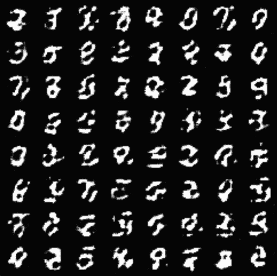

*Fig. 1 – Digits generated from a stable GAN at 10th epoch | Source: Author*

纪元 100 年

#### 这些是在时段 100 使用相同的噪声生成的。这些看起来比 epoch 10 的图像好得多，在这里我们实际上可以识别不同的数字。我们可以训练更多的时期或调整超参数以获得更好的图像质量。

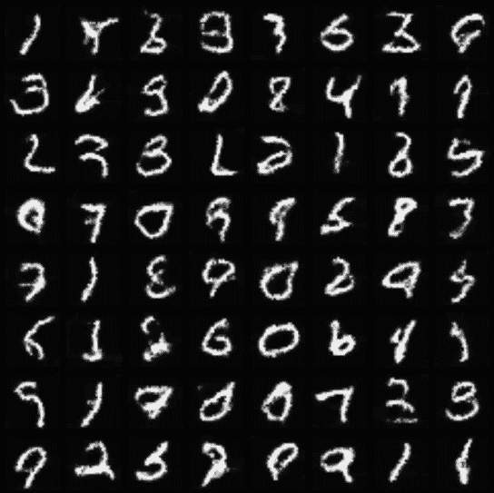

**Fig. 2 –** *Digits generated from a stable GAN at the 100th epoch | Source: Author*

损失图

### 你可以很容易地进入 Neptune dashboard 中的“Add New Dashboard ”,将不同的亏损图表合并成一个图表。

在图 3 中，您可以观察到在 40 时段后损失趋于稳定。真实和虚假图像的鉴别器损耗保持在 0.6 左右，而发生器的鉴别器损耗在 0.8 左右。上图是稳定训练的预期图。我们可以将此视为基线，并尝试改变 k(鉴别器的训练步骤)、增加历元数等。

[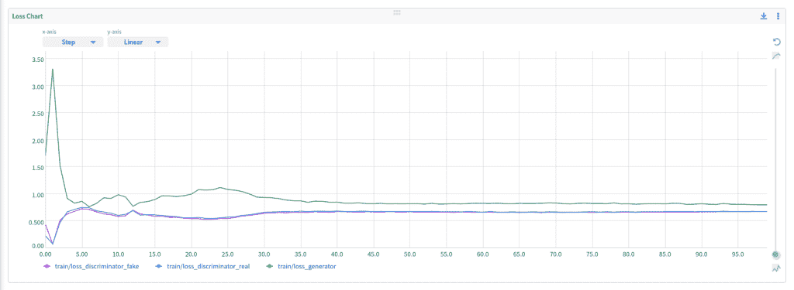](https://web.archive.org/web/20220926102431/https://i0.wp.com/neptune.ai/wp-content/uploads/Fig3_loss_stable_gans.png?ssl=1)

**Fig. 3 –* Loss graph, the three lines indicate a loss for generator, fake images on discriminator, and real images on discriminator | [Source](https://web.archive.org/web/20220926102431/https://app.neptune.ai/tanayag/Gan-Mode-Failure/e/GAN-30/dashboard/Loss-Graphs-95b0d2fd-e285-47e7-b998-90e98174db46)*

现在我们已经建立了一个稳定的 GAN 模型，让我们看看故障模式。

GAN 故障模式

## 在过去的几年中，我们已经看到 GAN 应用的快速增长，无论是提高图像分辨率、条件生成还是生成真实的合成数据。

训练失败是这类应用的一个难题。

**如何识别 GAN 失效模式？我们如何知道是否有故障模式:**

生成器应该理想地产生各种数据。如果它产生一种或一组相似的输出，就会有一个**模式崩溃**。

*   当生成一组视觉上很差的数据时，这可能是**收敛失败**的情况。
*   **GAN 中模式崩塌的原因是什么？故障模式原因:**

无法找到网络的收敛。

*   生成器可以找到某种类型的数据，很容易骗过鉴别器。在假设目标已经实现的情况下，它会一次又一次地生成相同的数据。整个系统可能对单一类型输出进行过度优化。
*   识别模式崩溃和其他故障模式的问题是，我们不能依赖定性分析(如手动查看数据)。如果有大量数据或者问题非常复杂(我们不会总是生成数字)，这种方法可能会失败。

评估故障模式

## 在本节中，我们将尝试理解如何识别是否存在模式崩溃或收敛失败。我们会看到三种评估方法。其中一个我们已经在前一节讨论过了。

看中间的图像

### 让我们看一些例子，在那里，从中间图像可以评估模式崩溃和收敛。在图 4 中，我们看到质量非常差的图像，而在图 5 中，我们可以看到生成了相同的一组图像。

虽然图 4 是收敛失败的例子，但是图 5 显示了模式崩溃。通过手动查看图像，您可以了解模型的运行情况。但是，当问题的复杂性很高或者训练数据太大时，您可能无法识别模式崩溃。

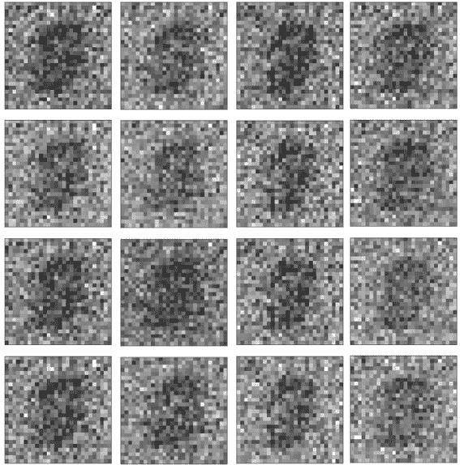

*Fig. 4 – These are the output from one of the unstable training. This is on the same training code as above and slightly tweaked hyperparameters, but even after 300 epochs, you can see how bad our images are – an example of convergence failure | Source: Author*

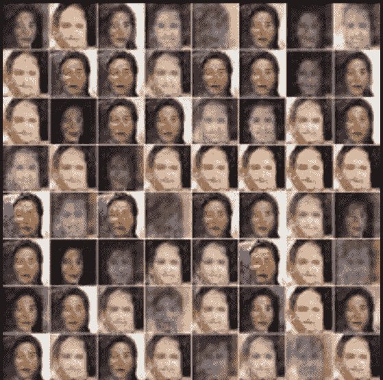

*Fig. 5 – This is another example, you can see the same kind of images generated indicating Mode Collapse | [Source](https://web.archive.org/web/20220926102431/https://towardsdatascience.com/10-lessons-i-learned-training-generative-adversarial-networks-gans-for-a-year-c9071159628)*

我们来看看一些更好的方法。

通过观察损失图

### 通过查看损失图，我们可以了解更多情况。例如，在图 3 中，您可以注意到在某个点之后损耗饱和，显示了预期的行为。现在让我们看看图 6 中的损失图，我已经减少了潜在维度，所以行为是不稳定的。

我们可以在图 6 中看到，发电机损耗在 1 和 1.2 附近振荡。虽然伪图像和真实图像的鉴别器损失也在 0.6 左右，但损失比我们在稳定版本中注意到的要多一些。

[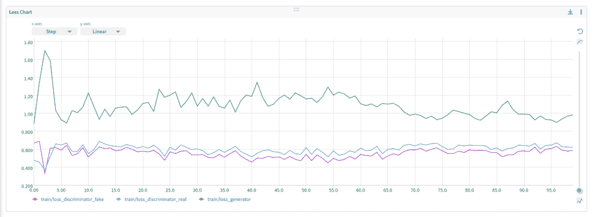](https://web.archive.org/web/20220926102431/https://i0.wp.com/neptune.ai/wp-content/uploads/Fig6_loss_latentSpace2.png?ssl=1)

*Fig. 6 – Loss graph when the latent dimension is reduced | [Source](https://web.archive.org/web/20220926102431/http://neptune.ai/)*

我建议，即使图表有很高的方差，也没关系。您可以增加历元的数量，并等待更多的时间让它变得稳定，最重要的是继续检查生成的中间图像。

如果发生器和鉴别器的损耗图在初始时期都下降到零，那么这也是一个问题。这意味着生成器发现了一组很容易被鉴别者识别的假图像。

统计上不同的箱数(NDB 分数)

### 与上述两种定性方法不同，NDB 评分是一种定量方法。因此，NDB 分数可以识别是否有模式崩溃，而不是查看图像和损失图，遗漏一些东西或没有做出正确的解释。

让我们了解一下 NDB 评分的工作原理:

我们有两个集合，一个训练集(在其上训练模型)和一个测试集(训练完成后由生成器在随机噪声上生成的假图像)。

*   现在使用 K 均值聚类将训练集分成 K 个聚类。这将是我们的 K 个不同的箱子。
*   现在，基于测试数据点和 K 个簇的质心之间的欧几里德距离，将测试数据分配到这 K 个箱中。
*   现在，在每个箱的训练样本和测试样本之间进行双样本测试，并计算 Z 值。如果 Z 分数小于阈值(本文中使用 0.05)，则将该条柱标记为统计差异。
*   计算统计上不同的箱数，并除以 k。
*   收到的值将介于 0 和 1 之间。
*   高数量的统计上不同的箱意味着，即，值更接近 1，意味着高模式崩溃，意味着坏的模型。然而，NDB 分数接近 0 意味着较少或没有模式崩溃。

NDB 评估方法来自关于 GANs 和 GMMs 的论文[。](https://web.archive.org/web/20220926102431/https://arxiv.org/pdf/1805.12462.pdf)

计算 NDB 的一个非常好实现的代码可以在[沈世爱](https://web.archive.org/web/20220926102431/https://twitter.com/kevinkwshen)的这个 [colab 笔记本](https://web.archive.org/web/20220926102431/https://colab.research.google.com/drive/1fGrFl5UzYc3upShr25Hv8VfqyzhZOPTM?usp=sharing)中找到。

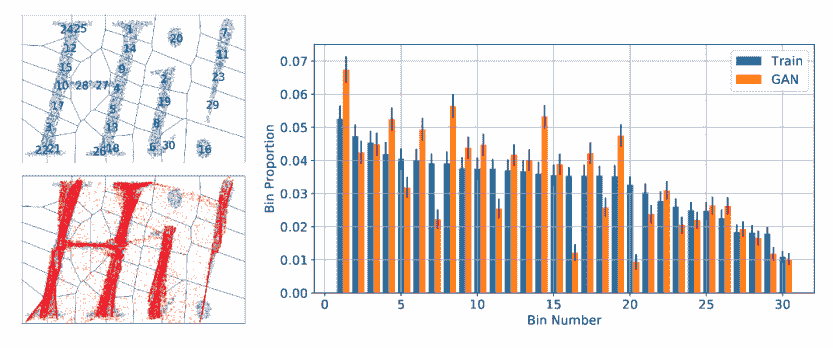

*Fig. 7 – (a) Top Left – Image from Training dataset (b) Bottom Left – Image from Test dataset and the overlap is shown (c) Bar Graph showing bins for train and test set | [Source](https://web.archive.org/web/20220926102431/https://arxiv.org/abs/1805.12462)*

解决故障模式

## 现在我们已经了解了如何识别 GANs 培训中的问题，我们将研究一些解决方案和经验法则来解决这些问题。其中一些将是基本的超参数调整。如果你想更进一步稳定你的 GANs，我们将讨论一些算法。

成本函数

### 有论文说无损失函数优越。我建议你从更简单的损失函数开始，就像我们使用的二进制交叉熵，然后从那里开始。

现在，在某些 GAN 架构中使用某些损失函数并不是一种强制要求。但是很多研究投入到这些论文的写作中，很多研究仍然在进行中。因此，使用图 8 中的这些损失函数将是一个很好的做法，这可能有助于防止模式崩溃和收敛。

对不同的损失函数进行实验，注意您的损失函数可能会因为超参数的错误调整而失败，比如使优化器过于激进，或者学习率过大。这些问题我们以后再讲。

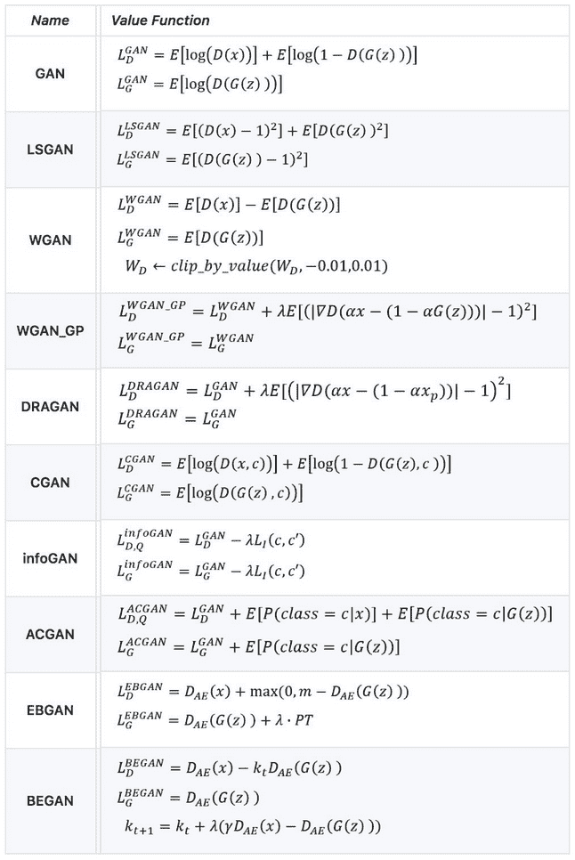

*Fig. 8 – Architecture of GANs and corresponding loss functions used in papers | [Source](https://web.archive.org/web/20220926102431/https://github.com/hwalsuklee/tensorflow-generative-model-collections)*

潜在空间

### 潜在空间是对发生器的输入(随机噪声)进行采样的地方。现在，如果你限制潜在空间，它将产生更多相同类型的输出，如图 9 所示。您也可以查看图 6 中相应的损耗图。

在图 9 中，你能看到这么多相似的 8 和 7 吗？因此模式崩溃。

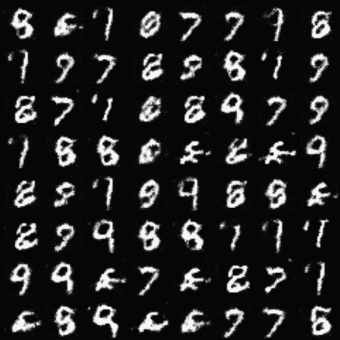

*Fig. 9 – Subplot at 100th epoch, when latent space is 2 | Source: Author*

请注意，在训练 GAN 网络时，提供足够的潜在空间是至关重要的，因此生成器可以创建各种功能。

[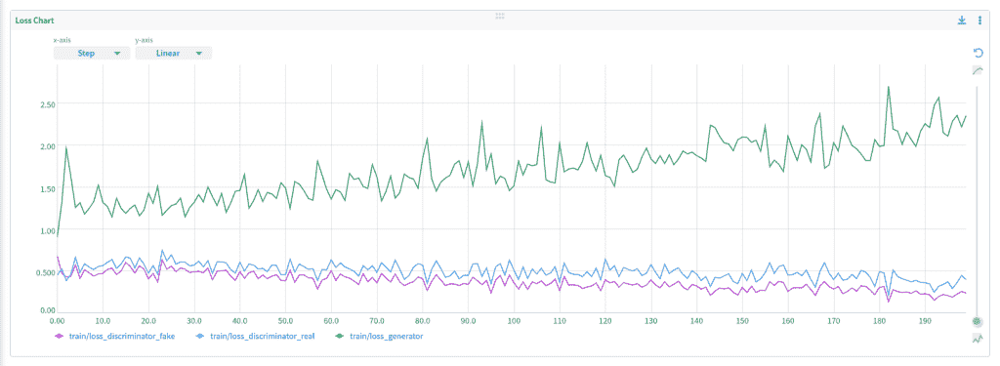](https://web.archive.org/web/20220926102431/https://i0.wp.com/neptune.ai/wp-content/uploads/Fig10_loss_latentSpace1.png?ssl=1)

*Fig. 10 – Here I gave the latent space as 1, ran for 200 epochs.*
*We can see the generator loss constantly increasing and oscillation in all the losses | [Source](https://web.archive.org/web/20220926102431/http://neptune.ai/)*

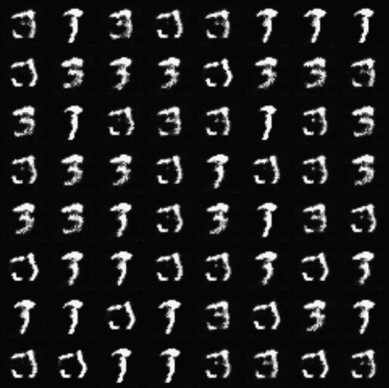

*Fig. 11 – Subplot corresponding fig. 10, where the latent space is 1\.*
*These digits are generated on the 200th epoch | Source: Author*

学习率

### 我在训练 gan 时观察到的一个最常见的问题是高学习率。它会导致模式崩溃或不收敛。你保持低学习率真的很重要，低到 0.0002 甚至更低。

我们可以从图 12 中的损失图清楚地看到，鉴别器将所有图像识别为真实的。这就是为什么假图像的损失很高，而真实图像的损失为零。现在，生成器假设它生成的所有图像都在欺骗鉴别器。这里的问题是，由于如此高的学习率，鉴别者甚至没有得到一点培训。

[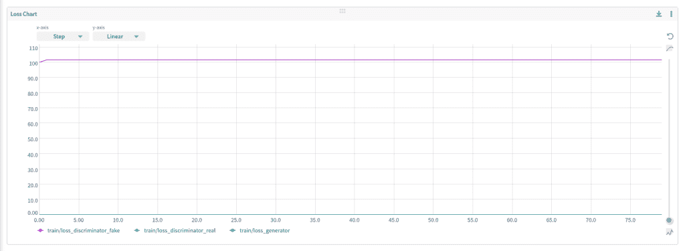](https://web.archive.org/web/20220926102431/https://i0.wp.com/neptune.ai/wp-content/uploads/Fig12_loss_lr_0.2.png?ssl=1)

*Fig. 12 – Loss values when the learning rate is 0.2 | [Source](https://web.archive.org/web/20220926102431/http://neptune.ai/)*

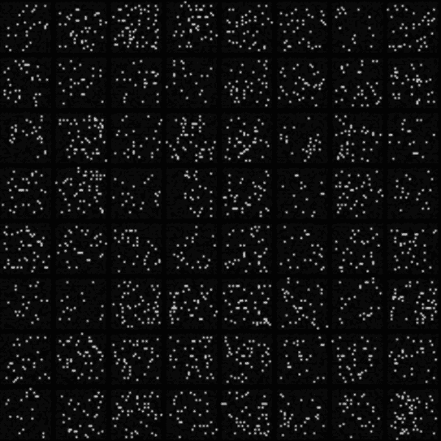

*Fig. 13 – Generated Images on 100th epoch, with a learning rate of 0.2 | Source: Author*

批量越大，学习率的值就越高，但是要尽量安全。

【计算机】优化程序

### 一个侵略性的修改器对训练 GANs 来说是个坏消息。它导致无法找到发电机损耗和鉴别器损耗之间的平衡，从而导致收敛失败。

在 Adam Optimizer 中，betas 是用于计算梯度及其平方的移动平均值的超参数。我们最初(在稳定训练中)对β1 使用值 0.5。将其更改为 0.9(默认值)会增加优化器的积极性。

[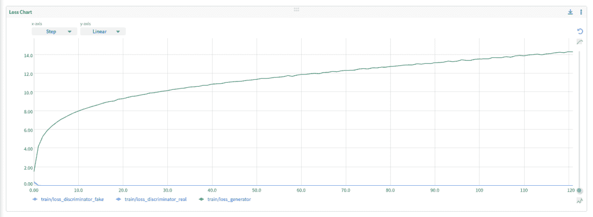](https://web.archive.org/web/20220926102431/https://i0.wp.com/neptune.ai/wp-content/uploads/Fig14_loss_adam_betas_0.9_0.999.png?ssl=1)

*Fig. 14 – Loss graph with default values of Adam Optimizer (betas are 0.9 and 0.999) | [Source](https://web.archive.org/web/20220926102431/http://neptune.ai/)*

在图 14 中，鉴别器表现良好。由于发电机损耗不断增加，我们可以看出它正在产生如此糟糕的图像，以至于鉴别器很容易将其归类为假图像。损失图没有达到平衡。

特征匹配

### 特征匹配提出了一种新的目标函数，其中我们不直接使用鉴别器输出。训练发生器，使得发生器输出预期与鉴别器中间特征上的实像值相匹配。

对于真实图像和虚假图像，在中间层上以小批量计算特征向量(图 15 中的 f(x )),并且测量这些特征向量的平均 L2 距离。

[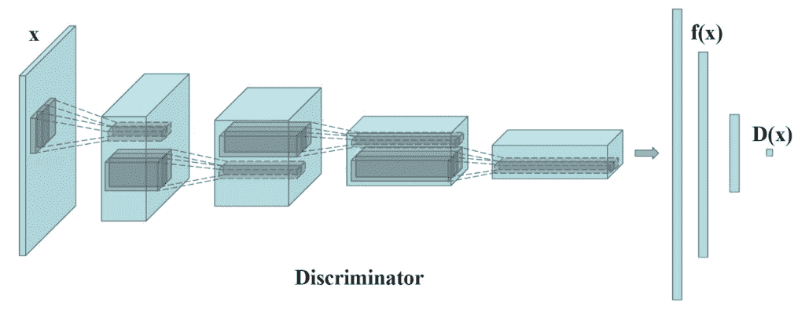](https://web.archive.org/web/20220926102431/https://i0.wp.com/neptune.ai/wp-content/uploads/GANs-Failure-Modes-How-to-Identify-and-Monitor-Them_1.png?ssl=1)

*Fig. 15 – f(x) is the feature vector extracted at the intermediate layer of the discriminator | [Source](https://web.archive.org/web/20220926102431/https://towardsdatascience.com/gan-ways-to-improve-gan-performance-acf37f9f59b)*

将生成的数据与真实数据的统计数据进行匹配更有意义。如果优化器在搜索最佳数据生成时变得过于贪婪，并且从未达到收敛，那么特征匹配可能会有所帮助。

历史平均

### 我们保持前 t 个模型的参数(θ)的移动平均值。现在，我们惩罚模型，使用先前的参数将 L2 成本添加到成本函数中。

这里，θ[i]是第 I 次^(运行时的参数值。)

在处理非凸目标函数时，历史平均可以帮助收敛模型。

结论

## 我们现在明白了在训练 GANs 时实验跟踪的重要性。

*   理解损耗图并仔细观察生成的中间数据非常重要。
*   超参数，如学习率、优化器参数、潜在空间等。如果调整不当，可能会破坏您的模型。
*   随着过去几年 GAN 模型的增加，越来越多的研究进入到稳定 GAN 的训练中。对于特定的用例，有更多的技术是有益的。
*   进一步阅读

### 塔奈·阿格拉瓦尔

### Curl Analytics 的深度学习工程师

**阅读下一篇**

* * *

机器学习中模型评估和选择的最终指南

## 10 分钟阅读|作者 Samadrita Ghosh |年 7 月 16 日更新

10 mins read | Author Samadrita Ghosh | Updated July 16th, 2021

在高层次上，机器学习是统计和计算的结合。机器学习的关键围绕着算法或模型的概念，这些概念实际上是类固醇的统计估计。

然而，根据数据分布的不同，任何给定的模型都有一些限制。它们中没有一个是完全准确的，因为它们只是 ***(即使使用类固醇)*** 。这些限制俗称 ***偏差*** 和 ***方差*** 。

具有高偏差的**模型会因为不太注意训练点而过于简化(例如:在线性回归中，不管数据分布如何，模型将总是假设线性关系)。**

具有高方差的**模型将通过不对其之前未见过的测试点进行概括来将其自身限制于训练数据(例如:max_depth = None 的随机森林)。**

当限制很微妙时，问题就出现了，比如当我们必须在随机森林算法和梯度推进算法之间进行选择，或者在同一决策树算法的两个变体之间进行选择。两者都趋向于具有高方差和低偏差。

这就是模型选择和模型评估发挥作用的地方！

在本文中，我们将讨论:

什么是模型选择和模型评估？

*   有效的模型选择方法(重采样和概率方法)
*   流行的模型评估方法
*   重要的机器学习模型权衡
*   Important Machine Learning model trade-offs

[Continue reading ->](/web/20220926102431/https://neptune.ai/blog/the-ultimate-guide-to-evaluation-and-selection-of-models-in-machine-learning)

* * *