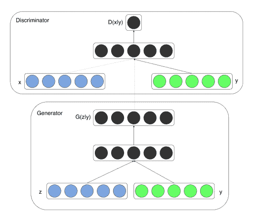

# 理解 GAN 损耗函数

> 原文：<https://web.archive.org/web/https://neptune.ai/blog/gan-loss-functions>

Ian Goodfellow 在 2014 年引入了生成对抗网络(GAN)。这是神经网络最漂亮、最简单的实现之一，它包括两个相互竞争的神经网络。 *Yann LeCun，*卷积神经网络(CNN)的创始人，将 GANs 描述为“**过去十年机器学习中最有趣的想法**”。

用简单的话来说，GANs 背后的想法可以概括如下:

*   涉及到两个神经网络。
*   其中一个网络，即生成器，从随机数据分布开始，并试图复制特定类型的分布。
*   另一个网络，鉴别器，通过随后的训练，可以更好地将伪造的分布从真实的分布中区分出来。
*   这两个网络都在玩一个最小-最大游戏，其中一个试图智胜另一个。

很简单……但是当你真正尝试去实现它们的时候，它们通常不会以你期望的方式学习。一个常见的原因是过于简单的损失函数。

在这篇博客文章中，我们将仔细研究 GAN 及其损失函数的不同变体[，以便我们可以更好地了解 GAN 在解决意外性能问题时是如何工作的。](https://web.archive.org/web/20220928202235/https://towardsdatascience.com/gan-objective-functions-gans-and-their-variations-ad77340bce3c)

## 标准 GAN 损耗函数(最小-最大 GAN 损耗)

标准的 GAN 损失函数，也被称为**最小-最大损失，**最早是由 Ian Goodfellow 等人在 2014 年发表的题为“[生成对抗网络](https://web.archive.org/web/20220928202235/https://arxiv.org/abs/1406.2661)”的论文中描述的。

生成器试图最小化该函数，而鉴别器试图最大化该函数。把它看做一个最小-最大游戏，这种损失的表述似乎是有效的。

实际上，它对于发生器来说是饱和的，这意味着如果发生器没有赶上鉴别器，它就会频繁地停止训练。

标准 GAN 损耗函数可进一步分为两部分:**鉴频器损耗**和**发生器损耗**。

### 鉴频器损耗

当鉴别器被训练时，它对来自生成器的真实数据和虚假数据进行分类。

通过最大化下面的函数，它惩罚自己将一个真实的实例误分类为假的，或者将一个假的实例(由生成器创建)误分类为真实的。

*   **log(D(x))** 是指生成器正确分类真实图像的概率，
*   最大化 **log(1-D(G(z)))** 将帮助它正确地标记来自生成器的假图像。

### 发电机损耗

当生成器被训练时，它对随机噪声进行采样，并从该噪声中产生输出。然后，输出通过鉴别器，并根据鉴别器的辨别能力被分类为“真”或“假”。

然后，根据鉴别器的分类计算发电机损耗——如果成功骗过鉴别器，将获得奖励，否则将受到惩罚。

下面的等式被最小化以训练发生器:

## 非饱和 GAN 损耗

在生成器最大化鉴别器概率的对数时，使用了标准损失函数的一个细微变化—**log(D(G(z))。**

这种变化的灵感来自于从不同的角度构建问题，其中生成器寻求最大化图像真实的概率，而不是最小化图像虚假的概率。

这通过更稳定的权重更新机制避免了发电机饱和。在他的博客中，Daniel Takeshi 比较了非饱和 GAN 损耗和其他一些变化。

## GAN 损耗函数面临的挑战

通常情况下，GANs 在性能上往往表现出一些不一致性。

这些问题中的大多数[都与他们的训练](https://web.archive.org/web/20220928202235/https://machinelearningmastery.com/how-to-code-the-generative-adversarial-network-training-algorithm-and-loss-functions/)有关，并且是一个活跃的研究领域。

让我们详细看看其中的一些:

### 模式崩溃

这个问题是事情不可预测的一面。直到有人注意到发电机模型只能产生不同结果或模式中的一个或一个小的子集，人们才预见到这一点。

**通常，我们希望 GAN 产生一系列输出**。例如，我们希望我们设计的人脸生成器的每个随机输入都有另一个人脸。

相反，通过随后的训练，网络学习对特定的数据分布进行建模，这给了我们一个**单调的输出**，如下图所示。

在训练过程中，**发生器总是试图找到一个对鉴别器来说似乎最合理的输出**。

因此，**鉴别器的最佳策略总是拒绝发生器的输出**。

但是，如果下一代鉴别器陷入局部最小值，并且没有通过进一步优化其权重来找到出路，那么下一次生成器迭代将很容易找到当前鉴别器的最合理输出。

这样，它将不断重复相同的输出，避免任何进一步的训练。

### 消失渐变

当鉴别器的性能明显优于生成器时，就会出现这种现象。鉴别器的更新要么不准确，要么消失。

对此提出的原因之一是发生器受到严重惩罚，这导致激活后函数值饱和，最终梯度消失。

### 趋同；聚集

由于有两个网络同时被训练，GAN 收敛的问题是最早的问题之一，并且很可能是自其产生以来最具挑战性的问题之一。

在大多数情况下，两个网络都稳定并产生一致结果的乌托邦式的情况是很难实现的。对这个问题的一种解释是，随着下一个时期发生器变得更好，鉴别器的性能会变得更差，因为鉴别器无法轻易区分真假。

如果发生器一直成功，鉴别器有 50%的准确率，类似于抛硬币。这对整个 GAN 的融合构成了威胁。

下图特别显示了这个问题:

由于鉴别器的反馈通过以相等的概率给出输出而在随后的时期中失去其意义，所以如果发生器继续利用这些垃圾训练信号进行训练，它可能会恶化其自身的质量。

Jonathan Hui 的这篇文章从数学的角度全面地审视了上述所有问题。

## 交替 GAN 损失函数

从最初开始，人们就提出了几种不同的 GAN 损耗变化。在一定程度上，它们解决了我们之前讨论的挑战。

我们将讨论一些最受欢迎的缓解问题的方法，或用于特定问题陈述的方法:

### 沃瑟斯坦生成对抗网络

这是原始 GAN 损耗的最有力替代方案之一。它**解决了** **模式崩溃** **和** **消失渐变** **的问题。**

在该实现中，鉴频器输出层的**激活从 sigmoid 变为线性**。这个简单的变化影响鉴别器给出分数而不是与数据分布相关的概率，因此输出不必在 0 到 1 的范围内。

在这里，鉴别器被称为批判，因为它实际上并不严格地将数据分类为真实或虚假，它只是给它们一个评级。

以下损失函数分别用于**训练批判和鉴别器**。

评论和生成器的输出不是概率项(在 0 和 1 之间)，因此在训练评论网络时，评论和生成器输出之间的绝对差被最大化。

类似地，在训练发生器网络时，发生器函数的绝对值最大化。

原始论文使用 RMSprop，然后进行剪裁，以防止权重值爆炸:

### 条件生成对抗网络

这个版本的 GAN 用于学习多模态模型。它基本上**生成描述性标签，这些标签是与不属于原始训练数据的特定图像相关联的属性。**

CGANs 主要用于图像标记，其中生成器和鉴别器都被馈送一些额外的信息 **y** 作为辅助信息，例如来自不同模态的类别标签或与不同模态相关联的数据。

通常通过将信息 **y** 输入鉴别器和发生器来完成调节，作为其附加输入层。

以下修改的损失函数进行与标准 GAN 损失函数相同的最小-最大博弈。它们之间唯一的区别是，条件概率用于生成器和鉴别器，而不是常规的条件概率。

**为什么是条件概率？**因为我们正在输入一些辅助信息(绿点)，这有助于使其成为多模态模型，如下图所示:

*Figure 1: Conditional adversarial net*

Jonathan Hui 的这篇文章深入探讨了 CGANs 并讨论了其背后的数学原理。

## 摘要

在这篇博客中，我们讨论了:

*   原始的生成性对抗网络随着修改后的网络而失去功能。
*   在现实生活中使用它们的不同挑战。
*   替代损失函数，如 WGAN 和 C-GAN。

这篇文章的主要目的是提供一个生成性对抗网络发展背后的整体直觉。希望它能让你对 GANs 有更好的感觉，以及一些有用的见解。感谢阅读！

### 哈什特·德维韦迪

AfterShoot 的创始人兼首席执行官，AfterShoot 是一家初创公司，致力于开发人工智能工具，通过自动化工作流程中枯燥乏味的部分，帮助摄影师更好地利用时间。

* * *

**阅读下一篇**

## 机器学习中模型评估和选择的最终指南

10 分钟阅读|作者 Samadrita Ghosh |年 7 月 16 日更新

在高层次上，机器学习是统计和计算的结合。机器学习的关键围绕着算法或模型的概念，这些概念实际上是类固醇的统计估计。

然而，根据数据分布的不同，任何给定的模型都有一些限制。它们中没有一个是完全准确的，因为它们只是 ***(即使使用类固醇)*** 。这些限制俗称 ***偏差*** 和 ***方差*** 。

具有高偏差的**模型会由于不太注意训练点而过于简化(例如:在线性回归中，不管数据分布如何，模型将总是假设线性关系)。**

具有高方差的**模型将通过不对其之前未见过的测试点进行概括来将其自身限制于训练数据(例如:max_depth = None 的随机森林)。**

当限制很微妙时，问题就出现了，比如当我们必须在随机森林算法和梯度推进算法之间进行选择，或者在同一决策树算法的两个变体之间进行选择。两者都趋向于具有高方差和低偏差。

这就是模型选择和模型评估发挥作用的地方！

在本文中，我们将讨论:

*   什么是模型选择和模型评估？
*   有效的模型选择方法(重采样和概率方法)
*   流行的模型评估方法
*   重要的机器学习模型权衡

[Continue reading ->](/web/20220928202235/https://neptune.ai/blog/the-ultimate-guide-to-evaluation-and-selection-of-models-in-machine-learning)

* * *