# 如何在 Google Colab 中处理文件:你需要知道的一切

> 原文：<https://web.archive.org/web/https://neptune.ai/blog/google-colab-dealing-with-files>

谷歌合作实验室是一个免费的 Jupyter 笔记本环境，运行在谷歌的云服务器上，让用户利用后端硬件，如 GPU 和 TPU。这使您可以在本地机器上托管的 Jupyter 笔记本中做任何事情，而不需要在本地机器上托管笔记本的安装和设置。

Colab 提供了(几乎)开始编码所需的所有设置，但是它没有开箱即用的数据集！你如何从 Colab 中访问你的数据？

在本文中，我们将讨论:

*   如何从大量数据源向 Colab 加载数据
*   如何从 Colab 内部写回那些数据源
*   Google Colab 在处理外部文件时的局限性

## Google Colab 中的目录和文件操作

由于 Colab 允许您在本地托管的 Jupyter 笔记本中做您能做的任何事情，您还可以使用 shell 命令，如`ls, dir, pwd, cd, cat, echo`等等，使用 line-magic (%)或 bash(！).

要浏览目录结构，您可以使用左侧的文件浏览器窗格。

## 如何在 Google Colab 上上传和下载文件

由于 Colab 笔记本托管在谷歌的云服务器上，因此默认情况下，无法直接访问本地驱动器上的文件(不像笔记本托管在你的机器上)或任何其他环境。

然而，Colab 提供了各种选项来连接到几乎任何您能想到的数据源。让我们看看如何。

## 从 Google Colab 访问 GitHub

您可以将整个 GitHub 存储库克隆到您的 Colab 环境中，也可以通过原始链接访问单个文件。

### 克隆一个 GitHub 库

使用 git `clone`，您可以像在本地机器上一样将 GitHub 存储库克隆到您的 Colab 环境中。一旦存储库被克隆，刷新文件浏览器浏览其内容。

然后，您可以像在本地机器上一样简单地读取这些文件。

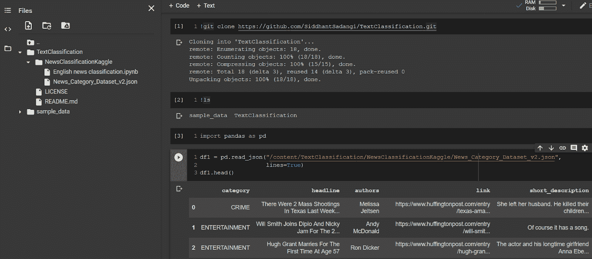

### 直接从 GitHub 加载单个文件

如果您只需要处理几个文件而不是整个存储库，您可以直接从 GitHub 加载它们，而不需要将存储库克隆到 Colab。

为此:

1.  点击存储库中的文件，
2.  点击**查看原始数据**，
3.  复制原始文件的 URL，
4.  使用此 URL 作为文件的位置。

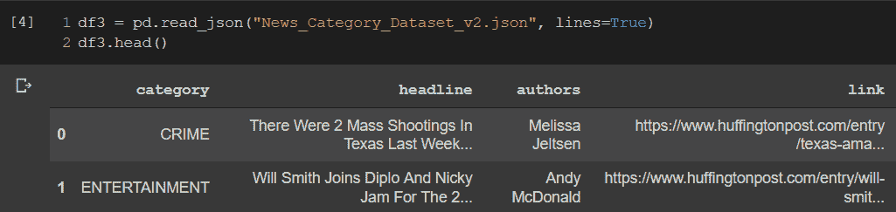

## 访问 Google Colab 的本地文件系统

您可以使用文件资源管理器或 Python 代码读取或写入本地文件系统:

### 通过文件浏览器访问本地文件

#### 通过文件浏览器从本地文件系统上传文件

您可以使用 file-explorer 窗格顶部的 upload 选项将本地文件系统中的任何文件上传到当前工作目录中的 Colab。

要将文件直接上传到子目录，您需要:

1.当您将鼠标悬停在目录上方时，单击可见的三个点

2.选择“上传”选项。

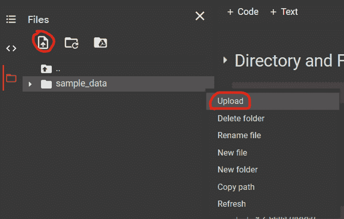

3.从“文件上传”对话框中选择您希望上传的文件。

4.等待上传完成。上传进度显示在文件浏览器窗格的底部。

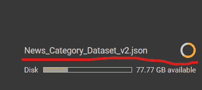

上传完成后，您可以像平常一样读取文件。


#### 通过文件浏览器将文件下载到本地文件系统

当鼠标悬停在文件名上方时，点击可见的三个点，然后选择“下载”选项。

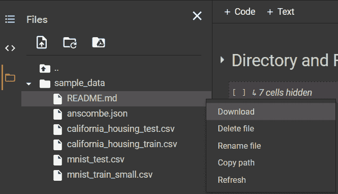

### 使用 Python 代码访问本地文件系统

这一步要求您首先从`google.colab library`导入`files`模块:

```py
from google.colab import files

```

#### 使用 Python 代码从本地文件系统上传文件

您使用了`files`对象的上传方法:

```py
uploaded = files.upload()

```

运行此命令将打开文件上传对话框窗口:

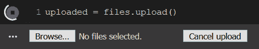

选择您希望上传的文件，然后等待上传完成。将显示上传进度:


`uploaded`对象是一个以文件名和内容作为键值对的字典:

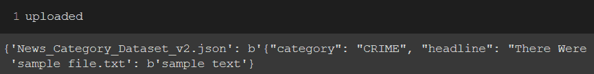

上传完成后，您可以像阅读 colab 中的任何其他文件一样阅读它:

```py
df4 = pd.read_json("News_Category_Dataset_v2.json", lines=True)

```

或者使用`io`库直接从`uploaded`字典中读取:

```py
import io
df5 = pd.read_json(io.BytesIO(uploaded['News_Category_Dataset_v2.json']), lines=True)
```

确保文件名与您希望加载的文件的名称相匹配。

#### 使用 Python 代码将文件从 Colab 下载到本地文件系统:

files 对象的`download`方法可用于将任何文件从 colab 下载到您的本地驱动器。将显示下载进度，下载完成后，您可以选择将其保存在本地计算机中的什么位置。

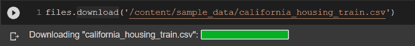

## 从 Google Colab 访问 Google Drive

您可以使用`google.colab`中的`drive`模块将整个 Google Drive 安装到 Colab，方法是:

1.执行下面的代码，它将为您提供一个身份验证链接

```py
from google.colab import drive
drive.mount('/content/gdrive')
```

2.打开链接

3.选择您想要安装其驱动器的 Google 帐户

4.允许 Google Drive Stream 访问您的 Google 帐户

5.复制显示的代码，粘贴到如下所示的文本框中，然后按 Enter 键

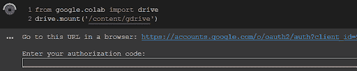

一旦安装了驱动器，您将得到消息`“Mounted at /content/gdrive”`，并且您将能够从文件浏览器窗格浏览驱动器的内容。

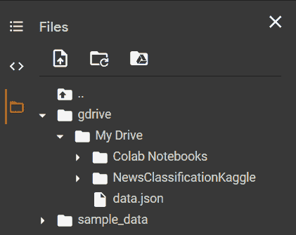

现在你可以和你的 Google Drive 进行交互，就好像它是你的 Colab 环境中的一个文件夹一样。对此文件夹的任何更改都将直接反映在您的 Google Drive 中。你可以像阅读其他文件一样阅读谷歌硬盘中的文件。

你甚至可以使用通常的文件/目录操作从 Colab 直接写入 Google Drive。

```py
!touch "/content/gdrive/My Drive/sample_file.txt"

```

这将在您的 Google Drive 中创建一个文件，并且在您刷新它后，该文件将出现在文件浏览器窗格中:

## 从 Google Colab 访问 Google 工作表

要访问 Google Sheets:

1.您需要首先通过运行以下代码来验证要与 Colab 链接的 Google 帐户:

```py
from google.colab import auth
auth.authenticate_user()
```

2.执行上述代码将为您提供一个身份验证链接。打开链接，

3.选择您想要链接的 Google 帐户，

4.允许 Google Cloud SDK 访问您的 Google 帐户，

5.最后，复制显示的代码并将其粘贴到显示的文本框中，然后按 Enter 键。


要与 Google Sheets 交互，需要导入预装的`gspread`库。为了授权`gspread`访问您的谷歌账户，您需要预装`oauth2client.client`库中的`GoogleCredentials`方法:

```py
import gspread
from oauth2client.client import GoogleCredentials

gc = gspread.authorize(GoogleCredentials.get_application_default())
```

运行上述代码后，将在当前工作目录中创建一个应用程序默认凭证(ADC) JSON 文件。这包含了`gspread`用来访问您的 Google 帐户的凭证。

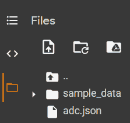

一旦完成，您现在可以直接从您的 Colab 环境中创建或加载 Google sheets。

### 在 Colab 中创建/更新 Google 工作表

1.使用`gc`对象的 create 方法来`create`工作簿:

```py
wb = gc.create('demo')

```

2.工作簿创建后，您可以在[sheets.google.com](https://web.archive.org/web/20230213035612/http://sheets.google.com/)中查看它。

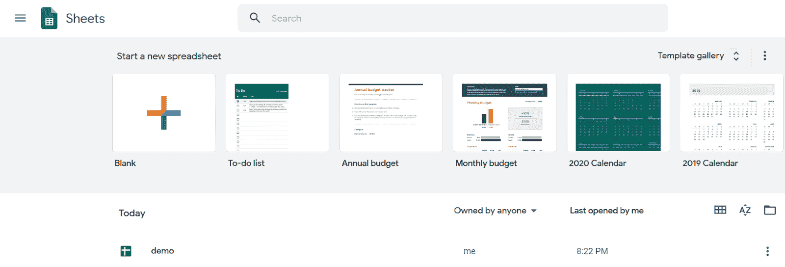

3.若要将值写入工作簿，请先打开一个工作表:

```py
ws = gc.open('demo').sheet1
```

4.然后选择要写入的单元格:

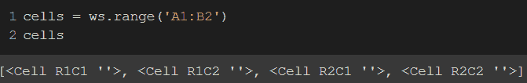

5.这将创建一个包含索引(R1C1)和值(当前为空)的单元格列表。您可以通过更新单个单元格的值属性来修改它们:

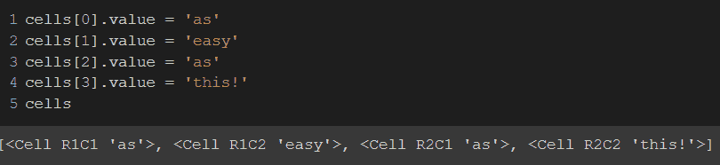

6.若要更新工作表中的这些单元格，请使用 update_cells 方法:


7.这些变化现在将反映在您的 Google 表单中。

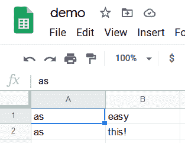

### 从谷歌工作表下载数据

1.使用`gc`对象的`open`方法打开工作簿:

```py
wb = gc.open('demo')

```

2.然后使用`get_all_values`方法读取特定工作表的所有行:

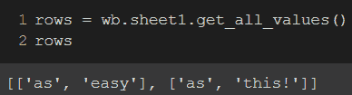

3.要将这些加载到 dataframe 中，可以使用 DataFrame 对象的`from_record`方法:

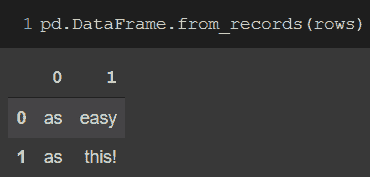

## 从 Google Colab 访问 Google 云存储(GCS)

你需要有一个谷歌云项目(GCP)来使用 GCS。您可以通过预先安装的`gsutil`命令行实用程序在 Colab 中创建和访问您的 GCS buckets。

1.首先指定您的项目 ID:

```py
project_id = '<project_ID>'

```

2.要访问 GCS，您必须验证您的 Google 帐户:

```py
from google.colab import auth
auth.authenticate_user()
```

3.执行上述代码将为您提供一个身份验证链接。打开链接，

4.选择您想要链接的 Google 帐户，

5.允许 Google Cloud SDK 访问您的 Google 帐户，

6.最后，复制显示的代码并将其粘贴到显示的文本框中，然后按 Enter 键。


7.然后您配置`gsutil`来使用您的项目:

```py
!gcloud config set project {project_id}

```

8.您可以使用 make bucket ( `mb`)命令创建一个存储桶。GCP 存储桶必须有一个全球唯一的名称，所以使用预安装的`uuid`库来生成一个全球唯一的 ID:

```py
import uuid
bucket_name = f'sample-bucket-{uuid.uuid1()}'
!gsutil mb gs://{bucket_name}
```

9.一旦创建了 bucket，您就可以从您的 colab 环境向它上传一个文件:

```py
!gsutil cp /tmp/to_upload.txt gs://{bucket_name}/

```

10.上传完成后，该文件将出现在您项目的 GCS 浏览器中:[https://console.cloud.google.com/storage/browser?project=**T4【project _ id**>](https://web.archive.org/web/20230213035612/https://console.cloud.google.com/storage/browser?project=Your_project_ID_here)

```py
!gsutil cp gs://{bucket_name}/{filename} {download_location}
```

下载完成后，该文件将出现在指定下载位置的 Colab 文件浏览器窗格中。

## 从 Google Colab 访问 S3 自动气象站

您需要有一个 AWS 帐户，配置 IAM，并生成您的访问密钥和秘密访问密钥，以便能够从 Colab 访问 S3。您还需要在您的 colab 环境中安装`awscli`库:

1.安装`awscli`库

```py
!pip install awscli

```

2.安装后，通过运行`aws configure`来配置 AWS:

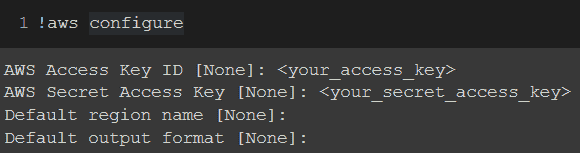

1.  在文本框中输入您的`access_key`和`secret_access_key`，然后按回车键。

然后你可以从 S3 下载任何文件:

```py
!aws s3 cp s3://{bucket_name} ./{download_location} --recursive --exclude "*" --include {filepath_on_s3}
```

`filepath_on_s3`可以指向单个文件，或者使用一个模式匹配多个文件。

下载完成后将会通知您，并且下载的文件将会在您指定的位置提供，以供您随意使用。

要上传文件，只需颠倒源和目标参数:

```py
!aws s3 cp ./{upload_from} s3://{bucket_name} --recursive --exclude "*" --include {file_to_upload}

```

`file_to_upload`可以指向单个文件，或者使用一个模式匹配多个文件。

上传完成后，您将会收到通知，上传的文件将会出现在您的 S3 存储桶的指定文件夹中:[https://s3.console.aws.amazon.com/s3/buckets/**{存储桶名称}/{文件夹}** /？区域=**{区域}**](https://web.archive.org/web/20230213035612/https://s3.console.aws.amazon.com/s3/buckets/tr-project-ace-data/staging/?region=us-east-1)

## 从 Google Colab 访问 Kaggle 数据集

要从 Kaggle 下载数据集，首先需要一个 Kaggle 帐户和一个 API 令牌。

1.要生成您的 API 令牌，请转到“我的帐户”，然后“创建新的 API 令牌”。

2.打开 kaggle.json 文件，并复制其内容。应该是{ `"username":"########", "key":"################################"` }的形式。

3.然后在 Colab 中运行以下命令:

```py
!mkdir ~/.kaggle 
!echo '<PASTE_CONTENTS_OF_KAGGLE_API_JSON>' > ~/.kaggle/kaggle.json 
!chmod 600 ~/.kaggle/kaggle.json  
!pip install kaggle 
```

4.一旦在 Colab 中创建了 kaggle.json 文件，并且安装了 kaggle 库，就可以使用

```py
!kaggle datasets list -s {KEYWORD}
```

5.然后使用下载数据集

```py
!kaggle datasets download -d {DATASET NAME} -p /content/kaggle/

```

数据集将被下载，并在指定的路径中可用(在本例中为`/content/kaggle/`)。

## 从 Google Colab 访问 MySQL 数据库

1.您需要导入预先安装的`sqlalchemy`库来使用关系数据库:

```py
import sqlalchemy

```

2.输入连接详细信息并创建引擎:

```py
HOSTNAME = 'ENTER_HOSTNAME'
USER = 'ENTER_USERNAME'
PASSWORD = 'ENTER_PASSWORD'
DATABASE = 'ENTER_DATABASE_NAME'

connection_string = f'mysql+pymysql://{MYSQL_USER}:{MYSQL_PASSWORD}@{MYSQL_HOSTNAME}/{MYSQL_DATABASE}'

engine = sqlalchemy.create_engine(connection_string)
```

3.最后，只需创建 SQL 查询，并使用`pd.read_sql_query():`将查询结果加载到 dataframe 中

```py
query = f"SELECT * FROM {DATABASE}.{TABLE}"

import pandas as pd
df = pd.read_sql_query(query, engine)
```

## Google Colab 在处理文件时的局限性

使用 Colab 时要记住的一个重要警告是，你上传到它的文件不会永远可用。Colab 是一个临时环境，空闲超时为 90 分钟，绝对超时为 12 小时。这意味着，如果运行时已经空闲了 90 分钟，或者已经使用了 12 个小时，它将断开连接。断开连接时，您会丢失所有的变量、状态、已安装的软件包和文件，并在重新连接时连接到一个全新的干净的环境。

此外，Colab 的磁盘空间限制为 108 GB，其中只有 77 GB 可供用户使用。虽然这对于大多数任务来说应该足够了，但是在处理像图像或视频数据这样的大型数据集时，请记住这一点。

## 结论

对于那些想要利用 GPU 等高端计算资源的能力，而不受价格限制的个人来说，Google Colab 是一个很好的工具。

在本文中，我们已经介绍了通过在 Google Colab 中读取外部文件或数据以及从 Google Colab 向这些外部数据源写入数据来增强 Google Colab 体验的大多数方法。

根据您的用例，或者您的数据架构是如何建立的，您可以很容易地应用上述方法将您的数据源直接连接到 Colab，并开始编码！

### 其他资源