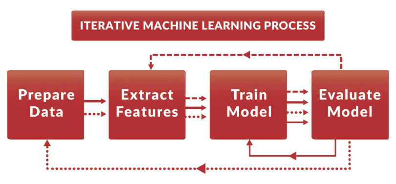
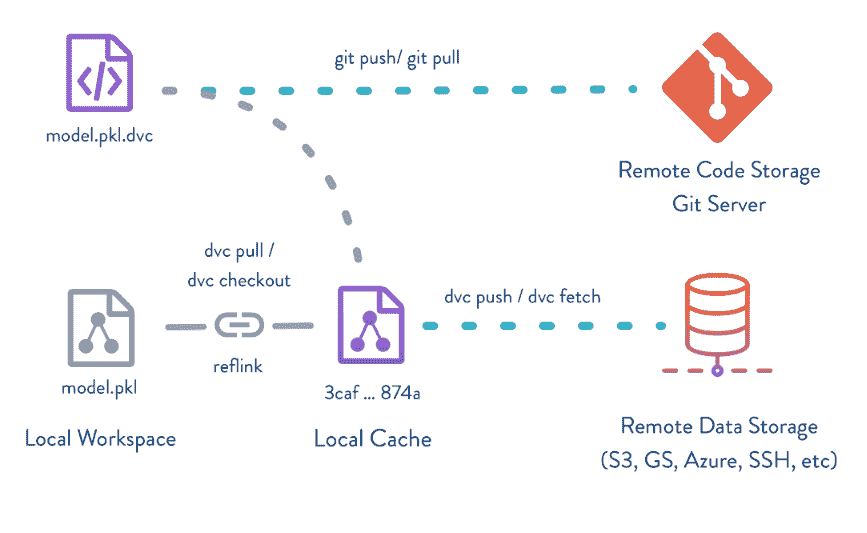
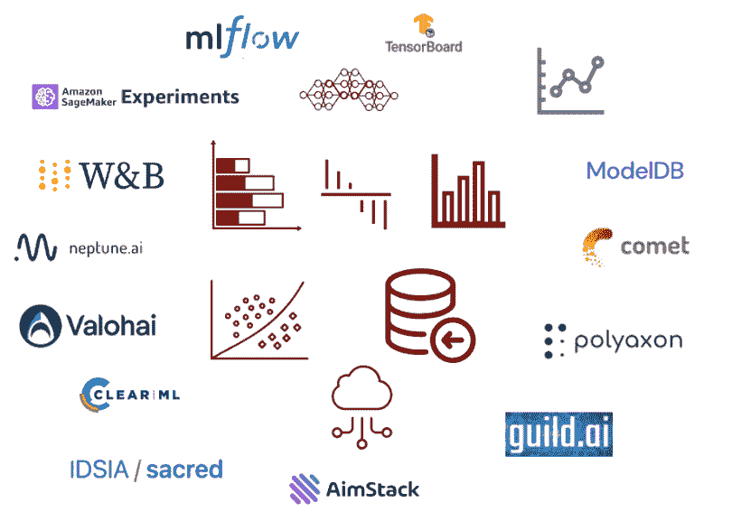
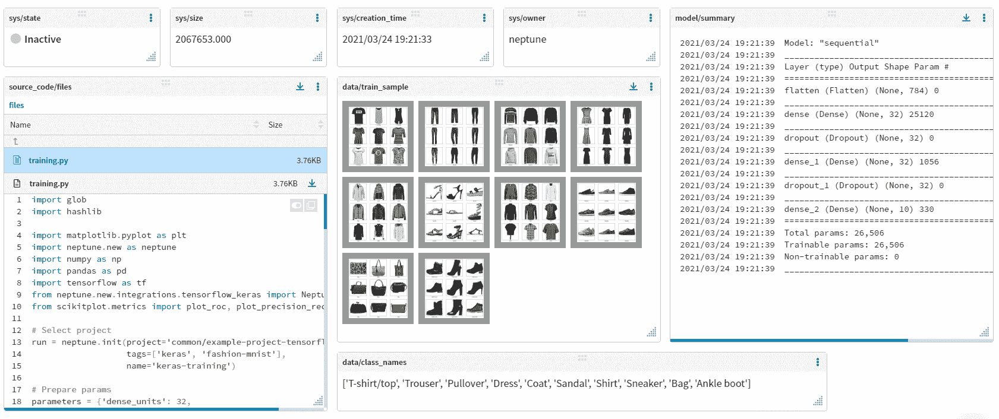

# 如何管理和组织你在 Google Colab 中运行的 ML 实验

> 原文：<https://web.archive.org/web/https://neptune.ai/blog/google-colab-version-organize-ml-experiments>

自从 [Google Colab](https://web.archive.org/web/20230106143913/https://colab.research.google.com/) 问世以来，进行 ML 实验从未如此简单。借助按需共享 GPU 实例的优势，它已经能够提供无缝体验来运行实验。然而，ML 实验带有跟踪和组织的自然要求，而 Colab 本身并没有提供这种要求。在这篇博客中，我们将涉及以下几个方面:

## 

*   1 为什么 Google Colab 中的版本实验很重要？
*   2Google Colab 中版本实验的不同方式。
*   3Neptune . ai 如何在 Google Colab 中帮助追踪实验？

## 为什么要对在 Colab 中运行的 ML 实验进行版本化？

构建 ML 模型本质上是实验性的，通常会运行大量实验来寻找算法、参数和数据预处理步骤的组合，从而为手头的任务产生最佳模型。一旦问题变得复杂，这就需要某种形式的组织。

在 Colab 中运行实验时，您会感觉到需要以与其他方式相同的方式进行版本控制。以下是一些要点，说明为什么您应该采用最佳实践，为您在 Colab 中的 ML 实验设置某种形式的版本控制:

[Source](https://web.archive.org/web/20230106143913/https://www.kdnuggets.com/2017/05/data-version-control-iterative-machine-learning.html)

1.  **协作:**在团队中工作需要决策过程中的协作努力，如果没有集中记录的实验细节，如模型元数据、度量等，这将是很麻烦的。这可以很好地适应 Google Colab 的共享功能，在那里你也可以协作编写代码。

2.  **再现性:**如果您在某个地方记录模型配置，可以节省大量的重新训练和测试时间。通过拍摄整个机器学习管道的快照，可以再次重现相同的输出。

3.  **依赖跟踪**:通过使用版本控制，您可以跟踪数据集的不同版本(训练、验证和测试)，在不同的分支或存储库上测试多个模型，调整模型参数和超参数，并监控每个更改的准确性。

4.  **模型更新:**模型开发不是一步到位的，它是循环往复的。在版本控制的帮助下，您可以控制发布哪个版本，同时继续开发下一个版本。

## 如何对运行在 Google Colab 中的 ML 实验进行版本化？

在 Colab 中有许多方法可以对实验进行版本控制，从简单的日志文件到提供大量功能的全面实验跟踪工具。让我们来谈谈每个类别中的一些，并了解什么是适合你的选择。

### 1.电子表格

[Source](https://web.archive.org/web/20230106143913/https://www.howtogeek.com/768067/how-to-choose-a-chart-to-fit-your-data-in-microsoft-excel/)

在 Excel 或 Google 电子表格中跟踪 ML 实验是一种快速而强力的解决方案。电子表格提供了一种舒适、易用的体验，可以直接粘贴元数据并为多次运行创建多个工作表。但是它有很多警告，让我们看看它哪里有亮点，哪里没有:

#### 赞成的意见

1.  熟悉的界面易于使用。
2.  可以在工具中直接为利益相关者创建报告。
3.  对于团队中的非技术人员来说，做出贡献是一件好事。

#### 骗局

1.  在电子表格中跟踪实验是一件乏味的事情，您要么需要将模型元数据和指标复制并粘贴到电子表格中，要么使用 pandas 这样的模块来记录信息，然后保存到电子表格中。
2.  一旦实验数量增加，在单独的表格中记录每次运行将变得难以管理。
3.  在一个简单的电子表格中跟踪和管理无数的变量和工件并不是解决问题的最佳方式。

### 2.饭桶

[Source](https://web.archive.org/web/20230106143913/https://towardsdatascience.com/version-control-ml-model-4adb2db5f87c)

Git 预装在 Colab 会话中，您可以直接使用它来克隆或提交到存储库。这将使您能够推送与模型相关的元数据，如训练权重、评估报告(如混淆矩阵)等。到一个中央存储库，您的数据科学团队可以使用它来做出明智的决策。让我们来看看使用 Git 进行实验跟踪的优缺点:

#### 赞成的意见

1.  Git 在 Colab 上的本机可用性意味着没有额外的依赖性或安装。
2.  在数据科学家和 ML 实践者中流行和已知的工具。
3.  允许访问数百万个其他存储库，这可以作为一个起点。

#### 骗局

1.  很难让非程序员和其他利益相关者参与进来。
2.  不直观的界面可能会给协作工作带来摩擦。
3.  需要技术专家来执行和维护与实验相关的知识库。

### 3.ML 实验跟踪工具

[Source](https://web.archive.org/web/20230106143913/https://gradientflow.com/experiment-tracking-and-experiment-management-tools/)

实验跟踪工具是为此用例定制的。它们几乎涵盖了你对工具的所有需求，从实验跟踪到模型注册。在过去的几年里，这个领域出现了很多工具，其中比较突出的有 neptune.ai、Weights and Biases 或 MLflow。让我们看看它们的一些优点/缺点:

#### 赞成的意见

1.  涵盖了您在管理和组织 ML 运行时需要的几乎所有功能。
2.  所有这些工具都带有专用的交互式用户界面，可用于比较、调试或生成报告。
3.  每个工具都为团队协作提供了过多的功能。

#### 骗局

1.  与 Git 或电子表格相反，实验跟踪工具通常需要付费。虽然几乎所有的都有一个针对单个用户的免费层，但它有其局限性。但另一方面，为工具付费意味着您不必担心安装、维护或开发功能。

让我们更深入地了解版本控制 Colab 笔记本在这些工具中是如何工作的。我们将重点关注 neptune.ai。

## 用 Neptune 跟踪 Google Colab 实验

[Example dashboard in Neptune with different metadata logged](https://web.archive.org/web/20230106143913/https://app.neptune.ai/showcase/example-project-tensorflow-keras/e/TFKERAS-14/dashboard/my-artifacts-979b96ce-32f9-4f0a-b81b-5162295f0178)

neptune.ai 是一个 ML 元数据存储库，它是为运行许多实验的研究和生产团队而构建的。它有一个灵活的元数据结构，允许您以自己喜欢的方式组织培训和生产元数据。

它为您提供了一个中心位置来记录、存储、显示、组织、比较和查询机器学习生命周期中生成的所有元数据。个人和组织使用 Neptune 进行实验跟踪和模型注册，以控制他们的实验和模型开发。

该 web 应用程序专为管理 ML 模型元数据而构建，允许您:

*   用高级查询语言过滤实验和模型。
*   使用[灵活的表格视图](https://web.archive.org/web/20230106143913/https://docs.neptune.ai/app/custom_views/)和仪表板定制您看到的元数据。
*   监控、可视化和比较实验和模型。

Neptune 支持多种 ide 和笔记本，包括 [Google Colab](https://web.archive.org/web/20230106143913/https://docs.neptune.ai/tools/colab/) 。您可以直接使用实验跟踪的能力，而不必使用许多工具。

以下是您可以在 Colab 中使用 Neptune 跟踪的内容:

### 模型构建元数据

1.  **参数和模型配置**–单值和字典结构(使用字典或 YAML 文件作为超参数的良好实践)。
2.  **指标**–如准确性、精确召回率等。
3.  模型检查点–Neptune 支持所有形式的检查点扩展，如. h5、.ckpt 等。

### 工件和数据版本

Neptune 的 track_files()方法可以用来记录任何文件的元数据。这种方法可以用来跟踪和版本化工件，比如您将存储在其他地方的中间数据样本和模型文件。

如果您希望从实验开始就上传所有以特定扩展名结尾的文件，您可以在启动 Neptune 实例时指定，它将在后台自动上传所有文件。

### 文件

Neptune 允许您无缝地记录中间实验文件，如图像和音频。以下是 Neptune 目前支持的一些文件格式(在撰写本文时):

*   **图片**–png、jpg 等格式。
*   **交互式可视化**——如 Matplotlib 图形。
*   **HTML**–从 HTML 字符串对象登录，或者直接上传文件。
*   **数组和张量**–记录并显示为图像。
*   **表格数据**–记录和预览 CSV 或 pandas 数据帧。
*   **影音**——在海王星登录观看或收听。
*   **文本**–以各种方式记录文本条目。

### Git 信息

如果您已经按照上一节中讨论的方式在 Google Colab 会话中初始化了 Git，那么 Neptune 会从。git 目录，并将其记录在 source_code/git 名称空间下。

你可以以最简单的方式开始，前往[Neptune&Google Colab docs](https://web.archive.org/web/20230106143913/https://docs.neptune.ai/tools/colab/)了解更多信息。

## 为什么要用 Neptune 搭配 Google Colab？

对于许多用户来说，前述功能使 Neptune 成为 Google Colab 中实验跟踪器的默认选择。除了我们在上一节中讨论的技术特性之外，以下是使它成为该角色最佳竞争者的原因:

1.  **无缝集成:**使用 Neptune python 模块，您可以将您的 Colab 会话与 Neptune 仪表板无缝集成。与其他方法相比，这减少了摩擦。

2.  丰富的特性:海王星提供的特性让你可以自由地监控/记录/存储/比较任何你想让你的实验成功的东西。

3.  **免费层的可用性:**免费层面向单个用户，免费提供重要功能。查看[可用计划](/web/20230106143913/https://neptune.ai/pricing)。

4.  **社区支持:**借助 Neptune 的积极社区支持，您可以更快地解决问题，并专注于构建模型。

前往 Google Colab 中的这个示例项目，查看 Colab 笔记本的实际支持。

## 你已经到达终点了！

恭喜你！你现在已经完全了解你需要什么样的理想方法来组织你的 ML 实验。在本文中，我们探索了简单的特别方法，如电子表格和 Git，以及更微妙的方法，如实验跟踪工具。以下是一些额外的提示，帮助您轻松选择下一个工具:

1.  坚持自己需要的！很容易迷失在工具和方法的海洋中，但是坚持你的需求会帮助你做出更好的决定。
2.  我建议在锁定任何一个解决方案之前，使用每个工具中的“免费试用”功能。

感谢阅读！敬请关注更多内容！再见！