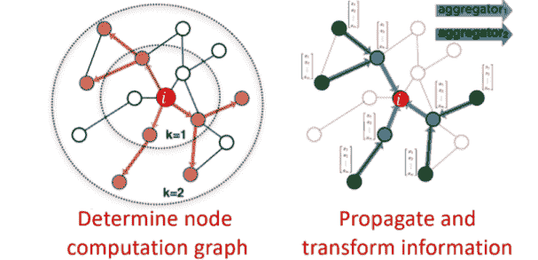
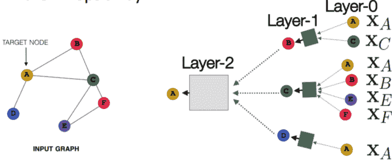
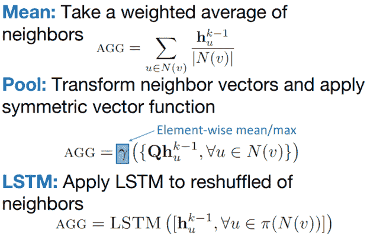

# 图形神经网络和一些 GNN 应用:你需要知道的一切

> 原文：<https://web.archive.org/web/https://neptune.ai/blog/graph-neural-network-and-some-of-gnn-applications>

最近神经网络的成功推动了模式识别和数据挖掘的研究。

像物体检测、机器翻译和语音识别这样的机器学习任务，已经被像 CNN、RNN 或自动编码器这样的端到端深度学习范式赋予了新的生命。

深度学习擅长捕捉欧几里德数据(图像、文本、视频)的隐藏模式。

但是，如果应用程序中的数据是从非欧几里得域中生成的，用对象间复杂的关系和相互依赖的图来表示，该怎么办呢？

**这就是[图形神经网络](https://web.archive.org/web/20220926084535/https://towardsdatascience.com/understanding-graph-convolutional-networks-for-node-classification-a2bfdb7aba7b)(GNN)**出现的地方，我们将在本文中探讨。我们将从图论和基本定义开始，继续学习 GNN 形式和原理，并以 GNN 的一些应用结束。

## 什么是图？

GNN 最基本的部分是图形。

在计算机科学中，**图是由两部分组成的数据结构:[节点](https://web.archive.org/web/20220926084535/https://towardsdatascience.com/understanding-graph-convolutional-networks-for-node-classification-a2bfdb7aba7b)(顶点)和边**。

一个图 ***G*** 可以定义为 ***G = (V，E)*** ，其中 ***V*** 是节点的集合， ***E*** 是它们之间的边。

如果节点之间存在方向依赖性，则边是有向的。否则，边是无向的。

图表可以表示社交媒体网络或分子之类的东西。把节点想象成用户，把边想象成连接。社交媒体图表可能是这样的:

一个图往往用**来表示，一个邻接矩阵。**

 **如果一个图有 ***n 个*** 节点， ***一个*** 有一个 ***(n × n)*** 的维数。

有时，节点具有一组特性(例如，用户配置文件)。如果节点有 ***f*** 个特征，那么节点特征矩阵 ***X*** 的维数为 ***(n × f)*** 。

### 读一些关于 GNN 的论文

### **为什么分析一个图形很难？**

图形数据非常复杂，给现有的机器学习算法带来了很多挑战。

原因是常规的机器学习和深度学习工具专门研究简单的数据类型。就像具有相同结构和大小的图像，我们可以将其视为固定大小的网格图。文本和语音是序列，所以我们可以把它们想象成线图。

但是还有更复杂的图形，没有固定的形式，具有可变大小的无序节点，其中节点可以有不同数量的邻居。

现有的机器学习算法有一个核心假设，即实例相互独立，这也没有帮助。对于图形数据来说，这是错误的，因为每个节点都通过各种类型的链接与其他节点相关联。

## 图形神经网络

图形神经网络(GNNs)是一类深度学习方法，旨在对图形描述的数据进行推理。

gnn 是可以直接应用于图的神经网络，并提供了一种简单的方法来完成节点级、边级和图级预测任务。

GNNs 可以做卷积神经网络(CNN)未能做到的事情。

### **为什么卷积神经网络(CNN)在图上会失败？**

CNN 可以用来让机器可视化事物，并执行图像分类、图像识别或对象检测等任务。这是 CNN 最受欢迎的地方。

CNN 背后的核心概念引入了隐藏卷积和池层，以通过核形式的一组感受野来识别空间定位的特征。

卷积如何对规则网格的图像进行操作？我们在二维图像上滑动卷积算子窗口，并在该滑动窗口上计算一些函数。然后，我们通过许多层。

我们的目标是将卷积的概念推广到这些简单的二维晶格之外。

让我们达到目标的见解是**卷积提取图像的一小部分(图像的一个小矩形部分)，对其应用一个函数，并产生一个新部分(一个新像素)。**

发生的情况是，该中心像素的中心节点聚集来自其邻居以及自身的信息，以产生新的值。

由于图形的任意大小和复杂的拓扑结构，在图形上执行 CNN 非常困难，这意味着没有空间局部性。

还有不固定的节点排序。如果我们第一次标记节点 A、B、C、D、E，第二次标记它们 B、D、A、E、C，那么网络中矩阵的输入将改变。图对于节点排序是不变的，所以无论我们如何排序节点，我们都希望得到相同的结果。

## 图形深度学习基础

在[图论](https://web.archive.org/web/20220926084535/https://towardsdatascience.com/graph-deep-learning/home)中，我们实现了节点嵌入的概念。它意味着将节点映射到一个 d 维嵌入空间(低维空间，而不是图的实际维度)，以便图中的相似节点彼此紧密嵌入。

我们的目标是映射节点，使得嵌入空间中的相似性近似于网络中的相似性。

我们把*和 ***v*** 定义为一个图中的两个节点。*

 ****x[u]*T5***x[v]***是两个特征向量。**

现在我们将定义编码器函数 ***Enc(u)*** 和 ***Enc(v)*** ，它们将特征向量转换为 ***z [u]*** 和 ***z [v]*** 。

注意:相似性函数可以是欧几里德距离。

**所以现在的挑战是如何实现编码器功能？**

编码器功能应能够执行:

*   位置(本地网络邻居)
*   汇总信息
*   堆叠多层(计算)

位置信息可以通过使用计算图来获得。如下图所示， ***i** 我们会看到所有可能的联系，并形成一个计算图。*

通过这样做，我们捕获了结构，同时也借用了特征信息。



*Neighborhood exploration and information sharing | [Source](https://web.archive.org/web/20220926084535/https://web.stanford.edu/class/cs224w/slides/08-GNN.pdf)*

一旦位置信息保存了计算图，我们就开始聚合。这基本上是用神经网络完成的。

神经网络用灰色方框表示。它们要求聚合是顺序不变的，如 sum、average、maximum，因为它们是排列不变的函数。此属性允许执行聚合。

让我们继续看 GNNs 中的**正向传播规则**。它决定了来自输入端的信息如何到达神经网络的输出端。



*Deep Model: Many Layers | [Source](https://web.archive.org/web/20220926084535/https://web.stanford.edu/class/cs224w/slides/08-GNN.pdf)*

每个节点都有一个特征向量。

例如，( ***X [A]*** )是节点 ***A*** 的特征向量。

输入就是那些特征向量，盒子会取这两个特征向量(***X[A]*和 ***X [c]*** )，聚合它们，然后传递给下一层。**

注意，例如，在节点 ***C*** 的输入是节点 ***C*** 的特征，但是在层 1 中节点 ***C*** 的表示将是该节点的隐藏的、潜在的表示，而在层 2 中它将是另一个潜在的表示。

因此，为了在这个计算图中执行前向传播，我们需要 3 个步骤:

**1。初始化激活单元:**

**2。网络中的每一层:**

我们可以注意到这个等式有两个部分:

*   第一部分基本上是对节点*的所有邻居进行平均。*

 **   第二部分是节点 ***v*** 乘以偏差 ***B [k]*** 的前一层嵌入，这是一个可训练的权重矩阵，基本上是对节点 ***v*** 的自循环激活。

*   **σ** :对两个零件进行的非线性激活。

**3。最后一个等式(在最后一层):**

它是嵌入在***【K】***层邻域聚合之后的。

现在，为了训练模型，我们需要定义嵌入的损失函数。

我们可以将嵌入内容输入到任何损失函数中，并运行随机梯度下降来训练权重参数。

培训可以是无人监督的，也可以是有人监督的:

*   **无监督训练:**
    仅使用图结构:相似节点有相似嵌入。无监督损失函数可以是基于图中节点邻近度或随机行走的损失。
*   **监督训练:**
    节点分类、正常或异常节点等监督任务的训练模型。

概括地说，在本节中，我们描述了通过聚集邻域信息来生成节点嵌入的基本思想。

接下来，我将讨论图形卷积网络(GCNs)。

## 图形卷积网络

gcn 首先在“图上的谱网络和深度局部连接网络”(布鲁纳等人，2014)中引入，作为将神经网络应用于图结构数据的方法。

最简单的 GCN 只有三种不同的运算符:

*   图形卷积
*   线性层
*   非线性激活

这些操作通常按此顺序进行。它们共同构成了一个网络层。我们可以将一层或多层组合起来，形成一个完整的 GCN。

在 Python 中，我们可以使用 PyTorch 轻松构建 GCN:

```py
import torch
from torch import nn

class GCN(nn.Module):
    def __init__(self, *sizes):
        super().__init__()
        self.layers = nn.ModuleList([
            nn.Linear(x, y) for x, y in zip(sizes[:-1], sizes[1:])
        ])
    def forward(self, vertices, edges):

        adj = torch.eye(len(vertices))

        adj[edges[:, 0], edges[:, 1]] = 1 
        adj[edges[:, 1], edges[:, 0]] = 1

        for layer in self.layers:
            vertices = torch.sigmoid(layer(adj @ vertices))

        return vertices
```

### **GraphSAGE idea**

GraphSAGE (Hamilton 等人，NIPS 2017)是一种动态图的表示学习技术。

它可以预测新节点的嵌入，而不需要重新训练过程。

为此，GraphSAGE 使用归纳学习。它学习聚合器函数，该函数可以基于节点的特征和邻域来诱导新节点嵌入。

我们可以注意到两个大的不同。我们使用一个通用的聚合函数，通过将两个事物连接在一起来保持它们的分离，而不是将两个事物加在一起并失去它们的踪迹。

之前，我们使用的是平均聚合函数——我们只是简单地从邻居那里获取信息，然后将它们相加，然后根据邻居的数量进行归一化。现在，我们也可以采用池式方法，或者我们也可以使用深度神经网络，如 LSTM。



*Neighbor Aggregation: Variants | [Source](https://web.archive.org/web/20220926084535/https://web.stanford.edu/class/cs224w/slides/08-GNN.pdf)*

## GNNs 的应用

正如在介绍中所承诺的，我想以 GNNs 的一些应用来结束。

图形结构的数据无处不在。GNNs 解决的问题可以分为以下几类:

1.  **节点分类:**这里的任务是通过查看样本(表示为节点)邻居的标签来确定样本的标签。通常，这种类型的问题以半监督的方式训练，只有一部分图被标记。
2.  **图分类:**这里的任务是将整个图分成不同的类别。就像图像分类一样，只是目标变成了图域。图分类的应用很多，从在生物信息学中确定蛋白质是否是酶，到在 NLP 或社会网络分析中对文档进行分类。
3.  **图形可视化:**是数学和计算机科学的一个领域，处于几何图论和信息可视化的交汇点。它关注图形的可视化表示，揭示数据中可能存在的结构和异常，并帮助用户理解图形。
4.  **链接预测:**在这里，算法必须理解图形中实体之间的关系，并且它还试图预测两个实体之间是否存在连接。在社交网络中，推断社交互动或向用户推荐可能的朋友是至关重要的。它也被用于推荐系统问题和预测犯罪协会。
5.  **图形聚类:**是指将数据以图形的形式进行*聚类*。对图形数据执行的聚类有两种不同的形式。顶点聚类寻求基于边权重或边距离将图的节点聚类成密集连接的区域组。第二种形式的图聚类将图视为要聚类的对象，并基于相似性来聚类这些对象。

让我们看看 GNN 可以解决各种挑战的跨领域应用。

### **计算机视觉中的神经网络**

使用常规 CNN，机器可以区分和识别图像和视频中的对象。尽管要让机器具有人类的视觉直觉还需要很大的发展。然而，GNN 架构可以应用于图像分类问题。

其中一个问题是场景图生成，该模型旨在将图像解析为由对象及其语义关系组成的语义图。给定图像，场景图生成模型检测和识别对象，并预测对象对之间的语义关系。

然而，GNNs 在计算机视觉中的应用数量仍在增长。它包括人与物体的互动，少数镜头图像分类，等等。

### **自然语言处理中的 GNNs**

在自然语言处理中，我们知道文本是一种序列数据，可以用 RNN 或 LSTM 来描述。然而，由于图形的自然性和易于表示，它在各种 NLP 任务中被大量使用。

最近，人们对将 GNNs 应用于大量的自然语言处理问题产生了浓厚的兴趣，如文本分类、利用机器翻译中的语义、用户地理定位、关系提取或问题回答。

我们知道每个节点都是一个实体，边描述了它们之间的关系。在 NLP 研究中，问答问题并不是最近才出现的。但它受到现有数据库的限制。虽然，使用像 GraphSage (Hamilton 等人)这样的技术，这些方法可以推广到以前看不见的节点。

### **交通中的 GNNs**

预测交通网络中的交通速度、交通量或道路密度在智能交通系统中至关重要。我们可以通过使用 STGNNs 来解决流量预测问题。

将交通网络视为一个时空图，其中节点是安装在道路上的传感器，边由节点对之间的距离来度量，每个节点都有一个窗口内的平均交通速度作为动态输入特征。

### **化学中的 GNNs**

化学家可以使用 GNNs 来研究分子或化合物的图形结构。在这些图中，节点是原子，边是化学键。

### **其他域中的 GNNs】**

GNNs 的应用不限于上述领域和任务。已经尝试将 GNNs 应用于各种问题，例如程序验证、程序推理、社会影响预测、推荐系统、电子健康记录建模、大脑网络和对抗攻击预防。

## GNNs 应用概述

应用

深度学习

描述

Deep Learning:

图形卷积网络/图形注意力网络

Description:

GNNs 在自然语言处理中的一个经典应用是文本分类。GNNs 利用文档或单词的相互关系来推断文档标签。GCN 和盖特模型被用来解决这个问题。它们将文本转换成单词图，然后使用图卷积运算来卷积单词图。他们通过实验表明，文本的词图表示具有捕捉非连续和长距离语义的优势

神经机器翻译

Deep Learning:

图形卷积网络/门控图形神经网络

Description:

神经机器翻译(NMT)被认为是序列到序列的任务。GNN 的一个常见应用是将语义信息整合到 NMT 任务中。为此，我们在句法感知 NMT 任务中利用了句法 GCN。我们也可以在 NMT 使用 GGNN。它通过将边转化为额外的节点，将句法依赖图转化为一种新的结构，因此边标签可以表示为嵌入

Deep Learning:

图形 LSTM/图形卷积网络

Description:

关系抽取是从文本中抽取语义关系的任务，这通常发生在两个或多个实体之间。传统系统将该任务视为两个独立任务的流水线，即命名实体识别(NER)和关系提取，但是新的研究表明，实体和关系的端到端建模对于高性能是重要的，因为关系与实体信息密切交互

Deep Learning:

图形卷积网络/门控图形神经网络

Description:

图像分类是一项基本的计算机视觉任务。当给定一个巨大的标记类的训练集时，大多数模型提供有吸引力的结果。现在的重点是让这些模型在零镜头和少镜头学习任务中表现良好。因此，GNN 看起来很有吸引力。知识图可以提供必要的信息来指导 ZSL(零射击学习)任务

目标检测

交互检测

区域分类

语义分割

Deep Learning:

图形注意网络

图形神经网络

图表 CNN

图形 LSTM/门控图形神经网络/图形 CNN/图形神经网络

Description:

计算机视觉任务还有其他应用，如对象检测、交互检测和区域分类。在目标检测中，GNNs 用于计算 RoI 特征；在交互检测中，GNN 是人和物体之间的消息传递工具；在区域分类中，GNNs 在连接区域和类的图上执行推理

Deep Learning:

图形神经网络/图形网络

Description:

模拟真实世界的物理系统是理解人类智能的最基本的方面之一。通过将对象表示为节点，将关系表示为边，我们可以有效地对对象、关系和物理进行基于 GNN 的推理。交互网络可以被训练来推理复杂物理系统中对象的交互。它可以对碰撞动力学等领域的各种系统属性进行预测和推断

Deep Learning:

图形卷积网络

Description:

分子指纹是代表分子的特征向量。ML 模型通过从使用固定长度指纹作为输入的示例分子中学习来预测新分子的属性。GNNs 可以取代给出分子固定编码的传统方法，以允许生成适合于需要它们的任务的可区分指纹

蛋白质界面预测

Deep Learning:

图形卷积网络

Description:

这是一个具有挑战性的问题，在药物发现中有重要的应用。所提出的基于 GCN 的方法分别学习配体和受体蛋白质残基表示，并将它们合并用于成对分类。在分子水平上，边缘可以是分子中原子之间的键或蛋白质中氨基酸残基之间的相互作用。在很大程度上，图表可以表示更复杂结构之间的相互作用，如蛋白质、mRNA 或代谢物

组合最优化

Deep Learning:

图形卷积网络/图形神经网络/图形注意力网络

Description:

组合优化(CO)是一个由从有限的对象集合中寻找最优对象组成的主题。它是金融、物流、能源、科学和硬件设计中许多重要应用的基础。大多数 CO 问题都用图来表示。在 DeepMind 和 Google 最近的一项工作中，图网被用于 MILP 求解器中涉及的两个关键子任务:联合变量赋值和限制目标值。他们的神经网络方法在大数据集上比现有的求解器更快

Deep Learning:

图形卷积网络/图形神经网络/ LSTM /RNN/关系-GCN

Description:

现实世界图的生成模型因其重要的应用引起了人们的极大关注，这些应用包括建模社会互动、发现新的化学结构和构建知识图。基于 GNN 的模型独立地学习每个图的节点嵌入，并使用注意机制来匹配它们。与标准的基于松弛的技术相比，这种方法提供了良好的性能

## 结论

在过去的几年里，图形神经网络已经成为解决任何可以用图形建模的问题的强大而实用的工具。

在本文中，我们对图神经网络做了全面的概述，并介绍了 GNN 的广泛应用。

如果你陪我到最后——谢谢你的阅读！

### 资源

### 阿迈勒·门兹利

创新、足智多谋、自我激励的数据科学家。我热衷于用数据解决难题，我相信它是我们今天最强大的工具，来回答宇宙中最模糊的问题。此外，我喜欢教学、指导和写技术博客。

* * *

**阅读下一篇**

## 在 AILS 实验室建立可扩展的医学 ML 研究工作流程[案例研究]

8 分钟阅读| Ahmed Gad |发布于 2021 年 6 月 22 日

AILS Labs 是一个生物医学信息学研究小组，致力于使人类更加健康。这个任务就是**建造模型，也许有一天可以拯救你的心脏病**。它归结为应用机器学习来基于临床、成像和遗传学数据预测心血管疾病的发展。

四名全职和五名以上兼职团队成员。生物信息学家、内科医生、计算机科学家，许多人都有望获得博士学位。正经事。

虽然业务可能是一个错误的术语，因为面向用户的应用程序还没有在路线图上，但研究是主要的焦点。**研究如此激烈，以至于需要一个定制的基础设施**(花了大约一年时间建造)来从不同类型的数据中提取特征:

*   电子健康记录(EHR)，
*   诊断和治疗信息(时间-事件回归方法)，
*   图像(卷积神经网络)，
*   结构化数据和心电图。

通过融合这些特征，精确的机器学习模型可以解决复杂的问题。在这种情况下，这是心血管一级预防的*风险分层。*本质上，它是关于**预测哪些患者最有可能患心血管疾病**。

AILS 实验室有一套完整的研究流程。每个目标都有七个阶段:

1.  定义要解决的任务(例如，建立心血管疾病的风险模型)。
2.  定义任务目标(例如，定义预期的实验结果)。
3.  准备数据集。
4.  使用 Jupyter 笔记本以交互模式处理数据集；快速试验，找出任务和数据集的最佳特性，用 R 或 Python 编码。
5.  一旦项目规模扩大，使用像 Snakemake 或 Prefect 这样的工作流管理系统将工作转化为可管理的管道，并使其可重复。否则，复制工作流程或比较不同模型的成本会很高。
6.  使用 Pytorch Lightning 与 Neptune 集成创建机器学习模型，其中应用了一些初始评估。记录实验数据。
7.  最后，评估模型性能并检查使用不同特征和超参数集的效果。

## 扩大机器学习研究的 5 个问题

AILS Labs 最初是由一小群开发人员和研究人员组成的。一个人编写代码，另一个人审查代码。没有太多的实验。但是协作变得更具挑战性，随着新团队成员的到来，新问题开始出现:

1.  数据隐私，
2.  工作流程标准化，
3.  特征和模型选择，
4.  实验管理，
5.  信息记录。

[Continue reading ->](/web/20220926084535/https://neptune.ai/blog/ml-research-workflow-case-study-ails-labs)

* * *****