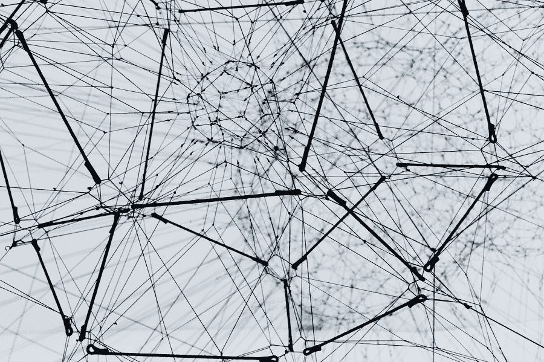

# 图形神经网络:库、工具和学习资源

> 原文：<https://web.archive.org/web/https://neptune.ai/blog/graph-neural-networks-libraries-tools-learning-resources>

图是一种数据结构，它对一组对象(节点)及其关系(边)进行建模。许多学习任务都要处理对象间具有丰富关系和相互依赖的图形数据。图有很多实际用途——在社会网络、自然科学(物理系统)、化学、医学和许多其他研究领域。这激发了深度学习研究人员对图形数据结构越来越大的兴趣。

我们将描述[图形神经网络](https://web.archive.org/web/20220928201625/https://towardsdatascience.com/a-gentle-introduction-to-graph-neural-network-basics-deepwalk-and-graphsage-db5d540d50b3) (GNNs)，涵盖流行的 GNN 图书馆，并且我们将结束伟大的学习资源让你在这个领域开始。

***先决条件**:本文假设对机器学习(ML)、深度学习(DL)和 GNNs 有基本的了解。要更深入地了解 GNN 的基础和应用，请随意查看我以前的[文章](/web/20220928201625/https://neptune.ai/blog/graph-neural-network-and-some-of-gnn-applications)。*

## 图形神经网络(GNN)概述

图形神经网络(GNNs)是最近才出现的。它们是一类深度学习模型，用于在图结构数据上学习。

GNNs 是一种神经网络，设计用于在节点、边或整个图形的级别进行预测。例如，节点级别的预测可以解决垃圾邮件检测之类的任务。基于边缘的预测任务可以是链接预测，这是推荐系统中常见的情况。基于图的预测任务可以是预测分子图的化学性质。

*Photo by Alina Grubnyak on Unsplash*

## GNN Python 库列表

让我们探索一些高质量的图形神经网络开源库，它们将在您的 GNN 之旅中为您提供帮助。

### 1) PyTorch 几何

[PyTorch Geometric](https://web.archive.org/web/20220928201625/https://pytorch-geometric.readthedocs.io/en/latest/) (PyG)是一个 Python 库，用于在图形这样的不规则结构上进行深度学习。该项目由来自多特蒙德大学的两名博士生 Matthias Fey 和 Jan E. Lenssen 开发并发布。

除了一般的图形数据结构和处理方法，它还有各种最近发布的来自关系学习和 3D 数据处理领域的方法。PyTorch Geometric 通过利用稀疏 GPU 加速、提供专用 CUDA 内核以及为不同大小的输入示例引入高效的小批量处理来实现高数据吞吐量。

### 2)深度图库(DGL)

[深度图形库(DGL)](https://web.archive.org/web/20220928201625/https://www.dgl.ai/) 是另一个易于使用、高性能、可扩展的 Python 库，用于图形的深度学习。这是一群深度学习爱好者的产品，他们被称为[分布式深度机器学习社区](https://web.archive.org/web/20220928201625/https://github.com/dmlc)。它有一个非常干净简洁的 API。DGL 引入了一个有用的高级抽象，允许自动批处理。

### 3)图网

[Graph Nets](https://web.archive.org/web/20220928201625/https://github.com/deepmind/graph_nets) 是 DeepMind 的库，用于在 Tensorflow 和 Sonnet 中构建图形网络。该库适用于 TensorFlow 的 CPU 和 GPU 版本。它提供了灵活性，几乎任何现有的 GNN 都可以使用 6 个核心函数来实现，并且它可以扩展到时态图。图网需要 TensorFlow 1，所以虽然只有 3 年左右的历史，但感觉已经过时了。

### 4)光谱

[Spektral](https://web.archive.org/web/20220928201625/https://graphneural.network/) 是一个开源的 Python 图形深度学习库，基于 Keras API 和 TensorFlow 2。这个库的主要目标是为创建 gnn 提供一个简单、灵活的框架。您可以使用 Spektral 对社交网络的用户进行分类、预测分子属性、生成带有 gan 的新图表、聚类节点、预测链接以及任何其他用图表描述数据的任务。它实现了图形深度学习的一些最流行的层。这个库是根据 Keras 的指导原则设计的，目的是在保持专家灵活性的同时，使初学者的事情变得极其简单。不幸的是，使用 Spektral 的简单性是有代价的，与 DGL 和 PyG 等其他库相比，大多数任务的训练速度都很慢。

## GNN 图书馆概述

| 库名 | 执照 | 星星 | 编程语言 | 主要贡献者 |
| --- | --- | --- | --- | --- |
| Pytorch 几何 | 麻省理工学院 | 11.2k | Python，PyTorch | 马蒂亚斯·费伊 |
| 深度图库 | 阿帕奇 2.0 | 7.4k | Python，PyTorch，TF，MxNet | 分布式 MLC |
| 图网 | 阿帕奇 2.0 | 4.9k | Python，PyTorch | 深度思维 |
| 光谱 | 麻省理工学院 | 1.8k | Python, TF2/Keras | Daniele Grattarola |

### 你应该选择哪个 GNN 图书馆？

而是选择满足你需求的库，而这个选择通常会受到你或你的经理/队友之前对深度学习库的一个选择的影响。

例如，如果您以前工作过，或者您习惯于使用 Keras 和 Tensorflow，那么 Spektral 可能是一个很好的库。对于 Graph Nets DeepMind 库，由于 TensorFlow 1，我不建议用它启动新的 GNN 项目。同时，如果你正在从事遗留项目，这是一个合理的选择。

如果您想要一个快速、功能强大的库，处于相对成熟的开发状态，并且易于将通用基准数据集集成到其他论文的实现中，那么 PyTorch Geometric 是一个不错的选择。

### 可能有用

👉如果您使用 TensorFlow/Keras 进行模型训练，请在这里查看[如何跟踪这个过程](https://web.archive.org/web/20220928201625/https://docs.neptune.ai/integrations-and-supported-tools/model-training/tensorflow-keras)。
👉另一方面，如果你使用 PyTorch，你可以[在这里](https://web.archive.org/web/20220928201625/https://docs.neptune.ai/integrations-and-supported-tools/model-training/pytorch)学习如何追踪你的跑步记录。

## 图形神经网络的最佳学习资源

在我的第一篇 GNN 文章之后，我收到了很多信息，询问理解这个主题的最佳资源。由于 GNN 油田发展非常迅速，最新的知识并不总是容易获得。

如果你想在这个领域获得实际操作的经验，这里列出了你需要收藏的最好的资源。

我认为如果你想增长关于图形神经网络的知识，这门课是必须的。它有公开的演讲幻灯片，以及推荐的阅读材料。本课程由 GraphSage 作者 Jurij Leskovec 亲自教授。我强烈建议从这门课开始。

这本书是一个大合作的结果，它塑造了一切，从内容到可视化和交互式工具。虽然这本书不是关于 GNNs 的，但它是获得坚实的图形基础的极好资源。

这本书在网上可以买到。它对图形表示学习提供了一个简单而全面的介绍，包括嵌入图形数据的方法、图形神经网络和图形的深度生成模型。它几乎拥有图形神经网络所需的所有理论。

该库包含最近的 GNN 论文，按主题如 GNN 的模型和应用(化学、NLP、交通网络和敌对攻击等)细分。).如果您对专注于 GNNs 特定应用的新论文感兴趣，这是值得一查的。

如果你想找到可以使用的带代码实现的图形神经网络模型，*带代码的纸(PwC)* 是最好的搜索地点。

这是一个组织访问技术论文的网站。在过去的几年里，它发展迅速。随着可公开获得的数据集的增加，现代研究已经开始向完全透明和可信的方向靠拢。普华永道也一直在改进自己的网站。您可以通过任务或方法(例如，注意，变形金刚)浏览，轻松浏览最新技术。

## 结论

在过去的几年中，gnn 已经成为图形领域中机器学习任务的强大而实用的工具。本文只是对图形神经网络的简单概述。我们总结了受欢迎的 GNN 图书馆，并列出了最好的学习资源，帮助你轻松进入这个广阔的领域。

我希望你喜欢这篇文章！如果您有任何问题或需要任何帮助，请随时联系我。

### 阿迈勒·门兹利

创新、足智多谋、自我激励的数据科学家。我热衷于用数据解决难题，我相信它是我们今天最强大的工具，来回答宇宙中最模糊的问题。此外，我喜欢教学、指导和写技术博客。

* * *

**阅读下一篇**

## 从哪里可以了解 MLOps？学习 MLOps 最好的书籍、文章或播客有哪些？ML 实验跟踪:它是什么，为什么重要，以及如何实施

4 分钟阅读| pawekijko | 2021 年 5 月 31 日更新

MLOps 不是小菜一碟。尤其是在当今不断变化的环境中。有许多挑战—构建、集成、测试、发布、部署和基础设施管理。你需要遵循良好的实践，并知道如何适应挑战。

如果你不学习和发展你的知识，你就会落伍。合适的资源可以帮助您遵循最佳实践，发现有用的提示，并了解最新趋势。

你不用看很远，我们会掩护你的！以下是您关于 MLOps 的最佳资源列表，包括书籍、文章、播客等。让我们开始吧！

## 1.介绍 O'Reilly 的 MLOps

*介绍 MLOps:如何在企业中规模化机器学习*是 Mark Treveil 和 Dataiku 团队(集体作者)写的一本书。它介绍了 mlop 的关键概念，展示了如何随着时间的推移维护和改进 ML 模型，并解决了 mlop 的挑战。

这本书是专门为分析和 IT 运营团队经理编写的，他们直接面对在生产中扩展机器学习(ML)的任务。这是**创建成功的 MLOps 环境**的指南，从组织到所涉及的技术挑战。

全书分为**三个部分**:

1.  对 MLOps 主题的介绍，它如何以及为什么发展成为一门学科，谁需要参与成功地执行 MLOps，以及需要什么组件。
2.  第二部分遵循机器学习模型生命周期，其中有关于*开发模型、准备生产、部署到生产、监控和治理*的章节。
3.  提供了当今公司中 MLOps 的实际例子，因此读者可以理解实际中的设置和含义。

[Continue reading ->](/web/20220928201625/https://neptune.ai/blog/learn-mlops-books-articles-podcasts)

* * *