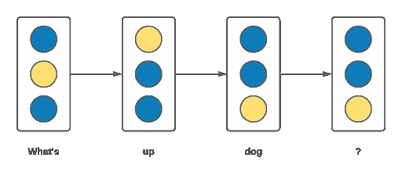
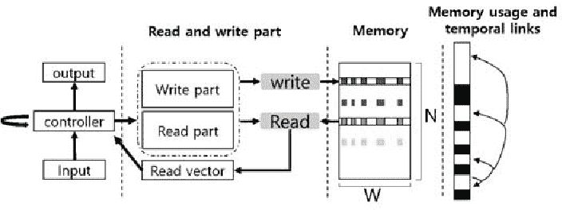
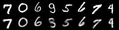

# Gumbel Softmax 损失函数指南+如何在 PyTorch 中实现

> 原文：<https://web.archive.org/web/https://neptune.ai/blog/gumbel-softmax-loss-function-guide-how-to-implement-it-in-pytorch>

训练深度学习模型从未如此简单。你只需要定义架构和损失函数，坐下来，监视，至少在简单的情况下。一些架构带有固有的随机组件。这使得正向传递具有随机性，而你的模型不再具有确定性。

> 在确定性模型中，模型的输出完全由参数值和初始条件决定。
> 
> 随机模型具有内在的随机性。同一组参数值和初始条件将导致不同输出的集合。

这意味着你不能像以前那样采样，因为从确定性函数采样会得到相同的结果，但随机函数及其附加的随机性则不能实现这一点，整个采样会变得不确定。

你看，反向传播算法依赖于在神经网络的每一层都有连续函数链。很多神经网络从根本上利用了*离散运算。*由于从离散空间采样不同于从连续空间采样，这就是 *Gumbel-Softmax 技巧*的用处。它不仅有助于从离散空间采样像连续操作，但它保持节点的随机性质完整，同时也保持反向传播步骤可行*。*

让我们通过例子来探究这些操作，以便更好地理解。

## 深度学习中的离散操作

我们在许多涉及深度学习的领域使用离散采样。例如，在语言模型中，我们有被采样的单词或字符标记序列，其中每个离散的标记对应于一个单词或一个字符。这样我们就可以从离散空间采样。



*A sequence of word tokenizations demonstrating sampling from discrete space | [Source](https://web.archive.org/web/20230107030634/https://www.youtube.com/watch?v=JFgXEbgcT7g)*

另一个流行的例子是 LSTM 循环神经网络结构。它具有用于学习长期依赖性的内部门控机制。虽然这些选通单元是连续的，但整个 LSTM 单元的操作具有某种离散的性质。

在深度学习中使用离散采样的一个更受欢迎的例子是 seq2seq DNC 架构。Seq2Seq-DNC 使用外部存储器上的读/写(离散)操作来存储编码器-解码器状态，以支持长距离依赖性。



*Operation structure of DNC memory area | [Source](https://web.archive.org/web/20230107030634/https://www.semanticscholar.org/paper/Seq-DNC-seq%3A-Context-Aware-Dialog-Generation-System-Kang-Lee/5aa26397dc670beebcc74952c2b0a99a4e44ffa4)*

使用另一种神经网络架构对这些读/写操作进行采样。在某种程度上，这个神经网络是从一个离散的空间采样。

现在我们来看看 Gumbel-Softmax 背后的动机和目的。

## 了解 Gumbel-Softmax

Gumbel-Softmax 解决的问题是处理从分类分布中生成的离散数据。让我们看看背后的内在机制。

### 甘贝尔最大技巧

Gumbel Max trick 是一种允许在神经网络正向传递期间从分类分布中采样的技术。这基本上是通过结合[重新参数化技巧](https://web.archive.org/web/20230107030634/https://sassafras13.github.io/GumbelSoftmax/)和平滑松弛来完成的。让我们看看这是如何工作的。


*Sampling from a categorical distribution by taking argmax of a combination class probabilities and Gumbel noise | [Source](https://web.archive.org/web/20230107030634/https://www.youtube.com/watch?v=JFgXEbgcT7g)*

在这种技术中，如果我们获取类别概率并对每个类别概率应用对数函数，并且对这些对数中的每一个添加 Gumbel 噪声，可以通过获取某种均匀分布的两个对数来对该噪声进行采样。这一步类似于上面重新参数化技巧中使用的步骤，我们将正态分布噪声添加到平均值中。

在结合了采样过程的确定性和随机性部分之后，我们使用 argmax 函数来查找每个样本中具有最大值的类。该类或样本被编码为独热向量，供神经网络的其余部分使用。

现在我们有了一种从分类分布中抽样的方法，与连续分布相反。然而，我们仍然不能通过 *argmax* 反向传播，因为从它得到的梯度是 0，即它是不可微的。

论文[ [3](https://web.archive.org/web/20230107030634/https://arxiv.org/pdf/1611.01144.pdf) 提出了用 *softmax 代替 *argmax* 的技术。*让我们来看看这个。

### Gumbel Softmax


*Replacing argmax with softmax because softmax is differentiable(required by backpropagation) | Source: Author*

在这种方法中，我们仍然将对数概率与 Gumbel 噪声相结合，但现在我们对样本采用 softmax 而不是 argmax。

λ(λ)是 softmax 温度参数，它允许我们控制 Gumbel-softmax 分布接近分类分布的程度。如果λ非常小，那么我们非常接近量化的分类样本，相反，随着λ的增加，Gumbel-softmax 分布变得更加均匀。

### Gumbel Softmax 的实现

在这一节中，我们将在 MNIST 数据集上训练一个变分自动编码器来重建图像。我们将在编码器状态的采样中应用 Gumbel-softmax。我们来编码吧！

*注意:我们将使用 Pytorch 作为这个实现的框架选择*

首先，让我们导入所需的依赖项。

```py
import numpy as np
from typing import Union, Optional, List, Tuple, Text, BinaryIO
import io
import pathlib
import math
irange = range

import torch
import torch.nn.functional as F
from torch import nn, optim
from torch.nn import functional as F
from torchvision import datasets, transforms
from torchvision.utils import save_image

import neptune.new as neptune
from neptune.new.types import File
run = neptune.init(project='common/pytorch-integration',
                   api_token='ANONYMOUS')
```

尽早定义一些超参数总是很方便的。

```py
batch_size = 100
epochs = 10
temperature = 1.0
no_cuda = False
seed = 2020
log_interval = 10
hard = False 
```

**如前所述，我们将利用 MNIST 来实施。还是导入吧。**

```py
is_cuda = not no_cuda and torch.cuda.is_available()
torch.manual_seed(seed)
if is_cuda:
torch.cuda.manual_seed(seed)

kwargs = {'num_workers': 1, 'pin_memory': True} if is_cuda else {}

train_loader = torch.utils.data.DataLoader(
datasets.MNIST('./data/MNIST', train=True, download=True,
transform=transforms.ToTensor()),
batch_size=batch_size, shuffle=True, **kwargs)
test_loader = torch.utils.data.DataLoader(
datasets.MNIST('./data/MNIST', train=False, transform=transforms.ToTensor()),
batch_size=batch_size, shuffle=True, **kwargs)
```

现在，我们将定义 Gumbel-softmax 采样辅助函数。

```py
def sample_gumbel(shape, eps=1e-20):
    U = torch.rand(shape)
    if is_cuda:
        U = U.cuda()
    return -torch.log(-torch.log(U + eps) + eps)
def gumbel_softmax_sample(logits, temperature):
    y = logits + sample_gumbel(logits.size())
    return F.softmax(y / temperature, dim=-1)
def gumbel_softmax(logits, temperature, hard=False):
    """
    ST-gumple-softmax
    input: [*, n_class]
    return: flatten --> [*, n_class] an one-hot vector
    """
    y = gumbel_softmax_sample(logits, temperature)

    if not hard:
        return y.view(-1, latent_dim * categorical_dim)

    shape = y.size()
    _, ind = y.max(dim=-1)
    y_hard = torch.zeros_like(y).view(-1, shape[-1])
    y_hard.scatter_(1, ind.view(-1, 1), 1)
    y_hard = y_hard.view(*shape)

    y_hard = (y_hard - y).detach() + y
    return y_hard.view(-1, latent_dim * categorical_dim)
```

接下来，让我们定义 VAE 结构和损失函数。

```py
def loss_function(recon_x, x, qy):
    BCE = F.binary_cross_entropy(recon_x, x.view(-1, 784), size_average=False) / x.shape[0]

    log_ratio = torch.log(qy * categorical_dim + 1e-20)
    KLD = torch.sum(qy * log_ratio, dim=-1).mean()

    return BCE + KLD

class VAE_gumbel(nn.Module):
    def __init__(self, temp):
        super(VAE_gumbel, self).__init__()

        self.fc1 = nn.Linear(784, 512)
        self.fc2 = nn.Linear(512, 256)
        self.fc3 = nn.Linear(256, latent_dim * categorical_dim)

        self.fc4 = nn.Linear(latent_dim * categorical_dim, 256)
        self.fc5 = nn.Linear(256, 512)
        self.fc6 = nn.Linear(512, 784)

        self.relu = nn.ReLU()
        self.sigmoid = nn.Sigmoid()

    def encode(self, x):
        h1 = self.relu(self.fc1(x))
        h2 = self.relu(self.fc2(h1))
        return self.relu(self.fc3(h2))

    def decode(self, z):
        h4 = self.relu(self.fc4(z))
        h5 = self.relu(self.fc5(h4))
        return self.sigmoid(self.fc6(h5))

    def forward(self, x, temp, hard):
        q = self.encode(x.view(-1, 784))
        q_y = q.view(q.size(0), latent_dim, categorical_dim)
        z = gumbel_softmax(q_y, temp, hard)
        return self.decode(z), F.softmax(q_y, dim=-1).reshape(*q.size())
```

**更多超参数的时间到了。**

```py
latent_dim = 30
categorical_dim = 10  

temp_min = 0.5

ANNEAL_RATE = 0.00003

model = VAE_gumbel(temperature)

if is_cuda:
model.cuda()
optimizer = optim.Adam(model.parameters(), lr=1e-3)
```

我们将以两种不同的方式进行训练和测试。

在测试函数中，我们将应用图像的重建，基本上是为了测试一个看不见的数据样本的采样和建模效率。

```py
def train(epoch):
    model.train()
    train_loss = 0
    temp = temperature
    for batch_idx, (data, _) in enumerate(train_loader):
        if is_cuda:
            data = data.cuda()
        optimizer.zero_grad()
        recon_batch, qy = model(data, temp, hard)
        loss = loss_function(recon_batch, data, qy)
        loss.backward()
        train_loss += loss.item() * len(data)
        optimizer.step()
        if batch_idx % 100 == 1:
            temp = np.maximum(temp * np.exp(-ANNEAL_RATE * batch_idx), temp_min)

        if batch_idx==0:
            reconstructed_image = recon_batch.view(batch_size, 1, 28, 28)
            grid_array = get_grid(reconstructed_image)

            run["train_reconstructed_images/{}".format('training_reconstruction_' + str(epoch))].upload(File.as_image(grid_array))
        if batch_idx % log_interval == 0:
            print('Train Epoch: {} [{}/{} ({:.0f}%)]tLoss: {:.6f}'.format(
                epoch, batch_idx * len(data), len(train_loader.dataset),
                       100. * batch_idx / len(train_loader),
                       loss.item()))

    print('====> Epoch: {} Average loss: {:.4f}'.format(
        epoch, train_loss / len(train_loader.dataset)))
    run['metrics/avg_train_loss'].log(train_loss / len(train_loader.dataset))
def test(epoch):
    model.eval()
    test_loss = 0
    temp = temperature
    for i, (data, _) in enumerate(test_loader):
        if is_cuda:
            data = data.cuda()
        recon_batch, qy = model(data, temp, hard)
        test_loss += loss_function(recon_batch, data, qy).item() * len(data)
        if i % 100 == 1:
            temp = np.maximum(temp * np.exp(-ANNEAL_RATE * i), temp_min)
        if i == 0:
            n = min(data.size(0), 8)
            comparison = torch.cat([data[:n],
                                    recon_batch.view(batch_size, 1, 28, 28)[:n]])
            grid_array = get_grid(comparison)

            run["test_reconstructed_images/{}".format('test_reconstruction_' + str(epoch))].upload(File.as_image(grid_array))

    test_loss /= len(test_loader.dataset)
    print('====> Test set loss: {:.4f}'.format(test_loss))
    run['metrics/avg_test_loss'].log(test_loss)
```

***注*** *:请在笔记本[这里](https://web.archive.org/web/20230107030634/https://ui.neptune.ai/theaayushbajaj/sandbox/n/Gumbel-Softmax-Implementation-99d2bd92-171d-4b3e-bca8-33eddaa958e0)* 找到上面代码摘录中用到的实用函数。

最后，我们将定义事件循环来联合运行所有的单个函数。

```py
for epoch in range(1, epochs + 1):
    train(epoch)
    test(epoch)

```

在成功执行结束时，您将获得 MNIST 样本的重建图像，如下所示:



只要看到重建部分和原始部分之间的对比，就可以知道 Gumbel-softmax 的采样效果如何。我们可以在下图中看到训练和测试损失收敛:

你可以在这里访问捆绑了重建图像[的完整实验，在这里](https://web.archive.org/web/20230107030634/https://app.neptune.ai/theaayushbajaj/sandbox/e/SAN-16/all?path=logs&attribute=reconstructed_images)访问上面[的代码。](https://web.archive.org/web/20230107030634/https://colab.research.google.com/drive/1OhTklED4UblF15c8uIfNJspQmm-Cr9Ih?usp=sharing)

## 你已经到达终点了！

Gumbel-Softmax 技巧可以证明在离散采样任务中非常有用，这在过去是以其他方式处理的。例如，NLP 任务几乎必然是离散的——比如单词、字符或音素的采样。

## 未来前景

Gumbel-softmax 的论文也提到了它在可变自动编码器中的有用性，但它肯定不限于此。

您可以将相同的技术应用于二进制自动编码器和其他复杂的神经网络，如[生成对抗网络(GAN 的)](/web/20230107030634/https://neptune.ai/blog/generative-adversarial-networks-gan-applications)。它似乎是无限的。

目前就这些，敬请关注更多！再见！

## 参考

1.  [https://www.youtube.com/watch?v=JFgXEbgcT7g](https://web.archive.org/web/20230107030634/https://www.youtube.com/watch?v=JFgXEbgcT7g)
2.  [https://sassafras13.github.io/GumbelSoftmax/](https://web.archive.org/web/20230107030634/https://sassafras13.github.io/GumbelSoftmax/)。
3.  [https://arxiv.org/pdf/1611.01144.pdf](https://web.archive.org/web/20230107030634/https://arxiv.org/pdf/1611.01144.pdf)
4.  [https://towards data science . com/what-is-gum bel-soft max-7f 6d 9 cdcb 90 e](https://web.archive.org/web/20230107030634/https://towardsdatascience.com/what-is-gumbel-softmax-7f6d9cdcb90e)
5.  [https://blog . ev jang . com/2016/11/tutorial-categorial-variable . html](https://web.archive.org/web/20230107030634/https://blog.evjang.com/2016/11/tutorial-categorical-variational.html)
6.  [https://arxiv.org/abs/1611.00712](https://web.archive.org/web/20230107030634/https://arxiv.org/abs/1611.00712)