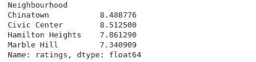
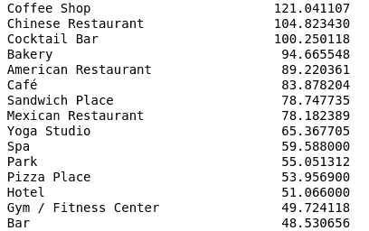
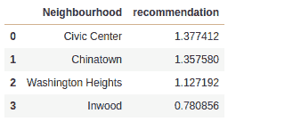

# 人工智能和人工智能如何解决旅游业中的商业问题——聊天机器人、推荐系统和情感分析

> 原文：<https://web.archive.org/web/https://neptune.ai/blog/how-ai-and-ml-can-solve-business-problems-in-tourism-organization-chatbots-recommendation-systems-and-sentiment-analysis>

随着人们离家寻求娱乐、放松和快乐，旅游业近年来有了长足的发展。至少在 COVID 时代之前，旅游业一直是一个快速增长的行业，在全球经济中发挥着重要作用。

根据联合国世界旅游组织的数据，1950 年估计有 2500 万国际游客。68 年后，国际游客增加到约 14 亿，增长了约 56 倍。

根据 [Statista](https://web.archive.org/web/20221206131935/https://www.statista.com/topics/962/global-tourism/) 的数据，旅行和旅游业在 2019 年直接为全球经济贡献了约 2.9 万亿美元。

像所有其他行业一样，旅游业不断改进服务客户的方法，让客户满意，以吸引他们再次光临。

在本文中，我们将探索:

*   机器学习提高客户满意度和解决业务问题的方式，
*   公司如何利用机器学习来改善游客体验。

我们还将经历为一个旅游相关问题建立机器学习模型的过程(数据收集、数据清理和模型建立)。

## 机器学习和旅游业

现代技术使旅行变得容易。你可以在手机应用程序中预订航班和酒店，轻松找到餐馆和娱乐场所，并在线支付一切费用。

这也意味着移动设备一直在产生大量数据。各行业通过大数据解决方案利用这一点来改善服务，让消费者的生活变得更轻松。

除了分析这些数据以发现消费者模式之外，机器学习和人工智能还用于预测未来的结果，这有助于在问题发生之前解决问题。

数据已经成为世界上最有价值的资产，也是增长的关键驱动力。机器学习在旅游业中的影响主要是针对客户满意度和参与度。

## 机器学习如何解决旅游中的问题？

### **1。聊天机器人**

如今，客户希望从为他们服务的公司获得最新信息，并需要能够快速提问和获得答案。

旅游公司过去只能雇佣前台服务员和客户服务代表。这限制了他们帮助客户的能力，有时还会因为客服人员的不良行为而导致客户流失。

随着聊天机器人的诞生，公司开始通过现有的平台，如网络浏览器和信使应用程序(WhatsApp 或脸书)，将它们用作客户的个人助理。

聊天机器人可以回答常见的问题，推荐游览城市时要去的地方或要做的事情，所有这些都非常快，没有浏览网站或等待与客户服务代理交谈的麻烦。

聊天机器人的优势:

*   节省时间，
*   个性化服务，
*   公司的财务成本非常低，
*   可以对聊天进行分析，以了解客户谈论的内容，并计划未来的改进。

### **2。推荐系统**

[推荐系统](https://web.archive.org/web/20221206131935/https://www.kdnuggets.com/2019/09/machine-learning-recommender-systems.html)无处不在。他们根据不同的因素和数据向用户推荐相关的项目。包括网飞、Linkedin 和亚马逊在内的顶级公司利用推荐系统的力量向用户推荐个性化商品。

旅游业也不例外。在这里，这些系统减少了客户流失和交易成本，为客户和服务提供商节省了时间。

公司使用客户数据和机器学习算法来建立一个推荐模型，该模型可以准确地建议最佳游览地点，而不必手动检查目录、网站或联系客户服务代理。

这些模型建立在过去的花费、旅游目的地、评分和之前选择的优惠等数据基础上。

推荐系统的好处:

*   快速提供个性化建议，
*   支持精准营销，
*   为游客提供更智能的旅行。

### **3。社交媒体情绪分析**

社交媒体已经成为从人们那里获得评论的重要方式，这可能会影响新用户对你公司的看法。

分析情绪，定位问题点，并在旅游公司中解决这些问题有助于推动增长。一些客户可能对服务不满意，而另一些客户可能很高兴，公司可以利用这些信息为自己谋利。

我们如何以自动化的方式分析这些评论来检查它们是好是坏？

通过情感分析。它使用自然语言处理，这是人工智能和人工智能的一个子领域，可以自动检查客户评论中的关系和意义。

社交媒体情绪分析的好处:

*   提供了有效的性能指标，
*   有助于了解客户，
*   帮助衡量营销活动的结果。

### **4。瞄准合适的受众**

事实证明，了解客户并知道向哪个客户推销什么是非常有效的营销策略。

客户有不同的特点，住在不同的地方，做不同的工作，挣不同的薪水。在旅游业，有些顾客可能负担得起豪华的圣托里尼度假，而有些人可能负担不起，向错误的客户群营销只能增加营销支出，而不会产生任何结果。

手动预测客户行为和细分可能是一项负担。每天都有成千上万的数据点产生，只有机器才能有效地做到这一点。

机器学习如何帮助旅游业的目标营销？

机器学习可以帮助使用聚类算法识别客户群，其中具有相似特征的客户根据旅行频率、停留时间、花费金额等特征进行分组。

机器学习还可以帮助预测客户行为，并避免不参与旅游报价的高概率客户。

锁定正确受众的好处:

*   更好的推荐，
*   转化率提高，
*   更好更有成效的广告活动。

既然我们已经讨论了机器学习和人工智能如何改善旅游业的服务和营销，让我们想象一个使用机器学习和人工智能的示例公司，以及他们将如何做。

快速演示

## **业务问题**

### 旅游公司 Humtourist 因对纽约曼哈顿的娱乐场所、餐馆和休闲中心的糟糕建议而受到顾客的差评。

这增加了客户流失率，大幅降低了收入。管理层听说了数据科学和机器学习，以及它可以提高客户满意度和增加收入。

**应用机器学习解决方案**

### 我们可以为 Humtourist 客户建立一个推荐和细分系统，以确保他们在纽约曼哈顿逗留期间获得最佳体验。

这项工作的一部分包括推荐不同活动的最佳地点/社区，包括休闲区、繁忙区、餐厅、公园等。所有这些都是为了提高客户满意度，并在曼哈顿提供有趣的体验。

注意:本教程的目的不是建立一个 100%精确的模型。在这里，我们将建立一个简单的模型。

为了构建此模型，我们将:

连接到外部数据源以获取数据，

*   使用 JSON 数据格式，
*   以准备建模的形式清理数据，
*   建立一个简单的加权平均推荐系统以及一个细分系统。
*   **先决条件**

### Python 3.0+编程知识，

*   数据预处理知识，
*   基本的机器学习知识，
*   Foursquare 账户。
*   我们将连接到外部数据源，使用应用程序编程接口(API)提取数据。

Foursquare 是一个定位技术平台，致力于改善人们在世界各地的移动方式。优步、脸书、苹果和三星等公司利用 Foursquare 的开发者工具来帮助了解手机位置。

我们将使用 Foursquare 的 API 来获取必要的数据，但首先您需要:

在 foursquare 开发者页面创建一个账户。

1.  将客户端 ID 和客户端密钥复制到便笺中。
2.  **编码步骤**

### 首先，我们将添加来自[https://cocl.us/new_york_dataset](https://web.archive.org/web/20221206131935/https://cocl.us/new_york_dataset)的纽约州区数据。在预处理过程中，我们将提取区，邻居，纬度和经度数据。

因为我们将只关注曼哈顿区，所以我们将只提取曼哈顿的数据。

接下来，我们将使用 Foursquare API 来提取地点，并以一种准备建模的形式预处理这些数据。

```py
import numpy as np 
import pandas as pd 
Import requests
from sklearn.cluster import KMeans 
import json 

!wget -q -O 'newyork_data.json' https://cocl.us/new_york_dataset

with open('newyork_data.json') as json_data:
    newyork_data = json.load(json_data)

neighborhoods_data = newyork_data['features']

column_names = ['Borough', 'Neighbourhood', 'Latitude', 'Longitude']
neighbourhoods = pd.DataFrame(columns=column_names)

for data in neighborhoods_data:
    borough = neighborhoods_name = data['properties']['borough']
    neighborhoods_name = data['properties']['name']

    neighborhoods_latlon = data['geometry']['coordinates']
    neighborhoods_lat = neighborhoods_latlon[1]
    neighborhoods_lon = neighborhoods_latlon[0]
    neighborhoods = neighborhoods.append({
        'Borough': borough,
        'Neighbourhood': neighborhoods_name,
        'Latitude': neighborhoods_lat,
        'Longitude': neighborhoods_lon,
    }, ignore_index=True)

manhattan = neighborhoods[neighborhoods['Borough'] == 'Manhattan'].reset_index(drop=True)
```

我们需要客户机 ID 和客户机密钥来首先构建细分系统，然后构建推荐系统。查看场馆的 [Foursquare 文档](https://web.archive.org/web/20221206131935/https://developer.foursquare.com/docs/api-reference/venues/search/https://api.foursquare.com/v2/venues)。

**上面的代码块产生下面的输出:**

```py
CLIENT_ID = '*****************'
CLIENT_SECRET = '************************'
VERSION = '20200202'
LIMIT = 100
radius=500

def getNearbyVenues(names, latitudes, longitudes, radius=500):

    venues_list=[]
    for name, lat, lng in zip(names, latitudes, longitudes):

        url = 'https://api.foursquare.com/v2/venues/explore?&client_id={}&client_secret={}&v={}&ll={},{}&radius={}&limit={}'.format(
            CLIENT_ID, CLIENT_SECRET, VERSION, lat,
            lng, radius, LIMIT)

        results = requests.get(url).json()["response"]['groups'][0]['items']

        venues_list.append([(
            name, lat, lng, v['venue']['name'], v['venue']['id'],
           v['venue']['location']['lat'], v['venue']['location']['lng'],
           v['venue']['categories'][0]['name']) for v in results])

     nearby_venues = pd.DataFrame([item for venue_list in venues_list for item in venue_list])
     nearby_venues.columns = ['Neighbourhood', 'Neighbourhood Latitude', 'Neighbourhood      Longitude',  'Venue', 'id', 'Venue Latitude', 'Venue Longitude','Venue Category']

    return(nearby_venues)

manhattan_venues = getNearbyVenues(names=manhattan['Neighbourhood'],
                                   latitudes=manhattan['Latitude'],
                                   longitudes=manhattan['Longitude']
                                  )

```

现在我们已经准备好了我们的场馆和场馆类别，我们将只提取必要的数据，一个热编码，找到前 10 个最常见的场馆，并建立我们的细分系统。

**上面的代码块产生下面的结果:**

```py
manhattan_seg_onehot = pd.get_dummies(manhattan_venues[['Venue Category']], prefix="", prefix_sep="")

manhattan_seg_onehot['Neighbourhood'] = manhattan_venues['Neighbourhood']
fixed_columns = [manhattan_seg_onehot.columns[-1]] + list(manhattan_seg_onehot.columns[:-1])
manhattan_seg_onehot = manhattan_seg_onehot[fixed_columns]

manhattan_seg_group = manhattan_seg_onehot.groupby('Neighbourhood').mean().reset_index()

def return_most_common_values(row, num_top_venues):
    row_categories = row.iloc[1:]
    row_categories_sorted = row_categories.sort_values(ascending=False)

    return row_categories_sorted.index.values[0: num_top_venues]

columns = ['Neighbourhood']
num_top_venues = 10
indicators = ['st', 'nd', 'rd']
for ind in np.arange(num_top_venues):
    try:
        columns.append('{}{} Most Common Venue'.format(ind+1, indicators[ind]))
    except:
        columns.append('{}th Most Common Venue'.format(ind+1))

manhattan_venues_seg = pd.DataFrame(columns=columns)
manhattan_venues_seg['Neighbourhood'] = manhattan_seg_group['Neighbourhood']

for ind in np.arange(manhattan_seg_group.shape[0]):
    manhattan_venues_seg.iloc[ind, 1:] = return_most_common_values(manhattan_seg_group.iloc[ind, :], num_top_venues)
```

这些是曼哈顿不同街区最常见的场所。

接下来，我们将使用 KMeans 算法，这是一种用于我们的分段系统的聚类算法。

我们将 K 参数设置为 5。您可以尝试不同的数字，或者更好的是，使用肘方法来确定最佳 K 值。

**模型构建完成，现在让我们看看来自集群 0、1 和 2 的一些结果:**

```py
From sklearn.cluster import KMeans
man_cluster = manhattan_seg_group.drop('Neighbourhood', 1)
km = KMeans(n_clusters=5, random_state=0).fit(man_cluster)

manhattan_venues_seg.insert(0, 'Cluster', km.labels_)
manhattan_merge = manhattan
manhattan_merge = manhattan_merge.join(manhattan_venues_seg.set_index('Neighbourhood'), on='Neighbourhood')
```

**集群 0:**

**集群 1:**

**集群 2:**

从我们的细分系统中，我们可以看到聚类 0 由活跃区域(餐馆、剧院、健身房、咖啡馆、商店)组成，聚类 1 主要由餐馆组成，聚类 2 由娱乐和放松场所组成。

现在我们已经完成了我们的细分系统的构建，是时候构建我们的简单加权平均推荐系统了。

Foursquare 每天只允许 50 个高级 API 调用，用于场地评级等类别。既然我们已经有了收视率的数据，我们就把它们读进去。在下一阶段，我们将预处理收视率数据，并加入场馆数据。

**下面的结果显示了每个社区整体评分的平均值:**

```py

manhattan_rec_data = pd.concat([manhattan_venues[0:298],manhattan_venues[2579:2679]],  axis=0).reset_index(drop=True)
manhattan_rec_data['ratings'] = rating['rating']
manhattan_rec_data.tail()

manhattan_rec_data = manhattan_data[manhattan_data['ratings'] != 'not rated']
manhattan_rec_data.reset_index(drop=True,inplace=True)

from sklearn.preprocessing import LabelEncoder

recommender_onehot = pd.get_dummies(manhattan_data[['Venue Category']], prefix="", prefix_sep="")

recommender_onehot['Neighbourhood'] = manhattan_data['Neighbourhood']

fixed_columns = [recommender_onehot.columns[-1]] + list(recommender_onehot.columns[:-1])
recommender_onehot=recommender_onehot.groupby(['Neighbourhood'], sort=False).sum()

matrix = recommender_onehot.reset_index(drop=True)

rec_rating=manhattan_data[['Neighbourhood','ratings']]

rec_rating['ratings'] = rec_rating['ratings'].astype('float')

rec_rating_grouped=rec_rating.groupby('Neighbourhood', sort=False)['ratings'].mean()
rec_rating_grouped

```

现在，让我们通过在评分和矩阵之间执行点积来确定用户评分权重。我们还将通过将邻域乘以权重并取加权平均值来创建最终评级表。



现在推荐表做好了。让我们来看看最受推荐的 4 个街区:

```py
final_rating=pd.DataFrame(rec_rating_grouped)
final_rating=final_rating.reset_index()

user_rate = matrix.transpose().dot(final_rating['ratings'])

user_rate.sort_values(ascending=False)

```



```py
rec_df= ((recommender_onehot*user_rate).sum(axis=1))/(user_rate.sum())
rec_df = rec_df.sort_values(ascending=False)

top4=pd.DataFrame(rec_df)
top4=top4.reset_index()
top4.columns=['Neighbourhood','recommendation']

```

因为市民中心是我们最推荐参观的街区，所以让我们来看看最热门的活动:



因此，无论何时用户发现自己在曼哈顿，他/她都应该访问市民中心，去水疗中心，一定要去咖啡店，并在那家法国餐厅点一些法国菜。

结果和讨论

当 Humtourist 的客户在曼哈顿时，我们的系统会推荐最好的社区，并在我们的细分系统的帮助下，向他们显示不同活动的最佳社区。

## 我们的分析显示，曼哈顿的大多数场所都是餐馆。此外，我们发现咖啡店和中国餐馆是最值得推荐的场所，我们还发现唐人街对中国餐馆的总体评分有很大影响，而市民中心对咖啡店的总体评分也有很大影响。

我们的模型还向我们展示了用户在曼哈顿时可以参与的不同顶级活动。

这个系统可以通过获得更多的数据来进一步改进，但目前这只是一个简单的演示。

结论

对于这篇文章，我们探索了:

机器学习如何帮助旅游业，

## 现代旅游业如何使用机器学习，

如何构建简单的推荐和细分系统？

*   旅游业目前处于混乱状态，但一旦 COVID 的情况得到解决，它很可能会跳回到它的高数字。机器学习和人工智能就在那里，帮助公司维持运营并实现增长。
*   感谢您的阅读！
*   How to build simple recommendation and segmentation systems.

The tourism industry is in shambles at the moment, but once the COVID situation is resolved, it will most likely jump back to its high numbers. Machine learning and AI will be right there, helping companies stay afloat and generate growth.

Thank you for reading!