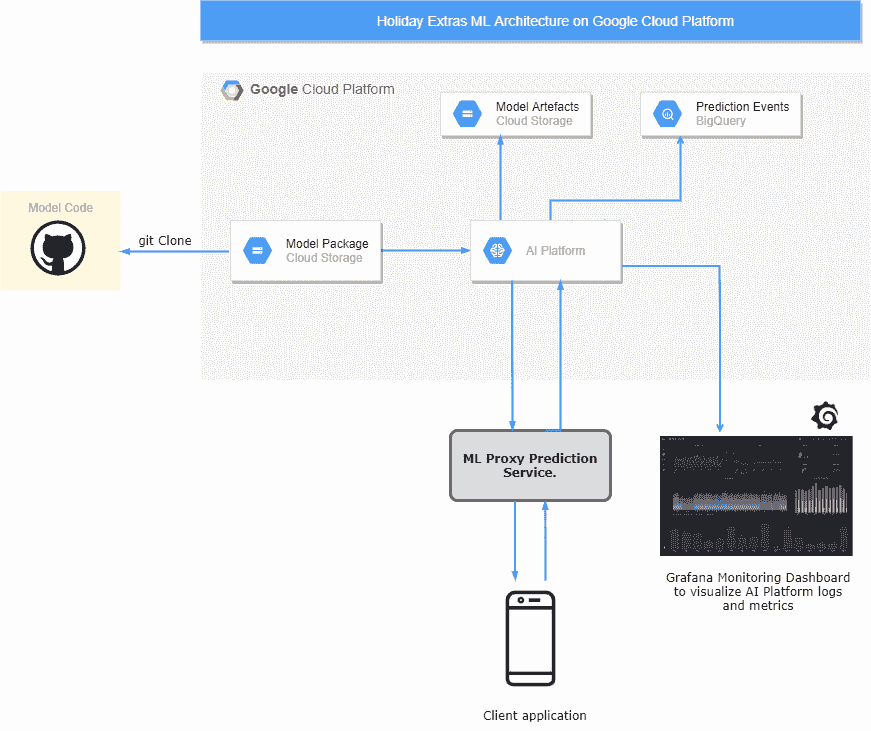

# 这 8 家公司如何实施 MLOps:深度指南

> 原文：<https://web.archive.org/web/https://neptune.ai/blog/how-these-8-companies-implement-mlops>

你可能已经看到了(不是最近的，但仍然是真实的)新闻:

没错。不幸的是，有很多公司试图以一种对他们的业务有意义的方式运作他们的 ML 项目，但从未真正实现成功的实施。

人工智能项目成功的最后一英里是生产中模型的部署和管理。这是决定任何人工智能或机器学习项目**完全* *成功的因素——在生产环境中部署和管理解决方案的能力。

但是，与其关注坏消息，我们不如**聚焦 8 家公司如何以商业上有意义的方式实施[MLOps](/web/20221206030915/https://neptune.ai/blog/mlops-what-it-is-why-it-matters-and-how-to-implement-it-from-a-data-scientist-perspective)**，以及你可以从他们的方法中学到什么。

这篇文章的主要目的是让你深入了解这些公司如何运用 ML 解决方案来改善他们业务的某些方面。在一些例子中，我将解释技术解决方案，而在其他例子中，我将提供更广泛的概述。

根据[Mike Gualtieri](https://web.archive.org/web/20221206030915/https://www.forrester.com/bio/mike-gualtieri?id=BIO1858)(Forrester Research 首席分析师)在**网络研讨会上的观点，任何公司成功部署 MLOps 都有 8 个关键要求**。任何公司的 ML 平台都必须能够:

1.  支持不同工具及其依赖关系创建的多种机器学习模型格式。
2.  提供 ML 生命周期所需的基础设施资源。
3.  提供内部、云和边缘的部署自由度。
4.  确保模型治理来解释和审计模型的使用。
5.  确保模型的安全性和完整性。
6.  使用用于创建原始数据的数据管道、算法和代码，在较新的数据上重新训练生产模型
7.  为 DevOps、Ops 和 MLOps 专业人员提供可视化工具。
8.  监控模型，以确保模型正在执行，持久，没有伤害。

在本文中，我们将了解成功满足上述所有关键要求的公司。我们还将根据平台将公司分为 3 种不同类型的 MLOps 实施:

*   **基于云/无服务器的实施:**使用全套云解决方案和托管服务实施 MLOps 的公司。
*   **使用托管平台的端到端实施:**使用托管平台(如 DataRobot)和/或其他 AutoML 工具实施端到端 MLOps 的公司。
*   **内部 ML 平台实施:**管理其 MLOps 流程实施的公司。

## 希望实施 MLOps？这可能有助于…

成功实施 MLOps 还需要跟踪工作流程中每个相关组件的活动。这包括你的数据，模型，以及你的机器学习管道的其他方面！

很多时候，MLOps 项目失败或不可持续，因为团队不知道:

*   他们的数据从哪里来，将会在哪里结束，
*   模型在实验过程中使用的数据版本；这使得实践的再现性差，
*   如何跟踪实验并节省他们用于诊断问题的时间，
*   如何确保他们的数据和模型能够被监管机构和用户审计以符合要求，
*   他们的模型的哪个版本最终投入生产，以及他们如何监控和跟踪其配置，
*   以及由于没有记录他们的 MLOps 过程而产生的许多问题。

令人欣慰的是，当我们可以使用一个[元数据存储库](/web/20221206030915/https://neptune.ai/product#what-is-metadata-store)来自动记录来自我们的数据、模型和实验过程的活动时，我们不必担心这种乏味的记录——这可以将团队的生产率提高 10 倍！

MLOps 最好的元数据存储之一是 Neptune——一个为运行大量实验的研究和生产团队构建的工具。您可能有一个开发和部署模型的困难任务；通过使用“第二大脑”来[记录来自 MLOps 实施的元数据](https://web.archive.org/web/20221206030915/https://docs.neptune.ai/you-should-know/what-can-you-log-and-display)，提高您的工作效率。

Neptune.ai 对一个用户[免费，对一个团队](/web/20221206030915/https://neptune.ai/pricing)付费。最棒的是，在看到它能让你的工作效率提高 10 倍之前，你不必注册。你可以[在你的浏览器](https://web.archive.org/web/20221206030915/https://app.neptune.ai/o/common/org/example-project-tensorflow-keras/experiments?split=tbl&dash=charts&viewId=44675986-88f9-4182-843f-49b9cfa48599) **中直接查看一个范例项目，没有任何附加条件**。

## TL；8 家完全实施了 MLOps 的公司的灾难恢复摘要

| 公司名称 | 商业目标 | 工业 | MLOps 实施流程 | ML 用例(对于本文) |
| --- | --- | --- | --- | --- |
|  | 

向顾客提供旅游安排套餐。

 |  |  | 

个性化和推荐

 |
|  | 

优化顾客的杂货购物体验和零售商的服务体验。

 | 零售和消费品 |  | 

订单管理中的欺诈检测

 |
|  | 

为顾客提供新鲜的手工化妆品。

 |  | 

->操作-设备- >部署-

- |  |
|  | 

帮助客户最大限度地利用他们的资金。

 |  |  |  |
|  | 

为个人提供信贷、简单的支付解决方案、高收益的投资机会和易于使用的个人理财工具。

 |  | 

全托管端到端 AI 平台- > DataRobot

 | 

贷款审批及信用评分

 |
|  | 

以快速高效的方式，将驾车和送货与乘车者、用餐者和餐馆联系起来。

 |  | 

内部(开源)机器学习平台- >米开朗基罗

 | 

通用 ML 用例

 |
|  | 

为自己的用户提供一个最优的、个性化的电影流媒体服务。

 |  | 

内部(开源)机器学习平台- >元流

 | 

通用 ML 用例

 |
|  | 

成为每个城市最后一公里的物流层。

 | 

网上订餐和物流

 | 

内部机器学习平台

 | 

门口通用 ML 用例

 |

免责声明:

### 虽然这篇文章是对这些公司如何实施 MLOps 的深入指导，但它并没有提供这些公司流程的详尽细节。可以在底部的参考资料部分找到了解这些领域的更多信息的资源。

*   我通过联系和使用直接和间接来源，尽最大努力提供有关这些公司的 MLOps 实施流程的最新和最准确的信息。如果您觉得任何信息有错误或需要更新，请不要犹豫，通过 [LinkedIn](https://web.archive.org/web/20221206030915/http://www.linkedin.com/in/stephenoladele) 或 [Twitter](https://web.archive.org/web/20221206030915/http://www.twitter.com/nercyberartist) 联系我。
*   采用无服务器解决方案实施 MLOps 的公司

## 1.假日临时演员

### [Holiday extras](https://web.archive.org/web/20221206030915/https://www.holidayextras.com/) 是一家旅游和物流公司，提供机场停车、酒店、剧院、主题公园、家庭度假、汽车租赁和其他服务的安排和套餐。

Holiday Extras 如何实现机器学习操作(MLOps)

#### 机器学习在 Holiday Extras 的核心用途是**优化客户决策**以及其他用途，如定向广告、个性化推荐客户体验、自动化服务价格、自动化电话处理等等。它们的实现架构可以在下面找到。

将模型部署到生产中

*Holiday Extras implementation architecture*

#### 虽然我无法在网上找到很多关于他们的 ML 工程流程的细节，但我确实找到了 Rebecca Vickery 关于他们如何在 Holiday Extras 部署和扩展 ML 模型的演讲(所有链接都在参考资料中)。

在 Holiday Extras，开发机器学习模型的代码是用 Cookie Cutter 结构化和模板化的，并被推送到该公司的 GitHub 存储库中。Scikit-learn 用作建模库。数据转换被配置为 sci-kit 学习管道，在模型代码中带有自定义转换器。团队内置了定制的评分和预测例程(用于尝试非标准预测)。

模型代码从 GitHub 克隆到 Google 云存储(GCS)。他们使用人工智能平台来训练他们的模型。模型文件和元数据(模型配置)被返回到 GCS。评估一个模型，AI 平台将预测服务公开为一个端点，客户端可以使用正确的数据模式调用该端点。

ML 代理是预测服务，它与客户端请求和查询 AI 平台的预测进行交互。ML 代理为 AI 平台期望的数据定义模式，以便其他服务可以使用期望的数据模式查询 AI 平台端点。

监控生产中的模型性能

#### 为了监控数据漂移，Holiday Extras 使用 Google BigQuery 来记录预测事件，以便可以使用 Data Studio 或 Looker 等工具来可视化性能和漂移。

他们还使用 Grafana(与他们的运营生态系统集成)来可视化从 AI 平台记录的事件，这些事件表现为预测评分指标、警报和错误、系统指标以及到达端点的请求数量的延迟。

迭代和模型生命周期管理

#### 数据科学团队相互密切合作，管理生产中 ML 解决方案的整个生命周期，他们还与作为部署流程关键部分的其他团队合作，以确保生命周期管理的批准流程得到妥善处理。

解释和审计模型使用的模型治理

#### 对于治理，Google Cloud AI 平台中启用了模型版本控制，提供了所有的培训和性能细节，以便可以跟踪模型的血统。

2.奥卡多

### [Ocado](https://web.archive.org/web/20221206030915/https://www.ocado.com/) 是世界上最大的网上超市之一，当顾客浏览他们的网站和应用程序、将商品添加到手推车、选择送货位置和检查订单时，他们的系统每分钟处理数百万起事件。

这当然会让你想到一个成功实现的机器学习解决方案可以利用的数据量。

Ocado 零售部门的**业务目标**是:

确保购物体验直观且有益于顾客(准时交货、安全交易、食品的保质期长；

*   仓单管理系统必须高效，以便大规模运营，从而改善客户或零售商的体验；
*   员工和供应链员工的体验都很方便。
*   Ocado 如何实现机器学习操作(MLOps)

#### 基于上述业务目标，Ocado 的机器学习的一些核心用途包括:

个性化并向客户推荐产品

*   在欺诈交易发生之前检测它们
*   预测产品需求，以保持产品新鲜，减少食物浪费(由于库存过多)和库存不足
*   管理提取和包装订单的仓库机器人
*   扩大客户联络中心
*   优化供应链路线，保持交付新鲜，减少燃料排放
*   在这份实施报告中，我们将重点关注 Ocado 实施其欺诈检测机器学习解决方案的方式。该解决方案的业务目标是，当通过订单管理系统下订单时，自动有效地确保交易合法。您可以在下面找到实现架构。

Ocado 使用 Google Colaboratory 进行内部笔记本评论。你可以在谷歌数据实验室等托管笔记本上使用谷歌大查询的数据。

训练管道由通过云数据流流入 BigQuery 的数据组成，训练由 Cloud Composer 安排和协调。对于在训练管道中进行的操作，来自被摄取到数据流中的数据的特性通过使用 Apache Beam 编写的一组转换进行转换，并作为一组特性库加载到 BigQuery 中。云数据流上的 Apache Beam 转换也被再次编写，用于进一步的功能工程和数据准备方法，并加载到 Google 云存储(GCS)和 Google Datastore(用作功能存储)。

为了进行训练，AI 平台在 GCS 中对转换后的特征进行训练，并存储该模型的实例(版本化),该实例包括训练元数据和模型文件。Python 用于建模，深度神经网络算法用于构建模型。

将模型部署到生产中

#### 将模型部署到生产由 AI 平台管理，该平台将模型公开为任何其他服务都可以调用或发送请求的预测服务。Google Cloud Datastore 充当服务的特性存储，用于获取客户详细信息和过去的交易，以便来自客户端请求的特性能够通过 BigQuery 中转换后的特性存储库的特性得到丰富。

监控模型在生产中的性能

#### 在进行研究时，我找不到任何直接或间接的来源来证实 Ocado 用于监控其欺诈检测服务的技术堆栈。但是，在他们 3 年前的一次谈话中，他们确实提到他们将使用 Google Cloud Data Studio 来可视化预测日志和模型指标。

人们还可以假设他们可能使用 Stackdriver(这是 Google Cloud 的默认云监控服务)来监控服务的运行性能。

生命周期管理和模型治理

#### 培训管道计划每天运行，因此每天都有新的模型版本可用。

Ocado 的数据治理团队参与数据管理流程和云中数据基础设施的设置。

在责任和审计方面，由于 Ocado 的微服务文化，发生的事件可以根据血统进行追溯。这确保了数据接收、数据转换和一般数据沿袭的触发可以在整个系统中及时追溯。

对于治理和可解释性，欺诈代理被用作人在回路中的主题专家来分析系统评分阈值(精确度、召回率、真阳性率和假阳性率)有问题的订单，以便他们可以查看该订单并提供关于交易是否合法的解释。

3.丰富的

### LUSH 是一家总部位于英国的全球化妆品零售商，为顾客提供新鲜的手工化妆品。以新鲜和可持续的方式提供手工化妆品是他们的核心商业目标之一。

LUSH 如何实现机器学习操作(MLOps)

#### 我们将要研究的机器学习用例是由 [Datatonic](https://web.archive.org/web/20221206030915/https://datatonic.com/) 为 LUSH 部署的。在作为商业目标的可持续发展方面，LUSH 采用了机器学习来识别货架上没有包装的产品，以便当客户走进商店购买产品时，他们启动应用程序，将相机对准他们想要购买的产品，系统会实时识别它(没有包装)，并将其添加到客户的购物车中。部署是在设备上进行的，操作只发生在谷歌云上。

产品上的图像被收集并上传到谷歌云存储(GCS)。图像通过转换为 TensorFlow 固有的 TFRecords 格式进行预处理，从而实现高效的模型训练。来自*的图像转换。jpeg* 到*。tfrecords* 是用 Apache Beam 写的，运行在云数据流上。在将数据加载回 GCS 之前，转换还会将数据分成训练集和评估集。

数据增强发生在使用 TensorFlow 的图像预处理功能的 AI 平台内。由于产品之间非常相似，并且化妆品总是会改变形状，所以增加的步骤非常关键。训练和评估发生在 AI 平台上，使用存储在 Google BigQuery 中的迁移学习和评估指标来监控实验(存储像实验的 run_id、实验运行的时间、模型指标、类的数量等信息)。如果基于给定的性能阈值，该模型适合生产，则使用 [TFLite 模型转换器 API](https://web.archive.org/web/20221206030915/https://www.tensorflow.org/lite/convert) 将该模型转换为*，将其转换为设备上的模型。tflite* 格式，可以跨平台工作(iOS 和 Android 设备都可以)。生产就绪模型存储在 Google 云存储中并进行版本控制。您可以通过查看参考资料一节中的参考资料找到关于该模型的更多信息。

将模型部署到生产中

#### 部署的模型是 mobilenetv2 模型，非常适合于设备上的视觉任务，大小约为 3.5 MB，模型评分采用 F1-score。

监控模型在生产中的性能

#### 没有关于如何在设备上监控模型性能的信息，也没有关于应用程序是否记录回(到云)各种性能指标的信息。

迭代和模型生命周期管理

#### 为了管理生产中的模型，Cloud Composer(一个在 Apache Airflow 上运行的托管服务)被用来自动化(通过触发器)模型的重新训练和部署。无论何时发布新产品，将这些产品的足够多的图像添加到 GCS 中，或者已经训练出更好的模型，该应用程序都可以持续更新。

解释和审计模型使用的模型治理

#### 在治理的情况下，AI 平台将关于训练模型的有用元数据记录到 GCS，以便可以跟踪模型血统。将数据存储在 Google Cloud 上可能也有助于 LUSH 在团队想要审计事件时进行数据沿袭追踪。

4.革命报

### Revolut 是一家总部位于英国的金融科技公司，为其客户提供银行服务。它的核心业务是帮助客户最大限度地利用他们的资金。

Revolut 如何实现机器学习操作(MLOps)

#### 用“金融超级应用”帮助客户最大限度地利用他们的资金，听起来像是机器学习可以派上用场的事情——特别是在应用程序上几乎所有东西的交易数据方面。作为一项金融服务，Revolut 使用机器学习来自主冲刷数百万笔交易，并打击欺诈性的卡交易，以避免因欺诈造成的损失，并确保客户交易的安全。Revolut 构建的卡欺诈预防系统被标记为夏洛克，完全无服务器的实现架构可以在下面找到。

在数据/特征管理的情况下，很像 Ocado 的实现，夏洛克在数据流上使用 Apache Beam 转换来转换提取后的数据。CatBoost 被用作使用 boosting 算法构建模型的建模库。Python 被用作模型开发和模型部署的主要语言。

将模型部署到生产中

#### 使用 Google Cloud Composer(在 Apache Airflow 上运行)完成生产流程编排的培训。该模型作为 Flask 应用程序部署在 AppEngine 上。为了降低延迟，模型被缓存在内存中。还有 Couchbase(他们存储客户和用户资料的内存数据库)。

引用[这个消息来源](https://web.archive.org/web/20221206030915/https://medium.com/revolut/building-a-state-of-the-art-card-fraud-detection-system-in-9-months-96463d7f652d):“通过 HTTP POST 请求收到交易后，夏洛克应用程序从 Couchbase 获取相应用户和商家的资料。然后，它生成一个特征向量(使用与生成训练数据的 Apache Beam 作业中创建的特征相同的特征)并进行预测。然后，该预测在 JSON 响应中被发送到处理后端，在那里采取相应的行动——所有这些都在 50 *ms* 内完成

监控模型在生产中的性能

#### 为了监控他们的生产系统，Revolt 使用了:

Google Cloud Stackdriver 监控操作性能，如延迟(系统响应速度)、每秒处理的事务数量等。一切都是实时的！

*   Kibana 用于功能性能监控，如监控商户、警报和欺诈数量、真阳性率(TPR)和假阳性率(FPR)。
*   对于警报，Google Cloud Stackdriver 会向团队发送电子邮件和短信，以便欺诈检测团队对问题进行分类。你可以在下面找到一个基巴纳可视化的例子。

迭代和模型生命周期管理

#### 确认交易是否欺诈的责任委托给了用户，因此团队在构建直观的用户界面以获得优质用户体验方面付出了更多努力。下面是一个用户在夏洛克将交易归类为欺诈的场景中看到的示例。

虽然没有提到模型再训练是如何发生的，但它被认为很像 Ocado 的情况，来自用户的反馈作为基本事实(标签)被返回到数据库中，并且模型被安排在频繁和定期之间进行再训练。

解释和审计模型使用的模型治理

#### 也没有提到模型在生产中是如何被治理的，特别是对于像这样的用例，必须有一个人在回路中的 SME(主题专家)来审查。基于该实现，假设用户将发送关于用他们的帐户处理的交易是否是欺诈的准确信息。

对于审计模型，在 Google Cloud AI Platform(Cloud ML Engine)中启用了模型版本控制，提供了所有的训练和性能细节，以便可以跟踪模型血统。

利用端到端托管人工智能平台实施 MLOps 的公司

## 5.碳

### [Carbon](https://web.archive.org/web/20221206030915/https://getcarbon.co/) 是一家总部位于拉各斯(尼日利亚)的金融科技公司，为个人提供信贷、简单的支付解决方案、高收益的投资机会和易于使用的个人财务管理工具。

Carbon 如何实现机器学习操作(MLOps)

#### Carbon 的核心业务是以比传统银行贷款更快的简单、便捷的流程提供消费者贷款。为了以简单、方便和快速的流程向信用良好的客户提供贷款，Carbon 采用了机器学习。

为了有效地为其业务运营机器学习解决方案，Carbon 使用 DataRobot 来建立稳健的信用风险模型，为他们节省了整个端到端的流程，并让公司有时间获取正确的数据，并做出其他有助于推动业务发展的决策。

它使用 DataRobot 的信用风险算法引擎来支持其移动应用程序。这不仅大大减少了公司实施机器学习解决方案所需的时间，还帮助企业实现了快速批准(或拒绝)贷款的目标，扩展到大量用户，并且足够准确，以确保一定程度的自治。

系统的工作方式(引用参考资料部分的来源):

*当消费者在移动应用程序上提交申请时，Carbon 的模型利用来自第一、第二和第三方来源的各种数据来建立信用评级。在五分钟内，用户将获得信用评级，“好”客户将获得更好的利率和更高的限额，而高风险客户将获得更高的利率。*

Carbon 每月通过 DataRobot 的预测 API 处理 15 万份贷款申请，并在 DataRobot MLOps 中跟踪这些部署。四个独立的记分卡提供了对每个客户贷款违约可能性的洞察。该应用程序随后会相应调整其贷款条款。碳算法还考虑了欺诈和反洗钱行为。

随着他们以同样的目标扩展到其他国家，DataRobot 平台允许他们在建立客户数据库时重新培训和重新部署他们的模型。

使用内部端到端机器学习平台实施 MLOps 的公司

## 6.优步

### 优步是世界上最受欢迎的拼车公司。通过优步应用程序，那些开车和送货的人可以与骑手、食客和餐馆联系。

优步的许多服务作为机器学习解决方案具有商业意义。从智能地估计司机的到达时间或骑手的位置，到根据用户的需求和司机的供应确定最佳的行程费用，这些都是优步业务的核心。

优步如何实现机器学习操作

#### 根据他们的[工程博客](https://web.archive.org/web/20221206030915/https://eng.uber.com/uber-science-machine-learning-platform/)，机器学习帮助优步做出数据驱动的决策。它不仅支持拼车(目的地预测、司机-乘客配对、预计到达时间等)等服务，还支持财务规划和其他核心业务需求。机器学习解决方案也在优步的其他一些业务中实施，如 [UberEATS](https://web.archive.org/web/20221206030915/https://eng.uber.com/uber-eats-graph-learning/) 、 [uberPool](https://web.archive.org/web/20221206030915/https://eng.uber.com/gairos-scalability/) ，以及优步的[自动驾驶汽车部门](https://web.archive.org/web/20221206030915/https://eng.uber.com/accelerating-self-driving-vehicle-development-with-data/)。

他们通过一个名为[米开朗基罗](https://web.archive.org/web/20221206030915/https://eng.uber.com/michelangelo-machine-learning-platform/)的内部 ML 即服务平台来操作他们的机器学习模型。它使他们的团队能够无缝地大规模构建、部署和操作机器学习解决方案。它旨在涵盖端到端的 ML 工作流:管理数据、训练、评估、部署模型、做出预测和监控预测。你可以在下面找到平台的架构；

将模型部署到生产中

#### 优步通过米开朗基罗平台，以三种模式成功地将其模型从开发过渡到生产:

**在线预测:**优步为需要提供实时预测服务的模型实施这种模式。经过训练的模型被打包到多个容器中，并作为预测服务在群集内在线运行。预测服务接受来自客户端的单个或批量预测请求，以进行实时推断。它非常适合他们的服务(如动态定价、司机-乘客配对等)，这些服务涉及持续的数据流和高度可变的输入。

1.  **离线预测:**已经离线训练好的模型被打包到一个容器中，在 Spark 作业中运行。只要有客户请求或重复的时间表，部署的模型就可以生成离线/批量预测。以这种方式部署的模型对于不需要实时结果的内部业务需求非常有用。
2.  **嵌入式模型部署:**虽然[在本文](https://web.archive.org/web/20221206030915/https://eng.uber.com/michelangelo-machine-learning-platform/)(从 2017 年开始)中提到优步正计划包括库部署，但杰瑞米·赫尔曼(优步机器学习平台的负责人)[确实提到](https://web.archive.org/web/20221206030915/https://youtu.be/iCpp5mqTeXE?t=875)模型现在正通过其应用程序部署在手机上，用于边缘推理。
3.  著名工具:

#### PyML 不仅在开发方面，而且在将一个训练好的模型部署到生产方面都具有灵活性，因为您可以通过 API 或米开朗基罗用户界面部署到生产中进行批量/实时预测。

*   在平台的后端， [Cassandra](https://web.archive.org/web/20221206030915/https://cassandra.apache.org/) 数据库被用作模型商店。
*   监控模型在生产中的性能

#### 通过米开朗基罗，优步通过以下方式监控成千上万的模型:

随着时间的推移发布度量特征和预测分布，以便团队或系统可以发现异常。

*   记录模型预测并加入由数据管道生成的观察结果(或地面实况),以观察模型的预测是否正确。此处的一个示例是记录客户用餐配送的预计到达时间，并将其与实际配送时间相结合，以便可以在仪表板上监控模型产生的估计误差(用于真实世界的测量)。
*   基于用于度量模型性能的指标来度量模型的准确性。
*   他们还使用[数据质量监控器(DQM)](https://web.archive.org/web/20221206030915/https://eng.uber.com/monitoring-data-quality-at-scale/) 大规模监控其数据质量，这是他们的内部数据监控系统，可自动发现数据集之间的异常，并进行自动测试以触发数据质量平台上的警报。收到警报后，数据表所有者知道检查潜在问题表的质量测试，如果许多测试和指标失败，他们可以继续进行根本原因分析，并采取措施来减轻停机。

它们还使用 DQM 系统来自动检测失败的作业和调度程序。

迭代和模型生命周期管理

#### 优步使用 API 层来管理生产中模型的生命周期，并将它们的性能指标集成到运营团队的警报和监控工具中。

根据这篇博文中的[，API 层还包含工作流系统，用于编排批处理数据管道、培训作业、批处理预测作业以及将模型部署到批处理和在线容器。](https://web.archive.org/web/20221206030915/https://eng.uber.com/michelangelo-machine-learning-platform/)

著名工具:

#### 优步 ML 团队使用[Manifold](https://web.archive.org/web/20221206030915/https://eng.uber.com/manifold/)——一种用于机器学习的与模型无关的可视化调试工具——来调试模型在开发期间和部署到生产环境时的性能。

*   解释和审计模型使用的模型治理

#### 米开朗基罗包括用于审计和管理数据和模型血统可追溯性的特性。这包括了解一个模型从实验中获得的途径，它在什么数据集上被训练，以及哪个模型已经被部署到特定业务用例的生产中。该平台还包括参与特定模型生命周期或管理数据集的各种人员。

7.网飞

### 你知道网飞，但我还是要介绍他们:[网飞](https://web.archive.org/web/20221206030915/https://www.netflix.com/)可能是世界上最受欢迎的电视节目和电影流媒体平台，毫无疑问，它彻底改变了我们在线观看节目和电影的方式。

就像优步一样，网飞在他们的产品中的许多领域使用机器学习，并部署了数以千计的机器学习模型。就业务需求而言，机器学习主要帮助网飞个性化他们客户的体验，以及优化(他们客户的)体验所需的内容。

网飞如何实现机器学习操作

#### 在网飞，机器学习的用例随处可见。从目录构成到优化内容的流媒体质量，再到推荐要制作的节目，再到检测用户注册过程中的异常情况，所有这些都围绕着通过个性化优化用户体验的业务需求。

让我们以他们的推荐用例为例。这种使用情形包括:

这个用例的业务目标是在用户观看之前预测他们想看什么。他们的机器学习解决方案的成功实施将取决于这一业务目标。

将模型部署到生产中

#### 与优步类似，网飞大学的机器学习团队部署在线和离线模式的模型。除了这两种模式，它们还执行近线部署(其中模型被部署到在线预测服务，但不需要执行实时推理)。这种模式提高了系统对客户请求以及在线预测服务的响应能力。

模型由团队离线训练、验证和部署。离线模型通过内部发布和订阅(或发布/订阅)系统作为预测服务在线部署。我将在下面详细介绍。

以网飞的个性化系统(推荐)为例，在开发阶段，各种模型根据历史观看数据进行训练和验证，并进行离线测试，以查看它们是否满足所需的性能。如果是这样，经过训练的模型将被部署到现场 A/B 测试中，以查看它们在生产中是否表现良好。根据需要，结果也可以由模型离线计算，作为批量推断。你可以在这里了解更多关于网飞推荐系统[的架构。](https://web.archive.org/web/20221206030915/https://netflixtechblog.com/system-architectures-for-personalization-and-recommendation-e081aa94b5d8)

在工具方面，网飞团队构建并使用了 Metaflow，这是一个[开源的机器学习框架不可知库](https://web.archive.org/web/20221206030915/https://netflixtechblog.com/open-sourcing-metaflow-a-human-centric-framework-for-data-science-fa72e04a5d9)，它通过训练机器学习模型和有效管理数据来帮助数据科学家快速实验。它提供了一个 API，将 ML 管道组装成一个 [DAG(有向无环图)](https://web.archive.org/web/20221206030915/https://en.wikipedia.org/wiki/Directed_acyclic_graph)工作流，图中的每个节点作为一个处理步骤。

使用 Metaflow API，他们的 ML 工作负载通过一系列称为“流”的步骤，与 AWS 云基础设施服务无缝交互，如存储和计算、网飞的开发笔记本( [Polynote](https://web.archive.org/web/20221206030915/https://netflixtechblog.com/open-sourcing-polynote-an-ide-inspired-polyglot-notebook-7f929d3f447?source=false---------0) )和其他用户界面。

对于**调度模型训练作业**，Meson 是网飞团队在将模型从开发转移到生产以调度模型训练作业时用于工作流编排的内部编排引擎。它还能确保模型在生产中不会过时，并针对动态工作负载持续进行在线学习。

Meson 引擎与 Mesos(用于集群管理的基础架构引擎)集成，执行**作业调度，提交培训 ETL(提取、转换和加载)作业**以触发集群，并提供这些工作流和工作流指标的主动监控和日志记录。

Meson 与内部的**模型生命周期管理系统**(称为[跑道](https://web.archive.org/web/20221206030915/https://www.usenix.org/conference/opml20/presentation/cepoi))集成，以将培训管道部署到生产、快速原型制作和测试新模型。

从上面的架构中可以看出，[培训作业/管道元数据和笔记本元数据](/web/20221206030915/https://neptune.ai/)(如培训运行、实验信息、超参数组合、笔记本版本和贡献者)存储在[亚马逊简单存储服务(S3)](https://web.archive.org/web/20221206030915/https://aws.amazon.com/s3/) 中，其余数据存储在这里。

监控模型在生产中的性能

#### 网飞使用内部自动化监控和警报工具来[监控通过客户端在线功能聚合产生的不良数据质量](https://web.archive.org/web/20221206030915/https://youtu.be/t7vHpA39TXM?t=820)，然后将其提供给他们的推荐服务，以便检测数据漂移。

网飞使用一个名为 *Runway* 的内部工具来监控和提醒 ML 团队生产中过时的模型。为了在推荐的情况下监控模型性能，收集基本事实数据(即用户是否播放推荐的视频)并将其与模型的结果进行比较，以跟踪其性能。

*Runway* 还保持模型的监控时间线，包括模型发布历史、警报历史(包括解决时间)和模型指标。这有助于团队发现模型陈旧性(如上所述)以及分类和故障排除的潜在问题。用户可以通过设置阈值来轻松配置陈旧性警报，该阈值基于模型预测与实际情况和模型指标的比较来检查模型陈旧性。

使用 Runway 工具，网飞团队还可以可视化应用程序集群，这些集群使用模型的预测，直到模型实例(包括模型信息)，以便有效地监控系统指标和模型加载故障。

**逻辑:**他们使用仪表板来监控通过将数据属性与历史数据属性(这是此度量的基线属性)进行比较而生成的数据的质量，以便监控工具可以轻松发现偏差或不匹配。

除了发现不匹配，该工具还通过将输入数据属性与基线数据属性(或要素，如您所知)进行比较来检查输入数据属性中的基础分布(分布是为每个属性单独计算的)，基线数据属性可能是几天或几周前的数据，也可能是实际的训练数据。你可以在这里了解更多关于分布检验[背后的算法和统计检验。](https://web.archive.org/web/20221206030915/https://youtu.be/t7vHpA39TXM?t=989)

迭代和模型生命周期管理

#### 数以千计的机器学习模型正在驱动网飞的用例，如他们的个性化系统， **Runway 用于管理生产中的所有这些模型**。

runway——网飞的模型生命周期管理系统——提供了一个存储来跟踪模型相关的信息，包括工件和模型血统。据个性化基础设施团队的高级软件工程师 Liping Peng 介绍，Runway 还为 ML 团队提供了一个用户界面，用于搜索和可视化模型结构和元数据，以轻松理解生产中的模型或即将部署到生产中的模型。

由于跑道页面内的无缝导航以及与其他网飞系统的集成，管理也变得更加容易，因为您可以调试和排除模型故障。该工具还提供了基于角色的生产模型和未使用模型的视图——这也使得模型管理更加容易。

网飞也有执行事实记录的系统。他们的 ML 团队可以用新数据离线保持训练和测试模型。

网飞团队使用内部的 A/B 测试框架(收集测试的元数据，以便团队可以轻松地搜索和比较测试)。它用于测试和跟踪由真实人员部署和使用的模型是否解决了预期的实际业务问题。([来源](https://web.archive.org/web/20221206030915/https://www.infoq.com/interviews/fenton-machine-learning-netflix/))

解释和审计模型使用的模型治理

#### Runway 使 ML 团队能够通过跟踪模型元数据(如 Dag、超参数和模型文件)和配置实例(可视为版本)，如管道运行细节，来跟踪模型谱系。通过一个中央仪表板，团队可以看到模型的训练数据(和功能)、发布信息、警报和验证配置以及预测结果。

网飞团队还使用 SparkSQL 和内部审计库审计从客户端生成的数据的质量，这些审计库审计数据集的各个属性，让团队设置警报和分类的阈值。例如，当在内容播放的平均持续时间中检测到异常时，开发团队应该收到审计警报。

8.门饰

### 为了理解 [DoorDash](https://web.archive.org/web/20221206030915/https://www.doordash.com/) 如何实现机器学习操作，你需要了解一下这家公司是做什么的。转述[Raghav Ramesh(door dash 的工程经理)](https://web.archive.org/web/20221206030915/https://youtu.be/sEZsIUBIhNk?t=165) : DoorDash 是一家专注于成为每个城市最后一英里物流层的科技公司。它通过授权当地企业提供送货，将他们与寻找送货的消费者和送货人员联系起来。

DoorDash 如何实现机器学习操作(MLOps)

#### DoorDash 在几个案例中使用机器学习，旨在优化 dashers、商家和消费者的体验。

DoorDash 采用的一个主要机器学习解决方案是在他们的内部物流引擎中。在 DoorDash，机器学习对权力进行建模:

在任何给定的时间内预测和平衡(搅拌器的)供给和(消费者的)需求

*   客户下订单时对交货时间的估计
*   动态定价(如优步的情况)
*   商家对消费者的推荐
*   DoorDash 最佳商家搜索排名
*   截至 2021 年 1 月，DoorDash 团队[已经将大约 38 个模型部署到生产中，以每秒大约 680 万次峰值预测来解决](https://web.archive.org/web/20221206030915/https://youtu.be/_iipJI4HKf0?t=1406)不同的业务问题。

DoorDash 的团队使用集中式机器学习平台进行训练、服务预测、监控、记录、评估等。他们的平台主要基于微服务架构。

将模型部署到生产中

#### DoorDash 的机器学习模型是出于探索(研究)原因或生产需要而开发的。生产模型通常被安排为培训管道中的一项工作。该团队采用外部(开源)机器学习框架，例如:

机器学习包装器用于包装训练管道，使其与模型无关。该团队使用 Apache Airflow 来安排和执行培训工作。文件(模型和模型配置的原生格式)和元数据(使用的训练数据、训练时间、使用的超参数)被写入模型商店(存储在亚马逊 S3)，在那里它们准备好被与整个 DoorDash 微服务架构集成的服务加载。

[Sibyl](https://web.archive.org/web/20221206030915/https://doordash.engineering/2020/06/29/doordashs-new-prediction-service/) 是 DoorDash 的预测服务，用于向各种用例提供输出。它是使用 Kotlin 开发的，并使用 Kubernetes 容器部署。该团队使用一个**模型服务**从模型存储中加载模型，并将它们缓存在内存中，以避免向 Sibyl 提供模型时的延迟。模型服务还有助于处理阴影预测和可选的 A/B 测试实验。

当收到预测请求时，平台会检查缺失的要素，如果有，它会联系一个要素服务，该服务会尝试从**要素存储库**(这是一个 [Redis](https://web.archive.org/web/20221206030915/https://aws.amazon.com/redis/) 要素值的内存缓存)中获取这些要素，这也适用于服务需要额外要素进行预测的请求。要素服务支持多种要素类型(包括聚合要素、嵌入等)。DoorDash 团队对要素存储中的要素进行标准化，以使数据(预测服务将使用这些数据进行预测)更加可靠。

根据使用情况，预测可以是实时的、异步的(批量预测)，也可以是“影子模式”。团队使用“[阴影模式](https://web.archive.org/web/20221206030915/https://christophergs.com/machine%20learning/2019/03/30/deploying-machine-learning-applications-in-shadow-mode/)”预测类型来测试生产中的多个模型，同时只确保模型的一个版本的结果是作为对预测请求的响应而返回的。

预测响应通过 gRPC 作为 protobuf 对象返回给客户机，而不是流行的 XML 或 JSON 序列化格式。预测还会记录到雪花数据存储中，其中包含元数据，如用于审计和调试预测的预测时间和模型 id。

监控模型在生产中的性能

#### DoorDash 使用监控服务来监控其生产的模型。该服务跟踪以下内容:

Sibyl 为监控**模型指标**而做出的预测，

*   特征的分布被可视化，并且设置警报以监控**数据漂移**，
*   由预测服务生成的所有预测和来自预测请求的预测的**日志。**
*   DoorDash 团队使用 [Prometheus](https://web.archive.org/web/20221206030915/https://prometheus.io/) 监控框架**收集和汇总监控统计数据**，同时**生成要监控的指标**。他们使用 [Grafana](https://web.archive.org/web/20221206030915/https://grafana.com/) (它有一个直观的 UI 和仪表板)通过在图形和图表上可视化它们来可视化地监控这些指标。对于**警报**，他们使用 Prometheus 的[警报管理器](https://web.archive.org/web/20221206030915/https://prometheus.io/docs/alerting/latest/alertmanager/)及其内部 Terraform 存储库，在超过某个指标(如数据漂移)的阈值时向相关服务所有者发送警报。

服务所有者和/或团队通过连接的 Slack 应用程序或[page duty](https://web.archive.org/web/20221206030915/https://www.pagerduty.com/)在其渠道中接收警报。对于**日志**，他们利用内部[阿帕奇卡夫卡](https://web.archive.org/web/20221206030915/https://kafka.apache.org/)流媒体解决方案来记录不同的事件和预测。

你可以从他们的[详细文章这里](https://web.archive.org/web/20221206030915/https://doordash.engineering/2021/05/20/monitor-machine-learning-model-drift/)了解更多关于 DoorDash 的监控/可观察性平台。

迭代和模型生命周期管理

#### 生产中模型的再培训是通过培训管道安排和执行的。模型文件和元数据被写入模型存储。这些模型被用作影子模型(在生产数据上测试新模型，而不将结果返回给客户端)，并且它们的预测被记录下来，以便可以监控新模型的度量，并且可以在新模型被完全部署为生产中的事实模型之前对其进行改进。

解释和审计模型使用的模型治理

#### 模型存储为审计追踪的每个模型存储元数据(使用的训练数据、训练时间、使用的超参数),并使模型血统可追踪。这有助于在生产中对模型进行故障排除和调试。关于该系统是否基于角色并包括 ACL(访问控制级别)的细节没有具体说明。

我们可以从顶级 MLOps 实施流程中学到什么

## 我明白，光是学习这些组织如何在生产中实施他们的机器学习解决方案就需要做很多工作。但是对你有什么好处呢？你可能没有优步规模的运营，甚至可能没有假日临时演员的规模，并且可能不期望很快扩大你的解决方案。

然而，万一你计划大规模扩展，我认为你可以从实现过程中学到一些东西。无论你是一个工程师团队还是一组工程师团队，或是一个快速成长的团队，或是一个大型的成熟团队，这些想法和原则基本上都是你应该挑选出来的:

**围绕您的业务目标**规划您的实施，以便优化所需的结果；而不仅仅是复制其他人如何实现他们的解决方案。

*   **在**早期考虑数据质量，而不仅仅是收集和存储数据。如何评估您的数据质量？输入数据多久更改一次？这些应该有助于指导您如何考虑您的实现。
*   从您的试点解决方案的**简单且管理良好的实施开始。想法是尽可能快地建立一个端到端的管道，但是要确保它是简单的和可管理的(可能使用托管服务)。这是因为 MLOps 从根本上说是一个基础设施问题。使用托管服务可以节省您大量的时间、精力和成本，因此您的团队可以专注于提高工作效率，而不仅仅是处理系统。**
*   找到模板化的最佳实践，用那些容易实施且成本效益高的实践来进行**试验**——那些容易实现的**成果**。
*   思考上面的指南，然后开始规划您的工具/技术堆栈。确保您正在使用的工具或平台能够帮助您:

集中并跟踪您的整个工作流程/过程，

*   重现你的结果，
*   跟踪你的过程，
*   简化与他人的协作，
*   快速部署，以便您可以快速测试哪些模型有效，以及它们是否解决了所需的问题。
*   模型不解决笔记本或纸上的问题——它们在生产时解决问题(或**不解决**)。试着遵循上面列出的建议，让你的整个工作流程有条不紊，很快你就会知道什么有效，什么无效。

当然，[你的工具](/web/20221206030915/https://neptune.ai/blog/category/machine-learning-tools)将在很大程度上取决于你——或你的团队——的背景、实地预算(计算、存储等)、它与现有组织工程系统的集成——以及[其他事情](/web/20221206030915/https://neptune.ai/blog/mlops-what-it-is-why-it-matters-and-how-to-implement-it-from-a-data-scientist-perspective)。确保选择足够灵活的工具进行内部和外部(第三方)集成；从长远来看，这将为你省去很多**头疼的事情**！

结论

## 这是一篇很长的文章，所以谢谢你能坚持到现在。我希望你已经能够深入了解这些公司是如何用 ML 解决许多问题，而其他公司是如何在生产中用一些 ML 模型解决一些问题的。

基于这些见解，我敦促你开始计划如何将这些机器学习模型部署到生产和操作中。但是你可能想先看看下面的参考资料。感谢阅读！

参考资料和其他资源

## 假日临时演员 ocado 郁郁葱葱的反抗

### 碳

### 优步

### 网飞

### 门饰

### 其他人

### Uber

### Netflix

### DoorDash

### Others