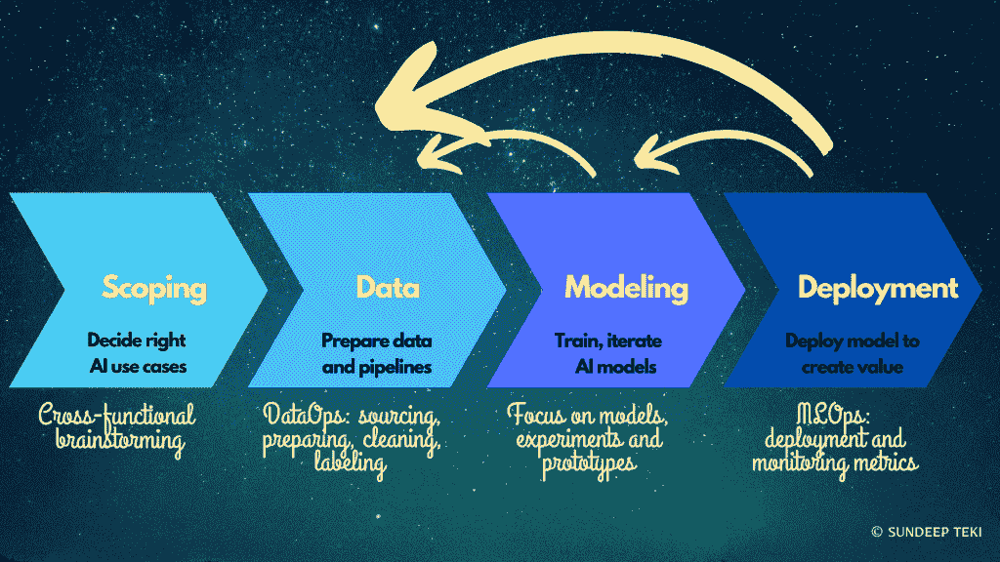
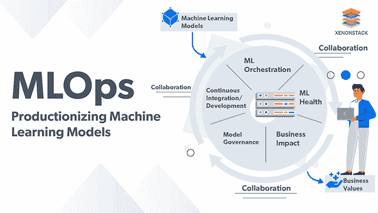
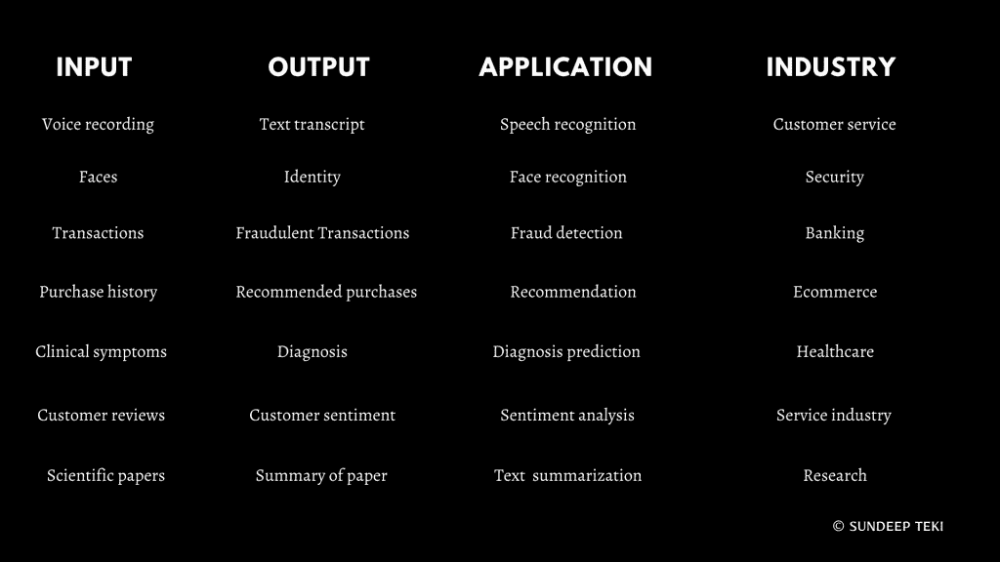
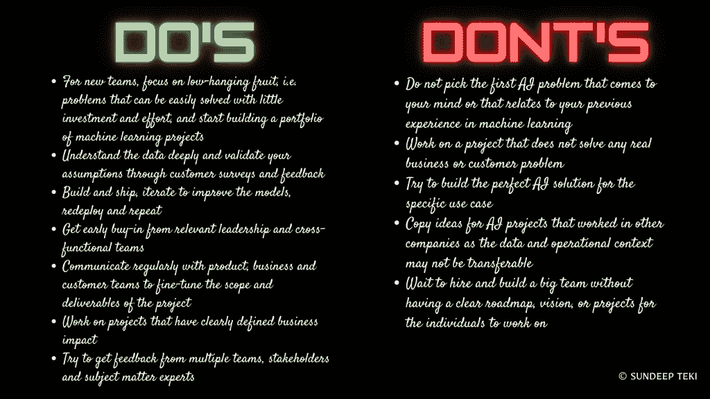
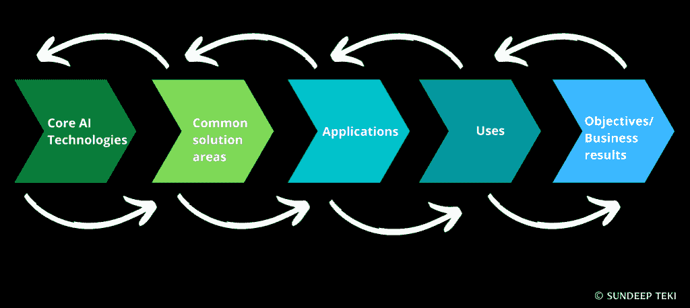

# 如何建立机器学习团队

> 原文：<https://web.archive.org/web/https://neptune.ai/blog/how-to-build-machine-learning-teams-that-deliver>

在这篇文章中，我记录了建立高效机器学习团队的最佳实践和方法，这种团队可以在公司实体中创造积极的业务影响和经济价值，无论是初创公司还是企业。

如果你做机器学习，无论是作为个人贡献者还是团队经理，我都会帮助你了解你目前的团队结构，以及如何改善内部流程、系统和文化。我们将探索如何建立真正颠覆性的 ML 团队来推动成功的结果。

## 为什么要建立一个 ML 团队？

人工智能(AI)预计到 2030 年将创造近 13 万亿美元的全球经济价值[1]。不同行业和部门的大多数公司都已经意识到人工智能的潜在价值，并正在成为人工智能优先的实体。从制造自动驾驶汽车或智能扬声器等尖端人工智能产品的科技公司，到利用人工智能进行欺诈检测或客户服务自动化等非迷人用例的传统企业，人工智能产生商业影响的潜力毋庸置疑。

许多趋势加速了人工智能在工业中的应用:

*   来自支持互联网的设备、传感器、网络平台等的数据量呈指数级增长，同时存储、访问和共享数据的成本下降。
*   随着 GPU 和云的出现，训练 AI 模型的计算成本更低。
*   建立在数据和计算基础上的算法研究和深度学习模型的创新。

鉴于过去十年的这种范式转变，构建人工智能产品和服务的成本已经大幅下降。大门现在向各种各样的参与者敞开，如企业、初创公司、企业家、学生或爱好者，以创新和创造转型的人工智能。

在接下来的部分，我将分别描述创业公司和企业在建立机器学习团队方面的挑战。

### 初创公司面临的挑战

初创公司在运营的早期阶段通常是自举式的，并且用于建立机器学习团队的预算有限。

如果你的创业公司有一个基于人工智能的核心产品或服务，那么就必须尽早雇佣机器学习人才来建立 MVP，并筹集资金来雇佣更多人才和扩大产品规模。

另一方面，对于核心产品或服务专注于金融、医疗保健或教育等其他领域的初创公司来说，人工智能要么是核心业务的附带产品，要么在产品市场适应之前不是必不可少的。

在创业公司中建立 ML 团队的主要挑战是:

*   人工智能的资金或预算有限。
*   缺乏建立机器学习模型的训练数据。
*   缺乏标签数据或资金将标签外包给第三方供应商。
*   没有结构化数据仓库、数据管道或机器学习部署基础设施。
*   需要更多能够在整个机器学习生命周期中操作的实践机器学习人才——从数据工程、算法和模型开发到在生产中部署和监控机器学习模型，而不是专门人才来单独关注机器学习生命周期的各个方面。
*   无法雇佣市场上最好的机器学习人才，也无法与领先科技公司提供的薪资相匹配。
*   为了与老牌企业竞争，更快的机器学习开发周期是必不可少的。然而，在缺乏结构化的内部流程和管理的情况下，这往往会导致摩擦和效率低下。

面对机器学习工作的这种令人生畏的挑战以及创业公司的一般组织挑战[2]，创业公司从一开始就雇佣和建立正确的机器学习团队变得更加重要。

### 企业面临的挑战

与创业公司不同，大组织和企业不会因为缺乏资金或预算而缺乏机器学习团队。企业中的挑战因实体而异，但通常是由于组织的规模、内部官僚主义和缓慢的决策过程而产生的——这些往往有利于初创公司，并帮助他们更快地交付产品。

虽然今天，科技公司似乎无处不在，但与专注于金融、快速消费品、零售、医疗保健、教育等不同领域的大量传统企业相比，它们仍然是少数。在机器学习和人工智能方面，科技公司拥有领先优势，与传统同行相比，它们对人工智能 R&D 的早期关注和投资将确保它们的主导地位。

然而，传统企业在整个组织内采用和实施人工智能时面临着众多挑战[3]，这往往会导致人工智能项目失败，并降低对人工智能能力和潜力的信任[4]:

*   无法制定使用人工智能解决业务挑战的路线图和愿景。
*   在促进跨职能和跨学科合作以定义具有良好定义的 KPI 的有效人工智能用例方面的障碍。
*   缓慢的决策过程不是基于数据，而是基于本能和直觉。
*   规避风险的文化心态不利于建立数字优先的组织。
*   典型的人工智能用例是与领域无关的，会影响组织的每个方面，例如客户服务自动化，这不会激发或吸引大多数数据科学家。
*   从节约成本的角度而不是潜在的创收流的角度来看待人工智能。
*   无法快速动员内部团队来建立一个新的人工智能产品或进入一个已经被快速发展的初创公司验证的新市场。

在详细介绍了初创公司和企业面临的核心挑战之后，在下一节中，我将描述典型的机器学习团队的组成，以及在机器学习生命周期中工作的各种配置文件所使用的技能和工具。对于招聘经理和团队来说，更好地了解不同机器学习团队的技能和能力，对于建立一个完整而高效的机器学习团队至关重要。

## 机器学习团队中的配置文件

现代机器学习团队确实是多样化的。然而，从核心上来说，他们要求候选人具备强大的分析技能，能够理解来自不同领域的数据，训练和部署预测模型，并从中获得业务或产品见解。

*Figure 1\. The Machine Learning Lifecycle*

如图 1 所示，机器学习的生命周期有四个阶段，这四个阶段依次相互补充。每个阶段都是一个专业领域，基于特定的知识和技能来很好地执行相关的任务。

**范围界定**

界定人工智能用例的第一阶段需要人工智能专家以及业务或领域专家。许多成功的人工智能项目都始于对可以用人工智能解决的潜在商业问题的深刻理解，并需要经验丰富的技术和商业专家的直觉和理解。在这个阶段，通常的合作者包括业务负责人、产品经理、人工智能团队经理，可能还有一名或多名对底层数据有深入实践经验的高级数据科学家。

**数据**

第二阶段侧重于获取数据、清理、从原始格式处理为结构化格式，并将其存储在特定的内部数据库或云存储库中。在这一阶段，数据工程师和数据科学家的作用非常突出。业务和产品经理在提供对数据、元数据和任何基于基本分析的初步业务见解的访问方面起着有益的作用。

**建模**

第三阶段涉及核心数据科学和使用前一阶段准备的数据集的机器学习建模。在这一阶段，数据科学家、应用科学家或研究科学家在训练初始模型、基于测试集性能和来自跨职能利益相关方的反馈对其进行改进、开发新算法(如果需要)以及最终生成一个或多个满足将模型投入生产所需的准确性和延迟基准的候选模型方面发挥着主导作用。

**部署**

机器学习生命周期的最后阶段专注于将训练好的模型部署到生产中，在生产中，它们根据从最终用户接收到的输入进行预测。在这个阶段，机器学习工程师将数据/应用/研究科学家开发的模型用于生产。如果模型满足预定义的准确性和延迟基准，则模型可以投入使用。另外，ML 工程师致力于优化模型大小、性能、延迟和吞吐量。在决定哪个(些)版本的模型最适合部署之前，模型要经过系统的 A/B 测试过程。

接下来，我为您的 ML 团队可能需要的不同类型的专家准备了详细的资料。

### 数据工程师

#### 技能

*   数据库ˌ资料库
*   编程；编排
*   查询语言
*   数据管道
*   体系结构
*   分析学
*   数据操作、转换和预处理
*   云服务
*   工作流程管理

#### 责任

*   构建数据管道、架构和基础设施
*   为数据科学建模清理和处理数据集
*   构建内部工具来优化数据工程工作流程
*   为定义的使用情形聚合不同的数据集
*   支持数据科学家的数据相关需求

#### 技术堆栈

*   SQL，MySQL
*   Java 语言(一种计算机语言，尤用于创建网站)
*   计算机编程语言
*   C++
*   斯卡拉
*   火花
*   Hadoop
*   卡夫卡
*   数据库:邮政、蒙戈布、卡珊德拉、里兹、希夫、风暴
*   云:AWS/Azure/GCP、EC2、EMR、RDS、红移

### 数据科学家

#### 技能

*   问题解决
*   编程；编排
*   统计数字
*   数据分析
*   数据可视化
*   数据科学
    *   监督机器学习
    *   无监督机器学习
*   与跨职能团队进行书面和口头沟通
*   向领导层展示结果和见解的演示技巧
*   从数据科学模型中获得统计上有效的见解，以改进产品开发、营销或业务战略

#### 责任

*   识别和验证可以用人工智能解决的业务用例
*   在建模管道的不同阶段分析和可视化数据
*   开发定制算法和数据科学模型
*   识别附加数据集或生成合成数据
*   开发数据注释策略并对其进行验证
*   与跨职能团队协调，寻求对模型的反馈，共享结果并实施模型
*   开发定制工具或库，以优化整个数据科学建模工作流程

#### 技术堆栈

*   计算机编程语言
*   稀有
*   Java 语言(一种计算机语言，尤用于创建网站)
*   jupyter 笔记本
*   可视化:Matplotlib，Seaborn，Bokeh，Plotly 等。
*   结构化查询语言
*   火花
*   Git，Github/Bitbucket
*   云:AWS/Azure/GCP；萨格马克，S3，博托
*   机器学习:Scikit-learn，Fast.ai，AllenNLP，OpenCV，HuggingFace
*   深度学习:TensorFlow，PyTorch，MXNet，JAX，Chainer 等。
*   超参数调整:海王星，彗星，重量和偏差

*Figure 2\. Data Science toolkit | [Source](https://web.archive.org/web/20220928194845/https://research.aimultiple.com/wp-content/uploads/2018/02/ds_stack_tools.png)*

### 机器学习工程师

#### 技能

*   数据结构
*   数据建模
*   编程；编排
*   软件工程
*   ML 框架，如 TensorFlow，PyTorch，Scikit-learn 等。
*   统计数字
*   ML 的概念知识，以理解用例并与数据科学家和其他利益相关者互动

#### 责任

*   将模型部署到生产中
*   优化模型以获得更好的延迟和吞吐量
*   候选模型的 A/B 测试
*   在各种硬件上进行推理测试:edge、CPU、GPU
*   监控模型性能、维护、调试
*   维护模型版本、实验和元数据

#### 技术堆栈

*   Linux 操作系统
*   云:AWS/Azure/GCP；萨格马克、S3、EC2、博托
*   机器学习:Scikit-learn，Fast.ai，AllenNLP，OpenCV，HuggingFace
*   深度学习:TensorFlow，PyTorch，MXNet，JAX，Chainer 等。
*   服务:TensorFlow 服务、TensorRT、TorchServe、MXNet 模型服务器
*   计算机编程语言
*   C++
*   斯卡拉
*   尝试
*   去吧，Github/Bitbucket

### 研究科学家

#### 技能

*   计算机科学、人工智能、物理学、生物学、经济学等定量学科的博士学位。
*   科学思维和第一性原理思维
*   科学中最先进方法的深度和广度
*   有从事学术或行业研究的经验
*   创造性解决问题
*   机器学习
*   深度学习
*   设计和开发 ML 原型和模型
*   与跨职能团队进行书面和口头沟通
*   向领导层展示结果和见解的演示技巧
*   从数据科学模型中获得统计上有效的见解，以改进产品开发、营销或业务战略

#### 责任

*   对新的 ML 用例及应用进行研究
*   构建最初的 ML 原型和模型
*   跨多个模型和超参数组合进行系统实验
*   创建或扩充数据集
*   清理、处理、分析和可视化数据并模拟性能
*   了解最新的研究文献和最新的机器学习和深度学习方法
*   传播新的 ML 方法和思想
*   指导软件、数据和 ML 工程师

#### 技术堆栈

*   计算机编程语言
*   jupyter 笔记本
*   机器学习:Scikit-learn，Fast.ai，AllenNLP，OpenCV，HuggingFace
*   深度学习:TensorFlow，PyTorch，MXNet，JAX，Chainer 等。
*   Linux 操作系统
*   云:AWS/Azure/GCP；萨格马克、S3、EC2、博托
*   超参数调整:海王星，彗星，重量和偏差
*   去吧，Github/Bitbucket

### 产品经理+业务负责人

#### 技能

*   产品设计、营销
*   数据分析
*   一个或多个领域的专业知识
*   程序管理
*   业务发展
*   了解产品路线图和端到端项目交付
*   了解软件、架构、数据和机器学习最佳实践
*   基本机器学习概念、流程、指标和部署的基本知识
*   出色的书面和口头沟通技巧，能够与客户、业务和技术团队合作
*   人际交往技能，包括说服和完成利益相关方团队的工作
*   意识到管理和构建机器学习与软件产品之间的区别

#### 责任

*   创建详细的产品、功能路线图，包括里程碑、交付成果、指标和业务影响
*   对建议产品的客户进行调查，以简化设计、UX 并减少摩擦
*   平衡利益相关者、客户的多个优先事项，以定义和交付产品
*   与软件工程和机器学习团队合作，按照路线图迭代和改进模型
*   获得产品的所有权，并确保在紧迫的期限内交付特性和整个产品

#### 技术堆栈

*   SQL 提取和分析数据，为产品建立直觉
*   擅长
*   工作管理工具
*   生产力工具
*   调度工具

### 数据科学/机器学习管理师

#### 技能

*   完全理解机器学习从概念到生产的生命周期
*   书面和口头沟通技巧
*   人际交往和说服技巧，以获得领导的认同，与跨职能团队合作
*   愿景:与产品和业务经理一起创建产品功能和路线图，并就此进行协作
*   对机器学习和深度学习概念的实践和理论理解，ML 产品的部署和持续改进
*   对个人机器学习贡献者的指导
*   项目管理与产品和项目经理

#### 责任

*   拥有机器学习产品和路线图
*   为新颖的机器学习产品创造愿景
*   使利益相关者与提议的产品愿景保持一致
*   理解机器学习指标与业务指标
*   在公司内部以及更广泛的生态系统中宣传机器学习团队的能力和成功
*   雇佣专门研究机器学习生命周期的机器学习人才
*   与产品和业务团队合作并深入研究，以确定可以通过机器学习解决的潜在用例
*   从客户的角度理解企业及其产品和服务是如何运作的
*   了解业务收入流，并为机器学习项目提出原创想法，以改进产品或服务，降低成本，并自动化手动流程

#### 技术堆栈

*   计算机编程语言
*   结构化查询语言
*   擅长
*   生产力、协作和沟通工具

*Figure 3\. MLOps lifecycle | [Source](https://web.archive.org/web/20220928194845/https://www.xenonstack.com/wp-content/uploads/2019/09/mlops-solutions-services-xenonstack.png)*

## 建立高效的机器学习团队

我们探索了机器学习团队的典型组成，其中包括各种不同的配置文件，专门用于构建机器学习项目的特定方面。然而，现实是，拥有一个可靠的机器学习团队并不能保证这个团队将创造和交付巨大的商业影响。实际情况是，绝大多数企业人工智能项目都失败了，尽管有一个很棒的机器学习团队，但很多项目还是失败了。

在这一部分，我将从基本原则出发，深入探讨构建有影响力的机器学习团队的文化、程序和协作方面。机器学习团队的成功建立在与系统、流程和文化相关的几个因素之上。当以错误的方式构建时，这将不可避免地导致失败的项目和对团队的信任和信心的侵蚀，以及作为业务能力和竞争优势的机器学习。

*Figure 4\. A list of AI use cases*

### 1.致力于正确的人工智能用例

对于一个全新的机器学习团队来说，要在一个组织中产生影响，最重要的是团队一开始就要有好的开端。早期牵引对于在组织中建立信任、在业务垂直领域传播人工智能的潜力以及利用早期成功交付具有更大影响的风险更高或登月项目至关重要。

以下是头脑风暴和定义正确的人工智能用例集的注意事项。

*Figure 5\. Do’s and don’ts for identifying right AI use cases*

### 2.成功规划-衡量影响

作为选择和定义正确的人工智能用例的过程的一部分，批判性地评估和评价特定机器学习项目的商业影响和投资回报是非常重要的。评估的最佳方法是定义一组度量标准，这些标准涉及项目的几个方面及其潜在影响。

#### 技术指标

##### 对于分类模型:

*   准确(性)
*   精确
*   回忆
*   F1 分数
*   罗马纪元

##### 对于回归模型:

*   均方根误差
*   调整后的 R ²
*   绝对平均误差

##### 对于深度学习模型(取决于特定应用):

*   困惑，余弦相似性，雅克卡相似性，BLEU (NLP)
*   单词错误率(语音识别)
*   并集上的交集、平均精度、平均精度(计算机视觉)

#### 业务指标

业务指标由基本原则定义，通常是受机器学习模型影响的下游指标。为了衡量结果，至关重要的是*先验地*确定相关的业务指标，并在 A/B 测试、部署和持续监控实时模型期间跟踪机器学习模型对这些指标的影响。

标准业务度量旨在获取信任、满意度、错误和 SLA 等级别。

一旦机器学习项目的候选集从概念到生产用相关联的一组度量进行了范围界定、定义和制定，每个项目都需要由领导团队从要在定义的时间段内实现的高层组织目标的角度进行评估。领导者需要平衡业务影响(在运营线或底线上)、预算、团队带宽、时间节约、效率节约以及短期和长期交付项目的紧迫性。高管需要整合多种因素，以达成一个经过仔细考虑的决定，为一个或多个机器学习项目开绿灯。

### 3.结构化流程——敏捷、冲刺

一旦项目被定义并得到领导团队的批准，确保系统和结构化流程到位以确保机器学习团队可以不受阻碍地工作并按照商定的计划及时执行项目是很重要的。

关键运营基础设施，如数据仓库、数据库管理系统、数据 ETL 管道、元数据存储和管理平台、数据注释框架和标记数据的可用性、对本地或云中计算的访问、简化模型培训流程的许可和开源工具和软件、机器学习实验、结果和元数据管理工具、A/B 测试平台、模型部署基础设施和解决方案、持续模型监控和仪表板，对于平稳的数据处理、模型构建和部署工作流是不可或缺的。然而，这种用于机器学习的关键骨架基础设施的存在因组织而异，取决于机器学习组织或公司的成熟程度。

除了基础设施之外，与使用 sprints 和敏捷框架的项目个体参与者的计划任务相关的过程需要被硬连线，并且可以被项目的所有涉众访问。虽然敏捷过程在软件项目中运行良好，但是机器学习项目是不同的，可能不太适合相同的框架。尽管存在类似迭代模型构建和基于反馈的提炼的相似性，但机器学习项目更加复杂，因为基本块除了代码之外还包括数据和模型。

虽然像代码审查和版本控制这样的软件工程最佳实践已经非常成熟，但同样的严谨性和结构并不总是适用于数据和机器学习模型。文档是另一个方面，它对于跟踪多种假设、实验、结果以及与机器学习项目相关的所有活动部分甚至更为关键。

在缺乏根深蒂固的工具和最佳实践的情况下，大多数数据科学工作往往非常低效，数据科学家最终会在可以自动化的日常琐事上花费大量时间。经理们必须努力减少这些障碍，以提高工作效率和生产率，这样机器学习团队才能专注于他们的工作。

*Figure 6\. A framework for applying AI in the enterprise. | [Source](https://web.archive.org/web/20220928194845/https://www.gartner.com/en)*

### 4.团队内部和团队之间的清晰沟通

沟通是数据科学家的一项基本技能。机器学习是一门更复杂的学科，最终结果可能过于晦涩，数据科学、产品或业务团队的通才和非技术经理很难理解。然而，沟通只是冰山一角，在跨职能团队中工作时，更多的人际交往技能，如说服、同理心、协作等都需要定期锻炼。

向利益相关者和领导层发送结果或更新的电子邮件或幻灯片演示，现场演示，为产品评审文档阐述项目，为面向非专业受众的博客或面向技术受众的期刊或会议撰写整个项目，都需要很强的写作技能。典型的数据科学家可能更擅长编写代码而不是文字，因此组织应该投资于数据科学家的企业培训计划，包括书面和口头沟通技能的培训。

口头沟通能力也不可小觑，在远程优先的组织中越来越重要。有效的利益相关者管理包括建立融洽的关系和信任，以及建立清晰的沟通渠道，如果数据科学家不能以引人入胜、令人愉快的方式清晰地说话和沟通，这将变得更加困难。虽然许多工作场所生产力应用程序创建了减少面对面交流的数字渠道，但与同事、利益相关者和领导者进行实时面对面交流的力量通常可以更快地完成工作。

清晰的沟通消除了信息孤岛，因此每个利益相关者都知道、更新并与各种机器学习项目的进展保持一致。除了在工具中记录进展以确保项目朝着正确的方向前进之外，定期会议对于制衡也很重要。

### 5.与企业的有效协作

机器学习团队通常是公司工程或技术组织的一部分。虽然这对于来自数据、分析、工程职能部门的同事之间的有效协作来说很自然，但与业务团队的定期互动是必须的。鉴于大多数机器学习模型建立在历史“业务”数据的基础上，这些数据可能会因新产品或功能发布或季节性模式而以可预测的方式发生变化，也可能会以不可预测的方式发生变化，例如，在新冠肺炎封锁期间，机器学习团队必须实时了解业务数据正在发生的变化。

重要的不仅是在面对客户行为或新产品发布的巨大变化时调整基础假设，而且如果初始假设被违反或数据变化太大，机器学习模型变得不相关或具有与以前相同的影响，则纠正计划的行动过程也很重要。

业务团队最适合根据他们的领域专业知识对早期原型提供反馈，通过进行客户研究和调查来验证新的假设或想法，并评估部署的机器学习模型的影响。出于这些原因，机器学习和业务团队之间的伙伴关系需要是互利共生的。

机器学习团队的领导者需要与业务团队建立密切的联系，并鼓励团队成员也这样做。

### 6.创造创新文化

为了机器学习团队的长期成功，除了致力于正确的用例并促进整个组织的协作工作，还必须建立一种拥抱和奖励创新的文化。在这里，领导应该以身作则，鼓励不同业务垂直领域的创新和 R&D。

对于一个机器学习团队来说，通过专利申请、期刊或会议出版物、通过聚会、研讨会、领先专家的研讨会进行外联和传播、根据需要与初创公司和学术组织合作等等，在生态系统中留下印记至关重要。大多数组织并不注重建立这样一种蓬勃发展的文化，这种文化促进新思想和新技术的交流和相互渗透，而这种交流和相互渗透往往会以一种实质性的方式影响当前的组织流程和思维。

领导者还需要建立强大的多元化团队，雇佣新的人才，从入门级毕业生到经验丰富的工程师和科学家。新人才的流入带来了新的想法，可以对工作文化产生积极影响。否则停滞不前，团队会变得心胸狭窄，创新和推出有影响力的产品的能力下降。任人唯贤的行政决策对企业文化有着强烈的影响，既包括提拔表现出一贯出色业绩的人才，也包括解雇表现不佳的个人或经理。团队中适当的平衡和文化是一个持续的过程，但对于领导者来说，重要的是要确保在任何时候，机器学习团队的成员都不会因组织内的系统、流程和文化而失去动力和灵感。

### 7.庆祝和分享人工智能的成功故事

最后，鉴于目前人工智能项目的成功几率很低，确保任何人工智能成功故事在组织内得到广泛分享以吸引可能与机器学习团队合作的其他业务团队的注意很重要。此外，鉴于人工智能作为一门学科的巨大人气，成功的故事也可能吸引公司内部潜在的新团队成员，他们有动力提高机器学习技能，成为数据科学家。

在公司内部以公开的方式而不是关起门来认可核心贡献者对人工智能项目成功的努力是很重要的。这有助于建立士气和信心，并在团队中培养精英文化，这将有助于他们的职业发展。此外，只要有可能，领导层应该采取措施，在公司运营的更广泛的生态系统中广泛分享这种人工智能的成功故事，例如，通过公司博客、社交媒体帖子、播客或在聚会、研讨会或会议上的演讲。

对于一个机器学习团队来说，要继续提供强大的性能和结果，关键是要建立一个成功项目的组合，从简单的项目开始，逐渐变得更加复杂，范围和商业影响不断增加。机器学习团队的成功起到了触发器的作用，加速了公司的数字化和人工智能转型。在竞争激烈的数字经济中，早期投资并大量投资人工智能的公司已经成为早期赢家，例如，大型科技公司。因此，有影响力的机器学习团队在拥抱和采用人工智能并将公司转变为前瞻性、数据驱动、人工智能优先的公司的旅程中发挥了杠杆作用。

## 参考

### Sundeep Teki

人工智能和神经科学领域的领导者，在 4 个国家(美国、英国、法国、印度)拥有跨大科技(亚马逊 Alexa AI 的对话式人工智能)、独角兽初创公司(Swiggy 的应用人工智能)和 R&D(牛津大学和伦敦大学学院的神经科学)的专业经验。发表了 40+篇关于神经科学和 AI 的论文(h-index: 23，2000+引文)；为消费技术产品构建和部署人工智能；为科技初创公司提供人工智能/人工智能方面的咨询，并为有志于数据科学的学生、专业人士和公司提供辅导和技能提升服务。

* * *

**阅读下一篇**

## 管理机器学习项目的最佳工具

6 分钟阅读|作者 Jakub Czakon |年 7 月 14 日更新

管理机器学习项目并不完全是小菜一碟，但每个数据科学家都已经知道这一点。

它触及了很多东西:

*   数据探索，
*   数据准备和设置机器学习管道
*   实验和模型调整
*   数据、管道和模型版本控制
*   管理基础设施和运行流程编排
*   模型服务化和生产化
*   模型维护(生产中的再培训和监控模型)
*   不同角色(数据科学家、数据工程师、软件开发人员、开发人员、团队经理、业务利益相关者)之间的有效协作

那么如何保证一切顺利进行呢？如何管理所有的部分来创建一个连贯的工作流程？

…通过使用正确的工具来帮助您管理机器学习项目。但是你已经知道了🙂有许多应用程序可以帮助你改善部分甚至整个工作流程。当然，自己做每件事真的很酷，但是如果工具能帮你省去很多麻烦，为什么不使用呢

让我们开始吧，看看盘子里有什么！以下是涉及上述各点的工具列表。有些更倾向于端到端，有些专注于机器学习生命周期的特定阶段，但所有这些都将帮助您管理您的机器学习项目。查看我们的列表，选择你最喜欢的。

[Continue reading ->](/web/20220928194845/https://neptune.ai/blog/best-tools-to-manage-machine-learning-projects)

* * *