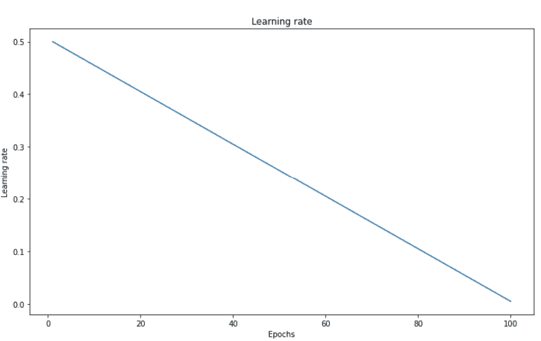
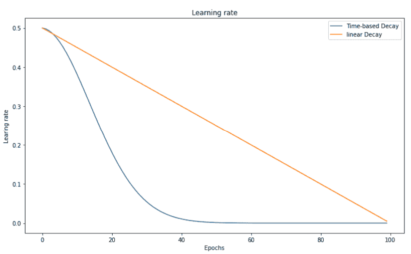
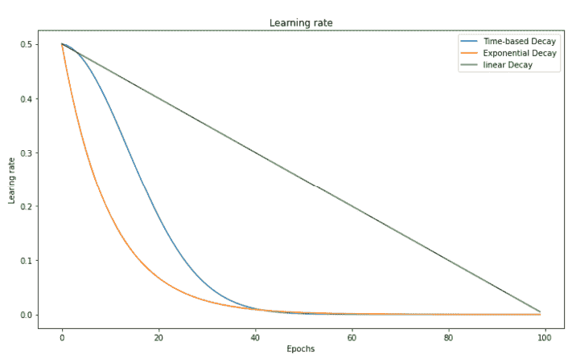
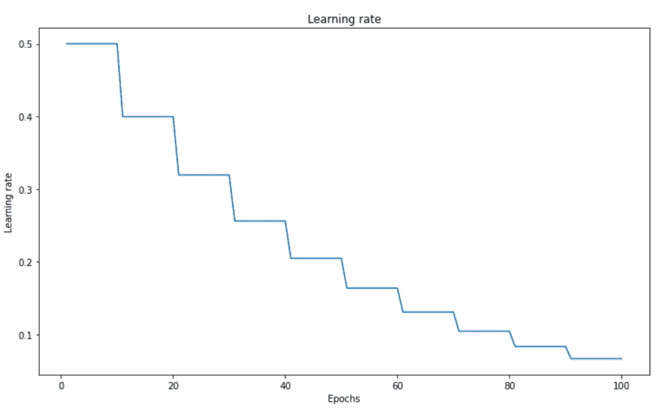
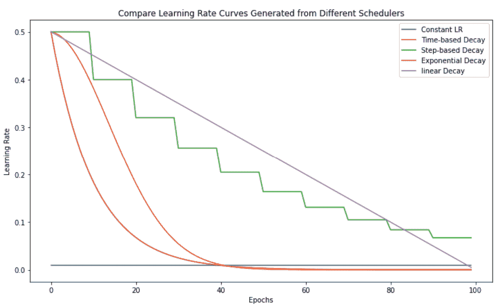

# 如何选择神经网络的学习速率调度器

> 原文：<https://web.archive.org/web/https://neptune.ai/blog/how-to-choose-a-learning-rate-scheduler>

研究人员普遍认为神经网络模型很难训练。最大的问题之一是需要指定和优化大量的超参数。隐藏层的数量、激活函数、优化器、学习率、正则化——不胜枚举。

调整这些超参数可以极大地改善神经网络模型。对于作为数据科学家的我们来说，构建神经网络模型是为了解决一个优化问题。我们希望通过基于梯度的方法，例如梯度下降，找到目标函数的最小值(全局的，或者有时是局部的)。

在所有梯度下降超参数中，学习率(进度)是获得良好模型性能的最关键参数之一。在本文中，**我们将探讨学习率，并解释为什么在模型训练中安排学习率至关重要。**

从这里开始，我们将看到如何通过在 Keras 中实现和利用各种调度器来选择学习率调度。然后，我们将在 Neptune 中创建实验来比较这些调度程序的性能。

## 神经网络中的学习率是多少？

什么是学习率，它对神经网络有什么影响？学习率(或步长)被解释为在[反向传播](/web/20230228190120/https://neptune.ai/blog/backpropagation-algorithm-in-neural-networks-guide)训练过程中模型权重的变化/更新幅度。作为一个可配置的超参数，学习率通常被指定为小于 1.0 的正值。

在反向传播中，模型权重被更新以减少损失函数的误差估计。我们不是使用全部数量来改变权重，而是将其乘以某个学习率值。例如，将学习率设置为 0.5 将意味着用 0.5 *估计权重误差(即，梯度或总误差相对于权重的变化)来更新(通常减去)权重。

### 学习速度的影响

学习率控制优化器达到损失函数最小值的步长。这对我们的优化算法有什么影响？看看这些图表:

*   学习率大(右边)，算法学习快，但也可能导致算法在极小值附近振荡，甚至跳过极小值。更糟糕的是，高学习率等于大的权重更新，这可能导致权重溢出；
*   相反，在学习率很小的情况下(左侧)，对权重的更新很小，这将引导优化器逐渐接近最小值。然而，优化器可能需要太长时间来收敛或陷入平稳状态或不期望的局部最小值；
*   好的学习率是覆盖率和超调(中间)之间的权衡。它不会太小以至于我们的算法可以快速收敛，也不会太大以至于我们的算法不会在没有达到最小值的情况下来回跳跃。

虽然找到一个合适的学习率的理论原理很简单(不要太大，也不要太小)，但是说起来容易做起来难！为了解决这个问题，引入了学习率表。

## 学习费率表

学习率时间表是一个预定义的框架，随着训练的进行，它在各时期或迭代之间调整学习率。学习速率计划的两种最常见的技术是，

*   学习率不变:顾名思义，我们初始化一个学习率，训练时不改变；
*   学习率衰减:我们选择一个初始的学习率，然后按照一个时间表逐渐降低它。

知道了什么是学习率计划，你一定想知道为什么我们首先需要降低学习率？在神经网络中，我们的模型权重更新为:

其中 eta 是学习率，偏导数是梯度。

对于训练过程来说，这是好的。在训练的早期，为了达到足够好的一组重量，学习率被设置得很大。随着时间的推移，通过利用小的学习率，这些权重被微调以达到更高的准确度。

*注意:你可能会读到一些文章，其中学习率时间表仅被定义为(学习率)衰减。尽管这两个术语(学习率计划和衰减)有时可以互换使用，但在本文中，我们将实现恒定学习率的场景作为性能基准测试的基线模型。*

## Neptune 中的分析数据集和实验配置

出于演示的目的，我们将使用 Keras 中流行的 [Fashion-MINIST](https://web.archive.org/web/20230228190120/https://www.tensorflow.org/datasets/catalog/fashion_mnist) 数据。该数据集由 70，000 幅图像组成(训练集和测试集分别为 60，000 幅和 10，000 幅)。这些图像为 28×28 像素，与 10 个类别相关联。

为了跟踪和比较不同学习率调度器的模型性能，我们将在 Neptune 中进行实验。海王星监控所有与模型相关的东西。关于如何用 Python 设置和配置 Neptune 项目的详细分步说明，请参考本文档。

在本练习中，我们将创建一个 Neptune 项目，并将其标记为"*learningrateschedule*？。在[获得您的 Neptune](https://web.archive.org/web/20230228190120/https://docs.neptune.ai/getting-started/installation#authentication-neptune-api-token) API 令牌后，您可以使用下面的代码将 Python 连接到我们的项目:

```py
project = neptune.init(api_token=os.getenv('NEPTUNE_API_TOKEN'),
                       project='YourUserName/YourProjectName')
project.stop()
```

接下来，我们将使用 Keras 中可用的一些实用函数加载数据集。

为了减少本地机器上的运行时间，我们的模型将针对 20，000 张图像而不是整个 60，000 张图像进行训练。因此，我们将使用下面的代码随机选择 20，000 条数据记录。

除此之外，我们还将定义几个辅助函数来保存和绘制训练过程中的学习率:

```py
def reset_random_seeds(CUR_SEED=9125):
   os.environ['PYTHONHASHSEED']=str(CUR_SEED)
   tf.random.set_seed(CUR_SEED)
   np.random.seed(CUR_SEED)
   random.seed(CUR_SEED)

reset_random_seeds()

fashion_mnist = keras.datasets.fashion_mnist
(X_train_full, y_train_full), (X_test_full, y_test_full) = fashion_mnist.load_data()

reset_random_seeds()
trainIdx = random.sample(range(60000), 20000)

x_train, y_train = X_train_full[trainIdx]/255.0, y_train_full[trainIdx]
x_test, y_test = X_test_full/255.0, y_test_full

def get_lr_metric(optimizer):
    def lr(y_true, y_pred):
        curLR = optimizer._decayed_lr(tf.float32)
        return curLR
    return lr

def plotLR(history):
    learning_rate = history.history['lr']
    epochs = range(1, len(learning_rate) + 1)
    fig = plt.figure()
    plt.plot(epochs, learning_rate)
    plt.title('Learning rate')
    plt.xlabel('Epochs')
    plt.ylabel('Learning rate')
    return(fig)

def plotPerformance(history, CURRENT_LR_SCHEDULER=CURRENT_LR_SCHEDULER):

    fig = plt.figure(figsize=(10, 4))
    fig = plt.subplot(1, 2, 1) 

    plt.plot(history.history['loss'])
    plt.plot(history.history['val_loss'])
    plt.legend(['Train Loss', 'Test Loss'])
    plt.title(f'Loss Curves ({CURRENT_LR_SCHEDULER})')
    plt.xlabel('Epoch')
    plt.ylabel('Loss on the Validation Set')

    fig = plt.subplot(1, 2, 2) 

    plt.plot(history.history['accuracy'])
    plt.plot(history.history['val_accuracy'])
    plt.legend(['Train Accuracy', 'Test Accuracy'])
    plt.title(f'Accuracy Curves ({CURRENT_LR_SCHEDULER})')
    plt.xlabel('Epoch')
    plt.ylabel('Accuracy on the Validation Set')
    return fig
```

这里有几个注意事项:

*   当前数据集通过除以 255 进行规范化；因此，它被重新调整到 0-1 的范围内；
*   我们定义了一个函数 get_lr_metric()来保存和打印学习率，作为 Keras verbose 的一部分。

此外，让我们还创建一个帮助器函数，在整个实验过程中，将学习率和模型性能图表记录到 Neptune:

```py
def plot_Neptune(history, decayTitle, npt_exp):

        npt_exp[f'Learning Rate Change ({decayTitle})'].upload(neptune.types.File.as_image(plotLR(history)))

        npt_exp[f'Training Performance Curves ({decayTitle})'].upload(neptune.types.File.as_image(plotPerformance(history).get_figure()))
```

## 神经网络模型

有了数据集和辅助函数，我们现在可以构建一个神经网络模型作为图像分类器。为简单起见，我们当前的模型包含两个隐藏层和一个输出层，输出层具有用于多类分类的*‘soft max’*激活功能:

```py
def runModel():
    model = Sequential()
    model.add(Flatten(input_shape=[28, 28]))
    model.add(Dense(512, activation='relu'))
    model.add(Dense(200, activation='relu'))
    model.add(Dense(10, activation='softmax'))
    return model

model = runModel()
model.summary()
```

这是模型结构，这是一个相当简单的网络。

## 学习率不变的基线模型

如上所述，恒定调度是所有学习率调度器中最简单的方案。为了设置性能基线，我们将在所有时期使用一致的学习率 0.01 来训练模型:

```py
npt_exp = neptune.init(
        api_token=os.getenv('NEPTUNE_API_TOKEN'),
        project='YourUserName/YourProjectName',
        name='ConstantLR',
        description='constant-lr',
        tags=['LearingRate', 'constant', 'baseline', 'neptune'])

neptune_cbk = NeptuneCallback(run=npt_exp, base_namespace="metrics")

initial_learning_rate = 0.01
epochs = 100
sgd = keras.optimizers.SGD(learning_rate=initial_learning_rate)
lr_metric = get_lr_metric(sgd)

model.compile(optimizer = sgd,
              loss='sparse_categorical_crossentropy',
              metrics=['accuracy', lr_metric])

reset_random_seeds()

trainHistory_constantLR = model.fit(
    x_train, y_train,
    epochs=epochs,
    validation_data=(x_test, y_test),
    batch_size=64,
    callbacks = [neptune_cbk]
)

npt_exp['Learning Rate Change (Constant)'].upload(neptune.types.File.as_image(plotLR(trainHistory_constantLR)))

npt_exp['Training Performance Curves (Constant)'].upload(neptune.types.File.as_image(plotPerformance(trainHistory_constantLR).get_figure()))

npt_exp.stop()  
```

在此，我们:

*   在我们的项目下创建了一个 Neptune 实验来跟踪基本模型的性能；
*   使用` *learning_rate* `参数指定学习率。在 Keras 的标准 SGD 优化器中；
*   增加了 *lr_metric* 作为用户定义的指标进行监控，使学习率信息能够在培训中逐字显示；
*   在 Neptune 中记录学习率和性能图表(损失和准确性曲线)。

查看训练进度，我们可以确认当前学习率被固定为 0.01 而没有改变，

在我们的海王星实验中，我们会发现下面的性能图表，

随着学习的展开，训练损失在减少，准确率在增加；尽管如此，当涉及到验证集时，模型性能不会有太大的变化。这将是我们稍后与衰减调度程序进行基准测试的基线模型。

## Keras 中内置*衰变*时间表的问题

Keras 提供了一个内置的标准衰减策略，它可以在优化器的“*衰减*”参数中指定，如下所示:

```py
initial_learning_rate = 0.1
epochs = 100

sgd = keras.optimizers.SGD(learning_rate=initial_learning_rate, decay=0.01)

model.compile(optimizer = sgd,
                  loss='sparse_categorical_crossentropy',
                  metrics=['accuracy'])

trainHistory_constantLR = model.fit(
        x_train, y_train,
        epochs=epochs,
        validation_split=0.2,
        batch_size=64
    )
```

这个衰减策略遵循一个基于时间的衰减，我们将在下一节讨论它，但是现在，让我们熟悉一下基本公式，

假设我们的初始学习率= 0.01，衰减= 0.001，我们会期望学习率变成，

*   0.1 * (1/(1+0.01*1)) =第一个时期后的 0.099
*   0.1 * (1/(1+0.01*20)) = 0.083 并且在第 20 个时期之后

然而，查看 Keras 训练进度，我们注意到不同的值，其中在第一个时期之后，学习率已经从 0.1 降低到 0.0286，

迷惑？

嗯，这是一个误解，Keras 更新的学习率在每个时代结束；相反，学习率更新是分批进行的，这意味着它是在 Keras 中的每批之后的**执行的。公式是，**

，其中参数步长也称为迭代。

如果我们回到前面的例子，因为我们有总的训练数据= 20000 幅图像，并且验证率= 0.2，所以训练集= 20000 * 0.2 = 16000。那么将批量大小设置为 64 意味着:

*   16000/64 =需要 250 步或迭代来完成一个时期；
*   在每个时期之后，学习率被更新 250 次，这等于，

***0.1 *(1/(1+0.01 * 250))= 0.0286！***

因此，当在 Keras 中使用标准衰减实现时，请记住这是一个*批处理*而不是*纪元*更新。为了避免这个潜在的问题，Keras 还允许数据科学家定义定制的学习率调度器。

在本文的其余部分，我们将遵循这条路线，使用 Keras 中的 [Callback()](https://web.archive.org/web/20230228190120/https://keras.io/api/callbacks/learning_rate_scheduler/) 功能实现我们自己的调度程序。

## 带 Keras 回调的学习率计划程序

学习率衰减的基本机制是随着时期的增加而降低学习率。所以，我们基本上想把我们的学习率指定为一些纪元的递减函数。

在所有潜在的候选者中，线性函数是最直接的一个，因此学习率随着时期线性降低。由于其简单性，线性衰减通常被认为是第一个尝试。

### 线性衰减方案

利用这种方案，学习率将在训练时期结束时衰减到零。要实现线性衰减:

```py
initial_learning_rate = 0.5
epochs = 100
decay = initial_learning_rate/epochs

class lr_polynomial_decay:
	def __init__(self, epochs=100, initial_learning_rate=0.01, power=1.0):

		self.epochs = epochs
		self.initial_learning_rate = initial_learning_rate
		self.power = power

	def __call__(self, epoch):

		decay = (1 - (epoch / float(self.epochs))) ** self.power
		updated_eta = self.initial_learning_rate * decay

		return float(updated_eta)
```

这里，我们定义了一个类 **lr_polynomial_decay** ，其中 arg。`*力量*`控制衰变的速度；也就是说，较小的功率使学习率衰减得更慢，而较大的功率使学习率衰减得更快。

将“*功率*”设置为 1 会产生线性衰减，其曲线如下所示。



*Linear learning rate decay*

为了用这个定制的线性衰减来训练我们的模型，我们所需要的就是在[leargatescheduler](https://web.archive.org/web/20230228190120/https://keras.io/api/callbacks/learning_rate_scheduler/)函数中指定它:

```py
npt_exp_4 = neptune.init(
        api_token=os.getenv('NEPTUNE_API_TOKEN'),
        project='YourUserName/YourProjectName',
        name=f'{POLY_POWER}LRDecay',
        description=f'{POLY_POWER}-lr-decay',
        tags=['LearningRate', POLY_POWER, 'decay', 'neptune'])

POLY_POWER == 'linear'
if POLY_POWER == 'linear':
    curPower = 1.0

curScheduler = lr_polynomial_decay(epochs=epochs, initial_learning_rate=initial_learning_rate, power=curPower)

model = runModel()

sgd = keras.optimizers.SGD(learning_rate=initial_learning_rate)
model.compile(
              optimizer = sgd,
              loss='sparse_categorical_crossentropy',
              metrics=['accuracy'])

neptune_cbk = NeptuneCallback(run=npt_exp_4, base_namespace="metrics")

reset_random_seeds()

trainHistory_polyDecay = model.fit(
    x_train, y_train,
    epochs=epochs,
    batch_size=64,
    validation_split=0.2,
    callbacks=[neptune_cbk, LearningRateScheduler(curScheduler, verbose=1)])

if POLY_POWER == 'linear':
    trainHistory_linearDecay = trainHistory_polyDecay
    plot_Neptune(history=trainHistory_linearDecay, decayTitle='Linear Decay', npt_exp=npt_exp_4)
npt_exp_4.stop()
```

运行这个模型，我们可以在 Neptune 项目中看到下面的性能图表，

根据验证集上的损失和准确性曲线，我们观察到，

*   这两个指标在整个培训过程中都是波动的；
*   在大约 40 个时期之后，模型过度拟合发生，其中训练损失继续减少，而验证损失开始增加(并且准确度几乎是平坦的)。

这种模式表明，随着训练的进行，我们的模型正在偏离，这很可能是因为学习率太高。

我们应该将学习率降低为纪元的线性函数吗？也许不是。如果有一个策略，学习率在训练开始时下降得更快，然后在训练结束时逐渐变平到一个小值，效果会更好。

这是非线性衰减的基本概念，其中最常用的有时基衰减和指数衰减。

### 基于时间的衰减和指数衰减

基于时间的衰减公式定义为:

```py
def lr_time_based_decay(epoch, lr):
        return lr * 1 / (1 + decay * epoch)
```

其中“衰变”是一个参数，通常计算如下:

```py
decay = initial_learning_rate/epochs
```

让我们指定以下参数:

```py
initial_learning_rate = 0.5
epochs = 100
decay = initial_learning_rate/epochs
```

这个图表显示了生成的学习率曲线，



*Time-based learning rate decay*

与线性函数相比，基于时间的衰减导致学习率在训练开始时下降得更快，而在之后下降得更慢。和以前一样，让我们将这个调度器传递给 **LearningRateScheduler** 回调，并将性能图表记录到 Neptune:

```py
npt_exp_1 = neptune.init(
        api_token=os.getenv('NEPTUNE_API_TOKEN'),
        project='YourUserName/YourProjectName',
        name='TimeBasedLRDecay',
        description='time-based-lr-decay',
        tags=['LearningRate', 'timebased', 'decay', 'neptune'])

neptune_cbk = NeptuneCallback(run=npt_exp_1, base_namespace="metrics")

trainHistory_timeBasedDecay = model.fit(...                callbacks=[neptune_cbk, LearningRateScheduler(lr_time_based_decay, verbose=1)])

npt_exp_1['Learning Rate Change (Time-Based Decay)'].upload(neptune.types.File.as_image(plotLR(trainHistory_timeBasedDecay)))

npt_exp_1['Training Performance Curves (Time-Based Decay)'].upload(neptune.types.File.as_image(plotPerformance(trainHistory_timeBasedDecay).get_figure()))

npt_exp_1.stop()
```

这是这个模型的性能，

正如我们所看到的，这个模型比线性衰减模型更适合验证集。一些观察，

*   学习几乎在 38 个时期左右停止，因为我们的学习率降低到接近于零的值；
*   与线性场景类似，训练开始时会有一些较大的波动。

现在，有办法消除这些波动吗？让我们转向指数衰减，它被定义为历元数的指数函数:

```py
def lr_exp_decay(epoch):
    k = 0.1
    return initial_learning_rate * math.exp(-k*epoch)
```

同样，指定 initial_learning_rate = 0.5 和 epochs = 100 将产生以下衰减曲线(相对于线性和基于时间的衰减)，



*Learning rate decay comparison*

指数方案在开始时提供了更平滑的衰减路径，这将导致更平滑的训练曲线。让我们运行这个模型，看看是否是这样:

```py
npt_exp_3 = neptune.init(
        api_token=os.getenv('NEPTUNE_API_TOKEN'),
        project='YourUserName/YourProjectName',
        name='ExponentialLRDecay',
        description='exponential-lr-decay',
        tags=['LearningRate', 'exponential', 'decay', 'neptune'])

neptune_cbk = NeptuneCallback(run=npt_exp_3, base_namespace="metrics")

trainHistory_expDecay = model.fit(...                callbacks=[neptune_cbk, LearningRateScheduler(lr_exp_decay, verbose=1)])

npt_exp_3['Learning Rate Change (Exponential Decay)'].upload(neptune.types.File.as_image(plotLR(trainHistory_expDecay)))

npt_exp_3['Training Performance Curves (Exponential Decay)'].upload(neptune.types.File.as_image(plotPerformance(trainHistory_expDecay).get_figure()))

npt_exp_3.stop()
```

下面是与验证集的比较，

很容易看出，指数衰减的训练曲线(橙色线)比基于时间的衰减(蓝色线)平滑得多。总体而言，指数衰减略胜一筹。

到目前为止，我们只研究了连续衰减策略，那么离散衰减策略呢？接下来，我们将继续讨论一个流行的离散阶梯衰变，也就是基于阶梯的衰变。

### 基于阶跃的衰减

在该策略下，我们的学习率被安排为每 N 个时期减少一定量:

```py
def lr_step_based_decay(epoch):
    drop_rate = 0.8
    epochs_drop = 10.0
    return initial_learning_rate * math.pow(drop_rate, math.floor(epoch/epochs_drop))
```

其中‘丢弃率’指定学习率被修改的量，而‘时期丢弃’指定修改的频率。

同上，设置我们的 initial_learning_rate = 0.5 和 epochs = 100 生成这个看起来像步骤的学习曲线，



*Step-based learning rate decay *

将它传递给我们的模型:

```py
npt_exp_2 = neptune.init(
        api_token=os.getenv('NEPTUNE_API_TOKEN'),
        project='YourUserName/YourProjectName',
        name='StepBasedLRDecay',
        description='step-based-lr-decay',
        tags=['LearningRate', 'stepbased', 'decay', 'neptune'])

neptune_cbk = NeptuneCallback(run=npt_exp_2, base_namespace="metrics")

trainHistory_stepBasedDecay = model.fit(...,         callbacks=[neptune_cbk, LearningRateScheduler(lr_step_based_decay, verbose=1)])

npt_exp_2['Learning Rate Change (Step-Based Decay)'].upload(neptune.types.File.as_image(plotLR(trainHistory_stepBasedDecay)))

npt_exp_2['Training Performance Curves (Step-Based Decay)'].upload(neptune.types.File.as_image(plotPerformance(trainHistory_stepBasedDecay).get_figure()))

npt_exp_2.stop() 
```

我们会有与线性衰减非常相似的性能图表，其中我们的模型过度拟合。


*Step-based learning rate schedule performance chart | [See in Neptune](https://web.archive.org/web/20230228190120/https://app.neptune.ai/katyl/LearningRateSheduleV2/e/LEAR2-25/charts)*


**Step-based learning rate schedule performance chart | [See in Neptune](https://web.archive.org/web/20230228190120/https://app.neptune.ai/katyl/LearningRateSheduleV2/e/LEAR2-25/charts)**

## 模型性能基准

随着各种衰变方案的实施，我们现在可以把东西放在一起比较模型的表现。



*Learning rate schedulers *

基于我们的实验，总体来看，学习在大约 60 个时期停止；因此，为了便于可视化，我们将放大以关注前 60 个时期。和以前一样，我们将在 Neptune 中记录跟踪图:

```py
npt_exp_master = neptune.init(
        api_token=os.getenv('NEPTUNE_API_TOKEN'),
        project='YourUserName/YourProjectName',
        name='ModelComparison',
        description='compare-lr-schedulers',
        tags=['LearningRate', 'schedulers', 'comparison', 'neptune'])

masterComparePlot('val_loss', ylab='Loss on the Validation Set', plotTitle='Compare Validation Loss',                  NeptuneImageTitle='Compare Model Performance -- Loss', includeAdaptive=False)

masterComparePlot('val_accuracy', ylab='Accuracy on the Validation Set', plotTitle='Compare Validation Accuracy',                   NeptuneImageTitle='Compare Model Performance -- Accuracy', includeAdaptive=False)

masterComparePlot('lr', ylab='Learning Rate', plotTitle='Compare Learning Rate Curves Generated from Different Schedulers',                  NeptuneImageTitle='Compare Learning Rate Curves', includeAdaptive=False, subset=False)

npt_exp_master.stop()

```


*Loss curves on the validation set with different schedulers | [See in Neptune](https://web.archive.org/web/20230228190120/https://app.neptune.ai/katyl/LearningRateSheduleV2/experiments?compare=EzA0YRlKaA&split=cmp&dash=charts&viewId=standard-view&chartFilter=)*


*Accuracy curves on the validation set with different schedulers* | *[See in Neptune](https://web.archive.org/web/20230228190120/https://app.neptune.ai/katyl/LearningRateSheduleV2/experiments?compare=EzA0YRlKaA&split=cmp&dash=charts&viewId=standard-view&chartFilter=)*

上述当前练习的性能图表表明，指数衰减的性能最好，其次是基于时间的衰减；线性和基于步进的衰减方案导致模型过拟合。

## 自适应优化器

除了带学习率调度器的 SGD，第二个最有影响力的优化技术是自适应优化器，比如 [AdaGrad，RMSprop，Adam](https://web.archive.org/web/20230228190120/https://ruder.io/optimizing-gradient-descent/index.html#adam) 等等。这些优化器使用模型内部反馈来近似梯度；这意味着它们几乎是无参数的，并且与我们前面提到的与 SGD 相反的学习率调度器不兼容。

在所有自适应优化器中， [Adam](https://web.archive.org/web/20230228190120/https://optimization.cbe.cornell.edu/index.php?title=Adam) 一直是机器学习实践者的最爱。虽然关于这个优化器的细节超出了本文的范围，但是值得一提的是，Adam 为每个模型参数/权重分别更新了学习率。这意味着使用 Adam，学习率可能首先在早期层增加，从而有助于提高深度神经网络的效率。

现在，为了更好地衡量，让我们用 Keras 默认的“Adam”优化器来训练我们的模型，作为最后一个实验:

```py
npt_exp_5 = neptune.init(
        api_token=os.getenv('NEPTUNE_API_TOKEN'),
        project='YourUserName/YourProjectName',
        name='Adaptive',
        description='adaptive-lr',
        tags=['LearningRate', 'adam', 'neptune'])

neptune_cbk = NeptuneCallback(run=npt_exp_5, base_namespace="metrics")
model = runModel()

adam = keras.optimizers.Adam()
lr_metric = get_lr_metric(adam)

model.compile(optimizer=adam,                     loss='sparse_categorical_crossentropy',                   metrics=['accuracy', lr_metric])

reset_random_seeds()

trainHistory_adaptive = model.fit(
        x_train, y_train,
        epochs=100,
        batch_size=64,
        validation_split=0.2,
        callbacks=[neptune_cbk])

plot_Neptune(history=trainHistory_adaptive, decayTitle='Adam Optimizer', npt_exp=npt_exp_5)

npt_exp_5.stop()
```

毫无疑问，这个“亚当”学习者让我们的模型很快发散，

尽管“Adam”是一个高效的学习者，但如果不进行超参数调整，“Adam”并不总是最佳选择。另一方面，SGD 可以通过调整学习率或衰减调度程序显著提高性能。

## 最后的想法

通过我们所有的实验，我们应该更好地理解学习进度有多重要；过度积极的衰减会导致优化器永远不会达到最小值，而缓慢的衰减会导致混乱的更新而没有显著的改善。

一些提示和要点包括:

*   为了选择学习率时间表，[通常的做法](https://web.archive.org/web/20230228190120/https://arxiv.org/pdf/1908.06477.pdf)是从一个不太小的值开始，例如 0.5，然后指数地降低它以获得更小的值，例如 0.01、0.001、0.0001；
*   虽然经常是深度学习应用程序中的默认优化器，但幕后的`*亚当* **`** 并不一定总是表现出色；它会导致模型[发散](https://web.archive.org/web/20230228190120/https://arxiv.org/pdf/1904.09237.pdf)；
*   为了建立有效的模型，我们还应该考虑其他超参数，如动量、正则化参数(丢失、提前停止等)。).

最后，值得一提的是，目前的结果是基于一个神经网络和数据集。当涉及到使用其他数据集的其他模型时，最佳学习率计划可能会有所不同。尽管如此，本文应该为您提供一个指南，告诉您如何系统地选择一个最适合您的特定模型和数据集的学习率调度器。

希望这篇文章对您有所帮助。我们的 Neptune 项目可以在这里访问[，完整的脚本可以在我的 Github repo](https://web.archive.org/web/20230228190120/https://app.neptune.ai/katyl/LearningRateSheduleV2/experiments?compare=BwGgTOkdUgjPRcg&split=bth&dash=charts&viewId=standard-view) [这里](https://web.archive.org/web/20230228190120/https://github.com/YiLi225/NeptuneBlogs/blob/main/LearningRateScheduler_v2.py)获得。