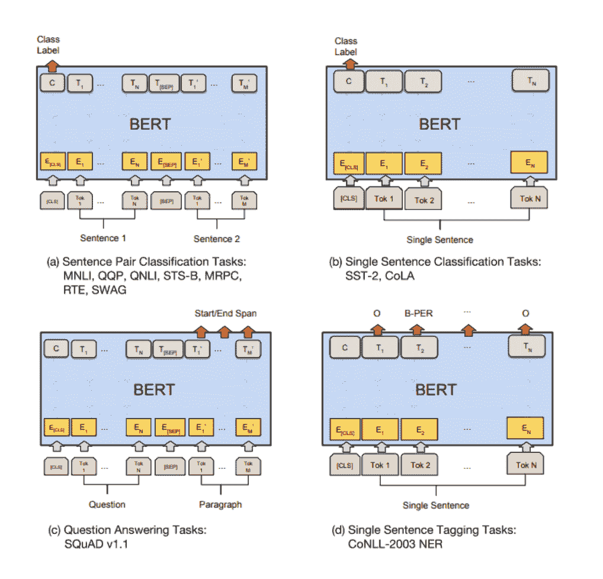
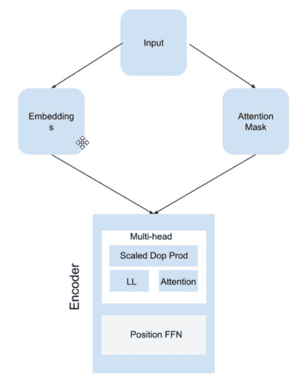

# 如何使用 PyTorch 编写 BERT 代码

> 原文：<https://web.archive.org/web/https://neptune.ai/blog/how-to-code-bert-using-pytorch-tutorial>

如果你是一个 NLP 爱好者，那么你可能听说过伯特。在本文中，我们将探讨 BERT:它是什么？以及它是如何工作的？，并学习如何使用 PyTorch 对其进行编码。

2018 年，Google 发表了一篇名为“[深度双向变压器语言理解预训练](https://web.archive.org/web/20230124065338/https://arxiv.org/pdf/1810.04805.pdf)”的论文。在这篇论文中，他们引入了一个名为 **BERT(使用变压器的双向编码器表示)**的语言模型，该模型在类似*问答*、*自然语言推理、分类和一般语言理解评估(GLUE)* 等任务中实现了最先进的性能。

BERT 版本是在三个架构发布之后发布的，这三个架构也实现了最先进的性能。这些模型是:

*   乌尔姆-菲特(1 月)
*   埃尔莫(二月)，
*   GPT 公开赛(6 月)
*   伯特(十月)。

OpenAI GPT 和 BERT 使用不使用递归神经网络的 [**变压器**](https://web.archive.org/web/20230124065338/https://papers.nips.cc/paper/7181-attention-is-all-you-need.pdf) 架构；这使得该架构能够通过**自我关注机制**考虑长期依赖性，这种机制从本质上改变了我们对顺序数据建模的方式。它引入了一种**编码器-解码器**架构，这种架构出现在计算机视觉应用中，例如通过可变自动编码器编码器生成图像。

那么 BERT 与 2018 年发布的所有车型有什么不同呢？

要回答这个问题，我们需要了解什么是 BERT，以及它是如何工作的。

那么，我们开始吧。

## 伯特是什么？

BERT 代表“使用变压器的双向编码器表示”。简而言之，BERT 通过编码器从数据或单词嵌入中提取模式或表示。编码器本身是一个堆叠在一起的转换器架构。它是一个双向转换器，这意味着在训练过程中，它会考虑词汇左侧和右侧的上下文来提取模式或表示。

BERT 使用两种训练范式:**预训练**和**微调**。

在**预训练期间，**在大数据集上训练模型以提取模式。这通常是一个**无监督学习**任务，其中模型在一个未标记的数据集上训练，如来自维基百科等大型语料库的数据。

在**微调**期间，模型被训练用于下游任务，如分类、文本生成、语言翻译、问答等等。本质上，你可以下载一个预先训练好的模型，然后根据你的数据转换学习这个模型。

### BERT 的核心组件

伯特借用了以前发布的 SOTA 模型的想法。让我们详细阐述一下那句话。

#### 变形金刚

BERT 的主要组件是变压器架构。变压器由两部分组成:**编码器**和**解码器**。编码器本身包含两个组件:T4 自关注层 T5 和 T6 前馈神经网络 T7。

自我注意层接受输入，将每个单词编码成中间编码表示，然后通过前馈神经网络。前馈网络将这些表示传递给解码器，解码器本身由三个组件组成:**自关注层、编码器-解码器**、**关注、**和**前馈神经网络**。

transformer 架构的好处在于，它有助于模型保留无限长的序列，这在传统的 RNNs、LSTMs 和 GRU 中是不可能的。但即使从它可以实现长期依赖的事实来看，它仍然**缺乏上下文理解**。

*Jay Alammar 在他的文章* [*中深入解释了变形金刚，图文并茂的变形金刚*](https://web.archive.org/web/20230124065338/https://jalammar.github.io/illustrated-transformer/) *，值得一探究竟。*

#### 工程与后勤管理局

BERT 借用了 ELMo 的另一个概念，即语言模型嵌入。埃尔莫是由[彼得斯等人介绍的。艾尔。](https://web.archive.org/web/20230124065338/https://arxiv.org/abs/1802.05365)2017 年，涉及语境理解的思想。ELMo 的工作方式是使用**双向** LSTM 来理解上下文。由于它从两个方向考虑单词，它可以为拼写相似但含义不同的单词分配不同的单词嵌入。

例如，“你们这些孩子应该**在黑暗中把**粘在一起”和“把那根**棍子**递给我”是完全不同的。尽管两个句子中使用了同一个词，但根据上下文的不同，意思是不同的。

因此，ELMo 通过考虑来自右和左两个方向的单词来分配嵌入，而之前开发的模型只考虑来自左的单词。这些模型是单向的，如 RNNs、LSTMs 等。

这使得 ELMo 能够从序列中捕获上下文信息，但是因为 ELMo 使用 LTSM，所以与变形金刚相比，它不具有长期依赖性。

到目前为止，我们已经看到，由于 transformers 中存在的注意机制，BERT 可以访问文档中的序列，即使它比序列中的当前单词落后“n”个单词，即，它可以保持长期依赖性，并且由于 ELMo 中存在的双向机制，它还可以实现对句子的上下文理解。

#### 乌尔姆拟合

2018 年，杰瑞米·霍华德和塞巴斯蒂安·鲁德发布了一篇名为[通用语言模型微调或 ULM-FiT](https://web.archive.org/web/20230124065338/https://arxiv.org/pdf/1801.06146.pdf) 的论文，他们在论文中指出，迁移学习可以用于自然语言处理，就像它用于计算机视觉一样。

以前，我们使用预训练的单词嵌入模型，该模型仅针对整个模型的第一层，即嵌入层，并且整个模型是从头开始训练的，这很耗时，并且在该领域没有发现很多成功。然而，Howard 和 Ruder 提出了 3 种文本分类方法:

*   第一步包括在更大的数据集上训练模型，以便模型学习表示。
*   第二步包括用特定于任务的数据集对模型进行微调以进行分类，在此期间，他们引入了另外两种方法:判别微调和倾斜三角学习率(STLR)。前一种方法试图在网络的传输层期间微调或优化每个参数，而后一种方法控制每个优化步骤中的学习速率。
*   第三步是在特定于任务的数据集上微调分类器以进行分类。

随着 ULM-FiT 的发布，NLP 实践者现在可以在他们的 NLP 问题中实践迁移学习方法。但是，ULM-FiT 迁移学习方法的唯一问题是，它包括微调网络中的所有层，这是一项繁重的工作。

#### GPT 开放大学

生成式预训练变压器或 GPT 是由 OpenAI 的团队引入的:拉德福德、纳拉辛汉、萨利曼斯和苏茨基弗。他们提出了一个模型，该模型在单向方法中仅使用来自转换器的解码器而不是编码器。因此，它在各种任务中的表现优于所有以前的型号，例如:

*   分类
*   自然语言推理
*   语义相似度
*   问题回答
*   多项选择。

即使 GPT 只使用解码器，它仍然可以保持长期的依赖性。此外，与我们在 ULM-FiT 中看到的相比，它将微调减少到了最低限度。

下表根据预培训、下游任务以及最重要的微调对不同模型进行了比较。

GPT [论文](https://web.archive.org/web/20230124065338/https://s3-us-west-2.amazonaws.com/openai-assets/research-covers/language-unsupervised/language_understanding_paper.pdf)的一段摘录写道“*与循环网络等替代方案相比，这种模型选择为我们提供了一种更结构化的记忆，用于处理文本中的长期依赖性，从而在不同任务之间实现稳健的传输性能。在转换过程中，我们利用来自遍历式方法的特定于任务的输入适应，这种方法将结构化文本输入作为单个连续的标记序列来处理。正如我们在实验中所展示的，这些适应使我们能够有效地进行微调，对预训练模型的架构进行最小的改变。*

让我们将所有模型与 BERT 进行比较，看它们能够执行的任务:

|  | 变压器 | 工程与后勤管理局 | 乌尔姆拟合 | GPT 开放大学 | 伯特 |
| --- | --- | --- | --- | --- | --- |
|  |  |  |  |  |  |
|  |  |  |  |  |  |
|  |  |  |  |  |  |
| 

**自然语言推理**

 |  |  |  |  |  |
|  |  |  |  |  |  |
| 

**分类或者**
**情绪分析**

 |  |  |  |  |  |
|  |  |  |  |  |  |
|  |  |  |  |  |  |

你可以检查[拥抱脸模型](https://web.archive.org/web/20230124065338/https://huggingface.co/models)来检查模型在每个任务上的表现。

## 为什么是伯特？

伯特陷入了[自我监督](/web/20230124065338/https://neptune.ai/blog/self-supervised-learning)模式。这意味着，它可以从原始语料库中生成输入和标签，而无需人类显式编程。请记住，它所训练的数据是非结构化的。

伯特接受了两项特定任务的预训练:掩蔽语言模型和下一句预测。前者使用类似“该男子[面具]到商店”的屏蔽输入，而不是“该男子去了商店”。这限制了 BERT 看到它旁边的单词，这允许它尽可能多地学习双向表示，使它对几个下游任务更加灵活和可靠。后者预测这两个句子是否在上下文中相互分配。

例如，如果句子 A 是“[CLS]那个人[面具]去商店”，句子 B 是“企鹅[面具]是不会飞的鸟[SEP]”，那么 BERT 将能够区分这两个句子是否是连续的。

在训练过程中，BERT 使用特殊类型的标记，如[CLS]、[屏蔽]、[分离]等，这些标记允许 BERT 区分一个句子何时开始，哪个单词被屏蔽，以及两个句子何时分开。我已经在**预处理**部分以表格的形式解释了这些令牌。

**由于我们之前讨论过的特性，BERT 也可用于特征提取**,并将这些提取提供给现有模型。

在最初的 BERT 论文中，它与 GPT 在[通用语言理解评估基准](https://web.archive.org/web/20230124065338/https://gluebenchmark.com/)上进行了比较，下面是结果。

正如你所看到的，伯特在所有的任务中都超过了 GPT，平均比 GPT 高出 7%。



*The image above shows the different tasks that BERT can be used for. | [Source](https://web.archive.org/web/20230124065338/https://arxiv.org/pdf/1810.04805.pdf)*

## 用 Pytorch 编写 BERT 代码

让我们用代码来理解如何用 PyTorch 构建 BERT。

我们将整个计划分为 4 个部分:

1.  预处理
2.  建筑模型
3.  损失和优化
4.  培养

### 预处理

在预处理中，我们将结构化数据，以便神经网络可以处理它。我们首先指定一个原始文本进行训练。

```py
text = (
       'Hello, how are you? I am Romeo.n'
       'Hello, Romeo My name is Juliet. Nice to meet you.n'
       'Nice meet you too. How are you today?n'
       'Great. My baseball team won the competition.n'
       'Oh Congratulations, Julietn'
       'Thanks you Romeo'
   )
```

然后，我们将通过以下方式清理数据:

*   把句子变成小写。
*   创造词汇。**词汇表**是文档中唯一单词的列表。

```py
  sentences = re.sub("[.,!?-]", '', text.lower()).split('n')  
   word_list = list(set(" ".join(sentences).split()))

```

现在，在接下来的步骤中，重要的是要记住伯特在训练中使用特殊的代币。下表解释了各种令牌的用途:

| 代币 | 目的 |
| --- | --- |
|  | 

第一个令牌总是分类

 |
|  |  |
|  |  |
|  | 

用等长截断句子。

 |
|  | 

用于通过替换原来的单词来创建一个遮罩。

 |

这些标记应该包含在单词字典中，其中词汇表中的每个标记和单词都分配有一个索引号。

```py
word_dict = {'[PAD]': 0, '[CLS]': 1, '[SEP]': 2, '[MASK]': 3}
for i, w in enumerate(word_list):
   word_dict[w] = i + 4
   number_dict = {i: w for i, w in enumerate(word_dict)}
   vocab_size = len(word_dict)
```

考虑到这一点，我们需要创建一个函数，为三种类型的嵌入格式化输入序列:**标记嵌入**、**片段嵌入、**和**位置嵌入**。

什么是令牌嵌入？

例如，如果句子是“猫在走路”。狗在叫”，那么该函数应该以如下方式创建一个序列:“[CLS]猫在走[SEP]狗在叫”。

之后，我们将所有内容转换为单词字典中的索引。所以前面的句子看起来就像“[1，5，7，9，10，2，5，6，9，11]”。请记住，1 和 2 分别是[CLS]和[九月]。

**什么是片段嵌入？**

片段嵌入将两个句子彼此分开，并且它们通常被定义为 0 和 1。

**什么是位置嵌入？**

位置嵌入给出了序列中每个嵌入的位置。

稍后我们将创建一个位置嵌入函数。

现在下一步将是创建**屏蔽**。

正如在原始论文中提到的，BERT 随机地将掩码分配给序列的 15%。但是请记住，不要给特殊标记分配掩码。为此，我们将使用条件语句。

一旦我们将 15%的单词替换为[MASK]标记，我们将添加填充。填充通常是为了确保所有的句子长度相等。例如，如果我们拿这个句子来说:

***“猫在走路。**狗对着树叫*

然后加上填充，看起来会是这样的:

***【CLS】猫在走[PAD] [PAD] [PAD]。[CLS]狗在对着树叫。”***

第一句话的长度等于第二句话的长度。

```py
def make_batch():
   batch = []
   positive = negative = 0
   while positive != batch_size/2 or negative != batch_size/2:
       tokens_a_index, tokens_b_index= randrange(len(sentences)), randrange(len(sentences))

       tokens_a, tokens_b= token_list[tokens_a_index], token_list[tokens_b_index]

       input_ids = [word_dict['[CLS]']] + tokens_a + [word_dict['[SEP]']] + tokens_b + [word_dict['[SEP]']]
       segment_ids = [0] * (1 + len(tokens_a) + 1) + [1] * (len(tokens_b) + 1)

       n_pred =  min(max_pred, max(1, int(round(len(input_ids) * 0.15)))) 
       cand_maked_pos = [i for i, token in enumerate(input_ids)
                         if token != word_dict['[CLS]'] and token != word_dict['[SEP]']]
       shuffle(cand_maked_pos)
       masked_tokens, masked_pos = [], []
       for pos in cand_maked_pos[:n_pred]:
           masked_pos.append(pos)
           masked_tokens.append(input_ids[pos])
           if random() < 0.8:  
               input_ids[pos] = word_dict['[MASK]'] 
           elif random() < 0.5:  
               index = randint(0, vocab_size - 1) 
               input_ids[pos] = word_dict[number_dict[index]] 

       n_pad = maxlen - len(input_ids)
       input_ids.extend([0] * n_pad)
       segment_ids.extend([0] * n_pad)

       if max_pred > n_pred:
           n_pad = max_pred - n_pred
           masked_tokens.extend([0] * n_pad)
           masked_pos.extend([0] * n_pad)

       if tokens_a_index + 1 == tokens_b_index and positive < batch_size/2:
           batch.append([input_ids, segment_ids, masked_tokens, masked_pos, True]) 
           positive += 1
       elif tokens_a_index + 1 != tokens_b_index and negative < batch_size/2:
           batch.append([input_ids, segment_ids, masked_tokens, masked_pos, False]) 
           negative += 1
   return batch
```

由于我们正在处理下一个单词预测，我们必须创建一个标签来预测该句子是否有连续的句子，即 IsNext 或 NotNext。所以我们为下一句之前的每一句赋值 True，我们用一个条件语句来实现。

例如，如果在上下文中，文档中的两个句子通常是前后相接的。假设第一句是 A，那么下一句应该是+1。直观地，我们编写代码，使得如果第一个句子位置，即 tokens _ a _ index+1 = = tokens _ b _ index，即相同上下文中的第二个句子，那么我们可以将该输入的标签设置为 True。

如果不满足上述条件，即如果 token _ a _ index+1！= tokens_b_index 然后我们将这个输入的标签设置为 False。

### 建筑模型

BERT 是一个复杂的模型，如果你慢慢理解它，你就会失去逻辑。所以解释它的组件和它们的功能是有意义的。

BERT 具有以下组件:

1.  嵌入层
2.  注意力屏蔽
3.  编码器层
    1.  多头注意力
        1.  比例点产品关注度
    2.  位置式前馈网络
4.  伯特(组装所有部件)

为了便于学习，你可以随时参考这个图表。



*Source: Author*

#### 嵌入层

嵌入是 BERT 中的第一层，它接受输入并创建一个*查找表*。嵌入层的参数是可学习的，这意味着当学习过程结束时，嵌入层会将相似的单词聚集在一起。

嵌入层还保留单词之间的不同关系，例如:语义、句法、线性，并且由于 BERT 是双向的，它还将保留上下文关系。

在 BERT 的例子中，它为

*   令牌，
*   分段和
*   位置。

如果您还记得，我们还没有创建一个函数来接收输入并对其进行格式化以进行位置嵌入，但是标记和段的格式化已经完成。因此，我们将接受输入，并为序列中的每个单词创建一个位置。它看起来像这样:

```py
print(torch.arange(30, dtype=torch.long).expand_as(input_ids))
```

```py
Output:

tensor([[ 0,  1,  2,  3,  4,  5,  6,  7,  8,  9, 10, 11, 12, 13, 14, 15, 16, 17,
         18, 19, 20, 21, 22, 23, 24, 25, 26, 27, 28, 29],
        [ 0,  1,  2,  3,  4,  5,  6,  7,  8,  9, 10, 11, 12, 13, 14, 15, 16, 17,
         18, 19, 20, 21, 22, 23, 24, 25, 26, 27, 28, 29],
        [ 0,  1,  2,  3,  4,  5,  6,  7,  8,  9, 10, 11, 12, 13, 14, 15, 16, 17,
         18, 19, 20, 21, 22, 23, 24, 25, 26, 27, 28, 29],
        [ 0,  1,  2,  3,  4,  5,  6,  7,  8,  9, 10, 11, 12, 13, 14, 15, 16, 17,
         18, 19, 20, 21, 22, 23, 24, 25, 26, 27, 28, 29],
        [ 0,  1,  2,  3,  4,  5,  6,  7,  8,  9, 10, 11, 12, 13, 14, 15, 16, 17,
         18, 19, 20, 21, 22, 23, 24, 25, 26, 27, 28, 29],
        [ 0,  1,  2,  3,  4,  5,  6,  7,  8,  9, 10, 11, 12, 13, 14, 15, 16, 17,
         18, 19, 20, 21, 22, 23, 24, 25, 26, 27, 28, 29]])
```

在前向函数中，我们总结了所有的嵌入，并对它们进行归一化。

```py
class Embedding(nn.Module):
   def __init__(self):
       super(Embedding, self).__init__()
       self.tok_embed = nn.Embedding(vocab_size, d_model)  
       self.pos_embed = nn.Embedding(maxlen, d_model)  
       self.seg_embed = nn.Embedding(n_segments, d_model)  
       self.norm = nn.LayerNorm(d_model)

   def forward(self, x, seg):
       seq_len = x.size(1)
       pos = torch.arange(seq_len, dtype=torch.long)
       pos = pos.unsqueeze(0).expand_as(x)  
       embedding = self.tok_embed(x) + self.pos_embed(pos) + self.seg_embed(seg)
       return self.norm(embedding)
```

#### 创建注意力屏蔽

伯特需要注意力面具。并且这些应该是适当的格式。以下代码将帮助您创建遮罩。

它会将[PAD]转换为 1，其他地方为 0。

```py
def get_attn_pad_mask(seq_q, seq_k):
   batch_size, len_q = seq_q.size()
   batch_size, len_k = seq_k.size()

   pad_attn_mask = seq_k.data.eq(0).unsqueeze(1)  
   return pad_attn_mask.expand(batch_size, len_q, len_k)  
```

```py
print(get_attn_pad_mask(input_ids, input_ids)[0][0], input_ids[0])
```

```py
Output:
(tensor([False, False, False, False, False, False, False, False, False, False,
         False, False, False,  True,  True,  True,  True,  True,  True,  True,
          True,  True,  True,  True,  True,  True,  True,  True,  True,  True]),
 tensor([ 1,  3, 26, 21, 14, 16, 12,  4,  2, 27,  3, 22,  2,  0,  0,  0,  0,  0,
          0,  0,  0,  0,  0,  0,  0,  0,  0,  0,  0,  0]))
```

#### 编码器

编码器有两个主要组件:

*   多头注意力
*   位置式前馈网络。

编码器的工作是从输入和注意屏蔽中找到表示和模式。

```py
class EncoderLayer(nn.Module):
   def __init__(self):
       super(EncoderLayer, self).__init__()
       self.enc_self_attn = MultiHeadAttention()
       self.pos_ffn = PoswiseFeedForwardNet()

   def forward(self, enc_inputs, enc_self_attn_mask):
       enc_outputs, attn = self.enc_self_attn(enc_inputs, enc_inputs, enc_inputs, enc_self_attn_mask) 
       enc_outputs = self.pos_ffn(enc_outputs) 
       return enc_outputs, attn
```

**多头关注**

这是编码器的第一个主要组件。

注意力模型有三个输入:**查询**、**键、**和**值**。

我强烈推荐你阅读杰伊·阿拉姆马的《变形金刚》[](https://web.archive.org/web/20230124065338/https://jalammar.github.io/illustrated-transformer/)**，它深入地解释了注意力模型。**

 *多头注意力需要四个输入:**查询**、**键**、**值、**和**注意力屏蔽**。嵌入作为输入提供给查询、键和值参数，而注意掩码作为输入提供给注意掩码参数。
这三个输入和注意屏蔽用点积运算操作，产生两个输出:**上下文向量**和**注意**。然后上下文向量通过一个线性层，最后产生输出。

```py
class MultiHeadAttention(nn.Module):
   def __init__(self):
       super(MultiHeadAttention, self).__init__()
       self.W_Q = nn.Linear(d_model, d_k * n_heads)
       self.W_K = nn.Linear(d_model, d_k * n_heads)
       self.W_V = nn.Linear(d_model, d_v * n_heads)

   def forward(self, Q, K, V, attn_mask):

       residual, batch_size = Q, Q.size(0)

       q_s = self.W_Q(Q).view(batch_size, -1, n_heads, d_k).transpose(1,2)  
       k_s = self.W_K(K).view(batch_size, -1, n_heads, d_k).transpose(1,2)  
       v_s = self.W_V(V).view(batch_size, -1, n_heads, d_v).transpose(1,2)  

       attn_mask = attn_mask.unsqueeze(1).repeat(1, n_heads, 1, 1) 

       context, attn = ScaledDotProductAttention()(q_s, k_s, v_s, attn_mask)
       context = context.transpose(1, 2).contiguous().view(batch_size, -1, n_heads * d_v) 
       output = nn.Linear(n_heads * d_v, d_model)(context)

return nn.LayerNorm(d_model)(output + residual), attn 
```

现在，让我们来探索这种成比例的点积注意力:

*   缩放的点积注意类有四个参数:查询、键、值和注意掩码。本质上，前三个参数由单词嵌入提供，而注意力屏蔽参数由注意力屏蔽嵌入提供。
*   然后，它在**查询**和**键**之间进行矩阵乘法，以获得分数。

接下来我们使用 scores.masked_fill_(attn_mask，-1e9)。该属性用-1e9 填充 scores 的元素，其中注意力掩码为**真**，而其余元素得到一个**注意力分数**，该分数然后通过 softmax 函数传递，该函数给出 0 到 1 之间的分数。最后，我们执行注意力和值之间的矩阵乘法，这给出了上下文向量。

```py
class ScaledDotProductAttention(nn.Module):
   def __init__(self):
       super(ScaledDotProductAttention, self).__init__()

   def forward(self, Q, K, V, attn_mask):
       scores = torch.matmul(Q, K.transpose(-1, -2)) / np.sqrt(d_k) 
       scores.masked_fill_(attn_mask, -1e9) 
       attn = nn.Softmax(dim=-1)(scores)
       context = torch.matmul(attn, V)
       return score, context, attn
```

```py
emb = Embedding()
embeds = emb(input_ids, segment_ids)

attenM = get_attn_pad_mask(input_ids, input_ids)

SDPA= ScaledDotProductAttention()(embeds, embeds, embeds, attenM)

S, C, A = SDPA

print('Masks',masks[0][0])
print()
print('Scores: ', S[0][0],'nnAttention Scores after softmax: ', A[0][0])
```

```py
Output:

Masks tensor([False, False, False, False, False, False, False, False, False, False,
        False, False, False,  True,  True,  True,  True,  True,  True,  True,
         True,  True,  True,  True,  True,  True,  True,  True,  True,  True])

Scores:  tensor([ 9.6000e+01,  3.1570e+01,  2.9415e+01,  3.3990e+01,  3.7752e+01,
         3.7363e+01,  3.1683e+01,  3.2156e+01,  3.5942e+01, -2.4670e+00,
        -2.2461e+00, -8.1908e+00, -2.1571e+00, -1.0000e+09, -1.0000e+09,
        -1.0000e+09, -1.0000e+09, -1.0000e+09, -1.0000e+09, -1.0000e+09,
        -1.0000e+09, -1.0000e+09, -1.0000e+09, -1.0000e+09, -1.0000e+09,
        -1.0000e+09, -1.0000e+09, -1.0000e+09, -1.0000e+09, -1.0000e+09],
       grad_fn=<SelectBackward>)

Attention Scores after softmax::  tensor([1.0000e+00, 1.0440e-28, 1.2090e-29, 1.1732e-27, 5.0495e-26, 3.4218e-26,
        1.1689e-28, 1.8746e-28, 8.2677e-27, 1.7236e-43, 2.1440e-43, 0.0000e+00,
        2.3542e-43, 0.0000e+00, 0.0000e+00, 0.0000e+00, 0.0000e+00, 0.0000e+00,
        0.0000e+00, 0.0000e+00, 0.0000e+00, 0.0000e+00, 0.0000e+00, 0.0000e+00,
        0.0000e+00, 0.0000e+00, 0.0000e+00, 0.0000e+00, 0.0000e+00, 0.0000e+00],
       grad_fn=<SelectBackward>)
```

**位置式前馈网络**

multihead 的输出进入前馈网络，构成编码器部分。

让我们喘口气，复习一下到目前为止我们所学的内容:

*   输入进入嵌入和注意功能。两者都被馈送到具有多头功能和前馈网络的编码器中。
*   多头功能本身具有使用点积操作来操作嵌入和注意力屏蔽的功能。


*Source: Author*

#### 组装所有组件

让我们从我们离开的地方继续，即编码器的输出。

编码器产生两个输出:

*   一个来自前馈层，并且
*   注意力面具。

请记住，BERT 并没有明确使用解码器。相反，它使用输出和注意力屏蔽来获得想要的结果。

虽然变压器中的解码器部分被替换为浅网络，该浅网络可用于分类，如下面的代码所示。
同样，BERT 输出两个结果:一个是针对**分类器**的，另一个是针对**屏蔽**的。

```py
class BERT(nn.Module):
   def __init__(self):
       super(BERT, self).__init__()
       self.embedding = Embedding()
       self.layers = nn.ModuleList([EncoderLayer() for _ in range(n_layers)])
       self.fc = nn.Linear(d_model, d_model)
       self.activ1 = nn.Tanh()
       self.linear = nn.Linear(d_model, d_model)
       self.activ2 = gelu
       self.norm = nn.LayerNorm(d_model)
       self.classifier = nn.Linear(d_model, 2)

       embed_weight = self.embedding.tok_embed.weight
       n_vocab, n_dim = embed_weight.size()
       self.decoder = nn.Linear(n_dim, n_vocab, bias=False)
       self.decoder.weight = embed_weight
       self.decoder_bias = nn.Parameter(torch.zeros(n_vocab))

   def forward(self, input_ids, segment_ids, masked_pos):
       output = self.embedding(input_ids, segment_ids)
       enc_self_attn_mask = get_attn_pad_mask(input_ids, input_ids)
       for layer in self.layers:
           output, enc_self_attn = layer(output, enc_self_attn_mask)

       h_pooled = self.activ1(self.fc(output[:, 0])) 
       logits_clsf = self.classifier(h_pooled) 

       masked_pos = masked_pos[:, :, None].expand(-1, -1, output.size(-1)) 

       h_masked = torch.gather(output, 1, masked_pos) 
       h_masked = self.norm(self.activ2(self.linear(h_masked)))
       logits_lm = self.decoder(h_masked) + self.decoder_bias 

       return logits_lm, logits_clsf
```

需要记住的几件事:

1.  您可以指定编码器的数量。在原始论文中，基本模型有 12 个。
2.  有两个激活函数:Tanh 和 GELU(**G**aussian**E**rror**L**linear**U**nit)。

```py
def gelu(x):
   return x * 0.5 * (1.0 + torch.erf(x / math.sqrt(2.0)))
```

### 损失和优化

虽然原始论文计算了所有词汇的概率分布，但我们可以使用 softmax 近似值。但是一个简单的方法是使用 ***交叉熵损失*** 。它是 *softmax* 和*负对数似然*的组合。

因此，在构建模型时，您不必包括 softmax，而是从没有 softmax 归一化的前馈神经网络获得清晰的输出。

说到优化，我们将使用 **Adam** 优化器。

```py
criterion = nn.CrossEntropyLoss()
optimizer = optim.Adam(model.parameters(), lr=0.001)
```

### 培养

最后，我们将开始训练。

```py
model = BERT()
batch = make_batch()
input_ids, segment_ids, masked_tokens, masked_pos, isNext = map(torch.LongTensor, zip(*batch))

   for epoch in range(100):
       optimizer.zero_grad()
       logits_lm, logits_clsf = model(input_ids, segment_ids, masked_pos)
       loss_lm = criterion(logits_lm.transpose(1, 2), masked_tokens) 
       loss_lm = (loss_lm.float()).mean()
       loss_clsf = criterion(logits_clsf, isNext) 
       loss = loss_lm + loss_clsf
       if (epoch + 1) % 10 == 0:
           print('Epoch:', '%04d' % (epoch + 1), 'cost =', '{:.6f}'.format(loss))
       loss.backward()
       optimizer.step()

   input_ids, segment_ids, masked_tokens, masked_pos, isNext = map(torch.LongTensor, zip(batch[0]))
   print(text)
   print([number_dict[w.item()] for w in input_ids[0] if number_dict[w.item()] != '[PAD]'])

   logits_lm, logits_clsf = model(input_ids, segment_ids, masked_pos)
   logits_lm = logits_lm.data.max(2)[1][0].data.numpy()
   print('masked tokens list : ',[pos.item() for pos in masked_tokens[0] if pos.item() != 0])
   print('predict masked tokens list : ',[pos for pos in logits_lm if pos != 0])

   logits_clsf = logits_clsf.data.max(1)[1].data.numpy()[0]
   print('isNext : ', True if isNext else False)
   print('predict isNext : ',True if logits_clsf else False)
```

```py
Output:

Hello, how are you? I am Romeo.
Hello, Romeo My name is Juliet. Nice to meet you.
Nice meet you too. How are you today?
Great. My baseball team won the competition.
Oh Congratulations, Juliet
Thanks you Romeo
['[CLS]', 'nice', 'meet', 'you', 'too', 'how', 'are', 'you', 'today', '[SEP]', '[MASK]', 'congratulations', '[MASK]', '[SEP]']
masked tokens list :  [27, 22]
predict masked tokens list :  []
isNext :  False
predict isNext :  True
```

这就是伯特从头开始的编码。如果你在一个大的语料库上训练它，那么你可以使用相同的模型:

1.  预训练:使用任何语料库，但要使用前面提到的输入表示的精确格式。
2.  微调:确保你使用监督学习数据。
3.  不同任务的特征提取器，甚至主题建模。

你可以在这里找到完整的笔记本[。](https://web.archive.org/web/20230124065338/https://colab.research.google.com/drive/13FjI_uXaw8JJGjzjVX3qKSLyW9p3b6OV?usp=sharing)

## 有办法得到预训练的模型吗？

在最初的论文中，发布了两个模型:BERT-base 和 BERT-large。在本文中，我展示了如何从头开始编写 BERT 代码。

一般可以下载预训练好的模型，这样就不用经历这些步骤了。Huggingface 库提供了这个特性，你可以使用 Huggingface for PyTorch 的 transformer 库。过程保持不变。

我有一个笔记本，我用了一个来自 Huggingface 的预先训练过的 BERT，你可以在这里查看一下。

当你使用一个预先训练好的模型时，你需要做的就是下载这个模型，然后在一个类中调用它，并使用一个向前的方法来提供你的输入和掩码。

例如:

```py
import transformers

class BERTClassification(nn.Module):
    def __init__ (self):
        super(BERTClassification, self).__init__()
        self.bert = transformers.BertModel.from_pretrained('bert-base-cased')
        self.bert_drop = nn.Dropout(0.4)
        self.out = nn.Linear(768, 1)

    def forward(self, ids, mask, token_type_ids):
        _, pooledOut = self.bert(ids, attention_mask = mask,
                                token_type_ids=token_type_ids)
        bertOut = self.bert_drop(pooledOut)
        output = self.out(bertOut)

        return output
```

## 最后的想法

BERT 是一个非常强大的最先进的 NLP 模型。预训练模型是在大型语料库上训练的，您可以根据自己的需要并基于较小数据集上的任务对其进行微调。关于微调的最好的事情是，你不要做 1000 个时期，它甚至可以在 3 到 10 个时期内模仿 SOTA 性能，这取决于参数和数据集处理的好坏。

我希望这个教程是有趣的和有益的。我希望你能从中得到些什么。

### 资源*