# 如何处理不平衡的分类和回归数据

> 原文：<https://web.archive.org/web/https://neptune.ai/blog/how-to-deal-with-imbalanced-classification-and-regression-data>

**数据不平衡**是现实世界中普遍存在的固有现象。数据通常表现为带有长尾的偏态分布。然而，目前使用的大多数机器学习算法是围绕每个目标类别(分类)均匀分布的假设设计的。

另一方面，我们不能忘记，许多任务涉及连续的目标，甚至无限的值(回归)，其中不存在类之间的硬边界(即年龄预测，深度估计，等等)。

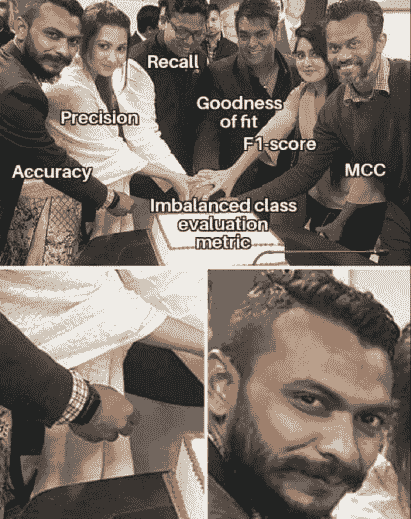

*Data imbalance | Source: Author*

在本文中，我将向您介绍如何处理分类和回归任务中的不平衡数据，并讨论在这种情况下您可以对每个任务使用的性能度量。

从不平衡数据中学习有 3 种主要方法:

## 1 数据方法

*   2 算法方法
*   3 混合(系综)方法
*   不平衡分类数据

## SMOTE 不平衡分类是一个被充分探索和理解的主题。

在实际应用中，我们面临许多挑战，我们只有不均匀的数据表示，其中**少数类**通常是更重要的一个，因此我们需要一些方法来提高其识别率。这个问题对预测建模提出了严峻的挑战，因为学习算法将偏向于**多数阶级**。

我们生活中的重要日常任务，如防止恶意攻击、检测威胁生命的疾病或处理监控系统中的罕见情况，都面临着从 1:1000 到 1:5000 的极端类别不平衡，人们必须设计能够调整和克服这种极端偏差的智能系统。

如何处理不平衡的数据集-数据方法

### 它专注于修改训练集，使其适合标准的学习算法。这可以通过平衡数据集的分布来实现，数据集可以两种方式分类:

*How would you handle an imbalanced dataset? | [Source](https://web.archive.org/web/20220926103213/https://medium.com/sfu-cspmp/winning-against-imbalanced-datasets-14809437aa62)*

过采样

*   欠采样
*   1.过采样

#### 在这种方法中，我们综合了来自少数民族的新例子。

有几种方法可用于对典型分类问题中使用的数据集进行过采样。但最常见的数据扩充技术被称为**合成少数过采样技术**或简称为 **SMOTE** 。

顾名思义，SMOTE 创建的是“合成”的例子，而不是带有替换的过采样。具体来说，SMOTE 的工作方式如下。它从随机选择一个少数类实例开始，并随机找到它的 *k* 个最近的少数类邻居。然后，在连接特征空间中的两个示例的线上随机选择的点处创建合成示例。

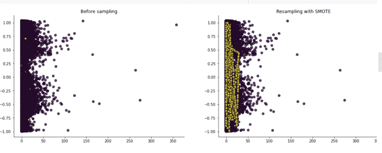

*Scatter plot of the class distribution before and after SMOTE | [Source](https://web.archive.org/web/20220926103213/https://colab.research.google.com/drive/10gViloq5Wet40P1fod2MxYYCo8ou4Yg1#scrollTo=mp8WOh3Zj9wS)*

当被添加到训练集时，为少数类创建的来自 SMOTE 的合成示例平衡了类分布，并使分类器创建更大和更不具体的决策区域，帮助分类器更好地概括并减轻过拟合，而不是创建更小和更具体的区域，这将使模型过拟合多数类。

这种方法受数据扩充技术的启发，该技术在手写字符识别中证明是成功的，其中旋转和倾斜等操作是干扰训练数据的自然方式。

现在，我们来看看 SMOTE 的表现。

从混淆矩阵中，我们可以注意到一些事情:

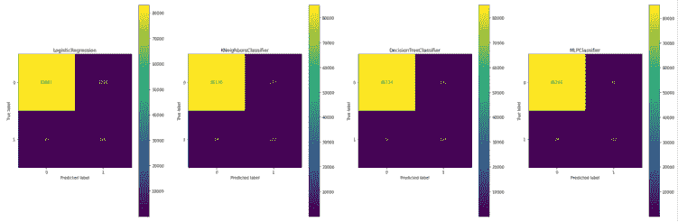

*Confusion matrix of classifiers trained on data synthetic examples and tested on the imbalanced test set | [Source](https://web.archive.org/web/20220926103213/https://colab.research.google.com/drive/10gViloq5Wet40P1fod2MxYYCo8ou4Yg1#scrollTo=mp8WOh3Zj9wS)*

在合成例子上训练的分类器概括得很好。

*   分类器很好地识别少数类(真正的否定)。
*   与欠采样相比，它们的假阳性更少。
*   优势

##### 它改善了由随机过采样引起的过拟合，因为生成的是合成样本，而不是现有样本的副本。

*   没有信息丢失。
*   很简单。
*   不足之处

##### 在生成合成示例时，SMOTE 不考虑可能来自其他类的相邻示例。这可能会增加类别的重叠，并会引入额外的噪声。

*   SMOTE 对于高维数据不是很实用。
*   2.欠采样

#### 在这种方法中，我们减少了来自**多数类**的样本数量，以匹配**少数类**的样本数量。

这可以通过几种方式实现:

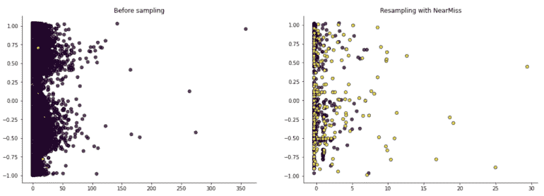

*Scatter plot of the class distribution before and after applying NearMiss-2 | [S](https://web.archive.org/web/20220926103213/https://colab.research.google.com/drive/10gViloq5Wet40P1fod2MxYYCo8ou4Yg1#scrollTo=mp8WOh3Zj9wS)[ource](https://web.archive.org/web/20220926103213/https://colab.research.google.com/drive/10gViloq5Wet40P1fod2MxYYCo8ou4Yg1#scrollTo=mp8WOh3Zj9wS)*

**随机抽样器**:从多数类中随机选取几个样本，是平衡数据最简单快捷的方法。

1.  **NearMiss** :通过实现 [3 种不同的试探法](https://web.archive.org/web/20220926103213/https://imbalanced-learn.org/stable/under_sampling.html#mathematical-formulation)，给选中的样本添加一些常识性的规则，但在本文中，我们将只关注其中一种。
2.  **NearMiss-2** 与三个最远的少数类实例具有最小平均距离的多数类实例。
    *   从混淆矩阵中，我们可以注意到一些事情:

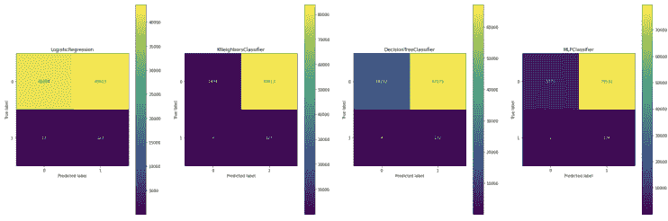

*Confusion matrix of classifiers trained on undersampled examples and tested on the imbalanced test set | [Source](https://web.archive.org/web/20220926103213/https://colab.research.google.com/drive/10gViloq5Wet40P1fod2MxYYCo8ou4Yg1#scrollTo=mp8WOh3Zj9wS)*

在识别多数类(真正值)时，欠采样与过采样相比表现不佳。但除此之外，它比过采样更好地识别少数类，并且具有更少的假阴性。

*   优势

##### 数据科学家可以平衡数据集，并降低他们的分析或机器学习算法偏向大多数的风险。因为如果不进行重采样，科学家可能会得出所谓的准确性悖论，即他们运行的分类模型具有 90%的准确性。然而，仔细观察，他们会发现结果在很大程度上属于多数阶级。

*   更少的存储需求和更好的分析运行时间。更少的数据意味着您或您的企业需要更少的存储和时间来获得有价值的见解。
*   不足之处

##### 移除足够多的多数样本以使多数类的大小与少数类的大小相同或相似会导致大量数据丢失。

*   所选的多数类样本可能会有偏差，这意味着它可能无法准确代表真实世界，并且分析结果可能不准确。因此，它会导致分类器在真实的看不见的数据上表现不佳。
*   由于这些缺点，一些科学家可能更喜欢过采样。它不会导致任何信息丢失，并且在某些情况下，可能比欠采样执行得更好。但是过采样也不是完美的。因为过采样通常涉及复制少数事件，所以会导致过拟合。

“SMOTE 和欠采样的组合比普通欠采样的性能更好。”

> *“The combination of SMOTE and under-sampling performs better than plain under-sampling.”*
> 
> [SMOTE:合成少数过采样技术](https://web.archive.org/web/20220926103213/https://arxiv.org/abs/1106.1813)，2011
> 
>  为了平衡这些问题，某些情况下可能需要将过采样和欠采样结合起来，以获得最逼真的数据集和准确的结果。

如何处理不平衡数据——算法方法

### 这种方法集中于修改现有的模型，以减轻它们对多数群体的偏见。这需要对修改的学习算法有很好的洞察力，并精确识别其在学习偏斜分布的表示时失败的原因。

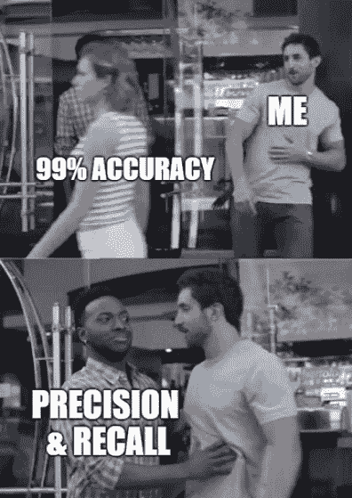

*Algorithm approach – best models for imbalanced classification | [Source](https://web.archive.org/web/20220926103213/https://medium.com/analytics-vidhya/what-precision-recall-f1-score-and-accuracy-can-tell-you-fe1eab1ada5a)*

最流行的技术是成本敏感方法(**加权学习者**)。在这里，给定的模型被修改，以纳入不同的惩罚为每一组考虑的例子。换句话说，**我们使用焦点损失，在我们的成本函数中，我们将较高的权重分配给少数类，这将惩罚模型对少数类的错误分类，同时减少多数类的权重，使模型更加关注代表性不足的类**。从而提高了它在学习过程中的重要性。

另一个有趣的算法级解决方案是应用**单类学习或单类分类(简称 OCC)**，专注于目标群体，创建数据描述。通过这种方式，我们消除了对任何群体的偏见，因为我们只关注一组对象。

OCC 在不平衡分类问题中是有用的，因为它提供了异常值和异常检测的技术。它通过对多数类数据(也称为正例)拟合模型，并预测新数据是属于多数类还是属于少数类(也称为负例)，这意味着它是异常值/异常值。

OCC 问题通常是实际的分类任务，其中多数类数据很容易获得，但少数类数据很难、很昂贵，甚至不可能收集，即引擎工作、欺诈交易、计算机系统的入侵检测等等。

如何处理不平衡数据——混合方法

### 杂交是一种利用单个组件优势的方法。在处理不平衡分类数据时，一些工作提出了混合采样和代价敏感学习。换句话说，结合**数据**和**算法**的水平接近。这种**两阶段训练的想法，即**将数据级解决方案与算法级解决方案(即分类器集成)合并，从而产生健壮和高效的学习器，非常受欢迎。

它首先通过应用数据级方法来工作。如您所知，数据级方法通过使用过采样或欠采样来修改训练集，以平衡多数类和少数类之间的类分布。

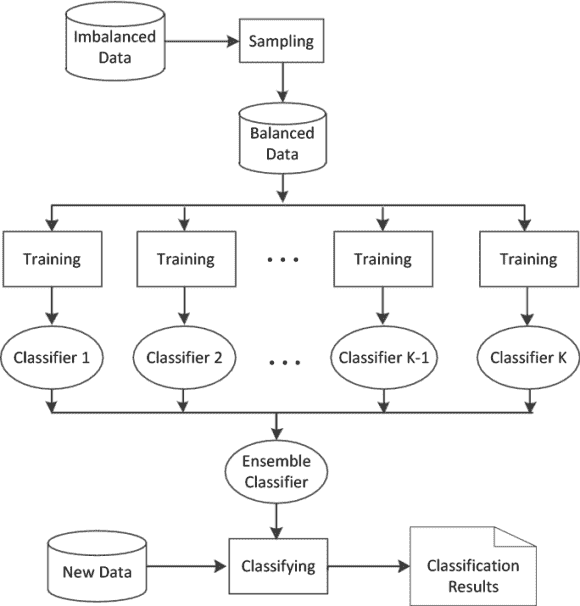

*Example scheme of the hybrid approach | [Source](https://web.archive.org/web/20220926103213/https://link.springer.com/article/10.1007/s42979-020-0119-4)*

然后，使用具有平衡类别分布的预处理数据来训练分类器集成，换句话说，训练多个分类器的集合，从该集合中导出新的分类器，该新的分类器比任何组成分类器执行得更好。因此，创建一个健壮而有效的学习器，它继承了数据级和算法级方法的优点，同时减少了它们的缺点。

从混淆矩阵中，我们可以注意到一些事情:

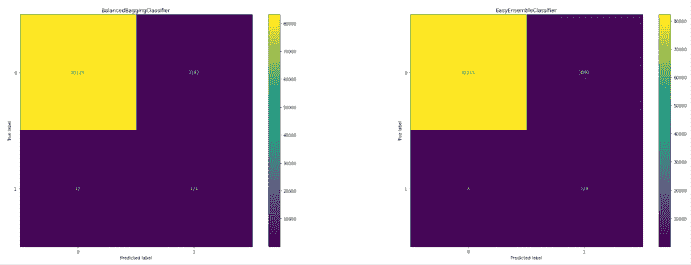

*Confusion matrix of hybrid classifiers trained and tested on the imbalanced test set | [Source](https://web.archive.org/web/20220926103213/https://colab.research.google.com/drive/10gViloq5Wet40P1fod2MxYYCo8ou4Yg1#scrollTo=mp8WOh3Zj9wS)*

当涉及到识别多数类时，混合分类器比欠采样执行得更好

*   并且，在识别少数类时，几乎与欠采样和过采样一样好。
*   基本上是两全其美！

不平衡分类的性能度量

### 在这一节中，我们回顾了在处理不平衡分类数据时常用的性能指标及其有效性。

混淆矩阵

*   ROC 和 AUC
*   精确召回
*   f 分数
*   1.混淆矩阵

#### 对于二进制分类问题，**混淆矩阵**定义了性能测量的基础。大多数性能指标都来自混淆矩阵，即准确度、误分类率、精确度和召回率。

然而，当数据不平衡时，**精度是不合适的。因为该模型可以通过准确预测多数类而对少数类表现不佳来实现更高的准确性，在大多数情况下，少数类是我们最关心的类。**

2.ROC 和 AUC 不平衡数据

#### 为了适应少数类别，提出了接收机工作特性(ROC)曲线作为真阳性(TP)率和假阳性(FP)率之间权衡范围的度量。另一个重要的性能指标是曲线下面积(AUC ),这是一个常用的性能指标，用于在单个得分中总结 ROC 曲线。此外，AUC 不偏向于模型在多数或少数类上的表现，这使得这种方法在处理不平衡数据时更合适。

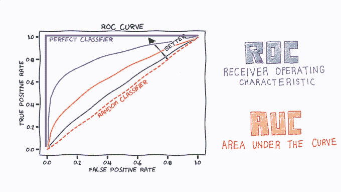

*ROC and AUC imbalanced data | [Source](https://web.archive.org/web/20220926103213/https://i.ytimg.com/vi/afQ_DyKMxUo/maxresdefault.jpg) *

3.精确度和召回率

#### 从混淆矩阵中，我们还可以推导出**精度和**召回性能指标。

精度对于类不平衡是很重要的，它不受类不平衡的影响，因为它的计算中不包括真负数的数量。

精度和召回率的一个缺点是，与精度一样，在这两者之间可能会有一些不平衡，我们希望提高少数类的 TP，然而，FP 的数量也可以增加。

4.f 分数

#### 为了平衡查全率和查准率，即提高查全率，同时保持较低的查准率，建议将 **F 值**作为查准率和查全率的调和平均值。

由于 F-score 同等地加权、精确和回忆，并且平衡了这两个问题，它不太可能偏向多数或少数类。[【2】](https://web.archive.org/web/20220926103213/https://docs.google.com/document/d/1jlcYg_zmBwEJJOP79bV4PfcftpclGzEEvS20TjgOcBY/edit#heading=h.ubjlh9z2r0v)

在我为您准备的 Colab 笔记本中，用 3 个不平衡分类方法代码示例检查[这个实验。](https://web.archive.org/web/20220926103213/https://colab.research.google.com/drive/10gViloq5Wet40P1fod2MxYYCo8ou4Yg1?usp=sharing)

不平衡回归数据

## **不平衡数据的回归**没有得到很好的探索。此外，许多重要的现实生活应用程序，如经济、危机管理、故障诊断或气象学，要求我们对不平衡数据应用**回归，这意味着从输入数据中预测罕见和极端的连续目标值。**

**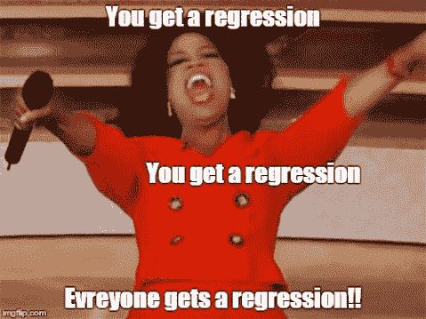

*Imbalanced regression data | [Source](https://web.archive.org/web/20220926103213/https://i.imgflip.com/sy501.jpg)*

因为处理不平衡数据是主要在分类任务的上下文中研究的相关问题，所以在回归的上下文中很少有成熟或合适的策略来处理它。

让我们先来看看不平衡分类中采用的典型方法，然后我们来看看目前使用的一些最好的不平衡回归技术。

不平衡分类采用的方法

### 数据方法

#### 当谈到不平衡回归的数据方法时，我们有两种受不平衡分类启发很大的技术:

1\. SMOTER

##### SMOTE 是对众所周知的 SMOTE 算法的回归的改编。

它的工作原理是使用原始标签密度定义频繁(多数)和罕见(少数)区域，然后对多数区域应用随机欠采样，对少数区域应用过采样，其中用户必须预先确定 SMOTER 算法要执行的过采样和欠采样的百分比。

当对少数区域进行过采样时，它不仅会生成新的合成样本，还会应用一种组合不同样本的输入和目标的[插值](https://web.archive.org/web/20220926103213/https://www.investopedia.com/terms/i/interpolation.asp#:~:text=Interpolation%20is%20achieved,haven%27t%20been%20calculated)策略。准确地说，这种插值使用两种罕见的情况来执行，其中一种情况是种子情况，另一种情况是从种子的 k 个最近邻居中随机选择的。对两种情况的特征进行插值，并将新的目标变量确定为所使用的两种罕见情况的目标变量的加权平均值。

你可能会问，为什么我们必须平均目标变量？请记住，在最初的 SMOTE 算法中，这是一个微不足道的问题，因为所有罕见的情况都具有相同的区域(目标少数区域)，但在回归的情况下，答案并不那么微不足道，因为当一对示例用于生成新的合成情况时，它们将不会具有相同的目标变量值。

2.斯穆恩

##### SMOGN 采用 SMOTER，但它会在 SMOTER 已有的过采样相位之外进一步增加高斯噪声。

SMOGN 算法的关键思想是组合 smote 和高斯噪声策略来生成合成样本，以通过使用引入高斯噪声的更保守的策略来同时限制 smote 可能招致的风险，例如缺乏多样的样本，因为 smote 在插值过程中不会使用最远的样本。其工作方式是，仅当种子样本和所选的 k-最近邻足够接近时，使用 SMOTER 生成新的合成样本，而当两个样本距离较远时，使用高斯噪声。

算法方法

#### 与不平衡分类一样，这种方法也包括调整损失函数以补偿区域不平衡(重新加权)和其他相关的学习范例，如迁移学习、度量学习、两阶段训练和元学习[【4】](https://web.archive.org/web/20220926103213/https://arxiv.org/pdf/2102.09554.pdf)。但我们将重点关注前两个范例:

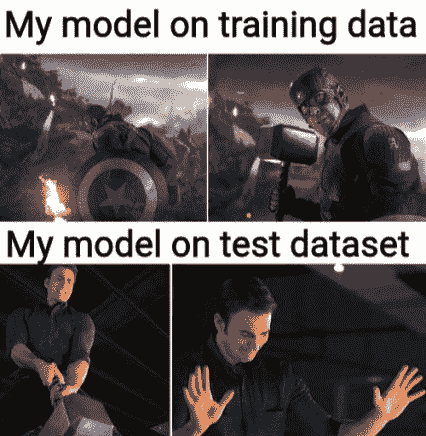

*Algorithm approach | Source: Author*

错误感知损失

*   对成本敏感的重新加权
*   1.错误感知损失

##### 它是用于分类的焦点损失的回归版本，称为 Focal-R。焦点损失是一种动态加权的交叉熵损失，其中随着正确类别的置信度增加，加权因子(alpha)衰减到零。

Focal-R 用一个连续函数来代替加权因子，该函数将绝对误差(L1 距离)映射为 0 到 1 范围内的值。

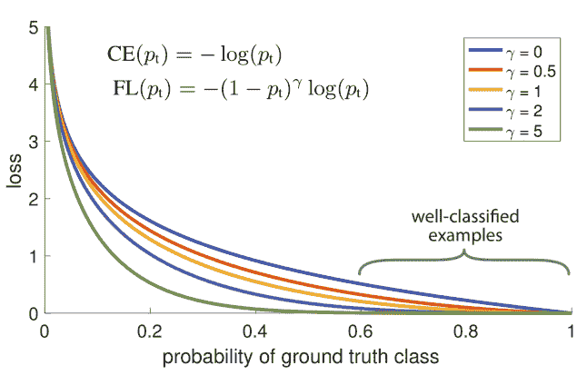

*The focal loss down weights easy examples with a weighting factor of  – (1-  pt)^γ | [Source](https://web.archive.org/web/20220926103213/https://arxiv.org/ftp/arxiv/papers/2006/2006.01413.pdf)*

准确地说，基于 L1 距离的焦 R 损失可以写成:

其中，ei 是第 I 个样本的 L1 误差，σ()是 Sigmoid 函数，β、γ是超参数。

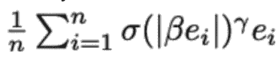

*Focal-R loss based on L1 distance | [Source](https://web.archive.org/web/20220926103213/https://arxiv.org/pdf/2102.09554.pdf)*

2.对成本敏感的重新加权

##### 由于可以将目标空间划分为有限的仓，所以可以直接插入经典的重新加权方案，例如逆频率加权(INV)及其平方根加权变体(SQINV ),这两种方案都是基于标签分布的。

混合工艺

#### 它遵循不平衡分类的混合方法。

像用于不平衡分类的混合方法一样，不平衡回归混合方法也结合了数据级和算法级方法，以便产生健壮和高效的学习器。

这种方法的一个例子是基于 Bagging 的集合。

基于 Bagging 的集成

##### 该算法结合了数据预处理策略，以解决回归任务中的不平衡域。

确切地说，一篇题为“REBAGG:不平衡回归的重采样 BAGGing”的论文提出了一种算法，该算法在生成的模型上获得多样性，同时使它们偏向最少表示和更重要的情况。

它有两个主要步骤:

使用训练集的预处理样本建立多个模型。

1.  通过应用平均策略(基本上是平均模型的预测以获得最终预测)，使用训练好的模型来获得对看不见的数据的预测。
2.  关于第一步，作者开发了四种主要类型的重采样方法来应用于原始训练集:**平衡**、**平衡。贴片**、**变异**、**T7、**变异。SMT** 。这些方法的主要区别在于:**

I)在新样本中使用的少数和多数样本之间的比率；而且，

ii)如何获得新的少数样本。

在标有前缀“balance”的重采样方法中，新的修改后的训练集将具有相同数量的少数和多数样本。另一方面，对于带有前缀“变化”的重采样方法，新训练集中少数样本与多数样本的比率将会变化。

当重采样方法没有附加后缀时，则通过使用随机选择的少数样本的精确副本来获得少数区域的新合成样本。并且当添加后缀“SMT”时，使用 SMOTER 算法获得少数区域的新合成示例。

深度不平衡回归

### 不平衡分类工作采用的方法；然而，单独使用它们有几个缺点。

请允许我打个比方！

上述数据集具有本质上不同的标签空间:( a) CIFAR-100 展示分类标签空间，其中目标是类别索引，而(b) IMDB-WIKI 展示连续标签空间，其中目标是年龄。

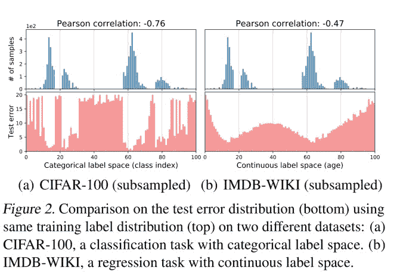

*Figure 1\. Comparison on the test error distribution (bottom) using the same training label distribution (top) on two different datasets |* [*Source*](https://web.archive.org/web/20220926103213/https://arxiv.org/pdf/2102.09554.pdf)

如您所见，两者的标签密度分布相同，但误差分布却大不相同。IMDB-WIKI 的误差分布更加平滑，并且与标签密度分布没有很好的相关性，这影响了不平衡学习方法的工作方式，因为它们直接或间接地通过补偿*经验*标签密度分布中的不平衡来工作。这种方法适用于不平衡分类，但不适用于连续标签。相反，你必须找到一种平滑标签分布的方法。

不平衡数据密度估计的标签分布平滑法

#### 从上面的图 2 中我们可以看到，在连续空间中，经验标签分布与真实的标签密度分布不匹配。这是为什么呢？由于邻近标签处的数据样本之间的相关性，在这种情况下，我们讨论的是相近年龄的图像。

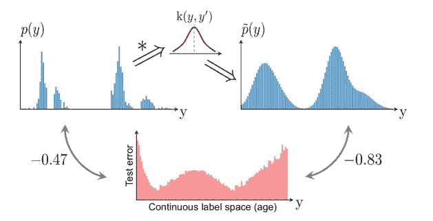

*Figure 2\. Label distribution smoothing (LDS) convolves a symmetric kernel with the empirical label density to estimate the effective label density distribution that accounts for the continuity of labels |* [*Source*](https://web.archive.org/web/20220926103213/https://arxiv.org/pdf/2102.09554.pdf)

LDS 使用核密度估计来学习对应于连续目标的数据集中的有效不平衡。准确地说，LDS 将对称核与经验密度分布进行卷积，以提取核平滑版本，该版本考虑了附近标签的数据样本信息中的重叠。

***注意**:高斯或拉普拉斯核是对称核。*

对称核表征了目标值 y’和 y’之间的相似性，以及它们在目标空间中的距离。

本节开头的图 2 显示了 LDS 捕获了影响回归的实际不平衡。通过应用 LDS，我们得到了与误差分布(-0.83)很好相关的标签密度分布。

一旦获得了有效的标签密度，就可以使用我们之前讨论过的用于解决不平衡分类的技术(即成本敏感的重新加权方法)。

特征分布平滑(FDS)

#### 上图显示了 30 岁(主播)的特征统计相似度。你可以马上注意到锚周围的箱子与锚高度相似，尤其是最近的那些。但是进一步研究该图，您会注意到数据样本非常少的地区(即 0-6 岁)存在一个问题。由于数据不平衡，平均值和方差显示了与 30 岁的不合理的高度相似性。

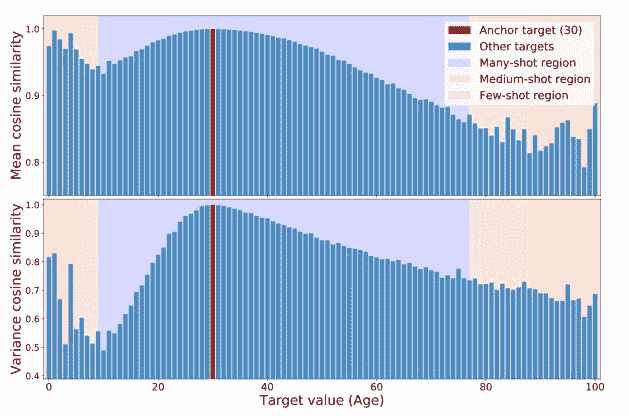

***Top****: Cosine similarity of the feature means at a particular age w.r.t its value at the anchor age.* ***Bottom****: Cosine similarity of the feature variance at a particular age w.r.t its value at the anchor age. The color of the background refers to data density in a particular target range |* [*Source*](https://web.archive.org/web/20220926103213/https://arxiv.org/pdf/2102.09554.pdf)

特征分布平滑(FDS)算法的[创造者](https://web.archive.org/web/20220926103213/https://arxiv.org/pdf/2102.09554.pdf)受到这些观察的启发，提出了这种算法，该算法在特征空间上执行分布平滑，或者换句话说，在附近的目标箱之间传输特征统计。从而校准特征分布的潜在有偏估计，特别是对于训练数据中未充分表示的目标值。

FDS 的一个伟大之处在于，您可以通过在最终特征地图后插入特征校准层，将其集成到深度神经网络中。

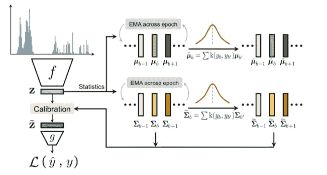

*Feature distribution smoothing (FDS) | [Source](https://web.archive.org/web/20220926103213/https://arxiv.org/pdf/2102.09554.pdf)*

标杆管理

#### 使用各种算法在语义文本相似性基准(STS-B-DIR)数据集上报告了结果。

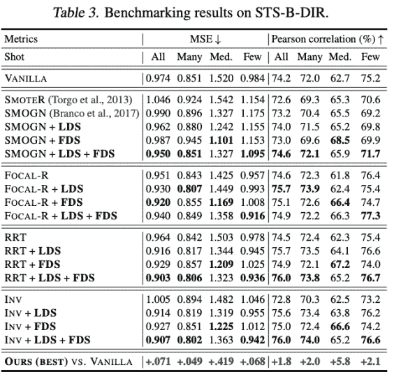

*Benchmarking results on STS-B-DIR | [Source](https://web.archive.org/web/20220926103213/https://arxiv.org/pdf/2102.09554.pdf)*

作者表明，当 LDS 和 FDS 与其他现有方法相结合来处理不平衡数据的回归时，可以显著提高性能[【4】](https://web.archive.org/web/20220926103213/https://arxiv.org/pdf/2102.09554.pdf)。

不平衡回归的性能度量

### 当谈到这类问题的评估指标时，您可以使用常见的回归指标，如 MAE、MSE、Pearson、几何平均(GM)以及我们在本节中探讨的技术。

开发不平衡回归的新方法时需要解决的关键问题

### 开发对成本敏感的回归解决方案，使成本适应稀有观测的重要程度。为了在预测不同重要性的罕见事件时有更大的灵活性，调查使成本不仅适用于少数群体而且适用于每个个体观察的可能性将是相当有趣的。

*   必须提出能够区分少数样本和噪声样本的方法。
*   开发更好的集成学习方法，如在分类中，可以在对偏斜分布的鲁棒性和预测能力方面提供显著的改进。
*   结论

## 规范的 ML 算法假设所考虑的类中的对象数量大致相似。然而，在我们可以应用 ML 的许多现实生活问题中，实例的分布是偏斜的，因为我们最关心并想要预测的事件很少发生，并且在大多数情况下，我们收集代表正常状态和多数群体的正常事件的数据点。这对学习算法造成了困难，因为它们会偏向多数群体。

但是在本文中，您了解了从不平衡分类和回归数据中学习的不同方法。

感谢您的阅读！和往常一样，我有一个经过充分研究的参考部分，你可以用它来更深入地阅读下面的内容，还有一个 [colab 笔记本](https://web.archive.org/web/20220926103213/https://colab.research.google.com/drive/10gViloq5Wet40P1fod2MxYYCo8ou4Yg1#scrollTo=mp8WOh3Zj9wS)。

参考

### 卡努马王子

### Neptune . ai
ML/DL 开发者倡导者我想通过技术帮助人们。因为这个目的，我喜欢运用我的技术和分析能力来解决具有挑战性的问题，并与你，我的读者，分享我的一点知识和经验。

**阅读下一篇**

* * *

利用机器学习项目改善工作流程的最佳 7 种数据版本控制工具

## 5 分钟阅读| Jakub Czakon |年 10 月 20 日更新

5 mins read | Jakub Czakon | Updated October 20th, 2021

跟踪所有用于模型和实验的数据并不容易。这需要很多时间，而且不仅仅是管理和跟踪文件。你需要确保每个人都在同一个页面上，并同时跟踪最新版本的变化。

使用正确的软件，你可以毫不费力地做到这一点！一个好的数据版本控制工具可以让你拥有一个统一的数据集和一个强大的实验库。

它还将实现所有团队成员之间的顺畅协作，因此每个人都可以实时跟踪变化，并始终知道发生了什么。

这是系统化数据版本控制、改进工作流程和最小化出错风险的好方法。

因此，请查看这些用于数据版本控制的顶级工具，它们可以帮助您实现工作自动化并优化流程。

如果您关心可再现性、可追溯性和 ML 模型血统，那么数据版本化工具对您的工作流程至关重要。

它们帮助您获得一个工件的版本，一个数据集或模型的散列，您可以在以后使用它来识别和比较。通常，您会将此数据版本记录到您的元数据管理解决方案中，以确保您的模型训练是版本化的和可重复的。

如何选择数据版本化工具？

## 要为您的工作流选择合适的数据版本化工具，您应该检查:

**支持您的数据形态**:它是如何支持视频/音频的？它是否为表格数据提供了一些预览？

*   易用性:在你的工作流程中使用起来有多容易？它给你的执行增加了多少开销？
*   **Diff and compare** :可以比较数据集吗？你能看到你的图像目录的不同吗？
*   **它与您的堆栈配合得如何**:您能否轻松连接到您的基础设施、平台或模型培训工作流？
*   **你能让你的团队参与进来吗**:如果你的团队不采用它，工具再好也没用。所以，记住你的队友的技能和偏好。
*   这里有一些值得探索的工具。

Here’re are a few tools worth exploring.

[Continue reading ->](/web/20220926103213/https://neptune.ai/blog/best-data-version-control-tools)

* * ***