# 如何实现客户流失预测【程序员机器学习指南】

> 原文：<https://web.archive.org/web/https://neptune.ai/blog/how-to-implement-customer-churn-prediction>

当谈到机器学习的有用商业应用时，没有比[客户流失预测](https://web.archive.org/web/20230227045312/https://www.kdnuggets.com/2019/05/churn-prediction-machine-learning.html)更好的了。这是一个你通常有大量高质量、新鲜的数据要处理的问题，它相对简单，解决它可以是增加利润的一个很好的方法。

流失率是衡量客户满意度的关键指标。低流失率意味着快乐的顾客；高流失率意味着客户会离开你。随着时间的推移，每月/每季度的客户流失率会有所下降。1%的月流失率很快就转化为近 12%的年流失率。

[据福布斯](https://web.archive.org/web/20230227045312/https://www.forbes.com/sites/jiawertz/2018/09/12/dont-spend-5-times-more-attracting-new-customers-nurture-the-existing-ones/?sh=badf6205a8e0)报道，获得新客户比保持现有客户需要更多的钱(最多五倍)。客户流失告诉你有多少现有客户正在离开你的企业，因此降低客户流失对你的收入流有很大的积极影响。

客户流失是增长潜力的一个很好的指标。流失率跟踪失去的客户，增长率跟踪新客户—比较和分析这两个指标可以准确地告诉您随着时间的推移，您的业务增长了多少。如果增长率高于流失率，你可以说你的业务在增长。如果流失率高于增长率，你的企业就越来越小。

在本文中，我们将深入探讨客户流失率，并实现一个机器学习客户流失率预测系统的示例。

## 流失率是多少？

维基百科称,“流失率”(也称为损耗率)衡量的是在特定时期内从一个集体群体中移出的个人或物品的数量。它适用于许多情况，但对流失率的主流理解与停止从你这里购买的客户的业务案例有关。

软件即服务(SaaS)凭借其基于订阅的业务模式和基于会员制的业务，处于创新型客户维系战略的前沿。分析这一领域的增长可能涉及跟踪指标(如收入、新客户比率等。)，进行客户细分分析，预测终身价值。流失率是客户终身价值建模的一个输入，指导对与客户的整个未来关系贡献的净利润的估计。独立地，它计算在给定的时间框架内客户对服务或产品的订阅的不连续性的百分比。

这转化为因客户取消而造成的收入损失。市场饱和在 SaaS 市场相当明显，任何 SaaS 产品总是有大量的替代品。研究流失率有助于了解你的客户(KYC)和订阅驱动型企业的有效保留和营销策略。

杰夫·贝索斯曾经说过:“*我们把顾客视为聚会的客人，而我们是主人。我们每天的工作就是让客户体验的每个重要方面都变得更好*。提高客户保持率是一个持续的过程，了解流失率是朝着正确方向迈出的第一步。

您可以将客户流失分为:

1.  **客户和收入流失**
2.  **自愿和非自愿流失**

**客户和收入流失:**客户流失就是客户取消订阅的比率。也称为用户流失或徽标流失，其价值以百分比表示。另一方面，收入流失是月初你每月经常性收入(MRR)的损失。客户流失和收入流失并不总是一样的。你可能没有客户流失，但如果客户降级订阅，仍然有收入流失。负流失率是一种理想情况，仅适用于收入流失率。来自现有客户的新收入(通过交叉销售、追加销售和新注册)比你因取消和降级而损失的收入要多。


**自愿和非自愿流失:**自愿流失是指客户决定取消并采取必要措施退出服务。这可能是因为不满意，或者没有得到他们期望的价值。非自愿流失的发生是由于诸如付款细节过期、服务器错误、资金不足和其他不可预测的困境等情况。

客户满意度、幸福感和忠诚度可以在一定程度上实现，但客户流失将永远是业务的一部分。客户流失可能是因为:

*   糟糕的客户服务(服务质量、回复率或整体客户体验差)，
*   财务问题(费用和费率)，
*   客户需求变化，
*   不满意(你的服务没有达到预期)，
*   顾客看不到价值，
*   客户转向竞争对手，
*   长期客户不会感到被欣赏。

0%的流失率是不可能的。诀窍是始终保持尽可能低的流失率。

## 客户流失预测的重要性

流失率的影响显而易见，因此我们需要降低流失率的策略。预测客户流失是针对即将流失的客户开展主动营销活动的好方法。

多亏了大数据，在机器学习的帮助下预测客户流失成为可能。机器学习和数据分析是识别和预测客户流失的强大方法。在客户流失预测过程中，您还会:

*   识别有风险的客户，
*   识别客户的棘手问题，
*   确定降低客户流失率和增加客户保持率的策略/方法。

## 构建有效客户流失模型的挑战

以下是可能使您难以建立有效客户流失模型的主要挑战:

*   不准确或混乱的客户数据，
*   弱摩擦探索性分析，
*   缺乏信息和领域知识，
*   缺乏对合适的流失建模方法的一致选择，
*   选择验证流失模型性能的指标，
*   服务或产品的业务线(LoB ),
*   搅动事件审查，
*   基于驱动客户流失的客户行为模式变化的概念漂移，
*   不平衡数据(阶级不平衡问题)。

## 流失预测用例

基于公司的业务线(LoB)、运营工作流程和数据架构，客户流失预测是不同的。预测模型和应用程序必须适合公司的需求、目标和期望。流失预测的一些使用案例包括:

*   电信(有线或无线网段)，
*   软件即服务提供商(SaaS)，
*   零售市场，
*   基于订阅的业务(媒体、音乐和视频流服务等。),
*   金融机构(银行、保险公司、抵押公司等。),
*   营销，
*   人力资源管理(员工流动)。

## 设计流失预测工作流程

构建 ML 驱动的应用程序以预测客户流失的总体范围是标准化 ML 项目结构的一般范围，包括以下步骤:

1.  **定义问题和目标**:了解你需要从分析和预测中获得什么样的洞察力是至关重要的。理解问题并收集需求、涉众的痛点和期望。
2.  **建立数据源:**接下来，指定建模阶段所需的数据源。一些流行的客户流失数据来源是 CRM 系统、分析服务和客户反馈。
3.  **数据准备、探索和预处理:**用于解决问题和建立预测模型的原始历史数据需要转换成适合机器学习算法的格式。这一步骤还可以通过提高数据质量来改善总体结果。
4.  **建模和测试:**这涵盖了使用各种机器学习算法的客户流失预测模型的开发和性能验证。
5.  **部署和监控:**这是应用机器学习进行流失率预测的最后阶段。在这里，最合适的模型被投入生产。它既可以集成到现有软件中，也可以成为新构建的应用程序的核心。

## 深度挖掘:电信客户流失预测系统用例

流失率在电信行业(无线和有线服务提供商、卫星电视提供商、互联网提供商等)非常重要。此用例中的流失率提供了业务质量的清晰度，显示了客户对产品或服务的满意度，并允许与竞争对手进行比较，以衡量可接受的流失率水平。

### 关于数据集

示例数据跟踪一个虚构的电信公司 Telco。这是来自 IBM 开发者平台的客户流失数据，在这里可以得到。它包括一个目标标签，指示客户是否在上个月离开，以及其他相关功能，包括人口统计、每个客户已注册的服务和客户帐户信息。它有 7043 个客户的数据，有 20 个特征。

***你可以在我的 Github*** ***上找到这个整个项目*** [***。***](https://web.archive.org/web/20230227045312/https://github.com/codebrain001/customer-churn-prediction)

### 探索性数据分析

让我们批判性地探索数据，以发现模式并可视化特征如何与标签交互(是否流失)。

让我们首先为 EDA 导入库，加载数据，并打印前五行:

```py
import numpy as np 
import pandas as pd 
pd.set_option('display.max_columns', None)

import plotly.express as px 
import matplotlib.pyplot as plt 

data_df = pd.read_csv("../data/churn.csv")

def dataoveriew(df, message):
    print(f'{message}:n')
    print('Number of rows: ', df.shape[0])
    print("nNumber of features:", df.shape[1])
    print("nData Features:")
    print(df.columns.tolist())
    print("nMissing values:", df.isnull().sum().values.sum())
    print("nUnique values:")
    print(df.nunique())

dataoveriew(data_df, 'Overview of the dataset')

```


数据集有 7043 行和 21 列。

有 17 个分类特征:

*   CustomerID:每个客户的唯一客户 ID
*   性别:顾客是男性还是女性
*   老年人:客户是否是老年人(1，0)
*   合作伙伴:客户是否有合作伙伴(是，否)
*   受抚养人:客户是否有受抚养人(是，否)
*   电话服务:客户是否有电话服务(是，否)
*   多线路:客户是否有多条线路(是，否，无电话服务)
*   互联网服务:客户的互联网服务提供商(DSL、光纤、否)
*   在线安全:客户是否有在线安全(是，否，没有互联网服务)
*   OnlineBackup:客户是否有在线备份(是，否，无互联网服务)
*   设备保护:客户是否有设备保护(是，否，无互联网服务)
*   技术支持:客户是否有技术支持(是，否，无互联网服务)
*   流媒体电视:客户是否有流媒体电视(是，否，无互联网服务)
*   流媒体电影:客户是否有流媒体电影(是，否，无互联网服务)
*   合同:客户的合同期限(逐月、一年、两年)
*   无纸账单:客户的合同期限(逐月、一年、两年)
*   付款方式:客户的付款方式(电子支票、邮寄支票、银行转帐(自动)、信用卡(自动))

接下来，有 3 个数字特征:

*   任期:客户在公司工作的月数
*   每月费用:每月向客户收取的金额
*   总费用:向客户收取的总额

最后，还有一个预测功能:

*   客户流失:客户是否流失(是或否)

这些功能还可以细分为:

*   人口统计客户信息:
    *   性别、老年人、伴侣、受抚养人
*   每位客户已注册的服务:
    *   电话服务，多线路，互联网服务，在线安全，在线备份，设备保护，技术支持，流媒体电视，流媒体电影，
*   客户账户信息:
    *   任期，合同，无纸账单，付款方式，月费，总费用

**让我们探索一下目标变量。**

```py
target_instance = data_df["Churn"].value_counts().to_frame()
target_instance = target_instance.reset_index()
target_instance = target_instance.rename(columns={'index': 'Category'})
fig = px.pie(target_instance, values='Churn', names='Category', color_discrete_sequence=["green", "red"],
             title='Distribution of Churn')
fig.show()

```


*Output plot of distribution of churn rate*

我们试图预测上个月离开公司的用户。这是一个目标不平衡的二元分类问题。

*   流失率:否–73.5%
*   客户流失率:是–26.5%

让我们探索分类特征。

```py
def bar(feature, df=data_df ):

    temp_df = df.groupby([feature, 'Churn']).size().reset_index()
    temp_df = temp_df.rename(columns={0:'Count'})

    value_counts_df = df[feature].value_counts().to_frame().reset_index()
    categories = [cat[1][0] for cat in value_counts_df.iterrows()]

    num_list = [num[1][1] for num in value_counts_df.iterrows()]
    div_list = [element / sum(num_list) for element in num_list]
    percentage = [round(element * 100,1) for element in div_list]

    def num_format(list_instance):
        formatted_str = ''
        for index,num in enumerate(list_instance):
            if index < len(list_instance)-2:
                formatted_str=formatted_str+f'{num}%, ' 
            elif index == len(list_instance)-2:
                formatted_str=formatted_str+f'{num}% & '
            else:
                formatted_str=formatted_str+f'{num}%'
        return formatted_str

    def str_format(list_instance):
        formatted_str = ''
        for index, cat in enumerate(list_instance):
            if index < len(list_instance)-2:
                formatted_str=formatted_str+f'{cat}, '
            elif index == len(list_instance)-2:
                formatted_str=formatted_str+f'{cat} & '
            else:
                formatted_str=formatted_str+f'{cat}'
        return formatted_str

    num_str = num_format(percentage)
    cat_str = str_format(categories)

    fig = px.bar(temp_df, x=feature, y='Count', color='Churn', title=f'Churn rate by {feature}', barmode="group", color_discrete_sequence=["green", "red"])
    fig.add_annotation(
                text=f'Value count of distribution of {cat_str} are<br>{num_str} percentage respectively.',
                align='left',
                showarrow=False,
                xref='paper',
                yref='paper',
                x=1.4,
                y=1.3,
                bordercolor='black',
                borderwidth=1)
    fig.update_layout(

        margin=dict(r=400),
    )

    return fig.show()

```

现在，让我们画出人口统计特征。

```py
bar('gender')

data_df.loc[data_df.SeniorCitizen==0,'SeniorCitizen'] = "No"   
data_df.loc[data_df.SeniorCitizen==1,'SeniorCitizen'] = "Yes"  
bar('SeniorCitizen')

bar('Partner')

bar('Dependents')

```

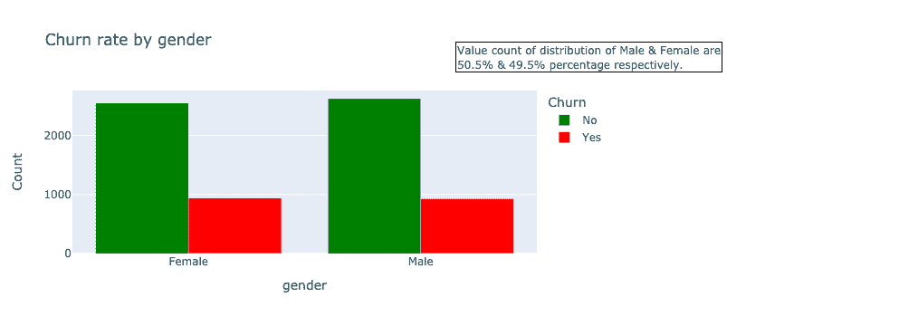

*Output plot of the distribution of churn rate by gender*

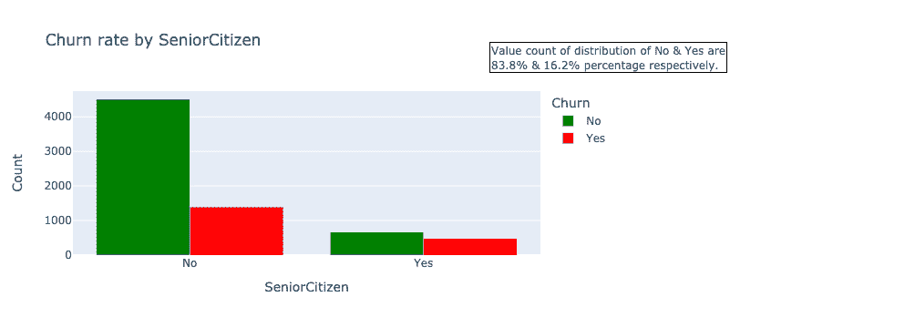

*Output plot of the distribution of churn rate by senior citizen*

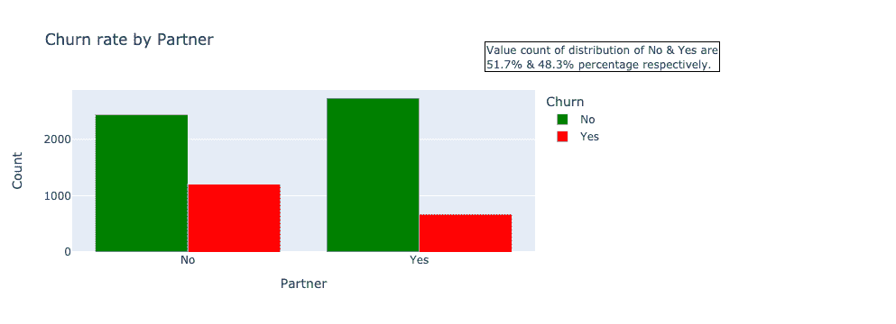

*Output plot of the distribution of churn rate by partner*

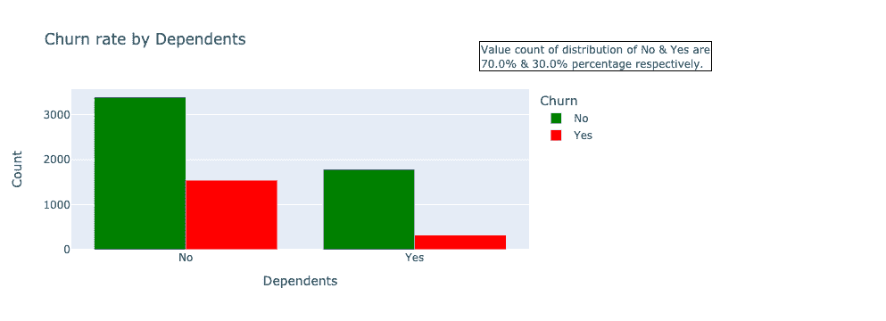

*Output plot of the distribution of churn rate by dependents*

**人口统计分析洞察:**性别和伴侣以大致的百分比值均匀分布。女性客户流失的差异略高，但这种微小的差异可以忽略不计。年轻客户(老年人=否)、没有伴侣的客户和没有家属的客户的流失率更高。数据的人口统计部分强调了没有伴侣和受抚养人的 30 岁以上的老年人是可能流失的特定客户群.

接下来，我们来了解一下每位客户已经注册的服务。

```py
bar('PhoneService')
bar('MultipleLines')
bar('InternetService')
bar('OnlineSecurity')
bar('OnlineBackup')
bar('DeviceProtection')
bar('TechSupport')
bar('StreamingTV')
bar('StreamingMovies')

```

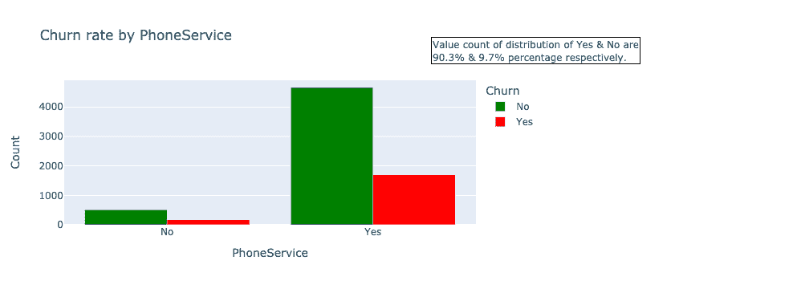

*Output plot of the distribution of churn rate by phone service*

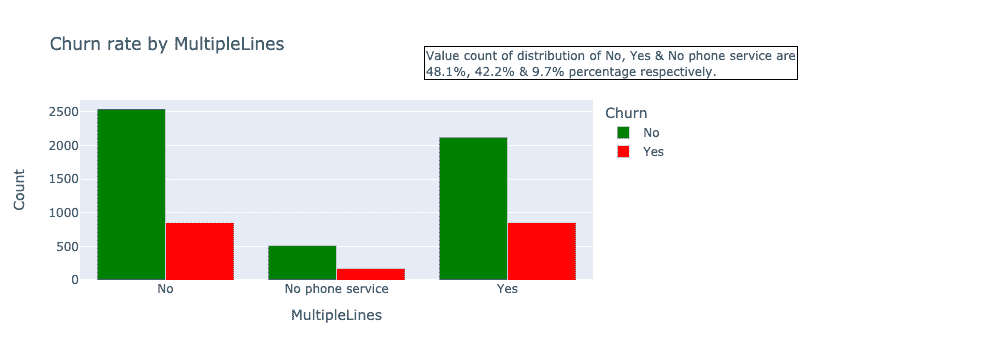

Output plot of the distribution churn rate by multiple lines

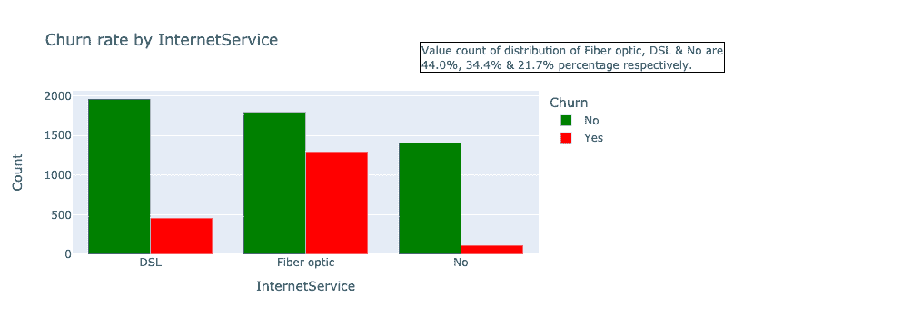

*Output plot of the distribution churn rate by internet service*


*Output plot of the distribution of churn rate by online security service*

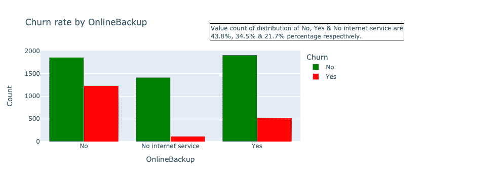

*Output plot of the distribution of churn rate by online backup service*


*Output plot of the distribution of churn rate by device protection service*

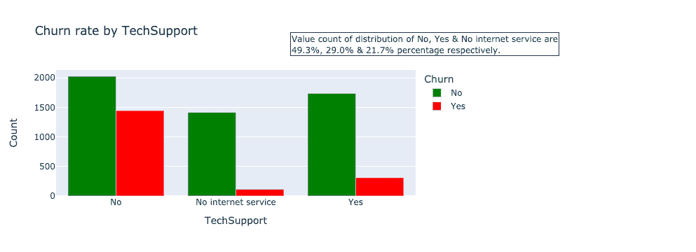

*Output plot of the distribution of churn rate by technology support service*


Output plot of the distribution of churn rate by streaming TV service

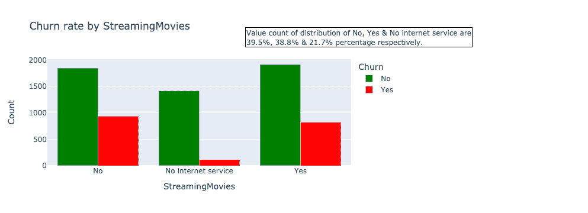

*Output plot of the distribution of churn rate by streaming movies *

**每位客户已签约 insight 的服务:**这些特性显示了他们价值观的显著差异。如果客户没有电话服务，他们就不能有多条线路。约 90.3%的客户拥有电话服务，客户流失率较高。将光纤作为互联网服务的客户更有可能流失。这可能是由于高价格、竞争、客户服务和许多其他原因造成的。光纤服务比 DSL 贵很多，这可能是客户流失的原因之一。拥有在线安全、在线备份、设备保护和技术支持的客户更不可能流失。流媒体服务无法预测客户流失，因为它平均分布在是和否选项中。

是时候探索支付功能了。

```py
bar('Contract')
bar('PaperlessBilling')
bar('PaymentMethod')

```

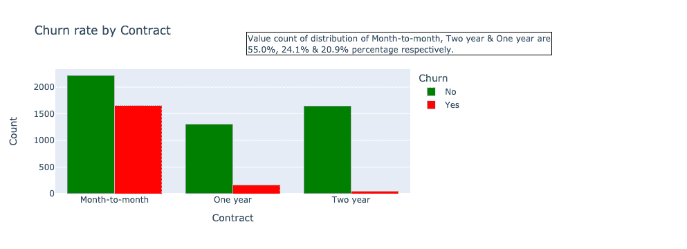

*Output plot of the distribution of churn rate by contract*

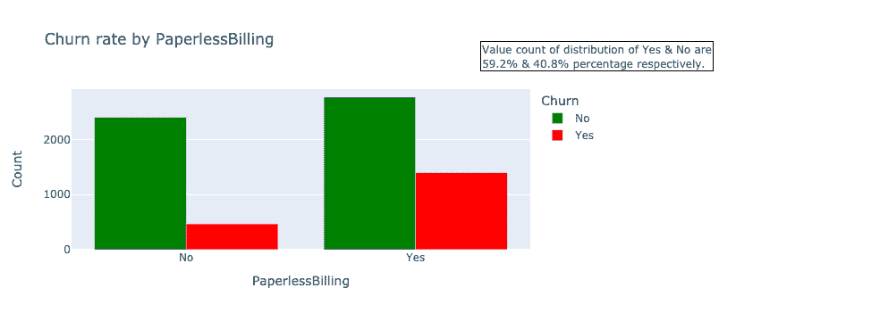

*Output plot of the distribution of churn rate by paperless billing*

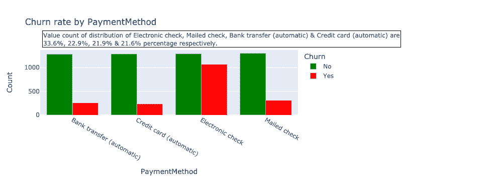

*Output plot of the distribution of churn rate by payment methods*

**支付洞察:**合同越短，流失率越高。那些有更多延期计划的人在提前取消时会面临额外的障碍。这清楚地解释了公司与其客户建立长期关系的动机。选择无纸化计费的客户流失率更高。约 59.2%的客户使用无纸化计费。使用电子支票支付的客户更容易流失，这种支付方式比其他支付类型更常见。

现在，让我们探索数字特征。

```py
Data_df.dtypes

```

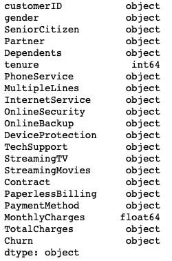

**可以观察到**total charges 具有对象数据类型，这意味着它包含字符串组件。我们来换算一下。

```py
try:
    data_df['TotalCharges'] = data_df['TotalCharges'].astype(float)
except ValueError as ve:
    print (ve)

```


**这表示一些**空值被存储为空白。让我们将该特征转换为数字格式，同时将这些空字符串空间等同为 NaN，如下所示:

```py
data_df['TotalCharges'] = pd.to_numeric(data_df['TotalCharges'],errors='coerce')

data_df['TotalCharges'] = data_df['TotalCharges'].fillna(data_df['TotalCharges'].median())

```

**接下来，让我们绘制所有数字特征的直方图**来了解分布情况。

```py
def hist(feature):
    group_df = data_df.groupby([feature, 'Churn']).size().reset_index()
    group_df = group_df.rename(columns={0: 'Count'})
    fig = px.histogram(group_df, x=feature, y='Count', color='Churn', marginal='box', title=f'Churn rate frequency to {feature} distribution', color_discrete_sequence=["green", "red"])
    fig.show()

```

**对数字特征运行功能**,如下所示:

```py
hist('tenure')
hist('MonthlyCharges')
hist('TotalCharges')

```


*Output plot of the histogram on tenure with respect to churn rate*

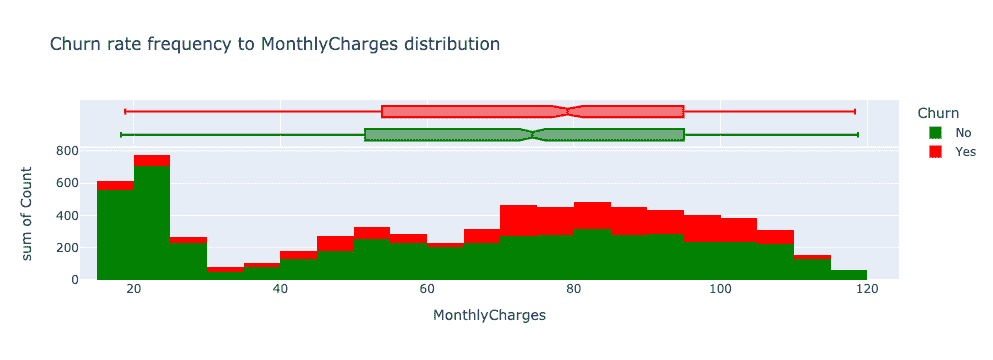

*Output plot of the histogram on monthly charges with respect to churn rate*

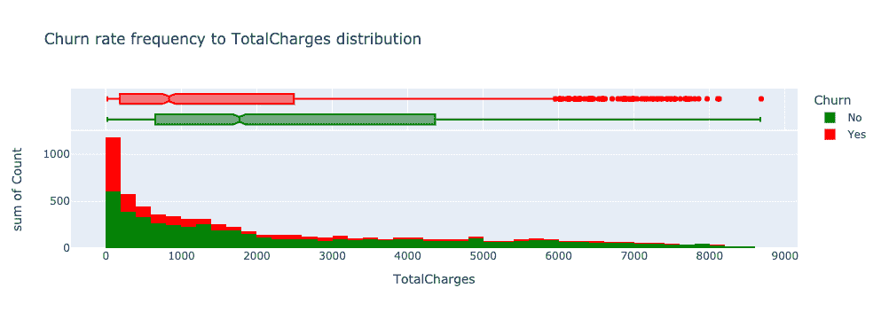

*Output plot of the histogram on total charges with respect to churn rate*

**客户账户信息洞察:**任期直方图是正确倾斜的，显示大多数客户只在最初几个月(0-9 个月)与电信公司合作。流失率最高的也是最初几个月(0-9 个月)。75%最终离开电信公司的客户都是在头 30 个月内离开的。月费柱状图显示月费越高的客户流失率越高。这表明折扣和促销可能是吸引顾客留下来的一个原因。

让我们根据分位数将数字特征分成三个部分(低、中和高，以便从中获得更多信息)。

```py
bin_df = pd.DataFrame()

bin_df['tenure_bins'] =  pd.qcut(data_df['tenure'], q=3, labels= ['low', 'medium', 'high'])
bin_df['MonthlyCharges_bins'] =  pd.qcut(data_df['MonthlyCharges'], q=3, labels= ['low', 'medium', 'high'])
bin_df['TotalCharges_bins'] =  pd.qcut(data_df['TotalCharges'], q=3, labels= ['low', 'medium', 'high'])
bin_df['Churn'] = data_df['Churn']

bar('tenure_bins', bin_df)
bar('MonthlyCharges_bins', bin_df)
bar('TotalCharges_bins', bin_df)

```

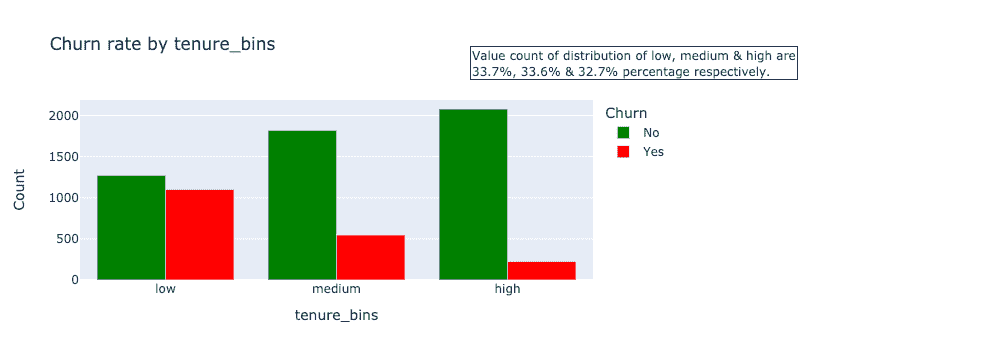

*Output plot of the distribution of churn rate by binned tenure*

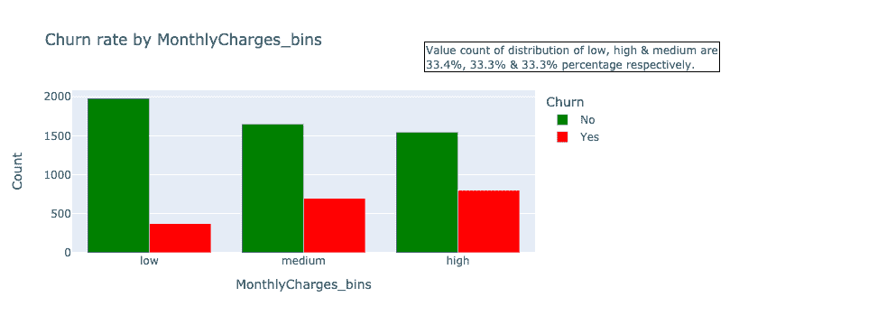

*Output plot of the distribution of churn rate by binned monthly charges*

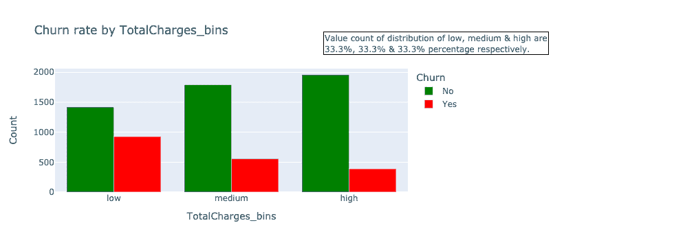

*Output plot of the distribution of churn rate by binned total charges*

根据宁滨，低任期和高每月收费箱有更高的流失率，正如前面的分析所支持的。同时，总费用低的仓位流失率较高。

### 数据预处理

在本节中，我们将获得更多见解，并将数据转换为适合各种机器学习算法的数据表示。

```py
data_df.drop(["customerID"],axis=1,inplace = True)

def binary_map(feature):
    return feature.map({'Yes':1, 'No':0})

data_df['Churn'] = data_df[['Churn']].apply(binary_map)

data_df['gender'] = data_df['gender'].map({'Male':1, 'Female':0})

binary_list = ['SeniorCitizen', 'Partner', 'Dependents', 'PhoneService', 'PaperlessBilling']
data_df[binary_list] = data_df[binary_list].apply(binary_map)

data_df = pd.get_dummies(data_df, drop_first=True)

```

**我们来看看数值之间的相关性**。

```py
corr = data_df.corr()

fig = px.imshow(corr,width=1000, height=1000)
fig.show()

```

[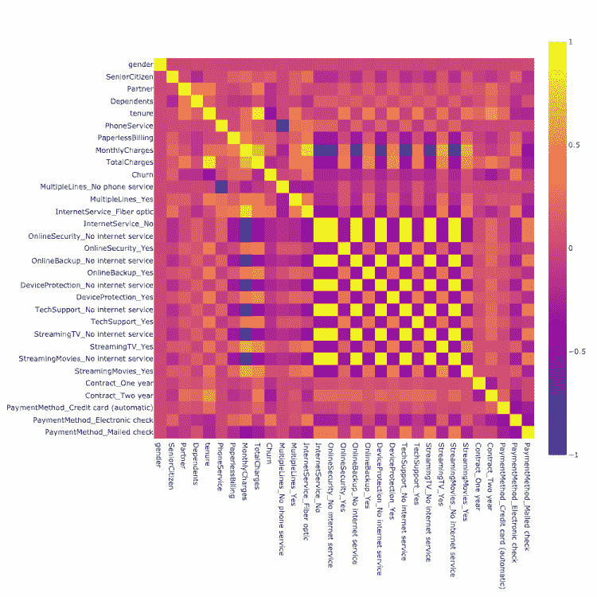](https://web.archive.org/web/20230227045312/https://i0.wp.com/neptune.ai/wp-content/uploads/2022/10/Customer-churn-correlation.png?ssl=1)

*Output plot of the correlation matrix of numeric features*

相关性衡量两个变量之间的线性关系。相关性高的特征更具线性相关性，对因变量的影响几乎相同。所以，当两个特征高度相关时，我们可以去掉其中一个。在我们的情况下，我们可以放弃高度相关的功能，如多线、在线安全、在线备份、设备保护、技术支持、流媒体电视和流媒体电影。

客户流失预测是一个二元分类问题，因为在给定的时间段内，客户要么流失，要么被保留。需要回答两个问题来指导模型的建立:

1.  哪些特性让客户流失或保留？
2.  培养一个高性能的模型最重要的特征是什么？

让我们使用广义线性模型(GLM)来获得目标各自特征的一些统计数据。

```py
import statsmodels.api as sm
import statsmodels.formula.api as smf

all_columns = [column.replace(" ", "_").replace("(", "_").replace(")", "_").replace("-", "_") for column in data_df.columns]

data_df.columns = all_columns

glm_columns = [e for e in all_columns if e not in ['customerID', 'Churn']]
glm_columns = ' + '.join(map(str, glm_columns))

glm_model = smf.glm(formula=f'Churn ~ {glm_columns}', data=data_df, family=sm.families.Binomial())
res = glm_model.fit()
print(res.summary())

```

[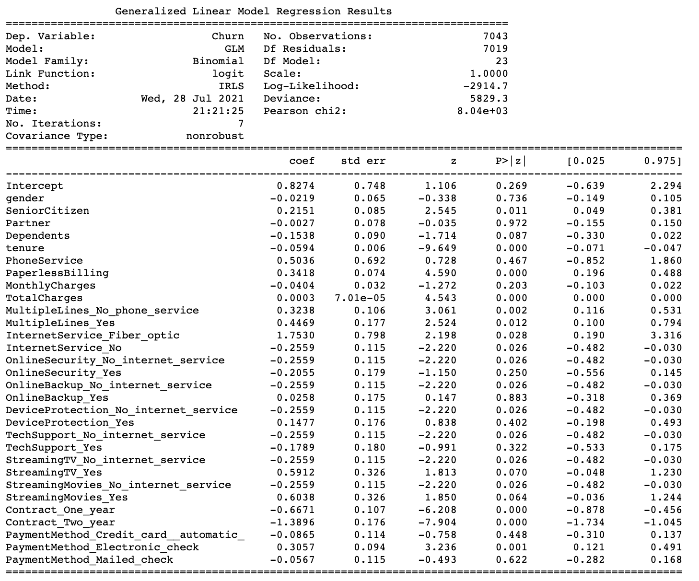](https://web.archive.org/web/20230227045312/https://lh4.googleusercontent.com/8POzHCVHRyFB6vWkTYQoNOKpFn_uTXG3DT0q5DlGXyDYNwQRhD57X6QHWAXRO-OK719xkkwPHuMOcGxhaBzSq0TbTGnapidBuE9IZA392HfWqQsn-d4UJ8xz4W977qWTraeG3dpS)

对于第一个问题，您应该查看(P>|z|)列。如果绝对 **p 值**小于 0.05，则意味着该特性以统计显著的方式影响客户流失。例如:

*   老年人
*   任期
*   合同
*   无纸账单等。

关于特征重要性的第二个问题可以通过查看指数系数值来回答。指数系数通过一个单位的变化来估计给定特征的预期流失变化。

```py
np.exp(res.params)
```

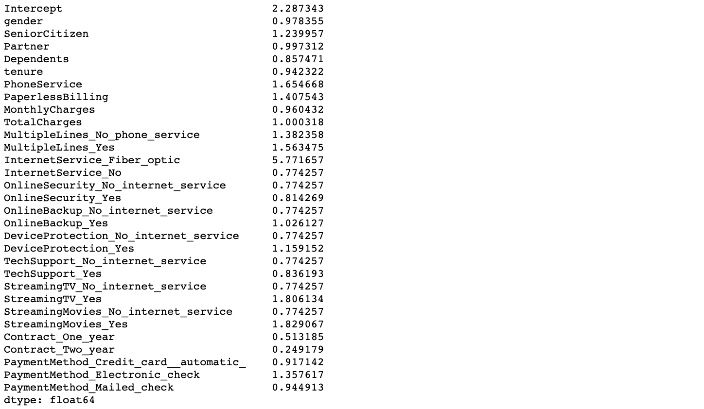

这将输出奇数比率。大于 1 的值表示流失增加。小于 1 的值表示客户流失较少。

所有要素的范围应进行归一化，以便每个要素对最终距离的贡献大致成比例，因此我们进行要素缩放。

```py
from sklearn.preprocessing import MinMaxScaler
sc = MinMaxScaler()
data_df['tenure'] = sc.fit_transform(data_df[['tenure']])
data_df['MonthlyCharges'] = sc.fit_transform(data_df[['MonthlyCharges']])
data_df['TotalCharges'] = sc.fit_transform(data_df[['TotalCharges']])

```

让我们开始用逻辑回归算法创建一个基线模型，然后用其他机器学习模型进行预测，如支持向量分类器(SVC)、随机森林分类器、决策树分类器和朴素贝叶斯分类器。

```py
from sklearn.linear_model import LogisticRegression
from sklearn.svm import SVC
from sklearn.ensemble import RandomForestClassifier
from sklearn.tree import DecisionTreeClassifier
from sklearn.naive_bayes import GaussianNB

from sklearn.metrics import accuracy_score, precision_score, recall_score, f1_score

from sklearn.model_selection import train_test_split
X = data_df.drop('Churn', axis=1)
y = data_df['Churn']
X_train, X_test, y_train, y_test = train_test_split(X, y, test_size=0.3, random_state=50)

def modeling(alg, alg_name, params={}):
    model = alg(**params) 
    model.fit(X_train, y_train)
    y_pred = model.predict(X_test)

    def print_scores(alg, y_true, y_pred):
        print(alg_name)
        acc_score = accuracy_score(y_true, y_pred)
        print("accuracy: ",acc_score)
        pre_score = precision_score(y_true, y_pred)
        print("precision: ",pre_score)
        rec_score = recall_score(y_true, y_pred)
        print("recall: ",rec_score)
        f_score = f1_score(y_true, y_pred, average='weighted')
        print("f1_score: ",f_score)

    print_scores(alg, y_test, y_pred)
    return model

log_model = modeling(LogisticRegression, 'Logistic Regression')

```

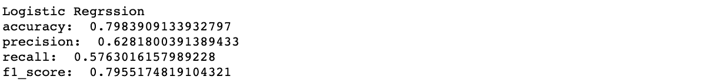

**接下来，我们进行特征选择**以使机器学习算法能够更快地训练，降低模型复杂性，增加可解释性，并且如果选择了正确的特征子集，则提高模型准确性。

```py
from sklearn.feature_selection import RFECV
from sklearn.model_selection import StratifiedKFold
log = LogisticRegression()
rfecv = RFECV(estimator=log, cv=StratifiedKFold(10, random_state=50, shuffle=True), scoring="accuracy")
rfecv.fit(X, y)

```


```py
plt.figure(figsize=(8, 6))
plt.plot(range(1, len(rfecv.grid_scores_)+1), rfecv.grid_scores_)
plt.grid()
plt.xticks(range(1, X.shape[1]+1))
plt.xlabel("Number of Selected Features")
plt.ylabel("CV Score")
plt.title("Recursive Feature Elimination (RFE)")
plt.show()

print("The optimal number of features: {}".format(rfecv.n_features_))

```

```py
X_rfe = X.iloc[:, rfecv.support_]

print(""X" dimension: {}".format(X.shape))
print(""X" column list:", X.columns.tolist())
print(""X_rfe" dimension: {}".format(X_rfe.shape))
print(""X_rfe" column list:", X_rfe.columns.tolist())

```

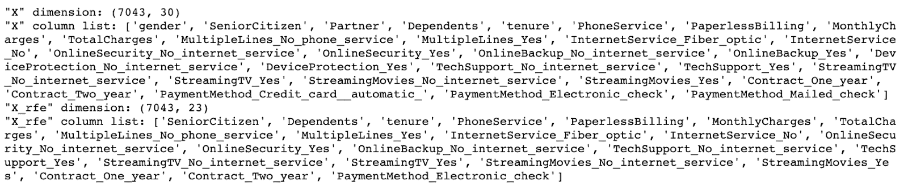

```py
<pre class="hljs" style="display: block; overflow-x: auto; padding: 0.5em; color: rgb(51, 51, 51); background: rgb(248, 248, 248);"><span class="hljs-comment" style="color: rgb(153, 153, 136); font-style: italic;"># Splitting data with optimal features</span>
X_train, X_test, y_train, y_test = train_test_split(X_rfe, y, test_size=<span class="hljs-number" style="color: teal;">0.3</span>, random_state=<span class="hljs-number" style="color: teal;">50</span>)

<span class="hljs-comment" style="color: rgb(153, 153, 136); font-style: italic;"># Running logistic regression model</span>
log_model = modeling(LogisticRegression, <span class="hljs-string" style="color: rgb(221, 17, 68);">'Logistic Regression Classification'</span>)
</pre>
```

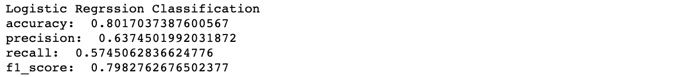

```py
svc_model = modeling(SVC, 'SVC Classification')

```

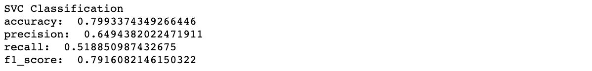

```py
rf_model = modeling(RandomForestClassifier, "Random Forest Classification")

```

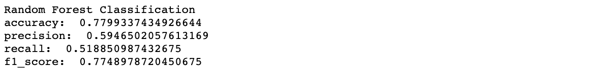

```py
dt_model = modeling(DecisionTreeClassifier, "Decision Tree Classification")

```

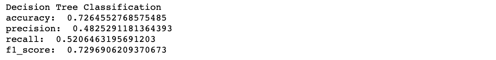

```py
nb_model = modeling(GaussianNB, "Naive Bayes Classification")

```

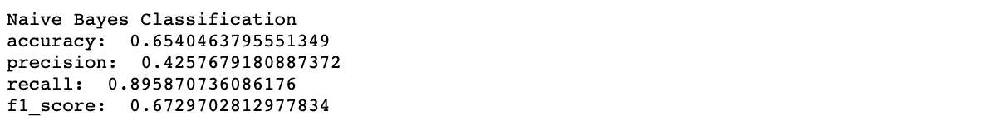

**在选定的绩效指标中，**逻辑回归算法在所有选定的指标中得分最高。它可以通过各种技术来改进，但是我们将通过超参数调整(随机搜索)来快速改进它。

```py

model = LogisticRegression()

from sklearn.model_selection import RepeatedStratifiedKFold
cv = RepeatedStratifiedKFold(n_splits=10, n_repeats=3, random_state=1)

from scipy.stats import loguniform
space = dict()
space['solver'] = ['newton-cg', 'lbfgs', 'liblinear']
space['penalty'] = ['none', 'l1', 'l2', 'elasticnet']
space['C'] = loguniform(1e-5, 1000)

from sklearn.model_selection import RandomizedSearchCV
search = RandomizedSearchCV(model, space, n_iter=500, scoring='accuracy', n_jobs=-1, cv=cv, random_state=1)

result = search.fit(X_rfe, y)

params = result.best_params_

log_model = modeling(LogisticRegression, 'Logistic Regression Classification', params=params)

```

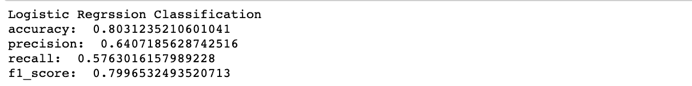

模型略有改进。让我们保存这个模型，并使用这个模型开始部署我们的客户流失预测应用程序。

```py
import joblib

filename = 'model.sav'
joblib.dump(log_model, filename)

```

### 部署

重要的是部署你的模型，以便可以从其他人(无论是用户、管理人员还是其他系统)可以使用的经过训练的 ML 模型中做出预测。在本节中，我们将使用 [Streamlit](https://web.archive.org/web/20230227045312/https://docs.streamlit.io/en/stable/#:~:text=Streamlit%20is%20an%20open%2Dsource,Python%203.6%20%2D%20Python%203.8%20installed.) 。这是**，一个开源的 Python 库**，它使得为机器学习和数据科学创建和分享漂亮的、定制的 web 应用变得容易。

要部署的应用程序将通过操作用例运行:

1.  **在线预测**:这个用例为每个数据点(在本文中是一个客户)逐个生成预测。
2.  **批量预测**:该用途用于即时生成一组观察值的预测。

部署脚本如下所示:

```py
import streamlit as st
import pandas as pd
import numpy as np
from PIL import Image

import joblib
model = joblib.load(r"./notebook/model.sav")

from preprocessing import preprocess

def main():

    st.title('Telco Customer Churn Prediction App')

    st.markdown("""
     :dart:  This Streamlit app is made to predict customer churn in a ficitional telecommunication use case.
    The application is functional for both online prediction and batch data prediction. n
    """)
    st.markdown("<h3></h3>", unsafe_allow_html=True)

    image = Image.open('App.jpg')
    add_selectbox = st.sidebar.selectbox(
    "How would you like to predict?", ("Online", "Batch"))
    st.sidebar.info('This app is created to predict Customer Churn')
    st.sidebar.image(image)

    if add_selectbox == "Online":
        st.info("Input data below")

        st.subheader("Demographic data")
        seniorcitizen = st.selectbox('Senior Citizen:', ('Yes', 'No'))
        dependents = st.selectbox('Dependent:', ('Yes', 'No'))
        st.subheader("Payment data")
        tenure = st.slider('Number of months the customer has stayed with the company', min_value=0, max_value=72, value=0)
        contract = st.selectbox('Contract', ('Month-to-month', 'One year', 'Two year'))
        paperlessbilling = st.selectbox('Paperless Billing', ('Yes', 'No'))
        PaymentMethod = st.selectbox('PaymentMethod',('Electronic check', 'Mailed check', 'Bank transfer (automatic)','Credit card (automatic)'))
        monthlycharges = st.number_input('The amount charged to the customer monthly', min_value=0, max_value=150, value=0)
        totalcharges = st.number_input('The total amount charged to the customer',min_value=0, max_value=10000, value=0)

        st.subheader("Services signed up for")
        mutliplelines = st.selectbox("Does the customer have multiple lines",('Yes','No','No phone service'))
        phoneservice = st.selectbox('Phone Service:', ('Yes', 'No'))
        internetservice = st.selectbox("Does the customer have internet service", ('DSL', 'Fiber optic', 'No'))
        onlinesecurity = st.selectbox("Does the customer have online security",('Yes','No','No internet service'))
        onlinebackup = st.selectbox("Does the customer have online backup",('Yes','No','No internet service'))
        techsupport = st.selectbox("Does the customer have technology support", ('Yes','No','No internet service'))
        streamingtv = st.selectbox("Does the customer stream TV", ('Yes','No','No internet service'))
        streamingmovies = st.selectbox("Does the customer stream movies", ('Yes','No','No internet service'))

        data = {
                'SeniorCitizen': seniorcitizen,
                'Dependents': dependents,
                'tenure':tenure,
                'PhoneService': phoneservice,
                'MultipleLines': mutliplelines,
                'InternetService': internetservice,
                'OnlineSecurity': onlinesecurity,
                'OnlineBackup': onlinebackup,
                'TechSupport': techsupport,
                'StreamingTV': streamingtv,
                'StreamingMovies': streamingmovies,
                'Contract': contract,
                'PaperlessBilling': paperlessbilling,
                'PaymentMethod':PaymentMethod,
                'MonthlyCharges': monthlycharges,
                'TotalCharges': totalcharges
                }
        features_df = pd.DataFrame.from_dict([data])
        st.markdown("<h3></h3>", unsafe_allow_html=True)
        st.write('Overview of input is shown below')
        st.markdown("<h3></h3>", unsafe_allow_html=True)
        st.dataframe(features_df)

        preprocess_df = preprocess(features_df, 'Online')

        prediction = model.predict(preprocess_df)

        if st.button('Predict'):
            if prediction == 1:
                st.warning('Yes, the customer will terminate the service.')
            else:
                st.success('No, the customer is happy with Telco Services.')

    else:
        st.subheader("Dataset upload")
        uploaded_file = st.file_uploader("Choose a file")
        if uploaded_file is not None:
            data = pd.read_csv(uploaded_file)

            st.write(data.head())
            st.markdown("<h3></h3>", unsafe_allow_html=True)

            preprocess_df = preprocess(data, "Batch")
            if st.button('Predict'):

                prediction = model.predict(preprocess_df)
                prediction_df = pd.DataFrame(prediction, columns=["Predictions"])
                prediction_df = prediction_df.replace({1:'Yes, the customer will terminate the service.',
                                                    0:'No, the customer is happy with Telco Services.'})

                st.markdown("<h3></h3>", unsafe_allow_html=True)
                st.subheader('Prediction')
                st.write(prediction_df)

if __name__ == '__main__':
        main()

```

**导入到应用脚本中的预处理脚本**可以在[这里](https://web.archive.org/web/20230227045312/https://github.com/codebrain001/customer-churn-prediction/blob/main/preprocessing.py)的项目报告中找到。

## 演示

## 结论

流失率是订阅型公司的一个重要指标。识别不满意的客户可以帮助经理识别产品或定价计划的弱点、运营问题以及客户的偏好和期望。当你知道了所有这些，就更容易引入主动减少流失的方法。