# 如何让您的 TensorBoard 项目易于共享和协作

> 原文：<https://web.archive.org/web/https://neptune.ai/blog/how-to-make-your-tensorboard-projects-easy-to-share-and-collaborate-on>

我们都知道团队合作是每个机器学习项目的重要组成部分。尽管每个工程师都有自己的项目工作，但他们仍然需要与团队分享他们的成果，并对合作持开放态度。

因此，在本文中，您将学习如何使您的 ML 项目易于共享和协作，以及使之成为可能的工具。

我们将重点关注 TensorFlow/Keras 框架，该框架被全球的机器学习工程师广泛接受。我们将探讨 [TensorBoard](https://web.archive.org/web/20221206012644/https://www.tensorflow.org/tensorboard) 的利弊，这是一种用于结果跟踪的基本工具。我们还会将其与更先进、更强大的竞争对手进行比较，看看他们能否帮助我们克服 TensorBoard 的局限性。

到本文结束时，您会知道:

*   为什么只需不到一分钟的时间就能与队友分享您的整个 ML 工作流程；
*   如何扩展可以共享的东西，开始记录和共享模型属性(参数、检查点)、输入数据、图像、度量、图表、硬件消耗等很多有趣的东西；
*   如果您的项目在 Jupyter 笔记本中，您如何共享和协作；
*   如何让您的同事访问您的实验运行结果，并让他们以编程方式下载您的项目结果、数据或模型属性，以便他们能够独立工作。

你想知道更多吗？拿起你的爆米花，继续阅读！

## 通过 TensorBoard 记录

回归基础总是好的，在我们的情况下，它是 tensor board——我们大多数人都喜欢使用的古老、但仍然可靠和方便的工具。

让我告诉你**这不会是另一篇关于 TensorBoard 及其功能**的 ~~无聊~~ **文章。我们都知道 TensorBoard 是什么。我不会再重复了。**

相反，我想分享我在 TensorBoard 工作中获得的经验和知识，并向您展示使用它的最佳案例以及局限性。

为了让它更有趣，我将把我的推理基于现实生活中的机器学习项目:让我们建立一个图像分类器，它告诉我们图像的方向输入。有四个选项可用，如下图所示:

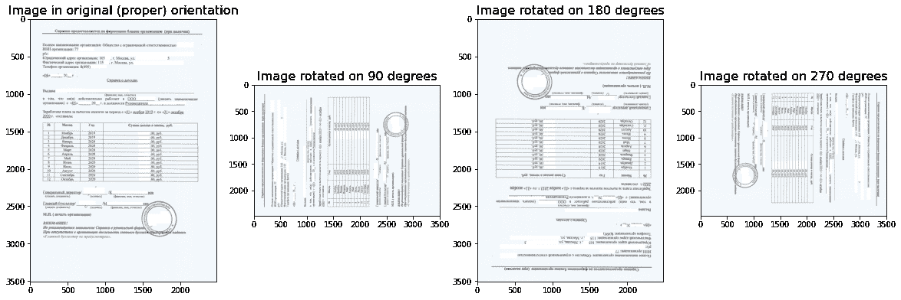

*Four potential orientation options of an image.
We want to build a classifier to predict orientation.*

我们有很多方法可以做到这一点。为了简单起见，我决定微调基于 ResNet50 的模型来解决这个问题。由于我们使用 TensorFlow/Keras 框架，我使用下面的代码片段创建了我的模型架构:

```py
backbone = ResNet50(include_top = False,
                    input_shape = input_shape,
                    pooling = 'avg')

n_classes = 4

model = Sequential()
model.add(backbone)

dense_count = 256
model.add(Dense(dense_count))
model.add(LeakyReLU())
model.add(BatchNormalization())

model.add(Dense(n_classes))
model.add(Softmax())
```

*在我定义模型架构的地方截取代码*

我不会花太多时间解释我选择模型参数的理由，因为它不在今天的议程上(如果你真的感兴趣，请参考[这篇文章](https://web.archive.org/web/20221206012644/https://arxiv.org/abs/1902.02771))。

**快速提醒:**如何启用 TensorBoard 并让其负责跟踪模型日志？

首先，我定义了一个目录的路径，我的日志将存储在这个目录中。然后我创建一个 [TensorBoard 回调](https://web.archive.org/web/20221206012644/https://www.tensorflow.org/api_docs/python/tf/keras/callbacks/TensorBoard)对象。它会将日志存储在先前指定的目录中。

```py
logdir = './logs_import/'
os.makedirs(logdir, exist_ok = True)

tbCallBack = keras.callbacks.TensorBoard(log_dir = logdir,
                                         histogram_freq = 0,
                                         write_graph = False,
                                         write_images = False)
```

*发起张量板回调*

有了上面的代码片段，我未来的模型日志将被存储在`./logs_import/`，这是我刚刚通过`.makedirs()`函数创建的，可以在 os 库中找到。

为了启动 TensorBoard，我打开了一个新的*终端*窗口，并导航到我的项目目录。从那里，我执行以下命令:

```py
tensorboard --logdir=./logs_import
```

TensorBoard 现在将在我默认的网络浏览器的新标签页中自动启动。它现在是空的，因为我们还没有开始伐木。为了开始日志记录，我拟合了模型并开始训练工作，如下面的代码片段所示。

```py
model.fit_generator(generator = train_generator,
                    steps_per_epoch = training_steps_per_epoch,
                    epochs = 100,
                    validation_data = validation_generator,
                    validation_steps = validation_steps_per_epoch,
                    callbacks = [rLrCallBack,
                                 tbCallBack,
                                 mcCallBack_loss,
                                 mcCallBack_acc,
                                 esCallBack],
                    use_multiprocessing = True,
                    workers = 8
                   )
```

*安装我的模型开始训练*

请注意，之前启动的 TensorBoard 回调是作为参数在其他回调中传递的。

在 GPU 上运行了大约一个小时和 20 个周期后，我的模型完成了训练。让我们看看 TensorBoard 为我们准备了什么。为此，我返回到之前打开的浏览器选项卡，我看到记录了 5 个**标量**:

*   *epoch_loss* 和 *epoch_val_loss* 分别是训练集和验证集的模型损失函数值；
*   *epoch _ spare _ categorial _ accuracy*和*epoch _ val _ spare _ categorial _ accuracy*分别是训练集和验证集的模型度量值；
*   *epoch_lr* 是优化器在整个训练过程中使用的学习率值。因为它会随时间变化，所以会被记录下来。

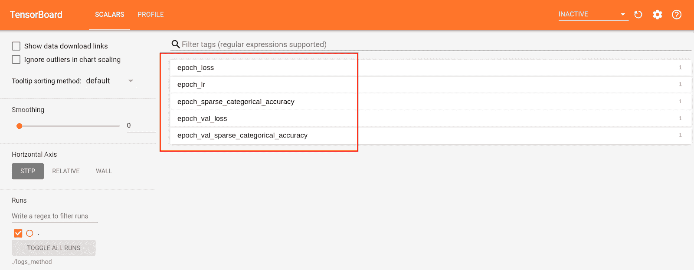

*Outlined in red are logs that TensorBoard keeps track of and displays in its UI.*

除了标量，我们还可以用 TensorBoard 跟踪其他一些东西。看看下面的 TensorBoard 用户界面截图，看看我们还能追踪什么:

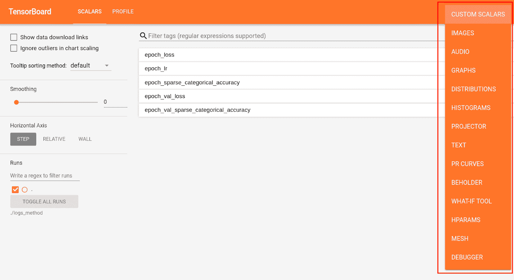

*Outlined in red are things you can track with TensorBoard.*

这是一个简短的提醒，告诉你可以用 TensorBoard 做什么。现在我们来看看它在结果分享方面是否有局限性。

## 问题陈述

你有没有想过用 TensorBoard 和你的团队分享和讨论工作进展？有几种方法可以做到这一点。

首先，TensorFlow 有自己的工具包( [TensorBoard.dev](https://web.archive.org/web/20221206012644/https://blog.tensorflow.org/2019/12/introducing-tensorboarddev-new-way-to.html) )用于 TensorBoard 分享。这是一个值得考虑的好选择，但是请记住**你的 TensorBoard 将会公开可见，**并且你无法管理对它的访问。此警告来自 TensorBoard 官方文档:

*"……*[*您上传的 TensorBoard 将公开可见，因此请勿上传敏感数据。*](https://web.archive.org/web/20221206012644/https://blog.tensorflow.org/2019/12/introducing-tensorboarddev-new-way-to.html)

 *所以对于任何非开源的项目，你可能需要一个更安全的选择。

其次，我们过去可以使用一种叫做 Aughie Boards 的第三方服务。这篇文章的[中描述了它的分享方式，但不幸的是，这项服务被暂停，不可用。](https://web.archive.org/web/20221206012644/https://medium.com/@org.aughie/how-to-share-your-tensorboard-online-4ed7c2d3941c)

第三， [Neptune.ai 有一个完善的共享实验结果的解决方案](https://web.archive.org/web/20221206012644/https://docs.neptune.ai/you-should-know/collaboration-in-neptune)——你只需复制一个链接。您可以通过管理访问限制来控制隐私。与我们选择的框架(TensorFlow/Keras)的集成是完全支持的，所以没有必要改变我们已经建立的工作流程。

海王星似乎是解决我们的进步共享问题的最合理的选择。让我们看看如何将它集成到我们的项目中。

## 海王星集成

幸运的是，与海王星融合是一个平稳的过程。有两个选项可以考虑:

1.  通过[直接导入](https://web.archive.org/web/20221206012644/https://docs.neptune.ai/integrations-and-supported-tools/experiment-tracking/tensorboard)张量板日志:

这个**选项** **在你的模型已经被训练过**并且所有必要的日志都已经存储在你的日志目录中的时候特别方便。我们只是想上传我们的结果，让他们可以分享。

当我把我的日志转换成海王星实验时，我得到了以下结果:

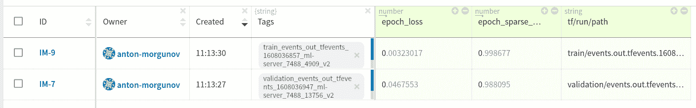

*Logs imported to Neptune*

看一看，我的项目空间里出现了两行(实验)。当我们仔细观察时，我们看到第一行代表训练集日志，第二行代表验证日志。从实验 **ID** 旁边的**标签**、**或/和 **tf/run/path** 属性可以看出这一点。**

让我们检查一下我的导入是否成功。为此，我单击所选实验的 ID 。这是里面的内容:

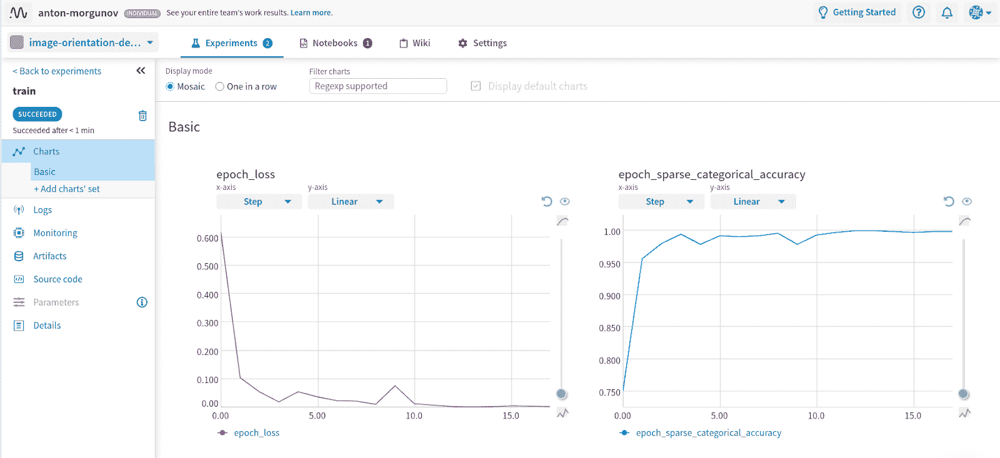

*Training scalar logs imported to Neptune and displayed as plots*

描述每个训练时期的模型损失和准确性(选定指标)的两个图表。

有几种方法可以检查图表。我可以改变轴刻度:在 y 轴的线性或对数刻度之间切换，或者/和在 x 轴的时间或历元数之间交换。TensorBoard 的常见功能，如图表平滑和缩放，也是可用的。

海王星为我们的日志扮演一个主人的角色。如果这是您想要的，让我向您展示如何将您的日志导入到 Neptune。有几个简单的步骤:

*   获取 Python 3.x 和以下库:
    *   海王星-张量板；
    *   张量板。

通过执行以下 bash 命令来安装它们:

```py
pip install tensorboard==2.4.0 neptune-tensorboard==0.5.1
```

*   [获取您的 API 令牌](https://web.archive.org/web/20221206012644/https://docs.neptune.ai/getting-started/installation#authentication-neptune-api-token)并将其设置为 NEPTUNE_API_TOKEN:
    *   对于 Linux/iOS 用户，用于 api 令牌设置的 bash 命令是:

```py
export NEPTUNE_API_TOKEN='YOUR_API_TOKEN'
```

```py
set NEPTUNE_API_TOKEN="YOUR_API_TOKEN"
```

*   在海王星托管您的 TensorBoard 日志:
    *   导航到您的 TensorBoard 日志目录并运行:

```py
neptune tensorboard --project USER_NAME/PROJECT_NAME
```

*   或者，您可以将 Neptune 指向您的 TensorBoard 日志目录:

```py
neptune tensorboard /PATH/TO/TensorBoard_logdir
--project  USER_NAME/PROJECT_NAME

```

如果你需要更多的细节，你可以观看 Jakub Czakon 的视频指南(点击下图获得视频链接),了解如何将 TensorBoard 日志导入 Neptune:

2.  通过[与 TensorFlow/Keras 框架的集成](https://web.archive.org/web/20221206012644/https://docs.neptune.ai/integrations-and-supported-tools/model-training/tensorflow-keras):

刚刚开始你的项目，你想把 Neptune 整合到你的工作流程中？我强烈建议使用这种集成方法。

这个方法只需要几行额外的代码就可以提供更高级的功能。你会喜欢你的实验/日志是如何被组织、存储和分享的。

让我们从头开始我的分类项目，但现在我将借助第二种积分方法积分海王星。集成后，与第一种方法相比，我项目的实验页面发生了有趣的变化:

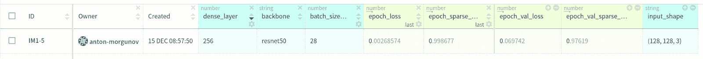

*Experiment results displayed after using the second integration method*

看看它有多方便，不仅可以看到实验及其结果，还可以看到从实验 **ID** 向右走的一些参数(像 *dense_layer* 、*骨干*、 *batch_size* 等参数……)。

如果你展示十几个实验会怎么样？在我个人的实践中，当处理多个实验，试图比较它们或找到一个特殊的实验时，每个实验旁边的这种详细信息可以节省时间。

点击实验 **ID** 显示出与我们之前看到的几乎相同的图表，但是现在我们在一个实验 **ID** 下有训练和验证图。保持这种方式很方便，因为验证和训练图都引用一个特定的运行。

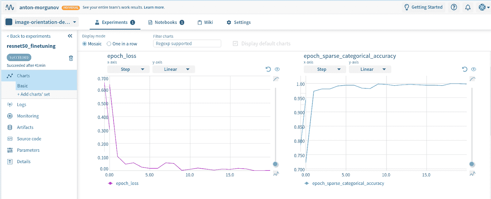

*Charts for the experiment created by integrating Neptune with TensorFlow/Keras*

除了图表，我们还可以在海王星做其他事情。让我们看看**参数**选项卡:

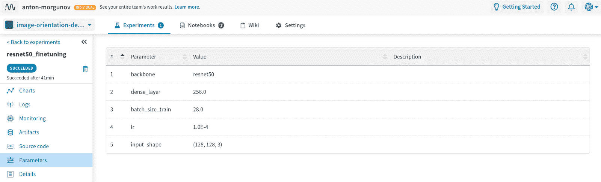

*Parameters of a model associated with a given experiment. Also hosted at Neptune*

海王星已经存储了一些与当前实验相关的模型参数。这些确切的参数显示在我们之前看到的实验 **ID** 旁边。

海王星是如何捕捉到这些参数的？稍后我会告诉你细节，现在我只想给你一个工具的高级概述。

让我们继续，打开**监控**选项卡:

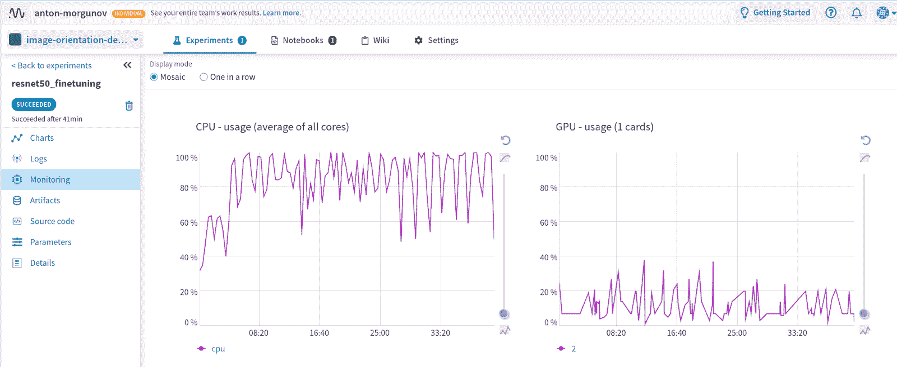

*Resource utilization displayed within Neptune for the training job associated with a given experiment*

CPU 和 GPU 利用率显示为一个示例。

我们可以监视整个实验过程中资源利用率是如何变化的。我们可以观察 CPU 和 GPU 负载，以及内存消耗。当你的模型正在训练时，这种信息流动是实时的，所有这些信息都可以在一个单独的实验页面上看到，非常简洁。

让我向您展示我是如何获得上述信息的，以及实际的集成是如何工作的，这样您就可以自己完成了:

*   和以前一样，[在 Neptune.ai 注册一个账户](/web/20221206012644/https://neptune.ai/register)

*   开始之前，安装 Python 3.x 和以下库:

您可以通过执行以下 bash 命令轻松安装它们:

```py
pip install tensorflow==2.3.1 neptune-contrib==0.4.129 neptune-client==0.25.0
```

*   通过向您工作的脚本或 Jupyter 笔记本添加初始化代码片段来初始化 Neptune。下面是我的项目中初始化是如何完成的:

```py
import neptune
import neptune_tensorboard as neptune_tb

token = '**********' 

neptune.init(project_qualified_name='anton-morgunov/image-orientation-detection-method',
             api_token=token)

neptune_tb.integrate_with_tensorflow()
```

*在项目*中初始化 Neptune 的代码片段

请注意，我故意模糊了我的令牌，因为它是我的帐户的私有令牌。当您在 Neptune 网站上注册帐户时，您的[个人令牌](https://web.archive.org/web/20221206012644/https://docs.neptune.ai/getting-started/installation#authentication-neptune-api-token)将出现在您的个人资料页面中。

此外，请注意我在第 10 行中应用的`.integrate_with_tensorflow()`方法，它在我的工作空间中实现了与 TensorFlow/Keras 的实际集成。

*   我的项目代码的其余部分和以前一样，除了我拟合模型的方式。现在看起来是这样的:

```py
params = {
    'backbone': backbone.name,
    'dense_layer': dense_count,
    'batch_size_train': batch_train,
    'lr': learning_rate,
    'input_shape': input_shape
}

with neptune.create_experiment(name='resnet50_finetuning', params=params):
    model.fit_generator(generator = train_generator,
                        steps_per_epoch = training_steps_per_epoch,
                        epochs = 100,
                        validation_data = validation_generator,
                        validation_steps = validation_steps_per_epoch,
                        callbacks = [rLrCallBack,
                                     tbCallBack,
                                     mcCallBack_loss,
                                     mcCallBack_acc,
                                     esCallBack],
                        use_multiprocessing = True,
                        workers = 8
                       )
```

*当您需要与 Neptune 集成时模型拟合的代码片段*

您可以看到，在我的 Jupyter 笔记本的第一个单元格中，我创建了一个字典来指定一组与当前实验相关的参数。在下一个单元格中，我在创建实验时传递了这些参数。这就是 Neptune 如何将一组参数与给定的实验运行相关联。

模型拟合与我们通常在 TensorFlow/Keras 中所做的相似，唯一的区别是在第 2 行，我们指定了一个实验创建。

这就是在项目中集成 Neptune 和 TensorFlow/Keras 所需了解的全部内容。相当简单的过程，只需要你一点点时间。

## 分享您的作品

现在，当你把你的实验上传到海王星的时候，我们可以讨论结果共享。

根据您为项目设置的隐私级别，共享方法会有所不同。Neptune 有两个项目隐私选项:**公开**和**私有**。

### 共享公共项目:

鉴于你的项目没有任何限制，Neptune 提供了分享你的结果的最简单的方法:从你想要分享的网页上复制一个 URL。

以下是您可以通过 URL 分享的内容:

*   你实验的细节，包括图表和二进制模型；
*   为要比较的不同实验覆盖的比较图表；
*   Jupyter 笔记本，包括多个笔记本版本之间的检查点和差异。例如，为我分享的项目检查一个[完整的笔记本。](https://web.archive.org/web/20221206012644/https://ui.neptune.ai/anton-morgunov/image-orientation-detection-method/n/image-orientation-detection-method-tf1-rn50-99ec8679-9311-4a1a-a7b0-c323e0abcfa7)

您可以在帐户的“项目”选项卡中找到您的项目隐私级别:

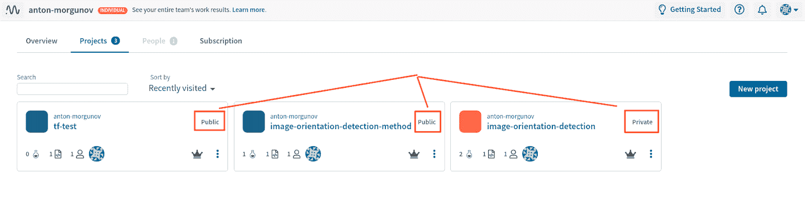

*Project privacy level outlined in red for each of the projects in my workspace.
Some of them are public, some are private.*

共享私人项目:

### 要对您的项目启用受限访问，您可以将其设置为私有。如果你想让你的工作保密，海王星让你管理谁有权访问和他们能做什么。

为此，您可以邀请队友加入您的团队工作区。受邀成员将被称为工作区内的“团队”。每个成员可以有一个选择的角色:**所有者**、**贡献者**或**查看者**。

To do that, you can invite teammates to your teamworkspace. Invited members will be called a “team” within the workspace. Each member can have one of the selected roles: **owner**, **contributor** or **viewer**. 

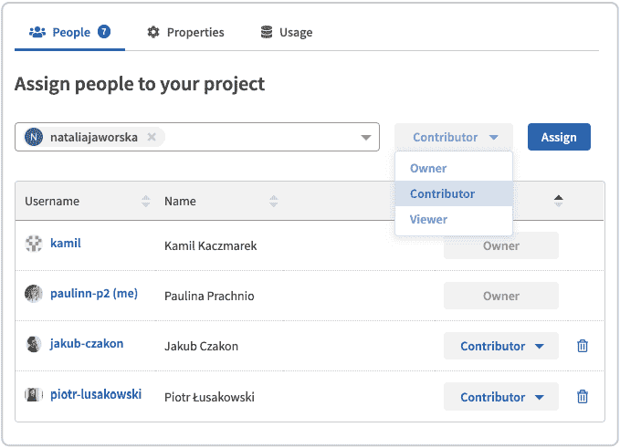

*New team member invitation and role assignment within the workspace in Neptun*e

根据您分配给团队成员的访问级别，您可以限制给定用户可以执行的操作，从监控项目工作流到在同一工作区内启动他们自己的实验。

要了解更多细节，请观看一个简短的[介绍视频](https://web.archive.org/web/20221206012644/https://www.youtube.com/watch?v=uYqT8aHsiQY&t=2s&ab_channel=NeptuneAI)，了解一个有组织的团队工作空间是什么样子的。

研究和非营利组织可以免费使用 Neptune 团队计划，但每个人都可以尝试一下。记住，你可以随心所欲地使用海王星个人计划(工作、研究、个人项目)。

你可以记录和分享的其他事情

## 机器学习工程师通常会测试多种方法来解决特定的技术任务。

每次训练是如何结束的？我们有最好的模型检查点，在单独的数据集上的性能结果，我特别喜欢做的是构建一些图表，帮助我直观地了解我的模型的功能。

将这些信息保存在一个与实验运行相关的地方不是很好吗？听起来是我理想的工作场所。

幸运的是，所有这些在海王星都有。因此，让我们利用它，并在我们的实验运行中包含一些额外的信息。

首先，我想上传我的模型的最佳检查点。方法如下:

*将特定实验运行的模型最佳检查点上传到 Neptune*

```py
from sklearn.metrics import confusion_matrix
import scikitplot as skplt
from itertools import chain
import seaborn as sns
import warnings
warnings.simplefilter(action='ignore', category=FutureWarning)

path2best_ckpt = './checkpoints/epoch_16-val_loss-0.0019-val_acc_1.0000_import.hdf5'
best_ckpt_basename = os.path.basename(path2best_ckpt)
neptune.log_artifact(path2best_ckpt,
                     os.path.join('model_checkpoints/', best_ckpt_basename)
                    )
```

现在，在我的项目工作区的“**工件”**选项卡中，我看到了一个上传的检查点:

Now, within the “**Artifacts”** tab of my project workspace, I see an uploaded checkpoint:

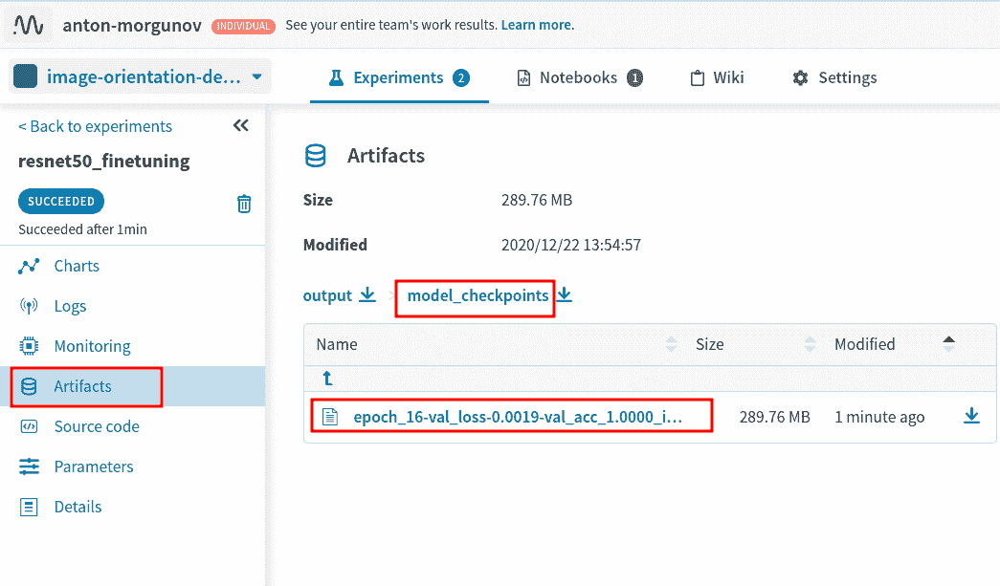

*Uploaded checkpoint displayed and available within the Artifacts tab of my project workspace*

现在，我将在测试集上评估我的训练模型。为此，我简单地做了以下事情:

在测试集上评估我的训练模型

```py
p = eval_model.predict_generator(test_generator)
```

由于我在研究一个分类器，我想通过观察混淆矩阵和 ROC-AUC 曲线来评估它。让我们创建它们并将其附加到我们的实验中:

Since I worked on a classifier, I’d like to evaluate it by looking at the confusion matrix and at the ROC-AUC curve. Let’s create them and attach them to our experiment:

```py
fig_roc, ax = plt.subplots(1, 1)
skplt.metrics.plot_roc_curve(y_true, np.flip(p, axis=0), ax=ax)

fig_cm = plt.figure()
sns.heatmap(conf_matrix, annot=True)

neptune.log_image('confusion matrix', fig_cm, image_name='conf_matrix')
neptune.log_image('roc_auc', fig_roc, image_name='roc_auc')
```

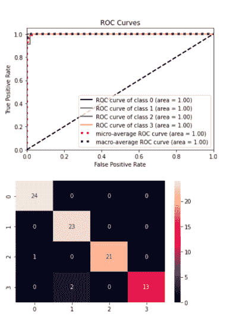

*Evaluating Models via ROC-AUC and Confusion Matrix plots*
*Uploading them to the workspace*

以下是上传到我的工作空间的图:

Here are the plots uploaded to my workspace:

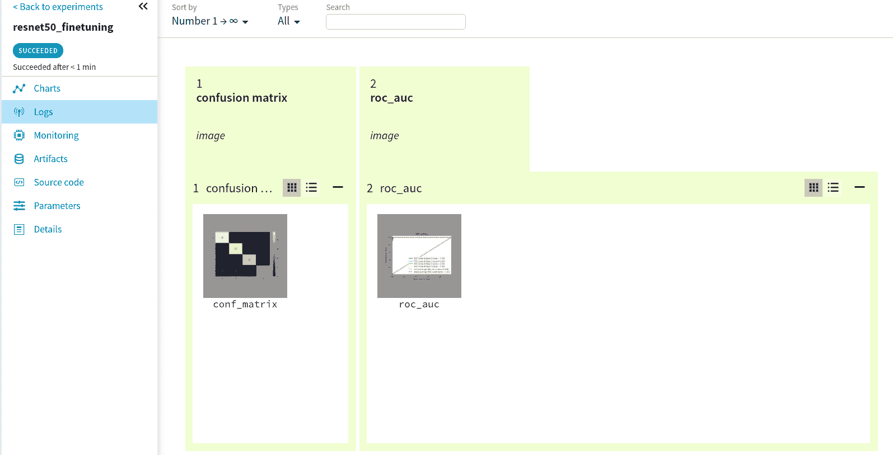

*Plots uploaded to the workspace become available at Logs tab*

有很多事情你可以记录、跟踪，并在以后分享。检查[该页面](https://web.archive.org/web/20221206012644/https://docs.neptune.ai/you-should-know/what-can-you-log-and-display)以查看还支持什么。

更酷的是，你的队友**可以通过编程获取**你上传的所有数据，[以一种简单方便的方式](https://web.archive.org/web/20221206012644/https://docs.neptune.ai/you-should-know/querying-and-downloading-metadata)！

结论

## TensorFlow 和 Keras 框架被广泛传播，工作共享和协作的问题对于我们这些在 ML 团队中工作的人来说是非常重要的。像 TensorBoard 这样的基本工具做得很好，但主要是针对独立工作。其他解决方案要么停止，要么缺乏适当的隐私管理。

Neptune 开发的解决方案很好地集成了 TensorFlow/Keras，并为我们的[实验跟踪](/web/20221206012644/https://neptune.ai/experiment-tracking)提供了丰富的功能。我们可以用我们选择的日志来补充每个实验，所以它被很好地描述并且容易理解。

我相信这个工具将有助于许多机器学习工程师寻找一个方便的实验跟踪和结果共享的解决方案。这对我很有帮助。

I believe that this tool will be helpful for many machine learning engineers looking for a convenient solution for experiment tracking and result sharing. It definitely helps me.*