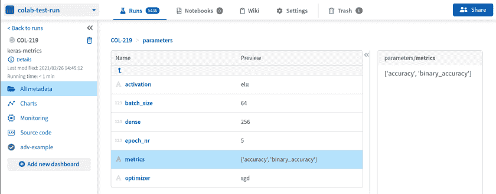
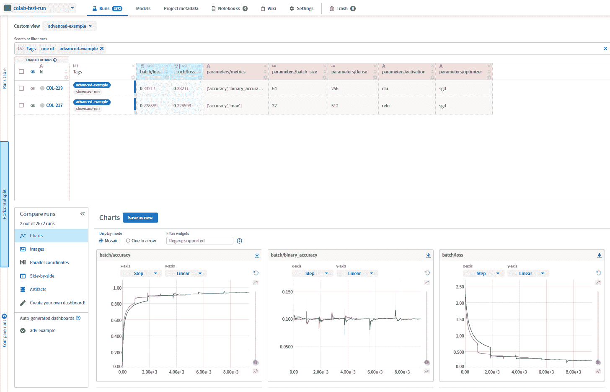
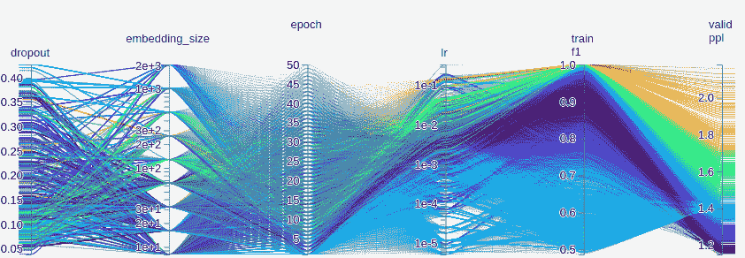
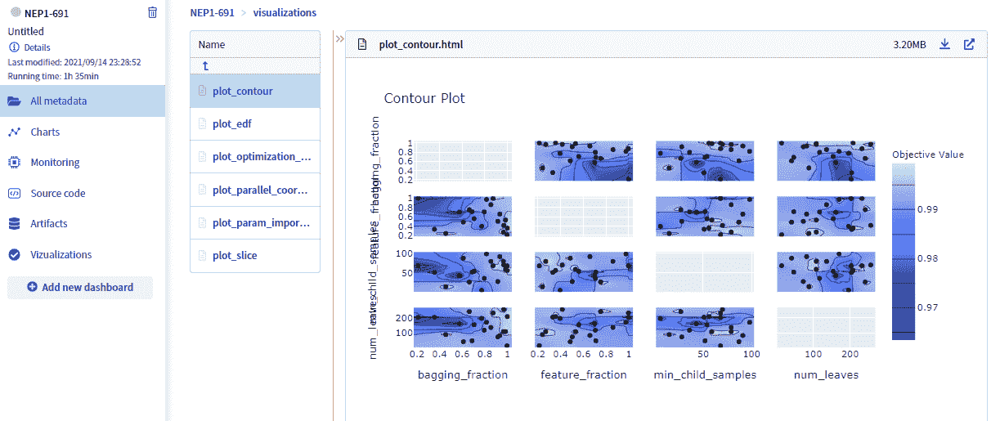

# 如何管理、跟踪和可视化机器学习模型的超参数？

> 原文：<https://web.archive.org/web/https://neptune.ai/blog/how-to-manage-track-visualize-hyperparameters>

**机器学习算法可通过称为超参数**的多个量规进行调整。最近的深度学习模型可以通过数十个超参数进行调整，这些超参数与数据扩充参数和训练程序参数一起创建了非常复杂的空间。在强化学习领域，您还应该计算环境参数。

数据科学家要**控制好** **超参数** **空间**，才能**使** **进步**。

在这里，我们将向您展示**最近的** **实践**、**技巧&诀窍、示例、**和**工具**，以最小的开销高效地管理、跟踪和可视化超参数。你会发现自己掌控了最复杂的深度学习实验！

## 为什么我应该跟踪我的超参数？也就是为什么这很重要？

几乎每一个深度学习实验指南，像[这本深度学习书籍](https://web.archive.org/web/20221206041922/https://www.deeplearningbook.org/contents/guidelines.html)，都建议你如何调整超参数，使模型按预期工作。在**实验-分析-学习循环**中，数据科学家必须控制正在进行的更改，以便循环的“学习”部分正常工作。

哦，忘了说**随机种子也是一个超参数**(特别是在 RL 领域:例如检查[这个 Reddit](https://web.archive.org/web/20221206041922/https://www.reddit.com/r/MachineLearning/comments/76th74/d_why_random_seeds_sometimes_have_quite_large/) )。

## 超参数管理和跟踪的当前实践是什么？

让我们逐一回顾一下管理超参数的常见做法。我们关注于如何构建、保存和传递超参数给你的 ML 脚本。

### Python 词典

很基础，很有用。只需在 Python 字典中收集超参数，如下例所示:

```py
PARAMS = {'epoch_nr': 5,
          'batch_size': 64,
          'dense': 256,
          'optimizer': 'sgd',
          'metrics': ['accuracy', 'binary_accuracy'],
          'activation': 'elu'}
```

由于这种方法，您**将所有超参数保存在一个 Python 对象**中，并且您可以轻松地在您的训练脚本中使用它。为了确保你在机器学习项目中跟踪那些参数，建议只在**版本控制文件中创建这个字典**。

你可以点击查看整个例子[。](https://web.archive.org/web/20221206041922/https://app.neptune.ai/common/colab-test-run/e/COL-219/source-code?path=source_code&file=main.py&attribute=files&filePath=.)

**优点**

1.  简单明了，因为你已经知道这个工具。
2.  用嵌套的字典很容易制作一个层次结构。
3.  几乎没有代码开销。
4.  易于将多个配置文件合并到一个字典中。
5.  可以保存在 pickle 文件中以备将来使用。

**缺点**

1.  超参数是代码库的一部分，虽然它们应该是独立的——记住要区分逻辑和它的参数化。
2.  将参数保存到磁盘并不明显。
3.  您可能没有注意到您覆盖了一些值。然后，很难了解一个特定的设置是如何执行的，因为你可能会覆盖一些神奇的数字。
4.  保存的 pickle 文件在代码之外是不可读的。


它是一个 [Python 库](https://web.archive.org/web/20221206041922/https://pypi.org/project/attrdict/)，允许你以键和属性的形式访问字典元素**。用属性语法真的很方便。**


下面是一个嵌套字典的例子:


```py
config = {'neptune': {'project': 'kamil/analysis',
                      'tags': ['xgb-tune']},
          'booster': {'max_depth': 10,
                      'eta': 0.01,
                      'gamma': 0.001,
                      'silent': 1,
                      'subsample': 1,
                      'lambda': 1,
                      'alpha': 0.05,
                      'objective': 'reg:linear',
                      'verbosity': 0,
                      'eval_metric': 'rmse',
                      },
          'num_round': 20,
          }

```


您可以像这样访问`eta`:


有了 attrdict，您可以用更优雅的方式来完成:


```py
cfg = AttrDict(config)rncfg.booster.eta

```

配置文件

### 它们是常规的文本文件，有一些预定义的结构和标准的库来解析它们，比如 [JSON 编码器和解码器](https://web.archive.org/web/20221206041922/https://docs.python.org/3.7/library/json.html)，或者 [PyYAML](https://web.archive.org/web/20221206041922/https://pyyaml.org/wiki/PyYAMLDocumentation) 。常见的标准是 JSON、yaml 或 cfg 文件。

下面是一个 yaml 文件的例子，它为[随机森林](https://web.archive.org/web/20221206041922/https://scikit-learn.org/stable/modules/generated/sklearn.ensemble.RandomForestRegressor.html)提供了多个超参数，以及更一般的信息，如项目和实验名称。

与基于字典的风格类似，您只需要对这个文件进行版本控制，以跟踪超参数。

```py
project: ORGANIZATION/home-credit
name: home-credit-default-risk

parameters:

  n_cv_splits: 5
  validation_size: 0.2
  stratified_cv: True
  shuffle: 1

  rf__n_estimators: 2000
  rf__criterion: gini
  rf__max_features: 0.2
  rf__max_depth: 40
  rf__min_samples_split: 50
  rf__min_samples_leaf: 20
  rf__max_leaf_nodes: 60
  rf__class_weight: balanced

  aggregation_method: rank_mean

```

您可以通过简单地像这样使用`yaml.load()`来**读取 yaml 文件并访问它的元素**:

由于刚刚介绍了**attr direct**，我们修改一下这个代码片段，用更优雅的方式**访问** `n_cv_splits` **值**:

```py
import yaml

with open(config_path) as f:
    config = yaml.load(f, Loader=yaml.BaseLoader)  

print(config['parameters']['n_cv_splits'])  

```

这里是一个用于存储特征选择、模型参数等的大型 yaml 文件的[示例](https://web.archive.org/web/20221206041922/https://ui.neptune.ai/o/neptune-ai/org/Home-Credit-Default-Risk/e/HC-11735/source-code?path=configs%2F&file=neptune.yaml)。

```py
import yaml
from attrdict import AttrDict

with open(config_path) as f:
    config = yaml.load(f, Loader=yaml.BaseLoader)  
    cfg = AttrDict(config)

print(cfg.parameters.n_cv_splits)  

```

**优点**

一切都位于一个地方。

1.  易于重复使用保存的配置文件。
2.  脚本逻辑及其参数化的良好分离。
3.  增强了代码的可读性。
4.  **缺点**

将超参数放入配置文件需要一些编程知识。

1.  如果代码库变化很快(新特性、新模型，同时删除旧版本的代码)，维护正确的配置文件是额外的开销。
2.  对于大型代码库，您可能会有几个配置文件，这会使事情变得更加复杂和繁琐。
3.  YAML 文件是在 AWS 和其他云平台中部署时编写配置的标准格式。因此，与 YAML 打交道是值得的，因为播下的种子将在部署中收获好处。

抱怨吗

### 在进行试验时，您通常会经历多次试验(或实验)，以便了解超参数和得分之间的关系，并获得性能最佳的模型(我们将模型性能良好意味着什么的讨论留到另一篇文章中)。

在这种情况下，从**命令** **行**和**直接在 CLI** 中指定参数 **值**来**开始新的实验**就派上用场了。 [Argparse](https://web.archive.org/web/20221206041922/https://docs.python.org/3/library/argparse.html) 是一个 Python 模块，它使得编写**用户友好的命令行界面**变得容易。

我认为**理解 argparse** 的一个简单方法是**简单地** **分析**一个**例子**。下面是一个简单的 Python 程序，它接受三个可选的位置参数并打印它们。

如果你**运行**这个程序，**没有任何参数，那么将使用默认值**:

```py
import argparse

parser = argparse.ArgumentParser(description='Process hyper-parameters')

parser.add_argument('--lr',       type=float, default=0.001, help='learning rate')
parser.add_argument('--dropout',  type=float, default=0.0,   help='dropout ratio')
parser.add_argument('--data_dir', type=str,   default='/neptune/is/the/best/data/', help='data directory for training')

args = parser.parse_args()

print(args.lr)
print(args.dropout)
print(args.data_dir)

```

输出是:

```py
python main.py

```

如果您**指定参数**，那么它们将被解析，以便您**可以在您的训练脚本**中使用它们:

```py
0.001
0.0
/neptune/is/the/best/data/

```

输出是:

```py
python main.py --lr 0.005 --dropout 0.5

```

关于跟踪的一个重要注意事项:注意 **argparse 不保存或记录在命令行**中传递的参数。用户必须**自己保存参数值**。

```py
0.005
0.5
/neptune/is/the/best/data/

```

**优点**

方便地开始新的实验。

1.  动态决定超参数的值。
2.  易于向 argparse 添加新参数。
3.  **缺点**

需要额外的努力(虽然不是很大)来跟踪基于实验的长期项目中超参数的值。Argparse 不在任何地方保存值。

1.  与配置文件类似，如果您的项目增长迅速，您可能会发现很难维护 CLI 参数。
2.  如果在代码的几个地方传递参数，如何有效地使用 argparse 就变得不那么明显了。如果从多个位置构建/合并参数，情况也类似。
3.  水螅

[Hydra](https://web.archive.org/web/20221206041922/https://hydra.cc/) 是脸书 AI 的一个新项目，它简化了更复杂的机器学习实验的配置。

### 其背后的关键理念是:

动态地**创建一个**一个**层次化的** **配置** **由** **组成**，

需要时通过命令行覆盖它，

*   通过 CLI 传递新参数(配置中没有)——它们将被自动处理
*   Hydra 使您能够准备和覆盖复杂的配置设置(包括配置组和层次结构)，同时跟踪任何被覆盖的值。
*   与 argparse 类似，**理解它的最佳方式(以及使用 hydra 有多简单)是分析一个示例**。

让我们从关于配置文件的部分考虑简化的配置`yaml`文件:

下面是**极简风格的九头蛇例子**:

当您运行它时，您应该会看到:

```py
project: ORGANIZATION/home-credit
name: home-credit-default-risk

parameters:

  n_cv_splits: 5
  validation_size: 0.2
  stratified_cv: True
  shuffle: 1

  rf__n_estimators: 2000
  rf__criterion: gini
  rf__max_depth: 40
  rf__class_weight: balanced

```

在 hydra 中**方便的是，您可以从 CLI** 覆盖配置中的任何值，如下所示:

```py
import hydra
from omegaconf import DictConfig

@hydra.main(config_path='hydra-config.yaml')
def train(cfg):
    print(cfg.pretty())  
    print(cfg.parameters.rf__n_estimators)  
if __name__ == "__main__":
    train()

```

因此，在配置中有了新的值:

```py
name: home-credit-default-risk
parameters:
  n_cv_splits: 5
  rf__class_weight: balanced
  rf__criterion: gini
  rf__max_depth: 40
  rf__n_estimators: 2000
  shuffle: 1
  stratified_cv: true
  validation_size: 0.2
project: ORGANIZATION/home-credit

2000

```

另一个提供良好灵活性的**特性是一个选项，可以直接从命令行**传递新的、以前看不到的参数。

```py
python hydra-main.py parameters.n_cv_splits=12   parameters.stratified_cv=False name=entirely-new-name

```

要启用此功能，只需关闭 hydra 中的严格模式。

```py
name: entirely-new-name
parameters:
  n_cv_splits: 12
  rf__class_weight: balanced
  rf__criterion: gini
  rf__max_depth: 40
  rf__n_estimators: 2000
  shuffle: 1
  stratified_cv: false
  validation_size: 0.2
project: ORGANIZATION/home-credit

2000

```

在下面的命令中，我将`rf__max_features`添加到配置中，同时将`rf__n_estimators`更改为 1500。**注意 config 和前面的例子是一样的。在代码中，我们只关闭了严格模式**:

输出相应改变:

```py
@hydra.main(config_path='config.yaml', strict=False)

```

hydra 项目正在积极开发中，所以请确保不时查看他们的[教程](https://web.archive.org/web/20221206041922/https://hydra.cc/docs/tutorials/intro)以了解新特性。

```py
python hydra-main.py parameters.rf__n_estimators=1500   parameters.rf__max_features=0.2

```

**优点**

```py
name: home-credit-default-risk
parameters:
  n_cv_splits: 5
  rf__class_weight: balanced
  rf__criterion: gini
  rf__max_depth: 40
  rf__max_features: 0.2
  rf__n_estimators: 1500
  shuffle: 1
  stratified_cv: true
  validation_size: 0.2
project: ORGANIZATION/home-credit

1500

```

可组合配置。

能够非常容易地覆盖值，并且仍然跟踪它们。

1.  将组织带入更大实验的配置组。
2.  **缺点**
3.  九头蛇在更大的实验中大放异彩，这些实验以多个超参数及其等级来衡量。对于较小的，其他方法将做得恰到好处。

您需要小心避免重要参数值的意外覆盖。

1.  为了跨实验跟踪超参数，您需要手动保存配置对象(上面示例中的`cfg`)。
2.  PyTorchLightning 照明模块超参数
3.  ***注意*** : *这种方法只有在你选择 PyTorchLightning 作为框架的时候才有效*

### PyTorch Lightning 有一种隐式的方法来跟踪检查站和 YAML 中的超参数(与我们上面讨论的相同)。这增强了可再现性，并使代码中的跟踪过程干净而高效。不需要在代码库中导入模块或加载任何文件。

所有繁重的工作都由 **LightningModule** 完成，用户只需直接继承方法。让我们来看一个实际例子:

save_hyperparameters()方法将对象中存在的所有超参数保存到 YAML 文件中。前往[文档](https://web.archive.org/web/20221206041922/https://pytorch-lightning.readthedocs.io/en/latest/common/hyperparameters.html#lightningmodule-hyperparameters)了解更多关于像模型检查点文件一样保存和加载超参数的信息。

**优点:**

```py
class LitMNIST(LightningModule):
    def __init__(self, layer_1_dim=128, learning_rate=1e-2):
        super().__init__()

        self.save_hyperparameters()

        self.save_hyperparameters("layer_1_dim", "learning_rate")

        self.hparams.layer_1_dim
```

没有任何模块或文件加载额外的依赖

快速有效的保存和加载功能

1.  本质上的隐含性保持了代码库的整洁和可解释性
2.  **缺点:**
3.  这些方法仅限于 PyTorch Lightning 模块

不幸的是，它也受到 YAML 文件的困扰。

1.  它需要代码和编程知识来处理好事情
2.  如果配置变化很快，维护配置文件是额外的负担。但是，这可以通过使用版本控制来解决。
    *   这种技术灵活性较差。例如，如果您想在不同的配置文件中保存不同的超参数，那么您必须返回来显式地创建它们。
    *   Tensorflow 2 张量板 HParams
3.  ***注意*** : *这种方法只有在使用 Tensorflow 作为框架选择的情况下才有效*

### 对于超参数调优，最佳实践是将这些超参数放在一个地方，作为做出正确决策的结果。TensorBoard 中的 HParams 仪表板提供了多种工具，可帮助确定最佳实验或最有希望的超参数集。

使用 HParams 类记录超参数将让您在 tensorboard 中可视化它们以及大量其他方便的信息。使用 TF summary writer 以 Tensoroard 兼容格式记录和保存超参数后，您可以在不同的实验中再次导入和重复使用这些参数。让我们看一个在拟合模型时如何记录和利用它的例子。

您可以使用 hp 声明您想要的超参数。HParam 方法，并使用 tf.summary.create_file_writer 保存，它会将它们保存为 tensorboard 可以读取的格式。

您可以在模型中直接使用上面在 HParams 中声明的超参数。前往[文档](https://web.archive.org/web/20221206041922/https://www.tensorflow.org/tensorboard/hyperparameter_tuning_with_hparams)了解更多信息。

```py
import tensorflow as tf
from tensorboard.plugins.hparams import api as hp

HP_NUM_UNITS = hp.HParam('num_units', hp.Discrete([16, 32]))
HP_DROPOUT = hp.HParam('dropout', hp.RealInterval(0.1, 0.2))
HP_OPTIMIZER = hp.HParam('optimizer', hp.Discrete(['adam', 'sgd']))

METRIC_ACCURACY = 'accuracy'

with tf.summary.create_file_writer('logs/hparam_tuning').as_default():
  hp.hparams_config(
    hparams=[HP_NUM_UNITS, HP_DROPOUT, HP_OPTIMIZER],
    metrics=[hp.Metric(METRIC_ACCURACY, display_name='Accuracy')],
  )
```

**优点:**

```py
def train_test_model(hparams):
  model = tf.keras.models.Sequential([
    tf.keras.layers.Flatten(),
    tf.keras.layers.Dense(hparams[HP_NUM_UNITS], activation=tf.nn.relu),
    tf.keras.layers.Dropout(hparams[HP_DROPOUT]),
    tf.keras.layers.Dense(10, activation=tf.nn.softmax),
  ])
  model.compile(
      optimizer=hparams[HP_OPTIMIZER],
      loss='sparse_categorical_crossentropy',
      metrics=['accuracy'],
  )

  model.fit(x_train, y_train, epochs=1) 
  _, accuracy = model.evaluate(x_test, y_test)
  return accuracy
```

没有任何模块或文件加载额外的依赖

快速简单的可视化过程

1.  本质上的隐含性保持了代码库的整洁和可解释性
2.  目录结构将保持整洁有序
3.  **缺点:**
4.  这些方法只限于张量板模块

它需要代码和编程知识来处理好事情

1.  如果配置变化很快，维护配置文件是额外的负担。但是，这可以通过使用版本控制来解决。
2.  这种技术也提供了较少的灵活性。例如，如果您想在不同的配置文件中保存不同的超参数，那么您必须返回来显式地创建它们。
3.  管理超参数的另一个步骤是在更广泛的实验管理环境中使用它们。下面是一个关于【Neptune 如何处理 ML 实验的参数化的例子:
4.  这样，每个实验都有自己的 params 设置保存到 Neptune，以供进一步分析和跨实验比较。这种方法的主要优点是，您可以**将参数与其他实验相关的数据/元数据相关联，如评估指标或结果模型。**

前往文档了解如何无缝集成 Neptune，而无需对代码做太多修改。

```py
PARAMS = {'batch_size': 64,
          'n_epochs': 100,
          'shuffle': True,
          'activation': 'elu',
          'dense_units': 128,
          'dropout': 0.2,
          'learning_rate': 0.001,
          'early_stopping': 10,
          'optimizer': 'Adam',
          }

neptune.create_experiment(params=PARAMS)

```

实验跟踪工具——如 Neptune——在多个不同位置显示参数，以便您可以:

突出显示所有不同的参数时，更详细地比较选定的实验([示例](https://web.archive.org/web/20221206041922/https://app.neptune.ai/o/common/org/quickstarts/experiments?split=tbl&dash=quick-check-7b6057af-8003-4748-982e-34a7b83207ed&viewId=64a274e0-25bc-49e0-b1ca-f093fb2b8f7b))。

[](https://web.archive.org/web/20221206041922/https://neptune.ai/how-to-track-hyperparameters/attachment/parameters-logged-in-neptune)

**Parameters’ values are displayed for each experiment, allowing you to visually inspect and analyze runs**

[](https://web.archive.org/web/20221206041922/https://neptune.ai/how-to-track-hyperparameters/attachment/parameters-compare-in-neptune)

*You can also compare multiple runs*

搜索具有当前参数特定值的实验([示例](https://web.archive.org/web/20221206041922/https://ui.neptune.ai/o/USERNAME/org/example-project/experiments?viewId=09405070-efd2-43a3-997b-ec6f88c02e44)，其中我们仅显示具有正“*时间序列 _ 因子*”的实验)。

*   如何可视化超参数？
*   如果你是一个繁重的实验者，你可能会遇到需要[有效地比较数百次运行](https://web.archive.org/web/20221206041922/https://docs.neptune.ai/you-should-know/comparing-runs)和**可视化超参数和分数**之间的关系。

## 平行坐标图

一种方法是准备一个平行坐标图，如下图所示:

### 每个垂直轴是一个参数，分数是最右边的(垂直)轴。这种可视化提供了对产生最佳分数的参数范围的即时洞察。原则上，它应该是交互式的，允许用户自由地探索数据，并执行他们自己的推理和解释。

一个建造平行坐标罐的伟大工具: [HiPlot](https://web.archive.org/web/20221206041922/https://facebookresearch.github.io/hiplot/index.html) ，由[脸书人工智能研究院](https://web.archive.org/web/20221206041922/https://ai.facebook.com/) (FAIR)开发。仔细看看[如何在 Neptune](https://web.archive.org/web/20221206041922/https://docs.neptune.ai/you-should-know/comparing-runs#parallel-coordinates) 中使用平行坐标比较运行。



*Parallel coordinates plot build with HiPlot.*

顺便说一下，如此大量的运行(如上所述)通常来自于**超参数优化**作业，简称 hpo。Python 的开源环境在这个问题上有很大的贡献。检查这两个流行的 hpo 库的比较: [optuna 和 hyperopt](https://web.archive.org/web/20221206041922/https://neptune.ai/blog/optuna-vs-hyperopt) 。

sci kit-优化

scikit-optimize 的创建者提出了另一种检查和理解 *hpo* 结果的方法。每个 *hpo* 作业都会生成诊断图表，显示超参数和分数之间的关系。

### 这里有一个例子:

奥普图纳

Optuna 是一个自动化超参数搜索的**超参数优化框架**。它为给定的工作提供了自己的超参数可视化套件。

### 让我们来研究 optuna hpo 作业的一个[示例:](https://web.archive.org/web/20221206041922/https://app.neptune.ai/o/common/org/optuna-integration/e/NEP1-691/all?path=visualizations&attribute=plot_contour)

与前面的例子类似，可视化的主要目标**是帮助理解超参数如何与正在优化的分数**相关。

如果这听起来与你有关，仔细看看文档中的 [neptune-optuna 集成。](https://web.archive.org/web/20221206041922/https://docs.neptune.ai/integrations-and-supported-tools/hyperparameter-optimization/optuna)



*Optuna diagnostics chart*

最后的想法

超参数是大图的中心部分，即[实验管理](/web/20221206041922/https://neptune.ai/blog/experiment-management)。在这篇文章中，我们展示了超参数跟踪实践的最新状态。有了 Neptune，你可以把它提升一个层次，让团队中的**变得容易接近、可比和共享。**

## Final thoughts

Hyperparameters are the central piece of the larger picture, which is [experiment management](/web/20221206041922/https://neptune.ai/blog/experiment-management). In this post, we showed the recent state of the practice in hyperparameters tracking. With Neptune, you can bring it one level up, by making them **easily accessible, comparable, and shareable in the team instantaneously**.