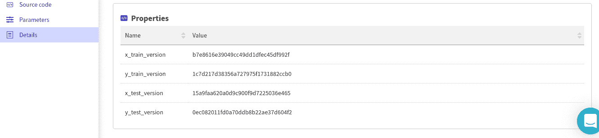

# 如何组织你的 XGBoost 机器学习(ML)模型开发过程:最佳实践

> 原文：<https://web.archive.org/web/https://neptune.ai/blog/how-to-organize-your-xgboost-machine-learning-ml-model-development-process>

XGBoost 是一个顶级的渐变增强库，可以在 Python、Java、C++、R 和 Julia 中使用。

该库支持 GPU 培训、分布式计算、并行化和缓存优化。开发人员也喜欢它的执行速度、准确性、效率和可用性。

然而，当你[在任何框架中开发机器学习模型](https://web.archive.org/web/20221206005417/https://towardsdatascience.com/machine-learning-general-process-8f1b510bd8af)时，包括 XGBoost，你可能最终会尝试一堆参数配置和功能版本，以获得满意的性能。使用电子表格和命名约定来管理所有这些配置确实令人头疼。

有一些工具可以帮助开发人员组织他们的机器学习模型开发过程。本文将重点向您展示如何在顶级 ML 实验管理工具之一的 Neptune 中实现这一点。

让我向您展示如何在您当前的模型开发设置之上添加实验管理。

如何跟踪 XGBoost 模型训练:[海王星+ XGBoost 集成](https://web.archive.org/web/20221206005417/https://docs.neptune.ai/integrations-and-supported-tools/model-training/xgboost)

## 使用 XGBoost 进行 ML 模型开发通常是什么样子

### **准备好数据集**

在训练任何模型之前，我们需要一个数据集。对于这个示例，我们将使用 Scikit-learn 生成一个分类数据集。在现实生活中，你可能已经准备好了一些特性，你将会加载它们。

```py
from sklearn.datasets import make_classification
from sklearn.model_selection import train_test_split

X, y = make_classification(n_samples=100000,n_features=10, n_redundant=0, n_informative=8,random_state=1)
import pandas as pd
X = pd.DataFrame(X,columns=["F1","F2","F3","F4","F5","F6","F7","F8","F9","F10"])
y = pd.DataFrame(y,columns=["Target"])

X_train, X_test, y_train, y_test = train_test_split( X, y, test_size=0.33, random_state=42)

```

### **训练 XGBoost 模型**

接下来，我们将导入 XGBoost，设置我们的[参数](https://web.archive.org/web/20221206005417/https://xgboost.readthedocs.io/en/latest/parameter.html)。由于这是一个二元分类，我们使用`logistic`目标。之后，我们用这些参数初始化分类器。您也可以使用 YAML 文件传入参数。

```py
params = {"objective":"binary:logistic",'colsample_bytree': 0.3,'learning_rate': 0.1,
                'max_depth': 5, 'alpha': 10}
classification = xgb.XGBClassifier(**params)
```

下一步是用训练测试来训练模型。

```py
classification.fit(X_train, y_train)

```

培训之后，我们需要保存模型，以便在部署过程中使用它。

```py
from sklearn.externals import joblib
joblib.dump(classification, 'classifier.pkl')
```

接下来，我们在测试集上评估模型，并显示分类报告。

```py
from sklearn.metrics import classification_report

print(classification_report(predictions,y_test))

```

最后，我们将获得的预测转换成数据帧，并保存为 csv 文件以供将来参考，或者进行一些[深层错误分析](/web/20221206005417/https://neptune.ai/blog/deep-dive-into-error-analysis-and-model-debugging-in-machine-learning-and-deep-learning)。

```py
import pandas as pd
pd.DataFrame(predictions, columns=["Predictions"]).to_csv("predict.csv")
```

现在，让我向您展示如何对所有这些进行版本控制，并通过 Neptune 轻松管理。

## 在 Neptune 组织 ML 开发

### 安装软件包并设置 Neptune

我们将在 Jupyter 笔记本中使用 [Neptune，所以我们需要 Neptune 客户端和 Neptune Jupyter 扩展。](https://web.archive.org/web/20221206005417/https://docs.neptune.ai/integrations-and-supported-tools/ide-and-notebooks/jupyter-lab-and-jupyter-notebook)

在您的终端中运行以下命令来安装 Neptune:

```py
pip install neptune-client

```

为 Jupyter 笔记本配置 Neptune 是必不可少的，因为它使我们能够将笔记本检查点保存到 Neptune。如果您不使用笔记本电脑，可以跳过这一部分。

接下来，设置笔记本扩展:

```py
pip install neptune-notebooks

```

安装后，您必须启用扩展，以便与您的 Jupyter 笔记本电脑集成:

```py
jupyter nbextension enable --py neptune-notebooks

```

如果你在 JupyterLab 上工作，你可以毫无问题地安装[扩展。](https://web.archive.org/web/20221206005417/https://docs.neptune.ai/integrations-and-supported-tools/ide-and-notebooks/jupyter-lab-and-jupyter-notebook)

因为我们正在安装软件包，所以让我们也把 Neptune Contrib 软件包去掉。它包含一个回调函数，让我们在训练 XGBoost 模型时记录度量、模型和特性对 Neptune 的重要性。

```py
pip install neptune-contrib[monitoring]
```

### 将您的脚本连接到海王星

此时，您需要一个免费的 [Neptune AI 帐户](/web/20221206005417/https://neptune.ai/register)来初始化 Jupyter 笔记本中的 Neptune。为此，您需要一个 Neptune API 密钥。

登录后，您可以通过单击您的个人资料图像来获取密钥。

都准备好了吗？让我们跳到 Jupyter 笔记本上进行初始化。

第一步是通过点击 Neptune 图标将我们的笔记本连接到 Neptune。

现在将提示您输入 API 令牌。一旦连接成功，你可以通过点击上传按钮上传你的笔记本到 Neptune。

之后，我们使用‘neptune . init’来初始化通信，并将当前脚本/笔记本与您在 Neptune 中的项目连接起来。

```py
import neptune

neptune.init(project_qualified_name='mwitiderrick/sandbox', api_token='YOUR_API_KEY')

```

在这种情况下，我使用的是在你注册时自动创建的“沙盒”项目。但是，您可以在“项目”标签中创建新项目。

### 创建实验并保存超参数

开始登录 Neptune 的第一件事是创建一个实验。这是一个命名空间，您可以在其中记录度量、预测、可视化和任何其他内容([参见您可以在 Neptune](https://web.archive.org/web/20221206005417/https://docs.neptune.ai/logging-and-managing-experiment-results/logging-experiment-data.html#what-you-can-log) 中记录和显示的元数据类型的完整列表)。

让我们创建一个实验并记录模型超参数。

```py
experiment = neptune.create_experiment(name='xgb', tags=['train'], params=params)
```

运行`neptune.create_experiment`输出海王星实验的链接。

可以点开看看训练过程直播。

现在，没有记录太多，但是我们可以在参数部分看到超参数。

“参数”选项卡显示用于训练 XGBoost 模型的参数。

在笔记本上工作时，一旦你完成了运行实验，确保你的运行`neptune.stop()`完成当前的工作(在脚本中实验自动停止)。

### 创建 Neptune 回调并将其传递给“fit”

为了将训练指标记录到 Neptune，我们使用了来自 neptune-contrib 库的现成回调。这很酷，因为这是我们在训练阶段唯一需要添加的东西。

有了回调设置，海王星照顾其余的。

```py
from neptunecontrib.monitoring.xgboost import neptune_callback
```

我们通过调用`fit`方法并传入我们之前定义的参数来训练模型，包括 Neptune 回调。

```py
classification.fit(X_train, y_train,callbacks=[neptune_callback()],eval_set=[(X_test, y_test)])
```

一旦训练完成，回到海王星，检查日志。

登录后，您可以单击当前正在进行的项目来查看您的所有实验。

在 monitoring 选项卡上，会实时显示 CPU 和 RAM 的使用情况。

单击单个实验将显示该特定实验的日志。在图表部分，您可以看到培训和验证图表。

使用 Neptune，您还可以放大培训的各个部分，对其进行详细分析。

“日志”部分显示了用于生成这些图形的日志。

注意使用 Neptune 回调后我们自动得到的特性重要性图。

一旦你的项目中有了几个实验，就可以对它们进行比较。你可以通过选择实验并点击比较按钮来完成。

### 版本数据集

在 Neptune 中对数据集哈希进行版本控制也非常有用。这将使您能够在执行实验时跟踪数据集的不同版本。这可以借助 Python 的`hashlib`模块和 Neptune 的`set_property`函数来完成。

```py
import hashlib
neptune.set_property('x_train_version', hashlib.md5(X_train.values).hexdigest())
neptune.set_property('y_train_version', hashlib.md5(y_train.values).hexdigest())
neptune.set_property('x_test_version', hashlib.md5(X_test.values).hexdigest())
neptune.set_property('y_test_version', hashlib.md5(y_test.values).hexdigest())

```

之后，您可以在项目的 details 选项卡下看到版本。



### 版本模型二进制

您也可以使用`neptune.log_artifact()`将模型的各种版本保存到 Neptune，但是，由于我们使用的是`neptune_callback()`,所以模型会在最后一次增强迭代后自动登录到 Neptune。

我们还可以记录我们之前保存的模型。

```py
neptune.log_artifact('classifier.pkl')

```

### 你认为你还需要的任何版本

Neptune 还提供了记录其他东西的能力，比如模型解释器和交互式图表，比如 ROC 曲线。

记录[解释者](https://web.archive.org/web/20221206005417/https://modeloriented.github.io/DALEX/)是使用`log_explainer`函数完成的。

```py
from neptunecontrib.api import log_explainer, log_global_explanations
import dalex as dx

expl = dx.Explainer(classification, X, y, label="XGBoost")

log_global_explanations(expl, numerical_features=["F1","F2","F3","F4","F5","F6","F7","F8","F9","F10"])

log_explainer('explainer.pkl', expl)

```

这样做之后，实验的工件部分将会有经过腌制的解释器和图表。

## 在仪表板中组织实验

海王星允许你选择你想在仪表盘上看到什么。您可以添加或删除列。通过单击管理列，您可以向仪表板添加新列。

如果您想删除某一列，只需单击它旁边的 x 按钮。您也可以使用某列旁边的向上和向下箭头按该列进行筛选。这些按钮指示您是按升序还是降序进行过滤。

该平台还允许您将实验分组到视图中。例如，您可以选择带有特定标签的实验，并将这些实验保存为新视图。一旦你这样做了，你就可以随时访问新的视图。

## 与您的团队合作进行 ML 实验

你可以通过邀请你的团队合作来分享你的 Neptune 实验。

您还可以通过公开项目来与全世界共享项目。一旦项目公开，你可以自由地与任何人分享链接。


使用团队计划时，您可以与队友分享您的私人项目。该团队计划对研究、非营利组织和 Kagglers 也是免费的。

你在 Neptune app 里做什么都可以分享，比如我发个[链接](https://web.archive.org/web/20221206005417/https://ui.neptune.ai/mwitiderrick/sandbox/compare?shortId=%5B%22SAN-62%22%2C%22SAN-61%22%2C%22SAN-60%22%2C%22SAN-57%22%5D&viewId=022622fe-6fb1-4a9f-82b5-789bded35fb7)就可以分享我的实验对比。

## 以编程方式下载模型工件

使用 Neptune，您可以从您的实验中下载文件，甚至直接从您的 python 代码中下载单个项目。例如，您可以使用`download_artifact`方法下载单个文件。我们可以通过获取实验对象并下载该实验的所有文件来下载模型。在这种情况下，我们下载之前上传的分类器。分类器存储在我们当前工作目录的模型文件夹中。

```py
project = neptune.init('mwitiderrick/sandbox',api_token='YOUR_TOKEN',
)
my_exp = project.get_experiments(id='SAN-21')[0]
experiment.download_artifact("classifier.pkl","model"))

```

当你想操作你的模型并从你的实验报告中直接获取它们时，这是很有用的。但是将模型投入生产是另外一个故事🙂

结论

## 希望这已经向您展示了使用 Neptune 向 XGBoost 训练脚本添加[实验跟踪](/web/20221206005417/https://neptune.ai/experiment-tracking)和模型版本控制是多么容易。

具体来说，我们讲述了如何:

设置海王星

*   使用 Neptune 回调来记录我们的 XGBoost 培训课程
*   分析和比较海王星的实验
*   海王星上各种项目版本
*   与团队成员协作
*   从海王星下载你的神器
*   希望有了这些信息，XGBoost 模型现在会更清晰，更易于管理。

感谢阅读！

Thanks for reading!