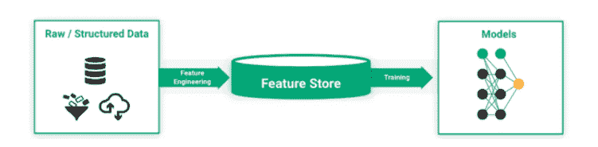
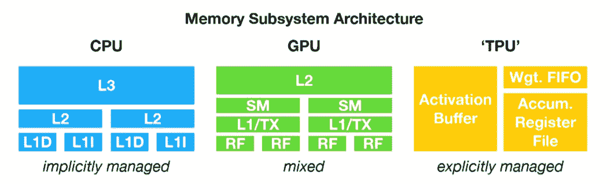
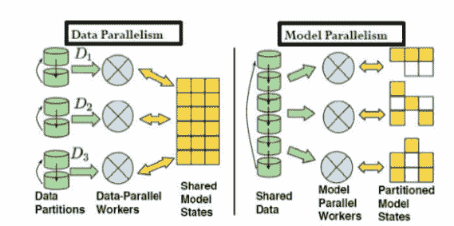
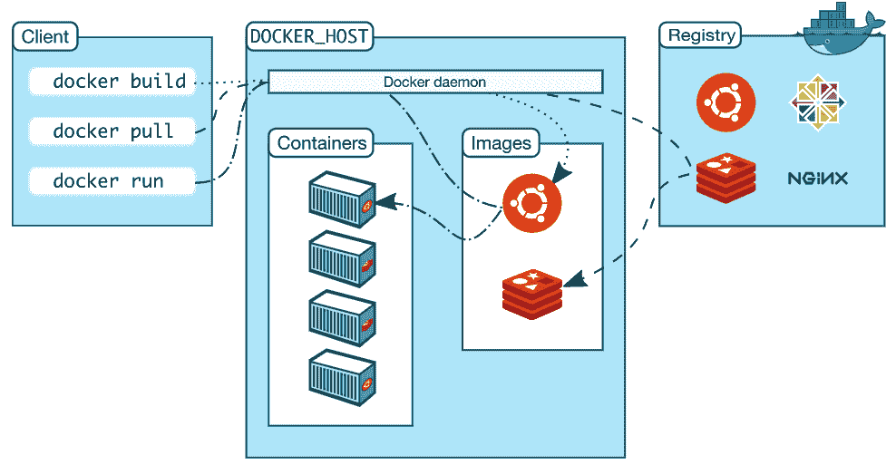
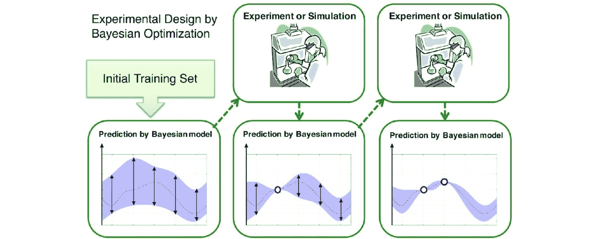

# 如何扩展 ML 项目——从经验中吸取的教训

> 原文：<https://web.archive.org/web/https://neptune.ai/blog/how-to-scale-ml-projects>

在过去的十年中，机器学习负责将数据转化为组织最有价值的资产。[利用 ML 应用构建商业解决方案](https://web.archive.org/web/20221206024809/https://www.einfochips.com/blog/how-to-develop-machine-learning-applications-for-business/)由于计算云基础设施的进步，使用海量数据集比以往任何时候都更容易，在计算云基础设施中，您可以托管和运行 ML 算法。

在企业层面，ML 模型已被应用于支持许多不同的业务方面，从数据源集成/数据域扩充到定制服务或产品推荐、业务运营成本节约等等。

作为数据科学社区的成员，我们都喜欢在白板上对 ML 模型进行头脑风暴，然后在我们的机器上开发模型。只要数据和/或模型是可管理的，这个一般过程就可以工作。然而，大规模这样做可能会变得极具挑战性。

例如，管理和处理大量数据，选择最佳而高效的训练算法，以及最终部署和监控大规模模型，这些都不是可以在白板上解决的小事。

幸运的是，有更好的方法来扩展和加速 ML 工作负载。在这篇文章中，我将分享我和我的团队面临的最大挑战，以及从大规模 ML 项目中吸取的经验教训。具体来说，我们将讨论:

*   什么是可伸缩性，为什么它很重要？
*   挑战和经验教训/我在扩展 ML 项目中的最佳实践。

## 什么是可伸缩性，为什么它很重要？

类似于软件开发，建立一个为你和你的团队工作的 ML 模型是很容易的，但是当你需要这个模型为世界各地的人工作时，它会变得非常复杂。如今，人们期望数据团队构建可扩展的应用程序，为数百万**用户、**驻留在数百万**地点、**以合理的**速度**工作。

这导致了一个被称为 [MLOps](/web/20221206024809/https://neptune.ai/blog/mlops-what-it-is-why-it-matters-and-how-to-implement-it-from-a-data-scientist-perspective) 的全新领域的兴起，致力于 ML 应用程序的容器化、编排和分发——所有这些都使得 ML 项目的扩展更加容易。

为什么可伸缩性很重要？用大量的数据和复杂的算法训练一个 ML 模型既耗费内存又耗费时间。通常不可能在本地计算机上完成。可伸缩性是指以经济高效的方式操作和计算庞大的数据集，这意味着处理大量数据更容易，同时还有其他好处:

在找到最佳模型之前，ML 模型开发包括大量的试验和错误。快速执行的无缝工作流将允许数据团队尝试更多想法并提高工作效率。

*   **加强模块化和团队协作**

大规模模块化使得复制和重用 ML 应用程序变得容易。因此，组织内的数据科学团队可以共享和协作，而不是各自为政地创建数百条管道。

*   **促进 ML 自动化，降低成本**:

具有最少人工干预的可扩展的自动化过程不仅使模型更不容易出错，而且还释放了资源来专注于更有影响力的任务。因此，扩展有助于最大限度地利用资源并降低业务成本。

现在，我们已经对 ML 可伸缩性及其给组织带来的好处有了基本的了解，让我们继续讨论我在开发可伸缩 ML 管道时面临的五个挑战，并讨论我在应对这些挑战时学到的经验。

## 挑战# 1——特性是最难做好的部分

ML 特征是作为系统输入的一组可测量的属性或特征。根据具体的项目，这些特征的来源可能无处不在，从存储在数据仓库中的表格数据表到人类语言和图像像素，最后到来自特征工程的衍生预测器。

为了服务于大规模的 ML 应用程序，我们需要访问和试验数十亿条记录，以创建我们的模型可以消化的有前途的特征的列表。我发现特征生成和存储的工作流程非常具有挑战性，尤其是在大规模完成时。诚然，有人可能会说，这可以通过拥有更强处理能力的机器或转向云服务器来轻松实现。

然而，以上所有只是冰山一角——对我的团队来说，最具挑战性的部分总是在模型在生产中实现的时候。在如此大的范围内，我们如何计算和连续监控特征以确保它们的统计属性保持相对稳定？最重要的是，随着更多的观察不断增加，我们如何存储这些特征以确保我们的模型在这个不断增长的数据集上得到适当的训练？

为了增加另一层挑战，一旦模型#1 投入生产，下一个模型出现，我的团队需要再次进行大规模的特征处理，因为它嵌入在之前的培训工作中。你可以想象这个 ML 基础设施导致了多少重复的工作！

### 经验教训

考虑到所有这些数据特征挑战，我的团队开始探索使用**(大规模)特征商店**的可能性，这是由[优步的米开朗基罗平台](https://web.archive.org/web/20221206024809/https://eng.uber.com/michelangelo-machine-learning-platform/)在 2017 年引入的概念。一个[特征库](/web/20221206024809/https://neptune.ai/blog/feature-stores-components-of-a-data-science-factory-guide)被称为一个集中的操作数据管理系统，它允许数据团队存储、共享和重用 ML 项目的策划特征。

*Feature Store as an important part of ML scalability |* [*Souce*](https://web.archive.org/web/20221206024809/https://www.logicalclocks.com/blog/feature-store-the-missing-data-layer-in-ml-pipelines)

人们普遍认为有两种类型的 ML 特性:离线和在线。离线特性主要用于离线批量操作，一般存储在传统的数据仓库中。相反，在线特性需要(近)实时计算和服务，并存储在键值格式的数据库中，以便快速查找值。大规模的特征存储，例如 Redis，具有支持(离线)批处理和(在线)低延迟服务的能力。

从模型监控的角度来看，要素存储以时间一致的方式维护所有历史数据以及最新值。这使得比较特征值和模型性能就像 API 调用一样简单。

此外，要素存储还有助于最大限度地减少重复工作，因为组织内的内部数据团队可以轻松访问存储在此集中位置的所有可用要素。一些数据科学专家甚至说，未来几年将是功能商店的时代。

## 挑战 2—数据科学编程语言可能会很慢，选择合适的处理器至关重要

一旦要素/输入预测值可供访问和使用(可能在要素存储中)，数据科学团队将启动模型开发流程。

大多数 ML 应用程序是用 Python 或 R 编写的，这是数据科学家中最流行的语言。对于我们的团队以及其他很多人来说，我们经常使用多种语言的组合来构建模型。

尽管我很喜欢用 Python 和 R 编写代码，但我不得不指出，出于速度的考虑，大规模的 ML 模型很少用这些语言进行产品化。与 Python 和 R 相比，更快的生产语言如 C/C++或 Java 更受青睐(与软件开发场景相同)。因此，将 Python 或 R 模型包装成 C/C++或 Java 给我们的团队带来了另一个挑战。

除了编程语言，还需要强大的处理器来执行迭代、繁重的计算操作。这使得硬件成为 ML 可扩展性中最关键的决策之一，尤其是关注矩阵乘法的快速执行。

### 经验教训

一句话:**就大规模的 ML 应用程序而言，Java 可能不是最好的语言，CPU 也可能不是最优的！**

Java 被认为是顶级的 ML 生产语言，主要是因为从业者认为它比 Python 或 r 执行得更快。Python 或 R 中的 ML 包经过优化，集成了 C/C++上的包装函数，这使得计算速度比原生 Java 更快。

同样的计算速度，从我的经验来看，由于顺序处理的性质，CPU 对于大规模的 ML 模型来说远非最佳。对于可能受益于并行处理的计算，GPU 是一个很好的选择。

*CPUs are far from optimal for ML models at scale due to their sequential* processing *nature* |[*Source*](https://web.archive.org/web/20221206024809/https://iq.opengenus.org/cpu-vs-gpu-vs-tpu/)

另一个进步是 ASICs(专用集成芯片)，例如，谷歌的 TPUs(张量处理单元)。为了降低计算复杂度和节省成本，TPU 被专门设计成在不访问存储器的情况下执行矩阵乘法。事实上，一个简单的 TPU 初始化是我的团队坚持使用 Google Tensorflow 框架的部分原因，即使考虑到不同版本 tensor flow 臭名昭著的兼容性问题。

## 挑战 3–分析数据太大和/或 ML 算法太复杂，单台机器无法处理

我的团队从事的项目之一是开发大规模图像分类算法。对于像这样有大规模数据和模型的项目，在单台计算机上进行 ML 的传统方法不再有效。这导致了分布式 ML 的解决方案，它可以以计算和内存可扩展的方式处理大数据和复杂算法。分布式 ML 背后的想法很直观:如果我们的算法不能在单个节点上完成，我们可以将计算工作量分布在多个节点上。

与分布式 ML 相关的一个概念是并行性或并行处理，它既指数据(处理)并行性，也指算法(构建)并行性。通过划分数据或 ML 模型并将计算工作分配给不同的工作人员，我们可以同时利用多个内核来获得更快的性能。事实上，在我们的图像分类项目中，我们能够通过分布式 ML 算法获得 10 倍的速度提升。

*Parallelism cans work with big data and complex algorithms in a computation- and memory-scalable way |* [*Source*](https://web.archive.org/web/20221206024809/https://www.slideshare.net/stanleywanguni/distributed-machine-learning)

最流行的开源分布式 ML 框架之一是 [Apache Hadoop](https://web.archive.org/web/20221206024809/https://hadoop.apache.org/) ，它提供了几种编程语言的 MapReduce API。另一个流行的是 [Apache Spark](https://web.archive.org/web/20221206024809/https://spark.apache.org/) ，它可以用来执行更快的内存计算。

就实现而言，大多数成熟的 ML 框架，如 [Tensorflow](https://web.archive.org/web/20221206024809/https://www.tensorflow.org/guide/distributed_training) 和 [PyTorch](https://web.archive.org/web/20221206024809/https://pytorch.org/tutorials/intermediate/dist_tuto.html) ，提供 API 来执行分布式计算，以便您的团队开始使用。

### 经验教训

一般来说，**分布式 ML** 工作有效，尤其是数据并行。然而，就算法/模型并行性而言，它可能无法正常工作。

算法并行，在 ML 应用的背景下，主要是关于矩阵操作。对于多个工人同时计算，我们需要将一个巨大的矩阵分成几个更小的部分，将几个分配给每个工人，最后通过工人之间的通信将结果收集回来。最后一步称为同步。在某些情况下，同步可能比分布式计算本身需要更长的时间，因为工作人员通常不会在同一时间完成。

正因为如此，[线性可伸缩性](https://web.archive.org/web/20221206024809/https://en.wikipedia.org/wiki/Scalability)(获得与增加的资源百分比相同的性能增加百分比的能力)几乎从未在真正的 ML 项目中发生过(至少从我的经验来看)。

您可能希望花费额外的时间和精力来检查同步后的输出，以确保您的分布式系统的正确配置和 ML 应用程序的收敛。

## 挑战# 4——ML 部署的框架版本和依赖性问题

问问任何一位已经启动大规模 ML 应用的数据科学家，他们面临的最大挑战是什么。有可能包版本和[依赖地狱](https://web.archive.org/web/20221206024809/https://en.wikipedia.org/wiki/Dependency_hell)会是其中之一，我们的团队也不例外。

当我们部署一个 ML 应用程序时，首先，我们必须确保产品化的模型一致地再现它的训练对应物。当 ML 模型涉及大量数据和/或复杂算法时，这一点尤为重要，因为它们可能需要更长的训练时间，并且如果出现任何问题，调试起来也更加困难。

对于我们的团队来说，包版本和依赖性问题是我们的 ML 模型在生产中运行时失败的主要原因。此外，由于对软件包版本的要求，我们过去在每个虚拟机上只托管一个产品化模型。

### 经验教训

如果你问软件开发人员，就编写大型程序而言，他们的最佳实践是什么，很可能将你的代码分成块是其中之一。

将这个想法应用到 ML 部署中，我建议利用 [**Docker 容器**](https://web.archive.org/web/20221206024809/https://docs.docker.com/get-started/overview/) ，将所有与模型相关的东西捆绑到一个运行在云中的包中。

*We can scale up ML using Docker |* [*Source*](https://web.archive.org/web/20221206024809/https://docs.docker.com/get-started/overview/)

讨论如何使用 Docker 扩展 ML 超出了本博客的范围。尽管如此，值得强调的是，Docker 容器让我的团队可以在同一个容器环境中运行大规模的工作，并在同一台机器上部署多个应用程序实例。

作为一个旁注/提示，所有的 Docker 图片并不都是一样的。谷歌的 [Tensorflow Docker images](https://web.archive.org/web/20221206024809/https://cloud.google.com/deep-learning-containers/docs/choosing-container) 经过了高度的性能优化，PyTorch 在 Tensorflow 图像中的运行速度要快于它们自己的 PyTorch 图像。当您为下一个大型 ML 应用程序选择数据科学框架时，这可能会很有用。

我们目前正在探索的另一个基础设施是微服务，这是一种使 ML 应用部署变得可访问的架构。我们将为 ML 管道的每个会话创建一个单独的微服务，这些微服务可以通过 RESTful APIs 访问。这将使我们的大型应用程序更有组织性和可管理性。

## 挑战# 5——大型 ML 应用从来都不是一次性交易，它需要高效的优化方法来通过迭代过程进行微调或再培训

我们已经建立了一个很好的模型并投入生产。现在是我们打开香槟瓶塞庆祝任务完成的时候了，对吗？很不幸，还没有。

这只是万里长征的第一步！随着我们的组织随着时间的推移获取新数据(在模型部署之后)，我们的应用程序将需要频繁的微调和再培训。

为了解决这个问题，我的团队提出了一个解决方案，当数据漂移(样本的统计属性发生变化)时，可以实现自动模型再训练。对于大规模的 ML 应用，由于时间和计算的高成本，模型调整或再训练可能是具有挑战性的；更不用说这是定期进行的。

诚然，ML 模型再训练的核心部分在于超参数调整。因此，选择和建立有效的超参数调整算法将是有益的。它将使我们能够使用更少的计算时间和成本实现高质量的模型，这是大规模 ML 应用程序的一个主要目标。

### 经验教训

在超参数搜索方法方面，有几种选择:随机搜索、网格搜索和 [**贝叶斯优化**](https://web.archive.org/web/20221206024809/https://en.wikipedia.org/wiki/Hyperparameter_optimization) 。从我的经验来看，对于大规模的 ML 应用，贝叶斯优化优于网格搜索和随机搜索；数据集/参数网格越大，潜在的效率增益就越高。

*The core component of ML model retraining lies in hyper-parameter tuning and it’s crucial for  ML applications at scale |* [*Source*](https://web.archive.org/web/20221206024809/https://www.sciencedirect.com/science/article/abs/pii/S2352924516300035)

这不应该令人惊讶，因为贝叶斯优化基本上是一种智能搜索策略，其中下一个超参数是以一种知情的方式选择的。它有助于减少最佳超参数组合的搜索时间。

| 挑战 | 吸取的教训 |
| --- | --- |
| 

特性是最难得到正确的组件

 | 

特征库为 ML 可扩展性提供特征存储、服务和管理支持

 |
| 

数据科学编程语言可能会很慢，选择合适的处理器至关重要

 | 

相对于 CPU

，GPU 和 TPU 是并行处理和复杂矩阵操作的更好选择 |
| 

分析数据太大和/或 ML 算法太复杂，单台机器无法处理

 | 

分布式 ML 通过利用多个工人有效地工作

 |
| 

框架版本与 ML 部署的依赖问题

 | 

Docker 容器保持 ML 应用的封装，从而在所有部署环境中保持一致，便于扩展

 |
| 

大型 ML 应用从来都不是一蹴而就的，它需要高效的优化方法来通过迭代过程进行微调或再培训

 |  |

作为一个额外的提示，在整个组织中扩展性能良好的 ML 应用程序永远不可能通过筒仓工作来实现。它需要**相互联系和协作的努力**。数据科学、数据工程、数据架构师、DevOps 和所有其他相关团队之间的参与和沟通对于识别 ML 应用不同阶段的潜在风险至关重要。此外，预先定义角色和职责以避免跨 ML 管道的重复工作同样重要。

扩展 ML 应用程序并不容易！希望我在这篇文章中的经验和教训能让你的大规模 ML 应用之旅变得容易一些。感谢您的阅读！