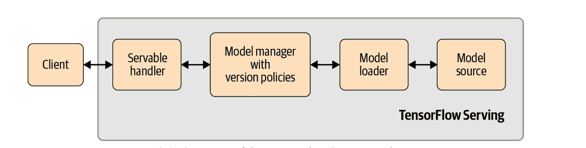
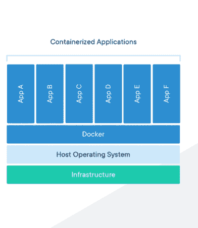

# 如何用 TensorFlow 服务和 Docker 服务机器学习模型

> 原文：<https://web.archive.org/web/https://neptune.ai/blog/how-to-serve-machine-learning-models-with-tensorflow-serving-and-docker>

机器学习(ML)有可能极大地改善业务，但这只有在模型投入生产并且用户可以与之互动的情况下才能实现。

像[亚马逊](https://web.archive.org/web/20221206051444/https://www.fastcompany.com/90246028/how-ai-is-helping-amazon-become-a-trillion-dollar-company)、[微软](https://web.archive.org/web/20221206051444/https://www.infoworld.com/article/2886132/how-machine-learning-ate-microsoft.html#:~:text=Machine%20learning%20has%20infiltrated%20Microsoft,Windows%208%20to%20Xbox%20games.&text=Now%2C%20with%20machine%20learning%20available,%2C%20fault%20prediction%2C%20and%20more.)、[谷歌](https://web.archive.org/web/20221206051444/https://www.wired.com/2016/06/how-google-is-remaking-itself-as-a-machine-learning-first-company/)、[苹果](https://web.archive.org/web/20221206051444/https://9to5mac.com/2020/08/06/apple-using-machine-learning/)、[脸书](https://web.archive.org/web/20221206051444/https://www.facebook.com/business/news/good-questions-real-answers-how-does-facebook-use-machine-learning-to-deliver-ads)这样的全球性公司，都有数百款 ML 机型在生产。从[更好的搜索](https://web.archive.org/web/20221206051444/https://blog.google/products/search/search-language-understanding-bert/)到[推荐引擎](https://web.archive.org/web/20221206051444/https://www.amazon.science/the-history-of-amazons-recommendation-algorithm)，到[数据中心冷却费用降低 40%](https://web.archive.org/web/20221206051444/https://deepmind.com/blog/article/deepmind-ai-reduces-google-data-centre-cooling-bill-40)，这些公司已经开始在他们业务的许多关键方面依赖 ML。将模型投入生产并不是一件容易的事情，虽然该过程与传统软件相似，但它有一些微妙的差异，如模型再训练、数据偏斜或数据漂移，这些都应该考虑在内。

放置 ML 模型的过程不是一个单一的任务，而是许多子任务的组合，每个子任务都有其自身的重要性。这样的子任务之一是模型服务。

> “模型服务就是展示一个经过训练的模型，以便端点可以访问它。这里的端点可以是直接用户或其他软件。

在本教程中，我将向您展示如何使用 [Tensorflow Serving](https://web.archive.org/web/20221206051444/https://www.tensorflow.org/tfx/guide/serving) 来服务 ML 模型，这是一个高效、灵活、高性能的机器学习模型服务系统，专为生产环境而设计。

具体来说，您将学习:

*   如何使用 docker 安装 Tensorflow 服务
*   用 Tensorflow 训练并保存一个简单的图像分类器
*   使用 Tensorflow 服务服务保存的模型

在本教程结束时，您将能够获取任何保存的 Tensorflow 模型，并使其可供其他人使用。

## 开始之前(先决条件)

为了充分理解本教程，假设您:

以下是一些帮助您开始的链接:

现在简单说一下 Tensorflow 发球(TF 发球)。

## Tensorflow 服务简介

> “TensorFlow 服务是一个灵活、高性能的机器学习模型服务系统，专为生产环境而设计。TensorFlow 服务使部署新算法和实验变得容易，同时保持相同的服务器架构和 API。TensorFlow 服务提供与 TensorFlow 模型的现成集成，但可以轻松扩展以服务于其他类型的模型。”
> — [来源](https://web.archive.org/web/20221206051444/https://www.tensorflow.org/tfx/guide/serving)

简单地说，TF Serving 允许您通过模型服务器轻松地公开一个经过训练的模型。它提供了一个灵活的 API，可以很容易地与现有系统集成。

大多数模型服务教程展示了如何使用 Flask 或 Django 构建的 web 应用程序作为模型服务器。虽然这对于演示来说没问题，但在生产场景中效率非常低。

根据 Oreily 的“[构建机器学习管道](https://web.archive.org/web/20221206051444/https://www.oreilly.com/library/view/building-machine-learning/9781492053187/)”一书，你不应该依赖传统 web 应用来服务 ML 模型的一些原因包括:

1.  **缺乏有效的模型版本控制:**对经过训练的模型进行正确的版本控制非常重要，而大多数为服务模型而构建的 web 应用程序可能会错过这一部分，或者如果存在的话，管理起来可能会非常复杂。
2.  **缺乏代码分离:**数据科学/机器学习代码变得与软件/DevOps 代码交织在一起。这很糟糕，因为数据科学团队与软件/DevOps 团队有很大的不同，因此，当两个团队在相同的代码库上工作时，适当的代码管理会成为一种负担。
3.  **低效的模型推理:**用 Flask/Django 构建的 web apps 中的模型推理通常是低效的。

Tensorflow 服务为您解决了这些问题。它处理模型服务、版本管理，让您基于策略服务模型，并允许您从不同的源加载您的模型。它在谷歌和世界各地的许多组织内部使用。

您是否知道，由于 TensorFlow + Neptune 集成，您可以跟踪您的模型训练？在我们的[文档](https://web.archive.org/web/20221206051444/https://docs.neptune.ai/essentials/integrations/deep-learning-frameworks/tensorflow-keras)中了解更多信息。

## 张量流服务架构

在下图中，您可以看到 TF 服务架构的概述。这个高级架构显示了构成 TF 服务的重要组件。



*Overview of the TensorFlow Serving architecture (*[*Source*](https://web.archive.org/web/20221206051444/https://www.oreilly.com/library/view/building-machine-learning/9781492053187/)*)*

在上图中从右到左，让我们从模型源开始:

*   **模型源**提供插件和功能来帮助你从多个位置(例如 GCS 或 AWS S3 桶)加载模型或 TF 服务术语*服务*。一旦模型被加载，下一个组件——模型加载器——就会得到通知。
*   **模型加载器**提供了从给定的源加载模型的功能，与模型类型无关，甚至与用例的数据类型无关。简而言之，模型加载器提供了从源代码加载和卸载模型(可服务的)的有效功能。
*   **模型管理器**处理模型的整个生命周期。也就是说，它管理何时进行模型更新、使用哪个版本的模型进行推理、推理的规则和策略等等。
*   Servable 处理程序提供了与 TF 服务通信所必需的 API 和接口。TF serving 提供了两种重要的可服务处理程序——[REST](https://web.archive.org/web/20221206051444/https://en.wikipedia.org/wiki/Representational_state_transfer)和 [gRPC](https://web.archive.org/web/20221206051444/https://en.wikipedia.org/wiki/GRPC) 。在本教程的后面部分，您将了解这两者之间的区别。

有关 TS 架构的更多详细信息，请访问下面的官方指南:

在下一节中，我将绕一点弯路来快速介绍 Docker。这是一个可选部分，我在这里介绍它是因为在安装 TF Serving 时您将使用 Docker。

## Docker 简介和安装指南

Docker 是一个计算机程序，它使开发者能够以一种在另一台机器上容易复制的方式轻松打包应用程序或软件。Docker 使用容器，它允许您将应用程序及其库和依赖项打包成一个单独的包，可以在另一个环境中部署。

Docker 类似于[虚拟机](https://web.archive.org/web/20221206051444/https://en.wikipedia.org/wiki/Virtual_machine),只有一些细微的区别，其中之一是 Docker 使用相同的操作系统，而 VMs 使用不同的操作系统实例来将应用程序相互隔离。



*Containerized Application ([Source](https://web.archive.org/web/20221206051444/https://www.docker.com/resources/what-container))*

虽然我不会深入研究 Docker，但我会带您安装它并提取一个简单的 hello world Docker 映像。

首先，为您的操作系统下载并安装 Docker:

通过各自的安装程序下载并安装 Docker 后，在终端/命令提示符下运行以下命令，以确认 Docker 已成功安装:

```py
 docker run hello-world

```

它应该输出:

```py
Unable to find image ‘hello-world:latest’ locally
latest: Pulling from library/hello-world
0e03bdcc26d7: Pull complete
Digest: sha256:4cf9c47f86df71d48364001ede3a4fcd85ae80ce02ebad74156906caff5378bc
Status: Downloaded newer image for hello-world:latest
Hello from Docker!
This message shows that your installation appears to be working correctly.
To generate this message, Docker took the following steps:
1. The Docker client contacted the Docker daemon.
2. The Docker daemon pulled the “hello-world” image from the Docker Hub. (amd64)
3. The Docker daemon created a new container from that image which runs the executable that produces the output you are currently reading.
4. The Docker daemon streamed that output to the Docker client, which sent it to your terminal.
```

如果您得到上面的输出，那么 Docker 已经成功安装在您的系统上。

### **安装 Tensorflow 服务**

现在您已经正确安装了 Docker，您将使用它来下载 TF Serving。


没有 Docker 也可以安装 Tensorflow Serving，但是推荐使用 Docker，而且肯定是最简单的。

在您的终端中运行以下命令:

```py
docker pull tensorflow/serving

```

这需要一些时间，完成后，将从 [Docker Hub](https://web.archive.org/web/20221206051444/https://hub.docker.com/) 下载 Tensorflow 服务图像。

如果您在具有 GPU 的实例上运行 Docker，您也可以安装 GPU 版本:

```py
docker pull tensorflow/serving:latest-gpu
```

恭喜你。Tensorflow 服务已安装。在下一节中，您将使用 TensorFlow Keras 训练并保存一个简单的图像分类器。

## 构建、训练和保存影像分类模型

为了演示模型服务，您将使用 Tensorflow 为手写数字创建一个简单的图像分类器。如果您没有安装 TensorFlow，请在此处遵循本指南[。](https://web.archive.org/web/20221206051444/https://www.tensorflow.org/install)


这不是一个模型优化教程，因此重点是简单性。因此，您不会进行任何大范围的超参数调整，并且构建的模型可能不是最佳的。

[MNIST 手写数字分类数据集](https://web.archive.org/web/20221206051444/https://en.wikipedia.org/wiki/MNIST_database)是一个非常流行的图像分类任务。它包含人类手写的数字，任务是将这些数字分类为 0 到 9 之间的数字。因为数据集非常受欢迎，Tensorflow 预装了它，因此，您可以轻松地加载它。


* MNIST Handwritten dataset ([Source](https://web.archive.org/web/20221206051444/https://en.wikipedia.org/wiki/MNIST_database#/media/File:MnistExamples.png))*

下面，我将指导您加载数据集，然后构建一个简单的深度学习分类器。

**步骤 1:** 创建一个新的项目目录，并在代码编辑器中打开它。我调用我的 **tf-server，**，并在 VsCode 中打开它。

**第二步:**在项目文件夹中，创建一个名为 **model.py，**的新脚本，并粘贴下面的代码:

```py
import matplotlib.pyplot as plt
import time
from numpy import asarray
from numpy import unique
from numpy import argmax
from tensorflow.keras.datasets.mnist import load_data
from tensorflow.keras import Sequential
from tensorflow.keras.layers import Dense
from tensorflow.keras.layers import Conv2D
from tensorflow.keras.layers import MaxPool2D
from tensorflow.keras.layers import Flatten
from tensorflow.keras.layers import Dropout

(x_train, y_train), (x_test, y_test) = load_data()
print(f'Train: X={x_train.shape}, y={y_train.shape}')
print(f'Test: X={x_test.shape}, y={y_test.shape}')

x_train = x_train.reshape((x_train.shape[0], x_train.shape[1], x_train.shape[2], 1))
x_test = x_test.reshape((x_test.shape[0], x_test.shape[1], x_test.shape[2], 1))

x_train = x_train.astype('float32') / 255.0
x_test = x_test.astype('float32') / 255.0

input_shape = x_train.shape[1:]

n_classes = len(unique(y_train))

model = Sequential()
model.add(Conv2D(64, (3,3), activation='relu', input_shape=input_shape))
model.add(MaxPool2D((2, 2)))
model.add(Conv2D(32, (3,3), activation='relu'))
model.add(MaxPool2D((2, 2)))
model.add(Flatten())
model.add(Dense(50, activation='relu'))
model.add(Dropout(0.5))
model.add(Dense(n_classes, activation='softmax'))

model.compile(optimizer='adam', loss='sparse_categorical_crossentropy', metrics=['accuracy'])

model.fit(x_train, y_train, epochs=10, batch_size=128, verbose=1)

loss, acc = model.evaluate(x_test, y_test, verbose=0)
print('Accuracy: %.3f' % acc)

ts = int(time.time())
file_path = f"./img_classifier/{ts}/"
model.save(filepath=file_path, save_format='tf')

```

上面的代码非常简单，首先，导入将要使用的必要包，并加载预先打包了 Tensorflow 的 MNIST 数据集。然后，您将数据整形为使用单通道(黑白)，然后通过除以 1/255.0 进行归一化。

接下来，您创建一个简单的卷积神经网络(CNN ),在输出端有 9 个类，因为您要预测 10 个类(0–9)。然后，通过指定优化器、损失函数和指标来编译模型。

接下来，使用 128 的批量大小来拟合 10 个时期的模型。拟合后，你在测试数据上评估，打印精度，最后保存模型。

保存模型的代码是基于时间戳的。这是一个很好的做法，强烈推荐。

您可以检查文件夹中保存的模型。它应该类似于下图所示:

```py
├── img_classifier
│ ├── 1600788643
│ │ ├── assets
│ │ ├── saved_model.pb
│ │ └── variables

```

## 使用 Tensorflow 服务服务保存的模型

一旦保存了模型，并且 Docker 正确安装了 [Tensorflow Serving](https://web.archive.org/web/20221206051444/https://www.tensorflow.org/tfx/guide/serving) ，您就可以将其作为 API 端点。

值得一提的是，Tensorflow 服务支持两种类型的 API 端点— REST 和 gRPC。

*   **REST** 是 web 应用使用的一种通信“协议”。它定义了客户端如何与 web 服务通信的通信方式。REST 客户机使用标准的 HTTP 方法(如 GET、POST、DELETE 等)与服务器通信。请求的有效负载大多以 JSON 格式编码
*   [**gRPC**](https://web.archive.org/web/20221206051444/https://en.wikipedia.org/wiki/GRPC) 另一方面是最初在谷歌开发的通信协议。gRPC 使用的标准数据格式称为[协议缓冲区](https://web.archive.org/web/20221206051444/https://developers.google.com/protocol-buffers)。gRPC 提供了低延迟的通信和比 REST 更小的负载，在推理过程中处理非常大的文件时是首选。

在本教程中，您将使用 REST 端点，因为它更容易使用和检查。还应该注意的是，Tensorflow 服务将在您运行它时提供两个端点，因此您不需要担心额外的配置和设置。

按照以下步骤为您的模型提供服务:

首先在你的项目文件夹中**、**，打开一个终端，并在下面添加 Docker 命令:

```py
docker run -p 8501:8501 --name tfserving_classifier
--mount type=bind,source=/Users/tf-server/img_classifier/,target=/models/img_classifier
-e MODEL_NAME=img_classifier -t tensorflow/serving

```

让我们来理解每一个论点:

*   **-p 8501:8501:** 这是 REST 端点端口。每个预测请求都将发送到该端口。例如，您可以向 [http://localhost:8501](https://web.archive.org/web/20221206051444/http://localhost:8501/) 发出一个预测请求。
*   **—名称 tfserving_classifier:** 这是给予运行 tfserving 的 Docker 容器的名称。它可用于稍后启动和停止容器实例。
*   **— mount type=bind，source =/Users/TF-server/img _ classifier/，target =/models/img _ classifier:**mount 命令只是将模型从指定路径(**/Users/TF-server/img _ classifier/**)复制到 Docker 容器( **/models/img_classifier** )中，这样 TF Serving 就可以访问它了。


如果遇到路径错误:


*docker:来自守护程序的错误响应:类型“bind”的挂载配置无效:绑定源路径不存在:/User/TF-server/img _ classifier/。*


然后指定模型文件夹的完整路径。记住，不是模型本身，而是模型文件夹。

*   **-e MODEL _ NAME = img _ classifier:**要运行的模型名称。这是您用来保存模型的名称。
*   **-t tensorflow/serving:** 要运行的 TF Serving Docker 容器。

运行上面的命令启动 Docker 容器，TF Serving 公开 gRPC (0.0.0.0:8500)和 REST (localhost:8501)端点。

既然端点已经启动并运行，您可以通过 HTTP 请求对它进行推理调用。下面我们来演示一下。

在您的项目文件夹中创建一个名为 **predict.py，**的新脚本，并添加以下代码行来导入一些包:

```py
import matplotlib.pyplot as plt
import requests
import json
import numpy as np
from tensorflow.keras.datasets.mnist import load_data

```

**requests** 包用于构造 HTTP 调用并将其发送到服务器，而 **json** 包将用于在发送数据(图像)之前对其进行解析。

接下来，您将加载数据并对其进行预处理:

```py
(_, _), (x_test, y_test) = load_data()

x_test = x_test.reshape((x_test.shape[0], x_test.shape[1], x_test.shape[2], 1))

x_test = x_test.astype('float32') / 255.0

```

注意，我们只关心这里的测试数据。您将加载它，并执行您在模型训练期间添加的相同预处理步骤。

接下来，定义 REST 端点 URL:

```py
url = 'http://localhost:8501/v1/models/img_classifier:predict'

```

预测 URL 由几个重要部分组成。一般结构可能如下所示:

**http://{ HOST }:{ PORT }/v1/models/{ MODEL _ NAME }:{ VERB }**

*   **主机**:您的模型服务器的域名或 IP 地址
*   **端口**:你的 URL 的服务器端口。默认情况下，TF Serving 对 REST 端点使用 8501。
*   **MODEL_NAME** :你服务的模特的名字。
*   **动词**:动词与你的模特签名有关。您可以指定*预测*、*分类*或*回归*之一。

接下来，添加一个向端点发出请求的函数:

```py
def make_prediction(instances):
   data = json.dumps({"signature_name": "serving_default", "instances": instances.tolist()})
   headers = {"content-type": "application/json"}
   json_response = requests.post(url, data=data, headers=headers)
   predictions = json.loads(json_response.text)['predictions']
   return predictions

```

在上面的预测代码中，首先定义一个 JSON 数据负载。TF Serving 期望数据为 JSON，格式为:

***{ "签名 _ 名称":"<字符串>"，***
***"实例":<值> }***

“**签名名**”是可选的，可以忽略。“**实例**”另一方面是您想要预测的数据/输入/实例。你应该把它作为一个列表来传递。

构造完参数后，您向端点发送一个请求，并加载返回的响应。

为了测试这一点，您将对 4 幅测试图像进行预测，如下所示:


要运行 **predict.py** 文件，在新的终端窗口中运行`python predict.py`之前，确保 TF 服务容器仍然是活动的。

```py
predictions = make_prediction(x_test[0:4])

```

```py
//output
[[1.55789715e-12, 1.01289466e-08, 1.07480628e-06, 1.951177e-08, 1.01430878e-10,
5.59054842e-12, 1.90570039e-17, 0.999998927, 4.16908175e-10, 5.94038907e-09],
[6.92498414e-09, 1.17453965e-07, 0.999999762, 5.34944755e-09, 2.81366846e-10,
1.96253143e-13, 9.2470593e-08, 3.83119664e-12, 5.33368405e-10, 1.53420621e-14],
[3.00994889e-11, 0.999996185, 4.14686845e-08, 3.98606517e-08, 3.23575978e-06,
1.82125728e-08, 2.17237588e-08, 1.60862257e-07, 2.42824342e-07, 4.56675897e-09],
[0.999992132, 5.11100086e-11, 2.94807769e-08, 1.22479553e-11, 1.47668822e-09,
4.50467552e-10, 7.61841738e-06, 2.56232635e-08, 6.94065747e-08, 2.13664606e-07]] 
```

这将返回一个与您预测的 4 幅图像相对应的 4x 10 数组，以及每个类别的概率值(0–9)。

要获得实际的预测类，可以使用如下所示的“np.argmax”函数:

```py
for pred in predictions:
    print(np.argmax(pred))

```

```py
 7
2
1
0 
```

您还可以通过与真实值进行比较来检查预测的正确程度，如下所示:

```py
for i, pred in enumerate(predictions):
    print(f"True Value: {y_test[i]}, Predicted Value: {np.argmax(pred)}")

```

```py
//output
True Value: 7, Predicted Value: 7
True Value: 2, Predicted Value: 2
True Value: 1, Predicted Value: 1
True Value: 0, Predicted Value: 0
```

**predict.py** 的完整代码如下所示:

```py
import matplotlib.pyplot as plt
import requests
import base64
import json
import numpy as np
from tensorflow.keras.datasets.mnist import load_data

(_, _), (x_test, y_test) = load_data()

x_test = x_test.reshape((x_test.shape[0], x_test.shape[1], x_test.shape[2], 1))

x_test = x_test.astype('float32') / 255.0

url = 'http://localhost:8501/v1/models/img_classifier:predict'

def make_prediction(instances):
   data = json.dumps({"signature_name": "serving_default", "instances": instances.tolist()})
   headers = {"content-type": "application/json"}
   json_response = requests.post(url, data=data, headers=headers)
   predictions = json.loads(json_response.text)['predictions']
   return predictions

predictions = make_prediction(x_test[0:4])

for i, pred in enumerate(predictions):
   print(f"True Value: {y_test[i]}, Predicted Value: {np.argmax(pred)}")

```

就是这样！您已经能够:

*   保存一个训练好的模型，
*   启动 TF 服务服务器，
*   并向其发送预测请求。

TF Serving 为您处理所有的模型和 API 基础设施，以便您可以专注于模型优化。

请注意，一旦新模型出现在 model 文件夹中，TF serving 就会自动加载它。例如，更改模型的一些参数，如历元大小，然后重新训练模型。

一旦训练完成并且您保存了模型，TF Serving 会自动检测这个新模型，卸载旧模型，并加载新版本。

模型的自动热交换非常有效，并且可以很容易地内置到 [ML CI/CD 管道](/web/20221206051444/https://neptune.ai/blog/continuous-integration-for-machine-learning-with-github-actions-and-neptune)中，这样您就可以更专注于模型优化，而不是模型服务基础设施。

## 使用 Tensorflow 服务的最佳实践

*   通过 Docker 容器使用 TF 服务是明智的，也更容易，因为这可以很容易地与现有系统集成。如果需要更多的自定义构建或安装，可以从源代码构建 TF Serving。跟随向导[到这里](https://web.archive.org/web/20221206051444/https://github.com/tensorflow/serving/blob/master/tensorflow_serving/g3doc/building_with_docker.md)。
*   在推理过程中处理大型数据集时，[使用 gRPC 作为端点](https://web.archive.org/web/20221206051444/https://medium.com/@avidaneran/tensorflow-serving-rest-vs-grpc-e8cef9d4ff62)会更有效。另外，请参见在 Kubernetes 上设置 [TF 服务。](https://web.archive.org/web/20221206051444/https://github.com/tensorflow/serving/blob/master/tensorflow_serving/g3doc/serving_kubernetes.md)
*   在 Docker 运行阶段加载模型时，可能会出现路径错误。您可以通过指定完整路径而不是绝对路径来解决这个问题。
*   建议将 TF 引入 [TFX 管道](https://web.archive.org/web/20221206051444/https://www.tensorflow.org/tfx)。这样模特在由 TF 上菜前会被[自动审查](https://web.archive.org/web/20221206051444/https://www.tensorflow.org/tfx/guide/evaluator)。
*   有时，默认端口 8501 可能不可用或被其他系统进程使用，您可以在运行 Docker 映像时轻松地将其更改为另一个端口。

## 结论

在本教程中，您学习了如何:

*   通过 Docker 安装 Tensorflow 服务
*   训练并保存张量流图像分类器
*   通过 REST 端点服务保存的模型
*   通过 TF 服务端点使用模型进行推理

有了这些知识，您就可以为生产环境构建高效的模型管道，不仅可以伸缩，而且可以适当伸缩！

**[将](https://web.archive.org/web/20221206051444/https://github.com/risenW/tensorflow_serving_app)链接到 Github 上的项目代码**