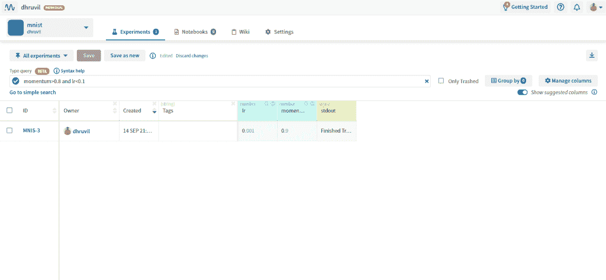

# 如何构建和管理自然语言处理(NLP)项目

> 原文：<https://web.archive.org/web/https://neptune.ai/blog/how-to-structure-and-manage-nlp-projects-templates>

如果说我在 ML 行业工作中学到了什么的话，那就是:**机器学习项目很乱。**

这并不是说人们不想把事情组织起来，只是在项目过程中有很多事情很难组织和管理。

你可以从头开始，但有些事情会阻碍你。

一些典型的原因是:

*   笔记本中的快速数据探索，
*   取自 github 上的研究报告的模型代码，
*   当一切都已设置好时，添加新的数据集，
*   发现了数据质量问题并且需要重新标记数据，
*   团队中的某个人“只是快速地尝试了一些东西”,并且在没有告诉任何人的情况下改变了训练参数(通过 argparse 传递),
*   从高层推动将原型转化为产品“仅此一次”。

多年来，作为一名机器学习工程师，我学到了一堆**东西，它们可以帮助你保持在事物的顶端，并检查你的 NLP 项目**(就像你真的可以检查 ML 项目一样:)。

在这篇文章中，我将分享我在从事各种数据科学项目时学到的关键指针、指南、技巧和诀窍。许多东西在任何 ML 项目中都是有价值的，但有些是 NLP 特有的。

涵盖的要点:

*   创建良好的项目目录结构
*   处理变化的数据:数据版本化
*   跟踪 ML 实验
*   正确评估和管理指标和 KPI
*   模型部署:如何正确使用

让我们跳进来。

## 目录结构

数据科学工作流由多个元素组成:

*   数据，
*   模特，
*   报告，
*   培训脚本，
*   超参数，
*   诸如此类。

拥有一个跨团队一致的公共框架通常是有益的。很可能你有多个团队成员在同一个项目中工作。

有许多方法可以开始构建您的数据科学项目。您甚至可以根据团队的特定需求创建自定义模板。

然而，最简单快捷的方法之一就是使用[千篇一律的](https://web.archive.org/web/20221018044836/https://drivendata.github.io/cookiecutter-data-science/)模板。它会自动为您生成一个全面的项目目录。

```py
├── LICENSE
├── Makefile           <- Makefile with commands like `make data` or `make train`
├── README.md          <- The top-level README for developers using this project.
├── data
│   ├── external       <- Data from third party sources.
│   ├── interim        <- Intermediate data that has been transformed.
│   ├── processed      <- The final, canonical data sets for modeling.
│   └── raw            <- The original, immutable data dump.
│
├── docs               <- A default Sphinx project; see sphinx-doc.org for details
│
├── models             <- Trained and serialized models, model predictions, or model summaries
│
├── notebooks          <- Jupyter notebooks. Naming convention is a number (for ordering),
│                         the creator's initials, and a short `-` delimited description, e.g.
│                         `1.0-jqp-initial-data-exploration`.
│
├── references         <- Data dictionaries, manuals, and all other explanatory materials.
│
├── reports            <- Generated analysis as HTML, PDF, LaTeX, etc.
│   └── figures        <- Generated graphics and figures to be used in reporting
│
├── requirements.txt   <- The requirements file for reproducing the analysis environment, e.g.
│                         generated with `pip freeze > requirements.txt`
│
├── setup.py           <- Make this project pip installable with `pip install -e`
├── src                <- Source code for use in this project.
│   ├── __init__.py    <- Makes src a Python module
│   │
│   ├── data           <- Scripts to download or generate data
│   │   └── make_dataset.py
│   │
│   ├── features       <- Scripts to turn raw data into features for modeling
│   │   └── build_features.py
│   │
│   ├── models         <- Scripts to train models and then use trained models to make
│   │   │                 predictions
│   │   ├── predict_model.py
│   │   └── train_model.py
│   │
│   └── visualization  <- Scripts to create exploratory and results oriented visualizations
│       └── visualize.py
│
└── tox.ini            <- tox file with settings for running tox; see tox.testrun.org
```

如您所见，它几乎涵盖了您工作流程中的每一个重要组成部分——数据、文档、模型、报告、可视化。

### 寻找可视化工具？

## 数据版本化

机器学习是一个迭代的过程。如果你是一名专业的数据科学家，你会注意到最大的不同是，数据不像在竞争或研究基准数据集中那样定义良好。

**研究数据集应该是干净的**。在研究中，目标是建立一个更好的架构。研究环境中更好的结果应该归功于新颖的架构，而不是聪明的数据清理技巧。

当涉及到生产中使用的**数据时，需要做的不仅仅是简单地预处理数据和删除非 unicode 字符。还有更严重的问题，比如:**

*   **错误或不准确的注释**–专业数据科学家花费大量时间了解数据生成过程，因为这几乎会影响他做出的任何进一步决策。人们应该知道以下问题的答案:
    *   谁注释了数据？
    *   在使用产品时，是否有一个独立的团队或由用户注释？
    *   您是否需要具备深厚的领域知识才能成功地注释数据？(例如，医疗保健相关数据就是这种情况)

*   **数据的时间线**–如果 90 万行数据是很久以前生成的，那么拥有 100 万行数据是没有用的。在消费产品中，用户行为随着趋势或产品修改而不断变化。数据科学家应该问这样的问题:
    *   数据生成的频率如何？
    *   数据生成过程中是否有任何差距(可能生成数据的产品功能被暂时取消了)？
    *   我如何知道我不是在用旧趋势的数据建模(例如在时尚服装推荐中)

*   **数据中的任何偏差**–数据中的偏差可以是各种类型。其中很多是由于定义不清的数据收集过程造成的。其中一些是:
    *   **抽样偏倚**–收集的数据不代表总体数据。如果数据具有“年龄”特征，偏见可能导致年轻人的比例过高。
    *   **测量偏差**–一部分数据用一种仪器测量，另一部分用不同的仪器测量。这可能发生在重工业，那里的机器经常更换和维修。
    *   **标签中的偏差**–情感分析任务中的标签可能非常主观。这还取决于标签是由专门的注释团队分配还是由最终用户分配。

考虑 NLP 中的[文本分类任务，并假设您的产品在全球范围内工作。你可以收集来自世界各地的用户评论。假设印度的用户评论具有与主要语言是英语的美国或英国的用户相似的单词分布是不实际的。在这里，您可能想要创建一个单独的区域版本历史。](/web/20221018044836/https://neptune.ai/blog/document-classification-small-datasets)

**这些与您的数据科学工作流程有什么关系？**

通常情况下，您开始使用的数据与您构建最终模型时使用的数据大相径庭。对于您在数据中所做的每一个更改，您都需要对其进行版本化。就像你用 Git 控制你的代码版本一样。为此，您可能需要查看一下数据版本控制( [DVC](https://web.archive.org/web/20221018044836/https://dvc.org/) )。

## 实验跟踪

构建模型有时很有趣，但实际上通常很无聊。考虑建立一个 LSTM(长短期记忆网络)进行分类。有学习率、堆叠层数、隐藏维度、嵌入维度、优化器超参数，以及更多要调整的参数。记录每一件事会让人不知所措。

为了节省时间，一个优秀的数据科学家会试图形成一种直觉，判断超参数的什么值有效，什么值无效。记住你已经形成的度量目标是很重要的。您可能想要跟踪哪些关键值？

*   超参数
*   模型大小(针对内存限制)
*   推理时间
*   超过基线的增益
*   优点和缺点(如果模型支持词汇外的单词(如 fasttext)或不支持(如 word2vec)
*   任何有用的注释(例如–*)都使用了具有高初始学习率的调度器。比使用恒定的学习速率更有效。*

通常，尝试越来越多的实验来从模型中榨取每一盎司的准确性是很诱人的。但是在商业环境中(与 kaggle 竞赛或研究论文相反),一旦指标达到，实验就应该暂停。

Neptune 的简单 API 可以让你追踪实验的每一个细节，并通过它的用户界面进行有效的分析。我第一次使用海王星，花了几分钟开始跟踪我的实验。



您可以查看您的实验，通过超参数值和指标进行筛选，甚至可以查询-*“momentum = 0.9 和 lr<0.01”*。

海王星[记录你的。py 脚本](https://web.archive.org/web/20221018044836/https://docs.neptune.ai/you-should-know/logging-and-managing-runs-results/logging-runs-data)，使你的损失曲线(或一般的任何曲线)交互式可视化，甚至[测量你的 CPU/GPU 利用率](https://web.archive.org/web/20221018044836/https://docs.neptune.ai/how-to-guides/ml-run-monitoring/monitor-model-training-runs-live)。

另一个好处是，当你在团队中工作时，所有这些变得更加有用。有了 Neptune，分享成果和在想法上合作变得出奇的简单。

最棒的是，它有一个免费的个人计划，允许用户通过无限制的实验(公共或私人)和无限制的笔记本检查点存储高达 100 GB 的数据。

## 检查模型预测(误差分析)

下一步包括深入的错误分析。例如，在情绪分析任务中(有三种情绪——积极、消极和中立),问以下问题会有所帮助:

*   创建一个基线:在投入实验之前创建一个基线总是一个好主意。你不希望你的 BERT 模型比 TF-IDF +逻辑分类器的性能稍好。你想让它把你的底线打出水面。始终将您的模型与基线进行比较。我的基线在哪些方面比复杂模型表现得更好？因为基线通常是可解释的，你也可以洞察你的黑盒模型。

*   **度量分析:**每个类的精度和召回率是多少？我的错误分类“泄露”到哪里去了？如果负面情绪的大多数错误分类被预测为中性，那么您的模型在区分这两个类别时会遇到困难。对此进行分析的一个简单方法是制作一个混淆矩阵。

*   **低置信度预测分析:**模型正确但分类置信度低的例子是怎样的？在这种情况下，预测类别的最小概率可以是 0.33 (⅓):
    *   如果模型预测正确率为 0.35，检查那些例子，看看它们是否真的很难识别。
    *   如果该模型以 0.35 的概率正确预测了一个明显积极的评论，如“*我很高兴我做了好工作*”，那么事情就有猫腻了。
*   解释框架:你也可以看看像[莱姆](https://web.archive.org/web/20221018044836/https://arxiv.org/pdf/1602.04938.pdf)或 [SHAP](https://web.archive.org/web/20221018044836/https://arxiv.org/abs/1705.07874) 这样的框架来解释你的模型预测。

*   **看长度 vs 度量分数:**如果你在训练数据中的句子在长度上有很大的可变性，那么检查一下误分类率和长度之间是否有相关性。

*   **检查偏差:**模型中有偏差吗？例如，如果在推特上训练，模型对种族言论的表现是否不同？在这种情况下，需要对训练数据进行彻底检查。互联网上的信息包含仇恨言论。然而，模型不应该学习这样的模式。现实生活中的一个例子是 **Tay，**一个由微软开发的推特机器人学习了推特的模式，并在[仅仅 24 小时](https://web.archive.org/web/20221018044836/https://www.theverge.com/2016/3/24/11297050/tay-microsoft-chatbot-racist)就开始发表种族言论。

如果您的模型在基线上表现不佳，请尝试找出问题所在:

*   是因为标注数据的质量低还是数量少？
*   您是否有更多可以注释的已标记数据或未标记数据？有很多开源注释工具可用于文本数据注释——比如 [Doccano](https://web.archive.org/web/20221018044836/https://github.com/doccano/doccano) 。
*   如果你没有任何数据，可以使用任何现成的模型或者使用迁移学习吗？

回答这些关键问题需要你非常仔细地分析你的实验。

### 评估无监督的 NLP 模型

作为一个特例，让我们讨论一下你将如何评估一个无监督的 NLP 模型。让我们考虑一个特定于领域的语言模型。

您已经有了一些度量标准来衡量语言模型的性能。其中之一就是*困惑*。然而，大多数时候，语言模型的目的是学习领域词汇的高质量表示。你如何衡量表现的质量是好的？

一种方法是将嵌入用于下游任务，如分类或[命名实体识别](/web/20221018044836/https://neptune.ai/blog/exploratory-data-analysis-natural-language-processing-tools#named-entity-recognition) (NER)。看看如果你使用有限的数据，你能保持和你的从头开始训练的 LSTM 一样的表现水平吗？

## 模型部署

尽管模型部署是在模型被训练之后进行的，但是有几点您需要从一开始就考虑。例如:

*   我需要近乎实时的推理吗？在广告定位等应用中，用户一登陆页面，广告就需要显示出来。因此，定位和排序算法需要实时工作。
*   模型将在哪里托管？–云、内部部署、边缘设备、浏览器？如果您是本地托管，基础架构的大部分构建都由您负责。云在基础架构部署中可以利用多种服务。例如，AWS 提供弹性 Kubernetes 服务( [EKS](https://web.archive.org/web/20221018044836/https://aws.amazon.com/eks/?whats-new-cards.sort-by=item.additionalFields.postDateTime&whats-new-cards.sort-order=desc&eks-blogs.sort-by=item.additionalFields.createdDate&eks-blogs.sort-order=desc) ，无服务器触发功能如[λ](https://web.archive.org/web/20221018044836/https://aws.amazon.com/lambda/)和 [Sagemaker](https://web.archive.org/web/20221018044836/https://aws.amazon.com/sagemaker/) 来创建模型端点。还可以在普通的 [EC2](https://web.archive.org/web/20221018044836/https://aws.amazon.com/ec2/?ec2-whats-new.sort-by=item.additionalFields.postDateTime&ec2-whats-new.sort-order=desc) 服务器实例中添加自动伸缩策略，以便在需要时提供适当的资源。
*   **模型太大？**如果模型很大，你可能想研究一下[培训后的量化](https://web.archive.org/web/20221018044836/https://www.tensorflow.org/lite/performance/post_training_quantization)。这降低了模型参数的精度级别，从而节省了一些计算时间并减小了模型大小。
*   **您想在 CPU 或 GPU 服务器上部署模型吗？**

一般来说，直接用新模型替换现有模型并不是一个好的做法。您应该执行 A/B 测试来验证模型的健全性。你可能还想看看其他方法，如[金丝雀](https://web.archive.org/web/20221018044836/https://towardsdatascience.com/why-is-machine-learning-deployment-hard-443af67493cd)部署或[冠军挑战者设置](https://web.archive.org/web/20221018044836/https://www.datarobot.com/blog/introducing-mlops-champion-challenger-models/)。

## 摘要

我希望你能为下一个 NLP 项目找到新的思路。

总而言之，我们从为什么认真考虑一个好的项目管理工具很重要开始，数据科学项目由什么组成-数据版本控制、实验跟踪、错误分析和管理指标。最后，我们总结了关于成功模型部署的想法。

如果你喜欢这篇文章，那么下一步就是开始用所有相关的工具构建你自己的 NLP 项目结构。查看工具，如:

谢谢，训练愉快！

### 德鲁维尔·卡拉尼

i3systems India 的数据科学家
一位热爱数学和编程的数据科学家。他以前的经验使他能够处理大规模的自然语言处理问题，如聊天机器人和文档理解。他认为，教育大众了解技术及其影响与开发新技术同样重要。

* * *

**阅读下一篇**

## ML 元数据存储:它是什么，为什么重要，以及如何实现它

13 分钟阅读|作者 Jakub Czakon |年 8 月 13 日更新

大多数找到这个页面的人都想改进他们的建模过程。

但是他们在存储和管理 ML 模型元数据方面的问题是不同的。

对一些人来说，问题在于杂乱的实验。

其他人已经将第一批模型部署到生产中，但是他们不知道这些模型是如何创建的，也不知道使用了哪些数据。

有些人已经在生产中有了许多模型，但是编排模型 A/B 测试，切换挑战者和冠军，或者触发、测试和监控再培训管道并不是很好。

如果你认为自己属于这些群体中的一员，或者介于两者之间，我可以告诉你，ML 元数据存储可以帮助你完成所有这些事情，甚至更多。

您可能需要将其连接到其他 [MLOps 工具](/web/20221018044836/https://neptune.ai/blog/best-mlops-tools)或您的 CI/CD 管道，但它将简化大多数工作流程中的模型管理。

…但是[实验跟踪](/web/20221018044836/https://neptune.ai/experiment-tracking)、模型注册、模型存储、模型目录和其他与模型相关的动物也是如此。

那么 ML 元数据存储到底是什么，它与其他模型有什么不同，它如何帮助您更自信地构建和部署模型？

这就是这篇文章的内容。

另外，如果你是那种喜欢摆弄东西来看看它们是什么的人，你可以在 Neptune ML 元数据存储库中查看这个[示例项目。](https://web.archive.org/web/20221018044836/https://app.neptune.ai/common/example-project-tensorflow-keras/e/TFKERAS-14/dashboard/summary-6f234f52-6b77-476a-9486-63037655b3be)

但是首先…

## 元数据管理和什么是 ML 元数据？

在我们深入 ML 元数据存储之前，我可能应该告诉你我所说的“机器学习元数据”是什么意思。

当你做机器学习时，总会涉及到一个模型。这就是机器学习。

它可能是一个经典的监督模型，如 lightGBM 分类器、强化学习代理、贝叶斯优化算法或其他任何东西。

但它需要一些数据，通过一些数字运行，并输出一个决定。

…将它投入生产需要大量的工作。

[Continue reading ->](/web/20221018044836/https://neptune.ai/blog/ml-metadata-store)

* * *