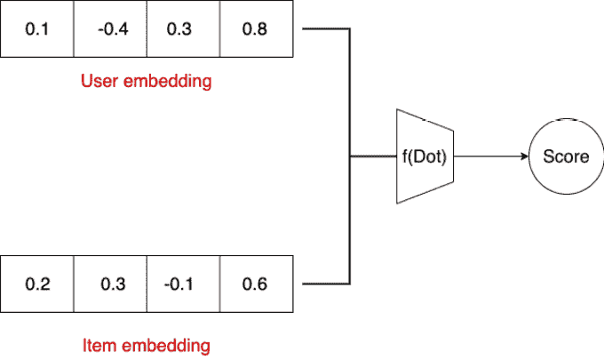
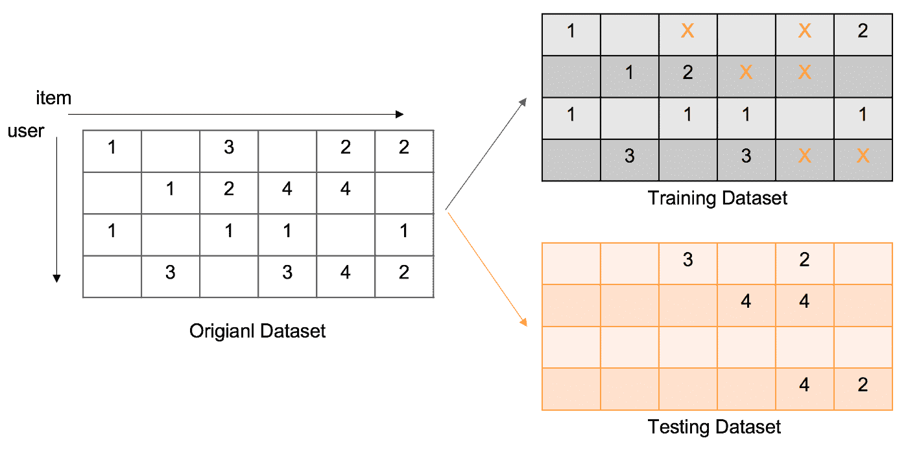
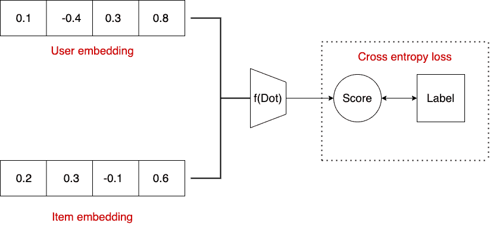
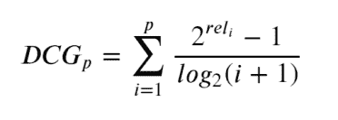
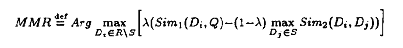

# 如何测试推荐系统

> 原文：<https://web.archive.org/web/https://neptune.ai/blog/how-to-test-recommender-system>

推荐系统从根本上解决了人们想要什么的问题。

虽然这是一个广泛的问题，但在像电子商务这样的消费者应用程序的上下文中，答案可能是为消费者提供价格和质量最好的产品。对于一个新闻聚合网站，它可以显示可靠和相关的内容。

在用户不得不浏览成千上万的商品来找到他们想要的东西的情况下，推荐引擎是必不可少的。根据 lighthouselabs.ca 的一篇关于网飞使用数据科学的文章:

> *该引擎基于用户偏好，使用 1，300 个推荐聚类，一次过滤超过 3，000 个标题。它是如此准确，以至于来自引擎的个性化推荐驱动了 80%的网飞观众活动。*

然而，与单一的 ML 模型相比，在设计决策、工程和度量方面，构建和评估推荐系统是非常不同的。在本文中，我们将重点测试一个推荐系统。我们还将讨论:

## 

*   1 推荐系统的类型
*   2 最流行模式——协同过滤概述

## 推荐系统的类型

推荐系统基于三种主要模式工作:

1.  **相似性-基于查询内容:**系统根据相似性检索内容。比如你喜欢一个足球视频，它会给你看另一个。或者，如果你搜索一件蓝色 t 恤，它会显示更多的蓝色 t 恤。匹配基于项目内容，如图像、描述、标题等。

2.  **群众的智慧:**社交媒体中使用的现代推荐系统就是基于这一点。如果用户 A 喜欢电影 X、Y、Z，用户 B 喜欢电影 X、Z；那么用户 B 可能喜欢电影 y。这些推荐模型不依赖于项目内容，而是考虑用户偏好。这些模型之所以受欢迎，是因为它们超越了主题和内容。他们可以向刚刚喜欢足球视频的热爱体育的用户全面推荐棒球视频。

3.  基于会话:基于会话的系统捕捉用户在特定会话中的意图，并基于会话级上下文信息推荐项目。例如，如果您正在购买新的工作站，并打算购买显示器、键盘、鼠标、椅子等。您希望网站向您显示与在此会话中设置工作站相关的项目，即使您之前可能喜欢某本书。

第二个和第三个需要大量的用户-项目交互数据。如果没有，可以从第一种推荐系统开始。即使现有用户有大量数据，新用户也可能没有足够的数据。这种情况在推荐系统中被称为**冷启动**问题。在这种情况下，基于内容的推荐系统可以是一个很好的代理，直到有足够的新用户交互数据。

概述够了，现在让我们简单看看一个流行的推荐系统，看看我们如何测试它。

## 基于协同过滤的模型综述

协同过滤是最流行的经过实战检验的推荐模型之一。这里的目标是训练项目和用户的向量表示，使得具有表示(嵌入)Vu 的用户 **U** 更喜欢具有表示(嵌入)的项目**I****V**I**的概率是**

**

*Collaborative filtering is one of the most popular battle-tested recommendation models | Source: Author*

### 模特培训是如何进行的？

对于数据集中的 **M** 个唯一用户和 **N** 个唯一项目，我们创建一个嵌入表，维度为**D**。我们有 **D*(M+N)** 参数要学习。假设我们正在为 YouTube 构建这个系统，并希望预测用户是否会按下视频上的 like 按钮。我们的训练数据会有几十亿对像 **(userId，postId)** 如果那个 userId 的用户喜欢过那个 postId 的视频。

*Train/test split under the case of recommendation | [Source](https://web.archive.org/web/20221203101133/https://towardsdatascience.com/recsys-implementation-on-variants-of-svd-based-recommender-system-a3dc1d059c83)*

我们随机初始化嵌入。然后，在训练期间，我们计算标签为 1 和交叉熵损失的概率。在多个时期分批进行这种操作可以训练用户和项目嵌入。

*Model training in recommender systems | Source: Author*

培训-验证分离发生在用户级别。这意味着，每个用户的 X%的喜欢在训练集中，100-X%在验证集中。x 通常为 80-90%。

## 推荐系统:目标设计

在前面的例子中，我们训练了一个模型来预测用户是否喜欢 YouTube 上的视频。预测的变量非常简单明了。然而，并不是所有的信号都是明确的。例如，考虑关于用户是否将观看视频长度的 95%的预测变量。如果是这样，我们在数据集中包含 **(userId，postId)** 。

如果我们有一个近乎完美的模型，预测观看概率> 95%，我们可以说我们在推荐用户喜欢的视频，对吗？

这里有一个问题——考虑一个一分钟的视频(V1)和一个三十分钟的视频(V30)。看完 V1 的 95%需要 57 秒，看完 V30 的 95%需要 1710 秒。V1 也可以是一个点击诱饵视频，而用户可以喜欢 V30，仍然可以观看 1600 秒的视频。那么我们的定义是否保证了正面标签代表了用户偏好？

其次，大多数平台都有多个信号——喜欢、分享、下载、点击等。应该使用哪个目标来训练模型？通常情况下，一个是不够的。假设我们基于不同的目标训练多个模型。我们有来自每个模型的多个 **(userId，postId)** 分数。然后，基于所有分数的聚合公式创建单个数字分数，用于创建最终排名。

关键是，如果培训目标没有精心设计，即使是近乎完美的模型也不会给出好的建议。

## 评估推荐系统

### 离线评估

在本地机器上离线训练一个推荐模型并不能保证它的在线性能。然而，有一些指标来分析预期的模型行为。

#### ROC-AUC

受试者操作者特征或 ROC 曲线在 Y 轴上测量真阳性率(TPR ),在 X 轴上测量假阳性率(FPR)。对于二元分类器，我们使用一个阈值，高于该阈值的实例被预测为阳性，否则为阴性。对于特定的阈值，

***【TPR = %总正阈值以上= TP/(TP + FN)***

***【FPR = %高于阈值的总否定量= FP/(FP + TN)***

在阈值=0 时，所有示例都被分类为阳性。因此，FN=0，因为没有例子被分类为负，并且 TPR=1。出于同样的原因，TN 也为零。因此，FPR 也是 1。这是图上的(1，1)点。

在阈值=1 时，没有示例被预测为阳性。因此 TP 和 FP 都是 0，在图上表示(0，0)。

通过计算[0，1]中不同阈值的 TPR 和 FPR 并绘制它们来绘制曲线。绘制的曲线如下所示:

曲线下的面积最大为 1。如果分类器将标签随机分配给实例，则沿着 x=y 的对角线是 ROC 曲线。

#### PR-AUC

Precision-Recall AUC 或 PR-AUC 类似于 ROC-AUC，只是在 Y 轴上，我们有 Precision，在 X 轴上，我们有 Recall。正如我们所知，精确度是模型预测的正确率。另一方面，回忆是模型正确分类的全部现存肯定的一部分。

为了更好地理解 PR 曲线，考虑一个二元分类器。如果我们保持低的分类阈值，比如 0.05，大多数例子被预测为阳性。所有现有的阳性将被正确地分类为阳性。尽管如此，我们仍会有许多假阳性，因为真正的阴性也被归类为阳性，这导致了高召回率和低精确度。

另一方面，如果我们保持一个非常高的阈值，该模型做出的大多数正面预测都将是正确的，因为该模型在其所谓的正面预测中非常保守。然而，我们会为了追求始终正确而错过许多实际的肯定，这导致了高精度和低召回率。

注意，在联合优化召回率和精确度之间有一个折衷。像 ROC-AUC 一样，一个完美的分类器应该具有 PR-AUC=1。这条曲线下的面积是 PR-AUC。

然而，在类别分离非常清楚的完美分类器中会存在阈值。所有的正面例子都会在这个阈值以上，所有的负面例子都在这个阈值以下。在这种情况下，AUC 最大，等于 1。

PR-AUC 相对于 ROC-AUC 的显著优势在于，当出现阶层失衡时，它不会产生误导。在不平衡的情况下，ROC-AUC 可以高于 PR-AUC。

#### 排名指标

除了分类，我们还想了解分数的排名顺序。推荐系统的目标不仅仅是挑选出相关的项目，还要根据偏好对它们进行排序。根据福布斯的一篇文章:

> 谷歌的第一页捕获了 71%的搜索流量点击，据报道近年来高达 92%。第二页的结果远远没有接近第二，在所有网站点击量中不到 6%。

如果你选择了相关的项目，但没有订购它们，这是没有用的。那么我们如何测试我们的模型是否有排名能力呢？

*   **归一化贴现累计收益(NDCG)**

想象一下你的模型向用户提出的一系列十个建议。你希望看到获得最大点赞的最佳推荐顺序。以下是用户对这十个视频的回应

1，0，0，1，0，1，1，0，1，0，1，0 …(1)

用户喜欢第一、第四、第六、第七和第九条建议。这里订购的最佳案例是什么？

**1，1，1，1，1，0，0，0，0 …… (2)**

也就是说，如果我们推荐第一、第四、第六、第七、第九，然后是其他的，我们将会获得最好的排名。请注意，第一、第四、第六、第七和第九之间的任何排列都会产生相同的排名。

要计算 NDCG:

*Normalised discounted cumulative gains (NDCG) | [Source](https://web.archive.org/web/20221203101133/https://towardsdatascience.com/normalized-discounted-cumulative-gain-37e6f75090e9)*

reli 在我们的例子中表示项目 I-0 或 1 的相关性。p 是项目的总数。对于较低的级别(较低的 I ),总和下的术语比较高的级别具有更大的权重。IDCGp 仅获取相关项目并计算总和，这是通过将所有相关项目排在顶部(表达式 2)并将不相关项目排在底部可以获得的最大 DCG 分数。

注意，对于不相关的项目，分子是 0 (20-1=0)。DCGp 计算分数时，将所有的 p(相关和不相关)按照代表我们的模型在对项目评分后如何对它们进行排序的顺序(表达式 1)来计算。

请注意，NDCG 位于 0 和 1 之间。

如上所述，召回率是模型在全部现有的肯定信息中捕获的肯定信息的比例。对于一组排序的推荐，考虑在位置 k 的特定排序。在位置 1 到 k 中出现的肯定的数量除以肯定的总数量给出我们在 k 的召回

对于许多系统来说，获得所有相关的结果是必不可少的，即使是以一些不相关的结果为代价。在这种情况下，recall@k 给了我们一个关于覆盖率的概念。

与 recall@k 类似，precision@k 计算等级为 k 的模型的精度。这意味着它计算模型正确预测的阳性分数除以总阳性预测。

对于可能不需要全部，而只需要正确结果的情况，precision@k 有助于量化它。

#### 深潜

推荐系统因有偏见而臭名昭著。在我们为 YouTube 建立推荐模型的例子中，我们可能会发现总体 AUC 是好的。然而，当我们在不同层面上分析这些指标时，例如，较长视频与较短视频的 AUC，我们发现较长视频的指标较差，这意味着模型没有很好地学习推荐较长视频。

类似的影响可能发生在任何属性上——地理位置、用户统计数据、主题。知道你的模型哪里做得好，哪里不好是有帮助的。

#### 解决偏见

推荐系统通常比不太受欢迎的长尾内容更多地推送受欢迎的内容。因为受欢迎的内容更有可能被任何随机用户所偏好。这使得该模型能够找到一个“快速修复”的解决方案来最小化损失。然而，用户有许多未开发的兴趣，或者用户可能喜欢许多不太流行的东西。尽管如此，因为它们在训练数据集中出现的频率不高，所以它们的嵌入没有被准确地学习，从而导致偏差。想象一下，Spotify 上仅有的几个流行歌手会获得 Spotify 上数百万歌手中近 90%的播放量。

推荐系统在一个循环中被训练。如果系统向用户推荐有偏见的内容，将对这些有偏见的推荐进行以下训练。随着时间的推移，分布向流行项目倾斜，因为对这些项目的反馈比其他项目观察到的更多——偏差复合。

为什么解决偏见很重要？推荐热门内容有什么问题？如前所述，这使得探索用户的其他兴趣变得困难。从短期来看，流行的内容可能会留住用户，但最终，用户会发现应用程序上没有什么新奇的东西。其次，这使得新创作者很难在应用程序上获得牵引力。新的创作者将没有动力去创造吸引人的、多样化的内容。最终，他们可能会离开这个应用程序。

#### 你如何衡量偏见？

一种简单的方法是查看视图分布。前 1%、5%、10%……的视频获得了多大比例的浏览量，与其他视频相比，这些视频被推荐给用户的频率如何。这种 80-20 效应可以在话题(特定话题主导 app)、创作者(少数热门创作者 vs 小众创作者)等方面看到。机器学习模型学习数据集中的偏差等。因此，如果您的数据集有偏差，那么您的推荐结果很可能会反映出来。

通常，模型会基于某个特征隐含地学习某些偏见。例如，不久前，如果你在谷歌上搜索“CEO”这个词，最上面的结果会是白人男性的照片。类似地，像“护士”这样的词的结果大部分是女性。然而，CEO 这个词是中性的。

根据 washington.edu 的一篇文章:

> 研究发现，在一些工作中，差异很明显。在谷歌搜索首席执行官的图片中，11%的人是女性，而美国的首席执行官中有 27%是女性。在针对作者的图片搜索结果中，25%的人是女性，相比之下，实际的美国作者中有 56%是女性。
> 
> 相比之下，图片搜索结果中 64%的电话销售人员是女性，而这一职业男女各半。

测量由属性/特征引起的偏差的一种常用方法是**统计奇偶性**。简而言之，它测量给定受保护属性 **p** (例如性别)的模型结果(概率)与没有它的结果的差异。一个无偏的模型应该有:

拥有关于 p 的额外信息不会有什么不同。

#### 如何减轻偏见？

创建更公平的推荐系统是一个活跃的研究领域。解决偏见的一个流行策略是负抽样。在我们的 YouTube 推荐示例中，我们有点击数据。如果我们想要创建一个基于点击预测的推荐模型，我们只有来自受欢迎程度影响的视频的点击数据。为了平衡这一点，我们通过为用户选择随机视频并给他们分配负类来创建样本。这个想法是用户喜欢随机视频的可能性非常低。通过这种方式，我们消除了数据分布的偏差。

除了负面抽样，许多评分机制衡量候选人的多样性。在基于会话的推荐中，可以通过获取用户观看的前 N 个项目并测量要推荐的更多样的主题来引入更多样的推荐。例如，如果有人阅读一些关于政治和电影行业的文章，下面的推荐可以包括一些体育行业的项目。

**最大边缘相关度(** [**MMR**](https://web.archive.org/web/20221203101133/https://dl.acm.org/doi/pdf/10.1145/290941.291025) **)** 是信息检索中使用的一种在相关性和多样性之间取得平衡的度量。根据这篇论文——

*Maximum margin relevance (MMR) | [Source](https://web.archive.org/web/20221203101133/https://dl.acm.org/doi/pdf/10.1145/290941.291025)*

对于给定的 C 和 Q，C 是文档集合，Q 是查询，R 是由 IR 系统检索的文档的排序列表，S 是 R 中已经选择的文档的子集；RS 是 R 中而不是 S 中的文档集；Sim1 是在文档检索和文档(段落)与查询之间的相关性排序中使用的相似性度量；Sim2 可以与 Sim1 相同，也可以是不同的度量。当参数λ=1 时，MMR 递增地计算标准相关性排序列表，并且当λ=0 时，计算 R 中的文档之间的最大多样性排序。

### 在线评估

#### A/B 实验

我们训练模型的目标和我们测量的离线指标可能不是我们在现实中寻找的。例如，如果 YouTube 创建了最准确的模型来预测点击，这可能并不意味着用户流失会减少。尽管该模型推荐了用户喜欢的所有视频，但他们可能仍然会离开，第二天不会回来。

其次，精确地按照一个人想要的来训练一个模型是很难的。例如，训练一个模型来推荐视频以减少流失比基于点击推荐视频更复杂。

标准在线指标包括:

*   用户保持率
*   参与度(喜欢、书签、关注等。)
*   点击
*   购买
*   收入
*   花费的时间
*   建议的多样性。

对任何模型来说，最终的关键时刻是现场 A/B 测试。对照现有模型测试新的变化。例如，假设说学习速度应该是当前速度的 10 倍。我们为平台上的一组随机用户推出了一个新的学习率模型来测试这一点。由于当前模型和新版本运行在相同的用户分布上，在线指标的任何变化都只能归因于学习率的变化。人们可以根据净变化来决定新的变化是好是坏。

## 测试推荐系统

### 模型评估与测试

我们看到了如何使用各种度量和分析来评估推荐模型，以便我们的实验和假设成立。然而，当模型交付生产时，事情仍然可能出错。即使是很小的工程错误也会导致意想不到的推荐和糟糕的用户体验。因此，测试每个步骤——推理、重新训练周期、数据集创建和功能范围——对于在线部署至关重要。

在这一节中，我们将看看测试整个推荐系统的一些方法——从模型的行为到管道的健康状况。

### 推荐系统的行为检查

#### 测量嵌入更新率

由于 RecSys 模型是建立在嵌入基础上的，因此确保正确训练嵌入是至关重要的。每次重新训练，用户和项目的嵌入都会更新。要检查的一个重要指标是不同用户/项目嵌入版本的平均漂移。可以通过测量余弦相似性来检查漂移。

例如，如果用户 A 昨天的嵌入是 e1，并且在重新训练之后是 e2，则漂移被测量为余弦(e1，e2)。理想情况下，该数值不应大于 0.9，但也不应太接近 1。如果太小，则表明嵌入没有收敛。如果它太接近 1，则表明该模型可能没有捕捉到用户的新兴趣。

#### 不同切割的指标

如前所述，单个数字指标看起来可能具有欺骗性。例如，10%的流行项目可以构成 80%的数据集。测量整个数据集的 AUC 可以给出乐观的数字，因为模型必须很好地学习 10%的项目。但是，这意味着模型没有很好地学习项目的长尾。这种疏忽会导致差的多样性和新颖性。在这种情况下，可以分析项目级的度量，并检查所有项目是否都表现得相当好。这同样适用于许多其他属性，如用户、性别、地理位置等。

#### 基于会话的模型的方差测试

基于会话的模型要求模型立即使用新信息来更新建议。一个好的基于会话的推荐模型能够快速准确地适应用户当前的兴趣。

考虑一个基于 RNN 的模型，该模型采用前 N 次交互来为第 N+1 个位置推荐物品。如果模型偏向于流行，势必会推荐 N-2，N-1，N 次交互后的流行单品。然而，一个好的模型会在每次交互后推荐一组不同的项目。在数学上，我们可以看到 RNN 模型中每个时间步长后隐藏状态的变化，就像我们计算嵌入漂移一样(如上所述)。

类似地，如果用户与 10 个跨不同主题(如人工智能、喜剧或足球)的视频进行交互，并对喜剧视频做出积极响应，对其他主题做出消极响应，则下一个推荐应该包括有趣的视频。人们可以在会话历史中测量对某些主题/流派的相似性，并在下一组推荐中测量其表现。

### 软件检查推荐系统

除了标准的单元和集成测试之外，还有一些 RecSys 特有的行为测试，您应该了解一下”

*   **特征一致性**:在模型训练过程中，我们可能会用到除嵌入之外的许多特征，比如用户位置、年龄、视频长度等。在使用这些功能之前，通常会对其应用缩放等变换。然而，由于对特征的错误处理，这增加了推断过程中出错的机会。例如，如果您在训练中缩放了某个要素，但在推理中没有缩放，则模型预测可能会发生变化。
*   **泄漏特征**:许多模型，如基于会话的模型，在每次交互中使用接近实时的信息。例如，用户与之交互的项目数量。如果用户与六个项目 A、B、C、D、E 和 F 交互；该特征的值可以是 0、1、2、3、4、5；因为用户在点击 A 之前与 0 个项目交互，在点击 B 之前与 1 个项目交互，以此类推。我们只使用事件发生前可获得的信息。在离线训练期间，我们应该问在从表中选择数据时，它是否会导致训练中的泄漏。
*   **更新嵌入**:推荐模型，定期训练。在每个训练周期之后，更新的嵌入应该用于推荐项目。使用旧的嵌入会导致不一致和不准确的推荐。

### 测试推荐系统的工具

以下是一些测试推荐系统不同阶段的相关工具:

#### 1.数据集创建和特征工程

跟踪特征分布和特征值中的异常是需要跟踪的几个关键数字。通常，推荐模型训练是通过诸如 airflow 或 kedro 之类的工具在 DAGs 中执行的。创建数据集后，可以编写一个测试套件，根据数据中的统计信息测试预期的统计信息。根据可接受的误差范围，可以创建警报。Pytest 是编写这种单元测试的流行工具。

#### 2.培训和部署

大多数推荐模型是使用基于梯度下降的优化以深度学习的方式训练的。自然，学习率和训练步数的重量衰减等超参数开始发挥作用。使用上面讨论的度量和训练-验证损失曲线可以发现训练中的突然性。像 [Neptune](/web/20221203101133/https://neptune.ai/) 这样的工具允许用最小的代码变化来监控模型训练。使用 Neptune 的简单 API 可以[记录曲线、指标、超参数和脚本](https://web.archive.org/web/20221203101133/https://docs.neptune.ai/you-should-know/what-can-you-log-and-display)。

像 [RecList](https://web.archive.org/web/20221203101133/https://github.com/jacopotagliabue/reclist#a-guided-tour) 这样的开源工具提供了一个易于使用的界面来计算推荐模型评估中最常见的指标。给定数据集和模型，RecList 可以在目标数据集上运行指定的测试。除了度量之外，它还基于不同的切片生成图表和深度聚合。

#### 3.推理

推理需要特性的一致性、可用性、最小延迟以及对更新模型的访问。每一次代码变更，数据科学家都必须确保以上几点。软件工程实践，如代码审查、版本控制(如 Git ),以及自动化测试阶段的 CI/CD 流程(Jenkins，GitHub actions ),确保了安全的软件发布。

## 结论

在人工智能的许多领域中，如自然语言处理、计算机视觉等，推荐系统的研究相对不足。然而，它们是现代数字应用中最具影响力的应用之一。尽管评估它们并不简单，但是上面的度量标准和想法是一个很好的起点。记住，你应该建立一个推荐系统，而不是一个模型。从长远来看，投资建设坚实的基础设施比制造一个 SOTA 模式更有帮助。**