# 如何使用 TensorFlow 对象检测 API 训练自己的对象检测器

> 原文：<https://web.archive.org/web/https://neptune.ai/blog/how-to-train-your-own-object-detector-using-tensorflow-object-detection-api>

目标检测是一项计算机视觉任务，最近受到机器学习进展的影响。

在过去，创建一个定制的对象检测器看起来是一项耗时且具有挑战性的任务。现在，有了像 [TensorFlow 对象检测 API](https://web.archive.org/web/20221206004728/https://tensorflow-object-detection-api-tutorial.readthedocs.io/en/latest/index.html) 这样的工具，我们可以快速轻松地创建可靠的模型。

在本文中，我们将重点介绍第二代 TensorFlow 对象检测 API，它:

*   支持张量流 2，
*   允许您使用最先进的模型架构进行对象检测，
*   为您提供了一种配置模型的简单方法。

如果你有兴趣了解 TensorFlow 2 及其 API 中所有可用的特性，你可以在 Google 的[官方公告中找到它们。](https://web.archive.org/web/20221206004728/https://blog.tensorflow.org/2020/07/tensorflow-2-meets-object-detection-api.html)

阅读完本文后，您应该能够创建自己的自定义对象检测器。

我们将使用基于 [EfficientDet 的模型](https://web.archive.org/web/20221206004728/https://ai.googleblog.com/2020/04/efficientdet-towards-scalable-and.html)作为示例，但是您也将学习如何使用[您选择的任何架构](https://web.archive.org/web/20221206004728/https://github.com/tensorflow/models/blob/master/research/object_detection/g3doc/tf2_detection_zoo.md)来启动并运行模型。敬请期待！你自己的物体探测器就在眼前。

## 开始之前

让我简单地谈谈开发您自己的对象检测器所必需的先决条件:

*   你应该在你的电脑上安装 Python。如果你需要安装它，我推荐[遵循 Anaconda](https://web.archive.org/web/20221206004728/https://docs.anaconda.com/anaconda/install/) 的官方指南。
*   如果你的计算机有一个支持 CUDA 的 GPU(NVIDIA 制造的 GPU)，那么需要一些相关的库来支持基于 GPU 的训练。如果您需要启用 GPU 支持，请查看 NVIDIA 网站上的[指南](https://web.archive.org/web/20221206004728/https://docs.nvidia.com/cuda/archive/10.1/index.html#installation-guides)。您的目标是为您的操作系统安装 CUDA 工具包和 cuDNN 的最新版本。

安装和设置

## 让我们首先确保我们已经准备好开始使用 TensorFlow 对象检测 API 所需的一切。我将回顾整个设置过程，并解释每一步的工作原理。

如果您已经使用过 TF API，您仍然可以快速浏览一下这一部分，只是为了确保我们遵循相同的方向。

但是如果您是第一次安装 Tensorflow 对象检测 API，我强烈建议您完成本节中的所有步骤。让我们跳进来吧！

**1。创建项目目录**

### 在您选择的路径下，创建一个新文件夹。命名为`Tensorflow`。

**2。创建新的虚拟环境**

### 打开一个*终端*窗口，使用`cd`命令导航到步骤 1 中创建的`Tensorflow`文件夹。

*   使用`venv`库创建一个新的虚拟环境:

*   如果您的机器上已经安装了`venv`(或者您更喜欢使用另一个工具来管理环境，如*[【Anaconda](https://web.archive.org/web/20221206004728/https://www.anaconda.com/)*)，那么直接进行新环境的创建。

如果你不知道什么是`venv`或者没有安装它，你可以在你的*终端*窗口中输入以下命令:

为了使用`venv`创建一个新环境，在您的*终端*窗口中键入以下命令:

```py
pip install venv

```

一旦执行完毕，`venv`将创建一个名为`tf2_api_env`的新虚拟环境。

```py
python -m venv tf2_api_env

```

激活新创建的虚拟环境:

*   为了激活我们刚刚创建的虚拟环境，您首先需要确保您当前的工作目录是`Tensorflow`。您可以通过在您的*终端*窗口中键入并执行以下命令来检查您当前的工作目录:

为了激活您的虚拟环境，从您的*终端*窗口运行以下命令:

```py
pwd

```

如果您在您的*终端*窗口的命令行开头看到您的环境的名称，那么您就一切就绪了。它应该是这样的:

```py
source tf2_api_env/bin/activate
```

是时候在我们的环境中安装 TensorFlow 了。确保您的环境已激活，并通过执行以下命令进行安装:

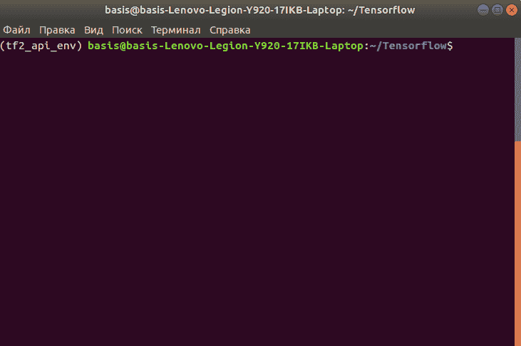

*Successful virtual environment activation in the Terminal window*

**注:**在我写这篇文章的时候，最新的 TensorFlow 版本是 2.3。您可以使用这个版本，但这不是必需的。我们在本指南中所做的一切都是与 2.3 兼容的，它也可能适用于以后的更新。这取决于你去尝试。如果有任何问题，您可以随时降级到 2.3 并继续前进。

```py
pip install tensorflow==2.*

```

**3。下载并提取 TensorFlow 模型花园**

### 模型花园是 github.com 的官方张量流存储库。在这一步中，我们希望将这个回购克隆到我们的本地机器上。

确保在你的*终端*窗口中，你位于`Tensorflow`目录中。

*   在您的 web 浏览器中，转到 [Model Garden Repo](https://web.archive.org/web/20221206004728/https://github.com/tensorflow/models) 并点击*代码*按钮，以便选择最适合您的克隆方法(选项有 HTTPS、SSH 或 GitHub CLI)。

*   选择克隆方法后，将存储库克隆到您的本地`Tensorflow`目录。如果你在克隆方面需要额外的帮助，请查看官方 GitHub 指南。

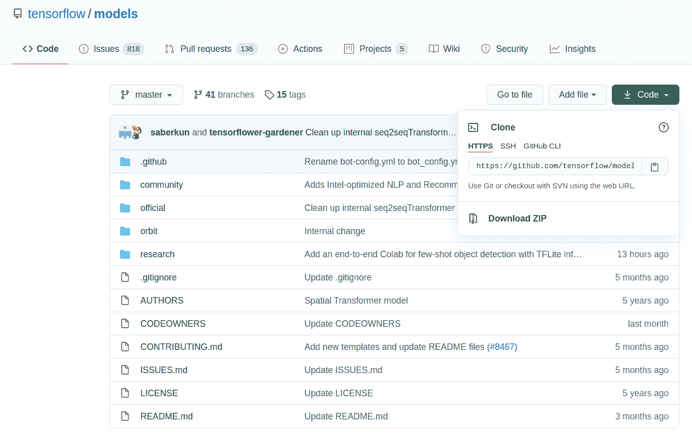

*Selecting a cloning method for an official Model Garder Tensorflow repo*

*   到现在为止，在`Tensorflow`目录下应该有如下结构:

**4。下载、安装并编译 Protobuf**

```py
Tensorflow/
└─ tf2_api_env/
   ├─ bin/
   ├─ include/
   └── …
└─ models/
   ├─ community/
   ├─ official/
   ├─ orbit/
   └── …

```

### 默认情况下，TensorFlow 对象检测 API 使用 Protobuf 来配置模型和训练参数，因此我们需要这个库来继续。

前往[官方协议发布页面](https://web.archive.org/web/20221206004728/https://github.com/protocolbuffers/protobuf/releases)下载与您的操作系统和处理器架构兼容的最新 protobuf 版本的档案。

*   比如我用的是 *Ubuntu* 。我的 CPU 是 *AMD64* (64 位处理器)。当我写这篇文章时，最新的协议版本是 *3.13.0* 。鉴于所有这些信息，我将从官方协议发布页面下载*protocol-3 . 13 . 0-Linux-x86 _ 64 . zip*文件。

在`Tensorflow`项目目录中，创建一个名为`protoc`的新文件夹。将下载的档案内容解压到`Tensorflow/protoc`目录。

*   现在，您的`Tensorflow`目录结构应该如下所示:

确保在你的*终端*窗口中，你位于`Tensorflow`目录中。要编译 proto 文件，请执行以下命令:

```py
Tensorflow/
└─ protoc/
   ├─ bin/
   ├─ include/
   ├─ readme.txt
└─ tf2_api_env/
   ├─ bin/
   ├─ include/
   └── …
└─ models/
   ├─ community/
   ├─ official/
   ├─ orbit/
   └── …

```

**5。安装 COCO API**

```py
protoc/bin/protoc models/research/object_detection/protos/*.proto
--python_out=.

```

### COCO API 是一个不直接与对象检测 API 相关的依赖项。您应该单独安装它。手动安装 COCO API 引入了一些新功能(例如，一组流行的[检测或/和分割指标](https://web.archive.org/web/20221206004728/https://github.com/tensorflow/models/blob/master/research/object_detection/g3doc/evaluation_protocols.md)可用于模型评估)。安装过程如下:

如果您使用的是 Windows:

确保在你的*终端*窗口中，你位于`Tensorflow`目录中。逐一运行以下命令:

*   如果您使用的是 Linux:

```py
pip install cython
pip install git+https://github.com/philferriere/cocoapi.git

```

确保在你的*终端*窗口中，你位于`Tensorflow`目录中。逐一运行以下命令:

*   在这一步结束时，您的`Tensorflow`目录结构应该如下所示:

```py
pip install cython
git clone https://github.com/cocodataset/cocoapi.git
cd cocoapi/PythonAPI
make
cp -r pycocotools ./models/research/

```

**6。对象检测 API 安装**

```py
Tensorflow/
└─ cocoapi/
   ├─ common/
   ├─ LuaAPI/
   └── …
└─ protoc/
   ├─ bin/
   ├─ include/
   ├─ readme.txt
└─ tf2_api_env/
   ├─ bin/
   ├─ include/
   └── …
└─ models/
   ├─ community/
   ├─ official/
   ├─ orbit/
   └── …

```

### 这是我们的安装和设置块的最后一步！我们将安装对象检测 API 本身。你可以通过安装 *object_detection* 包来实现。方法如下:

确保在你的*终端*窗口中，你位于`Tensorflow`目录中。

*   使用`cd`命令将当前工作目录从`Tensorflow`更改为`Tensorflow/models/research`

*   在您的*终端*窗口中逐一运行以下命令:

*   **注意:****第二个命令可能会给你一个错误。一点也不担心。只需再运行一次，直到你看到一个完整的安装。**

```py
cp object_detection/packages/tf2/setup.py .
python -m pip install .

```

在*终端*窗口的`Tensorflow/models/research`目录下运行以下命令，测试安装是否成功:

*   一旦测试完成，您将在您的*终端*窗口中看到一条打印出来的消息。如果所有 20 个测试都运行了，并且它们的状态是“OK”(有些可能会被跳过，这完全没问题)，那么您就完成了安装！

```py
python object_detection/builders/model_builder_tf2_test.py
```

工作量很大，所以恭喜你！干得好！

数据准备

## 当您完成所有安装步骤时，您需要考虑稍后将输入到自定义对象检测模型中的数据。

基于 TensorFlow 对象检测 API 的模型需要一种特殊的格式用于所有的输入数据，称为 [*TFRecord*](https://web.archive.org/web/20221206004728/https://www.tensorflow.org/tutorials/load_data/tfrecord) 。我们将讨论如何将您的数据转换成 *TFRecord* 格式(为了更好地理解什么是 *TFRecord* 格式，我强烈推荐阅读[这篇文章](https://web.archive.org/web/20221206004728/https://medium.com/mostly-ai/tensorflow-records-what-they-are-and-how-to-use-them-c46bc4bbb564))，但是首先让我们讨论一些关于您的数据可用性及其注释的假设。具体来说，我们假设:

您已经**收集了数据(图像)**用于模型训练、验证和测试，

*   您的**图像被注释用于对象检测**，这意味着您的数据集中可能出现的所有感兴趣对象的区域被手动定义为边界框，并且为每个框设置了基本事实标签。
*   如果这些假设对你来说是错误的，你将无法继续进行你的物体检测创作。很简单:没有数据，没有模型。

好消息是有许多公共图像数据集。我强烈建议花些时间搜索你感兴趣的数据集。很有可能你会找到值得你花时间去做的事情。

如果你需要注释，有[吨的解决方案](https://web.archive.org/web/20221206004728/https://lionbridge.ai/articles/image-annotation-tools-for-computer-vision/)可用。挑一个你喜欢的。它们都会给你 JSON 或 XML 格式的注释。两者都适合我们的目的。

这里我不会在图像收集和注释上花太多时间——我希望您能够自己解决这个问题，这样我们就可以进入下一个重要步骤:数据转换。

<https://web.archive.org/web/20221206004728im_/https://neptune.ai/wp-content/uploads/2022/11/image-annotation-process.mp4>

*Image Annotation Process | Source: [Article by Rei Morikawa at lionbridge.ai](https://web.archive.org/web/20221206004728/https://lionbridge.ai/articles/image-annotation-tools-for-computer-vision/)* 

**数据转换**

### 我提到过您的输入数据需要 *TFRecord* 格式。这一步的目标是将每个数据集(训练、验证和测试)转换成 *TFRecord* 格式。

为了确保可比性，让我们在您的`Tensorflow`目录中创建一个名为`workspace`的子文件夹。我们将使用`workspace`文件夹来存储所有与模型相关的属性，包括数据。

为了存储所有的数据，让我们在`Tensorflow/workspace`中创建一个名为`data`的单独文件夹。我们最终得到的所有转换后的数据集都将被放置在`Tensorflow/workspace/data`中。

在这一步结束时，您的`Tensorflow`目录将如下所示:

现在回到数据转换。使用流行的图像注释工具创建的大多数注释文件都有两种格式:JSON 或 XML。

```py
Tensorflow/
└─ cocoapi/
└─ protoc/
└─ tf2_api_env/
└─ models/
└─ workspace/
   └─ data/
      ├─ train.record
      ├─ validation.record
      ├─ test.record

```

弄清楚你的数据有什么格式的注释。你需要它来选择一个合适的工具来转换到 *TFRecord* 。

**选项#1:** 您的注释是 JSON 格式的。我的建议是:

**选项#2:** 你的注释采用的格式类似于 COCO、Kitti 或 Pascal 等流行数据集所采用的格式(注意:Pascal 注释采用的是我们已经知道的 XML 格式，并且之前在**选项#1** 中使用过)。在这种情况下，我建议你:

**标签地图创建**

### 标签地图是一种简单的。txt 文件(。确切的说是 pbtxt)。它将标签链接到一些整数值。TensorFlow 对象检测 API 需要此文件来进行训练和检测。

为了理解如何创建这个文件，让我们看一个简单的例子，其中我们只想检测两个类:汽车和自行车。别的都不重要，就这两个物件。让我们看看`label_map.pbtxt`对于这样一个任务会是什么样子:

现在您知道如何创建自己的标注地图了。选择您选择的文本编辑器(或 IDE)(我使用了 [atom](https://web.archive.org/web/20221206004728/https://atom.io/) ，并创建一个标签映射文件，该文件反映了您将使用未来对象检测器检测的类的数量。给所有的类起一个有意义的名字，这样你就可以很容易的理解和区分它们。

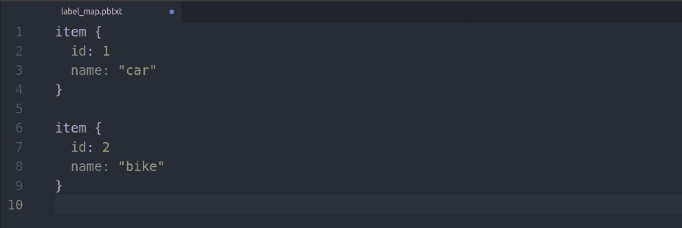

*Example of a label map file for two classes: car and bike*

完成后，将新创建的`label_map.pbtxt`放入`Tensorflow/workspace/data`目录。你的`Tensorflow/workspace/data`目录现在应该包含 4 个文件:

`train.record`，

*   `validation.record`，
*   `test.record`，
*   `label_map.pbtxt`。
*   数据准备到此为止！你向你的物体探测器又迈进了一大步。每一个机器学习项目最本质(可以说)的部分都完成了。您已经有了数据，并准备好输入到您的模型中。

接下来，我们将继续模型架构的选择和配置。继续前进！

型号选择和配置

## 在教程的这一部分，我们要做两件事:

首先，**选择一个要使用的模型架构**。幸运的是，有很多选择，而且都很棒。

*   第二，我们将致力于**模型配置**，因此它可以处理期望的任务，高效，在您可能经历的资源限制下工作，并且具有足够好的概括能力以用于现实世界。
*   这是我最喜欢的部分之一，因为这是机器学习开始的地方！我们开始吧！

**型号选择**

### TensorFlow 对象检测 API 最酷的功能之一是有机会与一组先进的模型一起工作，这些模型是在 COCO 数据集上预先训练的！我们可以根据我们的目的微调这些模型，并获得很好的结果。

现在，您需要选择并下载模型:

单击您选择的型号名称开始下载。

*   在`Tensorflow/workspace/`目录中，创建一个名为`pre_trained_models`的新文件夹，并将下载的模型解压到这个新创建的目录中。

*   如果你想用不同的架构训练多个模型，然后比较它们的性能来选择一个胜出的模型(听起来是个好主意！)，您现在应该下载这些模型并将它们全部解压缩到`pre_trained_models`目录。

*   现在，您的项目目录应该如下所示:

```py
Tensorflow/
└─ cocoapi/
└─ protoc/
└─ tf2_api_env/
└─ models/
└─ workspace/
   └─ data/
   └─ pre_trained_models/
      ├─ <folder with the 1st model of your choice>
      ├─ <folder with the 2nd model of your choice>
      ├─ …
      ├─ <folder with the N model of your choice>

```

**车型配置介绍**

### 我们下载并提取了一个预先训练好的模型。现在我们要对它进行配置。我们想这么做可能有多种原因。让我给你举几个例子，这样你就能明白为什么配置是必不可少的:

您的问题域和您的数据集与用于训练原始模型的不同:您需要一个**自定义对象检测器**(可能是您阅读本文的原因)，

*   您有不同数量的对象类别要检测，
*   您尝试检测的对象可能与预训练模型应该检测的对象完全不同，
*   你可能有较少的计算能力来训练一个模型，这也应该被考虑在内。
*   所以你明白为什么你需要配置你的模型了。原因不胜枚举，但让我们继续前进。我们稍后会用一个真实的例子详细讨论它。

现在，我希望大家记住，模型配置是一个让我们定制模型相关工件(例如超参数、损失函数等)的过程，以便可以对其进行训练(微调)来处理我们感兴趣的对象的检测。就是这样。

TensorFlow 对象检测 API 允许通过预训练模型附带的`pipeline.config`文件进行模型配置。

**项目目录组织**

### 在进入模型配置之前，让我们首先组织我们的项目目录。这是帮助我们保持整个项目结构整洁和易于理解的重要一步。

我们现在想要创建另一个目录，用于存储与不同模型架构及其配置相关的文件。

你可能会问:

“等等，安东，我们已经有了模型架构的`pre_trained_models`文件夹！我们究竟为什么不用它？”

这是一个公平的观点，但我的个人经验引导我找到了一个不同的、更干净的解决方案。相信我，最后你会喜欢的！你需要做的是:

转到`Tensorflow/workspace`并创建一个名为`models`的新目录。

*   在`Tensorflow/workspace/models`中，创建另一个目录，其名称对应于您决定使用的模型架构(您下载到`Tensorflow/workspace/pre_trained_models`的那些模型)。

*   例如，我想训练一个基于 EfficientDet 架构的对象检测器。我注意到在 [TF 2 检测模型 Zoo](https://web.archive.org/web/20221206004728/https://github.com/tensorflow/models/blob/master/research/object_detection/g3doc/tf2_detection_zoo.md) 页面有多个 EfficientDets 可用，它们有不同的深度(从 D0 到 D7，更多信息可以在[这里](https://web.archive.org/web/20221206004728/https://arxiv.org/abs/1911.09070)找到)。

我想我会首先使用最基本的一个，即 [EfficientDet D0 512×512](https://web.archive.org/web/20221206004728/http://download.tensorflow.org/models/object_detection/tf2/20200711/efficientdet_d0_coco17_tpu-32.tar.gz) ，但后来也尝试了 [EfficientDet D1 640×640](https://web.archive.org/web/20221206004728/http://download.tensorflow.org/models/object_detection/tf2/20200711/efficientdet_d1_coco17_tpu-32.tar.gz) ，它更深入，可能会获得更好的性能。因此，在我的例子中，我需要创建两个文件夹:`efficientdet_d0`和`efficiendet_d1`。

目录名的选择由你决定。重要的是为您想要使用的每个模型架构创建一个目录，并且在文件夹的名称中包含模型架构信息。就是这样。

到目前为止，您的项目目录结构应该类似于以下内容:

转到`Tensorflow/workspace/pre_trained_models`并打开包含您想要配置的模型的目录

```py
Tensorflow/
└─ ...
└─ workspace/
   └─ data/
   └─ pre_trained_models/
   └─ models/
      ├─ <folder with the 1st model of your choice>
      ├─ <folder with the 2nd model of your choice>
      ├─ …
      ├─ <folder with the N model of your choice>	
```

*   在那里寻找`pipeline.config`文件。将该文件复制到`Tensorflow/workspace/models/<folder with the model of your choice>/v1/`内的相应文件夹中(您需要创建`v1`文件夹。我稍后会解释它的用途)。

*   复制后，使用文本编辑器或您选择的 IDE 从`Tensorflow/workspace/models/<folder with the model of your choice>/v1/`打开`pipeline.config`文件。打开后，您应该会看到类似这样的内容:

*   现在您已经准备好开始进行模型配置了！下一节将解释如何正确地做到这一点。

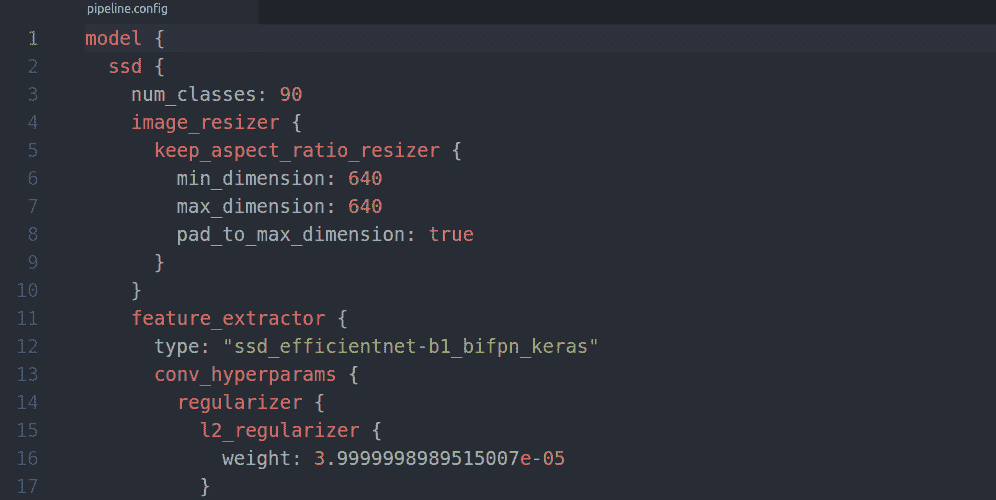

*Example of an opened pipeline.config file for EfficientDet D1*

除了适当的文件夹和命名结构之外，对组织使用[实验跟踪工具](https://web.archive.org/web/20221206004728/https://docs.neptune.ai/how-to-guides/experiment-tracking/organize-ml-experiments)也有助于保持整洁。

配置过程:基础

### 我决定将模型配置过程分为两个部分。

首先，我们来看看基础知识。我们将触及一组需要配置的最小参数，以便开始训练并获得结果……一个**基线结果。**

使用这种方法，开始工作非常容易，但是会牺牲最终模型的性能。这将是完全可行的，但不会尽如人意。

**第二步，我们将重点调整**各种可用的模型参数。我将为您提供一个框架，您可以使用它来调整您想要的每个模型参数。

你将有很大的权力来控制模型配置，并且能够使用不同的设置来进行测试，并获得最佳的模型性能。

听起来很刺激？是啊，它是！让我们开始吧。

查看您之前从`Tensorflow/workspace/models/<folder with the model of your choice>/v1/`打开的`pipeline.config`文件。无论您决定使用哪种型号，您的基本配置都应符合以下型号参数:

`num_classes` (int)。您必须提供您的模型将要检测的类的准确数量。默认情况下，它等于 90，因为预训练模型应该用于 COCO 数据集中的 90 个对象。

*   *数量 _ 类别参数。效率检测 D1* 的例子


`batch_size` (int，必须能被 2 整除)。这个值应该根据您有多少可用内存来设置。请记住，批量越大，您的机器/GPU 需要的内存就越多。如果你不知道最初该用哪个数字，我建议从`batch_size` = 8 开始

*   **注意:** `batch_size`参数需要在`pipeline.config`文件内的两个地方设置:在`train_config`和`eval_config`(见下图)

*train _ config 中的 batch_size 参数效率检测 D1* 的例子

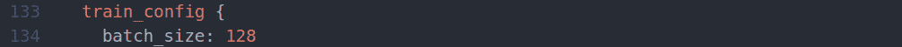

*eval _ config 中的 batch_size 参数。效率检测 D1* 的例子

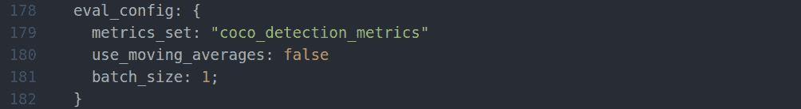

对于`eval_config`你必须用 1。对于`train_confid`,使用我上面描述的逻辑。

微调检查点。这里是您提供预训练模型检查点的路径的地方。

*   善意提醒，你需要的关卡位于`Tensorflow/workspace/pre_trained_models/<folder with the model of your choice>/checkpoint/ckpt-0`。

只需将`<folder with the model of your choice>`替换为预训练模型所在文件夹的名称。

`fine_tune_checkpoint_type` (str)。该字段应设置为`detection`，因为我们想要训练一个检测模型。

*   `use_bfloat16`(布尔)。如果您不打算在 TPU 上训练模型，该字段应设置为`false`。否则设置为`true`。
*   `label_map_path` (str)。在这里，您可以提供一个到先前创建的`label_map.pbtxt`的路径。
*   另一个善意的提醒:我们把`label_map.pbtxt`放到了`Tensorflow/workspace/data`目录下。

**注意:** `label_map_path`参数需要在`pipeline.config`文件中的两个地方设置:在`train_input_reader`和`eval_input`阅读器中(见下图)

*train _ input _ reader 内的 label_map_path 参数。效率检测 D1* 的例子

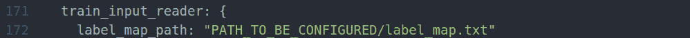

*eval _ input _ reader 内的 label_map_path 参数。效率检测 D1* 的例子

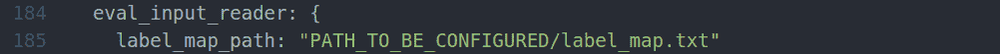

`input_path` (str)。在这里，您提供了一个到您之前创建的`train.record`和`validation.record`的路径。您可能已经猜到，到`validation.record`的路径应该设置在`eval_input_reader`内，而到`train.record`的路径应该设置在`train_input_reader`内。

*   我最后善意的提醒:我们还将所有的`.record files`放在了`Tensorflow/workspace/data`目录中。

**我们刚刚完成基本配置**，这是开始训练您的自定义对象检测器所必需的。很难吗？绝对不会。只要多行修改，你就可以开始了。

您可能已经注意到，与我们在基本配置过程中使用的几行相比，`pipeline.config`文件要长得多。配置空间大吗？绝对是！让我们看看还能做些什么来使我们的模型更健壮。

**配置过程:高级**

### 如何调整配置文件中的其他参数？

我应该尝试哪些参数值？

在哪里以及如何阅读关于参数及其含义的更多信息？

这些是我在开始使用 TensorFlow 对象检测 API 时遇到的问题。

如果你也觉得不清楚，不要担心！幸运的是，有一种通用的方法可以用于参数调整，我发现它非常方便易用。

让我用一个真实的例子向你展示它是怎么回事！

假设您在`pipeline.config`文件中看到一个默认的分类损失函数(对于 D1 效率检测器来说是`weighted_sigmoid_focal`)。定义为`classification_loss`参数)是你认为不是最优的，你想寻找其他可用的选项。

*pipeline . config 中定义损失函数的行。效率检测 D1* 的例子

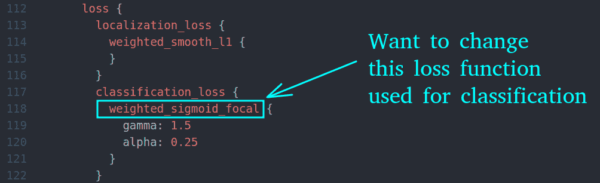

以下是你寻找其他可用选项的方法:

根据以下请求模式进行搜索:

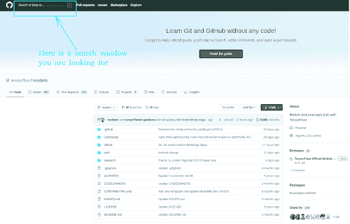

*Place of the search window on the official TensorFlow API GitHub page*

*   至于我们的例子，我们的 **`parameter_name`** 就是 **`classification_loss`** 。你需要从`pipeline.config`文件中粘贴一个精确的参数名。在我们的示例中，您的搜索请求如下:

```py
parameter_name path:research/object_detection/protos

```

浏览搜索结果，寻找最能描述我们请求的参数( **`classification_loss`** )的一个。

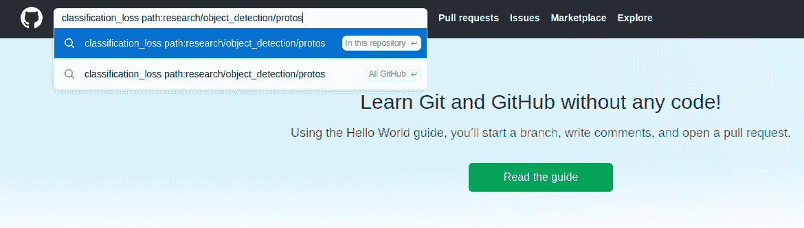

*Example for a search request if we would like to change classification loss*

*   单击最能描述您所请求参数的文件的链接(如上图所示，我们的目标文件可能是[research/object _ detection/protos/loss . proto](https://web.archive.org/web/20221206004728/https://github.com/tensorflow/models/blob/8518d053936aaf30afb9ed0a4ea01baddca5bd17/research/object_detection/protos/losses.proto))，然后等待加载包含该文件的页面。

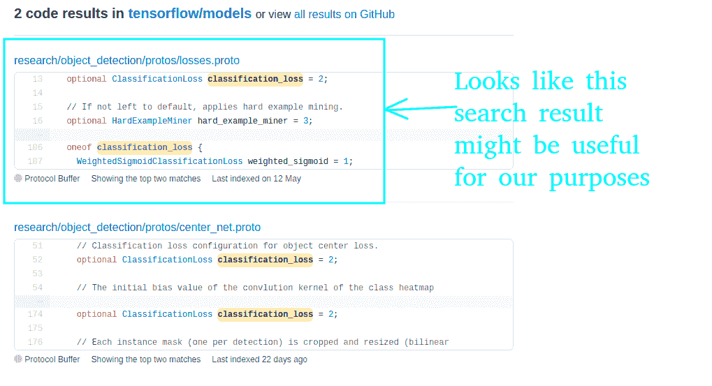

*Example of search results for a given query*

*   加载时，只需使用[常规浏览器搜索](https://web.archive.org/web/20221206004728/https://www.howtogeek.com/671304/how-to-quickly-search-for-text-on-the-current-web-page/#:~:text=Press%20Ctrl%2BF%20(on%20Windows,right%20corner%20of%20the%20window.)找到我们想要的参数( **`classification_loss`** )所在的一行代码。当我这样做时，我发现了下面这段代码:

*   从上面的代码片段中可以得出以下结论:

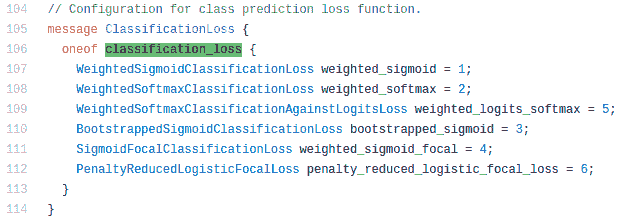

*Piece of code that shows the options for a parameter we interested in*

**>** **`classification_loss`** 是一个参数，它可以是在
**>** 上面的图像上列出的(`oneof`)6 个预定义选项中的一个。

当您找到您的参数值时，只需将它复制到您的`pipeline.config`文件中的相应行。例如，我决定使用`weighted_sigmoid`损失进行分类，而不是默认的`weighted_sigmoid_focal`。为此，我在我的`pipeline.config`文件中做了一个更改，现在定义分类损失的行如下所示:

*   这就是了。您可以使用这种方法来调整您选择的每个参数。现在，您拥有了一种超能力来定制您的模型，使它完全按照您想要的方式运行。是不是很牛逼？绝对是。恭喜你！

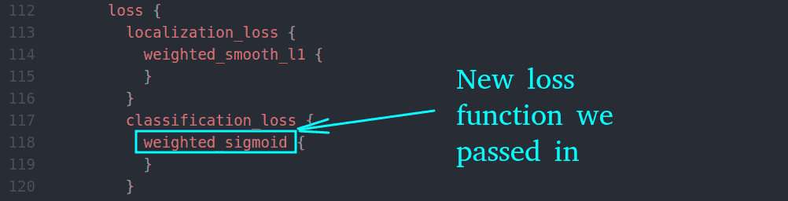

*Here is how lines for classification_loss look like after a change is made.*

模特培训

## 为了走到这一步，我们做了很多工作。现在我们已经准备好开始训练了。下面是如何做到这一点:

您需要将提供的 python 脚本从`Tensorflow/models/research/object_detection/model_main_tf2.py`复制到`Tensorflow/workspace/model_main_tf2.py`进行训练

*   打开一个新的*终端*窗口，将`Tensorflow/workspace/`作为你当前的工作目录。

*   使用以下命令启动培训作业:

*   其中:

```py
python model_main_tf2.py
  --pipeline_config_path=<path to your config file>
  --model_dir=<path to a directory with your model>
  --checkpoint_every_n=<int for the number of steps per checkpoint>
  --num_workers=<int for the number of workers to use>
  --alsologtostderr

```

**>** **`<path to your config file>`** 是当前培训作业要使用的配置文件的路径。应该是来自的配置文件。/models/ <文件夹与您选择的模型>/v1/
**>****`<path to a directory with your model>`**是一个目录的路径，您的所有未来模型属性将放置在该目录中。也应该是下面的:。/models/ <包含您选择的模型的文件夹>/v1/
**>****`<int for the number of steps per checkpoint>`**是一个整数，它定义了创建模型检查点需要按顺序完成多少个步骤。请记住，当进行单个步骤时，您的模型处理的图像数量等于您为训练定义的 batch_size。
**>****`<int for the number of workers to use>`**如果您有一个多核 CPU，该参数定义了可用于训练作业的核心数量。

在您执行上述命令之后，您的培训工作将开始。值得一提的是，如果你要使用 GPU 进行训练，你所有的 GPU 都会参与进来。如果您希望仅涉及选定的 GPU，请在启动培训作业脚本之前执行以下命令**:**

其中<gpus>根据订单编号定义要使用的 GPU。比如我有两个 GPU。第一个订单编号为 0，第二个订单编号为 1。如果我想在我的第 0 个 GPU 上训练一个模型，我执行以下命令:</gpus>

```py
export CUDA_VISIBLE_DEVICES= <GPUs>
```

如果我想在我的两个 GPU 上训练，我使用以下命令:

```py
export CUDA_VISIBLE_DEVICES=0
```

如果我决定只使用 CPU 来训练我的模型，我的命令应该是这样的:

```py
export CUDA_VISIBLE_DEVICES=0,1

```

现在，你该躺下来放松一下了。剩下的工作就交给电脑了！

```py
export CUDA_VISIBLE_DEVICES=-1
```

最后的想法

## 这是一次漫长的旅行，不是吗？现在你有知识和实践技能来进口，定制和培训任何物体探测器你想要的。

TensorFlow 对象检测 API 是一个很好的工具，我很高兴您现在已经完全可以使用它了。让我们简要回顾一下我们所做的工作:

我们从需要启动的**初始安装和设置**开始:我们安装了所有的依赖项，组织了项目目录，启用了 GPU 支持。

1.  然后我们继续进行**数据准备**，了解 TFRecords 并将我们的数据转换成这种格式。我们还利用标签映射将类与其名称联系起来。
2.  然后我们进入**模型选择**并决定我们想要使用什么模型架构。现在我们知道每个模型都可以通过我们熟悉的**配置文件**进行定制。
3.  最后，我们直接进入培训工作，根据我们准备的配置，**启动了模型培训**。
4.  如果你一直做到最后，那就干得好！我希望你觉得这篇文章有趣并且有用。

在即将到来的[第二篇](/web/20221206004728/https://neptune.ai/blog/tensorflow-object-detection-api-best-practices-to-training-evaluation-deployment)中，我会讲到更酷的东西！特别是，我们将回答以下问题:

如何为您的模型启动评估作业，并检查其随时间推移的性能？

*   跟踪结果和比较不同模型配置的实验的最便捷方式是什么？
*   如何进一步提高模型质量及其性能？
*   如何克服可能出现的问题？
*   如何导出一个训练好的模型以便用于推理？
*   How to export a trained model in order to use it for inference?**