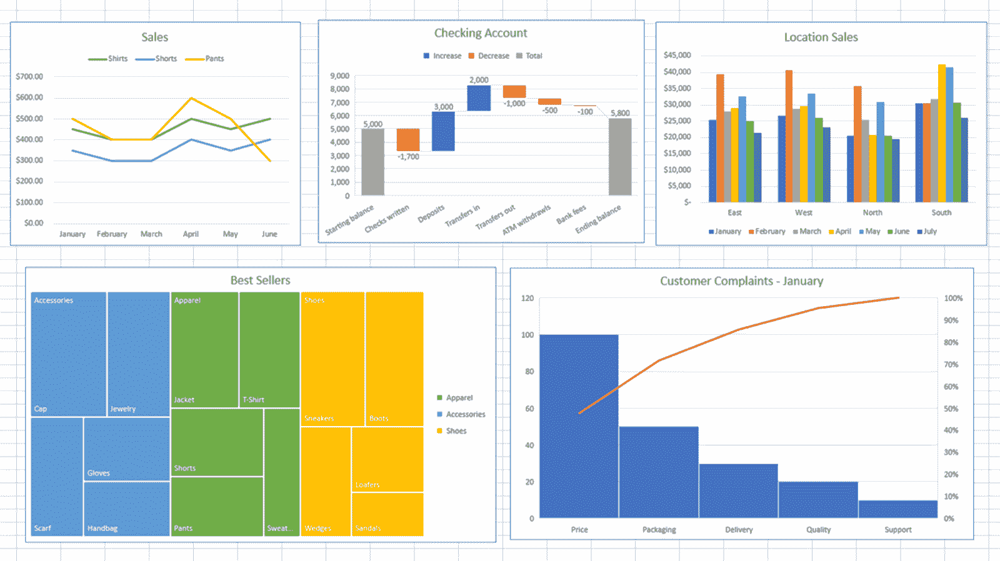

# Jupyter 笔记本如何版本化、调试、比较和共享

> 原文：<https://web.archive.org/web/https://neptune.ai/blog/how-to-version-debug-compare-share-jupyter-notebooks>

ML 模型开发有了突飞猛进的改进，Jupyter 笔记本是这种变化的一大因素。由于它的交互式开发、对 markdowns 的支持和 LaTex，一个巨大的插件库，它已经成为任何数据科学家或 ML 从业者的首选工具。

笔记本在这一领域的流行导致了许多在 [ML 实验跟踪](/web/20230313154752/https://neptune.ai/blog/ml-experiment-tracking)中的产品，因为它们没有自带的跟踪功能(在撰写本文时)，所以人们不得不在其他地方寻找解决方案。在这篇博客中，我们将涉及以下几个方面:

## 

*   1 为什么给笔记本版本很重要？
*   2 用不同的方法对笔记本电脑上完成的实验进行版本化、调试和比较。
*   3Neptune . ai 如何帮助 Jupyter 笔记本的跟踪、调试和对比？

## 为什么要给笔记本版本化？

构建 ML 模型本质上是实验性的，通常会运行大量实验来寻找算法、参数和数据预处理步骤的组合，从而为手头的任务产生最佳模型。一旦问题变得复杂，这就需要某种形式的组织。

当在笔记本中运行实验时，您会感觉到需要版本控制和跟踪，就像在另一个 IDE 中构建 ML 模型一样。以下是关于为什么您应该采用为您的 ML 实验建立某种形式的版本控制的最佳实践的一些要点:

1.  **协作:**在团队中工作需要决策过程中的协作努力，如果没有集中记录的实验细节，如模型元数据、度量等，这将变得很麻烦。

2.  **再现性:**如果您在某个地方记录模型配置，可以节省大量的重新训练和测试时间。通过拍摄整个机器学习管道的快照，可以再次重现相同的输出。

3.  **依赖跟踪**:通过使用版本控制，您可以跟踪数据集的不同版本(训练、验证和测试)，在不同的分支或存储库上测试多个模型，调整模型参数和超参数，并监控每个更改的准确性。

4.  **模型更新:**模型开发不是一步到位的，它是循环往复的。在版本控制的帮助下，您可以控制发布哪个版本，同时继续开发下一个版本。

## Jupyter 笔记本如何版本化？

有许多方法可以将您在笔记本上运行的实验版本化，从简单的日志文件到提供大量功能的全面实验跟踪工具。让我们来谈谈每个类别中的一些，并了解根据您的要求，什么是正确的选择。

### 1.在电子表格中跟踪笔记本

[Source](https://web.archive.org/web/20230313154752/https://www.howtogeek.com/768067/how-to-choose-a-chart-to-fit-your-data-in-microsoft-excel/)

在 Excel 或 Google 电子表格中跟踪 ML 实验是一种快速而强力的解决方案。电子表格提供了舒适易用的体验，可以直接粘贴元数据并为多次运行创建多个工作表。但是它有很多警告，让我们看看它哪里有亮点，哪里没有:

#### 赞成的意见

1.  熟悉的界面易于使用。
2.  可以在工具中直接为利益相关者创建报告。
3.  对于团队中的非技术人员来说，做出贡献是一件好事。

#### 骗局

1.  在电子表格中跟踪实验是一件乏味的事情，您要么需要将模型元数据和指标复制并粘贴到电子表格中，要么使用 pandas 这样的模块来记录信息，然后保存到电子表格中。
2.  一旦实验数量增加，在单独的表格中记录每次运行将变得难以管理。
3.  在一个简单的电子表格中跟踪和管理无数的变量和工件并不是解决问题的最佳方式。

### 2.使用 Git 对笔记本进行版本控制

[Source](https://web.archive.org/web/20230313154752/https://towardsdatascience.com/version-control-ml-model-4adb2db5f87c)

Git 可以成为您项目的通用工具。它不仅可以跟踪你的笔记本中的变化，还可以作为你整个项目的版本控制工具。借助它的强大功能，您可以将与模型相关的元数据(如训练权重、评估报告(如混淆矩阵)等)推送到一个中央存储库，您的数据科学团队可以使用该存储库做出明智的决策。让我们来看看使用 Git 进行实验跟踪的优缺点:

#### 赞成的意见

1.  所有代码和笔记本文件的单一版本控制系统。
2.  技术社区中的一个流行工具。
3.  它允许访问数百万个其他存储库，这些存储库可以作为一个起点。

#### 骗局

1.  很难让非程序员和其他利益相关者参与进来。
2.  不直观的界面可能会给协作工作带来摩擦。
3.  需要技术专家来执行和维护与实验相关的知识库。

### 3.使用实验跟踪工具对笔记本进行版本控制

[Source](https://web.archive.org/web/20230313154752/https://gradientflow.com/experiment-tracking-and-experiment-management-tools/)

实验跟踪工具是为此用例定制的。它们几乎涵盖了你对元数据管理工具的所有需求，从实验跟踪到模型注册。在过去的几年里，这个领域有很多工具，其中比较突出的有 neptune.ai、Weights and Biases 和 MLflow。让我们来看看这些工具的一些优点/缺点:

#### 赞成的意见

1.  涵盖了组织实验运行时所需的所有功能。
2.  所有这些工具都带有专用的交互式 UI，可用于比较、调试或报告生成。
3.  每个工具都为团队协作提供了过多的功能。

#### 骗局

1.  与 Git 或电子表格不同，实验跟踪工具通常需要付费。虽然几乎所有的都有一个针对单个用户的免费层，但它有其局限性。但另一方面，为工具付费意味着您不必担心安装、维护或开发功能。

对于实验跟踪的具体问题，可能有许多临时的解决方案。许多遗留工具可以解决跟踪和组织您的 ML 实验的一些领域。但是如果你想要一个成熟的解决方案来满足你的组织的需求，你应该理想地选择一个实验跟踪工具。

## 在 Neptune 中跟踪、调试和比较 Jupyter 笔记本

neptune.ai 是一个 ML 元数据存储库，它是为运行许多实验的研究和生产团队而构建的。它有一个灵活的元数据结构，允许您以自己喜欢的方式组织培训和生产元数据。

它为您提供了一个中心位置来记录、存储、显示、组织、比较和查询机器学习生命周期中生成的所有元数据。个人和组织使用 Neptune 进行实验跟踪和模型注册，以控制他们的实验和模型开发。

该 web 应用程序专为管理 ML 模型元数据而构建，它允许您:

*   用高级查询语言过滤实验和模型。
*   使用[灵活的表格视图](https://web.archive.org/web/20230313154752/https://docs.neptune.ai/you-should-know/organizing-and-filtering-runs#customizing-columns)和仪表板定制您看到的元数据。
*   监控、可视化和比较实验和模型。

[An example dashboard in the Neptune app with various metadata displayed](https://web.archive.org/web/20230313154752/https://app.neptune.ai/showcase/example-project-tensorflow-keras/e/TFKERAS-14/dashboard/summary-979b96ce-32fa-4165-a050-55379808d0d4)

### 海王星-朱庇特扩展

Neptune 使用 Neptune–Jupyter 扩展提供与 Jupyter 笔记本的无缝集成。您可以直接利用实验跟踪的力量，而不必使用许多工具。前往 [Neptune-Jupyter 笔记本文档](https://web.archive.org/web/20230313154752/https://docs.neptune.ai/tools/jupyter/overview/)尽可能以最简单的方式开始。

借助 Neptune-Jupyter 集成，您可以:

*   在模型训练期间手动或自动记录和显示笔记本检查点。
*   连接笔记本检查点和海王星的模型训练。
*   用名称和描述组织检查点。
*   浏览项目中所有笔记本的检查点历史记录。
*   并排比较笔记本，比较源、降价、输出和执行计数单元格的差异。

[Comparing Notebooks in the Neptune app](https://web.archive.org/web/20230313154752/https://app.neptune.ai/neptune-ai/credit-default-prediction/compare-notebooks?sourceNotebookId=c3d90b1e-fbdf-4b60-a7c6-fdbb82c53fcf&sourceCheckpointId=79488eb7-3294-4ade-b7a8-849e757ceedf&targetNotebookId=c3d90b1e-fbdf-4b60-a7c6-fdbb82c53fcf&targetCheckpointId=0b4eb77e-3268-4ccc-87fc-ad16a92056ef)

这里有一个[在 Neptune 应用程序中打开的例子，有几个笔记本记录了](https://web.archive.org/web/20230313154752/https://app.neptune.ai/neptune-ai/credit-default-prediction/notebooks?notebookId=exploring-application-table-ac75c237-1630-4109-b532-dd125badec0e)。

### 为什么要用海王星配 Jupyter 笔记本？

上述特性使得 Neptune 成为 Jupyter 笔记本进行跟踪和版本控制实验的绝佳选择。除了我们在上一节中讨论的技术特性之外，以下是使它成为该角色最佳竞争者的原因:

1.  **无缝集成:**借助 Neptune-Jupyter 扩展，您可以将笔记本与 Neptune 仪表盘无缝集成，实现版本控制和共享功能。与其他方法相比，这减少了摩擦。

2.  丰富的特性:海王星提供的特性让你可以自由地监控/记录/存储/比较任何你想让你的实验成功的东西。

3.  **免费层的可用性:**免费层面向单个用户，免费提供重要功能。

4.  **用户和客户支持:**得益于快速而有用的支持团队，您可以更快地解决问题，只需专注于构建模型。

## 你已经到达终点了！

恭喜你！你现在已经完全了解你需要什么样的理想方法来组织你的笔记本实验。在本文中，我们探索了简单的特别方法，如电子表格和 Git，以及更微妙的方法，如实验跟踪工具。以下是一些额外的提示，帮助您轻松选择下一个工具:

1.  坚持自己需要的！很容易迷失在工具和方法的海洋中，但是绝对坚持你的需求会帮助你做出更好的决定。
2.  我推荐使用“免费试用？在您锁定任何一个解决方案之前，每个工具都有一个特性。

感谢阅读！敬请关注更多内容！再见！