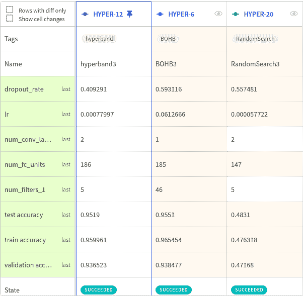

# 超宽带和 BOHB:了解超参数优化算法的最新发展

> 原文：<https://web.archive.org/web/https://neptune.ai/blog/hyperband-and-bohb-understanding-state-of-the-art-hyperparameter-optimization-algorithms>

如果你想了解最先进的超参数优化算法(HPO)，在这篇文章中我会告诉你它们是什么以及它们是如何工作的。

作为一名 ML 研究人员，我已经阅读并使用了相当多的最新 HPO 算法，在接下来的几节中，我将与您分享我迄今为止的发现。

希望你喜欢！

## 一点关于 HPO 的方法

HPO 是一种帮助解决机器学习算法的超参数调整挑战的方法。

杰出的 ML 算法具有多个不同的复杂超参数，这些超参数产生巨大的搜索空间。大量的初创企业选择在其管道的核心使用深度学习，深度学习方法中的搜索空间甚至比传统的 ML 算法更大。调谐到一个巨大的搜索空间是一项艰巨的挑战。

要解决 HPO 问题，我们需要使用数据驱动的方法。手动方法无效。

已经提出了许多解决 HPO 问题的方法:

我们将讨论四种主要的、最有效的方法。

## 贝叶斯优化

要理解 BO，我们应该对网格搜索和随机搜索方法有所了解(在本文的[中有很好的解释)。我只是要总结一下这些方法。](https://web.archive.org/web/20221024193328/https://www.jmlr.org/papers/volume13/bergstra12a/bergstra12a.pdf)

假设我们的搜索空间只包含两个超参数，一个是重要的，另一个是不重要的。我们希望对它们进行调整，以提高模型的准确性。如果它们中的每一个都有 3 个不同的值，那么整个搜索空间将有 9 个可能的选择。我们可以尝试其中的每一个来找到两个超参数的最佳值。

但是从上图可以看出，网格搜索无法找到重要的超参数的最佳值。对此的一个解决方案可能是随机遍历搜索空间，就像下图一样。

### **贝叶斯优化为什么有效？**

随机搜索最终收敛到最优答案，但这种方法就是这样的盲目搜索！有没有更智能的搜索方式？是的——贝叶斯优化，由 J . mo kus 提出。你可以在这本[贝叶斯优化入门](https://web.archive.org/web/20221024193328/https://static.sigopt.com/b/20a144d208ef255d3b981ce419667ec25d8412e2/static/pdf/SigOpt_Bayesian_Optimization_Primer.pdf)和[机器学习算法实用贝叶斯优化](https://web.archive.org/web/20221024193328/http://papers.nips.cc/paper/4522-practical-bayesian-optimization)中找到更多关于 BO 的信息。

本质上，贝叶斯优化是一种概率模型，它想通过基于先前观察的学习来学习一个代价昂贵的目标函数。它有两个强大的功能:代理模型和获取功能。

在上图中，你可以看到基于[自动机器学习](https://web.archive.org/web/20221024193328/https://link.springer.com/chapter/10.1007/978-3-030-05318-5_1)中超参数优化章节的贝叶斯优化的一个很好的解释。在该图中，我们希望找到虚线所示的真实目标函数。假设我们有一个连续的超参数，在第二次迭代中我们观察到两个黑点，然后我们拟合了一个替代模型(回归模型),即黑线。黑线周围的蓝管是我们的不确定性。

我们还有一个获取函数，这是我们探索搜索空间以找到新的观测最优值的方法。换句话说，获取函数帮助我们改进代理模型并选择下一个值。在上图中，采集函数显示为橙色曲线。获取最大值意味着不确定性最大，而预测值较低。

### **贝叶斯优化的利弊**

贝叶斯优化最重要的优点是它可以很好地运行黑箱函数。BO 也是数据高效的，并且对噪声具有鲁棒性。但是它不能很好地与并行资源 duo 一起工作，因为优化过程是顺序的。

 [https://web.archive.org/web/20221024193328if_/https://www.youtube.com/embed/3_E4A4G7nME?version=3&rel=1&showsearch=0&showinfo=1&iv_load_policy=1&fs=1&hl=en-US&autohide=2&wmode=transparent](https://web.archive.org/web/20221024193328if_/https://www.youtube.com/embed/3_E4A4G7nME?version=3&rel=1&showsearch=0&showinfo=1&iv_load_policy=1&fs=1&hl=en-US&autohide=2&wmode=transparent)

视频

*图片来自 Marius Lindauer* *在开放数据科学大会上的演讲*

 *### **贝叶斯优化的实现**

是时候看看一些贝叶斯优化实现了。我列出了最受欢迎的几个:

实施名称

代理模型

链接

Surrogate model:

随机森林

Surrogate model:

树 Parzen 估计量

Surrogate model:

高斯过程

Surrogate model:

高斯过程、RF 等。

多重保真优化

## 在贝叶斯方法中，目标函数的估计是非常昂贵的。有没有更便宜的估计目标函数的方法？多重保真优化方法是答案。我会告诉你:

连续有超带

1.  BOHB
2.  作为额外的资源，在下面的视频中，Andreas Mueller 非常好地解释了多保真度优化方法。
3.  [https://web.archive.org/web/20221024193328if_/https://www.youtube.com/embed/tqtTHRwa8dE?version=3&rel=1&showsearch=0&showinfo=1&iv_load_policy=1&fs=1&hl=en-US&autohide=2&wmode=transparent](https://web.archive.org/web/20221024193328if_/https://www.youtube.com/embed/tqtTHRwa8dE?version=3&rel=1&showsearch=0&showinfo=1&iv_load_policy=1&fs=1&hl=en-US&autohide=2&wmode=transparent)

    视频

*[安德里亚斯·穆勒](https://web.archive.org/web/20221024193328/https://www.youtube.com/channel/UCMEXgDffQy6nS2a74Gby8ZA) : [应用机器学习 2019](https://web.archive.org/web/20221024193328/https://youtu.be/tqtTHRwa8dE)*

连续拥有

连续减半试图给最有希望的方法提供最多的预算。它假设所有配置都可以提前停止，并且可以获得验证分数。

## 假设您有 N 种不同的配置和预算(例如时间)。在每次迭代中，正如你在下图中看到的，连续的一半保留了配置中最好的一半，而丢弃了不好的一半算法。它将继续下去，直到我们只有一个单一的配置。此方法将在达到其预算的最大值时完成。

连续减半最初是在 Kevin Jamieson 和 Ameet Talwalkar 撰写的[非随机最佳臂识别和超参数优化](https://web.archive.org/web/20221024193328/http://proceedings.mlr.press/v51/jamieson16.pdf)中提出的。

**连续减半有什么问题？**

在连续减半中，我们需要在开始时选择多少配置和需要多少切割之间进行权衡。在下一节中，您将看到 Hyperband 如何解决这个问题。

### 超波段

这种方法是连续减半算法的扩展，由李丽莎和其他人提出的一种新的基于 Bandit 的超参数优化方法。

## 我提到过，连续减半方法在选择数字配置和分配预算之间存在权衡。为了解决这个问题，HyperBand 提出使用不同的预算频繁执行连续减半方法，以找到最佳配置。在下图中，你可以看到 HyperBand 比随机搜索有更好的性能。

你可以在 automl.org 的[的](https://web.archive.org/web/20221024193328/https://github.com/automl) [HpBandSter](https://web.archive.org/web/20221024193328/https://github.com/automl/HpBandSter) GitHub 页面中找到 HyperBand 的一个简单实现。如果你想知道如何使用这个 Python 工具，可以查看一下[文档](https://web.archive.org/web/20221024193328/https://automl.github.io/HpBandSter/build/html/optimizers.html)。

BOHB

BOHB 是一种最先进的超参数优化算法，由 Stefan Falkner、Aaron Klein 和 Frank Hutter 撰写的 [BOHB:大规模鲁棒和高效的超参数优化](https://web.archive.org/web/20221024193328/https://arxiv.org/abs/1807.01774)中提出。BOHB 算法背后的想法是基于一个简单的问题——为什么我们要重复运行连续减半？

## BOHB 使用贝叶斯优化算法，而不是在连续减半的基础上盲目重复的方法。事实上，BOHB 将 HyperBand 和 BO 结合起来，以一种高效的方式使用这两种算法。丹·瑞恩在他的演讲中完美地解释了 BOHB 方法。[将其添加到您的观察列表](https://web.archive.org/web/20221024193328/https://youtu.be/IqQT8se9ofQ)。

 [https://web.archive.org/web/20221024193328if_/https://www.youtube.com/embed/IqQT8se9ofQ?version=3&rel=1&showsearch=0&showinfo=1&iv_load_policy=1&fs=1&hl=en-US&autohide=2&wmode=transparent](https://web.archive.org/web/20221024193328if_/https://www.youtube.com/embed/IqQT8se9ofQ?version=3&rel=1&showsearch=0&showinfo=1&iv_load_policy=1&fs=1&hl=en-US&autohide=2&wmode=transparent)

视频

*Dan Ryan 在 PyData Miami 2019* 上关于高效灵活的超参数优化的精彩[演讲](https://web.archive.org/web/20221024193328/https://youtu.be/IqQT8se9ofQ)

BOHB 是一种多保真度优化方法，这些方法依赖于预算，因此找到相应的预算很重要。另一方面，BOHB 是健壮的、灵活的和可伸缩的。如果你需要更详细的信息，你可能会想要查看安德烈·比登卡普和弗兰克·胡特关于 BOHB 的官方博客文章。

另外， [HpBandSter](https://web.archive.org/web/20221024193328/https://github.com/automl/HpBandSter) 是 BOHB 和 HyperBand 的一个很好的实现。你可以在这里找到它的文档[。](https://web.archive.org/web/20221024193328/https://automl.github.io/HpBandSter/build/html/optimizers/bohb.html)

在 Neptune 中随机搜索 vs . HyperBand vs . BOHB+结果比较

现在我们已经知道了描述，也熟悉了方法，下面我们就用[海王星](https://web.archive.org/web/20221024193328/https://ui.neptune.ai/mjbahmani/HyperBand-BOHB)基于这些方法做一些实验和比较。

## 如果你想跟着我:

因为我决定在平等的基础上做这个实验，所以我使用了 [HpBandSter](https://web.archive.org/web/20221024193328/https://github.com/automl/HpBandSter) ，它有一个 BOHB 的实现，HyperBand 和 RandomSearch 作为优化器。一个官方的例子可以在[这里](https://web.archive.org/web/20221024193328/https://automl.github.io/HpBandSter/build/html/auto_examples/example_5_mnist.html)找到。基于这个例子，我们在 Pytorch 中有一个小 CNN，它将针对 [MNIST](https://web.archive.org/web/20221024193328/https://en.wikipedia.org/wiki/MNIST_database) 数据集进行调谐。我基于三种不同的优化器运行了这个示例:

BOHB

超波段

1.  随机搜索。
2.  对于每个优化器，我使用了以下预算:
3.  RandomSearch. 

配置

范围值

[1,2,3,4,8,10]

Range value

Range value:

[1,2,3,4,8,10]

这意味着我们已经运行了不同的组合，至少 26 个实验来检查优化器的能力(BOHB，超波段，随机搜索)。此外，通过这个示例，我们希望根据以下超参数找到 CNN 的最佳配置。

第一个配置层中的过滤器数量

全连接层中隐藏单元的数量

Number of filters in the first conf layer

Number of hidden units in fully connected layer

*配置取自[惠普主机文档](https://web.archive.org/web/20221024193328/https://automl.github.io/HpBandSter/build/html/auto_examples/example_5_pytorch_worker.html)*

在海王星中用各种配置运行这些实验后，我得到了一些有见地的结果。

[*跟随海王星*](https://web.archive.org/web/20221024193328/https://ui.neptune.ai/mjbahmani/HyperBand-BOHB/experiments?viewId=9b273e07-5189-4333-8197-e913931c97de) 的所有实验

在这里，您可以看到 n_iteration=3 和 max_budget=3 的优化器之间的良好对比。我发现，如果我增加迭代次数，所有优化器最终都会获得最佳性能，但当预算很大时，BOHB 可以做得更好。

最终，对于 max_budget=5 和 n_iteration=4，每个优化器都会找到一个最佳配置，您可以在下表中查看。

Here you can see a nice contrast between those optimizers for n_iteration=3 and max_budget=3\. I find that if I increase the number of iterations, all optimizers finally get best performance, but when the budget is significant, BOHB could do it better.

*Comparison between (BOHB, HyperBand, RandomSearch) for n_iteration=3 and max_budget=*

超参数

调谐前的范围

调优后:随机搜索

调谐后:超波段

调谐后:BOHB

[1e-6，1e-2]

0.010

Range before tuning:

0.00031

After tuning: Random search:

0.0078

After tuning: Hyperband:

[1,3]

After tuning: BOHB:

2

Range before tuning:

1

After tuning: Random search:

第一个配置层中的过滤器数量

After tuning: Hyperband:

[4, 64]

13

Range before tuning:

9

After tuning: Random search:

[0, 0.9]

After tuning: Hyperband:

0.77

Range before tuning:

0.06

After tuning: Random search:

全连接层中隐藏单元的数量

After tuning: Hyperband:

[8,256]

177

Range before tuning:

248

After tuning: Random search:

177

After tuning: Hyperband:

最后的想法

感谢您加入我的旅程！我们涵盖了:

## 贝叶斯优化的工作原理。

多重保真优化。

*   BOHB 和超级乐队，以及他们是如何工作的。
*   哪个优化器(HyperBand 和 BOHB)在实验中效果更好？
*   希望你喜欢这本书！
*   MJ 巴赫马尼

一位对机器学习领域充满热情的经验丰富的软件工程师。他对开发尽可能高效和自动地解决真正的机器学习问题的软件特别感兴趣。

### **阅读下一篇**

如何跟踪机器学习模型的超参数？

* * *

卡米尔·卡什马雷克|发布于 2020 年 7 月 1 日

## How to Track Hyperparameters of Machine Learning Models?

**机器学习算法可通过称为超参数**的多个量规进行调整。最近的深度学习模型可以通过数十个超参数进行调整，这些超参数与数据扩充参数和训练程序参数一起创建了非常复杂的空间。在强化学习领域，您还应该计算环境参数。

数据科学家要**控制好** **超参数** **空间**，才能**使** **进步**。

在这里，我们将向您展示**最近的** **实践**，**提示&技巧，**和**工具**以最小的开销高效地跟踪超参数。你会发现自己掌控了最复杂的深度学习实验！

为什么我应该跟踪我的超参数？也就是为什么这很重要？

几乎每一个深度学习实验指南，像[这本深度学习书籍](https://web.archive.org/web/20221024193328/https://www.deeplearningbook.org/contents/guidelines.html)，都建议你如何调整超参数，使模型按预期工作。在**实验-分析-学习循环**中，数据科学家必须控制正在进行的更改，以便循环的“学习”部分正常工作。

## 哦，忘了说**随机种子也是一个超参数**(特别是在 RL 领域:例如检查[这个 Reddit](https://web.archive.org/web/20221024193328/https://www.reddit.com/r/MachineLearning/comments/76th74/d_why_random_seeds_sometimes_have_quite_large/) )。

超参数跟踪的当前实践是什么？

让我们逐一回顾一下管理超参数的常见做法。我们关注于如何构建、保存和传递超参数给你的 ML 脚本。

## What is current practice in the hyperparameters tracking?

Let’s review one-by-one common practices for managing hyperparameters. We focus on how to build, keep and pass hyperparameters to your ML scripts.

[Continue reading ->](/web/20221024193328/https://neptune.ai/blog/how-to-track-hyperparameters)

* * **