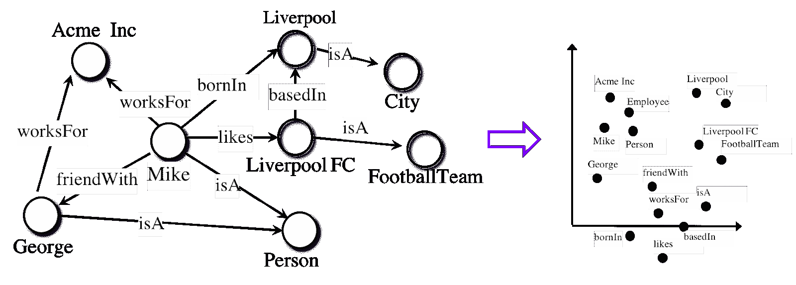
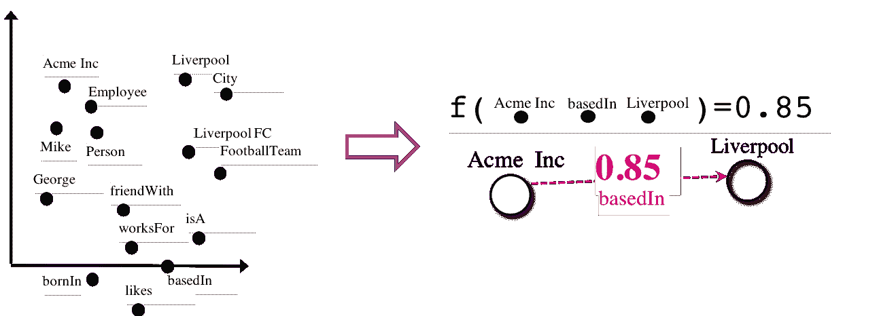
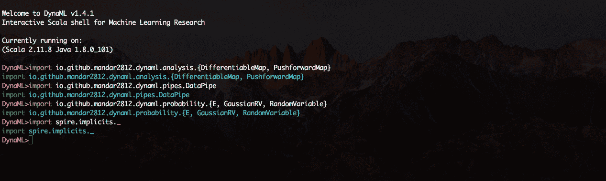
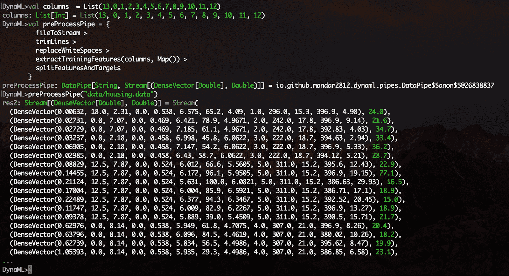
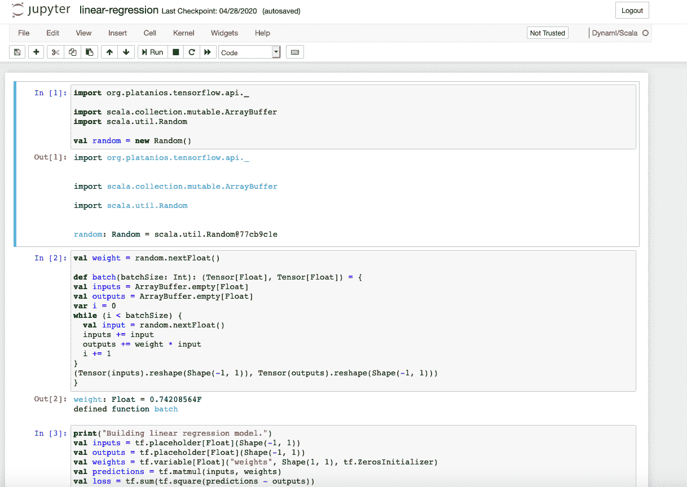

# 深度学习的顶级开源工具和库——ICLR 2020 经验

> 原文：<https://web.archive.org/web/https://neptune.ai/blog/iclr-2020-deep-learning-open-source>

前沿的深度学习是在哪里产生和讨论的？

排名靠前的地方之一是 ICLR，这是一个领先的深度学习会议，于 2020 年 4 月 27 日至 30 日举行。作为一个完全虚拟的活动，有 5600 多名参与者和近 700 份论文/海报，它可以被称为一个巨大的成功。您可以在这里、[这里](https://web.archive.org/web/20221206133724/https://medium.com/@iclr_conf/gone-virtual-lessons-from-iclr2020-1743ce6164a3)或[这里](https://web.archive.org/web/20221206133724/https://www.analyticsvidhya.com/blog/2020/05/key-takeaways-iclr-2020/)找到关于会议的全面信息。

虚拟社交会议是 ICLR 2020 的吸引力之一。我们决定在最先进的 DL 研究中运行我们自己命名为**的开源工具和实践。我们选择这个主题是因为合适的工具是深度学习研究不可避免的一部分。该领域的进步导致了大型框架生态系统(TensorFlow、[、PyTorch](/web/20221206133724/https://neptune.ai/blog/model-training-libraries-pytorch-ecosystem) 、MXNet)以及服务于特定需求的小型定向工具的激增。**

我们社交活动的目的是会见开源工具的创造者和用户，并与深度学习社区分享经验和印象。我们总共召集了 100 多人，包括**工具的维护人员**，我们给了他们很短的时间来展示他们的工作。我们对展示的**工具和库的多样性和创造性感到惊讶和兴奋。**

在本帖**中，创作者再次登台**,**告诉我们更多关于他们的项目**。

在这里，出席 ICLR 社交活动的八位创造者分享了更多关于他们工具的点滴。因此，亲爱的读者，由于他们的工作，你对所有可能的奇迹有了第一手的了解。

每一部分都以非常简洁的方式告诉您几件事情:

1.  工具/库解决什么问题？
2.  如何运行或创建一个极简的例子？
3.  深入了解库/工具的外部资源数量。
4.  创作者简介，以防你想联系到他们。

你可以跳到下面特定部分，或者只是一个一个地浏览，以获得一些灵感:

*(按工具名称的字母顺序)*

* * *

## **放大图**


### 知识图嵌入模型

**描述**

### 知识图是一种表示复杂系统的通用语言。

无论是社交网络、生物信息学数据集，还是零售购买数据，将知识建模为图表可以让组织捕捉到否则会被忽略的模式。

然而，揭示这些数据之间的联系需要专门为图表设计的机器学习模型。

[AmpliGraph](https://web.archive.org/web/20221206133724/https://github.com/Accenture/AmpliGraph) 是 Apache 2 许可的一套神经机器学习模型，称为知识图嵌入。这种模型用低维向量对图的节点和边进行编码，并组合它们来预测缺失的事实。仅举几个例子，知识图嵌入在知识图完成、知识发现和基于链接的聚类中有应用。

AmpliGraph 降低了知识图嵌入的门槛，使这种模型可以被没有经验的用户使用，从而培养了一个从业者社区，可以利用开源 API 的优势在知识图上进行机器学习。我们将学习如何从真实世界的知识图中生成和可视化嵌入，以及如何在下游的机器学习任务中使用它们。

首先，下面是一个最小的代码片段，用于在基准图数据集上训练模型，并预测缺失的链接:

AmpliGraph 最初由埃森哲都柏林实验室开发，用于各种工业项目。

```py
from ampligraph.datasets import load_fb15k_237
from ampligraph.latent_features import TransE

X = load_fb15k_237()

model = TransE(batches_count=100, epochs=20, k=20, verbose=True)

model.fit(X['train'])

model.calibrate(X['valid'], positive_base_rate=0.5)

X['test'][42]

model.predict_proba(X['test'][42])

```



*AmpliGraph’s machine learning models generate knowledge graph embeddings, vector representations of concepts in a metric space.*



*It then combines embeddings with model-specific scoring functions to predict unseen and novel links.*

[GitHub](https://web.archive.org/web/20221206133724/https://github.com/Accenture/AmpliGraph) | [文档](https://web.archive.org/web/20221206133724/https://docs.ampligraph.org/)

**自动装载**

* * *

## 表格数据预处理平台


### **描述**

[Automunge](https://web.archive.org/web/20221206133724/https://www.automunge.com/) 是一个 Python 库平台，为机器学习准备表格数据。通过应用，简单的特征工程变换被应用于标准化、数字编码和插入填充。转换“适合”训练集的属性，然后在此基础上一致地应用于测试数据。转换可以自动执行，从内部库分配，或由用户自定义。填充选项包括“ML 填充”，其中自动机器学习模型针对每个列进行训练，以预测填充。

### 换句话说，简单地说:

`automunge(.)`为机器学习准备表格数据。

`postmunge(.)`持续高效地准备额外数据。

*   pip 安装现在可以使用自动安装:
*   安装后，在笔记本中运行以初始化:

使用默认参数运行自动列车组处理的位置:

```py
pip install Automunge
```

为了测试数据的后续一致处理，使用从相应的`automunge(.)`调用中填充的`postprocess_dict`字典，运行:

```py
from Automunge import Automunger
am = Automunger.AutoMunge()

```

用户可以通过`assigncat`和`assigninfill`参数在`automunge(.)`调用中指定转换或填充类型。例如，对于具有列标题“列 1”和“列 2”的训练集，可以将具有 ML 填充的最小-最大缩放(“mnmx”)分配给列 1，将具有模式填充的单热编码(“text”)分配给列 2。任何未明确指定的列都将遵从自动化。

```py
train, trainID, labels,
validation1, validationID1, validationlabels1,
validation2, validationID2, validationlabels2,
test, testID, testlabels,
labelsencoding_dict, finalcolumns_train, finalcolumns_test,
featureimportance, postprocess_dict
= am.automunge(df_train)
```

[网站](https://web.archive.org/web/20221206133724/http://automunge.com/) [](https://web.archive.org/web/20221206133724/https://github.com/Automunge/AutoMunge)| [GitHub](https://web.archive.org/web/20221206133724/https://github.com/Automunge/AutoMunge) | [简介](https://web.archive.org/web/20221206133724/https://medium.com/automunge/automunge-explained-in-brief-354c9b92aa1c)

```py
test, testID, testlabels,
labelsencoding_dict, postreports_dict
= am.postmunge(postprocess_dict, df_test)

```

**DynaML**

```py
train, trainID, labels,
validation1, validationID1, validationlabels1,
validation2, validationID2, validationlabels2,
test, testID, testlabels,
labelsencoding_dict, finalcolumns_train, finalcolumns_test,
featureimportance, postprocess_dict
= am.automunge(df_train,
            assigncat = {'mnmx':['column1'], 'text':['column2']},
            assigninfill = {'MLinfill':['column1'], 'modeinfill':['column2']})

```

Scala 中的机器学习

* * *

## **描述**


### DynaML 是一个基于 Scala 的工具箱，用于机器学习研究和应用。它旨在为用户提供一个端到端的环境，有助于:

开发/原型模型。

### 处理大型复杂的数据管道。

可视化数据和结果。

1.  以脚本、笔记本的形式重用代码。
2.  DynaML 充分利用了 Scala 语言和生态系统的优势，提供了一个能够提高性能和灵活性的环境。它基于[菊石](https://web.archive.org/web/20221206133724/https://ammonite.io/) scala shell、 [Tensorflow-Scala](https://web.archive.org/web/20221206133724/https://github.com/eaplatanios/tensorflow_scala) 和 [Breeze](https://web.archive.org/web/20221206133724/https://github.com/scalanlp/breeze) 数值计算库等优秀项目构建。
3.  DynaML 的一个关键组件是 REPL/shell，它具有语法高亮和高级自动完成/命令历史。
4.  在终端会话中复制粘贴代码片段，以运行它们。

该环境加载了 2d 和 3d 可视化支持，可以直接从 shell 会话中绘制结果。

[数据管道](https://web.archive.org/web/20221206133724/https://transcendent-ai-labs.github.io/DynaML/pipes/pipes/)模块可以方便地以可组合和模块化的方式创建数据处理管道。使用`DataPipe`构造函数创建函数并包装它们，使用`>`操作符组成功能块。



一个实验性的 Jupyter 笔记本集成特性也是可用的，资源库中的 [*笔记本*](https://web.archive.org/web/20221206133724/https://github.com/transcendent-ai-labs/DynaML/tree/master/notebooks) 目录包含了一些使用 DynaML-Scala Jupyter 内核的例子。

[用户指南](https://web.archive.org/web/20221206133724/https://transcendent-ai-labs.github.io/DynaML/)包含广泛的支持和文档，用于学习和充分利用 DynaML 环境。


*3D charts are rendered using the [jzy3d](https://web.archive.org/web/20221206133724/http://www.jzy3d.org/) Java API.*

突出 DynaML 优势的一些有趣的应用程序是:



*Processing streams of data is intuitive when using pipe composition, the pipeline is divided logically into steps; with each step doing a single task.*

[GitHub](https://web.archive.org/web/20221206133724/https://github.com/transcendent-ai-labs/DynaML/) | [用户指南](https://web.archive.org/web/20221206133724/https://transcendent-ai-labs.github.io/DynaML/)



*The [linear regression notebook](https://web.archive.org/web/20221206133724/https://github.com/transcendent-ai-labs/DynaML/blob/master/notebooks/linear-regression.ipynb) demonstrates the use of the low level Tensorflow API to compute coefficients of a linear regression model.*

九头蛇

配置和参数管理器

**描述**

* * *

## Hydra 由脸书人工智能公司开发，是一个简化研究应用程序开发的 Python 框架，提供了通过配置文件和命令行组合和覆盖配置的能力。它还提供参数扫描支持，通过插件远程和并行执行，自动工作目录管理和动态标签完成。


### 使用 Hydra 还可以使您的代码在不同的机器学习环境中具有更好的可移植性。使您能够在个人工作站、公共集群和私有集群之间移动，而无需更改代码。它通过可插拔架构实现这一点。

**基本示例:**

### 这个例子使用了数据库配置，但是您可以很容易地用模型、数据集或任何您想要的东西来替换它。

**config.yaml**

**my_app.py** :

#### 您可以从命令行覆盖配置中的任何内容:

**作文示例:**

您可能希望在两种不同的数据库配置之间进行切换:

```py
db:
  driver: mysql
  user: omry
  pass: secret
```

创建此目录结构:

```py
import hydra
from omegaconf import DictConfig

@hydra.main(config_path="config.yaml")
def my_app(cfg : DictConfig) -> None:
  print(cfg.pretty())

if __name__ == "__main__":
  my_app()
```

**config.yaml:**

```py
$ python my_app.py db.user=root db.pass=1234
db:
  driver: mysql
  user: root
  pass: 1234
```

#### defaults 是一个特殊的指令，告诉 Hydra 在构造配置对象时使用 db/mysql.yaml。
您现在可以从中选择要使用的数据库配置，并从命令行覆盖值:

查看[教程](https://web.archive.org/web/20221206133724/https://hydra.cc/docs/next/tutorials/intro)了解更多信息。

此外，一些激动人心的新功能即将推出:

```py
├── db
│ ├── mysql.yaml
│ └── postgresql.yaml
├── config.yaml
└── my_app.py
```

强类型配置(结构化配置)

```py
defaults:
  - db: mysql

website:
  domain: example.com
```

通过 Ax 和 Nevergrad 插件优化超参数

```py
$ python my_app.py db=postgresql db.timeout=20
db:
  driver: postgresql
  pass: drowssap
  timeout: 20
  user: postgre_user
website:
	domain: example.com
```

通过射线发射器插件启动 AWS

通过 joblib 插件进行本地并行执行

*   还有更多。
*   [网站](https://web.archive.org/web/20221206133724/https://hydra.cc/) | [GitHub](https://web.archive.org/web/20221206133724/https://github.com/facebookresearch/hydra) | [教程](https://web.archive.org/web/20221206133724/https://hydra.cc/docs/tutorial/simple_cli) | [博文](https://web.archive.org/web/20221206133724/https://medium.com/pytorch/hydra-a-fresh-look-at-configuration-for-machine-learning-projects-50583186b710) | [推特](https://web.archive.org/web/20221206133724/http://hydra_framework/)
*   **Larq**
*   二值化神经网络

**描述**

Larq 是一个开源 Python 包的生态系统，用于构建、训练和部署二进制神经网络(BNNs)。bnn 是深度学习模型，其中激活和权重不使用 32、16 或 8 位编码，而是仅使用 1 位。这可以大大加快推理时间和降低能耗，使 BNNs 非常适合移动和边缘设备。

* * *

## 开源 Larq 生态系统由三个主要组件组成:


### Larq 是一个强大而易用的库，用于构建和训练极度量化的神经网络。它提供了一致而简单的 API，可扩展并与更大的 TensorFlow Keras 生态系统完全兼容。这允许在您当前的代码库中逐步采用，并在开发模型时实现快速迭代。虽然 Larq 主要关注于 BNNs，但它也可以用于训练具有任意精确权重和激活的网络

Larq Zoo 提供了 bnn 的参考实现，可与预训练的权重一起使用。它的目的是鼓励可复制的研究，使研究人员能够在最新的 BNN 文献的基础上进行研究，而不必花费大量的时间复制现有的论文。

### Larq 计算引擎是一个用于部署 bnn 的推理库。它构建在 TensorFlow Lite 之上，包括一个基于 MLIR 的转换器，用于将 Larq 模型转换为与 TF Lite 运行时兼容的 FlatBuffer 文件。它目前支持基于 ARM64 的移动平台，如 Android 手机和 Raspberry Pi，并通过使用手动优化的二进制卷积内核和针对 BNN 模型的网络级优化，在设备上的推理速度方面实现了一流的性能。

我们不断创造更好、更快的模型，并将 Larq 生态系统扩展到新的硬件平台和深度学习应用。例如，我们目前正在致力于 8 位量化的端到端集成，因此您可以使用 Larq 来训练和部署混合二进制和 8 位网络。

[网站](https://web.archive.org/web/20221206133724/https://larq.dev/)|[GitHub larq/larq](https://web.archive.org/web/20221206133724/https://github.com/larq/larq)|[GitHub larq/zoo](https://web.archive.org/web/20221206133724/https://github.com/larq/zoo)|[GitHub larq/compute-engine](https://web.archive.org/web/20221206133724/https://github.com/larq/compute-engine)|[教程](https://web.archive.org/web/20221206133724/https://docs.larq.dev/larq/tutorials/mnist/) | [博客](https://web.archive.org/web/20221206133724/https://blog.larq.dev/) | [推特](https://web.archive.org/web/20221206133724/https://twitter.com/plumeraihq)

1.  麦克内尔
2.  对数线性时间内的近似核展开
3.  **描述**

第一个开源的 C++库，通过随机特性提供了内核近似值，还提供了一个成熟的 DL 框架。

McKernel 提供了四种不同的可能用途:

* * *

## 独立照明快速开源 Hadamard。用于:压缩、加密或量子计算。


### 极快的内核方法。用在:SVM 在 DL 上有用的地方。例如在机器人和医疗保健的 ML 的一些应用中。其他令人兴奋的新兴用途包括联合学习和通信中的信道估计。

DL 方法和内核扩展的集成。培育具有更好的人为/数学先验的新 DL 架构。

### DL 研究框架。解决 ML 中的多重开放问题。

控制整个计算的等式如下:

在这里，我们开创了一种通过使用随机特征来解释 DL 和内核方法([arxiv.org/pdf/1702.08159](https://web.archive.org/web/20221206133724/https://www.arxiv.org/pdf/1702.08159))的形式主义。理论背景依赖于四个巨人:高斯、维纳、傅立叶和卡尔曼。构建模块由拉希米和雷希特(NIPS 2007)和勒等人(2013)建立。

1.  **记住目标用户**

2.  McKernel 的主要受众是机器人、医疗保健、信号处理和通信领域的 ML 研究人员和从业者，他们正在寻找高效快速的 C++实现。在这种情况下，大多数 DL 库不能满足这种特定的需求，因为它们主要依赖于 Python 中的高级实现。以及更广泛的 ML 和 DL 社区中试图通过利用内核方法提出更好的 NN 架构的人们。

3.  下面是一个非常简单的实践示例，可以让库立即运行起来:

4.  下一步是什么？

端到端的训练，自我监督学习，元学习，与进化策略的集成，NAS 大大减少搜索空间，…

[GitHub](https://web.archive.org/web/20221206133724/http://github.com/curto2/mckernel) | [完整呈现](https://web.archive.org/web/20221206133724/http://www.decurto.tw/c/iclr2020_DeCurto.pdf)

#### **SCCH 培训引擎**

自动化 DL 开发例程

**描述**

#### **什么事？**

一个典型的深度学习流水线开发是相当标准的:数据预处理、任务设计/实现、训练、评估。然而，从一个项目到另一个项目的开发需要开发人员在开发过程的每个阶段都参与进来。这导致了相同动作的重复，代码复制粘贴，最终导致了错误。

SCCH 培训引擎的目标是两个最流行的框架 PyTorch 和 TensorFlow 的 DL 开发例程的统一和自动化。单个条目允许最小化开发时间，并防止开发错误。

* * *

## **为谁？**


### SCCH 培训引擎的灵活架构有两个用户交互级别:

**基本。**在这个级别，用户需要在配置文件中提供他的数据并定义训练参数。此后，包括数据处理、训练和验证在内的所有过程都将自动完成。因此，将提供一个已定义框架中的训练有素的网络。

### **高级。**由于发动机的模块化概念，用户可以根据自己的需要，通过部署自己的模型、损失和精度功能来修改发动机。这种模块化允许在不干扰核心管道的情况下添加额外的特征。

#### 它能做什么？

目前的特点是:

在 TensorFlow 和 PyTorch 上工作

#### 来自不同格式的数据解析的标准化管道

标准化的培训和验证渠道

支持分类、分割和检测任务

支持交叉验证

#### 开发中的功能:

训练参数的超参数搜索

*   给定检查点的负重和训练
*   GAN 架构支持
*   它是如何工作的？
*   要查看 SCCH 培训引擎的工作情况，您需要执行 2 个步骤:
*   只需复制存储库并使用`pip install requirements.txt`安装需求

运行`python main.py`查看在 LeNet-5 上处理和训练的 MNIST 玩具示例

*   关于如何创建配置文件以及如何使用高级特性的所有信息都可以在我们的 GitHub 页面上找到。
*   *主要功能稳定发布:2020 年 5 月底*
*   [GitHub](https://web.archive.org/web/20221206133724/https://github.com/SCCH-KVS/training-engine) | [网站](https://web.archive.org/web/20221206133724/https://www.scch.at/)

#### **记号标记符**

语言:Rust with Python API

1.  **描述**
2.  [huggingface/tokenizers](https://web.archive.org/web/20221206133724/https://github.com/huggingface/tokenizers) 提供最先进的 tokenizers，重点关注性能和多功能性。这使得培训新的标记器和使用它们变得轻而易举。无论你是 NLP 研究者还是 NLP 实践者，tokenizers 都能帮到你。

主要特点:

**极快**:标记化不应该成为 NLP 管道中的瓶颈，也不应该对数据集进行预处理。由于 Rust 中的本机实现，标记千兆字节的文本只需几秒钟。

**偏移/对准**:提供对准跟踪，即使是复杂的标准化处理。这使得像 NER 或问答这样的任务的文本提取变得容易。

* * *

## **预处理**:在输入你的语言模型之前，处理任何需要的预处理(截断、填充、添加特殊标记等等)。


### **简单训练**:在新的语料库上训练任何分词器。例如，为 BERT 培训一门新语言的标记器从未如此简单。

**多语言**:多语言绑定。现在，您可以开始在 Python、Node.js 或 Rust 中使用它。更多即将推出！

### 示例:

很快:

任何标记化器的单文件序列化和单行加载。

*   支持 Unigram。
*   在[拥抱脸](https://web.archive.org/web/20221206133724/https://huggingface.co/)，我们的使命是帮助每个人推进和民主化 NLP。
*   **资源和链接**
*   [GitHub hugging face/变形金刚](https://web.archive.org/web/20221206133724/https://github.com/huggingface/transformers)|[GitHub hugging face/tokenizers](https://web.archive.org/web/20221206133724/https://github.com/huggingface/tokenizers)|[Twitter](https://web.archive.org/web/20221206133724/https://twitter.com/huggingface)
*   摘要

首先:

感谢 Anthony，J. de Curtó i Díaz，Luca，Lukas，Mandar，Natalia，Nicholas 和 Omry 为这篇文章付出的努力！

*   没有你，它永远不会被创造出来。
*   在这篇文章中，工具制造商只是强调了现在可能的前沿。考虑的主题范围从配置管理思想、有效的文本标记到知识图嵌入。我们甚至接触了二值化的神经网络。

我们强烈建议给他们一个尝试，因为他们可以让你的研究更容易和(可能)更快——无论是在学术还是工业环境中。

### 最后，我们愿意听取更多关于深度学习开源生态系统的信息。如果您有一些问题、想法或工具想带到舞台上，请联系 Kamil。你可以在下面找到他的联系方式。

本文由 ICLR 社交活动协办方协调:

* * *

# **PS:**

我们还针对 ICLR 2020 期间讨论的主要话题([来源](https://web.archive.org/web/20221206133724/https://www.analyticsvidhya.com/blog/2020/05/key-takeaways-iclr-2020/))发布了一系列帖子，即:

> **深度学习**(此处)
> 
> **强化学习**(此处)

**生成型**(此处)

**自然语言处理/理解**(此处)

找点时间看看它们吧！

This post was coordinated by the ICLR social event co-hosts:

* * *

**PS:**

We also built a series of posts focused on the main topics ([source](https://web.archive.org/web/20221206133724/https://www.analyticsvidhya.com/blog/2020/05/key-takeaways-iclr-2020/)) discussed during ICLR 2020, that is:

*   **Deep learning** ([here](/web/20221206133724/https://neptune.ai/blog/iclr-2020-deep-learning))
*   **Reinforcement learning** ([here](/web/20221206133724/https://neptune.ai/blog/iclr-2020-reinforcement-learning))
*   **Generative models** ([here](/web/20221206133724/https://neptune.ai/blog/iclr-2020-generative-models))
*   **Natural Language Processing/Understanding** ([here](/web/20221206133724/https://neptune.ai/blog/iclr-2020-nlp-nlu))

Find some time to take a look at them!