# ICLR 2020 大会最佳深度学习论文

> 原文：<https://web.archive.org/web/https://neptune.ai/blog/iclr-2020-deep-learning>

上周，我很高兴参加了学习表征国际会议( **ICLR** )，这是一个致力于深度学习各个方面的**研究的活动**。最初，会议本应在埃塞俄比亚的亚的斯亚贝巴举行，然而，由于新型冠状病毒疫情，会议虚拟化了。我敢肯定，对于组织者来说，将活动搬到网上是一个挑战，但我认为效果非常令人满意，正如你可以[在这里](https://web.archive.org/web/20220926095407/https://medium.com/@iclr_conf/gone-virtual-lessons-from-iclr2020-1743ce6164a3)看到的！

超过 1300 名发言人和 5600 名与会者证明，虚拟形式更容易为公众所接受，但同时，会议仍保持互动和参与。从众多有趣的介绍中，我决定**选择 16 个**，有影响力，发人深省。以下是来自 ICLR 的**最佳深度学习论文。**

## 最佳深度学习论文

### **1。关于神经常微分方程的鲁棒性**

深入研究神经常微分方程或简称 NeuralODE 的鲁棒性。将其作为构建更强大网络的基础。

[**论文**](https://web.archive.org/web/20220926095407/https://openreview.net/forum?id=B1e9Y2NYvS)

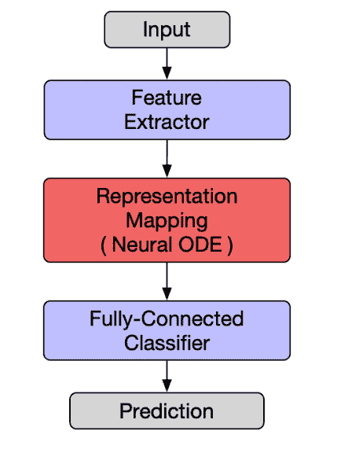

*The architecture of an ODENet. The neural ODE block serves as a dimension-preserving nonlinear mapping.*

* * *

### **2。为什么梯度裁剪加速训练:适应性的理论证明**

梯度裁剪可证明地加速了非光滑非凸函数的梯度下降。

*(TL；博士，来自[OpenReview.net](https://web.archive.org/web/20220926095407/http://openreview.net/))*

**[论文](https://web.archive.org/web/20220926095407/https://openreview.net/forum?id=BJgnXpVYwS) | [代码](https://web.archive.org/web/20220926095407/https://github.com/JingzhaoZhang/why-clipping-accelerates)**

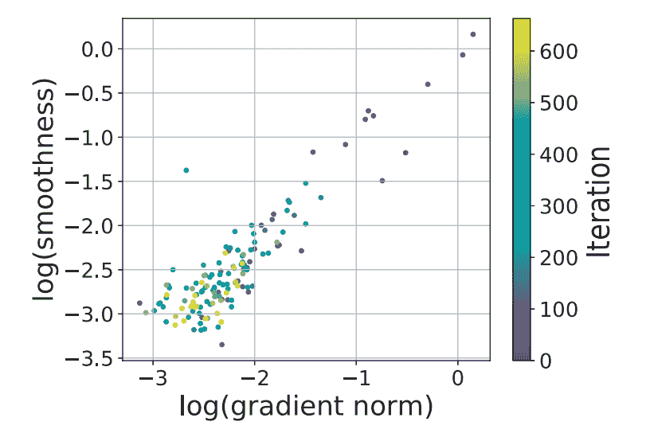

*Gradient norm vs local gradient Lipschitz constant on a log-scale along the training trajectory for AWD-LSTM (Merity et al., 2018) on PTB dataset. The colorbar indicates the number of iterations during training. *

### 第一作者:张京兆

[LinkedIn](https://web.archive.org/web/20220926095407/https://www.linkedin.com/in/jingzhao-zhang-6b0a09a4/) | [网站](https://web.archive.org/web/20220926095407/https://sites.google.com/view/jingzhao/home)

* * *

### **3。用于监督表示学习的目标嵌入自动编码器**

用于监督预测的新的通用目标嵌入自动编码器框架。作者给出了理论和经验的考虑。

[**论文**](https://web.archive.org/web/20220926095407/https://openreview.net/forum?id=BygXFkSYDH)

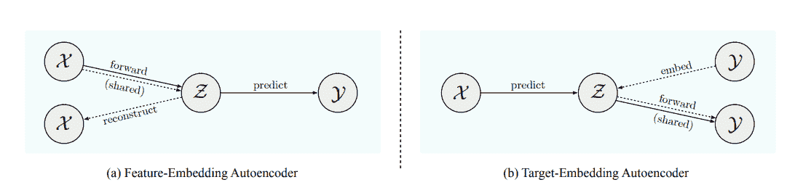

*(a) Feature-embedding and (b) Target-embedding autoencoders. Solid lines correspond to the (primary) prediction task; dashed lines to the (auxiliary) reconstruction task. Shared components are involved in both.*

* * *

### **4。理解和加强差异化架构搜索**

我们通过查看有效性损失的 Hessian 的特征值来研究 DARTS(可区分架构搜索)的失效模式，并基于我们的分析提出稳健性。

*(TL；博士，来自[OpenReview.net](https://web.archive.org/web/20220926095407/http://openreview.net/))*

**[论文](https://web.archive.org/web/20220926095407/https://openreview.net/forum?id=H1gDNyrKDS) | [代码](https://web.archive.org/web/20220926095407/https://github.com/automl/RobustDARTS)**

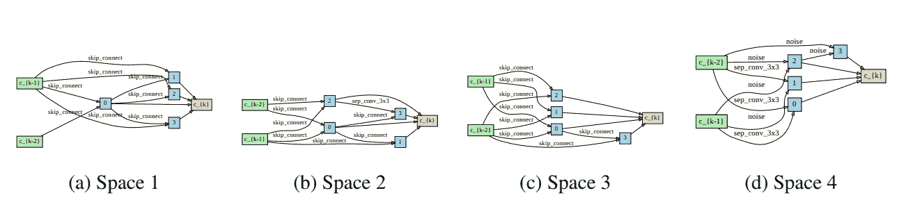

*The poor cells standard DARTS finds on spaces S1-S4\. For all spaces, DARTS chooses mostly parameter-less operations (skip connection) or even the harmful Noise operation. Shown are the normal cells on CIFAR-10.*

* * *

### **5。比较神经网络修剪中的倒回和微调**

在修剪神经网络时，不是在修剪后进行微调，而是将权重或学习率计划倒回它们在训练时的值，并从那里重新训练，以实现更高的精度。

*(TL；博士，来自[OpenReview.net](https://web.archive.org/web/20220926095407/http://openreview.net/))*

**[论文](https://web.archive.org/web/20220926095407/https://openreview.net/forum?id=S1gSj0NKvB) | [代码](https://web.archive.org/web/20220926095407/https://github.com/lottery-ticket/rewinding-iclr20-public)**

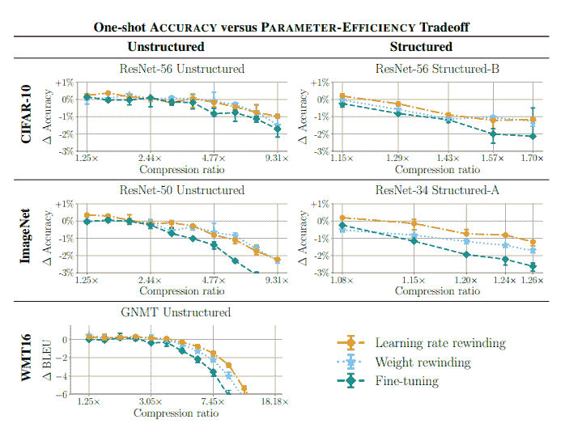

*The best achievable accuracy across retraining times by one-shot pruning.*

* * *

### **6。神经运算单元**

神经网络虽然能够逼近复杂的函数，但在精确的算术运算方面相当差。这项任务对深度学习研究人员来说是一个长期的挑战。这里，提出了新颖的神经加法单元(NAU)和神经乘法单元(NMU)，能够执行精确的加法/减法(NAU)和向量的乘法子集(MNU)。著名的第一作者是一名独立的研究员🙂

**[论文](https://web.archive.org/web/20220926095407/https://openreview.net/forum?id=H1gNOeHKPS) | [代码](https://web.archive.org/web/20220926095407/https://github.com/AndreasMadsen/stable-nalu)**

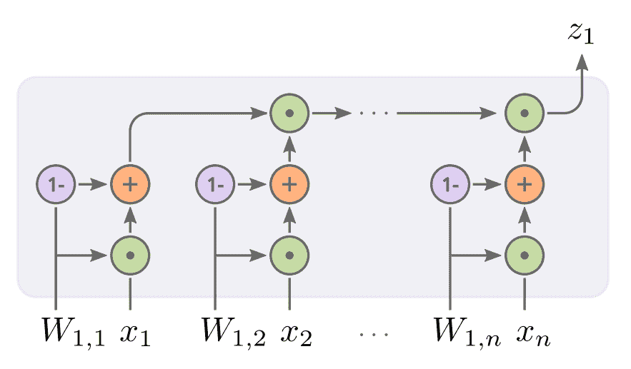

*Visualization of the NMU, where the weights (W[i,j] ) controls gating between 1 (identity) or x[i], each intermediate result is then multiplied explicitly to form z[j].*

* * *

### 7 .**。深度神经网络优化轨迹上的平衡点**

在深度神经网络训练的早期阶段，存在一个“平衡点”,它决定了整个优化轨迹的性质。

*(TL；博士，来自[OpenReview.net](https://web.archive.org/web/20220926095407/http://openreview.net/))*

[**论文**](https://web.archive.org/web/20220926095407/https://openreview.net/forum?id=r1g87C4KwB)

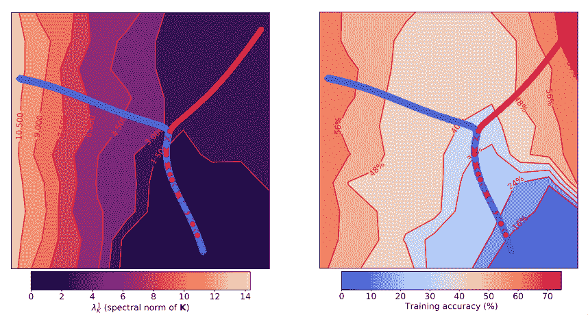

*Visualization of the early part of the training trajectories on CIFAR-10 (before reaching 65% training accuracy) of a simple CNN model optimized using SGD with learning rates η = 0.01 (red) and η = 0.001 (blue). Each model on the training trajectory, shown as a point, is represented by its test predictions embedded into a two-dimensional space using UMAP. The background color indicates the spectral norm of the covariance of gradients K (λ¹[K], left) and the training accuracy (right). For lower η, after reaching what we call the break-even point, the trajectory is steered towards a region characterized by larger λ¹[K] (left) for the same training accuracy (right).*

* * *

### **8。Hoppity:学习图形转换来检测和修复程序中的错误**

一种基于学习的方法，用于检测和修复 Javascript 中的错误。

*(TL；博士，来自[OpenReview.net](https://web.archive.org/web/20220926095407/http://openreview.net/))*

[**论文**](https://web.archive.org/web/20220926095407/https://openreview.net/forum?id=SJeqs6EFvB)

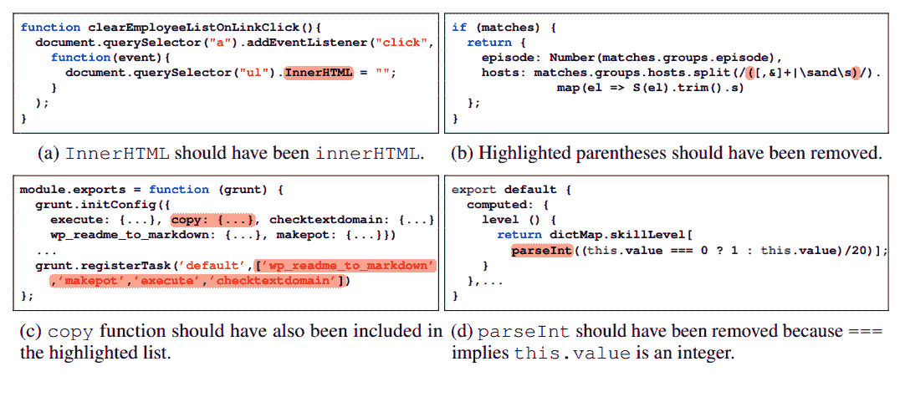

*Example programs that illustrate limitations of existing approaches inculding both rulebased static analyzers and neural-based bug predictors.*

* * *

### **9。通过代理选择:深度学习的高效数据选择**

我们可以通过使用小得多的代理模型来执行数据选择，从而显著提高深度学习中数据选择的计算效率。

*(TL；博士，来自[OpenReview.net](https://web.archive.org/web/20220926095407/http://openreview.net/))*

**[论文](https://web.archive.org/web/20220926095407/https://openreview.net/forum?id=HJg2b0VYDr) | [代码](https://web.archive.org/web/20220926095407/https://github.com/stanford-futuredata/selection-via-proxy)**

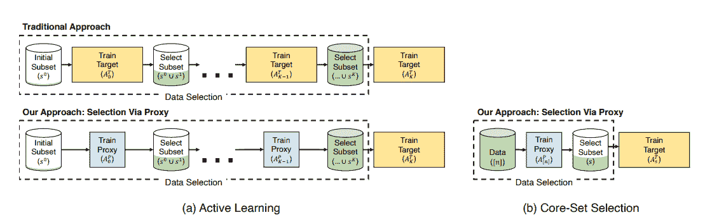

*SVP applied to active learning (left) and core-set selection (right). In active learning, we followed the same iterative procedure of training and selecting points to label as traditional approaches but replaced the target model with a cheaper-to-compute proxy model. For core-set selection, we learned a feature representation over the data using a proxy model and used it to select points to train a larger, more accurate model. In both cases, we found the proxy and target model have high rank-order correlation, leading to similar selections and downstream results.*

* * *

### 10。比特下降:重新审视神经网络的量子化

使用旨在更好的域内重构的结构化量化技术来压缩卷积神经网络。

*(TL；博士，来自[OpenReview.net](https://web.archive.org/web/20220926095407/http://openreview.net/))*

**[论文](https://web.archive.org/web/20220926095407/https://openreview.net/forum?id=rJehVyrKwH) | [代码](https://web.archive.org/web/20220926095407/https://drive.google.com/file/d/12QK7onizf2ArpEBK706ly8bNfiM9cPzp/view?usp=sharing)**

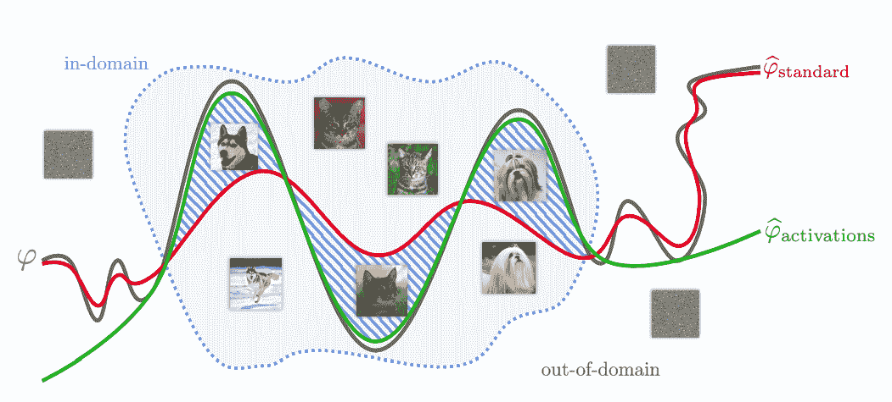

*Illustration of our method. We approximate a binary classifier ϕ that labels images as dogs or cats by quantizing its weights. Standard method: quantizing ϕ with the standard objective function (1) promotes a classifier ϕb[standard] that tries to approximate ϕ over the entire input space and can thus perform badly for in-domain inputs. Our method: quantizing ϕ with our objective function (2) promotes a classifier ϕb[activations] that performs well for in-domain inputs. Images lying in the hatched area of the input space are correctly classified by ϕ[activations] but incorrectly by ϕ[standard].*

* * *

### **11。用于在初始化时修剪神经网络的信号传播观点**

我们在初始化时形式化地描述了有效剪枝的初始化条件，并分析了由此产生的剪枝网络的信号传播特性，这导致了一种增强它们的可训练性和剪枝结果的方法。

*(TL；博士，来自[OpenReview.net](https://web.archive.org/web/20220926095407/http://openreview.net/))*

[**论文**](https://web.archive.org/web/20220926095407/https://openreview.net/forum?id=HJeTo2VFwH)

*(left) layerwise sparsity patterns c ∈ {0, 1} ^(100×100) obtained as a result of pruning for the sparsity level κ¯ = {10, .., 90}%. Here, black(0)/white(1) pixels refer to pruned/retained parameters; (right) connection sensitivities (CS) measured for the parameters in each layer. All networks are initialized with γ = 1.0\. Unlike the linear case, the sparsity pattern for the tanh network is nonuniform over different layers. When pruning for a high sparsity level (e.g., κ¯ = 90%), this becomes critical and leads to poor learning capability as there are only a few parameters left in later layers. This is explained by the connection sensitivity plot which shows that for the nonlinear network parameters in later layers have saturating, lower connection sensitivities than those in earlier layers.*

* * *

### **12。深度半监督异常检测**

我们介绍了深度 SAD，一种用于一般半监督异常检测的深度方法，它特别利用了标记异常。

*(TL；博士，来自[OpenReview.net](https://web.archive.org/web/20220926095407/http://openreview.net/))*

**[论文](https://web.archive.org/web/20220926095407/https://openreview.net/forum?id=HkgH0TEYwH) | [代码](https://web.archive.org/web/20220926095407/https://github.com/lukasruff/Deep-SAD-PyTorch)**

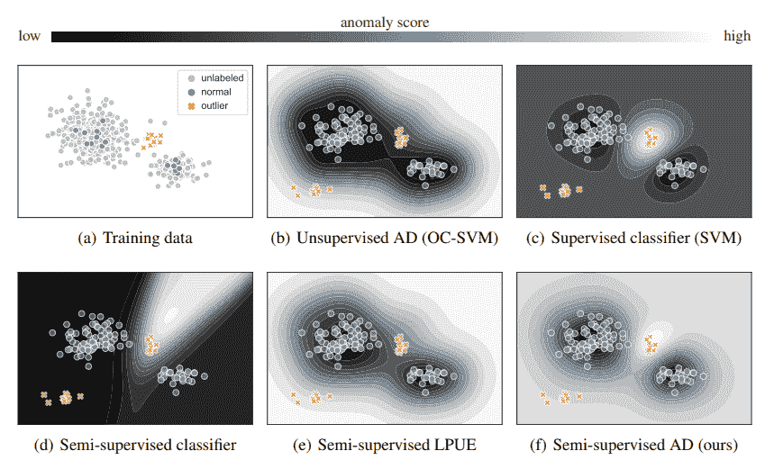

*The need for semi-supervised anomaly detection: The training data (shown in (a)) consists of (mostly normal) unlabeled data (gray) as well as a few labeled normal samples (blue) and labeled anomalies (orange). Figures (b)–(f) show the decision boundaries of the various learning paradigms at testing time along with novel anomalies that occur (bottom left in each plot). Our semi-supervised AD approach takes advantage of all training data: unlabeled samples, labeled normal samples, as well as labeled anomalies. This strikes a balance between one-class learning and classification.*

* * *

### 13。使用网格单元的空间特征分布的多尺度表示学习

我们提出了一个名为 Space2vec 的表征学习模型来编码地点的绝对位置和空间关系。

*(TL；博士，来自[OpenReview.net](https://web.archive.org/web/20220926095407/http://openreview.net/))*

**[论文](https://web.archive.org/web/20220926095407/https://openreview.net/forum?id=rJljdh4KDH) | [代码](https://web.archive.org/web/20220926095407/https://github.com/gengchenmai/space2vec)**

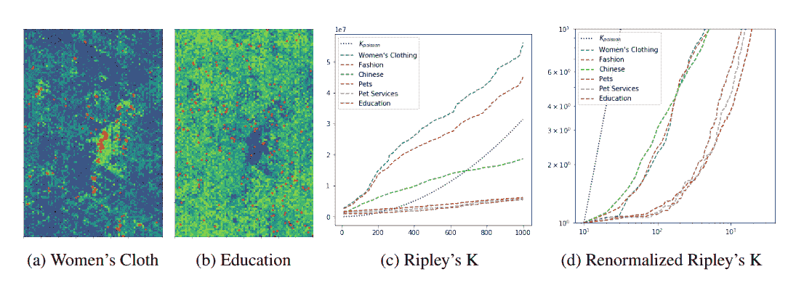

*The challenge of joint modeling distributions with very different characteristics. (a)(b) The POI locations (red dots) in Las Vegas and Space2Vec predicted conditional likelihood of Women’s Clothing (with a clustered distribution) and Education (with an even distribution). The dark area in (b) indicates that the downtown area has more POIs of other types than education. (c) Ripley’s K curves of POI types for which Space2Vec has the largest and smallest improvement over wrap (Mac Aodha et al., 2019). Each curve represents the number of POIs of a certain type inside certain radios centered at every POI of that type; (d) Ripley’s K curves renormalized by POI densities and shown in log-scale. To efficiently achieve multi-scale representation Space2Vec concatenates the grid cell encoding of 64 scales (with wave lengths ranging from 50 meters to 40k meters) as the first layer of a deep model, and trains with POI data in an unsupervised fashion.*

* * *

### **14。匹配平均的联合学习**

具有逐层匹配的通信高效联邦学习。

*(TL；博士，来自[OpenReview.net](https://web.archive.org/web/20220926095407/http://openreview.net/))*

**[论文](https://web.archive.org/web/20220926095407/https://openreview.net/forum?id=BkluqlSFDS) | [代码](https://web.archive.org/web/20220926095407/https://github.com/IBM/FedMA)**

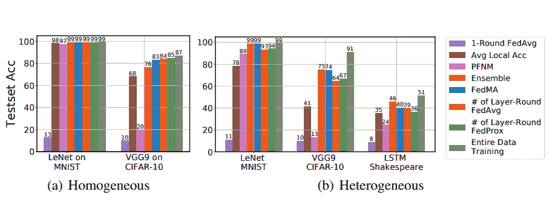

*Comparison among various federated learning methods with limited number of communications on LeNet trained on MNIST; VGG-9 trained on CIFAR-10 dataset; LSTM trained on Shakespeare dataset over: (a) homogeneous data partition (b) heterogeneous data partition. *

* * *

### 15。变色龙:加速深度神经网络编译的自适应代码优化

深度神经网络优化编译的强化学习和自适应采样。

*(TL；博士，来自[OpenReview.net](https://web.archive.org/web/20220926095407/http://openreview.net/))*

[**论文**](https://web.archive.org/web/20220926095407/https://openreview.net/forum?id=rygG4AVFvH)

*Overview of our model compilation workflow, and highlighted is the scope of this work.*

* * *

### 16。网络去卷积

为了更好地训练卷积网络，我们提出了一种类似于动物视觉系统的网络去卷积方法。

*(TL；博士，来自***)**

 ***[论文](https://web.archive.org/web/20220926095407/https://openreview.net/forum?id=rkeu30EtvS) | [代码](https://web.archive.org/web/20220926095407/https://github.com/yechengxi/deconvolution)**

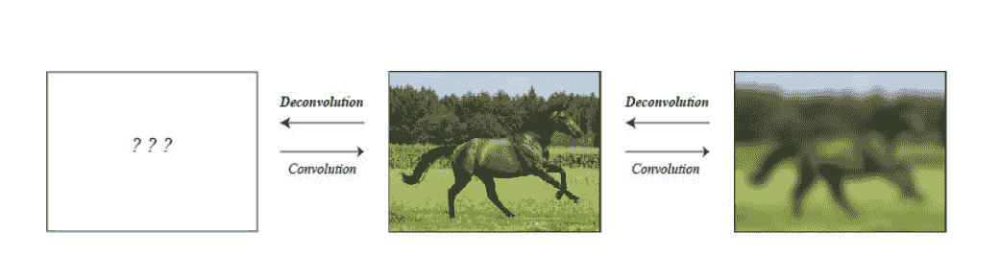

*Performing convolution on this real world image using a correlative filter, such as a Gaussian kernel, adds correlations to the resulting image, which makes object recognition more difficult. The process of removing this blur is called deconvolution. What if, however, what we saw as the real world image was itself the result of some unknown correlative filter, which has made recognition more difficult? Our proposed network deconvolution operation can decorrelate underlying image features which allows neural networks to perform better.*

* * *

# 摘要

ICLR 出版物的深度和广度相当鼓舞人心。在这里，我只是展示了专注于“深度学习”主题的冰山一角。然而，[这一分析](https://web.archive.org/web/20220926095407/https://www.analyticsvidhya.com/blog/2020/05/key-takeaways-iclr-2020/)表明，很少有受欢迎的地区，特别是:

1.  深度学习(在这篇文章中讨论)
2.  强化学习([此处](/web/20220926095407/https://neptune.ai/blog/iclr-2020-reinforcement-learning))
3.  生成模型([此处](/web/20220926095407/https://neptune.ai/blog/iclr-2020-generative-models))
4.  自然语言处理/理解([此处](/web/20220926095407/https://neptune.ai/blog/iclr-2020-nlp-nlu)

为了对 ICLR 大学的顶级论文有一个更完整的概述，我们正在建立一系列的帖子，每个帖子都专注于上面提到的一个主题。你可能想要**查看**以获得更完整的概述。

快乐阅读！

### 卡米尔·卡什马雷克

人工智能研究倡导者，在 MLOps 领域工作。总是在寻找新的 ML 工具、过程自动化技巧和有趣的 ML 论文。偶尔会有博客作者和会议发言人。

* * *

**阅读下一篇**

## 如何组织深度学习项目——最佳实践范例

13 分钟阅读|作者 Nilesh Barla |年 5 月 31 日更新

一个成功的深度学习项目，你需要很多迭代，很多时间，很多努力。为了让这个过程不那么痛苦，你应该尽量利用你的资源。

一个好的循序渐进的工作流程将帮助你做到这一点。有了它，你的项目变得**高效、可复制、**和**可理解**。

在本文中，您将看到如何构建深度学习项目的工作——从开始到部署，监控部署的模型，以及中间的一切。

在这个过程中，我们将使用 Neptune 来运行、监控和分析您的实验。Neptune 是提高 ML 项目生产率的一个很酷的工具。

在本文中，您将了解到:

1.  关于项目的生命周期。
2.  定义项目目标的重要性。
3.  根据项目需求收集数据。
4.  模型训练和结果探索，包括:
    1.  为更好的结果建立基线。
    2.  采用现有的开源最新模型研究论文和代码库中的技术和方法。
    3.  实验跟踪和管理
5.  避免欠拟合和过拟合的模型优化技术，例如:
    1.  控制超参数
    2.  规范化
    3.  修剪
6.  在部署之前测试和评估您的项目。
7.  模型部署
8.  项目维护

[Continue reading ->](/web/20220926095407/https://neptune.ai/blog/how-to-organize-deep-learning-projects-best-practices)

* * **