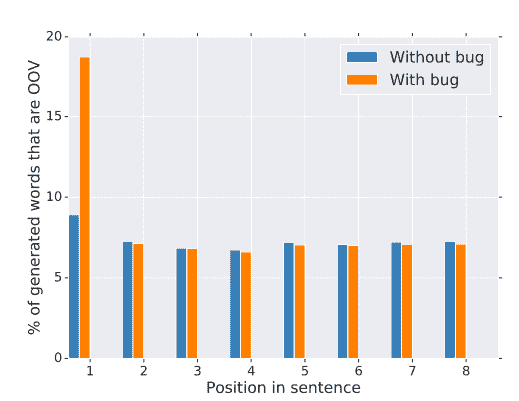
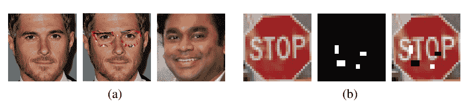
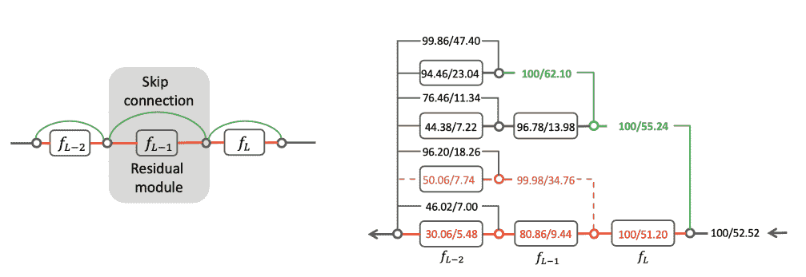
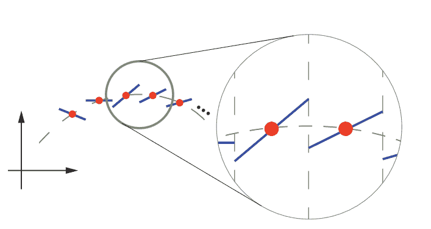
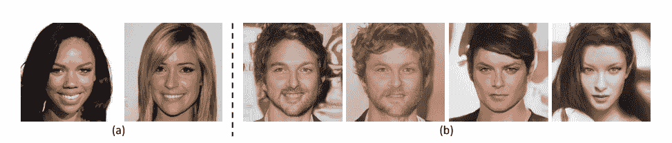
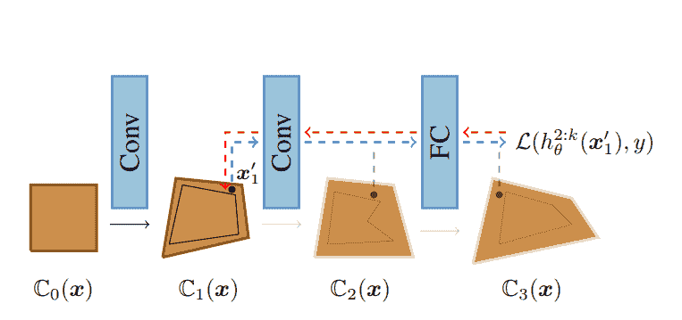
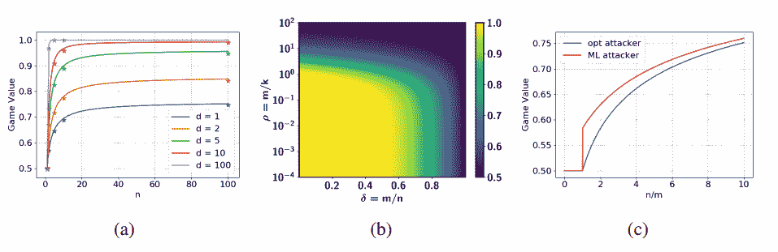

# ICLR 2020 会议最佳生成模型论文

> 原文：<https://web.archive.org/web/https://neptune.ai/blog/iclr-2020-generative-models>

学习代表国际会议于上周在 ICLR 召开，我很高兴参加了这次会议。ICLR 是一个致力于**研究表征学习各个方面的事件，俗称深度学习**。由于疫情冠状病毒，会议无法按计划在亚的斯亚贝巴举行，而是通过虚拟方式进行。这并没有改变活动的良好氛围，恰恰相反——它引人入胜，互动性强，吸引了比去年更多的观众。如果你对组织者如何看待这次不同寻常的在线会议安排感兴趣，你可以在[这里](https://web.archive.org/web/20221206123029/https://medium.com/@iclr_conf/gone-virtual-lessons-from-iclr2020-1743ce6164a3)阅读。

作为一名与会者，我从 1300 多名演讲者的演讲中受到启发，并决定创建一系列博客帖子，总结四个主要领域的最佳论文。可以在这里用深度学习论文 [赶上第一个**帖子，在这里**](/web/20221206123029/https://neptune.ai/blog/iclr-2020-deep-learning)用强化学习论文 [赶上第二个**帖子。**](/web/20221206123029/https://neptune.ai/blog/iclr-2020-reinforcement-learning)

这让我们看到了该系列的第三篇文章——这里是来自 ICLR 的 7 篇最佳生成模型论文。

## 最佳生成模型论文

### **1。私有、分散数据集上有效 ML 的生成模型**

生成模型+联合学习+差分隐私为数据科学家提供了一种分析私有、分散数据(例如，在移动设备上)的方法，在这些数据中禁止直接检查。

*(TL；博士，来自***)**

 *[**论文**](https://web.archive.org/web/20221206123029/https://openreview.net/forum?id=SJgaRA4FPH) **|** [**代码**](https://web.archive.org/web/20221206123029/https://github.com/tensorflow/federated/tree/master/tensorflow_federated/python/research/gans)

*Percentage of samples generated from the word-LM that are OOV by position in the sentence, with and without bug. *

* * *

### **2。抵御对图像分类的物理可实现攻击**

抵御对图像分类的物理可实现攻击。

*(TL；博士，来自***)**

 *[**论文**](https://web.archive.org/web/20221206123029/https://openreview.net/forum?id=H1xscnEKDr) **|** [**代码**](https://web.archive.org/web/20221206123029/https://github.com/tongwu2020/phattacks)

*(a) An example of the eyeglass frame attack. Left: original face input image. Middle: modified input image (adversarial eyeglasses superimposed on the face). Right: an image of the predicted individual with the adversarial input in the middle image. (b) An example of the stop sign attack. Left: original stop sign input image. Middle: adversarial mask. Right: stop sign image with adversarial stickers, classified as a speed limit sign. *

* * *

### **3。跳过连接很重要:论结果网生成的对立范例的可迁移性**

我们发现了类 ResNet 神经网络中跳过连接的安全弱点

*(TL；博士，来自***)**

 *[**论文**](https://web.archive.org/web/20221206123029/https://openreview.net/forum?id=BJlRs34Fvr)

*Left: Illustration of the last 3 skip connections (green lines) and residual modules (black boxes) of a ImageNet-trained ResNet-18\. Right: The success rate (in the form of “white-box/blackbox”) of adversarial attacks crafted using gradients flowing through either a skip connection (going upwards) or a residual module (going leftwards) at each junction point (circle). Three example backpropagation paths are highlighted in different colors, with the green path skipping over the last two residual modules having the best attack success rate while the red path through all 3 residual modules having the worst attack success rate. The attacks are crafted by BIM on 5000 ImageNet validation images under maximum L∞ perturbation  = 16 (pixel values are in [0, 255]). The black-box success rate is tested against a VGG19 target model.*

* * *

### **4。k 赢家通吃增强对抗性防御**

我们提出了一个简单的改变现有的神经网络结构，以更好地抵御基于梯度的对抗性攻击，使用 k 赢家通吃激活函数。

*(TL；博士，来自***)**

 ***[论文](https://web.archive.org/web/20221206123029/https://openreview.net/forum?id=Skgvy64tvr) | [代码](https://web.archive.org/web/20221206123029/https://github.com/a554b554/kWTA-Activation)**

*1D illustration. Fit a 1D function (green dotted curve) using a k-WTA model provided with a set of points (red). The resulting model is piecewise continuous (blue curve), and the discontinuities can be dense.*

### 第一作者:常晓

[网站](https://web.archive.org/web/20221206123029/http://chang.engineer/)

* * *

### **5。真实还是不真实，这是个问题**

生成对抗网络已被广泛应用于各种话题。在普通设置中，鉴别器输出标量值。这里，提出了新的公式，其中鉴别器输出离散分布而不是标量。

**[论文](https://web.archive.org/web/20221206123029/https://openreview.net/forum?id=B1lPaCNtPB) | [代码](https://web.archive.org/web/20221206123029/https://github.com/kam1107/RealnessGAN)**

*The perception of realness depends on various aspects. (a) Human-perceived flawless. (b) Potentially reduced realness due to: inharmonious facial structure/components, unnatural background, abnormal style combination and texture distortion. *

### 第一作者:袁波·李湘

[网站](https://web.archive.org/web/20221206123029/https://dblp.org/pers/x/Xiangli:Yuanbo.html)

* * *

### **6。对抗性训练和可证明的防御:弥合差距**

我们提出了一种对抗训练和可证明防御的新组合，它产生了一个在 CIFAR-10 上具有最先进的准确性和经认证的鲁棒性的模型。

*(TL；博士，来自***)**

 *[**论文**](https://web.archive.org/web/20221206123029/https://openreview.net/forum?id=SJxSDxrKDr)

*An iteration of convex layerwise adversarial training. Latent adversarial example x^’[1] is found in the convex region C[1](x) and propagated through the rest of the layers in a forward pass, shown with the blue line. During backward pass, gradients are propagated through the same layers, shown with the red line. Note that the first convolutional layer does not receive any gradients.*

* * *

### 7 .**。对抗生成性攻击的最佳策略**

在 GANs 社区，防御生成性攻击是一个越来越重要的话题。在这里，作者正式阐述了一个问题，并根据样本复杂性和攻击者可用的时间预算来检查它。问题涉及出于恶意目的伪造/修改数据。

[**论文**](https://web.archive.org/web/20221206123029/https://openreview.net/forum?id=BkgzMCVtPB) **|** [**代码**](https://web.archive.org/web/20221206123029/https://github.com/roymor1/OptimalStrategiesAgainstGenerativeAttacks)

*Game value (expected authentication accuracy) for the Gaussian case. (a) A comparison between empirical and theoretical game value for different d values (m “ 1, k “ 10). Solid lines describe the theoretical game values whereas the ˚ markers describe the empirical accuracy when learning with the GIM model. (b) Theoretical game value as a function of δ, ρ (see Corollary 4.3) for d “ 100\. (c) Empirical accuracy of an optimal authenticator against two attacks: the theoretically optimal attack G ˚ from Theorem 4.2 and a maximum likelihood (ML) attack (See Sec. F.4) for the Gaussian case. It can be seen that the ML attack is inferior in that it results in better accuracy for the authenticator, as predicted by our theoretical results.*

* * *

# **总结**

ICLR 出版物的深度和广度相当鼓舞人心。这篇文章关注的是“生成模型”这个话题，这只是会议期间讨论的话题之一。正如您在[这篇分析](https://web.archive.org/web/20221206123029/https://www.analyticsvidhya.com/blog/2020/05/key-takeaways-iclr-2020/)中所看到的，ICLR 涵盖了以下主要问题:

1.  深度学习([此处](/web/20221206123029/https://neptune.ai/blog/iclr-2020-deep-learning))
2.  强化学习([此处](/web/20221206123029/https://neptune.ai/blog/iclr-2020-reinforcement-learning))
3.  生成模型(在本帖中讨论)
4.  自然语言处理/理解([此处](/web/20221206123029/https://neptune.ai/blog/iclr-2020-nlp-nlu)

为了对 ICLR 大学的顶级论文有一个更完整的概述，我们正在建立一系列的帖子，每个帖子都专注于上面提到的一个主题。这是第三篇文章，所以你可能想查看前几篇以获得更完整的概述。

请随意与我们分享其他关于生成模型的有趣论文。我们很乐意扩展我们的列表！*****