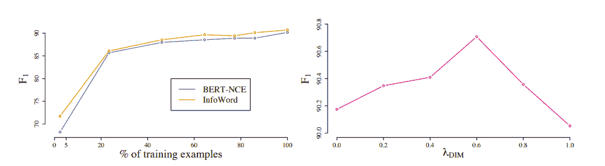
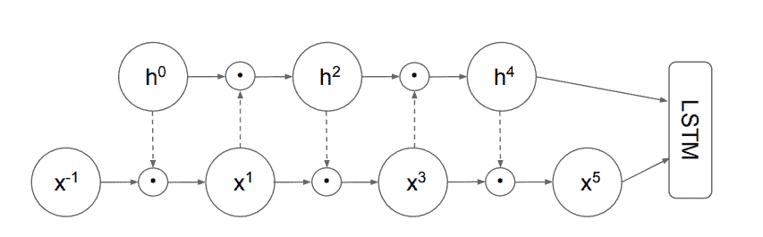
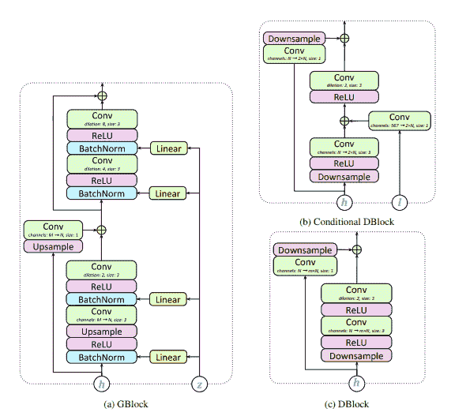
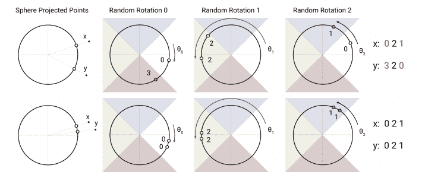
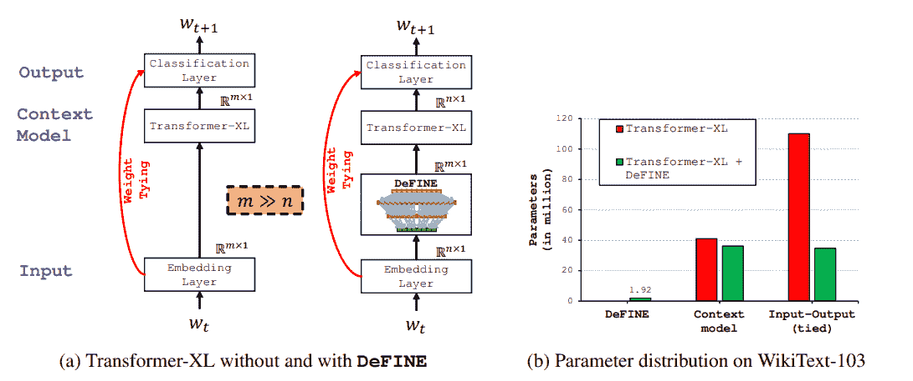
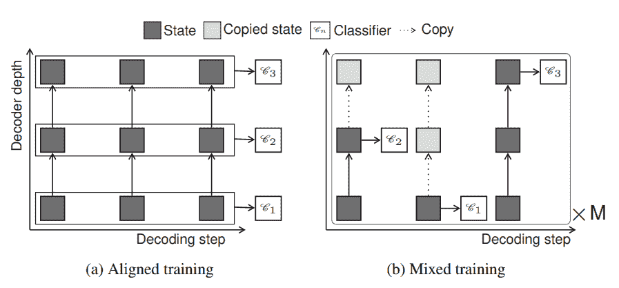
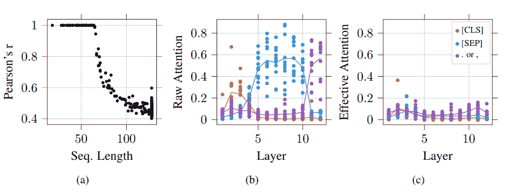
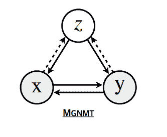

# ICLR 2020 会议最佳 NLP/NLU 论文

> 原文：<https://web.archive.org/web/https://neptune.ai/blog/iclr-2020-nlp-nlu>

学习代表国际会议于上周在 ICLR 召开，我很高兴参加了这次会议。ICLR 是一个致力于**研究表征学习各个方面的事件，俗称深度学习**。今年的活动有点不同，因为冠状病毒疫情使它虚拟化了。然而，在线形式并没有改变活动的良好氛围。它引人入胜，互动性强，吸引了 5600 名与会者(是去年的两倍)。如果你对组织者如何看待这次不同寻常的在线会议安排感兴趣，你可以在[这里](https://web.archive.org/web/20220926102121/https://medium.com/@iclr_conf/gone-virtual-lessons-from-iclr2020-1743ce6164a3)阅读。

超过 1300 名演讲者发表了许多有趣的论文，所以我决定创建一系列博客文章，总结他们在四个主要领域的最佳表现。你可以用最好的深度学习论文 [在这里](/web/20220926102121/https://neptune.ai/blog/iclr-2020-deep-learning)赶上第一个**帖子，用强化学习论文** [在这里](/web/20220926102121/https://neptune.ai/blog/iclr-2020-reinforcement-learning)赶上第二个**帖子用生成模型论文** [在这里](/web/20220926102121/https://neptune.ai/blog/iclr-2020-generative-models)。

这是该系列的最后一篇文章，在这篇文章中，我想分享来自 ICLR 的 10 篇最佳自然语言处理/理解文章。

## 最佳自然语言处理/理解论文

### **1。ALBERT:一个用于语言表达自我监督学习的 Lite BERT】**

一种新的预训练方法，在胶水、种族和小队基准上建立了新的最先进的结果，同时与 BERT-large 相比具有更少的参数。

*(TL；博士，来自*[](https://web.archive.org/web/20220926102121/http://openreview.net/)**)**

 *[**论文**](https://web.archive.org/web/20220926102121/https://openreview.net/forum?id=H1eA7AEtvS) **|** [**代码**](https://web.archive.org/web/20220926102121/https://github.com/google-research/ALBERT)


*The L2 distances and cosine similarity (in terms of degree) of the input and output embedding of each layer for BERT-large and ALBERT-large.*

* * *

### **2。语言表征学习的互信息最大化视角**

单词表示是自然语言处理中的一项常见任务。在这里，作者制定了新的框架，将经典的单词嵌入技术(如 Skip-gram)与基于上下文嵌入的更现代的方法(BERT，XLNet)相结合。

[**论文**](https://web.archive.org/web/20220926102121/https://openreview.net/forum?id=Syx79eBKwr)



*The left plot shows F[1] scores of BERT-NCE and INFOWORD as we increase the percentage of training examples on SQuAD (dev). The right plot shows F[1] scores of INFOWORD on SQuAD (dev) as a function of λ[DIM].*

* * *

### **3。莫格里菲耶 LSTM**

具有最先进的语言建模结果的 LSTM 扩展。

*(TL；博士，来自*[](https://web.archive.org/web/20220926102121/http://openreview.net/)**)**

 *[**论文**](https://web.archive.org/web/20220926102121/https://openreview.net/forum?id=SJe5P6EYvS)



*Mogrifier with 5 rounds of updates. The previous state h⁰ = h[prev] is transformed linearly (dashed arrows), fed through a sigmoid and gates x ^(−1) = x in an elementwise manner producing x¹ . Conversely, the linearly transformed x¹ gates h 0 and produces h² . After a number of repetitions of this mutual gating cycle, the last values of h^∗ and x^∗ sequences are fed to an LSTM cell. The prev subscript of h is omitted to reduce clutter.*

* * *

### **4。具有对抗网络的高保真语音合成**

我们介绍了 GAN-TTS，一个用于文本到语音转换的生成式对抗网络，其平均意见得分(MOS)为 4.2。

*(TL；博士，来自*[](https://web.archive.org/web/20220926102121/http://openreview.net/)**)**

 *[**论文**](https://web.archive.org/web/20220926102121/https://openreview.net/forum?id=r1gfQgSFDr) **|** [**代码**](https://web.archive.org/web/20220926102121/https://github.com/mbinkowski/DeepSpeechDistances)



* Residual blocks used in the model. Convolutional layers have the same number of input and output channels and no dilation unless stated otherwise. h – hidden layer representation, l – linguistic features, z – noise vector, m – channel multiplier, m = 2 for downsampling blocks (i.e. if their downsample factor is greater than 1) and m = 1 otherwise, M- G’s input channels, M = 2N in blocks 3, 6, 7, and M = N otherwise; size refers to kernel size. *

* * *

### **5。重整器:高效的变压器**

具有位置敏感散列和可逆层的高效转换器。

*(TL；博士，来自*[](https://web.archive.org/web/20220926102121/http://openreview.net/)**)**

 *[**论文**](https://web.archive.org/web/20220926102121/https://openreview.net/forum?id=rkgNKkHtvB) **|** [**代码**](https://web.archive.org/web/20220926102121/https://github.com/google/trax/tree/master/trax/models/reformer)



*An angular locality sensitive hash uses random rotations of spherically projected points to establish buckets by an argmax over signed axes projections. In this highly simplified 2D depiction, two points x and y are unlikely to share the same hash buckets (above) for the three different angular hashes unless their spherical projections are close to one another (below).*

### 主要作者:

* * *

### **6。定义:用于神经序列建模的深度分解输入令牌嵌入**

DeFINE 使用具有新的跳过连接的深度、分层、稀疏网络来高效地学习更好的单词嵌入。

*(TL；博士，来自*[](https://web.archive.org/web/20220926102121/http://openreview.net/)**)**

 *[**论文**](https://web.archive.org/web/20220926102121/https://openreview.net/forum?id=rJeXS04FPH)



*With DeFINE, Transformer-XL learns input (embedding) and output (classification) representations in low n-dimensional space rather than high m-dimensional space, thus reducing parameters significantly while having a minimal impact on the performance.*

* * *

### **7。深度自适应变压器**

动态调整每个输入的计算量的序列模型。

*(TL；博士，来自*[](https://web.archive.org/web/20220926102121/http://openreview.net/)**)**

 *[**论文**](https://web.archive.org/web/20220926102121/https://openreview.net/forum?id=SJg7KhVKPH)



*Training regimes for decoder networks able to emit outputs at any layer. Aligned training optimizes all output classifiers C[n] simultaneously assuming all previous hidden states for the current layer are available. Mixed training samples M paths of random exits at which the model is assumed to have exited; missing previous hidden states are copied from below.*

* * *

### **8。关于变压器的可识别性**

我们研究了基于自我注意的 BERT 模型中上下文嵌入中注意分布和标记的可识别性和可解释性。

*(TL；博士，来自*[](https://web.archive.org/web/20220926102121/http://openreview.net/)**)**

 *[**论文**](https://web.archive.org/web/20220926102121/https://openreview.net/forum?id=BJg1f6EFDB)



*(a) Each point represents the Pearson correlation coefficient of effective attention and raw attention as a function of token length. (b) Raw attention vs. (c) effective attention, where each point represents the average (effective) attention of a given head to a token type.*

* * *

### **9。镜像生成神经机器翻译**

被称为神经机器翻译模型(NMT)的翻译方法依赖于作为语言对构建的大型语料库的可用性。这里，提出了一种使用生成神经机器翻译进行双向翻译的新方法。

[**论文**](https://web.archive.org/web/20220926102121/https://openreview.net/forum?id=HkxQRTNYPH)



*The graphical model of MGNMT. *

* * *

### 10。FreeLB:增强的自然语言理解对抗训练

在这里，作者提出了一种新的算法，称为 FreeLB，它提出了一种新的语言模型的对抗性训练方法。

**[论文](https://web.archive.org/web/20220926102121/https://openreview.net/forum?id=BygzbyHFvB) | [代码](https://web.archive.org/web/20220926102121/https://github.com/zhuchen03/FreeLB)**

* * *

# **总结**

ICLR 出版物的深度和广度相当鼓舞人心。这篇文章主要关注“自然语言处理”这个话题，这是会议期间讨论的主要领域之一。根据[本分析](https://web.archive.org/web/20220926102121/https://www.analyticsvidhya.com/blog/2020/05/key-takeaways-iclr-2020/)，这些区域包括:

1.  深度学习([此处](/web/20220926102121/https://neptune.ai/blog/iclr-2020-deep-learning))
2.  强化学习([此处](/web/20220926102121/https://neptune.ai/blog/iclr-2020-reinforcement-learning))
3.  生成模型([此处](/web/20220926102121/https://neptune.ai/blog/iclr-2020-generative-models))
4.  自然语言处理/理解(包含在这篇文章中)

为了对 ICLR 大学的顶级论文有一个更完整的概述，我们建立了一系列的帖子，每个帖子都专注于上面提到的一个主题。这是最后一个，所以你可能想要**检查其他的**以获得更完整的概述。

我们很乐意扩展我们的列表，所以请随意与我们分享其他有趣的 NLP/NLU 论文。

同时，祝阅读愉快！

### 卡密耳鸭

人工智能研究倡导者，在 MLOps 领域工作。总是在寻找新的 ML 工具、过程自动化技巧和有趣的 ML 论文。偶尔会有博客作者和会议发言人。

* * *

**阅读下一篇**

## 自然语言处理的探索性数据分析:Python 工具完全指南

11 分钟阅读|作者 Shahul ES |年 7 月 14 日更新

探索性数据分析是任何机器学习工作流中最重要的部分之一，自然语言处理也不例外。但是**你应该选择哪些工具**来高效地探索和可视化文本数据呢？

在这篇文章中，我们将**讨论和实现几乎所有的主要技术**，你可以用它们来理解你的文本数据，并给你一个完成工作的 Python 工具的完整之旅。

## 开始之前:数据集和依赖项

在本文中，我们将使用来自 Kaggle 的百万新闻标题数据集。如果您想一步一步地进行分析，您可能需要安装以下库:

```py
pip install \
   pandas matplotlib numpy \
   nltk seaborn sklearn gensim pyldavis \
   wordcloud textblob spacy textstat
```

现在，我们可以看看数据。

```py
news= pd.read_csv('data/abcnews-date-text.csv',nrows=10000)
news.head(3)
```


数据集只包含两列，发布日期和新闻标题。

为了简单起见，我将探索这个数据集中的前 **10000 行**。因为标题是按*发布日期*排序的，所以实际上从 2003 年 2 月 19 日*到 2003 年 4 月 7 日*有**两个月。**

好了，我想我们已经准备好开始我们的数据探索了！

[Continue reading ->](/web/20220926102121/https://neptune.ai/blog/exploratory-data-analysis-natural-language-processing-tools)

* * ********