# ICLR 2020 会议最佳强化学习论文

> 原文：<https://web.archive.org/web/https://neptune.ai/blog/iclr-2020-reinforcement-learning>

上周，我很高兴参加了学习表征国际会议( **ICLR** )，这是一个致力于表征学习各个方面的**研究的活动，通常被称为深度学习**。由于冠状病毒疫情，会议变成了虚拟的，由于组织者的巨大努力，这次活动吸引了比去年更多的观众。[他们的目标](https://web.archive.org/web/20220926102055/https://medium.com/@iclr_conf/gone-virtual-lessons-from-iclr2020-1743ce6164a3)是让会议更具包容性和互动性，在我看来，作为一名与会者，事实的确如此！

受到 1300 多名演讲者的演讲的启发，我决定创建一系列博客帖子，总结四个主要领域的最佳论文。你可以在这里赶上关于最佳深度学习论文[的第一篇帖子，今天是来自 ICLR 的 **15 篇最佳强化学习论文的时间。**](/web/20220926102055/https://neptune.ai/blog/iclr-2020-deep-learning)

## 最佳强化学习论文

### **1。永不放弃:学习定向探索策略**

我们提出一个强化学习代理，通过学习一系列定向探索策略来解决困难探索游戏。

*(TL；博士，来自***)**

 *[**论文**](https://web.archive.org/web/20220926102055/https://openreview.net/forum?id=Sye57xStvB)

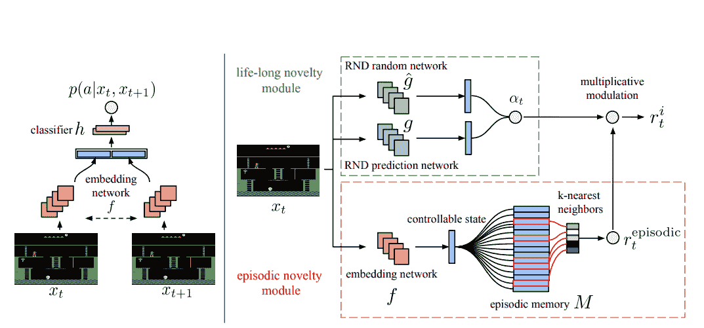

*(left) Training architecture for the embedding network (right) NGU’s reward generator.*

### 主要作者:

* * *

### **2。节目引导代理**

我们提出了一个模块化框架，它可以完成程序指定的任务，并实现对更复杂任务的零镜头泛化。

*(TL；博士，来自***)**

 *[**论文**](https://web.archive.org/web/20220926102055/https://openreview.net/forum?id=BkxUvnEYDH)

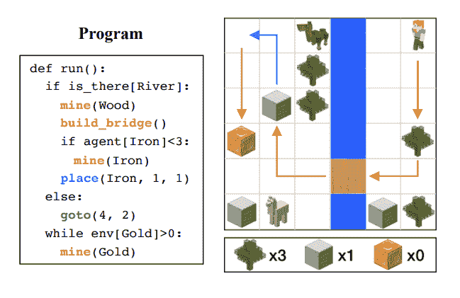

*An illustration of the proposed problem. We are interested in learning to fulfill tasks specified by written programs. A program consists of control flows (e.g. if, while), branching conditions (e.g. is_there[River]), and subtasks (e.g. mine(Wood)).*

* * *

### **3。雅达利的基于模型的强化学习**

我们使用视频预测模型、基于模型的强化学习算法和每款游戏 2 小时的游戏性来训练 26 款 Atari 游戏的代理。

*(TL；博士，来自***)**

 ***[论文](https://web.archive.org/web/20220926102055/https://openreview.net/forum?id=S1xCPJHtDB) | [代码](https://web.archive.org/web/20220926102055/http://bit.ly/2wjgn1a)**

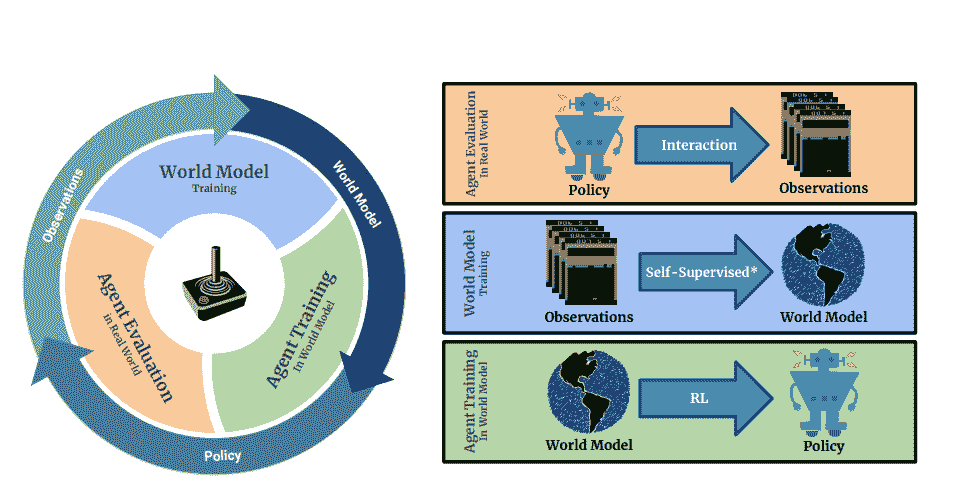

*Main loop of SimPLe. 1) the agent starts interacting with the real environment following the latest policy (initialized to random). 2) the collected observations will be used to train (update) the current world model. 3) the agent updates the policy by acting inside the world model. The new policy will be evaluated to measure the performance of the agent as well as collecting more data (back to 1). Note that world model training is self-supervised for the observed states and supervised for the reward.*

### 主要作者:

* * *

### **4。发现和可视化深度强化学习代理的弱点**

我们生成经过训练的 RL 算法的临界状态，以可视化潜在的弱点。

*(TL；博士，来自***)**

 *[**论文**](https://web.archive.org/web/20220926102055/https://openreview.net/forum?id=rylvYaNYDH)

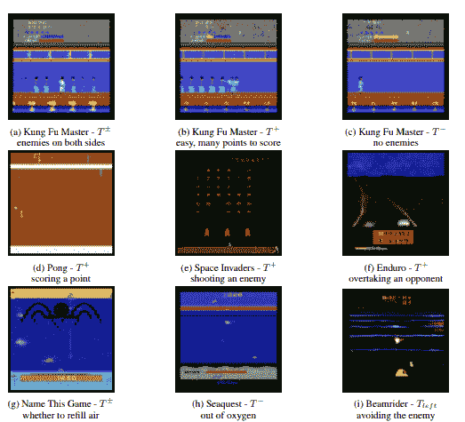

*Qualitative Results: Visualization of different target functions (Sec. 2.3). T^+ generates high reward and T^− low reward states; T^± generates states in which one action is highly beneficial and another is bad. *

* * *

### **5。没有记忆的元学习**

我们对元学习中的记忆问题进行了识别和形式化，并采用新颖的元正则化方法解决了这一问题，极大地拓展了元学习的适用和有效领域。

*(TL；博士，来自***)**

 ***[论文](https://web.archive.org/web/20220926102055/https://openreview.net/forum?id=BklEFpEYwS) | [代码](https://web.archive.org/web/20220926102055/https://github.com/google-research/google-research/tree/master/meta_learning_without_memorization)**

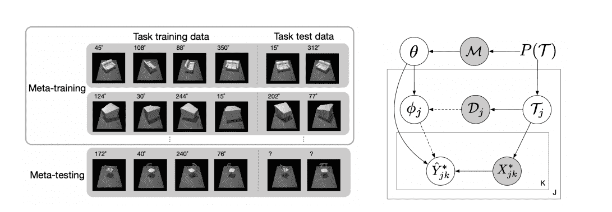

*Left: An example of non-mutually-exclusive pose prediction tasks, which may lead to the memorization problem. The training tasks are non-mutually-exclusive because the test data label (right) can be inferred accurately without using task training data (left) in the training tasks, by memorizing the canonical orientation of the meta-training objects. For a new object and canonical orientation (bottom), the task cannot be solved without using task training data (bottom left) to infer the canonical orientation. Right: Graphical model for meta-learning. Observed variables are shaded. Without either one of the dashed arrows, Yˆ ∗ is conditionally independent of D given θ and X∗, which we refer to as complete memorization (Definition 1).*

### 主要作者

* * *

### **6。一个好的表示对于样本高效强化学习是否足够？**

具有函数逼近的基于值和基于策略的强化学习的指数下界。

*(TL；博士，来自***)**

 *[**论文**](https://web.archive.org/web/20220926102055/https://openreview.net/forum?id=r1genAVKPB)

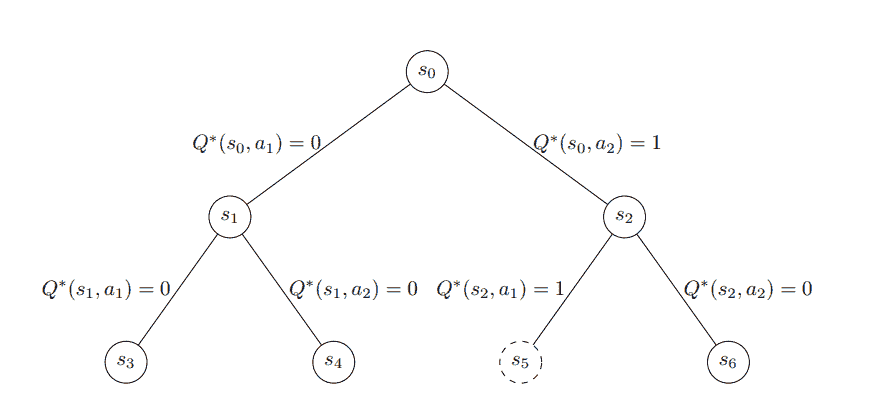

*An example with H = 3\. For this example, we have r(s[5]) = 1 and r(s) = 0 for all other states s. The unique state s[5] which satisfies r(s) = 1 is marked as dash in the figure. The induced Q∗ function is marked on the edges.*

* * *

### 7 .**。真实世界机器人强化学习的要素**

系统在现实世界中学习机器人任务，具有强化学习功能，无需仪器。

*(TL；博士，来自***)**

 ***[论文](https://web.archive.org/web/20220926102055/https://openreview.net/forum?id=rJe2syrtvS)**

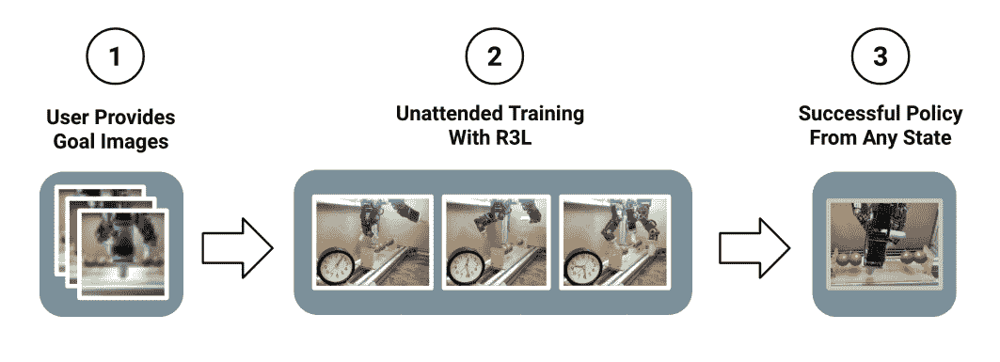

*Illustration of our proposed instrumentation-free system requiring minimal human engineering. Human intervention is only required in the goal collection phase (1). The robot is left to train unattended (2) during the learning phase and can be evaluated from arbitrary initial states at the end of training (3). We show sample goal and intermediate images from the training process of a real hardware system*

* * *

### **8。使用学习目标提高元强化学习的泛化能力**

我们介绍了一种新的元强化学习算法 MetaGenRL。与以前的工作不同，MetaGenRL 可以推广到与元训练完全不同的新环境。

*(TL；博士，来自***)**

 *[**论文**](https://web.archive.org/web/20220926102055/https://openreview.net/forum?id=S1evHerYPr)

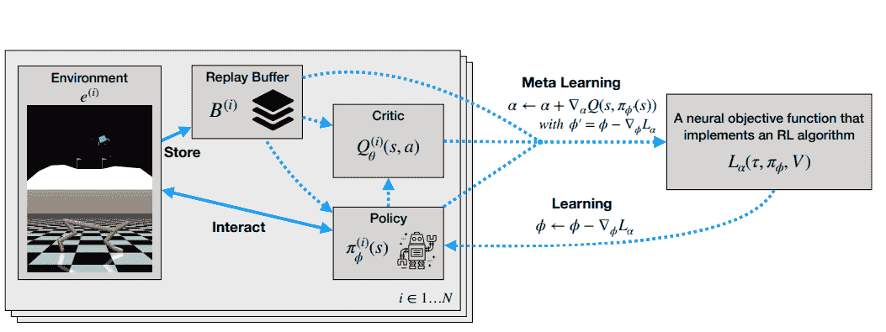

*A schematic of MetaGenRL. On the left a population of agents (i ∈ 1, . . . , N), where each member consist of a critic Q ^((i)) [θ] and a policy π ^((i)) [φ] that interact with a particular environment e^((i)) and store collected data in a corresponding replay buffer B^((i)) . On the right a meta-learned neural objective function L[α] that is shared across the population. Learning (dotted arrows) proceeds as follows: Each policy is updated by differentiating L[α], while the critic is updated using the usual TD-error (not shown). L[α] is meta-learned by computing second-order gradients that can be obtained by differentiating through the critic. *

* * *

### **9。强化学习和概率推理的意义**

将“RL 作为推理”的流行算法忽略了不确定性和探索的作用。我们强调了这些问题的重要性，并为 RL 和推理提出了一个协调一致的框架来优雅地处理它们。

*(TL；博士，来自***)**

 *[**论文**](https://web.archive.org/web/20220926102055/https://openreview.net/forum?id=S1xitgHtvS)

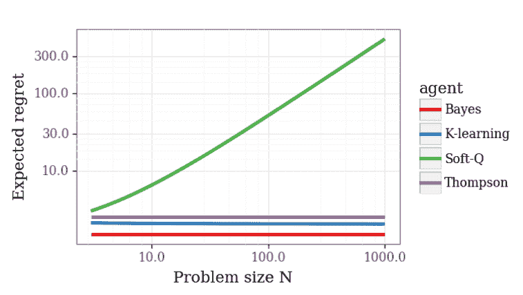

*Regret scaling on Problem 1\. Soft Q-learning does not scale gracefully with N. *

* * *

### 10。种子 RL:具有加速中央推理的可扩展且高效的深度 RL

SEED RL，一个可扩展的高效深度强化学习代理，具有加速的中心推理。最先进的结果，降低成本，每秒可以处理数百万帧。

*(TL；博士，来自***)**

 ***[论文](https://web.archive.org/web/20220926102055/https://openreview.net/forum?id=rkgvXlrKwH) | [代码](https://web.archive.org/web/20220926102055/https://drive.google.com/file/d/144yp7PQf486dmctE2oS2md_qmNBTFbez/view?usp=sharing)**

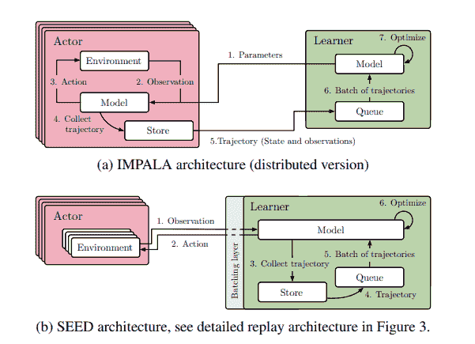

*Overview of architectures *

* * *

### 11.网络化系统控制的多智能体强化学习

针对网络化多智能体控制问题，提出了一种新的公式和新的通信协议。

*(TL；博士，来自***)**

 ***[论文](https://web.archive.org/web/20220926102055/https://openreview.net/forum?id=Syx7A3NFvH) | [代码](https://web.archive.org/web/20220926102055/https://github.com/cts198859/deeprl_network)**

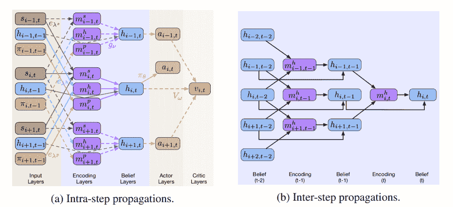

*Forward propagations of NeurComm enabled MARL, illustrated in a queueing system. (a) Single-step forward propagations inside agent i. Different colored boxes and arrows show different outputs and functions, respectively. Solid and dashed arrows indicate actor and critic propagations, respectively. (b) Multi-step forward propagations for updating*
*the belief of agent i.*

### 第一作者:褚天舒

[网站](https://web.archive.org/web/20220926102055/https://scholar.google.com/citations?user=Bi9EXmUAAAAJ&hl=en&oi=ao)

* * *

### **12。多智能体学习的通用训练方法**

本文研究并扩展了政策空间响应预言(PSRO)。这是一种基于群体的学习方法，使用博弈论原理。作者扩展了该方法，使其适用于多人游戏，同时在多种设置下提供收敛保证。

[**论文**](https://web.archive.org/web/20220926102055/https://openreview.net/forum?id=Bkl5kxrKDr)

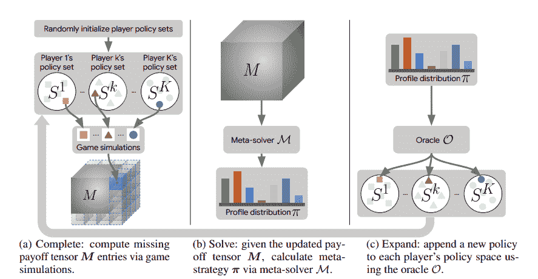

*Overview of PSRO(M, O) algorithm phases.*

* * *

### 13。深度研发中的实施事项:PPO 和 TRPO 案例研究

有时，实现细节可能会在您的研究中发挥作用。这里，评估了两种策略搜索算法:邻近策略优化(PPO)和信任区域策略优化(TRPO)。“代码级优化”，从学习动态来看应该是可以忽略的。令人惊讶的是，h 优化对代理的行为有很大的影响。

**[论文](https://web.archive.org/web/20220926102055/https://openreview.net/forum?id=r1etN1rtPB) | [代码](https://web.archive.org/web/20220926102055/https://github.com/implementation-matters/code-for-paper)**

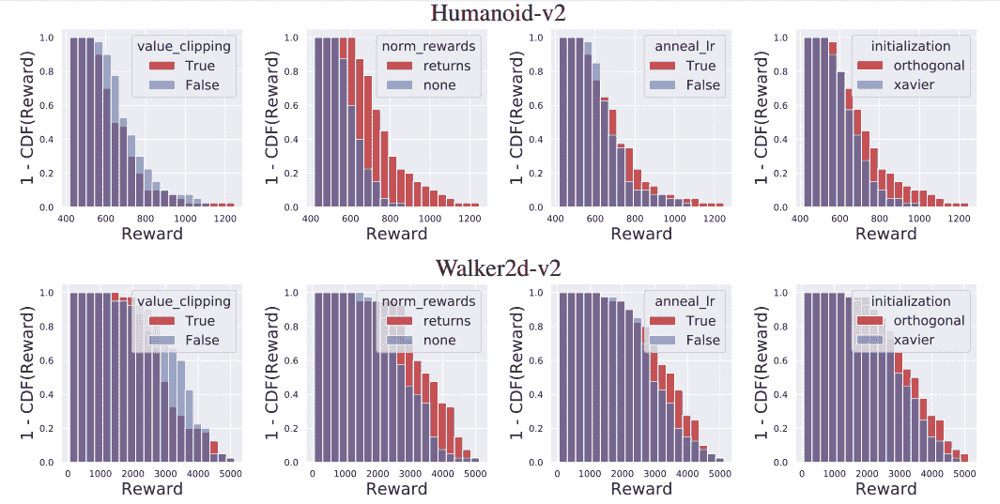

*An ablation study on the first four optimizations described in Section 3 (value clipping, reward scaling, network initialization, and learning rate annealing). For each of the 2⁴ possible configurations of optimizations, we train a Humanoid-v2 (top) and Walker2d-v2 (bottom) agent using PPO with five random seeds and a grid of learning rates, and choose the learning rate which gives the best average reward (averaged over the random seeds). We then consider all rewards from the “best learning rate” runs (a total of 5 × 2⁴ agents), and plot histograms in which agents are partitioned based on whether each optimization is on or off. Our results show that reward normalization, Adam annealing, and network initialization each significantly impact the rewards landscape with respect to hyperparameters, and were necessary for attaining the highest PPO reward within the tested hyperparameter grid. *

### 主要作者:

* * *

### **14。深入研究政策梯度**

这是对深度策略梯度算法行为的深入实证研究。作者分析了基于梯度估计，价值预测和优化景观的 SOTA 方法。

[**论文**](https://web.archive.org/web/20220926102055/https://openreview.net/forum?id=ryxdEkHtPS)

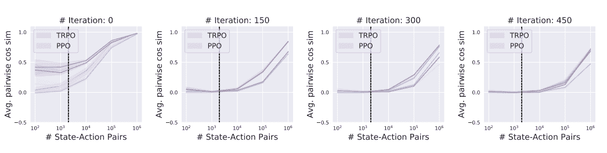

*Empirical variance of the estimated gradient (c.f. (1)) as a function of the number of state-action pairs used in estimation in the MuJoCo Humanoid task. We measure the average pairwise cosine similarity between ten repeated gradient measurements taken from the same policy, with the 95% confidence intervals (shaded). For each algorithm, we perform multiple trials with the same hyperparameter configurations but different random seeds, shown as repeated lines in the figure. The vertical line (at x = 2K) indicates the sample regime used for gradient estimation in standard implementations of policy gradient methods. In general, it seems that obtaining tightly concentrated gradient estimates would require significantly more samples than are used in practice, particularly after the first few timesteps. For other tasks – such as Walker2d-v2 and Hopper-v2 – the plots have similar trends, except that gradient variance is slightly lower. Confidence intervals calculated with 500 sample bootstrapping.*

### 主要作者:

* * *

### 15。元 Q 学习

MQL 是一种简单的脱离策略的 meta-RL 算法，它从元训练重放缓冲区回收数据以适应新的任务。

*(TL；博士，来自***)**

 *[**论文**](https://web.archive.org/web/20220926102055/https://openreview.net/forum?id=SJeD3CEFPH)

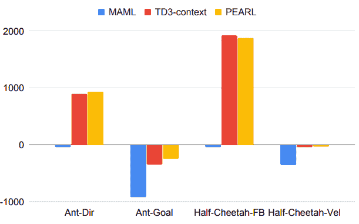

*How well does meta-RL work? Average returns on validation tasks compared for two prototypical meta-RL algorithms, MAML (Finn et al., 2017) and PEARL (Rakelly et al., 2019), with those of a vanilla Q-learning algorithm named TD3 (Fujimoto et al., 2018b) that was modied to incorporate a context variable that is a representation of the trajectory from a task (TD3-context). Even without any meta-training and adaptation on a new task, TD3-context is competitive with these sophisticated algorithms.*

### 主要作者:

* * *

# **总结**

ICLR 出版物的深度和广度相当鼓舞人心。在这里，我只是展示了“强化学习”主题的冰山一角。然而，正如你在[这篇分析](https://web.archive.org/web/20220926102055/https://www.analyticsvidhya.com/blog/2020/05/key-takeaways-iclr-2020/)中看到的，会议讨论了四个主要领域:

1.  深度学习(在我们的[上一篇文章](/web/20220926102055/https://neptune.ai/blog/iclr-2020-deep-learning)中讨论过)
2.  强化学习(在这篇文章中讨论)
3.  生成模型([此处](/web/20220926102055/https://neptune.ai/blog/iclr-2020-generative-models))
4.  自然语言处理/理解([此处](/web/20220926102055/https://neptune.ai/blog/iclr-2020-nlp-nlu)

为了对 ICLR 大学的顶级论文有一个更完整的概述，我们正在建立一系列的帖子，每个帖子都专注于上面提到的一个主题。你可能想要**查看**以获得更完整的概述。

请随意与我们分享其他关于强化学习的有趣论文，我们会很乐意将它们添加到列表中。

享受阅读！

### 卡米尔·卡什马雷克

人工智能研究倡导者，在 MLOps 领域工作。总是在寻找新的 ML 工具、过程自动化技巧和有趣的 ML 论文。偶尔会有博客作者和会议发言人。

* * *

**阅读下一篇**

## 强化学习的 10 个现实应用

10 分钟阅读|作者 Derrick Mwiti |年 5 月 25 日更新

在**强化学习(RL)** 中，智能体在一个**奖励**和**惩罚**机制上接受训练。代理人因正确的移动而得到奖励，因错误的移动而受到惩罚。在这样做的时候，代理人试图最小化错误的移动，最大化正确的移动。

在本文中，我们将看看强化学习在现实世界中的一些应用。

## 自动驾驶汽车中的应用

各种论文都提出了针对**自动驾驶**的深度强化学习。在自动驾驶汽车中，有各种各样的方面需要考虑，例如各个地方的速度限制，可驾驶区，避免碰撞——仅举几例。

一些可以应用强化学习的自动驾驶任务包括轨迹优化、运动规划、动态路径、控制器优化和基于场景的高速公路学习策略。

比如，可以通过学习自动泊车政策来实现泊车。可以使用 Q 学习来实现变道，而超车可以通过学习超车策略来实现，同时避免碰撞并在其后保持稳定的速度。

AWS DeepRacer 是一款自主赛车，旨在在物理赛道上测试 RL。它使用摄像头来可视化跑道，并使用强化学习模型来控制油门和方向。

[Continue reading ->](/web/20220926102055/https://neptune.ai/blog/reinforcement-learning-applications)

* * *************