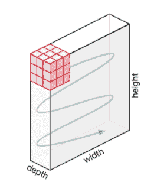

# Python 中的图像处理:你应该知道的算法、工具和方法

> 原文：<https://web.archive.org/web/https://neptune.ai/blog/image-processing-python>

图像定义了世界，每张图像都有自己的故事，它包含了许多在许多方面都有用的重要信息。这些信息可以借助于被称为**图像处理**的技术来获得。

它是[计算机视觉](/web/20230212071213/https://neptune.ai/blog/category/computer-vision)的核心部分，在许多现实世界的例子中起着至关重要的作用，如机器人、[自动驾驶汽车](/web/20230212071213/https://neptune.ai/blog/self-driving-cars-with-convolutional-neural-networks-cnn)和[物体检测](/web/20230212071213/https://neptune.ai/blog/object-detection-algorithms-and-libraries)。图像处理允许我们一次转换和操作数千幅图像，并从中提取有用的见解。它在几乎每个领域都有广泛的应用。

Python 是为此目的广泛使用的编程语言之一。它惊人的库和工具有助于非常有效地完成图像处理任务。

这篇文章将教你关于经典算法、技术和工具来处理图像并得到想要的输出。

让我们开始吧！

什么是图像处理？

## 顾名思义，图像处理意味着处理图像，这可能包括许多不同的技术，直到我们达到我们的目标。

最终输出可以是图像或该图像的相应特征的形式。这可用于进一步的分析和决策。

但是什么是图像呢？

图像可以表示为 2D 函数 F(x，y ),其中 x 和 y 是空间坐标。在 x，y 的特定值处 F 的振幅被称为图像在该点的强度。如果 x，y 和振幅值是有限的，那么我们称之为数字图像。它是按列和行排列的像素阵列。像素是图像中包含强度和颜色信息的元素。图像也可以用 3D 表示，其中 x、y 和 z 成为空间坐标。像素以矩阵的形式排列。这就是所谓的 **RGB 图像**。

有各种类型的图像:

RGB 图像:它包含三层 2D 图像，这些层是红色、绿色和蓝色通道。

*   灰度图像:这些图像包含黑白阴影，并且只包含一个通道。

经典图像处理算法

## 1.形态学图像处理

### 形态学图像处理试图从二值图像中去除缺陷，因为通过简单的阈值处理产生的二值区域会被噪声扭曲。它还有助于使用打开和关闭操作平滑图像。

形态学操作可以扩展到灰度图像。它由与图像特征结构相关的非线性运算组成。这取决于像素的相关顺序，但取决于它们的数值。该技术使用被称为**结构化元素**的小模板来分析图像，该模板被放置在图像中不同的可能位置，并与相应的邻域像素进行比较。结构化元素是具有 0 和 1 值的小矩阵。

让我们看看形态学图像处理的两个基本操作，**膨胀和腐蚀:**

**膨胀**操作**将像素添加到图像中对象的边界**

*   **腐蚀**操作从对象边界上去除像素。
*   原始图像中移除或添加的像素数量取决于结构元素的大小。

此时你可能会想“什么是结构化元素？”让我解释一下:

结构化元素是仅由 0 和 1 组成的矩阵，可以具有任意形状和大小。它被定位在图像中所有可能的位置，并与相应的邻域像素进行比较。

正方形结构元素“A”适合我们想要选择的对象，“B”与对象相交，“C”在对象之外。

0-1 模式定义了结构化元素的配置。这取决于我们想要选择的物体的形状。结构化元素的中心标识正在被处理的像素。

**2。**高斯图像处理

### 高斯模糊也被称为高斯平滑，是通过**高斯**函数模糊**图像**的结果。

是**用来降低图像噪点，减少细节**。这种模糊技术的视觉效果类似于通过半透明屏幕观看图像。它有时用于计算机视觉中不同比例的图像增强，或作为深度学习中的数据增强技术。

基本的高斯函数看起来像:

在实践中，最好是利用高斯模糊的可分离属性，将该过程分为两个过程。在第一步中，一维核用于仅在水平或垂直方向模糊图像。在第二遍中，相同的一维内核用于在剩余方向上模糊。产生的效果与单次通过二维内核进行卷积的效果相同。让我们看一个例子来理解高斯滤波器对图像做了什么。

如果我们有一个正态分布的过滤器，当它应用于图像时，结果看起来像这样:

*[来源](https://web.archive.org/web/20230212071213/https://www.youtube.com/watch?v=-AuwMJAqjJc)*

你可以看到一些边缘细节很少。过滤器给予位于中心的像素比远离中心的像素更多的权重。高斯滤波器是低通滤波器，即削弱高频。通常在边缘检测中使用[。](https://web.archive.org/web/20230212071213/https://www.cs.auckland.ac.nz/courses/compsci373s1c/PatricesLectures/Gaussian%20Filtering_1up.pdf)

3.图像处理中的傅立叶变换

### 傅立叶变换将图像分解成正弦和余弦分量。

它有多种应用，如图像重建、图像压缩或图像过滤。

因为我们在讨论图像，所以我们将考虑离散傅立叶变换。

让我们考虑一个正弦波，它由三部分组成:

幅度——与对比度相关

*   空间频率——与亮度相关
*   相位-与颜色信息相关
*   频域中的图像如下所示:

2D 离散傅立叶变换的公式是:

在上面的公式中，f(x，y)表示图像。

傅立叶逆变换将变换转换回图像。2D 离散傅里叶逆变换的公式为:

4.图像处理中的边缘检测

### 边缘检测是一种图像处理技术，用于寻找图像中对象的边界。它的工作原理是检测亮度的不连续性。

这对于从图像中提取有用信息是非常有益的，因为大多数形状信息都包含在边缘中。经典的边缘检测方法通过检测亮度的不连续性来工作。

如果在检测灰度级变化的同时在图像中检测到一些噪声，它可以迅速做出反应。边缘被定义为梯度的局部极大值。

最常见的边缘检测算法是 **sobel 边缘检测算法**。Sobel 检测算子由 3*3 卷积核组成。一个简单的内核 Gx 和一个 90 度旋转的内核 Gy。通过将两个内核分别应用于图像来进行单独的测量。

而且，

*表示 2D 信号处理卷积运算。

由此产生的梯度可计算如下:

5.小波图像处理

我们看到了傅立叶变换，但它仅限于频率。小波将时间和频率都考虑在内。这种变换适合于非平稳信号。

### 我们知道边缘是图像的重要部分之一，当应用传统的滤波器时，我们注意到噪声被去除了，但是图像变得模糊。小波变换是以这样一种方式设计的，即我们对低频分量获得良好的频率分辨率。下面是 2D 小波变换的例子:

使用神经网络的图像处理

神经网络是由神经元或节点组成的多层网络。这些神经元是神经网络的核心处理单元。它们被设计得像人脑一样。他们接受数据，训练自己识别数据中的模式，然后预测输出。

## 基本的神经网络有三层:

输入层

隐蔽层

1.  输出层
2.  输入层接收输入，输出层预测输出，隐藏层完成大部分计算。隐藏层数可以根据需要修改。神经网络中至少应该有一个隐藏层。
3.  神经网络的基本工作如下:

让我们考虑一个图像，每个像素作为输入被馈送到第一层的每个神经元，一层的神经元通过通道连接到下一层的神经元。

这些通道中的每一个都被分配了一个称为权重的数值。

1.  将输入乘以相应的权重，然后将该加权和作为输入提供给隐藏层。
2.  隐藏层的输出通过一个激活函数，该函数将决定特定的神经元是否被激活。
3.  被激活的神经元将数据传输到下一个隐藏层。以这种方式，数据通过网络传播，这被称为前向传播。
4.  在输出层，具有最高值的神经元预测输出。这些输出是概率值。
5.  将预测输出与实际输出进行比较，以获得误差。这些信息然后通过网络传回，这个过程称为反向传播。
6.  基于该信息，权重被调整。这种前向和后向传播的循环在多个输入上进行几次，直到网络在大多数情况下正确预测输出。
7.  这结束了神经网络的训练过程。在某些情况下，训练神经网络所需的时间可能会很长。
8.  在下图中， **ai 的**是输入集合， **wi 的**是权重， **z** 是输出， **g** 是任意激活函数。
9.  以下是为图像处理准备数据的一些指南。

为了获得更好的结果，需要将更多的数据输入到模型中。

*Operations in a single neuron | [Source](https://web.archive.org/web/20230212071213/https://hackernoon.com/everything-you-need-to-know-about-neural-networks-8988c3ee4491)*

图像数据集应该是高质量的，以获得更清晰的信息，但要处理它们，您可能需要更深层次的神经网络。

*   在许多情况下，RGB 图像在输入神经网络之前被转换成灰度。
*   神经网络的类型
*   卷积神经网络

## 简而言之，卷积神经网络具有三层:

### **卷积层** ( *CONV* ):它们是 CNN 的核心构件，负责执行卷积运算。在该层中执行卷积运算所涉及的元素被称为**内核/滤波器(矩阵)。**内核根据**步距**进行水平和垂直移动，直到遍历完整图像。

**池层** ( *池*):该层负责降维。它有助于降低处理数据所需的计算能力。有两种类型的池:最大池和平均池。Max pooling 返回映像上内核覆盖区域的最大值。平均池返回内核覆盖的图像部分中所有值的平均值。

*   **全连接层**(*FC*):**全连接层** ( **FC** )对扁平化输入进行操作，其中每个输入连接到所有神经元。如果存在， **FC 层**通常出现在 **CNN** 架构的末尾。

*Movement of the kernel | [Source](https://web.archive.org/web/20230212071213/https://towardsdatascience.com/a-comprehensive-guide-to-convolutional-neural-networks-the-eli5-way-3bd2b1164a53)*

*   CNN 主要用于在图像层的帮助下从图像中提取特征。CNN 广泛用于图像分类，其中每个输入图像通过一系列层来获得 0 和 1 之间的概率值。

*Pooling operation | [Source](https://web.archive.org/web/20230212071213/https://www.quora.com/What-is-max-pooling-in-convolutional-neural-networks)*

*   生成对抗网络

*Fully connected layers | [Source](https://web.archive.org/web/20230212071213/https://missinglink.ai/guides/convolutional-neural-networks/fully-connected-layers-convolutional-neural-networks-complete-guide/)*

生成模型使用无监督学习方法(有图像，但没有提供标签)。

### GANs 由两种型号的**发生器**和**鉴别器组成。** *发生器*学习制作看起来逼真的假图像以欺骗鉴别器*鉴别器*学习区分假图像和真图像(它试图不被愚弄)。

发生器不允许看到真实图像，因此在开始阶段可能产生差的结果，而鉴别器被允许看到真实图像，但是它们与发生器产生的伪图像混杂在一起，鉴别器必须将其分类为真实或伪图像。

一些噪声被输入到生成器中，这样它每次都能产生不同的例子，而不是相同类型的图像。基于由鉴别器预测的分数，生成器试图改进它的结果，在某个时间点之后，生成器将能够产生更难区分的图像，在那个时间点，用户对它的结果感到满意。鉴别器也改进了自己，因为它在每一轮从发生器获得越来越多的真实图像。

常见的 GAN 类型有深度卷积 gan(dcgan)、条件 gan(cgan)、StyleGANs、CycleGAN、DiscoGAN、GauGAN 等。

GANs 非常适合图像生成和处理。GANs 的一些应用包括:人脸老化、照片混合、超分辨率、照片修复、服装翻译。

1.OpenCV

它代表开源计算机视觉库。这个库由大约 2000 多种优化算法组成，这些算法对计算机视觉和机器学习非常有用。您可以通过多种方式在图像处理中使用 opencv，下面列出了一些方法:

### 将图像从一个颜色空间转换到另一个颜色空间，例如 BGR 和 HSV，BGR 和灰色等。

对图像执行阈值处理，如简单阈值处理、自适应阈值处理等。

*   平滑图像，如对图像应用自定义滤镜和模糊图像。
*   对图像执行形态学操作。
*   构建图像金字塔。
*   用 GrabCut 算法从图像中提取前景。
*   基于分水岭算法的图像分割。
*   更多详情请参见[此链接](https://web.archive.org/web/20230212071213/https://opencv.org/)*。*
*   2\. Scikit-image

这是一个用于图像预处理的开源库。它利用内置函数的机器学习，只需几个函数就可以对图像执行复杂的操作。

### 它可以处理 numpy 数组，即使对于 python 新手来说，也是一个相当简单的库。使用 scikit image 可以完成的一些操作有:

要实现阈值操作，请对图像使用 **try_all_threshold()** 方法。它将使用七种全局阈值算法。这是在**过滤器**模块中。

为了实现边缘检测，使用**滤波器**模块中的 **sobel()** 方法。这种方法需要 2D 灰度图像作为输入，所以我们需要将图像转换成灰度。

*   要实现高斯平滑，使用**过滤器**模块中的**高斯()**方法。
*   要应用直方图均衡，使用**曝光**模块，要对原始图像应用正常直方图均衡，使用 **equalize_hist()** 方法，要应用自适应均衡，使用 **equalize_adapthist()** 方法。
*   使用**变换**模块下的**旋转()**功能旋转图像。
*   使用**变换**模块中的 **rescale()** 函数来缩放图像。
*   要应用形态学运算，使用**形态学**模块下的**二元腐蚀()**和**二元膨胀()**函数。
*   3.国内生产总值/pillow
*   PIL 代表 Python 图像库， **Pillow** 是 Alex Clark 和贡献者的友好的 PIL 分叉。这是一个强大的图书馆。它支持多种图像格式，如 PPM、JPEG、TIFF、GIF、PNG 和 BMP。

### 它可以帮助你对图像进行旋转、缩放、裁剪、灰度缩放等操作。让我们来看一下这些操作

为了执行操作，该库中有一个名为 **Image 的模块。**

要加载图像，请使用 **open()** 方法。

使用 **show()** 方法显示图像。

*   要了解文件格式，使用**格式**属性
*   要知道图像的大小，使用 **size** 属性
*   要了解像素格式，请使用**模式**属性。
*   要保存所需处理后的图像文件，请使用 **save()** 方法。Pillow 将图像文件保存为 *png* 格式。
*   要调整图像的大小，请使用 resize() 方法，该方法采用两个参数作为宽度和高度。
*   要裁剪图像，使用 **crop()** 方法，该方法将一个参数作为定义裁剪区域的位置和大小的框元组。
*   要旋转图像，使用 **rotate()** 方法，该方法将一个参数作为表示旋转度数的整数或浮点数。
*   要翻转图像，请使用 **transform()** 方法，该方法采用以下参数之一:image。FLIP_LEFT_RIGHT，图像。FLIP_TOP_BOTTOM，图像。旋转 _ 90°，图像。旋转 _ 180°，图像。旋转 _270。
*   4.NumPy
*   使用这个库，您还可以执行简单的图像技术，例如翻转图像、提取特征和分析它们。

### 图像可以用 numpy 多维数组来表示，因此它们的类型是 **NdArrays** 。彩色图像是三维的 numpy 数组。通过对多维阵列进行切片，可以分离 RGB 通道。

下面是可以使用 NumPy 对图像执行的一些操作(使用 imread 将图像加载到名为 **test_img** 的变量中)。

要在垂直方向翻转图像，请使用 **np.flipud(test_img)。**

要在水平方向翻转图像，请使用 **np.fliplr(test_img)。**

*   反转图像，使用 **test_img[::-1]** (保存为 numpy 数组后的图像命名为< img_name >)。
*   要给图像添加滤镜，您可以这样做:
*   例: **np.where(test_img > 150，255，0)** ，这里说的是在这张图片中如果你找到任何带 150 的东西，那么就用 255 代替，否则 0。
*   您也可以单独显示 RGB 通道。可以使用以下代码片段来完成:

要获得红色通道，做 **test_img[:，:，0]** ，要获得绿色通道，做 **test_img[:，:，1]** ，要获得蓝色通道，做 **test_img[:，:，2】。**

*   5.马霍塔斯

这是一个计算机视觉和图像处理库，有 100 多个函数。它的很多算法都是用 C++实现的。Mahotas 本身是一个独立的模块，即它具有最小的依赖性。

### 目前，它只依赖 C++编译器进行数值计算，不需要 NumPy 模块，编译器会完成所有的工作。

以下是 Mahotas 中一些出色算法的名称:

让我们看看使用 Mahotas 可以完成的一些操作:

使用 **imread()** 方法读取图像。

使用 **mean()** 方法计算图像的平均值。

*   图像的离心率度量从给定的顶点 v 到连通图的任何其它顶点 w 的最短路径长度。要找到图像的偏心率，使用**特征**模块下的**偏心率()**方法。
*   对于图像上的膨胀和腐蚀，使用**变形**模块下的**膨胀()**和**腐蚀()**方法。
*   使用 **locmax()** 方法找到图像的局部最大值。
*   摘要
*   在本文中，我简要解释了可以使用**形态滤波、高斯滤波、傅立叶变换和小波变换**完成的经典图像处理。

## 所有这些都可以使用各种图像处理库来完成，如 OpenCV、Mahotas、PIL、scikit-learn。

我还讨论了用于计算机视觉的流行神经网络，如 **CNN 和 GANs** 。

深度学习凭借其百老汇术语和图像处理领域的进步正在改变世界。研究人员正在想出更好的技术来微调整个图像处理领域，因此学习不会就此停止。继续前进。

I also discussed popular neural networks like **CNN and GANs** that are used for computer vision. 

Deep learning is changing the world with its broadway terminologies and advances in the field of image processing. Researchers are coming up with better techniques to fine tune the whole image processing field, so the learning does not stop here. Keep advancing.