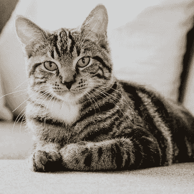
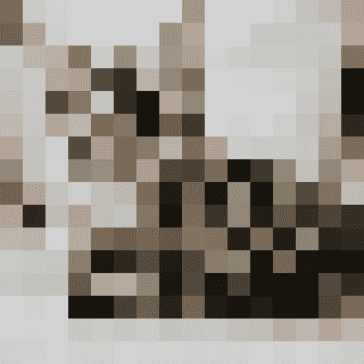

# 可以在机器学习项目中使用的图像处理技术

> 原文：<https://web.archive.org/web/https://neptune.ai/blog/image-processing-techniques-you-can-use-in-machine-learning>

图像处理是一种对图像执行操作以从中提取信息或增强图像的方法。数字图像处理有着广泛的应用，如图像恢复、医学成像、遥感、图像分割等。每个过程都需要不同的技术。

在这篇文章中，我们将讨论机器学习的六大图像处理技术。

1.  图像恢复
2.  线性过滤
3.  独立成分分析
4.  像素化
5.  模板匹配
6.  图像生成技术

1.图像恢复

## 图像质量下降的原因有很多，例如，用旧技术相机拍摄的你祖父母的旧图像可能会变得模糊或失去其原始形式。

如果图像受到一些物理压力，或者如果它是数字形式，它可能会因运动模糊或附加噪声而恶化，这种情况就会发生。

那你打算怎么恢复呢？也许这在 50 年前是不可能的，但现在——是可能的。

[**研究人员想出了一个退化模型**](https://web.archive.org/web/20230112125124/http://www.owlnet.rice.edu/~elec539/Projects99/BACH/proj2/intro.html) **，可以撤销输入图像上的退化效果。退化模型作为具有线性移位不变量的卷积来工作。**

因此，我们用退化滤波器拍摄退化前的图像(称为“真实图像”)和退化后的图像(称为“观察图像”)，退化滤波器*估计*为“真实图像”。

**使用 OpenCV 图像修复的图像恢复示例**

### [图像赋予](https://web.archive.org/web/20230112125124/https://en.wikipedia.org/wiki/Inpainting)又称**“油漆损失赔偿”。**这种技术通常用于从图像中移除不想要的对象，以恢复退化图像的受损部分。

在上面的代码中，我们有两种类型的图像

```py
import cv2

img = cv2.imread('damaged_image.png')
mask = cv2.imread('mask.png', 0)
dst = cv2.inpaint(img, mask, 3, cv2.INPAINT_NS)

cv2.imwrite('restored.png', dst)
```

被损坏的

1.  戴面具的
2.  被掩蔽的图像具有与噪声图像中存在的噪声相同的空间维度。

所以如果我们用上面的代码输入下面的图像:

带着面具:

然后我们会得到下面的图像:

OpenCV 的图像修复最大的问题是，我们需要为我们想要修复的特定图像手动输入一个遮罩。那么，我们怎样才能使这个过程自动化呢？

答案是 **GAN(一般对抗性网络)**。这篇[论文](https://web.archive.org/web/20230112125124/https://ieeexplore.ieee.org/document/8686914)提出，通过使用 GAN 网络，可以使用**邻域损失函数和梯度损失**来进行图像修复，恢复的图像质量更好。

2.线性过滤

线性滤波是一个过程，其中输出像素的值是相邻输入像素的线性组合。这个过程是通过一种叫做**卷积的技术来完成的。**

## **卷积是将图像的每个元素添加到其局部邻居的过程，由内核加权。**

我们有一个输入图像和一个带有锚点的内核。在上图中，是 H(1，1)。

这个过滤器像一个滑动窗口一样对图像进行卷积。

我们将每个像素乘以相应的核，然后求和。该总和成为输出图像中的新像素。

**让我们在 OpenCV** 的帮助下看看这是怎么回事

### 3.独立成分分析

```py
import cv2 as cv
import numpy as np
import matplotlib.pyplot as plt

image = cv.imread("pics/goku.jpeg")

fig, ax = plt.subplots(1, 3, figsize=(16, 8))
fig.tight_layout()

ax[0].imshow(cv.cvtColor(image, cv.COLOR_BGR2RGB))
ax[0].set_title('Original Image')

kernel_sharpening = np.array([[-1, -1, -1],
                             [-1, 9, -1],
                             [-1, -1, -1]])

kernel_sharpening_2 = np.array([[-1, -1, -1],
                             [-1, 10, -1],
                             [-1, -1, -1]])

sharpened = cv.filter2D(image, -1, kernel_sharpening)
ax[1].imshow(cv.cvtColor(sharpened, cv.COLOR_BGR2RGB))
ax[1].set_title('Sharpened Kernel Image')

sharpened_2 = cv.filter2D(image, -1, kernel_sharpening_2)
ax[2].imshow(cv.cvtColor(sharpened_2, cv.COLOR_BGR2RGB))
ax[2].set_title('Sharpened Kernel Image 2')

plt.show()
```

独立成分分析或简称 ICA 是一种将多元信号分离成其基本成分的**技术。** ICA 有助于从多种成分或信号的混合物中提取所需成分。

## 让我解释一下。

在 ICA 中，我们*“白化”*我们的信号。这意味着给定的将被转换，其组件之间的潜在相关性被移除，并且每个组件的方差等于 1。

**使用 sklearn 的 ICA**

输出:

### **ICA using sklearn**

```py
import numpy as np
import matplotlib.pyplot as plt
from scipy import signal
from sklearn.decomposition import FastICA, PCA

n_samples = 2000
time = np.linspace(0, 8, n_samples)

s1 = np.sin(2 * time)  
s2 = np.sign(np.sin(3 * time))  
s3 = signal.sawtooth(2 * np.pi * time)  

S = np.c_[s1, s2, s3]
S += 0.2 * np.random.normal(size=S.shape)  

S /= S.std(axis=0)  

A = np.array([[1, 1, 1], [0.5, 2, 1.0], [1.5, 1.0, 2.0]])  
X = np.dot(S, A.T)  

ica = FastICA(n_components=3)
S_ = ica.fit_transform(X)  
A_ = ica.mixing_  

plt.figure()

models = [X, S, S_]
names = ['Observations (mixed signal)',
         'True Sources',
         'ICA recovered signals']
colors = ['red', 'steelblue', 'orange']

for ii, (model, name) in enumerate(zip(models, names), 1):
    plt.subplot(3, 1, ii)
    plt.title(name)
    for sig, color in zip(model.T, colors):
        plt.plot(sig, color=color)

plt.tight_layout()
plt.show()
```

4.像素化

当图像的尺寸被放大到可以观察到单个像素的程度，或者像素被拉伸到超出其原始尺寸的程度时，就会出现像素化。

## **使用 OpenCV 进行像素化**

输入:

### 输出:

```py
import cv2

input = cv2.imread('cat.png')

height, width = input.shape[:2]

w, h = (16, 16)

temp = cv2.resize(input, (w, h), interpolation=cv2.INTER_LINEAR)

output = cv2.resize(temp, (width, height), interpolation=cv2.INTER_NEAREST)

cv2.imshow('Input', input)
cv2.imshow('Output', output)

cv2.waitKey(0)

```

5.模板匹配



模板匹配是一种在*较大的*图像中搜索并找到*模板*位置的方法。你可以把它看作是一种非常简单的物体检测方法。



在模板匹配中，我们将*模板*图像滑动到*较大的*图像上，就像我们在卷积过程中所做的那样，并找到匹配部分

## **使用 OpenCV 进行模板匹配**

模板:

大图:

### 输出:

```py
import cv2 as cv
import numpy as np
from matplotlib import pyplot as plt

img_rgb = cv.imread('waldo.jpg')
img_gray = cv.cvtColor(img_rgb, cv.COLOR_BGR2GRAY)
template = cv.imread('waldo_temp.jpg',0)
w, h = template.shape[::-1]
res = cv.matchTemplate(img_gray,template,cv.TM_CCOEFF_NORMED)
threshold = 0.8
loc = np.where( res >= threshold)

for pt in zip(*loc[::-1]):
    cv.rectangle(img_rgb, pt, (pt[0] + w, pt[1] + h), (0,0,255), 2)

cv.imshow('img_rgb', img_rgb)
cv.waitKey(0)
```

6.图像生成技术

在生成对抗网络(GANs)的帮助下，我们可以在图像数据上训练深度学习模型，以生成相同类型的图像数据。

gan 是由 Ian Goodfellow 在 2014 年发明的，他在论文[生成对抗网络](https://web.archive.org/web/20230112125124/https://papers.nips.cc/paper/5423-generative-adversarial-nets.pdf)中对此进行了描述。

**gan 由两种不同的型号组成**

## **发电机**

**鉴别器**

**发生器**的工作是产生*假*图像和**鉴别器**试图在**假图像和真实图像**之间进行分类。在训练期间，**生成器**试图通过生成更好的假图像来胜过鉴别器，鉴别器试图改进自身以区分真实图像和假图像。您可以在本文中阅读更多关于 [GAN 架构和培训的信息。](/web/20230112125124/https://neptune.ai/blog/6-gan-architectures)

最后的想法

1.  所以在本文中，我简要解释了任何机器学习项目中最常用的图像处理技术:
2.  线性过滤

图像恢复

模板匹配

## 图像生成技术

像素化

*   独立成分分析
*   但是选择正确的技术需要经验，经验来自实践。
*   所以继续学习。
*   Image Generation Technique (GAN)
*   Pixelation
*   Independent Component Analysis

But choosing the right technique requires experience and experience comes from practice. 

So keep learning.