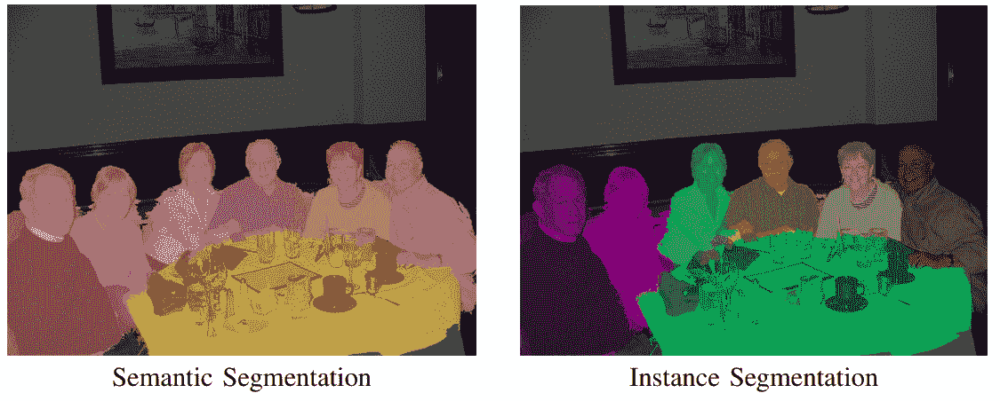
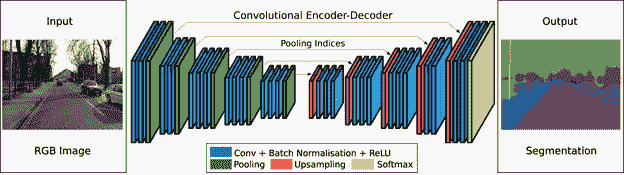
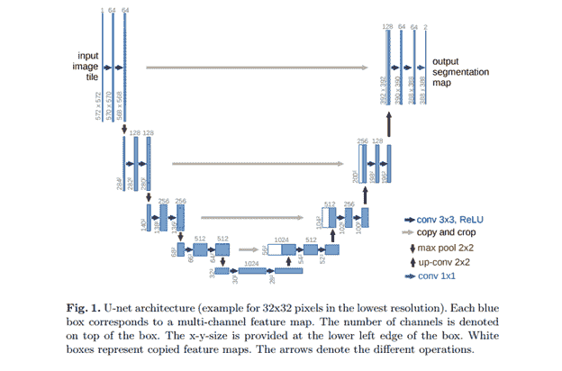
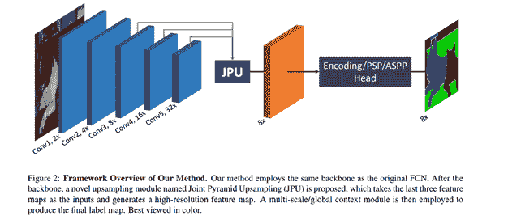
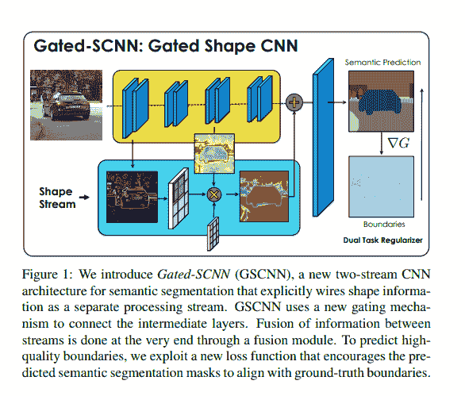
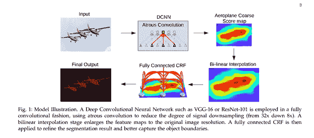
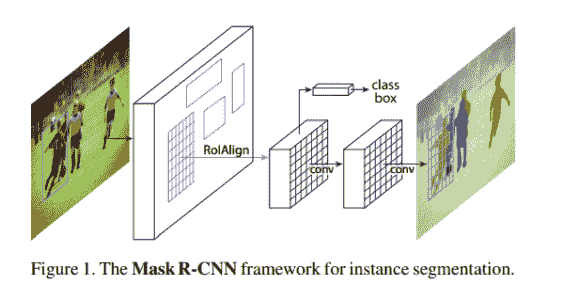
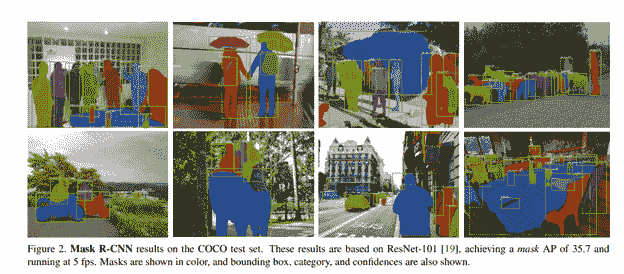

# 图像分割:架构、损失、数据集和框架

> 原文：<https://web.archive.org/web/https://neptune.ai/blog/image-segmentation>

在这篇文章中，我们将使用深度学习深入研究图像分割的世界。

让我们开始吧。

## 什么是图像分割？

顾名思义，这是将图像分割成多个片段的过程。在这个过程中，图像中的每个像素都与一个对象类型相关联。有两种主要类型的图像分割——语义分割和实例分割。

在语义分割中，相同类型的所有对象使用一个类别标签来标记，而在实例分割中，相似的对象得到它们自己的单独标签。



*Anurag Arnab, Shuai Zheng et. al 2018 “Conditional Random Fields Meet Deep Neural Networks for Semantic Segmentation” | [Source](https://web.archive.org/web/20230224202420/https://ieeexplore.ieee.org/document/8254255)*

## 图像分割架构

图像分割的基本架构由编码器和解码器组成。



*Vijay Badrinarayanan et. al 2017 “SegNet: A Deep Convolutional Encoder-Decoder Architecture for Image Segmentation” | [Source](https://web.archive.org/web/20230224202420/https://arxiv.org/abs/1511.00561)*

编码器通过过滤器从图像中提取特征。解码器负责生成最终输出，该输出通常是包含对象轮廓的分割掩模。大多数架构都有这种架构或其变体。

让我们来看看其中的几个。

### 优信网

U-Net 是一种卷积神经网络，最初开发用于分割生物医学图像。它的结构看起来像字母 U，因此得名 U-Net。它的架构由两部分组成，左边部分是收缩路径，右边部分是扩张路径。收缩路径的目的是捕获上下文，而扩展路径的作用是帮助精确定位。



*Olaf Ronneberger et. al 2015 “U-net architecture image segmentation” | [Source](https://web.archive.org/web/20230224202420/https://arxiv.org/abs/1505.04597)*

收缩路径由两个三乘三的回旋组成。卷积之后是校正的线性单元和用于下采样的 2 乘 2 最大池计算。

U-Net 的完整实现可以在[这里](https://web.archive.org/web/20230224202420/https://lmb.informatik.uni-freiburg.de/people/ronneber/u-net/)找到。

### Fast fcn—快速全卷积网络

在这种架构中，联合金字塔上采样(JPU)模块用于取代[扩张卷积，因为它们消耗大量内存和时间](https://web.archive.org/web/20230224202420/https://arxiv.org/pdf/1808.08931.pdf)。它的核心使用全连接网络，同时应用 JPU 进行上采样。JPU 将低分辨率要素地图上采样为高分辨率要素地图。



*Huikai Wu et.al 2019 “FastFCN: Rethinking Dilated Convolution in the Backbone for Semantic Segmentation” | [Source](https://web.archive.org/web/20230224202420/https://arxiv.org/abs/1903.11816)*

如果你想尝试一些代码实现，[这就是你要做的](https://web.archive.org/web/20230224202420/https://github.com/wuhuikai/FastFCN)。

### 门控 SCNN

这种架构由双流 CNN 架构组成。在这个模型中，一个单独的分支用于处理图像形状信息。形状流用于处理边界信息。



*Towaki Takikawa et. al 2019 “Gated-SCNN: Gated Shape CNNs for Semantic Segmentation” | [Source](https://web.archive.org/web/20230224202420/https://arxiv.org/abs/1907.05740)*

你可以通过检查[这里的代码](https://web.archive.org/web/20230224202420/https://github.com/nv-tlabs/gscnn)来实现它。

### DeepLab

在这种架构中，带有上采样滤波器的卷积用于涉及密集预测的任务。通过 atrous 空间金字塔池实现多尺度的对象分割。最后，使用 DCNNs 来改进目标边界的定位。阿特鲁卷积是通过插入零对滤波器进行上采样或者对输入特征图进行稀疏采样来实现的。



*Liang-Chieh Chen et. al 2016 “DeepLab: Semantic Image Segmentation with Deep Convolutional Nets, Atrous Convolution, and Fully Connected CRFs” | [Source](https://web.archive.org/web/20230224202420/https://arxiv.org/abs/1606.00915)*

你可以在 [PyTorch](https://web.archive.org/web/20230224202420/https://github.com/fregu856/deeplabv3) 或者 [TensorFlow](https://web.archive.org/web/20230224202420/https://github.com/sthalles/deeplab_v3) 上尝试它的实现。

### 屏蔽 R-CNN

在这个[架构](https://web.archive.org/web/20230224202420/https://github.com/facebookresearch/Detectron)中，使用边界框和语义分割对对象进行分类和定位，将每个像素分类到一组类别中。每个感兴趣的区域得到一个分割掩模。产生类别标签和边界框作为最终输出。该架构是更快的 R-CNN 的扩展。更快的 R-CNN 由提出区域的深度卷积网络和利用区域的检测器组成。



*Kaiming He et. al 2017 “Mask R-CNN” | [Source](https://web.archive.org/web/20230224202420/https://arxiv.org/abs/1703.06870)*

下面是在 COCO 测试集上获得的结果图像。



*Kaiming He et. al 2017 “Mask R-CNN” | [Source](https://web.archive.org/web/20230224202420/https://arxiv.org/abs/1703.06870)*

现在，让我们研究几个 Mask R-CNN 用例，为图像中的每个对象自动分割和构建像素级遮罩。

#### 屏蔽 R-CNN 用例

对于今天的介绍性用例演示，我们将重点关注用于图像分割的 Mask R-CNN 框架。具体地，我们将利用在前述 COCO 数据集上预先训练的掩模 R-CNN 模型的权重来构建推理类型的模型。

在模型构建过程中，我们还将设置 Neptune 实验来跟踪和比较不同超参数调整的预测性能。

现在，让我们开始吧！

\ u 003 cimg class = \ u 0022 lazy load block-blog-intext-CTA _ _ arrow-image \ u 0022 src = \ u 0022 https://Neptune . ai/WP-content/themes/Neptune/img/image-ratio-holder . SVG \ u 0022 alt = \ u 0022 \ u 0022 width = \ u 002212 \ u 0022 height = \ u 002222 \ u 022

首先，我们需要安装所需的包并设置我们的环境。在本练习中，将使用由 [Matterport](https://web.archive.org/web/20230224202420/https://github.com/matterport/Mask_RCNN) 实现的算法。因为到目前为止还没有这个包的发行版，所以我把从 Github repo 克隆来安装它的几个步骤放在一起:

这里需要注意的一点是，最初的 Matterport 代码没有更新为与 Tensorflow 2+兼容。因此，对于包括我在内的所有 Tensorflow 2+用户来说，让它工作变得非常具有挑战性，因为这需要对源代码进行重大修改。如果您不想自定义您的代码，Tensorflow 2+的更新版本也可以从[这里](https://web.archive.org/web/20230224202420/https://github.com/akTwelve/Mask_RCNN)获得。因此，请确保根据您的 Tensorflow 版本克隆正确的回购。

**第一步:**克隆屏蔽 R-CNN GitHub repo

*   2.2.4 之前的 Tensorflow 1+和 keras:

```py
git clone https://github.com/matterport/Mask_RCNN.git
```

```py
git clone https://github.com/akTwelve/Mask_RCNN.git updated_mask_rcnn
```

这将创建一个名为“updated_mask_rcnn”的新文件夹，以区分更新版本和原始版本。

**第二步:**

*   检查并安装软件包相关性
*   导航到包含回购的文件夹
*   运行:pip install -r requirements.txt

**第三步:**

*   运行安装程序来安装软件包
*   运行:python setup.py clean -all install

需要思考的几点:

1.  如果您遇到此错误消息:`ZipImportError: bad local file header: mask_rcnn-2.1-py3.7.egg.`，请升级您的 setuptools。
2.  对于 windows 用户，如果要求您安装 pycocotools，请确保使用 pip install pycocotools-windows，而不是 pycocotools，因为它可能与 Windows 存在兼容性问题。

**\ u 003 cimg class = \ u 0022 lazy load block-blog-intext-CTA _ _ arrow-image \ u 0022 src = \ u 0022 https://Neptune . ai/WP-content/themes/Neptune/img/image-ratio-holder . SVG \ u 0022 alt = \ u 0022 \ u 0022 width = \ u 002212 \ u 022 height = \ u 0022212 \ u 002**

接下来，从 Mask_RCNN 项目 Github 中，我们将模型权重下载到当前工作目录: [mask_rcnn_coco.h5](https://web.archive.org/web/20230224202420/https://github.com/matterport/Mask_RCNN/releases/download/v2.0/mask_rcnn_coco.h5)

**\ u 003 cimg class = \ u 0022 lazy load block-blog-intext-CTA _ _ arrow-image \ u 0022 src = \ u 0022 https://Neptune . ai/WP-content/themes/Neptune/img/image-ratio-holder . SVG \ u 0022 alt = \ u 0022 \ u 0022 width = \ u 002212 \ u 022 height = \ u 0022212 \ u 002**

当涉及到模型训练过程时，Neptune 提供了一种有效且易于使用的方法来跟踪和记录几乎所有与模型相关的内容，从超参数规范到最佳模型保存，再到绘图记录的结果等等。使用 Neptune 跟踪的[实验的酷之处在于，它会自动生成性能图表，供从业者比较不同的运行，从而选择一个最优的运行。](/web/20230224202420/https://neptune.ai/experiment-tracking)

关于配置你的海王星环境和设置你的实验的更详细的解释，请查看这个[完整指南](https://web.archive.org/web/20230224202420/https://docs.neptune.ai/getting-started/installation)和我的另一个关于[在](/web/20230224202420/https://neptune.ai/blog/implementing-the-macro-f1-score-in-keras) Keras 中实现宏 F1 分数的博客。

在这篇博客中，我还将演示如何在图像分割实现过程中利用 Neptune。是的，海王星可以很好地用于跟踪图像处理模型！

导入所有必需的包:

```py
import neptune.new as neptune

import os
import sys
import numpy as np
import skimage.io
import matplotlib
import matplotlib.pyplot as plt

ROOT_DIR = os.path.abspath(PATH_TO_YOUR_WORK_DIRECTORY) 

sys.path.append(ROOT_DIR)  
from mrcnn import utils
import mrcnn.model as modellib
from mrcnn import visualize
from mrcnn.config import Config
from mrcnn.model import MaskRCNN
from mrcnn.visualize import display_instances
from mrcnn.model import log

from keras.preprocessing.image import load_img
from keras.preprocessing.image import img_to_array

sys.path.append(os.path.join(ROOT_DIR, "samples/coco/"))  
import coco

MODEL_DIR = os.path.join(ROOT_DIR, "logs")

COCO_MODEL_PATH = os.path.join(ROOT_DIR, "mask_rcnn_coco.h5")

```

现在，让我们用 Neptune 专门为这个图像分割附加工作创建一个项目:

接下来，在 Python 中，创建一个连接到我们的图像分割项目的 Neptune 实验，以便我们可以记录和监视模型信息并输出到 Neptune:

```py
import neptune
import os

myProject = 'YourUserName/YourProjectName'
project = neptune.init(api_token=os.getenv('NEPTUNE_API_TOKEN'),
                       project=myProject)
project.stop()

npt_exp = neptune.init(
        api_token=os.getenv('NEPTUNE_API_TOKEN'),
        project=myProject,
        name='implement-MaskRCNN-Neptune',
        tags=['image segmentation', 'mask rcnn', 'keras', 'neptune'])

```

几个音符:

1.  neptune.init()中的 api_token arg 获取从配置步骤中生成的 Neptune API
2.  project.create_experiment()中的标记 arg 是可选的，但是为给定的项目指定标记以便于共享和跟踪是很好的。

在我的演示中有了 ImageSegmentationProject，以及成功设置的初始实验，我们可以进入建模部分了。

**\ u 003 cimg class = \ u 0022 lazy load block-blog-intext-CTA _ _ arrow-image \ u 0022 src = \ u 0022 https://Neptune . ai/WP-content/themes/Neptune/img/image-ratio-holder . SVG \ u 0022 alt = \ u 0022 \ u 0022 width = \ u 002212 \ u 022 height = \ u 0022212 \ u 002**

为了运行图像分割和推断，我们需要将我们的模型定义为 Mask R-CNN 类的一个实例，并构造一个 config 对象作为输入该类的一个参数。这个配置对象的目的是指定如何利用我们的模型进行训练和预测。

为了预热，让我们只为最简单的实现指定批量大小。

```py
class InferenceConfig(coco.CocoConfig):
    GPU_COUNT = 1
    IMAGES_PER_GPU = 1

config = InferenceConfig()

npt_exp['Model Config Pars'] = str(config.to_dict())
```

这里，batch size = GPU _ COUNT * IMAGES _ PER _ GPU，其中两个值都设置为 1，因为我们将一次对一个图像进行分割。我们还将配置信息发送到 Neptune，这样我们就可以跟踪我们的实验。

这个视频剪辑显示了我们将在海王星项目中看到的东西，我将它放大以显示细节。

**\ u 003 cimg class = \ u 0022 lazy load block-blog-intext-CTA _ _ arrow-image \ u 0022 src = \ u 0022 https://Neptune . ai/WP-content/themes/Neptune/img/image-ratio-holder . SVG \ u 0022 alt = \ u 0022 \ u 0022 width = \ u 002212 \ u 022 height = \ u 0022212 \ u 002**

随着所有准备工作的完成，我们继续最令人兴奋的部分——在真实图像上进行推理，看看模型做得如何。

对于任务#1，我们将使用这张图片，它可以从这里免费下载。

下面演示如何定义我们的 Mask R-CNN 模型实例:

```py
model = modellib.MaskRCNN(mode="inference", model_dir=MODEL_DIR, config=config)

model.load_weights(COCO_MODEL_PATH, by_name=True)

image_path = path_to_image_monks
img = load_img(image_path)
img = img_to_array(img)

results = model.detect([img], verbose=1)
```

思考要点:

1.  我们将当前模型的类型指定为“推断”，表明我们正在进行图像预测/推断。
2.  对于要进行预测的掩模 R-CNN 模型，必须将图像转换为 Numpy 数组。
3.  我们调用 model.detect()函数，而不是像对 Keras 模型预测那样使用 model.predict()。

太棒了。现在我们有了分割结果，但是我们应该如何检查结果并从中获得相应的图像呢？嗯，模型输出是一个包含多个组件的字典，

*   **ROI**:分割对象的感兴趣区域(ROI)。
*   **遮罩**:被分割对象的遮罩。
*   **class_ids** :被分割对象的类 ID 整数。
*   **分数**:每个片段属于一个类别的预测概率。

为了可视化输出，我们可以使用下面的代码。

```py
image_results = results[0]

box, mask, classID, score = image_results['rois'], image_results['masks'], image_results['class_ids'], image_results['scores']

fig_images, cur_ax = plt.subplots(figsize=(15, 15))
display_instances(img, box, mask, classID, class_names, score, ax=cur_ax)

npt_exp['Predicted Image'].upload(neptune.types.File.as_image(fig_images))
```

这里，class_names 指的是 COCO 数据集中 80 个对象标签/类别的列表。可以从[我的 Github](https://web.archive.org/web/20230224202420/https://github.com/YiLi225/NeptuneBlogs/blob/main/Image_Segmentation_MaskRCNN.py) 复制粘贴。

运行上面的代码会返回 Neptune 实验中的预测输出图像，

令人印象深刻不是吗！我们的模型成功地分割了僧侣/人类和狗。更令人印象深刻的是，该模型为每个细分分配了非常高的概率/置信度得分(即接近 1)！

**\ u 003 cimg class = \ u 0022 lazy load block-blog-intext-CTA _ _ arrow-image \ u 0022 src = \ u 0022 https://Neptune . ai/WP-content/themes/Neptune/img/image-ratio-holder . SVG \ u 0022 alt = \ u 0022 \ u 0022 width = \ u 002212 \ u 022 height = \ u 0022212 \ u 002**

现在你可能会认为我们的模型在最后一张图像上做得很好，可能是因为每个对象都在焦点上，这使得分割任务更容易，因为没有太多混杂的背景对象。背景模糊的图像怎么样？该模型能达到同等水平的性能吗？

我们一起实验吧。

下图是一只可爱的泰迪熊，背景是模糊的蛋糕。

为了更好地组织代码，我们可以将前面提到的模型推理步骤编译成函数 runMaskRCNN，它接受两个主要参数。:模型配置和图像路径:

```py
def runMaskRCNN(modelConfig, imagePath, MODEL_DIR=MODEL_DIR, COCO_MODEL_PATH=COCO_MODEL_PATH):
    '''
    Args:
        modelConfig: config object
        imagePath: full path to the image
   '''

    model = modellib.MaskRCNN(mode="inference", model_dir=MODEL_DIR, config=modelConfig)
    model.load_weights(COCO_MODEL_PATH, by_name=True)

    image_path = imagePath
    img = load_img(image_path)
    img = img_to_array(img)

    results = model.detect([img], verbose=1)
    modelOutput = results[0]

    return modelOutput, img
```

在试验第一个模型时，我们使用与任务#1 相同的配置。这些信息将被发送到海王星进行跟踪和比较。

```py
cur_image_path = path_to_image_teddybear
image_results, img = runMaskRCNN(modelConfig=config, imagePath=cur_image_path)

npt_exp['Model Config Pars'] = str(config.to_dict())
fig_images, cur_ax = plt.subplots(figsize=(15, 15))
display_instances(img, image_results['rois'], image_results['masks'], image_results['class_ids'], class_names, image_results['scores'], ax=cur_ax)

npt_exp['Predicted Image'].upload(neptune.types.File.as_image(fig_images))
```

根据这个模型的预测，下面的输出图像应该出现在我们的 Neptune 实验日志中。

正如我们所看到的，该模型成功地分割了背景中的泰迪熊和纸杯蛋糕。就纸杯蛋糕封面而言，模型以相当高的概率/置信度将它标记为“瓶子”，这同样适用于下面的纸杯蛋糕托盘，它被标识为“碗”。两者都有道理！

总的来说，我们的模型很好地识别了每个物体。然而，我们也注意到蛋糕的一部分被错误地标注为“泰迪熊”，概率得分为 0.702(即中间的绿色方框)。

我们如何解决这个问题？

**\ u 003 cimg class = \ u 0022 lazy load block-blog-intext-CTA _ _ arrow-image \ u 0022 src = \ u 0022 https://Neptune . ai/WP-content/themes/Neptune/img/image-ratio-holder . SVG \ u 0022 alt = \ u 0022 \ u 0022 width = \ u 002212 \ u 022 height = \ u 0022212 \ u 002**

我们可以构建一个定制的模型配置来覆盖基本配置类中的超参数。因此，要专门为这个泰迪熊图像定制建模过程:

```py
class CustomConfig(coco.CocoConfig):
    """Configuration for inference on the teddybear image.
    Derives from the base Config class and overrides values specific
    to the teddybear image.
    """

    NAME = "customized"

    NUM_CLASSES = 1 + 80

    GPU_COUNT = 1
    IMAGES_PER_GPU = 1

    STEPS_PER_EPOCH = 500

    DETECTION_MIN_CONFIDENCE = 0.71

    LEARNING_RATE = 0.06
    LEARNING_MOMENTUM = 0.7
    WEIGHT_DECAY = 0.0002

    VALIDATION_STEPS = 30

config = CustomConfig()

npt_exp.send_text('Model Config Pars', str(config.to_dict()))
```

在使用这个新配置运行模型之后，我们将在 Neptune 项目日志中看到这个具有正确分段的图像，

在我们的自定义配置类中，我们指定了类的数量、每个时期的步数、学习速率、权重衰减等等。有关超参数的完整列表，请参考软件包中的 config.py 文件。

我们鼓励您尝试不同的(超参数)组合，并设置您的 Neptune 项目来跟踪和比较它们的性能。下面的视频剪辑展示了我们刚刚建立的两个模型以及它们在海王星的预测结果。

**\ u 003 cimg class = \ u 0022 lazy load block-blog-intext-CTA _ _ arrow-image \ u 0022 src = \ u 0022 https://Neptune . ai/WP-content/themes/Neptune/img/image-ratio-holder . SVG \ u 0022 alt = \ u 0022 \ u 0022 width = \ u 002212 \ u 022 height = \ u 0022212 \ u 002**

对于那些想用我们的模型深入杂草的极客观众来说，我们也可以收集并可视化这个 CNN 模型每一层的权重和偏差。下面的代码片段演示了如何对前 5 个卷积层执行此操作。

```py
LAYER_TYPES = ['Conv2D']

layers = model.get_trainable_layers()
layers = list(filter(lambda l: l.__class__.__name__ in LAYER_TYPES, layers))
print(f'Total layers = {len(layers)}')

layers = layers[:5]

fig, ax = plt.subplots(len(layers), 2, figsize=(10, 3*len(layers)+10),
                       gridspec_kw={"hspace":1})

for l, layer in enumerate(layers):
    weights = layer.get_weights()
    for w, weight in enumerate(weights):
        tensor = layer.weights[w]
        ax[l, w].set_title(tensor.name)
        _ = ax[l, w].hist(weight[w].flatten(), 50)

npt_exp['Model_Weights'].upload(neptune.types.File.as_image(fig))

npt_exp.stop()

```

这是海王星显示的截图，显示了层权重的直方图，

## 图像分割损失函数

语义分割模型通常在训练期间使用简单的交叉分类熵损失函数。然而，如果你对获得图像的粒度信息感兴趣，那么你必须回到稍微高级一点的损失函数。

让我们来看几个例子。

### 焦点损失

这种损失是对标准交叉熵准则的改进。这是通过改变它的形状来实现的，使得分配给分类良好的例子的损失是向下加权的。最终，这确保了没有阶级不平衡。在该损失函数中，随着正确类别的置信度增加，交叉熵损失随着缩放因子在零处衰减而缩放。比例因子在训练时自动降低简单示例的权重，并关注困难的示例。

### 骰子损失

这个损失是通过计算平滑的[骰子系数](https://web.archive.org/web/20230224202420/https://en.wikipedia.org/wiki/S%C3%B8rensen%E2%80%93Dice_coefficient)函数得到的。这种损失是最常用的损失是分割问题。

### 并集上的交集(IoU)-平衡损耗

IoU 平衡的分类损失旨在增加具有高 IoU 的样本的梯度，并降低具有低 IoU 的样本的梯度。这样，提高了机器学习模型的定位精度。

### 边界损失

边界损失的一个变体应用于具有高度不平衡分割的任务。这种损失的形式是空间轮廓上的距离度量，而不是区域。以这种方式，它解决了由高度不平衡的分割任务的区域损失引起的问题。

### 加权交叉熵

在交叉熵的一个变体中，所有的正例都被某个系数加权。它用于涉及阶级不平衡的情况。

### Lovász-Softmax 损失

该损失基于子模块损失的凸 Lovasz 扩展，对神经网络中的平均交并损失进行直接优化。

值得一提的其他损失有:

*   其目的是确保网络在训练过程中专注于硬样本。
*   **距离惩罚 ce 损失**将网络导向难以分割的边界区域。
*   **敏感性-特异性(SS)损失**，计算特异性和敏感性的均方差的加权和。
*   **豪斯多夫距离(HD)损失**估计卷积神经网络的豪斯多夫距离。

这些只是图像分割中使用的几个损失函数。要探索更多，请查看这个[回购](https://web.archive.org/web/20230224202420/https://github.com/JunMa11/SegLoss)。

## 图像分割数据集

如果你还在这里，你可能会问自己从哪里可以得到一些数据集。

我们来看几个。

### 1.上下文中的常见对象— Coco 数据集

COCO 是一个大规模的对象检测、分割和字幕数据集。[数据集](https://web.archive.org/web/20230224202420/https://www.tensorflow.org/datasets/catalog/coco)包含 91 个类。它有 25 万人的关键点。其下载大小为 37.57 GiB。它包含 80 个对象类别。它在 [Apache 2.0 许可](https://web.archive.org/web/20230224202420/https://www.apache.org/licenses/LICENSE-2.0)下可用，并且可以从[这里](https://web.archive.org/web/20230224202420/http://cocodataset.org/#download)下载。

### 2.PASCAL 可视对象类(PASCAL VOC)

PASCAL 有 20 个不同类别的 9963 个图像。训练/验证集是一个 2GB 的 tar 文件。数据集可以从[官网下载。](https://web.archive.org/web/20230224202420/http://host.robots.ox.ac.uk/pascal/VOC/voc2012/)

### 3.Cityscapes 数据集

该数据集包含城市场景的图像。它可用于评估视觉算法在城市场景中的性能。数据集可以从[这里](https://web.archive.org/web/20230224202420/https://www.cityscapes-dataset.com/downloads/)下载。

### 4.剑桥驾驶标记视频数据库——CamVid

这是一个基于运动的分割和识别数据集。它包含 32 个语义类。这个[链接](https://web.archive.org/web/20230224202420/http://mi.eng.cam.ac.uk/research/projects/VideoRec/CamVid/)包含进一步的解释和数据集的下载链接。

## 图像分割框架

现在你已经有了可能的数据集，让我们来介绍几个你可以用来开始的工具/框架。

*   [*FastAI 库*](https://web.archive.org/web/20230224202420/https://docs.fast.ai/) —给定一幅图像，该库能够创建图像中对象的遮罩。
*   [*Sefexa 图像分割工具*](https://web.archive.org/web/20230224202420/http://www.fexovi.com/sefexa.html) — Sefexa 是一款免费工具，可用于半自动图像分割、图像分析和创建地面真相
*   [*deep mask*](https://web.archive.org/web/20230224202420/https://github.com/facebookresearch/deepmask)*—deep mask*由脸书研究是 [DeepMask](https://web.archive.org/web/20230224202420/http://arxiv.org/abs/1506.06204) 和 [SharpMask](https://web.archive.org/web/20230224202420/http://arxiv.org/abs/1603.08695) 的火炬实现
*   [*多路径*](https://web.archive.org/web/20230224202420/https://github.com/facebookresearch/multipathnet) —这一火炬实现的物体检测网络来自于[一多路径物体检测网络](https://web.archive.org/web/20230224202420/https://arxiv.org/abs/1604.02135)。
*   [*OpenCV*](https://web.archive.org/web/20230224202420/https://opencv.org/about/) —这是一个开源的计算机视觉库，拥有超过 2500 种优化算法。
*   [](https://web.archive.org/web/20230224202420/https://github.com/frankkramer-lab/MIScnn/wiki)**——*是一个医学图像分割开源库。它允许在几行代码中建立具有最先进的卷积神经网络和深度学习模型的管道。*
**   [*Fritz*](https://web.archive.org/web/20230224202420/https://www.fritz.ai/image-segmentation/)*:*Fritz 为移动设备提供了包括图像分割工具在内的多种计算机视觉工具。*

 *## 最后的想法

希望这篇文章给你一些图像分割的背景知识，以及一些工具和框架。我们还希望用例演示能够激发您开始探索深度神经网络这一迷人领域的兴趣

我们涵盖了:

*   什么是图像分割，
*   一些图像分割架构，
*   一些图像分割损失，
*   图像分割工具和框架，
*   掩模 R-CNN 算法的用例实现。

要了解更多信息，请查看每个架构和框架的链接。此外，Neptune 项目在这里[可用](https://web.archive.org/web/20230224202420/https://app.neptune.ai/katyl/ImageSegmentationProject/experiments?compare=IwGlyA&split=bth&dash=charts&viewId=standard-view)，完整代码可以在这个 Github repo [这里](https://web.archive.org/web/20230224202420/https://github.com/YiLi225/NeptuneBlogs/blob/main/Image_Segmentation_MaskRCNN_NewVersion.py)访问。

快乐分段！*