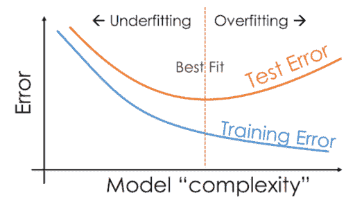
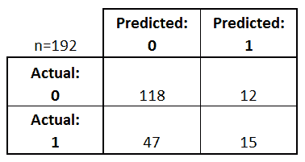
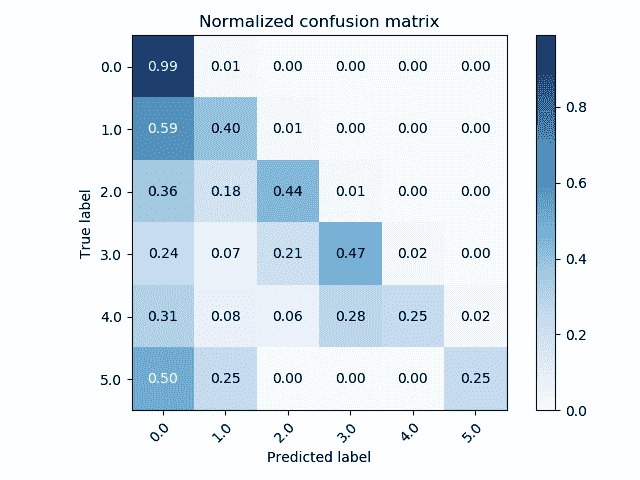
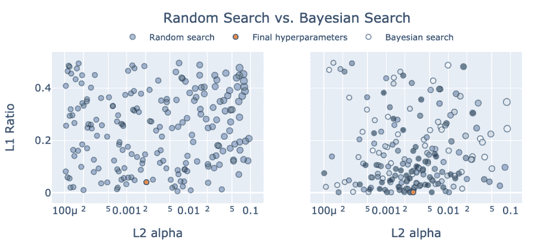

# 改善机器学习和深度学习模型的最佳实践

> 原文：<https://web.archive.org/web/https://neptune.ai/blog/improving-machine-learning-deep-learning-models>

[机器学习和深度学习模型](https://web.archive.org/web/20221206063918/https://www.zendesk.com/blog/machine-learning-and-deep-learning/)在现代组织中，我们身边无处不在。随着新算法、更便宜的计算和更大的数据可用性的快速发展，人工智能用例的数量一直在呈指数增长。每个行业都有适当的机器学习和深度学习应用，从银行到医疗保健到教育到制造、建筑等等。

在不同行业的所有这些 ML 和 DL 项目中，最大的挑战之一是模型改进。因此，在本文中，我们将探索如何改进建立在结构化数据(时间序列、分类数据、表格数据)上的机器学习模型和建立在非结构化数据(文本、图像、音频、视频或多模态)上的深度学习模型。

## 改进 ML / DL 模型的策略

在这一点上，在商业中实现 ML 和 DL 应用程序仍处于早期阶段，没有单一的结构化过程可以保证成功。然而，有一些最佳实践可以将人工智能项目失败的可能性降至最低[ [1、](/web/20221206063918/https://neptune.ai/blog/building-ai-ml-projects-for-business-best-practices)、 2、、 [3](https://web.archive.org/web/20221206063918/https://www.sundeepteki.org/blog/why-corporate-ai-projects-fail-part-24) 。

成功的关键之一是模型的准确性和性能。模型性能主要是一个技术因素，对于许多机器学习和深度学习用例来说，如果模型对于给定的业务用例来说不够准确，部署就没有意义。

| 工厂 | 例子 |
| --- | --- |
| 

什么是业务用例？

 |  |
| 

业务指标有哪些？

 |  |
| 

技术指标有哪些？

 |  |
| 

正在使用哪种数据？

 | 

结构化–数字、分类、临时或非结构化–图像、文本、音频、视频

 |
| 

什么是机器学习问题公式化？

 | 

回归、分类——多类或多标签、聚类

 |
| 

有哪些相关的 ML 和 DL 型号？

 |  |
| 

需要考虑哪些超参数优化技术？

 |  |
|  |  |

*表 1。控制机器/深度学习模型改进范围的因素列表*

在改进现有的机器学习和深度学习模型的背景下，没有可以一致应用的一刀切的策略。我将回顾一组指导方针和最佳实践，可以对它们进行评估，以系统地识别提高准确性和模型性能的潜在来源。

上面的表 1 显示了在开始调试和改进 ML 和 DL 模型之前应该考虑的一组高级因素。它强调了商业和技术约束下的一系列关键因素，在这些因素中，机器学习或深度学习模型必须得到改进。

例如，预测新零售银行客户信用评级的机器学习模型也应该能够在信用卡申请被拒绝的情况下解释其决定。在这里，如果模型不能为客户理解和提高他们的信用评分提供解释和指导，仅仅为技术指标进行优化是不够的。

为了清晰起见，在本文中，我假设您的机器学习或深度学习模型已经在特定业务用例的内部数据上进行了训练，挑战是在相同的测试集上提高模型性能，以满足所需的验收标准。

我们将探索几种提高模型性能的方法，因此您肯定会找到一两种与您的用例相关的方法。最终，在各种模型上工作的实践和经验会使我们对提高模型准确性的最佳方法有更好的直觉，并使这些技术优先于其他技术。

## 初步分析

改进机器学习模型的第一步是在业务用例的上下文中仔细检查模型的潜在假设，并评估当前模型的性能。

### (1)回顾关于数据集和算法选择的初始假设

在一个理想的场景中，任何机器学习建模或算法工作之前都要仔细分析手头的问题，包括用例的精确定义以及优化[ [1](/web/20221206063918/https://neptune.ai/blog/building-ai-ml-projects-for-business-best-practices) ]的业务和技术指标。

一旦构建机器学习或深度学习模型的激动人心的阶段开始，就很容易忽视预定义的数据注释指南、数据集创建策略、指标和成功标准。然而，记住更大的图景有利于简化和优先化改进机器学习和深度学习模型的迭代过程。

### (2)模型是过拟合还是欠拟合？

通过将模型预测误差绘制为模型复杂性或时期数的函数，这可以在下面的图 1 中可视化。训练和测试误差曲线之间的差异示出了过度拟合，即高方差和低偏差，或者欠拟合，即高偏差和低方差，并且提供了理解机器学习模型的当前状态的有用代理。

如果模型过度拟合，可以通过以下方式进行改进:

*   使用更多的训练数据，
*   降低模型的复杂性，
*   正则化方法包括脊和套索正则化，
*   辍学，
*   [提前停止](/web/20221206063918/https://neptune.ai/blog/early-stopping-with-neptune)。

如果模型拟合不足，可以通过使模型更复杂来解决，即添加更多的特征或层，并为更多的时期训练模型。

*Figure 1\. Overfitting vs. Underfitting | [Source](https://web.archive.org/web/20221206063918/https://www.geeksforgeeks.org/underfitting-and-overfitting-in-machine-learning/)*

### (3)模型制作存在何种错误？

对于一个典型的分类问题，这可以使用类似混淆矩阵的图来可视化，该图说明了类型 1(假阳性)和类型 2(假阴性)错误的比例。图 2 显示了一个典型的二元分类问题的混淆矩阵。在这个例子中，我们有 15 个真阳性，12 个假阳性，118 个真阴性，47 个假阴性。所以:

*   精度= 15/(15+12) = 15/27 = 0.56
*   回忆= 15/(15+47) = 15/62 = 0.24
*   f1-得分= 2 * 0.56 * 0.34 / (0.56 + 0.34) = 0.42

这里，精度和召回率都较低，根据接受标准，有足够的空间来提高这两者。根据业务用例及领域的不同，与精确度相比，关注提高召回率可能更有意义。这适用于医疗保健、金融和教育等领域的几个机器学习问题。

*Figure 2\. Illustration of Type 1 and Type 2 errors made by machine learning models. *

图 3 显示了多类分类问题的另一个代表性混淆矩阵，这是行业应用中的一个常见用例。乍一看，可以清楚地看到，该模型混淆了 1-5 类和 0 类，并且在某些情况下，它预测 0 类的频率高于真实类。这表明模型中存在系统误差，很可能与 0 类有关。

有了这种认识，改进该模型的第一步将是检查标记的训练示例的潜在注释错误，或者属于类 0 与类 1-5 的示例之间的相似度。这种错误分析可能会显示相关的证据，比如来自特定注释者的标签被系统地错误标记，从而导致相应类或类别之间的高混淆率。

*Figure 3\. Normalized confusion matrix for a multi-class classification problem | [Source](https://web.archive.org/web/20221206063918/https://www.geeksforgeeks.org/underfitting-and-overfitting-in-machine-learning/)*

## 模型优化

在对模型准确性进行初步分析和评估、可视化关键指标以诊断错误之后，您应该看看是否可以通过使用一组不同的超参数对当前模型进行重新训练来从当前模型中提取额外的性能。

训练的机器学习或深度学习模型的假设是，当前的模型权重和偏差集对应于凸优化过程中的局部最小值。梯度下降应该理想地产生对应于最优模型权重集的全局最小值。

然而，梯度下降是一个随机过程，它作为几个参数的函数而变化，这些参数包括如何初始化权重、学习率时间表、训练时期的数量、用于防止过拟合的任何正则化方法以及特定于训练过程和模型本身的一系列其他超参数。

每个机器学习和深度学习模型都基于独特的算法和内在参数。机器学习的目标是从数据中学习逼近复杂非线性函数的最佳权重集。通常情况下，第一个训练模型是次优的，找到超参数的最佳组合可以获得额外的准确性。

超参数调整包括训练模型的不同版本，每个版本都在不同的超参数组合上进行训练。通常，对于较小的机器学习模型，这是一个快速的过程，有助于以最高的准确性识别模型。对于包括深度神经网络在内的更复杂的模型，对超参数值的不同组合运行同一模型的多次迭代可能是不可行的。在这种情况下，谨慎的做法是根据先验知识或现有文献限制单个超参数值的范围和选择，以找到最佳模型。

最常用的三种超参数调整方法是:

### (1)网格搜索

网格搜索是一种常见的超参数优化方法，它通过评估所有可能的组合来找到一组最佳的超参数。当预先知道相关超参数的最佳范围时，这是最有用的，无论是基于经验实验、以前的工作还是出版的文献。

例如，如果您已经确定了 6 个关键超参数和特定范围内每个超参数的 5 个可能值，那么网格搜索将为每个超参数的唯一组合评估 5 * 6 = 30 个不同的模型。这确保我们关于超参数范围的先验知识被捕获到模型评估的有限集合中。

这种方法的缺点是计算量大，并且只从高维超参数网格中定义明确的空间采样。因此，如图 4 所示，更有可能错过与预定义范围之外的最佳超参数值相关的局部最小值。为了减轻网格搜索的这些限制，建议使用随机搜索。

### (2)随机搜索

随机搜索本质上涉及对超参数值进行随机采样，并且更善于识别最佳超参数值，人们可能对[[4](https://web.archive.org/web/20221206063918/https://dl.acm.org/doi/10.5555/2188385.2188395)没有强有力的假设。随机采样过程效率更高，通常会基于更少的模型迭代返回一组最佳值。所以随机搜索在很多情况下是超参数优化的首选。

*Figure 4\. A comparison of Grid search and Random search |* [*S*](https://web.archive.org/web/20221206063918/https://dl.acm.org/doi/10.5555/2188385.2188395)[*ource*](https://web.archive.org/web/20221206063918/https://dl.acm.org/doi/10.5555/2188385.2188395)

### (3)贝叶斯搜索

贝叶斯搜索是一种基于贝叶斯定理[ [5](https://web.archive.org/web/20221206063918/https://dl.acm.org/doi/10.5555/2999325.2999464) ]的复杂超参数优化方法。它的工作原理是建立一个目标函数的概率模型，称为代理函数，然后在选择候选样本对真实目标函数进行评估之前，使用获取函数对其进行有效搜索。贝叶斯优化通常能够产生比随机搜索更优的解决方案，如图 5 所示，并用于应用机器学习，以调整验证数据集上给定的良好表现模型的超参数。

*Figure 5\. A comparison of Random search and Bayesian search | [Source](https://web.archive.org/web/20221206063918/https://druce.ai/2020/10/hyperparameter-tuning-with-xgboost-ray-tune-hyperopt-and-optuna)*

## 模型和算法

### (1)建立强大的基线模型

为了改善你的机器学习或深度学习模型，建立一个强大的基线模型很重要。一个好的基线模型包含所有的业务和技术需求，测试数据工程和模型部署管道，并作为后续模型开发的基准。

基线模型的选择受到特定应用程序、数据集种类和业务领域的影响。例如，对于来自金融领域的时间序列数据的预测应用程序，XGBoost 模型是一个强基线模型。事实上，对于一些基于回归和分类的应用，梯度推进决策树通常用于生产。因此，从一个已知在生产环境中产生稳定性能的模型开始是有意义的。

对于图像、文本、音频、视频等非结构化数据，深度学习模型通常用于对象分类、图像分割、情感分析、聊天机器人、语音识别、情感识别等应用。鉴于深度学习模型的最新性能的快速发展，使用比旧模型更复杂的模型是谨慎的。例如，对于对象分类，像 VGG-16 或 ResNet-50 这样的深度卷积网络模型应该是基线，而不是单层卷积神经网络。例如，对于来自安全领域的 CCTV 图像数据的人脸识别应用程序，ResNet-50 是一个强有力的基准竞争者。

### (2)使用预先训练的模型和云 API

在某些情况下，您可以通过评估预先训练的模型来节省宝贵的时间和精力，而不是自己训练基线模型。有各种各样的来源，如 Github，Kaggle，或来自云公司的 API，如 AWS，Google Cloud，Microsoft Azure，专门的初创公司，如 Scale AI，Hugging Face，Primer.ai 等。

使用预训练模型或 API 的优势在于易于使用、评估速度更快，以及节省时间和资源。然而，一个重要的警告是，这种预训练的模型通常不直接适用于您的用例，不太灵活，并且难以定制。

然而，使用迁移学习，预训练的模型可以应用于您的用例，而不是重新训练复杂的模型，而是在您的特定数据集上微调模型权重。例如，可以利用像 ResNet-50 这样的对象分类模型的内在知识，针对 ImageNet 数据集中的几个图像类别进行训练，以加速定制数据集和用例的模型开发。

API 可用于许多用例，如预测、欺诈、搜索、用于处理文档的光学字符识别、个性化、用于客户服务的聊天和语音机器人，以及其他应用。

### (3)尝试自动 ML

虽然预先训练的模型很容易获得，但您也可以研究最先进的 AutoML 技术，以创建定制的机器学习和深度学习模型。对于组织知识和资源有限的公司来说，AutoML 是一个很好的解决方案，可以大规模部署机器学习来满足他们的业务需求。

AutoML 解决方案由 Google Cloud Platform [ [7](https://web.archive.org/web/20221206063918/https://cloud.google.com/automl) ]等云服务以及 H2O.ai 等许多小众公司和初创公司提供。AutoML 的承诺尚未规模化，但它代表了一个令人兴奋的机会，可以为您的用例快速构建和原型化基线机器学习或深度学习模型，并快速跟踪模型开发和部署生命周期。

### (4)模型改进

算法和基于模型的改进需要更多的技术专长、直觉和对业务用例的理解。鉴于结合了上述所有技能的数据科学家的供应有限，大多数企业投入大量资源并为创新的机器学习和深度学习研发分配必要的时间和带宽并不常见。

由于大多数业务用例以及组织数据生态系统都是独特的，因此一刀切的策略通常是不可行的，也是不可取的。这就需要原创作品来适应现有的或相关的应用程序，以满足企业的特殊需求。

模型改进可以来自不同的来源:

*   机器学习或深度学习模型的选择
*   如上所述的超参数调谐
*   自定义损失函数，根据业务需求确定指标的优先级
*   模型的集合，以结合单个模型的相对优势
*   超越 ReLu 等标准优化器的新型优化器

### (5)案例研究:从伯特到罗伯塔

在这一节中，我将描述一个自然语言处理的最新深度学习模型的大规模模型改进的案例研究。[由谷歌 [8](https://web.archive.org/web/20221206063918/https://arxiv.org/abs/1810.04805) ]于 2018 年开发的 BERT ，已经成为一系列自然语言处理应用中事实上的深度学习模型，并全面加速了自然语言处理的研究和用例。它在 GLUE 等基准测试中取得了最先进的性能，这些基准测试在一系列模拟人类语言理解的任务上评估模型。

然而，BERT 在 GLUE 排行榜上的榜首位置很快被脸书·AI 开发的 RoBERTa 取代，这从根本上说是进一步优化 BERT 模型的一次练习，正如其全名——稳健优化的 BERT 预训练方法[ [9](https://web.archive.org/web/20221206063918/https://arxiv.org/abs/1907.11692) ]所示。

RoBERTA 在简单修改的基础上，在性能方面超过了 BERT，这些修改包括为更多时期训练模型，向模型提供更多数据，以更大的批量在不同数据(更长的序列)上训练模型，以及优化模型和设计选择。这些简单的模型改进技术将 GLUE 基准上的模型分数从 BERT 的 80.5%提高到 RoBERTa 的 88.5%，这是一个非常显著的结果。

## 数据

在前面的章节中，我讨论了超参数优化和选择模型改进策略。在这一节中，我将描述关注数据对提高机器学习和深度学习模型的性能的重要性。在业务中，通常情况下，提高训练数据的质量和数量会产生更强的模型性能。机器学习和深度学习模型改进的以数据为中心的方法有几种技术。

### (1)数据扩充

缺乏黄金标准的标注训练数据是开发和改进大规模监督机器学习和深度学习模型的常见瓶颈。时间、费用和主题专业知识方面的标注成本是创建大规模标记训练数据集的限制因素。通常情况下，机器学习模型会遭受过度拟合，并且可以通过使用更多的训练数据来提高它们的性能。

可以利用数据扩充技术以可扩展的方式扩展训练数据集。数据扩充技术的选择取决于数据的种类。例如，合成时间序列数据可以通过从生成模型或概率分布中采样来创建，该生成模型或概率分布在汇总统计方面类似于观察到的数据。可以通过改变图像特征，如亮度、颜色、色调、方向、裁剪等来增强图像。

可以通过多种方法扩充文本，包括正则表达式模式、模板、同义词和反义词替换、回译、释义生成或使用语言模型生成文本。

音频数据可以通过修改基本声学属性来扩充，如音调、音色、响度、空间位置和其他频谱时间特征。对于特定的应用，预训练模型也可以用于扩展原始训练数据集。

基于弱监督、半监督学习、学生-教师学习和[自我监督学习](/web/20221206063918/https://neptune.ai/blog/self-supervised-learning)的最新方法也可以用来生成带有噪声标签的训练数据。这些方法基于以下前提:用未标记或有噪声的标记数据增加黄金标准的标记数据，可以显著提高模型性能。现在有可能利用基于规则和基于模型的数据增强技术的组合，这些技术可以使用数据增强平台(如浮潜[ [10](https://web.archive.org/web/20221206063918/https://arxiv.org/abs/1711.10160) )进行大规模设计。

模型表现不佳的另一个常见场景是在兴趣类别中[不平衡的数据](/web/20221206063918/https://neptune.ai/blog/how-to-deal-with-imbalanced-classification-and-regression-data)的情况下。在这种具有偏斜数据分布的情况下，数据的上采样和下采样以及 SMOTE 等技术有助于校正建模结果。

拥有训练数据集、验证数据集和测试数据集的概念在机器学习研究中很常见。交叉验证有助于打乱这三个数据集的确切组成，以便可以对模型性能做出统计上稳健的推断。

虽然传统方法侧重于具有单个验证数据集的三个数据集，但最好具有两个不同的验证数据集，一个来自与训练数据相同的分布，另一个来自与测试数据相同的分布。这样，您可以更好地诊断偏差-方差权衡，并使用如上所述的一组正确的模型改进策略。

### (2)特征工程与选择

典型的机器学习模型是在具有许多特征的数据上训练的。改进机器学习模型的另一种常见技术是设计新的特征，并选择一组最佳特征来更好地改进模型性能。特征工程需要大量领域专业知识来设计新特征，这些新特征捕捉机器学习模型正在学习逼近的复杂非线性函数的各方面。因此，如果基线模型已经捕获了一组不同的特征，这种方法并不总是可行的。

通过编程方法进行特征选择有助于移除一些对模型性能没有太大贡献的相关或冗余特征。用逐渐增加的特征集合迭代地建立和评估模型的方法，或者从用整个特征集合训练的模型中一次迭代地减少一个特征的方法，有助于识别鲁棒特征。

### (3)主动学习

对模型误差的分析可以揭示机器学习模型所犯的那种错误。回顾这些错误有助于理解是否有任何特征模式可以通过上述一些技术来解决。

此外，一旦模型已经投入生产，专注于更接近决策边界的模型错误的主动学习方法可以提供性能的显著提升。在主动学习中，模型混淆和预测错误的新示例被发送给提供正确标签的领域专家进行标注。这个由专家审阅和注释的数据集被合并回训练数据集中，以帮助重新训练的模型从其先前的错误中学习。

## 结论

机器学习和深度学习建模需要大量的主题专业知识，访问高质量的标记数据，以及用于持续模型训练和细化的计算资源。

改进机器学习模型是一门艺术，可以通过系统地解决当前模型的缺陷来完善。在本文中，我回顾了一组方法，这些方法集中于模型、它们的超参数和底层数据，以改进和更新模型，从而达到成功部署所需的性能水平。

### 参考