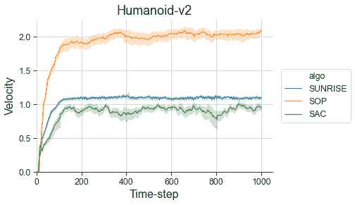
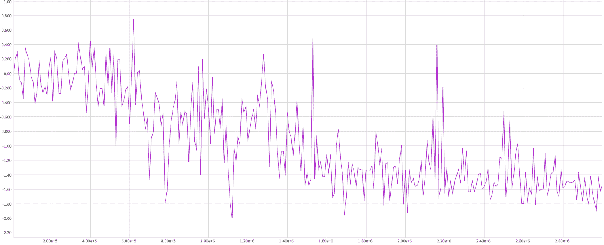
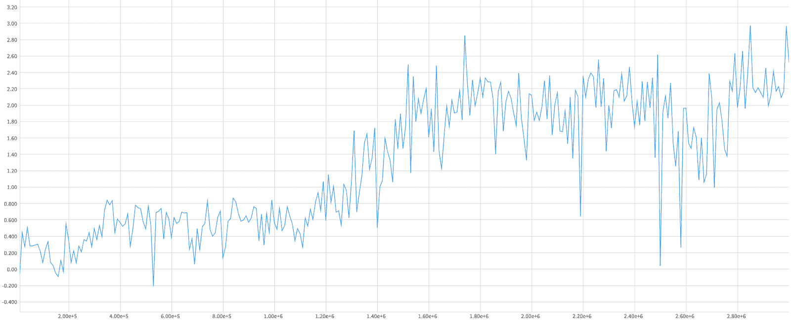
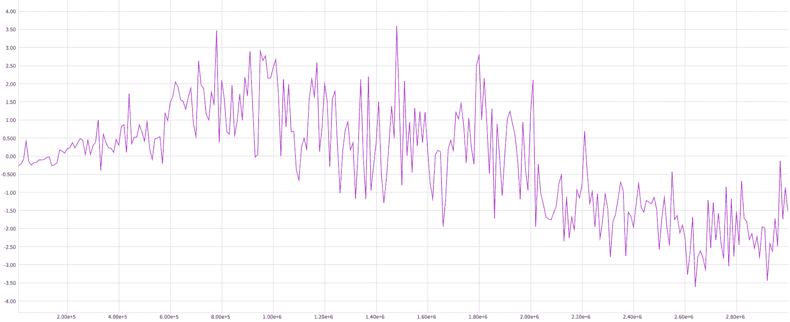
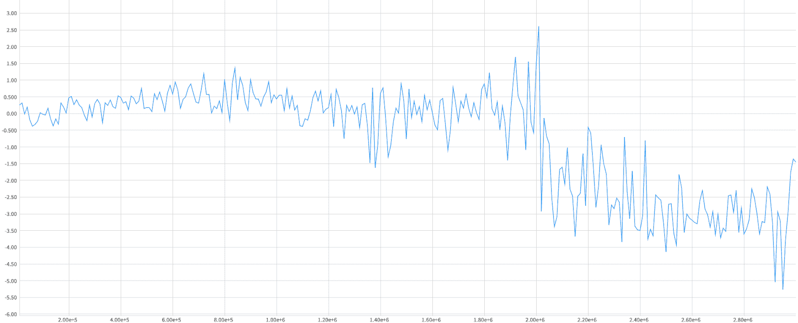

# 安装 MuJoCo 以在 OpenAI 健身房环境中工作

> 原文：<https://web.archive.org/web/https://neptune.ai/blog/installing-mujoco-to-work-with-openai-gym-environments>

**在本文中，我将向您展示如何在 Mac/Linux 机器上安装 MuJoCo，以便从 OpenAI 的 Gym** 运行连续控制环境。这些环境包括像 HalfCheetah、Hopper、Walker、Ant 和 Humanoid 这样的经典环境，以及像用机械臂或机械手灵巧操作物体这样的较难的环境。我还将讨论环境提供的其他代理诊断，这些诊断您以前可能没有考虑过。

## 你怎么得到 MuJoCo？

你可能会想，安装 MuJoCo 有什么特别的地方需要指南？嗯，获得许可证并正确安装它可能相对容易，但当你匹配 MuJoCo 和 OpenAI Gym 版本，并安装 mujoco-py 包时，大问题就开始了。我第一次尝试花了好几个小时才把它做好！

为了省去你的麻烦，我会一步一步地引导你完成安装过程。然后，我将讨论一些需要关注的有用的诊断，我们将看看来自人形训练的诊断示例。最后，我将链接代码，让您在 MuJoCo 任务上训练代理，并使用 Neptune 观察诊断。首先，我会给你一些关于 MuJoCo 和 OpenAI 健身房环境的背景。

MuJoCo 是一个**快速而精确的物理模拟引擎**，旨在研究和开发机器人、生物力学、图形和动画。这是一个引擎，这意味着，它不提供现成的模型或环境来工作，而是**运行环境**(就像 OpenAI 的健身房提供的那些)。

## 什么是 OpenAI 健身房？

OpenAI Gym(或简称 Gym)是一个环境的集合。其中一些被称为连续控制，运行在 MuJoCo 引擎上。所有环境都有两个重要特征:

1.  代理观察描述受控机器人运动特性的向量。这意味着状态空间是连续的。
2.  代理动作也是向量，它们指定了应用在机器人关节上的扭矩。这意味着动作空间也是连续的

健身房 MuJoCo 环境包括经典的连续控制、用机械臂操纵物体和机器人手(影子手)的灵活性。在这些环境中，有多种任务可供培训。下图显示了其中一些。你可以在健身房[环境列表](https://web.archive.org/web/20221207191934/https://gym.openai.com/envs/#mujoco)中找到所有这些的详细信息。[这个帖子](https://web.archive.org/web/20221207191934/https://openai.com/blog/ingredients-for-robotics-research/)对机器人手臂和机器人手环境特别有用。如果你还不知道 Gym API，我鼓励你阅读[文档](https://web.archive.org/web/20221207191934/https://gym.openai.com/docs/#environments)—“环境”和“观察”这两个简短的部分应该足够开始了。

*经典连续控制——任务从左到右:Walker2d，And，and Humanoid。
来源:*[*OpenAI Roboschool*](https://web.archive.org/web/20221207191934/https://openai.com/blog/roboschool/)

*影子手的灵巧性——手操纵积木的任务。
来源:* [*OpenAI 健身房机器人*](https://web.archive.org/web/20221207191934/https://gym.openai.com/envs/#robotics)

## 安装 MuJoCo 和 OpenAI 健身房

在这一节中，我将向您展示从哪里获得 MuJoCo 许可证，如何安装所有需要的东西，以及如何解决一个常见的 macOS 问题。

### 许可证

你可以在 [**MuJoCo 网站**](https://web.archive.org/web/20221207191934/https://www.roboti.us/license.html) 上获得 30 天的免费试用，或者——如果你是学生——获得一年的免费教育许可。许可证密钥将通过电子邮件发送给您，其中包含您的用户名和密码。如果你不是学生，你可以试着鼓励你工作的机构购买许可证。

### 安装 mujoco-py

以下是逐步说明，下面我添加了一些解释和故障排除提示:

1.  下载适用于 [Linux](https://web.archive.org/web/20221207191934/https://www.roboti.us/download/mjpro150_linux.zip) 或 [macOS](https://web.archive.org/web/20221207191934/https://www.roboti.us/download/mjpro150_osx.zip) 的 MuJoCo 版本 1.50 二进制文件。
2.  将下载的`mjpro150`目录解压到`~/.mujoco/mjpro150`，并将您的许可证密钥(您电子邮件中的`mjkey.txt`文件)放在`~/.mujoco/mjkey.txt.`
3.  运行`pip3 install -U 'mujoco-py<1.50.2,>=1.50.1'`
4.  运行`python3 -c 'import mujoco_py'`

如果您看到类似于**“objc[…]:Class GLFW…在两者中都实现了…”的警告，请忽略它们**。如果你在 macOS 上看到“clang:error:unsupported option '-fopenmp '”或任何其他与编译相关的错误，那么转到*故障排除*小节。如果你想知道为什么 MuJoCo 1.5，那么去*版本*小节。如果你没有更多的顾虑，那么你可以跳进健身房安装！

#### 解决纷争

如果在 macOS 上，**“clang:error:unsupported option '-fopenmp '”错误或任何其他与编译器**(例如 gcc，如果您安装了一个)相关的错误在安装或运行`python3 -c ‘import mujoco_py’`期间发生，请遵循以下步骤:

1.如果还没有安装 [brew](https://web.archive.org/web/20221207191934/https://brew.sh/) 。

2.卸载**所有**其他编译器，如果你有一些，例如运行`brew uninstall gcc`。如果您有多个版本，可能需要运行几次。

3.运行`brew install llvm boost hdf5`

4.将此添加到您的`.bashrc / .zshrc`

```py
export PATH="/usr/local/opt/llvm/bin:$PATH"
export CC="/usr/local/opt/llvm/bin/clang"
export CXX="/usr/local/opt/llvm/bin/clang++"
export CXX11="/usr/local/opt/llvm/bin/clang++"
export CXX14="/usr/local/opt/llvm/bin/clang++"
export CXX17="/usr/local/opt/llvm/bin/clang++"
export CXX1X="/usr/local/opt/llvm/bin/clang++"
export LDFLAGS="-L/usr/local/opt/llvm/lib"
export CPPFLAGS="-I/usr/local/opt/llvm/include"
```

5.在编辑完之后，不要忘记对您的`.bashrc / .zshrc`(例如，重新启动您的 cmd)进行源代码处理，并确保您的 python 环境已被激活。

6.尝试卸载并再次安装 mujoco-py。

更多信息见本 [GitHub 问题](https://web.archive.org/web/20221207191934/https://github.com/openai/mujoco-py/issues/465#issuecomment-651124360)。你也应该看到 [mujoco-py 自述](https://web.archive.org/web/20221207191934/https://github.com/openai/mujoco-py/tree/master#troubleshooting)的*故障排除*部分。

### 版本

在这里，我们遇到了第一个陷阱！**最新的 OpenAI 健身房与 MuJoCo 2.0** 不兼容，如果你想了解详情，请参见[本期 GitHub](https://web.archive.org/web/20221207191934/https://github.com/openai/gym/issues/1541)。这就是你需要下载 MuJoCo 版二进制文件的原因。或者，如果你真的需要使用 MuJoCo 2.0，可以下载 [Linux](https://web.archive.org/web/20221207191934/https://www.roboti.us/download/mujoco200_linux.zip) 或者 [OSX](https://web.archive.org/web/20221207191934/https://www.roboti.us/download/mujoco200_macos.zip) 的 MuJoCo 2.0 二进制文件，安装最新的 mujoco-py，然后安装最后一个支持 MuJoCo 2.0 的健身房:`pip install -U gym[all]==0.15.3`

## 安装 OpenAI 健身房环境(教程)

在这里，重要的是安装带有“mujoco”和“robotics”附加组件的 OpenAI Gym 包，或者简单地安装所有附加组件:

1.  运行`pip3 install gym[mujoco,robotics]`或`pip3 install gym[all]`
2.  通过运行以下命令检查安装:

```py
python3 -c "import gym; env = gym.make('Humanoid-v2'); print('nIt is OKAY!' if env.reset() is not None else 'nSome problem here...')"

```

如果你看到“没关系！”印在 cmd 的最后，那就没事了！同样，**您可以忽略类似“objc[…]: Class GLFW…在两个…**中实现”的警告。

## 穆乔科诊断公司

现在，我将讨论由 OpenAI Gym MuJoCo 环境提供的有用指标。它们依赖于环境版本，所以我将它们分为 v2 和 v3 诊断。您可以在环境步骤方法提供的“info”字典中访问这些指标:observation、reward、done、 **info** = env.step(action)。详见[健身房文档](https://web.archive.org/web/20221207191934/https://gym.openai.com/docs/#observations)。**下表提供了允许您访问字典中的指标和指标简短描述的关键字**。

| 名字 | 版本 | 钥匙 | 描述 |
| --- | --- | --- | --- |
|  |  |  | 

正向奖励机器人前进速度。

对机器人动作向量幅度的负奖励。

 |
|  |  |  | 

在 X 轴的位置。

X 轴上的速度(前进速度)。

 |
|  |  |  | 

在 X 轴的位置。

X 轴上的速度(前进速度)。

 |
|  |  |  | 

在 X 轴的位置。

X 轴上的速度(前进速度)。

 |
|  |  | 

奖励 _ 转发

奖励 _ 控制

奖励 _ 联系

奖励 _ 生存

 | 对机器人前进速度的正向奖励。 |
|  | 

x _ 位置

x _ 速度

y _ 位置

y _ 速度

距离 _ 起点

 | x _ 位置 | X 轴上的位置。 |
|  | 

奖励 _linvel

奖励 _ quad ctrl

奖励 _ 影响

奖励 _ 活着

 | 奖励 _ 林维尔 | 机器人动作向量幅度的负奖励。 |
| 

x _ 位置

x _ 速度

y _ 位置

y _ 速度

距离 _ 起点

 | x _ 位置 | x _ 速度 | X 轴的速度。 |

**奖励成分可能特别有用，**例如，前进速度奖励——这是这些任务的目标。然而，请注意，信息字典中缺少一些度量并不意味着，比如说，生存奖励没有加到霍普或沃克的奖励中——它加了！对于像这样的更多细节，我鼓励你在 GitHub 上查看特定任务的代码，例如 [Walker2d-v3](https://web.archive.org/web/20221207191934/https://github.com/openai/gym/blob/master/gym/envs/mujoco/walker2d_v3.py) 。

现在，让我们来看看人形任务的示例度量值。

人形诊断学

上图比较了三种不同 DRL 算法的速度: [SAC](https://web.archive.org/web/20221207191934/https://arxiv.org/abs/1812.05905?ref=hackernoon.com) 、 [SOP](https://web.archive.org/web/20221207191934/https://arxiv.org/abs/1910.02208) 和 [SUNRISE](https://web.archive.org/web/20221207191934/https://arxiv.org/abs/2007.04938) 。绘制了完全训练过的特工在事件的不同点的速度。您可以看到 SOP 代理运行最快，这是该任务的目标。在下图中，我们调查了 SAC 代理在不同训练阶段每集结束时的位置。

### 你可以看到这个特殊的 SAC 代理在负 X 和正 Y 方向上运行，随着训练它会越来越远。因为它在一集结束前的时间保持不变，这意味着它通过训练学会了跑得更快。请注意，代理没有被训练为向任何特定方向运行。它被训练成朝任何方向尽可能快地向前跑。这意味着不同的代理可以学习向不同的方向运行。此外，代理可以在训练的某个时间点改变跑步方向，如下图所示。



*Comparison of velocities of three different DRL algorithms: SAC, SOP, and SUNR*

结论



*SAC final positions in the X-axis across training on the Humanoid task.* [*Neptune experiment*](https://web.archive.org/web/20221207191934/https://app.neptune.ai/piojanu/bayesian-exploration/e/BAY-1797/charts)*.*



*SAC final positions in the Y-axis across training on the Humanoid task.* [*Neptune experiment*](https://web.archive.org/web/20221207191934/https://app.neptune.ai/piojanu/bayesian-exploration/e/BAY-1797/charts)*.*

恭喜你，你让 MuJoCo 开始运行了！现在，您会对在这些环境中培训代理感兴趣——查看[这个库](https://web.archive.org/web/20221207191934/https://github.com/awarelab/spinningup_tf2)。它包括一个简单易懂的代码 DRL 算法在现代 TF2 实施。这段代码基于新人友好的 [SpinningUp](https://web.archive.org/web/20221207191934/https://spinningup.openai.com/) 代码库。而且，**包含了登录 Neptune.ai 平台**的功能，非常方便存储和分析训练结果！我在我的研究中使用它，你也必须试一试，特别是他们发布了他们的[新的、惊人的 API](https://web.archive.org/web/20221207191934/https://neptune.ai/blog/neptune-new) 。



*SAC final positions in the X-axis across training on the Humanoid task. It changes the run direction in one-third of training.* [*Neptune experiment*](https://web.archive.org/web/20221207191934/https://app.neptune.ai/piojanu/bayesian-exploration/e/BAY-1783/charts)*.*



*SAC final positions in the Y-axis across training on the Humanoid task. It changes the run direction late in the training.* [*Neptune experiment*](https://web.archive.org/web/20221207191934/https://app.neptune.ai/piojanu/bayesian-exploration/e/BAY-1783/charts)*.*

## Conclusions

Congratulations, you’ve got MuJoCo up and running! Now you’ll be interested in training agents in these environments—check out [this repository](https://web.archive.org/web/20221207191934/https://github.com/awarelab/spinningup_tf2). It includes an easy-to-understand code of DRL algorithms implemented in modern TF2\. This code is based on the newcomer-friendly [SpinningUp](https://web.archive.org/web/20221207191934/https://spinningup.openai.com/) codebase. Moreover, **it includes the ability to log into the Neptune.ai platform**, which is very convenient to store and analyze the training results! I use it in my research and you have to give it a try too, especially that they shipped their [new, amazing API](https://web.archive.org/web/20221207191934/https://neptune.ai/blog/neptune-new).