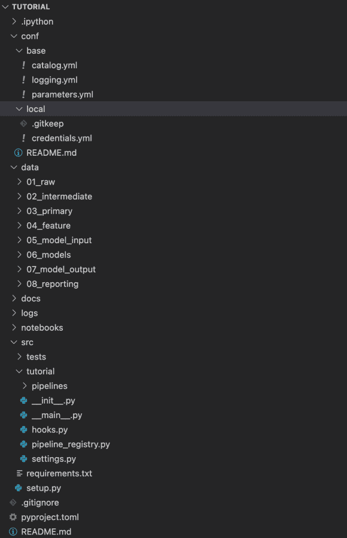
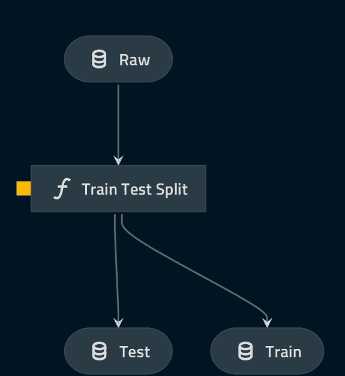
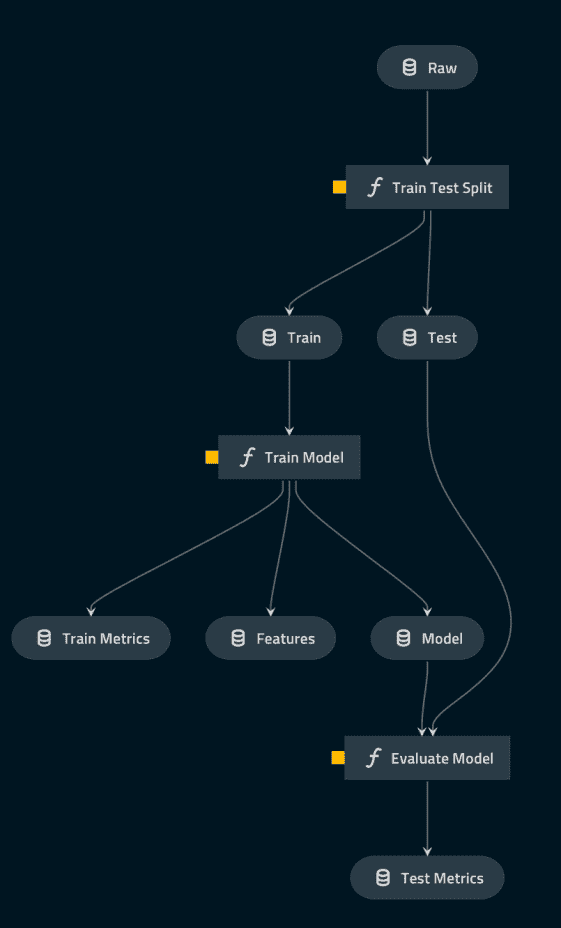
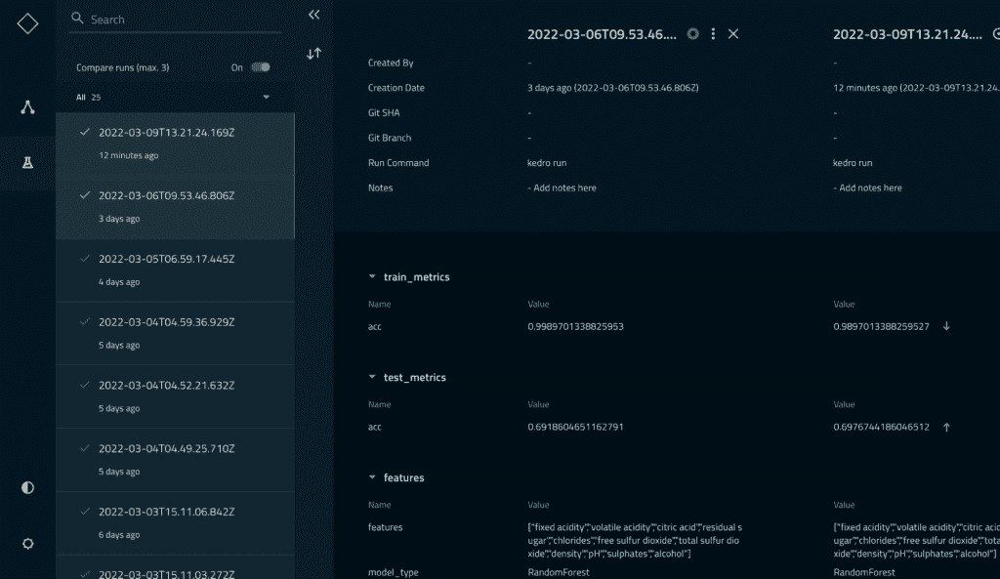
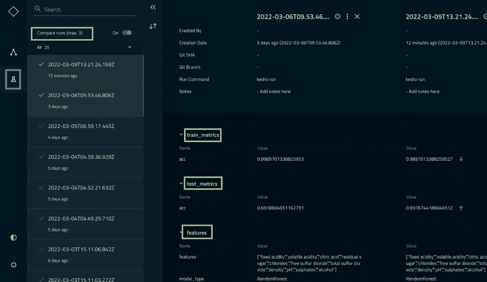
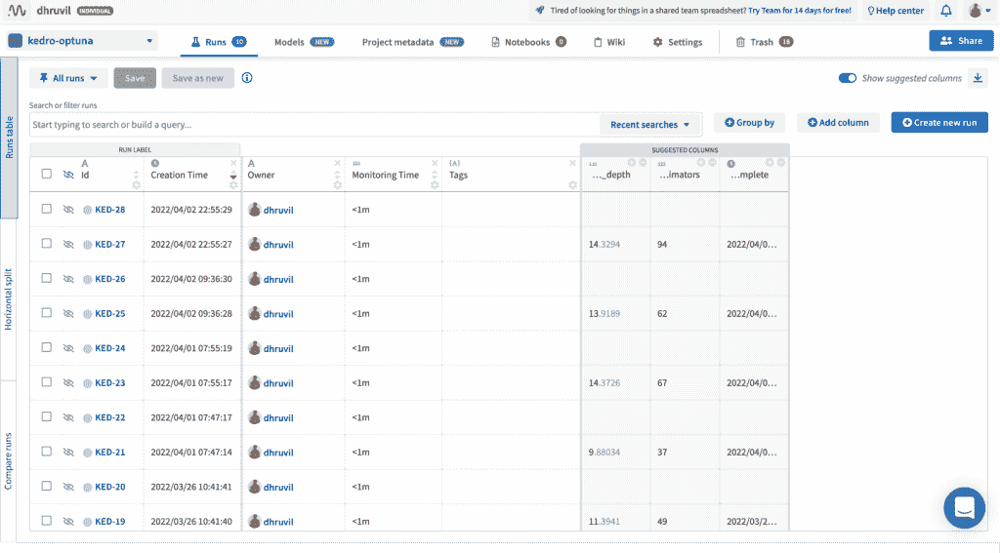
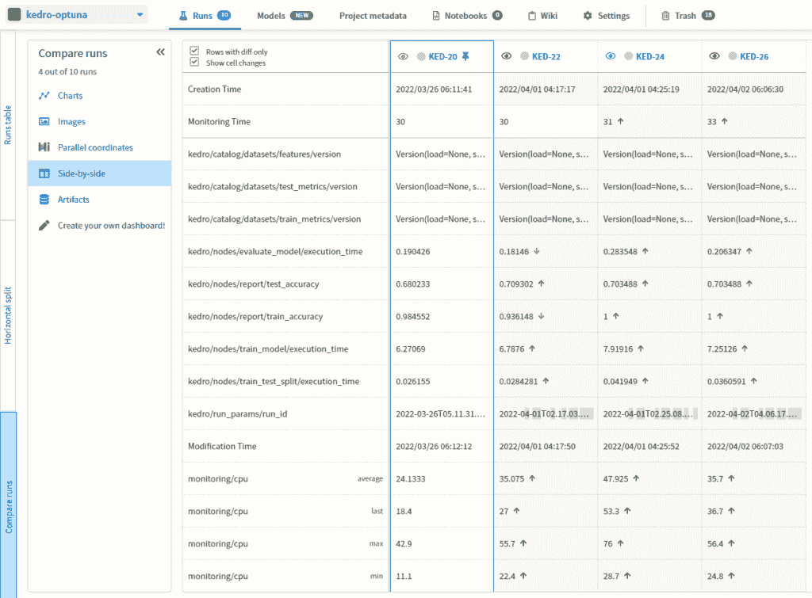

# 使用 Optuna 的 Kedro 管道:运行超参数扫描

> 原文：<https://web.archive.org/web/https://neptune.ai/blog/kedro-pipelines-with-optuna-hyperparameter-sweeps>

软件工程的工作流管理生态系统已经相当成熟——Git 用于版本控制，Postman 用于 API 测试，还有很多工具让你的生活更轻松。在 ML 中，我们始终如一地对代码和数据进行实验，这与“实验”并不常见的软件开发相反。此外，ML 实验可能很快变得混乱，并且经常无声无息地失败。

因此，需要一些工具来帮助您可靠地迭代实验，并实现最大的可见性和日志记录来跟踪变化。ML 管道中的配置可以在不同的级别上工作:

## 

*   1 数据集层面:数据选择、数据集大小、消除任何偏见

*   2 特征级:检查特征范围、异常值、可疑值，选择/转换/创建特征

*   3 模型级:模型架构、超参数

更重要的是，记录所有关键结果——单个数字指标、图表、损失曲线等。

本文展示了我们如何使用 Kedro 和 Optuna 健壮地满足上述需求。

## 介绍 Kedro

数据科学代码可能很复杂，而且变化很快。复杂性源于数据处理、EDA、功能工程/功能选择、调整和日志记录等相互关联的组件。代码或数据集的变化在实验之间不断发生。Kedro 帮助模块化数据科学管道，确保以可靠的方式处理代码。

此外，Kedro 还帮助处理各种来源(本地、AWS、GCP)和格式(CSV、HDFS、Spark)的数据。它还提供 Kubeflow、Prefect 和 AWS 批处理平台部署选项。更多关于 Kedro 的信息可以在这里找到。

## 介绍 Optuna

大多数 ML 模型都有多个超参数，需要进行调整以获得最佳的泛化能力。在数以千计的这些组合中进行强力搜索是很乏味的。

因此，需要灵活地导航超参数搜索空间。Optuna 正是这样做的。Optuna 使用复杂的算法，如 Tree Parzen Estimators (TPE)和协方差矩阵自适应进化策略(CMA-ES)，大大减少了获得最佳超参数所需的试验次数。更多关于 Optuna 的信息可以在这里找到。

## 使用 Kedro 和 Optuna 一起运行超参数扫描

Kedro 和 Optuna 在自动化 ML 工作流方面互为补充。Kedro 处理高级管道、特征转换和预处理，而 Optuna 专注于核心模型优化。

我们现在将通过教程来看看 Kedro 和 Optuna 是如何结合在一起的。

### 设置项目

要安装 kedro，请遵循此处的说明[。](https://web.archive.org/web/20220926093908/https://kedro.readthedocs.io/en/stable/02_get_started/01_prerequisites.html)

建议为该项目使用 conda 环境，并在安装任何依赖项之前激活它:

```py
conda create --name kedro-environment python=3.7 -y
conda activate kedro-environment
```

现在，让我们通过在 CLI 中运行 **kedro new** 来创建一个新的 kedro 项目模板。当它询问项目名称时，您可以输入自己选择的名称。现在，我们使用**教程**作为名称。随后，我们将这个名称用于我们的存储库和 python 包。完成所有工作后，新的项目模板结构应该如下所示:



*Source: Author*

#### 目录结构

*   **conf** 包含用于设置日志记录和管道参数的配置文件
*   **数据**包含不同级别数据集(原始、中间、已处理、元数据等)的子目录。正如我们所知，数据集不会在源位置被清理。在这里阅读更多关于每个子目录的意图[的信息](https://web.archive.org/web/20220926093908/https://kedro.readthedocs.io/en/latest/12_faq/01_faq.html#what-is-data-engineering-convention)
*   src 包含我们的应用程序代码

我们将进一步详细探讨其中的每一个。

接下来，我们安装所有的需求。Kedro 的模板已经生成了一个 requirements.txt 文件。我们在文件中添加了一些特定于我们项目的需求。requirements.txt 文件应该如下所示:

```py
black==21.5b1
flake8>=3.7.9, <4.0
ipython~=7.10
ipython~=7.16.3; python_version == '3.6'
ipython>=7.31.1, <8.0; python_version > '3.6'
isort~=5.0
jupyter~=1.0
jupyter_client>=5.1, <7.0
jupyterlab~=3.0
kedro==0.17.7
kedro-telemetry~=0.1.0
nbstripout~=0.4
pytest-cov~=3.0
pytest-mock>=1.7.1, <2.0
pytest~=6.2
wheel>=0.35, <0.37
scikit-learn
numpy
pandas
tqdm
optuna
```

要安装需求，请遵循以下代码:

```py
(kedro-environment) dhruvilkarani@Dhruvils-MacBook-Air kedro-blog % cd tutorial/src
(kedro-environment) dhruvilkarani@Dhruvils-MacBook-Air src % pip install -r requirements.txt
```

在此下载酒质数据[并保存在**教程/data/01_raw** 目录下；](https://web.archive.org/web/20220926093908/https://www.kaggle.com/yasserh/wine-quality-dataset)

```py
(kedro-environment) dhruvilkarani@Dhruvils-MacBook-Air kedro-blog % cd tutorial
```

### 编写数据处理管道

Kedro 有两条主要管道——数据处理和数据科学。数据处理管道处理数据操作、清理、连接多个数据集、特征创建，以及模型训练和评估之前的几乎所有事情。要创建数据处理模板，请遵循以下命令:

```py
(kedro-environment) dhruvilkarani@Dhruvils-MacBook-Air tutorial % kedro pipeline create data_processing
```

现在，kedro 管道非常类似于气流有向无环图(Dag)。Kedro 创建了一个节点图(node=process)。每个节点都有输入和输出。Kedro 允许我们跟踪这些输入和输出，使用它们就像正确命名它们一样好。让我告诉你它是如何工作的。考虑这个管道。



*Source: Author*

它获取原始数据并进行训练测试分割。这里唯一的节点是**列车试裂**:

```py
import pandas as pd
from sklearn.model_selection import train_test_split

def create_train_test_data(df, frac, random_seed):
   df_train, df_test = train_test_split(
                           df, test_size=frac,
                           random_state=random_seed,
                           stratify=df["quality"]
                       )
   df_train_mean = df_train.mean()
   df_train = df_train.fillna(df_train_mean)
   df_test = df_test.fillna(df_train_mean)
   return df_train, df_test
```

现在通常你会添加一个 **pd.read_csv** 和几个 **df.to_csv** 来读写文件。如果你想改变测试数据的大小，你可以改变代码中的 **frac** 参数。这非常乏味。相反，让我们这样做:

在**src/tutorial/pipelines/data _ processing/nodes . py**中添加上面的 train-test 分割代码。您应该在这个文件中编写一个节点必须执行的函数。现在，打开 **tutorial/conf/base** 下的文件 **catalog.yml** 。在文件中添加以下内容:

```py
raw:
 type: pandas.CSVDataSet
 filepath: data/01_raw/WineQT.csv

train:
 type: pandas.CSVDataSet
 filepath: data/05_model_input/train.csv

test:
 type: pandas.CSVDataSet
 filepath: data/05_model_input/test.csv
```

我们告诉 kedro 跟踪三个熊猫 CSV 文件——**raw**、 **train** 和 **test** 。我们之前已经放置了**原始**数据集。Kedro 会注意到 train 和 test CSV 文件不在它们各自的位置(文件路径参数),它会为您编写这些文件。

接下来，在**src/tutorial/pipelines/data _ processing/pipeline . py**下添加以下代码:

```py
"""
This is a boilerplate pipeline 'data_processing'
generated using Kedro 0.17.7
"""

from kedro.pipeline import Pipeline, node, pipeline
from tutorial.pipelines.data_processing.nodes import create_train_test_data

def create_pipeline(**kwargs) -> Pipeline:
   return pipeline([
       node(
           func=create_train_test_data,
           inputs=["raw", "params:frac", "params:random_seed"],
           outputs=["train", "test"],
           name="train_test_split"
       ),
   ])
```

这创建了一个数据处理管道，其中有一个名为 **train_test_split** 的节点。它将执行函数 **create_train_test_data** ，输入为 **raw** (在 conf.yml 中定义)，附加参数为 **frac** 和 **random_seed** 。输出将是 train 和 test(其中 kedro 通过 conf.yml 保持跟踪)。注意 **params:frac** 中的参数来自**conf/base/parameters . yml**中的配置文件。在其中添加以下几行:

```py
frac: 0.15
random_seed: 42
features: ['fixed acidity', 'volatile acidity', 'citric acid', 'residual sugar',
      'chlorides', 'free sulfur dioxide', 'total sulfur dioxide', 'density',
      'pH', 'sulphates', 'alcohol']
y_label: 'quality'
```

所以下一次你想尝试不同的部分和种子时，你只需要改变配置文件而不是代码。

在最后一步中，通过在**src/tutorial/pipeline _ registry . py**中添加以下内容来注册新的数据处理管道:

```py
from typing import Dict

from kedro.pipeline import Pipeline, pipeline
from tutorial.pipelines import data_processing as dp

def register_pipelines() -> Dict[str, Pipeline]:
   """Register the project's pipelines.

   Returns:
       A mapping from a pipeline name to a ``Pipeline`` object.
   """
   data_processing_pipeline = dp.create_pipeline()
   return {
       "__default__": data_processing_pipeline,
       "dp": data_processing_pipeline,
   }
```

您现在一切就绪！

只需从 CLI 运行 **kedro run** 并观察日志。它应该是这样的:

```py
kedro run
2022-03-05 12:29:15,993 - kedro.framework.cli.hooks.manager - INFO - Registered CLI hooks from 1 installed plugin(s): kedro-telemetry-0.1.3
Kedro-Telemetry is installed, but you have opted out of sharing usage analytics so none will be collected.
2022-03-05 12:29:17,446 - kedro.framework.session.store - INFO - `read()` not implemented for `SQLiteStore`. Assuming empty store.
fatal: not a git repository (or any of the parent directories): .git
2022-03-05 12:29:17,469 - kedro.framework.session.session - WARNING - Unable to git describe /Users/dhruvilkarani/Desktop/neptune/kedro-blog/tutorial
2022-03-05 12:29:17,477 - kedro.framework.session.session - INFO - ** Kedro project tutorial
/Users/dhruvilkarani/opt/anaconda3/envs/kedro-environment/lib/python3.7/site-packages/kedro/io/data_catalog.py:194: DeprecationWarning: The transformer API will be deprecated in Kedro 0.18.0.Please use Dataset Hooks to customise the load and save methods.For more information, please visithttps://kedro.readthedocs.io/en/stable/07_extend_kedro/02_hooks.html
  DeprecationWarning,
2022-03-05 12:29:18,200 - kedro.io.data_catalog - INFO - Loading data from `raw` (CSVDataSet)...
2022-03-05 12:29:18,207 - kedro.io.data_catalog - INFO - Loading data from `params:frac` (MemoryDataSet)...
2022-03-05 12:29:18,207 - kedro.io.data_catalog - INFO - Loading data from `params:random_seed` (MemoryDataSet)...
2022-03-05 12:29:18,207 - kedro.pipeline.node - INFO - Running node: train_test_split: create_train_test_data([raw,params:frac,params:random_seed]) -> [train,test]
2022-03-05 12:29:18,216 - kedro.io.data_catalog - INFO - Saving data to `train` (CSVDataSet)...
2022-03-05 12:29:18,226 - kedro.io.data_catalog - INFO - Saving data to `test` (CSVDataSet)...
2022-03-05 12:29:18,229 - kedro.runner.sequential_runner - INFO - Completed 1 out of 1 tasks
2022-03-05 12:29:18,229 - kedro.runner.sequential_runner - INFO - Pipeline execution completed successfully.
```

如果你注意到了， **train.csv** 和 **test.csv** 文件被创建并存储在**tutorial/data/05 _ model _ input**中。

### 编写数据科学管道

现在数据准备好了，我们准备训练一个模型。我们将创建一个数据科学管道，就像我们创建一个数据处理管道一样。教程的其余部分与我们到目前为止所做的非常相似。在本节中，我们选择一个 **RandomForestClassifier** 并调整它的两个重要的超参数—**n _ estimators**和 **max_depth** 。您可以选择任何具有各自超参数的 sklearn 模型:

```py
(kedro-environment) dhruvilkarani@Dhruvils-MacBook-Air tutorial % kedro pipeline create data_science
```

接下来，我们将在**src/tutorial/pipelines/data _ science/nodes . py**中添加以下代码:

```py
"""
This is a boilerplate pipeline 'data_science'
generated using Kedro 0.17.7
"""
from distutils.log import Log
from sklearn.ensemble import RandomForestClassifier
from sklearn.model_selection import cross_val_score
from sklearn.metrics import accuracy_score
from kedro.io import MemoryDataSet
import pandas as pd
import numpy as np
import optuna

def train_model(df_train, y_label, features):
   X_train = df_train[features].values
   y_train = df_train[y_label].values

   def objective(trial):
       n_estimators = trial.suggest_int('n_estimators', 2, 50)
       max_depth = int(trial.suggest_loguniform('max_depth', 1, 20))
       model = RandomForestClassifier(n_estimators=n_estimators, max_depth=max_depth)
       return cross_val_score(model, X_train, y_train,
           n_jobs=-1, cv=5).mean()

   study = optuna.create_study(direction='maximize')
   study.optimize(objective, n_trials=100)
   model = RandomForestClassifier(**study.best_params)
   model.fit(X_train, y_train)

   y_pred = model.predict(X_train)
   return model, {"acc":accuracy_score(y_train, y_pred)}, {"features":features, "model_type": "RandomForest"}

def evaluate_model(model, df_test, y_label, features):
   X_test = df_test[features].values
   y_test = df_test[y_label].values
   y_pred = model.predict(X_test)
   return {"acc": accuracy_score(y_test, y_pred)}
```

函数 **train_model** 和 **evaluate_model** 将是数据科学管道中的两个节点。 **Train_model** 训练随机森林分类器，在其中我们使用 optuna 帮助我们找到最佳超参数。这是使用**物镜**功能完成的。

对于每次试验，我们从**目标**函数中获得平均 5 倍的交叉验证准确性。我们将试验次数限制在 100 次。最后，使用最佳参数在完整的训练数据集上进行训练。

返回模型、指标字典和元数据字典。在 **evaluate_model** 函数中，我们使用训练好的模型并返回度量字典。为了在管道中获得所有这些，将以下代码添加到**src/tutorial/pipelines/data _ science/pipeline . py**:

```py
"""
This is a boilerplate pipeline 'data_science'
generated using Kedro 0.17.7
"""

from kedro.pipeline import Pipeline, node, pipeline
from tutorial.pipelines.data_science.nodes import train_model, evaluate_model

def create_pipeline(**kwargs) -> Pipeline:
   return pipeline([
       node(
           func=train_model,
           inputs=["train", "params:y_label", "params:features"],
           outputs=["model", "train_metrics", "features"],
           name="train_model"
       ),
       node(
           func=evaluate_model,
           inputs=["model", "test", "params:y_label", "params:features"],
           outputs="test_metrics",
           name="evaluate_model"
       )
   ])
```

并通过将**src/tutorial/pipeline _ registry . py**修改为以下内容来注册管道:

```py
"""Project pipelines."""
from typing import Dict

from kedro.pipeline import Pipeline, pipeline
from tutorial.pipelines import data_processing as dp
from tutorial.pipelines import data_science as ds

def register_pipelines() -> Dict[str, Pipeline]:
   """Register the project's pipelines.

   Returns:
       A mapping from a pipeline name to a ``Pipeline`` object.
   """
   data_processing_pipeline = dp.create_pipeline()
   data_science_pipeline = ds.create_pipeline()
   return {
       "__default__": data_processing_pipeline+data_science_pipeline,
       "ds": data_science_pipeline,
       "dp": data_processing_pipeline,
   }
```

就是这样！
如果你运行 **kedro viz** ，你会看到这样的内容:



*Source: Author*

这个 DAG(有向无环图)代表了我们的整个工作流程。从原始数据集到训练测试分割，再到训练、记录和评估。这就是当我们运行时它是如何被执行的。

在运行管道之前，我们将把它添加到 **conf/base/catalog.yml** :

```py
train_metrics:
 type: tracking.MetricsDataSet
 filepath: data/09_tracking/train_metrics.json

test_metrics:
 type: tracking.MetricsDataSet
 filepath: data/09_tracking/test_metrics.json

features:
 type: tracking.JSONDataSet
 filepath: data/09_tracking/features.json

model:
 type: pickle.PickleDataSet
 filepath: data/06_models/model.pkl
 backend: pickle
```

这将告诉 Kedro 跟踪来自 **train_model** 和 **evaluate_model** 函数的度量、元数据和模型。要运行管道，输入 **kedro run** 。

您可以在 CLI 中看到类似的内容:

```py
2022-03-06 15:23:47,713 - kedro.io.data_catalog - INFO - Loading data from `params:y_label` (MemoryDataSet)...
2022-03-06 15:23:47,714 - kedro.io.data_catalog - INFO - Loading data from `params:features` (MemoryDataSet)...
2022-03-06 15:23:47,714 - kedro.pipeline.node - INFO - Running node: train_model: train_model([train,params:y_label,params:features]) -> [model,train_metrics,features]
[I 2022-03-06 15:23:47,724] A new study created in memory with name: no-name-587db03d-d58a-49a9-80b9-c5683b044758
[I 2022-03-06 15:23:48,570] Trial 0 finished with value: 0.6478139043087496 and parameters: {'n_estimators': 20, 'max_depth': 15.080923501597061}. Best is trial 0 with value: 0.6478139043087496.
[I 2022-03-06 15:23:48,923] Trial 1 finished with value: 0.5664393338620142 and parameters: {'n_estimators': 46, 'max_depth': 1.9884986491873076}. Best is trial 0 with value: 0.6478139043087496.
[I 2022-03-06 15:23:49,275] Trial 2 finished with value: 0.6550145387258789 and parameters: {'n_estimators': 26, 'max_depth': 18.841791623627735}. Best is trial 2 with value: 0.6550145387258789.
[I 2022-03-06 15:23:49,589] Trial 3 finished with value: 0.6055881575469204 and parameters: {'n_estimators': 31, 'max_depth': 5.408170166043053}. Best is trial 2 with value: 0.6550145387258789.
[I 2022-03-06 15:23:49,669] Trial 4 finished with value: 0.6436901929685435 and parameters: {'n_estimators': 32, 'max_depth': 11.246378990753412}. Best is trial 2 with value: 0.6550145387258789.
[I 2022-03-06 15:23:49,787] Trial 5 finished with value: 0.6529738302934179 and parameters: {'n_estimators': 50, 'max_depth': 15.218464760076643}. Best is trial 2 with value: 0.6550145387258789.
[I 2022-03-06 15:23:49,828] Trial 6 finished with value: 0.628263283108644 and parameters: {'n_estimators': 13, 'max_depth': 13.689325469239577}. Best is trial 2 with value: 0.6550145387258789.
[I 2022-03-06 15:23:49,884] Trial 7 finished with value: 0.6457361882104149 and parameters: {'n_estimators': 23, 'max_depth': 9.102926797194122}. Best is trial 2 with value: 0.6550145387258789.
[I 2022-03-06 15:23:49,972] Trial 8 finished with value: 0.6591488236849061 and parameters: {'n_estimators': 40, 'max_depth': 19.407785624206216}. Best is trial 8 with value: 0.6591488236849061.
[I 2022-03-06 15:23:50,047] Trial 9 finished with value: 0.600385937086968 and parameters: {'n_estimators': 36, 'max_depth': 4.213221746044185}. Best is trial 8 with value: 0.6591488236849061.
[I 2022-03-06 15:23:50,072] Trial 10 finished with value: 0.5519851969336506 and parameters: {'n_estimators': 5, 'max_depth': 1.296628908687125}. Best is trial 8 with value: 0.6591488236849061.
[I 2022-03-06 15:23:50,155] Trial 11 finished with value: 0.6230769230769231 and parameters: {'n_estimators': 41, 'max_depth': 7.236080573101756}. Best is trial 8 with value: 0.6591488236849061.
[I 2022-03-06 15:23:50,222] Trial 12 finished with value: 0.6375469204335183 and parameters: {'n_estimators': 27, 'max_depth': 17.394915525536124}. Best is trial 8 with value: 0.6591488236849061.
[I 2022-03-06 15:23:50,261] Trial 13 finished with value: 0.5726143272535025 and parameters: {'n_estimators': 16, 'max_depth': 3.07366645685214}. Best is trial 8 with value: 0.6591488236849061.
[I 2022-03-06 15:23:50,364] Trial 14 finished with value: 0.6426592651334919 and parameters: {'n_estimators': 37, 'max_depth': 19.982880063130665}. Best is trial 8 with value: 0.6591488236849061.
…
```

使用这种端到端的管道，我们可以用最少的代码变化迭代实验。尝试做一些改变，并做多次运行

### 实验跟踪

运行多个实验最重要的部分是分析和比较结果。要在 Kedro 中做到这一点，运行 kedro viz。在左边点击一个烧杯形状的图标。这将带你到你已经完成的所有运行的日志。指标和元数据可用于所有实验:



*Source: Author*

可以选择最多比较三个实验。在我们的例子中，它看起来像这样:



*Source: Author*

我们可以看到，Kedro 的实验跟踪仪表盘信息量并不大。它允许我们一次最多只能比较三个实验。虽然超参数搜索运行了超过 100 个具有多个指标和输入特征的试验，但我们不能使用这样的标准过滤掉试验。从这个意义上来说，这种可视化是非常基本的。我们需要更好的东西来观看我们的实验。

### 将海王星的全面跟踪与 Kedro 和 Optuna 集成

Neptune 及其与多个开源框架的集成使得通过最小的代码更改来升级您的实验跟踪游戏变得非常简单。

#### 装置

```py
pip install neptune-client
pip install kedro-neptune
conda install -c conda-forge neptune-optuna 
```

[在这里获取您的 API 令牌](https://web.archive.org/web/20220926093908/https://app.neptune.ai/get_my_api_token)并运行 kedro neptune init。这将把所有必要的 Neptune 相关文件添加到您的项目中。

对于数据科学管道中的 nodes.py，我们将添加< 10 行，让 Neptune 进行跟踪。更新后的文件如下所示:

```py
"""
This is a boilerplate pipeline 'data_science'
generated using Kedro 0.17.7
"""
from distutils.log import Log
from sklearn.linear_model import LogisticRegression
from sklearn.ensemble import RandomForestClassifier
from sklearn.model_selection import cross_val_score
from sklearn.metrics import accuracy_score
from kedro.io import MemoryDataSet
import pandas as pd
import numpy as np
import optuna
import neptune.new as neptune
import neptune.new.integrations.optuna as optuna_utils
import matplotlib.pyplot as plt
from scikitplot.metrics import plot_confusion_matrix

run = neptune.init(
   api_token='<api_token>',
   project='<project_name>'
)
neptune_callback = optuna_utils.NeptuneCallback(run=run, base_namespace="my_hpo")

def train_model(df_train, y_label, features, neptune_run:  neptune.handler.Handler):
   X_train = df_train[features].values
   y_train = df_train[y_label].values

   def objective(trial):
       n_estimators = trial.suggest_int('n_estimators', 2, 50)
       max_depth = int(trial.suggest_loguniform('max_depth', 1, 20))
       model = RandomForestClassifier(n_estimators=n_estimators, max_depth=max_depth)
       return cross_val_score(model, X_train, y_train,
           n_jobs=-1, cv=5).mean()

   study = optuna.create_study(direction='maximize')
   study.optimize(objective, n_trials=10, callbacks=[neptune_callback])
   model = RandomForestClassifier(**study.best_params)
   model.fit(X_train, y_train)

   y_pred = model.predict(X_train)
   acc = accuracy_score(y_train, y_pred)
   neptune_run['nodes/report/train_accuracy'] = acc
   fig, ax = plt.subplots()
   plot_confusion_matrix(y_train, y_pred, ax=ax)
   neptune_run['nodes/report/train_confusion_matrix'].upload(fig)
   return model, {"acc":acc}, {"features":features, "model_type": "RandomForest"}

def evaluate_model(model, df_test, y_label, features, neptune_run):
   X_test = df_test[features].values
   y_test = df_test[y_label].values
   y_pred = model.predict(X_test)
   acc = accuracy_score(y_test, y_pred)
   neptune_run['nodes/report/test_accuracy'] = acc
   fig, ax = plt.subplots()
   plot_confusion_matrix(y_test, y_pred, ax=ax)
   neptune_run['nodes/report/test_confusion_matrix'].upload(fig)
   return {"acc": accuracy_score(y_test, y_pred)}
```

在这种情况下，我们记录准确度和混淆矩阵图。查看 Neptune 文档，了解关于[的更多信息，您还可以记录哪些数据](https://web.archive.org/web/20220926093908/https://docs.neptune.ai/you-should-know/what-can-you-log-and-display)。

### 了解更多信息

💡探索 kedro 与 Neptune 的集成——它让您拥有组织良好的 Kedro 管道的所有好处，并为 ML 元数据管理构建了强大的用户界面。

确保添加了 API 令牌和项目名称。最后，将 **train_model** 和 **evaluate_model** 函数中额外的 **neptune_run** 参数添加到我们的流水线中:

```py
def create_pipeline(**kwargs) -> Pipeline:
   return pipeline([
       node(
           func=train_model,
           inputs=["train", "params:y_label", "params:features", "neptune_run"],
           outputs=["model", "train_metrics", "features"],
           name="train_model"
       ),
       node(
           func=evaluate_model,
           inputs=["model", "test", "params:y_label", "params:features", "neptune_run"],
           outputs="test_metrics",
           name="evaluate_model"
       )
   ])
```

就是这样！现在我们坐下来，看着我们的生活变得更容易，当我们做一个凯德罗运行。在你的跑步结束后，进入 Neptune 的项目仪表板，在那里我们会看到两种类型的跑步，一种是 Kedro，另一种是 Optuna，这样的跑步有五组。

[](https://web.archive.org/web/20220926093908/https://app.neptune.ai/dhruvil/kedro-optuna/experiments?split=tbl&dash=charts&viewId=standard-view)

*Kedro-Optuna dashboard in Neptune.ai | [Source](https://web.archive.org/web/20220926093908/https://app.neptune.ai/dhruvil/kedro-optuna/experiments?split=tbl&dash=charts&viewId=standard-view)*

[](https://web.archive.org/web/20220926093908/https://neptune.ai/kedro-pipelines-with-optuna-running-hyperparameter-sweeps/attachment/kedro-optuna-neptune-runs)

*Kedro-Optuna dashboard in Neptune.ai | [Source](https://web.archive.org/web/20220926093908/https://app.neptune.ai/dhruvil/kedro-optuna/experiments?compare=EwBgNMEUA&split=cmp&dash=leaderboard&viewId=standard-view)*

您可以记录和比较任意多的运行，从而克服 Kedro 强加的三个实验限制。您还可以[添加或删除您希望比较](https://web.archive.org/web/20220926093908/https://docs.neptune.ai/you-should-know/comparing-runs)很容易完成的列(指标),在这种情况下，我们已经选择了训练和测试的准确性和执行时间。除了所有的指标和图表，Neptune 还记录了[源代码](https://web.archive.org/web/20220926093908/https://docs.neptune.ai/you-should-know/what-can-you-log-and-display#code)、[资源利用率](https://web.archive.org/web/20220926093908/https://docs.neptune.ai/you-should-know/what-can-you-log-and-display#hardware-consumption)，以及一组更丰富的[元数据](https://web.archive.org/web/20220926093908/https://docs.neptune.ai/you-should-know/what-can-you-log-and-display)。

## 结论

数据科学家在一个非常混乱的环境中工作，可能会有许多可能被忽视的重大错误来源。因此，我们需要可靠的系统来减少项目的组织开销。Kedro 和 Optuna 将大部分端到端工作流自动化，让数据科学家专注于设计方法和实验的关键任务。此外，当与诸如 Neptune 之类的工具的综合实验管理工具相结合时，在实验中进行比较和协作变得更加容易。

ML-Ops 空间是一个广阔的空间，而且增长速度比以往任何时候都快。在本文中，我们讨论了用于管道和[超参数优化](/web/20220926093908/https://neptune.ai/blog/hyperparameter-tuning-in-python-complete-guide)的工具。然而， [MLOps](/web/20220926093908/https://neptune.ai/blog/mlops) 包含了更多的领域，比如特性存储、模型版本控制等等。你可以在这里找到关于同一[的完整列表。一定要检查一下，保持学习的势头。](https://web.archive.org/web/20220926093908/https://mlops.neptune.ai/)

### 参考

### 德鲁维尔·卡拉尼

i3systems India 的数据科学家
一位热爱数学和编程的数据科学家。他以前的经验使他能够处理大规模的自然语言处理问题，如聊天机器人和文档理解。他认为，教育大众了解技术及其影响与开发新技术同样重要。

* * *

**阅读下一篇**

## 如何跟踪机器学习模型的超参数？

卡米尔·卡什马雷克|发布于 2020 年 7 月 1 日

**机器学习算法可通过称为超参数**的多个量规进行调整。最近的深度学习模型可以通过数十个超参数进行调整，这些超参数与数据扩充参数和训练程序参数一起创建了非常复杂的空间。在强化学习领域，您还应该计算环境参数。

数据科学家要**控制好** **超参数** **空间**，才能**使** **进步**。

在这里，我们将向您展示**最近的** **实践**，**提示&技巧，**和**工具**以最小的开销高效地跟踪超参数。你会发现自己掌控了最复杂的深度学习实验！

## 为什么我应该跟踪我的超参数？也就是为什么这很重要？

几乎每一个深度学习实验指南，像[这本深度学习书籍](https://web.archive.org/web/20220926093908/https://www.deeplearningbook.org/contents/guidelines.html)，都建议你如何调整超参数，使模型按预期工作。在**实验-分析-学习循环**中，数据科学家必须控制正在进行的更改，以便循环的“学习”部分正常工作。

哦，忘了说**随机种子也是一个超参数**(特别是在 RL 领域:例如检查[这个 Reddit](https://web.archive.org/web/20220926093908/https://www.reddit.com/r/MachineLearning/comments/76th74/d_why_random_seeds_sometimes_have_quite_large/) )。

## 超参数跟踪的当前实践是什么？

让我们逐一回顾一下管理超参数的常见做法。我们关注于如何构建、保存和传递超参数给你的 ML 脚本。

[Continue reading ->](/web/20220926093908/https://neptune.ai/blog/how-to-track-hyperparameters)

* * *