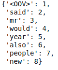
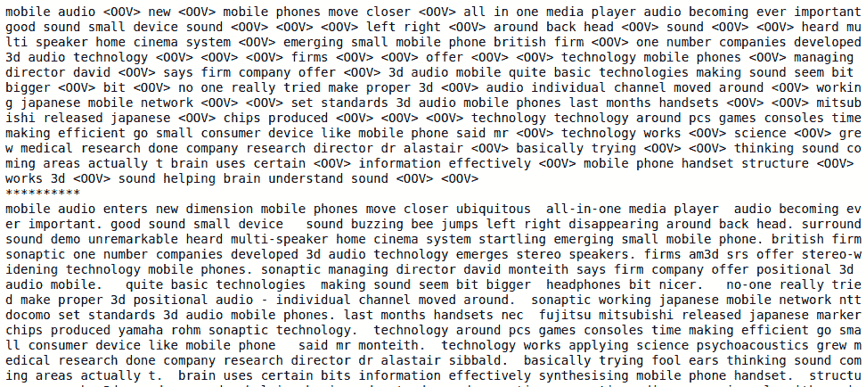
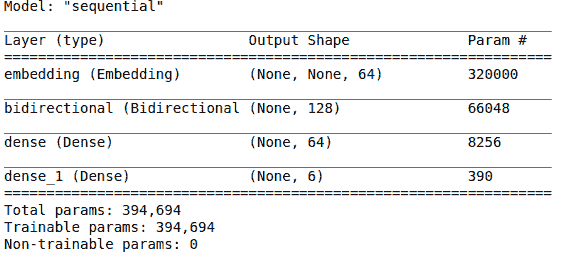
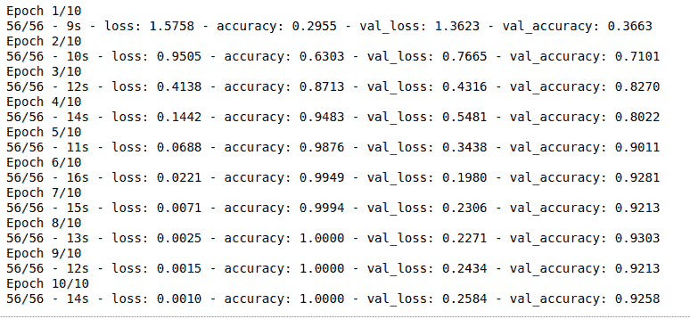

# 如何用 Neptune 跟踪 TensorFlow/Keras 模型开发

> 原文：<https://web.archive.org/web/https://neptune.ai/blog/keep-track-of-tensorflow-keras-model-development-with-neptune>

模型开发生命周期从数据探索开始，然后我们为模型选择特性，选择基线算法，接下来，我们尝试用不同的算法和参数调整来提高基线性能。

听起来很简单。但是，在所有这些过程中，您可能会创建多个笔记本，或者反复修改一个笔记本。这是一个忘记你的研究的好方法。

幸运的是，这是可以避免的。你只需要**记录你所有的模型、数据和特性**。这样，无论何时你想重温你以前做过的事情，都很容易做到。

在本文中，我将向您展示如何组织和跟踪 [Tensorflow 项目](/web/20221206061349/https://neptune.ai/blog/how-to-make-your-tensorboard-projects-easy-to-share-and-collaborate-on)并保持一切整洁。

这一切都归结于 [MLOps](/web/20221206061349/https://neptune.ai/blog/mlops-what-it-is-why-it-matters-and-how-to-implement-it-from-a-data-scientist-perspective) ，它是一套原则和工具，汇集了产品团队和数据科学团队，以及生产中开发、部署、监控、管理和保护 ML 模型的所有关键操作。

[MLOps 基本上就是 DevOps](https://web.archive.org/web/20221206061349/https://valohai.com/blog/difference-between-devops-and-mlops/) ，但是针对机器学习。 [ML 生命周期](/web/20221206061349/https://neptune.ai/blog/life-cycle-of-a-machine-learning-project)应该支持模型交付的速度和规模，以便在您的组织中处理数据的速度和数量。你为什么需要这个？因为将 ML 应用从概念阶段发展到生产中的实际部署是非常困难的。

## ML 模型生命周期中的挑战

为了跟踪您的实验，有必要跟踪**代码、数据、模型版本、超参数和度量**。以一种有意义的方式组织它们将有助于你在你的组织内合作。

在现实世界的项目中，数据一直在变化。添加了新的表格，删除了错误标记的点，改变了特征工程技术，改变了验证和测试数据集以反映生产环境。当数据更改时，基于该数据的所有内容也会更改，但代码保持不变，因此跟踪数据版本非常重要。

## 跟踪您的 ML 实验的方法

适当的[实验跟踪](/web/20221206061349/https://neptune.ai/experiment-tracking)使得基于数据版本比较指标和参数、比较实验以及比较测试或验证集的最佳或最差预测变得容易。还可以分析模型训练的硬件消耗。从[石灰](https://web.archive.org/web/20221206061349/https://github.com/marcotcr/lime)等工具看预测解释和特征重要性。

下面的解释将帮助你惊人地跟踪你的实验，并获得像上面所附的图表。

## 指定项目要求

首先，为您的项目设置一个度量标准(性能的阈值)。例如，针对[F1-得分](https://web.archive.org/web/20221206061349/https://en.wikipedia.org/wiki/F-score)优化您的模型。

第一次部署应该包括构建一个简单的模型，重点是构建一个合适的 ML 管道来进行预测。这将帮助您快速交付价值，并避免花费太多时间试图构建完美模型的陷阱。当你在你的组织中开始一个新的 ML 项目时，实验运行可以迅速扩展到几十、几百甚至几千个。如果不跟踪，你的工作流程会变得混乱。

因此，像 [Neptune](/web/20221206061349/https://neptune.ai/product/experiment-tracking) 这样的跟踪工具正在成为 ML 项目中的标准工具。您可以使用它来记录您的数据、模型、超参数、混淆矩阵、图表等等。在你的工作流/代码中包含一个像 Neptune 这样的工具，相对于你不跟踪任何东西时所经历的痛苦，是非常简单的。

为了向您展示如何进行跟踪，我们将使用 [Tensorflow](https://web.archive.org/web/20221206061349/https://www.tensorflow.org/) 来训练一个文本分类模型。我们将使用 LSTMs 训练模型:

*   长短期记忆网络是一种特殊的 RNN，能够处理长期依赖。
*   LSTMs 是专门为解决长期依赖问题(长时间记忆信息)而设计的。
*   所有的 rnn 都有链状的重复神经网络模块。

下图显示了 LSTM 中的重复模块。

不要担心内部发生了什么(如果你渴望了解，请阅读本文以获得关于 LSTMs 的深入见解)。

介绍够了，让我们使用 [Neptune](/web/20221206061349/https://neptune.ai/product) 实现和跟踪模型开发。

在我们进行任何建模或分析之前，让我们建立一个组织良好的 ML 代码库。

## 使用 Neptune 避免模型开发过程中的混乱

### 为此项目安装依赖项

我们将在 Jupyter 笔记本中使用 Neptune，因此我们需要 Neptune 客户端和 Neptune jupyter 扩展。为 jupyter 笔记本配置 Neptune，它将帮助我们将笔记本检查点保存到 Neptune。按照下面的命令来做这件事。

```py
!pip install neptune-client numpy~=1.19.2 tensorflow nltk
!pip install -U neptune-notebooks
!jupyter nbextension enable --py neptune-notebooks
```

运行以上命令后，您将在 jupyter 笔记本中看到以下扩展。

现在我们已经安装了必要的依赖项，让我们导入它们。

```py
import tensorflow as tfl
import numpy as np
import csv
from tensorflow.keras.preprocessing.text import Tokenizer
from tensorflow.keras.preprocessing.sequence import pad_sequences
from nltk.corpus import stopwords
from neptune.new.integrations.tensorflow_keras import NeptuneCallback
import neptune.new as neptune
STOPWORDS = set(stopwords.words('english'))

```

将您的项目连接到 Neptune 客户端。如果您是该平台的新手，请阅读[指南](https://web.archive.org/web/20221206061349/https://docs.neptune.ai/getting-started/hello-world)开始使用。

```py
run = neptune.init(project='aravindcr/Tensorflow-Text-Classification',
                   api_token=’YOUR TOKEN’) 
```

这些是我在这个项目中使用的一些参数，我把它们记录在[这里](https://web.archive.org/web/20221206061349/https://app.neptune.ai/aravindcr/Tensorflow-Text-Classification/e/CLASSIFY-9/all?path=parameters)。要跟进，使用应用程序中附带的笔记本[这里](https://web.archive.org/web/20221206061349/https://app.neptune.ai/aravindcr/Tensorflow-Text-Classification/n/Tensorflow-Classification-942a1459-ea07-426a-9703-033614bb52cf/4d3cdd39-eea5-441c-872e-23302882a95d)。要了解更多关于记录元数据的信息，请查看这个[指南](https://web.archive.org/web/20221206061349/https://docs.neptune.ai/you-should-know/logging-metadata)。

### 保存超参数(每次迭代)

```py
run['parameters'] = {'embed_dims': 64,
                    'vocab_size': 5000,
                    'max_len': 200,
                    'padding_type': 'post',
                    'trunc_type': 'post',
                    'oov_tok': '<OOV>',
                    'training_portion': 0.8
                    }
```

### 数据集版本

我们使用的数据集是用于分类的 BBC 新闻文章数据。从[这里](https://web.archive.org/web/20221206061349/https://app.neptune.ai/aravindcr/Tensorflow-Text-Classification/e/CLASSIFY-8/all?path=&attribute=dataset)下载数据。您也可以使用下面的命令将您的数据记录到 Neptune。

这将帮助我们在进行实验时跟踪数据集的不同版本。这可以用 Python 中的 Neptune 的 **set_property** 函数和 **hashlib** 模块来完成。

```py
run['dataset'].upload('news-docs-bbc.csv')
```

在下面的部分，我创建了一个名为标签和文本的列表，它将帮助我们存储新闻文章的标签和与之相关的实际文本。我们还使用 [nltk](https://web.archive.org/web/20221206061349/https://www.nltk.org/) 删除了停用词。

```py
labels = []
texts = []

with open('news-docs-bbc.csv', 'r') as file:
    data = csv.reader(file, delimiter=',')
    next(data)
    for row in data:
        labels.append(row[0])
        text = row[1]
        for word in STOPWORDS:
            token = ' ' + word + ' '
            text = text.replace(token, ' ')
            text = text.replace(' ', ' ')
        texts.append(text)
print(len(labels))
print(len(texts))
train_size = int(len(texts) * training_portion)
```

让我们将数据分成训练集和验证集。如果您查看上述参数，我们将 80%用于培训，20%用于验证我们为此用例构建的模型。

```py
train_text = texts[0: train_size]
train_labels = labels[0: train_size]

validation_text = texts[train_size:]
validaiton_labels = labels[train_size: ]
```

让我们把句子转换成子单词标记串。这需要五千个最常见的单词。每当我们**遇到看不见的特殊值**时，我们就使用 ***oov_token*** 。

<00V>将用于在 ***word_index*** 中找不到的单词。 ***fit_on_texts*** 将根据文本列表更新内部词汇。该方法基于词频创建词汇索引。

```py
tokenizer = Tokenizer(num_words = vocab_size, oov_token=oot_tok)
tokenizer.fit_on_texts(train_text)
word_index = tokenizer.word_index

dict(list(word_index.items())[0:8])
```



正如我们在上面的输出中看到的， **< oov >** 是语料库中最常见的标记，其次是其他单词。

现在我们已经创建了一个基于频率的词汇索引，让我们将这些标记转换成序列列表，
***text _ to _ sequence***将文本转换成一个整数序列。简单来说，它将文本中的单词转换成 **word_index** 字典中对应的整数值。

```py
train_sequences = tokenizer.texts_to_sequences(train_text)
print(train_sequences[16])

train_padded = pad_sequences(train_sequences, maxlen=max_len, padding=padding_type, truncating=trunc_type)

```

当在你的下游 NLP 任务上训练神经网络时，需要记住一件事，序列需要具有相同的大小，所以我们使用 ***max_len*** 参数填充那些序列。在我们的例子中，我在开始时指定了 200，这就是为什么我们在下面使用 ***填充 _ 序列*** 的原因。

序列长度小于或大于 ***max_len*** 的文章将被截断为 200。例如，如果序列长度为 186，它将被填充到 200，并带有 14 个零。通常，我们拟合数据一次，但转换序列多次，所以我们没有合并训练集和验证集。

```py
valdn_sequences = tokenizer.texts_to_sequences(validation_text)
valdn_padded = pad_sequences(valdn_sequences,
                             maxlen=max_len,
                             padding=padding_type,
                             truncating=trunc_type)

print(len(valdn_sequences))
print(valdn_padded.shape)
```

让我们看看我们的标签。标签需要被标记化，所有的训练标签都应该是 NumPy 数组的形式。我们将用下面的代码将它们转换成一个 NumPy 数组。

```py
label_tokenizer = Tokenizer()
label_tokenizer.fit_on_texts(labels)

label_tokenizer = Tokenizer()
label_tokenizer.fit_on_texts(labels)
```

在开始建模任务之前，让我们看看它们填充前后的样子。我们可以看到有些词变成<oov>是因为它们没有出现在顶部提到的 ***vocab_size*** 中。</oov>

```py
word_index_reverse = dict([(value, key) for (key, value) in word_index.items()])

def decode_article(text):
    return ' '.join([word_index_reverse.get(i, '?') for i in text])
print(decode_article(train_padded[24]))
print('**********')
print(train_text[24])
```



### 列车张量流模型

使用 **tfl.keras.sequential** 我们将层的线性堆栈分组到 tfl.keras.Model 中。f **第一层是嵌入层**，它为每个单词存储一个向量。单词序列被转换成向量序列。NLP 中的嵌入主要是为了让意义相近的词有相似的向量表示(词嵌入就是意义相近的词有相似的向量表示的词向量)。

**tfl . keras . layers . bidirectional**是 RNNs 的双向包装器，它有助于通过 LSTM 层向前和向后传播输入，然后链接输出。这对学习 LSTMs 中的长期依赖关系很有好处。为了进行分类，我们将它组成一个密集的神经网络。

我们在这里使用的激活函数是 **relu** 和 **softmax** 。如果 relu 函数返回负输入，则返回 0，但是对于 x 的任何正值，它都返回值。要了解更多关于 relu 的信息，请查看[指南](https://web.archive.org/web/20221206061349/https://machinelearningmastery.com/rectified-linear-activation-function-for-deep-learning-neural-networks/)。

密集层增加了六个单元。最后一层是**‘soft max’**激活函数，它将网络输出归一化为预测输出类别的概率分布。

```py
model = tfl.keras.Sequential([
    tfl.keras.layers.Embedding(vocab_size, embed_dims),
    tfl.keras.layers.Bidirectional(tfl.keras.layers.LSTM(embed_dims)),
    tfl.keras.layers.Dense(embed_dims, activation='relu'),
    tfl.keras.layers.Dense(6, activation='softmax')
])
model.summary()
```



正如您在上面的模型摘要中看到的，我们有一个嵌入层和双向 LSTM。双向的产出是我们在 LSTM 投入的两倍。

我这里用过的损失函数是***categorial _ cross _ entropy***，通常用于多类分类任务。它主要量化两个概率分布之间的差异。我们使用的优化器是 ***【亚当】*** ，梯度下降的一种变体。

```py
model.compile(loss='sparse_categorical_crossentropy', optimizer='adam', metrics=['accuracy'])
```

## 使用 Neptune 组织 ML 模型开发

为了将训练指标记录到 Neptune，我们使用来自 Neptune 库的回调。例如，如下图所示，来自 Tensorflow / Keras 和 **NeptuneCallback** 的日志元数据。这有助于您记录通常会在这些 ML 库中记录的大多数元数据:

```py
from neptune.new.integrations.tensorflow_keras import NeptuneCallback

neptune_clbk = NeptuneCallback(run=run, base_namespace='metrics')

epochs_count = 10
history = model.fit(train_padded, training_label_seq, epochs=epochs_count, validation_data=(valdn_padded, validation_label_seq), verbose=2, callbacks=[neptune_clbk])

```

现在，当你运行这个时，你所有的指标和损失都会被记录在 [Neptune](https://web.archive.org/web/20221206061349/https://app.neptune.ai/aravindcr/Tensorflow-Text-Classification/e/CLASSIFY-20/all) 中。



作为模型训练的一部分，我们还可以监控 RAM 和 CPU 的使用情况。这些信息可以在实验的监控部分找到。

建立模型性能的基线。从使用初始数据管道的简单模型开始。在您的领域中找到问题的区域模型的状态，然后再现结果。稍后，将数据集应用到下一个基线。

### 模型版本控制

```py
tfl.keras.models.save_model(model, 'classification.h5', overwrite=True, include_optimizer=True, save_format=None,
        signatures=None, options=None, save_traces=True)

model.save('my_model')

run['my_model/saved_model'].upload('classification.h5')
```

模型保存在 [Neptune](https://web.archive.org/web/20221206061349/https://app.neptune.ai/aravindcr/Tensorflow-Text-Classification/e/CLASSIFY-21/all?path=my_model&attribute=saved_model) 中的 **saved_model** 目录下。

### 记录项目中的任何内容

```py
def graphs_plotting(history, string):
    plt.plot(history.history[string])
    plt.plot(history.history['val_'+string])
    plt.xlabel('Epochs')
    plt.ylabel(string)
    plt.legend([string, 'val_'+string])
    plt.show()

graphs_plotting(history, 'accuracy')
graphs_plotting(history, 'loss')
```

```py
run['train/plots/accuray'].upload('val_accuracy.png')
run['train/plots/loss'].upload('val_loss.png')
```

```py

PARAMS = {'epoch_num': 10,
          'batch_size': 64,
          'optimizer': 'adam',
          'loss_fun': 'categorical_corss_entropy',
          'metrics': ['accuracy'],
          'activation': 'relu'}

run['parameters'] = PARAMS

```

记录的参数可以在 [Neptune](https://web.archive.org/web/20221206061349/https://app.neptune.ai/aravindcr/Tensorflow-Text-Classification/e/CLASSIFY-13/all?path=parameters&attribute=activation) 中找到。

在处理一个行业项目时，您使用的度量标准可能会根据您正在处理的问题和部署模型的领域而发生变化。记录度量可以为您的团队节省大量时间。

在海王星，你所有的实验都组织在一个地方。你可以在你的实验中添加标签，准确记录你所做的尝试，比较指标，在需要的时候重现或重新运行实验。你可以安心地睡觉，因为你知道你所有的想法都安全地藏在一个地方。

你也可以给你的实验添加标签，这将有助于你更好地跟踪你的实验。在模型部署之前，请确保为以下各项准备好版本:模型配置、模型参数训练数据集和验证数据集。部署 ML 模型的一些常见方法是将它们打包到 docker 容器中，并且——为了推理公开——打包到 REST API 中。

您还可以比较已登录到 Neptune 的笔记本的多个版本。

### 模型细化

上述模型在 6 个时期后开始过度拟合。您可以更改纪元并重新训练您的模型，然后将您的参数记录到 Neptune。

随着模型的复杂性增加，要反复调试它。执行误差分析对于发现模型失败的地方是必要的。跟踪模型性能如何随着训练数据量的增加而扩展。一旦你有了成功地为你的问题建立模型的想法，以后你应该试着从模型中获得最好的性能。将您的错误分解为:

*   可避免的偏见，
*   方差，
*   不可约误差，
*   测试误差和验证误差的区别。

### 解决欠拟合问题(高偏差、低方差)

执行特定于模型的优化。如果您的模型拟合不足，那么它已经捕获了数据中的模式和噪声，但它在您的训练和测试数据中表现不佳。对数据进行版本化和更改模型参数非常重要。您可以通过误差分析、增加模型容量、调整超参数和添加新特征来解决欠拟合问题。

### 解决过度拟合问题

当您的模型过度拟合时，它在训练数据上表现很好，在测试数据上表现很差。这表明你的模型有**高方差和低偏差**。调查关于此类问题的文献，与你团队中的专家或你认识的可能处理过类似问题的人交谈。

我们可以通过添加更多的训练数据、[正则化](https://web.archive.org/web/20221206061349/https://en.wikipedia.org/wiki/Regularization_(mathematics))、误差分析、调整超参数和减小模型大小来解决过度拟合问题。

### 寻址分布移位

优化您的模型非常重要，因为您构建的模型在某些情况下可能会失败。在生产中使用你的方法会有风险。

我们可以通过执行误差分析来解决分布的偏移，以便确定分布的偏移。扩充您的数据以更好地匹配测试分布，并应用领域适应技术。

### 调试 ML 项目

这一步主要是为了调查为什么你的模型表现不佳。

可能有一些实现错误、数据集构造问题或坏的超参数。尽快在生产数据上部署基线模型。通常，实时数据会以意想不到的方式发生变化。它可能不会反映您在开发过程中使用的数据(通常称为数据漂移)。

快速部署一个简单的模型，这样你就可以提前知道你需要做什么。这有助于更快的迭代，而不是试图创建完美模型的慢迭代。需要固定随机种子，以确保模型训练是可重复的。

通过对你的实验进行适当的跟踪，上面的一些挑战可以被解决，并且更容易将你的结果传达给团队。

## 摘要

要高效地构建机器学习项目，从简单开始，逐渐增加复杂性。通常，数据科学家和 ML 工程师面临着难以表达的问题来开发 ML 解决方案。

花大量的时间了解项目的范围，并提前明确定义需求，使您的迭代更好地朝着最终目标前进。

### 参考

1.  [https://colah.github.io/posts/2015-08-Understanding-LSTMs/](https://web.archive.org/web/20221206061349/https://colah.github.io/posts/2015-08-Understanding-LSTMs/)
2.  [https://neptune.ai/](/web/20221206061349/https://neptune.ai/)
3.  [https://towards data science . com/multi-class-text-classification-with-lstm-using-tensor flow-2-0-d 88627 c10a 35](https://web.archive.org/web/20221206061349/https://towardsdatascience.com/multi-class-text-classification-with-lstm-using-tensorflow-2-0-d88627c10a35)
4.  [https://neptune.ai/blog/ml-experiment-tracking](/web/20221206061349/https://neptune.ai/blog/ml-experiment-tracking)
5.  [https://www.jeremyjordan.me/ml-requirements/](https://web.archive.org/web/20221206061349/https://www.jeremyjordan.me/ml-requirements/)
6.  [https://docs . Neptune . ai/integrations-and-supported-tools/model-training/tensor flow-keras](https://web.archive.org/web/20221206061349/https://docs.neptune.ai/integrations-and-supported-tools/model-training/tensorflow-keras)
7.  [https://docs . Neptune . ai/you-should-know/logging-metadata # what-you-can-log](https://web.archive.org/web/20221206061349/https://docs.neptune.ai/you-should-know/logging-metadata#what-you-can-log)