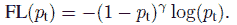
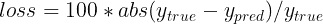
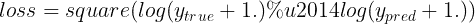
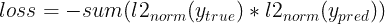
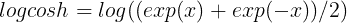

# Keras 损失函数:你需要知道的一切

> 原文：<https://web.archive.org/web/https://neptune.ai/blog/keras-loss-functions>

你已经在 Keras 中创建了一个深度学习模型，你准备了数据，现在你想知道你应该为你的问题选择哪个损失。

我们一会儿会讲到，但首先什么是损失函数？

在深度学习中，计算损失以获得关于模型权重的梯度，并通过反向传播相应地更新那些权重。在每次迭代之后，计算损耗并更新网络，直到模型更新没有在期望的评估度量中带来任何改进。

因此，当您在机器学习项目的(长时间)期间在验证集上继续使用相同的评估指标(如 f1 得分或 AUC)时，可以改变、调整和修改损失，以获得最佳的评估指标性能。

您可以像考虑模型架构或优化器一样考虑损失函数，在选择它时进行一些思考是很重要的。在这篇文章中，我们将探讨:

*   **Keras 中可用的损失函数**以及如何使用它们，
*   如何**在 Keras 中定义自己的自定义损失函数**，
*   如何添加**样品称量**以产生观察敏感损失，
*   如何避免**南斯在**的损失，
*   **如何通过绘图和回调监控损失函数**。

让我们开始吧！

## Keras 损失函数 101

在 Keras 中，损失函数在编译阶段传递，如下所示。

在这个例子中，我们通过创建 loss 类的一个实例来定义 loss 函数。使用类是有利的，因为您可以传递一些附加参数。

```py
from tensorflow import keras
from tensorflow.keras import layers

model = keras.Sequential()
model.add(layers.Dense(64, kernel_initializer='uniform', input_shape=(10,)))
model.add(layers.Activation('softmax'))

loss_function = keras.losses.SparseCategoricalCrossentropy(from_logits=True)
model.compile(loss=loss_function, optimizer='adam')

```

如果您想使用 Keras 内置的损失函数而不指定任何参数，您可以只使用字符串别名，如下所示:

```py
model.compile(loss='sparse_categorical_crossentropy', optimizer='adam')

```

你可能想知道，如何决定使用哪个损失函数？

Keras 中有各种损失函数。其他时候，您可能需要实现自己的定制损失函数。

让我们深入所有这些场景。

## Keras 中有哪些损失函数？

### **二元分类**

当解决只涉及两个类的问题时，二元分类损失函数开始发挥作用。例如，当预测信用卡交易中的欺诈时，交易要么是欺诈的，要么不是。

#### 二元交叉熵

二元交叉熵将计算预测类和真实类之间的交叉熵损失。默认情况下，使用 *sum_over_batch_size* 缩减。这意味着损失将返回批次中每个样本损失的平均值。

```py
y_true = [[0., 1.], [0.2, 0.8],[0.3, 0.7],[0.4, 0.6]]
y_pred = [[0.6, 0.4], [0.4, 0.6],[0.6, 0.4],[0.8, 0.2]]
bce = tf.keras.losses.BinaryCrossentropy(reduction='sum_over_batch_size')
bce(y_true, y_pred).numpy()

```

总和减少意味着损失函数将返回批次中每个样本损失的总和。

```py
bce = tf.keras.losses.BinaryCrossentropy(reduction='sum')
bce(y_true, y_pred).numpy()

```

将减少值设为 none 将返回每样本损失的完整数组。

```py
bce = tf.keras.losses.BinaryCrossentropy(reduction='none')
bce(y_true, y_pred).numpy()
array([0.9162905 , 0.5919184 , 0.79465103, 1.0549198 ], dtype=float32)
```

在二元分类中，使用的激活函数是 sigmoid 激活函数。它将输出限制在 0 到 1 之间。

### **多类分类**

涉及多个类别预测的问题使用不同的损失函数。在这一节中，我们将看几个例子:

#### 范畴交叉熵

CategoricalCrossentropy 还计算真实类和预测类之间的交叉熵损失。标签以 *one_hot* 格式给出。

```py
cce = tf.keras.losses.CategoricalCrossentropy()
cce(y_true, y_pred).numpy()
```

#### 稀疏分类交叉熵

如果有两个或更多的类，并且标签是整数，那么应该使用 SparseCategoricalCrossentropy。

```py
y_true = [0, 1,2]
y_pred = [[0.05, 0.95, 0], [0.1, 0.8, 0.1],[0.1, 0.8, 0.1]]
scce = tf.keras.losses.SparseCategoricalCrossentropy()
scce(y_true, y_pred).numpy()

```

#### 毒物流失

您还可以使用泊松类来计算中毒损失。如果数据集来自泊松分布，例如呼叫中心每小时接到的电话数量，这是一个很好的选择。

```py
y_true = [[0.1, 1.,0.8], [0.1, 0.9,0.1],[0.2, 0.7,0.1],[0.3, 0.1,0.6]]
y_pred = [[0.6, 0.2,0.2], [0.2, 0.6,0.2],[0.7, 0.1,0.2],[0.8, 0.1,0.1]]
p = tf.keras.losses.Poisson()
p(y_true, y_pred).numpy()

```

#### 库尔巴克-莱布勒发散损失

可以使用 KLDivergence 类来计算相对熵。根据 PyTorch 的官方文件:

***KL 散度*** *对于连续分布来说是一种有用的距离度量，在对(离散采样的)连续输出分布空间执行直接回归时通常很有用。*

```py
y_true = [[0.1, 1.,0.8], [0.1, 0.9,0.1],[0.2, 0.7,0.1],[0.3, 0.1,0.6]]
y_pred = [[0.6, 0.2,0.2], [0.2, 0.6,0.2],[0.7, 0.1,0.2],[0.8, 0.1,0.1]]
kl = tf.keras.losses.KLDivergence()
kl(y_true, y_pred).numpy()

```

在多类问题中，使用的激活函数是 softmax 函数。

### **物体检测**

#### 焦点损失

在涉及[不平衡数据](/web/20221027132202/https://neptune.ai/blog/how-to-deal-with-imbalanced-classification-and-regression-data)的分类问题和物体检测问题中，可以使用[焦点损失。](https://web.archive.org/web/20221027132202/https://arxiv.org/pdf/1708.02002.pdf)损失引入了对交叉熵标准的调整。



这是通过改变其形状来实现的，其方式是分配给分类良好的样本的损失是向下加权的。这确保了模型能够平等地从少数和多数类学习。

随着正确类别的置信度增加，通过缩放在零处衰减的因子来缩放交叉熵损失。缩小因子在训练时对无挑战样本的贡献进行加权，并关注有挑战的样本。

```py
import tensorflow_addons as tfa

y_true = [[0.97], [0.91], [0.03]]
y_pred = [[1.0], [1.0], [0.0]]
sfc = tfa.losses.SigmoidFocalCrossEntropy()
sfc(y_true, y_pred).numpy()
array([0.00010971, 0.00329749, 0.00030611], dtype=float32)
```

#### 并集上的广义交集

也可以使用来自 TensorFlow add on 的【Union 上的广义交集损失。并集上的交集(IoU)是对象检测问题中非常常见的度量。然而，IoU 在涉及非重叠边界框的问题上不是很有效。

引入了 Union 上的广义交集来解决 IoU 面临的这一挑战。它确保通过保持 IoU 的比例不变属性、将比较对象的形状属性编码到区域属性中、以及确保在对象重叠的情况下与 IoU 有很强的相关性来实现概括。

```py
gl = tfa.losses.GIoULoss()
boxes1 = tf.constant([[4.0, 3.0, 7.0, 5.0], [5.0, 6.0, 10.0, 7.0]])
boxes2 = tf.constant([[3.0, 4.0, 6.0, 8.0], [14.0, 14.0, 15.0, 15.0]])
loss = gl(boxes1, boxes2)

```

### **回归**

在回归问题中，你必须计算预测值和真实值之间的差异，但通常有许多方法可以做到这一点。

#### 均方误差

MeanSquaredError 类可用于计算预测值和真实值之间的均方误差。

```py
y_true = [12, 20, 29., 60.]
y_pred = [14., 18., 27., 55.]
mse = tf.keras.losses.MeanSquaredError()
mse(y_true, y_pred).numpy()

```

当您希望较大的误差比较小的误差受到更多的惩罚时，请使用均方误差。

#### 平均绝对百分比误差

使用以下函数计算平均绝对百分比误差。



它的计算如下所示。

```py
y_true = [12, 20, 29., 60.]
y_pred = [14., 18., 27., 55.]
mape = tf.keras.losses.MeanAbsolutePercentageError()
mape(y_true, y_pred).numpy()

```

当你想要一个可以直观解释的损失时，考虑使用这个损失。人们很容易理解百分比。这种损失对异常值也是稳健的。

#### 均方对数误差

均方对数误差可以用下面的公式计算:



下面是同样的一个实现:

```py
y_true = [12, 20, 29., 60.]
y_pred = [14., 18., 27., 55.]
msle = tf.keras.losses.MeanSquaredLogarithmicError()
msle(y_true, y_pred).numpy()

```

均方对数误差对低估的惩罚大于高估。当您不想惩罚大的错误时，这是一个很好的选择，因此，它对异常值是健壮的。

#### 余弦相似损失

如果您对计算真实值和预测值之间的余弦相似性感兴趣，您可以使用 cosine similarity 类。其计算方法如下:



**结果是一个介于-1 和 1** 之间的数字。0 表示正交性，而接近-1 的值表示有很大的相似性。

```py
y_true = [[12, 20], [29., 60.]]
y_pred = [[14., 18.], [27., 55.]]
cosine_loss = tf.keras.losses.CosineSimilarity(axis=1)
cosine_loss(y_true, y_pred).numpy()

```

#### 对数损失

LogCosh 类计算预测误差的双曲余弦的对数。



下面是它作为独立函数的实现。

```py
y_true = [[12, 20], [29., 60.]]
y_pred = [[14., 18.], [27., 55.]]
l = tf.keras.losses.LogCosh()
l(y_true, y_pred).numpy()

```

对数损失的工作原理类似于均方误差，但不会受到偶然的严重错误预测的强烈影响。—张量流文档

#### 胡伯损失

对于对异常值不太敏感的回归问题，使用 [Huber 损失](https://web.archive.org/web/20221027132202/https://www.tensorflow.org/api_docs/python/tf/keras/losses/Huber)。

```py
y_true = [12, 20, 29., 60.]
y_pred = [14., 18., 27., 55.]
h = tf.keras.losses.Huber()
h(y_true, y_pred).numpy()

```

### **学习嵌入**

#### 三重损失

你也可以通过 TensorFlow 插件用半硬负挖掘计算[三重态损失](https://web.archive.org/web/20221027132202/https://arxiv.org/abs/1503.03832)。该损失促使具有相同标签的嵌入对之间的正距离小于最小负距离。

```py
import tensorflow_addons as tfa

model.compile(optimizer='adam',
              loss=tfa.losses.TripletSemiHardLoss(),
              metrics=['accuracy'])

```

## 在 Keras 中创建自定义损失函数

有时候没有好的损失，或者你需要做一些修改。让我们来学习如何做到这一点。

可通过定义一个将真实值和预测值作为必需参数的函数来创建自定义损失函数。该函数应该返回一个损失数组。然后可以在编译阶段传递该函数。

```py
def custom_loss_function(y_true, y_pred):
   squared_difference = tf.square(y_true - y_pred)
   return tf.reduce_mean(squared_difference, axis=-1)

model.compile(optimizer='adam', loss=custom_loss_function)

```

让我们看看如何将这个自定义损失函数应用于一组预测值和真实值。

```py
import numpy as np

y_true = [12, 20, 29., 60.]
y_pred = [14., 18., 27., 55.]
cl = custom_loss_function(np.array(y_true),np.array(y_pred))
cl.numpy()

```

## 使用 Keras 损失权重

在训练过程中，可以通过观察或样本来衡量损失函数。权重可以是任意的，但是典型的选择是类权重(标签的分布)。每个观测值按其所属类的分数进行加权(反向)，因此在计算损失时，少数类观测值的损失更为重要。

做到这一点的方法之一是在训练过程中传递类权重。

使用包含每个类的权重的字典来传递权重。您可以使用 [Scikit-learn](https://web.archive.org/web/20221027132202/https://scikit-learn.org/stable/modules/generated/sklearn.utils.class_weight.compute_sample_weight.html) 计算重量，或者根据您自己的标准计算重量。

```py
weights = { 0:1.01300017,1:0.88994364,2:1.00704935, 3:0.97863318,      4:1.02704553, 5:1.10680686,6:1.01385603,7:0.95770152, 8:1.02546573,
               9:1.00857287}
model.fit(x_train, y_train,verbose=1, epochs=10,class_weight=weights)

```

第二种方法是在编译阶段传递这些权重。

```py
weights = [1.013, 0.889, 1.007, 0.978, 1.027,1.106,1.013,0.957,1.025, 1.008]

model.compile(optimizer=tf.keras.optimizers.SGD(),
              loss=tf.keras.losses.SparseCategoricalCrossentropy(),
              loss_weights=weights,
              metrics=['accuracy'])
```

## 如何监控 Keras 损失函数[示例]

当模型正在训练时，在训练和验证集上监视损失函数通常是一个好主意。查看这些学习曲线是模型训练过度拟合或其他问题的良好指示。

如何做到这一点有两个主要选择。

### **使用控制台日志监控 Keras 丢失**

记录和查看损失的最快和最简单的方法是简单地将它们打印到控制台上。

```py
import tensorflow as tf

mnist = tf.keras.datasets.mnist
(x_train, y_train), (x_test, y_test) = mnist.load_data()
x_train, x_test = x_train / 255.0, x_test / 255.0

model = tf.keras.models.Sequential([
   tf.keras.layers.Flatten(input_shape=(28, 28)),
   tf.keras.layers.Dense(512, activation='relu'),
   tf.keras.layers.Dropout(0.2),
   tf.keras.layers.Dense(10, activation='softmax')
])

model.compile(optimizer='sgd',
             loss='sparse_categorical_crossentropy',
             metrics=['accuracy'])

model.fit(x_train, y_train,verbose=1, epochs=10)
```

这种方法的问题是，这些日志很容易丢失，很难看到进展，并且当在远程机器上工作时，您可能无法访问它。

### **使用回调监控 Keras 损失**

另一个更干净的选择是使用回调，它将记录每个批处理和 epoch 结束时的丢失。

你需要决定你想在哪里记录什么，但是这真的很简单。

例如，记录 keras 对 Neptune 的损失可能如下所示:

```py
from keras.callbacks import Callback 

class NeptuneCallback(Callback):
    def on_batch_end(self, batch, logs=None):  
        for metric_name, metric_value in logs.items():
            neptune_run[f"{metric_name}"].log(metric_value)

    def on_epoch_end(self, epoch, logs=None): 
        for metric_name, metric_value in logs.items():
            neptune_run[f"{metric_name}"].log(metric_value)
```

您可以自己创建监控回调，或者使用 keras 库中以及其他与它集成的库中许多可用的 keras 回调之一，如 TensorBoard、 [Neptune](https://web.archive.org/web/20221027132202/https://docs.neptune.ai/essentials/integrations/deep-learning-frameworks/tensorflow-keras) 等。

一旦您准备好回调，您只需将它传递给`model.fit(...)`:

```py
pip install neptune-client neptune-tensorboard
```

```py
import neptune.new as neptune
from neptunecontrib.monitoring.keras import NeptuneMonitor

run = neptune.init(
       project='common/tf-keras-integration',
       api_token='ANONYMOUS'
)

neptune_cbk = NeptuneCallback(run=run, base_namespace='metrics')

model.fit(x_train, y_train, 
          validation_split=0.2, 
          epochs=10, 
          callbacks=[neptune_cbk])
```

并且[在 UI 中监控您的实验学习曲线](https://web.archive.org/web/20221027132202/https://app.neptune.ai/o/common/org/tf-keras-integration/e/TFK-35541/dashboard/metrics-b11ccc73-9ac7-4126-be1a-cf9a3a4f9b74):

## 为什么会发生卡雷损失南

大多数情况下，您记录的损失只是一些常规值，但有时在使用 Keras 损失函数时，您可能会得到 nan。

当这种情况发生时，您的模型将不会更新其权重，并将停止学习，因此需要避免这种情况。

nan 丢失的原因可能有很多，但通常是这样的:

*   训练集中的 nans 将导致失败，
*   训练集中的 NumPy 无穷大也会导致 nans 的丢失，
*   使用未缩放的训练集，
*   使用非常大的 l2 正则化子和高于 1 的学习率，
*   使用了错误的优化函数，
*   大(爆炸)梯度导致训练期间网络权重的大更新。

所以为了避免 nans 中的损失，确保:

*   检查您的训练数据是否适当缩放，并且不包含 nans
*   检查你是否使用了正确的优化器，并且你的学习率不是太大；
*   检查 l2 正则化是否不太大；
*   如果你正面临爆炸梯度问题，你可以:重新设计网络或使用梯度剪辑，使你的梯度有一定的“最大允许模型更新”。

## 最后的想法

希望这篇文章能给你一些 Keras 中损失函数的背景知识。

我们涵盖了:

*   Keras 中内置的损失函数，
*   实现您自己的自定义损失函数，
*   如何增加样品称量以产生观察敏感损失，
*   如何避免损失 nans，
*   你如何想象你的模型在训练时的损失。

欲了解更多信息，请查看 Keras 知识库和 T2 张量流损失函数文档。

### 德里克·姆维蒂

Derrick Mwiti 是一名数据科学家，他对分享知识充满热情。他是数据科学社区的热心贡献者，例如 Heartbeat、Towards Data Science、Datacamp、Neptune AI、KDnuggets 等博客。他的内容在网上被浏览了超过一百万次。德里克也是一名作家和在线教师。他还培训各种机构并与之合作，以实施数据科学解决方案并提升其员工的技能。你可能想看看他在 Python 课程中完整的数据科学和机器学习训练营。

* * *

**阅读下一篇**

## Keras Metrics:您需要知道的一切

10 分钟阅读|作者 Derrick Mwiti |年 6 月 8 日更新

Keras 指标是用于评估深度学习模型性能的函数。为您的问题选择一个好的度量标准通常是一项困难的任务。

*   你需要了解【tf.keras 和 tf.keras 中哪些指标已经可用以及如何使用它们，
*   在许多情况下，您需要**定义您自己的定制指标**，因为您正在寻找的指标没有随 Keras 一起提供。
*   有时，您希望**通过在每个时期后查看 ROC 曲线或混淆矩阵**等图表来监控模型性能。

### 本文将解释一些术语:

*   keras 度量准确性
*   keras 编译指标
*   keras 自定义指标
*   回归的 keras 度量
*   keras 混淆矩阵
*   tf.kerac.metrics.meaniou
*   tf.keras.metrics f1 分数
*   tf.keras.metrics.auc

[Continue reading ->](/web/20221027132202/https://neptune.ai/blog/keras-metrics)

* * *