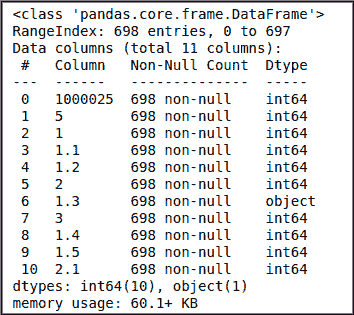
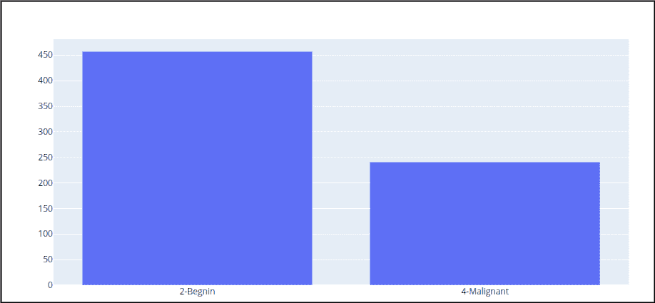
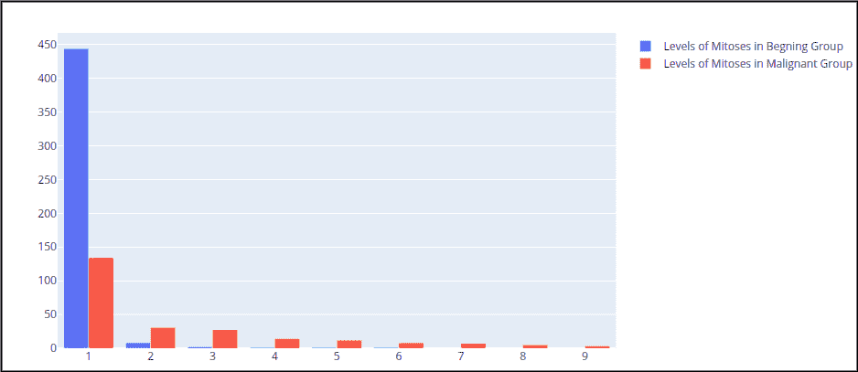
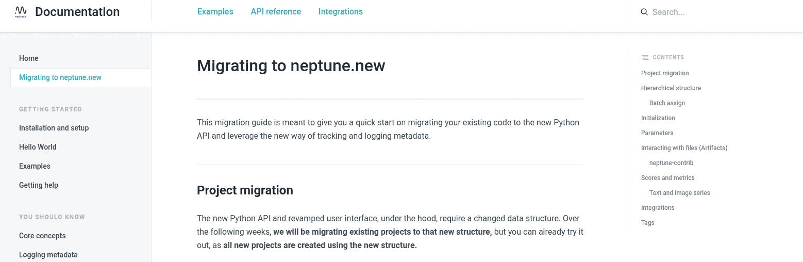
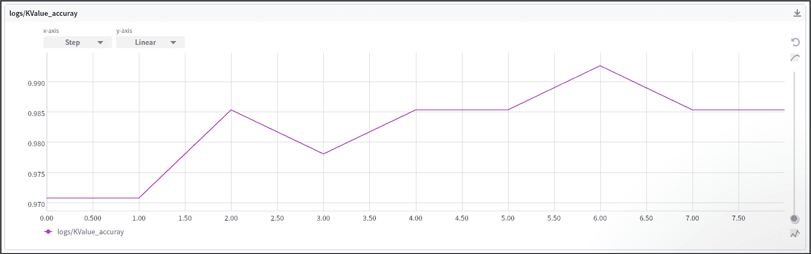
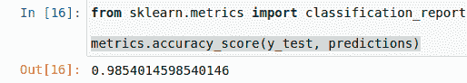

# KNN 算法——解释、机会、局限

> 原文：<https://web.archive.org/web/https://neptune.ai/blog/knn-algorithm-explanation-opportunities-limitations>

k 近邻(KNN)是一个非常简单，易于理解，通用的机器学习算法。它被用于许多不同的领域，如手写检测、图像识别和视频识别。当标记数据过于昂贵或不可能获得时，KNN 最有用，它可以在各种预测类型的问题中实现高精度。

KNN 是一种简单的算法，基于目标函数的局部最小值，用于学习期望精度和准确度的未知函数。该算法还可以找到未知输入的邻域、其范围或距离以及其他参数。它基于“信息增益”的原则——算法找出最适合预测未知值的信息。

在本文中，我们将探索 KNN 算法背后的关键概念，并分析一个真实世界的 KNN 用例。

## 懒惰学习范式与 KNN 算法

众所周知，KNN 是一种不需要任何数据训练的最大似然算法。这与依赖训练数据集对未知数据进行预测的急切学习方法有很大不同。有了 KNN，你根本不需要训练阶段。

KNN 依靠可观测数据的相似性和复杂的距离度量来生成准确的预测。这种技术一开始可能看起来有点违反直觉，不值得信任，但实际上非常可靠。它在许多领域都很流行，包括:

*   ***计算机视觉*** : KNN 执行分类任务。它可以很好地处理图像数据，并且被认为是基于相似性对一堆不同图像进行分类的一个很好的选择。
*   ***内容推荐*** : KNN 对内容推荐很棒。它被用在许多推荐系统引擎中，即使已经有更新的、更强大的系统可用，它仍然是相关的。

## 维度的诅咒

维数灾难意味着 **KNN 在特征数量少的情况下表现最好**。当要素数量增加时，就需要更多的数据。当有更多的数据时，它会产生一个过拟合问题，因为没有人知道哪部分噪声会对模型产生影响。在低维情况下，表现更好(如[顾和邵 2014](https://web.archive.org/web/20221206001844/https://www.researchgate.net/publication/232406523_An_Improved_k-Nearest_Neighbor_Algorithm_for_Text_Categorization) 的研究所示)。

## KNN 内部运作

令人惊讶的是，KNN 算法非常容易理解。对于不在数据集中的观察，该算法将简单地查找 K 个实例，这些实例基于与该观察最近的周长被定义为相似的。任何数据点都属于一个特定的组，如果它足够接近它的话。

对于 **K** 邻居，算法会用它们的输出来计算我们想要预测的观测值的变量 y。

因此:

*   如果 KNN 用于回归任务，预测将基于 K 个最接近的观测值的 ***平均值*** 或 ***中值*** 。
*   如果 KNN 用于分类目的，最接近的观测值的 ***模式*** 将用于预测。

### 近距离观察 KNN 的建筑

假设我们有:

*   一个数据集 ***D*** ，
*   一个定义的距离度量，我们将用它来测量一组观察值之间的距离，
*   以及整数 ***K*** ，表示我们应该考虑建立邻近度的最近邻居的最小数量。

为了预测输出*进行新的观察*，将遵循以下步骤:**

 **1.  计算 ***X*** 可观测值与所有数据点之间的总距离。
2.  保留构成到可观察点***【x .***的较小距离的 ***K*** 观察值
3.  用***【y】***输出取自*观察值:

    1.  应用 ***y*** 扣除的平均值如果是回归问题，
    2.  如果是分类问题，使用 ***y*** 扣款模式。* 
4.  *最终预测将是步骤 3 中计算的值。*
5.  **该算法的详细版本可以在伪代码*中找到:*

 *### 距离和相似性在 KNN 是如何进行的

在其核心，KNN 使用不同种类的距离度量来评估两个数据点的接近程度(它们的相似性)。KNN 的一个核心假设是:

> 给定的两个点彼此越接近，它们就越相关和相似。

几个距离度量确定相关性和相似性。即使有大量的距离函数可供选择，我们也应该始终使用最适合我们数据性质的函数。值得注意的指标包括:

***注*** *:我强烈建议你查阅* [*这篇文章*](https://web.archive.org/web/20221206001844/https://arxiv.org/pdf/1708.04321.pdf) *关于使用 KNN 进行分类任务时距离度量选择的影响。*

大多数 ML 库都提供了现成的度量标准。因此，您不需要从头开始编写代码，但您可能希望这样做只是为了了解它们是如何工作的。

### 选择 K 值

为了选择适合您的数据的 K 值，我们使用不同的 K 值多次运行 KNN 算法。我们将使用准确性作为评估 K 性能的度量。如果精度值与 K 的变化成比例，那么它就是 K 值的一个很好的候选值。

当选择 K 的最佳值时，我们必须记住每组的特征数和样本量。我们的数据集中的特征和组越多，为了找到适当的 k 值，我们需要做出的选择就越大。

当我们把 K 值减小到 1 时，我们的预测变得不稳定。准确性降低，并且度量“F-Measure”对异常值变得更加敏感。为了获得更好的结果，请增加 K 值，直到 F 测量值高于阈值。

此外，您不应该忘记考虑 K 值对样本类分布的影响。如果您倾向于在一个组中有许多人，那么您应该增加 k。相反，如果您的数据集经常在一个组中有大量的人，您需要减少 k。

以下是针对特定数据集改变 K 值的一些示例:

如您所见，使用的邻居越多，分割就越准确。然而，当我们增加 **K** 值直到达到 **N** (数据点的总数)时，我们严重地冒着过度拟合我们的模型的风险，使它不能很好地概括看不见的观察结果。

## KNN 算法的实际使用案例

为了说明我们到目前为止所解释的内容，我们将尝试使用 KNN 对一个众所周知的数据集进行分析，该数据集记录了美国威斯康星州临床患者的乳腺癌症状。

首先，让我们从 [UCI 机器学习库](https://web.archive.org/web/20221206001844/https://archive.ics.uci.edu/ml/datasets/Breast+Cancer+Wisconsin+%28Original%29)下载数据集。您会发现数据文件夹中有每个属性的详细解释和我们将尝试预测的目标变量。

### 设置项目

下载数据集并安装所有必需的软件包:

```py
pip install scikit-learn
pip install matplotlib
pip install pandas

```

导入数据集并以 csv 格式读取:

```py
import pandas as pd

data = pd.read_csv('breast-cancer-wisconsin.data')
data.info()
```



*Description of the dataset | Source: Author*

添加数据集列名:

```py
data.columns = ['Id', 'Clump Thickness', 'Unifomrmity of Cell size', 'Unifomrmity of Cell shape', 'Marginal Adhesion',
                'Single Epithelial Cell Size', 'Bare Nuclei', 'Bland Chromatin', 'Normal Nucleoli', 'Mitoses', 'Class']
```

### 使用 Plotly 库可视化数据

数据集明显不平衡，分布不均匀。如果我们绘制两组目标变量，良性组记录的病例比恶性组多得多。这可以解释为，有些事件比其他事件更不可能发生。

这是一个比较良性和恶性记录之间平衡的图:

```py
import matplotlib.pyplot as plt
import chart_studio.plotly as py
import plotly.graph_objects as go
import plotly.offline as pyoff

target_balance = data['Class'].value_counts().reset_index()
target_balance

target_class = go.Bar(
    name = 'Target Balance',
    x = ['2-Benign, '4-Malignant'],
    y = target_balance['Class']
)

fig = go.Figure(target_class)
pyoff.iplot(fig)
```



*Beginning and Malignant Group Classes | Credit: Author*

另一个有见地的统计数据是两组临床患者的有丝分裂水平。1 级最低，9 级最高。有丝分裂水平是导致肿瘤生长和进化的重要因素。自然地，恶性组将登记更多患有晚期有丝分裂阶段的患者。

```py
beg_class_pat = data.loc[data['Class'] == 2]
mal_class_pat = data.loc[data['Class'] == 4]

Mith_10_beg = beg_class_pat['Mitoses'].value_counts().reset_index()
Mith_10_mal = mal_class_pat['Mitoses'].value_counts().reset_index()
```

```py
fig = go.Figure(data=[
    go.Bar(name='Levels of Mitoses in Begnin Group', x=['1', '2', '3', '4', '5', '6', '7', '8', '9', '10'],
           y=Mith_10_beg['Mitoses']),
    go.Bar(name='Levels of Mitoses in Malignant Group', x=['1', '2', '3', '4', '5', '6', '7', '8', '9', '10'],
           y=Mith_10_mal['Mitoses']),
])
fig.update_layout(barmode='group')
fig.show()
```



*Level of Mitosis in Both clinical Groups | Credit: Author*

### 初始化你的海王星人工智能实验

我通常喜欢从创建一个虚拟环境开始，在那里我将安装项目所需的包。

```py
conda create --name neptune python=3.6
```

*   然后，安装 Neptune 客户端库及其所有依赖项。一个更新的版本已经发布，它包含了很多很酷的新特性和 ML 集成。查看这里:[海王星 Doc 首页](https://web.archive.org/web/20221206001844/https://docs.neptune.ai/migration-guide)。



*New Documentation Website, migrate your old projects to the newest API | Source: [Neptune Docs](https://web.archive.org/web/20221206001844/https://docs.neptune.ai/migration-guide)*

*   安装 Neptune 及其依赖项，并启用 jupyter 集成:

```py
pip  install neptune-client
pip install -U neptune-notebooks
jupyter nbextension enable --py neptune-notebooks
```

*你也可以在 Neptune 的官方文档网站上查看安装设置指南:* [*Neptune Doc* s](https://web.archive.org/web/20221206001844/https://docs.neptune.ai/getting-started/installation)

*   从在 Neptune [中创建你的项目开始。](https://web.archive.org/web/20221206001844/https://docs.neptune.ai/getting-started/installation)
*   获取您的 API 令牌，将您的笔记本与您的 Neptune 会话[连接起来。](https://web.archive.org/web/20221206001844/https://docs.neptune.ai/getting-started/hello-world)
*   启用与 Neptune 的连接:

```py
import neptune.new as neptune

run = neptune.init(
api_token='YOUR_TOKEN_API',
project='aymane.hachcham/KNN-Thorough-Tour',
)
```

*   从你的实验开始。设置我们将使用的所需参数:

```py
run["Algorithm"] = "KNN"

params = {
    "algorithm": auto,
    "leaf_size": 30,
    "metric": minkowski,
    "metric_params": None,
    "N_jobs": None,
    "N_neighbors": None,
    "P": 2
    "weight": uniform
}
run["parameters"] = params
```

*   在开始使用 KNN 模型之前，考虑对数据进行预处理。所有属性都是 int64 类型，没有空值。我们还需要将数据分成训练和测试两部分。

```py
data = data.loc[data['Bare Nuclei'] != '?']
data['Bare Nuclei'] = data['Bare Nuclei'].astype('int64')

features = data.loc[:, data.columns != 'Class']
features = features.loc[:, features.columns != 'Id']
target = data['Class']

x_train, x_test, y_train, y_test = train_test_split(features, target, test_size=0.2, random_state=123) 
```

### 训练模型

#### 选择最佳 K 值

我们将遍历一系列三个不同的 K 值，并尝试查看哪个 K 最适合我们的情况和数据。首先，让我们试着理解 K 到底影响算法什么。如果我们看到最后一个例子，假设所有 6 个训练观察值保持不变，利用给定的 K 值，我们可以制作每个类别的边界。对于算法来说，这是 K 的一个很好很有用的性质。但是，你可能知道，K 的值不是静态的。K 的值随着每次连续的迭代而变化。这意味着第二次我们将为每个类设置不同的边界值。

我们将使用 neptune.log_metric()记录 Neptune 中的每一次 K 迭代。

```py
accuracy_K = []
for k in range(1, 10):
    knn = KNeighborsClassifier(n_neighbors=k)
    knn.fit(x_train, y_train)
    preds = knn.predict(x_test)
    accuracy = metrics.accuracy_score(y_test, y_pred=preds)
    accuracy_K.append(accuracy)
    run['KValue_accuray'].log(accuracy)
```



*KNN log value in Neptune | Credit: Author*

我们观察到达到的最大值是 0.992，并且它出现在 K = 6 时。K = {2，4，5}的其他值是 0.98。由于我们有 3 个以上的候选人共享相同的值，我们可以得出结论，最佳 K 值是 5。

在这个特殊的例子中，我们用闵可夫斯基距离来描述 KNN 模型。但是如果你尝试不同的距离，你可能会得到其他的 K 值。

KNN 分类器如下所示:

```py
KNeighborsClassifier(algorithm='auto', leaf_size=30, metric='minkowski', metric_params=None, n_jobs=None, n_neighbors=5, p=2, weights='uniform')
```

一旦我们确定最佳值 K 为 5，我们将继续使用数据训练模型，并检查其总体准确性得分。

```py
knn = KNeighborsClassifier(n_neighbors=5)
knn.fit(x_train, y_train)
predictions = knn.predict(x_test)
metrics.accuracy_score(y_test, predictions)

```



*Final accuracy score | Credit: Author*

## KNN 限制

KNN 是一个很容易理解的算法。它不依赖于任何在内部工作并做出预测的 ML 模型。KNN 是一种分类算法，只需要知道类别的数量(一个或多个)。这意味着它可以很容易地确定是否应该添加一个新的类别，而不需要任何关于可能有多少其他类别的数据。

这种简单的缺点是，它不能预测罕见的事情(如新的疾病)，KNN 无法预测，因为它不知道一种罕见的事情在其他健康人群中的流行程度。

虽然 KNN 在测试集上产生了很好的准确性，但分类器在时间和内存方面仍然较慢和昂贵。它需要大的存储器来存储用于预测的整个训练数据集。此外，欧几里德距离对量值非常敏感，因此数据集中具有较高量值的要素的权重总是大于具有较低量值的要素的权重。

最后，我们应该记住，KNN 不适合我们上面提到的大规模数据集。

## 结论

希望你现在对 KNN 算法的工作原理有了更多的了解。我们探讨了许多关于 KNN 如何存储整个数据集来进行预测的概念。

KNN 是许多不基于学习模型进行预测的懒惰学习算法之一。KNN 通过平均输入观测值和已有数据之间的相似性，即时做出预测。

我将为您留下一些有用的资源，让您进一步了解 KNN:

感谢您的阅读！***