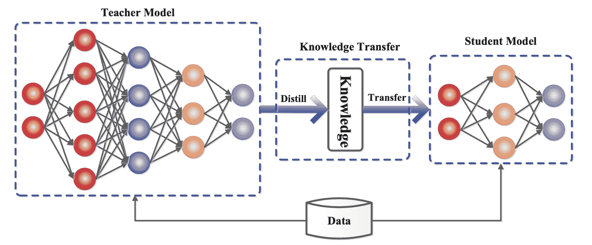
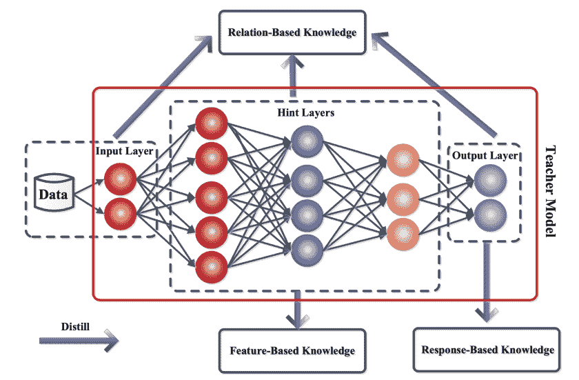
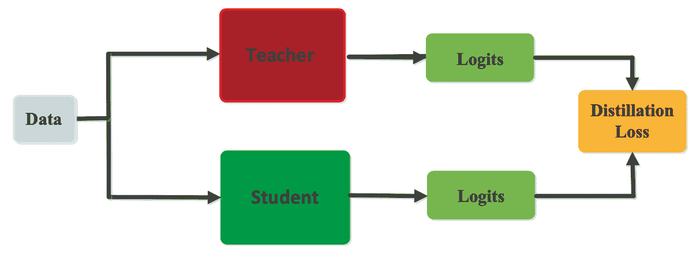
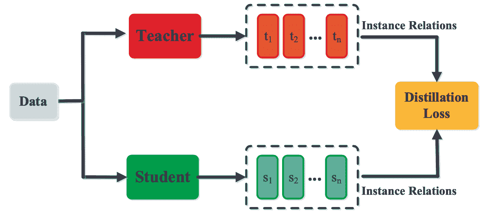
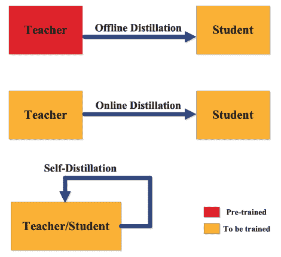
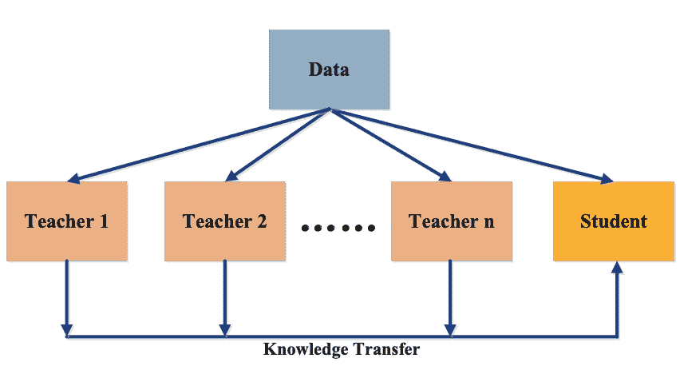
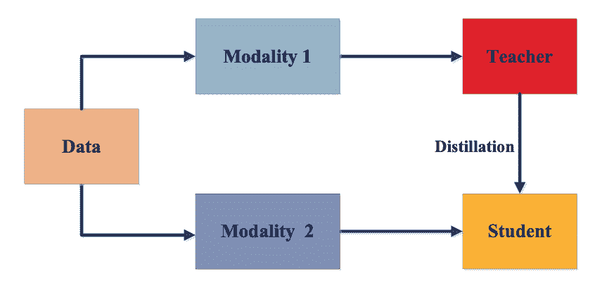

# 知识蒸馏:原理、算法、应用

> 原文：<https://web.archive.org/web/https://neptune.ai/blog/knowledge-distillation>

大规模机器学习和深度学习模型越来越普遍。例如，GPT-3 是在 570 GB 的文本上训练的，包含 1750 亿个参数。然而，尽管训练大型模型有助于提高最先进的性能，但部署这种笨重的模型(尤其是在边缘设备上)并不简单。

此外，大多数数据科学建模工作侧重于训练单个大型模型或不同模型的集合，以便在通常不代表真实世界数据的拒绝验证集上表现良好。

训练和测试目标之间的这种不一致导致了机器学习模型的发展，这些模型在精选的验证数据集上产生良好的准确性，但在对真实世界的测试数据进行推断时，往往无法满足性能、延迟和吞吐量基准。

[知识提取](https://web.archive.org/web/20230303163653/https://towardsdatascience.com/knowledge-distillation-simplified-dd4973dbc764) [ [1](https://web.archive.org/web/20230303163653/https://arxiv.org/abs/1503.02531) ]通过捕获和“提取”复杂的机器学习模型或模型集合中的知识，将其转化为更小的单一模型，更容易部署，而不会显著降低性能，从而帮助克服这些挑战。

在这篇博客中，我将:

*   详细描述知识提炼，其基础**原理，训练方案，和算法**；
*   深入研究知识蒸馏在图像、文本和音频深度学习方面的**应用**。

## 什么是知识升华？

知识提炼指的是将知识从一个大的笨拙的模型或一组模型转移到一个较小的模型的过程，该模型可以在现实世界的约束下实际部署。本质上，它是一种模型压缩的形式，由 Bucilua 及其合作者在 2006 年首次成功演示[ [2](https://web.archive.org/web/20230303163653/https://dl.acm.org/doi/10.1145/1150402.1150464) ]。

知识提炼通常在与包括几个层和模型参数的复杂体系结构相关联的神经网络模型上执行。因此，随着深度学习在过去十年中的出现，以及它在包括语音识别、图像识别和自然语言处理在内的不同领域中的成功，知识提炼技术在实际的现实世界应用中变得更加突出[ [3](https://web.archive.org/web/20230303163653/https://arxiv.org/abs/2006.05525) ]。

部署大型深度神经网络模型的挑战对于具有有限存储器和计算能力的边缘设备尤其相关。为了应对这一挑战，首先提出了一种模型压缩方法[ [2](https://web.archive.org/web/20230303163653/https://dl.acm.org/doi/10.1145/1150402.1150464) ]，将大模型中的知识转移到训练较小的模型中，而不会有任何明显的性能损失。这种从大模型学习小模型的过程被辛顿和他的同事们形式化为“知识蒸馏”框架[ [1](https://web.archive.org/web/20230303163653/https://arxiv.org/abs/1503.02531) ]。

如图 1 所示，在知识提炼中，一个小的“学生”模型学习模仿一个大的“老师”模型，并利用老师的知识来获得相似或更高的准确性。在下一节中，我将更深入地研究知识提炼框架及其底层架构和机制。

*Figure 1\. The teacher-student framework for knowledge distillation | Source: [Arxiv](https://web.archive.org/web/20230303163653/https://arxiv.org/abs/2006.05525)*

## 更深入地挖掘知识精华

知识提炼系统由三个主要部分组成:知识、提炼算法和师生架构。

### 知识

在神经网络中，知识通常指学习到的权重和偏差。同时，在一个大的深度神经网络中，知识的来源具有丰富的多样性。典型的知识提炼使用逻辑作为教师知识的来源，而其他人则关注中间层的权重或激活。其他种类的相关知识包括不同类型的激活和神经元之间的关系或者教师模型本身的参数。

不同形式的知识分为三种不同类型:**基于响应的知识**、**基于特征的知识**和**基于关系的知识**。图 2 展示了教师模型中这三种不同类型的知识。我将在下一节详细讨论这些不同的知识来源。

*Figure 2\. The different kinds of knowledge in a teacher model | Source: [Arxiv](https://web.archive.org/web/20230303163653/https://arxiv.org/abs/2006.05525)*

#### 1.基于响应的知识

如图 2 所示，基于响应的知识关注于教师模型的最终输出层。假设是学生模型将学习模仿教师模型的预测。如图 3 所示，这可以通过使用称为蒸馏损失的损失函数来实现，该损失函数分别捕捉学生和教师模型的逻辑之间的差异。随着这种损失在训练中被最小化，学生模型将变得更善于做出与老师相同的预测。

在像图像分类这样的计算机视觉任务的背景下，软目标包括基于响应的知识。软目标表示输出类的概率分布，通常使用 softmax 函数进行估计。每个软目标对知识的贡献通过一个称为温度的参数来调节。基于软目标的基于响应的知识提取通常用于监督学习的环境中。

*Figure 3\. Response-based knowledge distillation | Source: [Arxiv](https://web.archive.org/web/20230303163653/https://arxiv.org/abs/2006.05525)*

#### 2.基于特征的知识

一个训练有素的教师模型还可以捕获中间层数据的知识，这对于深度神经网络尤其重要。中间层学习辨别特定的特征，并且该知识可以用于训练学生模型。如图 4 所示，目标是训练学生模型学习与教师模型相同的特性激活。蒸馏损失函数通过最小化教师和学生模型的特征激活之间的差异来实现这一点。

*Figure 4\. Feature-based knowledge distillation | Source: [Arxiv](https://web.archive.org/web/20230303163653/https://arxiv.org/abs/2006.05525)*

#### 3.基于关系的知识

除了在神经网络的输出层和中间层中表示的知识之外，捕获特征图之间的关系的知识也可以用于训练学生模型。这种形式的知识，称为基于关系的知识，如图 5 所示。这种关系可以被建模为基于特征表示的特征图、图形、相似矩阵、特征嵌入或概率分布之间的相关性。

*Figure 5\. Relation-based knowledge distillation | Source: [Arxiv](https://web.archive.org/web/20230303163653/https://arxiv.org/abs/2006.05525)*

### 培养

有三种主要类型的方法用于训练学生和教师模型，即离线、在线和自我升华。蒸馏训练方法的分类取决于教师模型是否与学生模型同时被修改，如图 6 所示。

*Figure 6\. Types of knowledge distillation training schemes | Source: [Arxiv](https://web.archive.org/web/20230303163653/https://arxiv.org/abs/2006.05525)*

#### 1.离线蒸馏

离线蒸馏是最常见的方法，其中使用预先训练的教师模型来指导学生模型。在该方案中，教师模型首先在训练数据集上进行预训练，然后从教师模型中提取知识来训练学生模型。鉴于深度学习的最新进展，各种各样的预训练神经网络模型公开可用，可以根据用例充当老师。离线蒸馏是深度学习中的一种既定技术，更容易实现。

#### 2.在线蒸馏

在离线蒸馏中，预先训练好的教师模型通常是大容量的深度神经网络。对于一些用例，预训练的模型可能不可用于离线提取。为了解决这个限制，可以使用在线蒸馏，在单个端到端的培训过程中同时更新教师和学生模型。在线蒸馏可以使用并行计算来操作，从而使其成为一种高效的方法。

#### 3.自蒸馏

如图 6 所示，在自提取中，相同的模型被用于教师和学生模型。例如，来自深层神经网络深层的知识可以用来训练浅层。它可以被认为是在线蒸馏的一个特例，并以几种方式进行实例化。来自教师模型的早期时代的知识可以转移到它的后期时代来训练学生模型。

### 体系结构

师生网络架构的设计对于有效的知识获取和提炼至关重要。通常，在更复杂的教师模型和更简单的学生模型之间存在模型容量差距。这种结构性差距可以通过高效的师生架构优化知识传递来缩小。

由于深度和广度的原因，从深度神经网络传递知识并不简单。最常见的知识转移架构包括学生模型，即:

*   教师模型的更浅版本，具有更少的层和每层更少的神经元，
*   教师模型的量化版本，
*   具有高效基本操作的较小网络，
*   具有优化的全球网络架构的小型网络，
*   和老师一个型号。

除了上述方法之外，在给定特定教师模型的情况下，最近的进展如神经架构搜索也可以用于设计最佳学生模型架构。

## 知识提炼算法

在这一节中，我将重点讨论训练学生模型从教师模型中获取知识的算法。

### 1.对抗蒸馏

最近在生成对抗网络的上下文中概念化的对抗学习用于训练生成器模型和鉴别器模型，该生成器模型学习生成尽可能接近真实数据分布的合成数据样本，该鉴别器模型学习在真实和合成数据样本之间进行鉴别。这一概念已被应用于知识提炼，以使学生和教师模型能够学习真实数据分布的更好表示。

为了满足学习真实数据分布的目标，对抗学习可以用于训练生成器模型，以获得合成训练数据来使用，或者扩充原始训练数据集。第二种基于对抗学习的提取方法集中于鉴别器模型，以基于逻辑或特征图来区分来自学生和教师模型的样本。这种方法有助于学生很好地模仿老师。第三种基于对抗学习的提炼技术集中于在线提炼，其中学生和教师模型被联合优化。

### 2.多师蒸馏

在多教师提取中，一个学生模型从几个不同的教师模型中获取知识，如图 7 所示。使用教师模型的集合可以为学生模型提供不同种类的知识，这比从单个教师模型获得的知识更有益。

来自多个教师的知识可以被组合为所有模型的平均响应。教师传授的知识类型通常基于逻辑和特征表示。如 2.1 节所述，多名教师可以传授不同种类的知识。

*Figure 7\. Multi-teacher distillation | Source: [Arxiv](https://web.archive.org/web/20230303163653/https://arxiv.org/abs/2006.05525)*

### 3.交叉模式蒸馏

图 8 显示了跨模态蒸馏训练方案。在这里，教师接受一种模态的训练，其知识被提炼到需要不同模态知识的学生身上。当在训练或测试期间特定模态的数据或标签不可用时，出现这种情况，因此需要跨模态传递知识。

跨模态提取最常用于视觉领域。例如，来自在标记的图像数据上训练的教师的知识可以用于提取具有未标记的输入域(如光流或文本或音频)的学生模型。在这种情况下，从来自教师模型的图像中学习的特征被用于学生模型的监督训练。跨模态提取对于诸如视觉问答、图像字幕等应用是有用的。

*Figure 8\. Cross-modal distillation | Source: [Arxiv](https://web.archive.org/web/20230303163653/https://arxiv.org/abs/2006.05525)*

### 4.其他人

除了上面讨论的提取算法之外，还有其他几种算法已经被应用于知识提取。

*   **基于图形的提炼**使用图形而不是从教师到学生的单个实例知识来捕捉内部数据关系。图表有两种用途——作为知识传递的手段，以及控制教师知识的传递。在基于图的提取中，图的每个顶点代表一个[自我监督的](/web/20230303163653/https://neptune.ai/blog/self-supervised-learning)老师，该老师可以基于基于响应或基于特征的知识，分别像逻辑和特征图。
*   **基于注意力的提炼**基于使用注意力地图从特征嵌入中转移知识。
*   **无数据提炼**基于因隐私、安全或保密原因而缺乏训练数据集的合成数据。合成数据通常从预先训练的教师模型的特征表示中生成。在其他应用中，GANs 也用于生成合成训练数据。
*   **量子化蒸馏**用于将知识从高精度的教师模型(如 32 位浮点)转移到低精度的学生网络(如 8 位)。
*   **终身学习**基于持续学习、终身学习和元学习的学习机制，积累以前学到的知识并将其转化为未来的学习。
*   **基于神经架构搜索的提取**用于识别合适的学生模型架构，以优化从教师模型的学习。

## 知识提炼的应用

知识提炼已经成功应用于几个机器学习和深度学习用例，如图像识别、NLP 和语音识别。在这一部分，我将强调知识提炼技术的现有应用和未来潜力。

### 1.视力

知识提炼在[计算机视觉](/web/20230303163653/https://neptune.ai/blog/category/computer-vision)领域的应用非常丰富。最先进的计算机视觉模型越来越多地基于深度神经网络，这些网络可以从部署的模型压缩中受益。知识提炼已成功应用于以下用例:

*   图像分类，
*   人脸识别，
*   图像分割，
*   动作识别，
*   物体检测，
*   车道检测，
*   行人检测，
*   面部标志检测，
*   姿势估计，
*   视频字幕，
*   图像检索，
*   阴影检测，
*   文本到图像的合成，
*   视频分类，
*   视觉问答，以及其他[ [3](https://web.archive.org/web/20230303163653/https://arxiv.org/abs/2006.05525) ]。

知识提炼还可以用于交叉分辨率人脸识别等利基用例，其中基于高分辨率人脸教师模型和低分辨率人脸学生模型的架构可以提高模型性能和延迟。由于知识提取可以利用不同种类的知识，包括跨模态数据、多领域、多任务和低分辨率数据，因此可以针对特定的视觉识别用例来训练各种各样的提取的学生模型。

### 2.自然语言处理

考虑到大容量深度神经网络(如语言模型或翻译模型)的流行，针对 [NLP](/web/20230303163653/https://neptune.ai/blog/category/natural-language-processing) 应用的知识提取的应用尤其重要。最先进的语言模型包含数十亿个参数，例如，GPT-3 包含 1750 亿个参数。这比之前最先进的语言模型 BERT 大了几个数量级，它在基础版本中包含 1.1 亿个参数。

因此，知识提炼在 NLP 中非常流行，以获得快速、轻量级的模型，这些模型更容易训练并且计算成本更低。除了语言建模，知识提炼也用于 NLP 用例，如:

*   神经机器翻译，
*   文本生成，
*   问题回答，
*   文档检索，
*   文本识别[ [3](https://web.archive.org/web/20230303163653/https://arxiv.org/abs/2006.05525) ]。

使用知识提炼，可以获得高效和轻量级的 NLP 模型，其可以以较低的存储器和计算需求来部署。师生培训也可以用来解决多语言 NLP 问题，来自多语言模型的知识可以相互转移和共享。

#### 案例研究:蒸馏瓶

[DistilBERT](https://web.archive.org/web/20230303163653/https://sol.sbc.org.br/journals/index.php/jidm/article/download/1895/1775/7066) 是抱脸研发的更小更快更便宜更轻的 BERT 模型[ [4](https://web.archive.org/web/20230303163653/https://arxiv.org/abs/1910.01108v4) ]。在这里，作者预先训练了一个较小的 BERT 模型，该模型可以在各种 NLP 任务上进行微调，具有相当强的准确性。在预训练阶段应用了知识提炼，以获得 BERT 模型的提炼版本，该版本比之前的版本小 40%(6600 万个参数对 1.1 亿个参数)，并且快 60%(对于胶水情绪分析任务的推断，410 秒对 668 秒)，同时保持相当于原始 BERT 模型准确度的 97%的模型性能。在 DistilBERT 中，学生具有与 BERT 相同的架构，并使用一种新颖的三重损失获得，该损失结合了与语言建模、蒸馏和余弦距离损失相关的损失。

### 3.演讲

最先进的语音识别模型也是基于深度神经网络的。现代 ASR 模型是端到端训练的，并且基于包括卷积层、序列到序列模型以及最近的变压器的架构。对于实时、设备上的语音识别，获得更小、更快的模型以获得有效的性能变得至关重要。

演讲中有几个知识提炼的用例:

*   语音识别，
*   口语识别，
*   音频分类，
*   说话人识别，
*   声学事件检测，
*   语音合成，
*   语音增强，
*   抗噪声 ASR，
*   多语言 ASR，
*   重音检测[10]。

#### 案例研究:亚马逊 Alexa 的声学建模

Parthasarathi 和 Strom (2019)利用师生培训为 100 万小时的未标记语音数据生成软目标，其中训练数据集仅由 7000 小时的标记语音组成。教师模型产生了所有输出类的概率分布。给定相同的特征向量，学生模型还在输出类上产生概率分布，并且目标函数优化这两个分布之间的交叉熵损失。在这里，知识提炼有助于简化在大型语音数据语料库上生成目标标签。

## 结论

现代深度学习应用基于笨重的神经网络，具有大容量、内存占用和缓慢的推理延迟。将这样的模型部署到生产中是一个巨大的挑战。知识提炼是一种优雅的机制，用于训练一个更小、更轻、更快、更便宜的学生模型，该模型是从一个大型、复杂的教师模型中派生出来的。在 Hinton 及其同事(2015 年)提出知识提炼的概念后，为获得生产用例的高效和轻量级模型而采用知识提炼方案的情况大幅增加。知识提炼是一项复杂的技术，基于不同类型的知识、训练方案、架构和算法。知识提炼已经在不同的领域取得了巨大的成功，包括计算机视觉、自然语言处理、语音等等。

### 参考

[1]在神经网络中提取知识。Hinton G，Vinyals O，Dean J (2015) NIPS 深度学习和表征学习研讨会。[https://arxiv.org/abs/1503.02531](https://web.archive.org/web/20230303163653/https://arxiv.org/abs/1503.02531)

[2]模型压缩。布西卢阿 C，卡鲁阿纳 R，尼古列斯库-米齐尔 A (2006 年)[https://dl.acm.org/doi/10.1145/1150402.1150464](https://web.archive.org/web/20230303163653/https://dl.acm.org/doi/10.1145/1150402.1150464)

[3]知识升华:一项调查。尤杰，于 B，梅班克 SJ，陶 D (2021) [，](https://web.archive.org/web/20230303163653/https://arxiv.org/abs/2006.05525)

[4]蒸馏伯特，伯特的蒸馏版:更小、更快、更便宜、更轻(2019) Sanh V，出道 L，Chammond J，Wolf t .[https://arxiv.org/abs/1910.01108v4](https://web.archive.org/web/20230303163653/https://arxiv.org/abs/1910.01108v4)

[5]用一百万小时的演讲建立声学模型的经验(2019)斯特罗姆·n·帕萨拉蒂·SHK[https://arxiv.org/abs/1904.01624](https://web.archive.org/web/20230303163653/https://arxiv.org/abs/1904.01624)